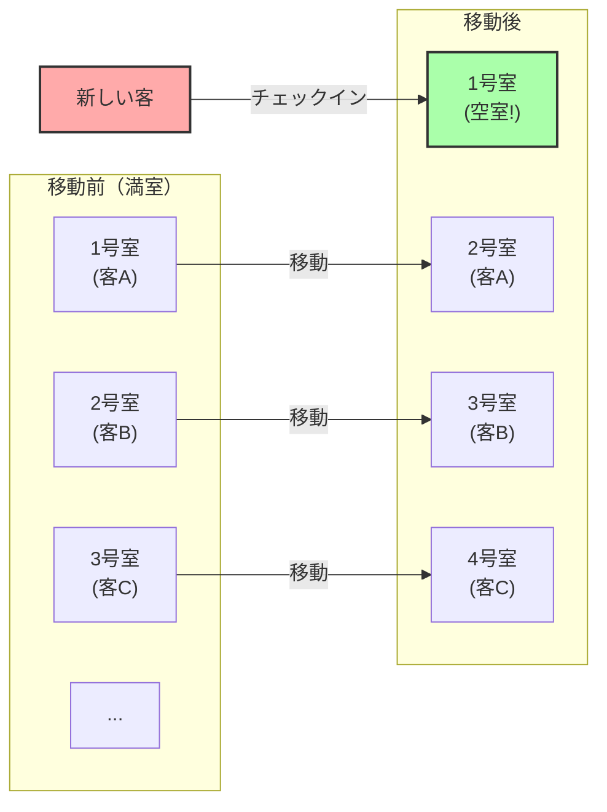
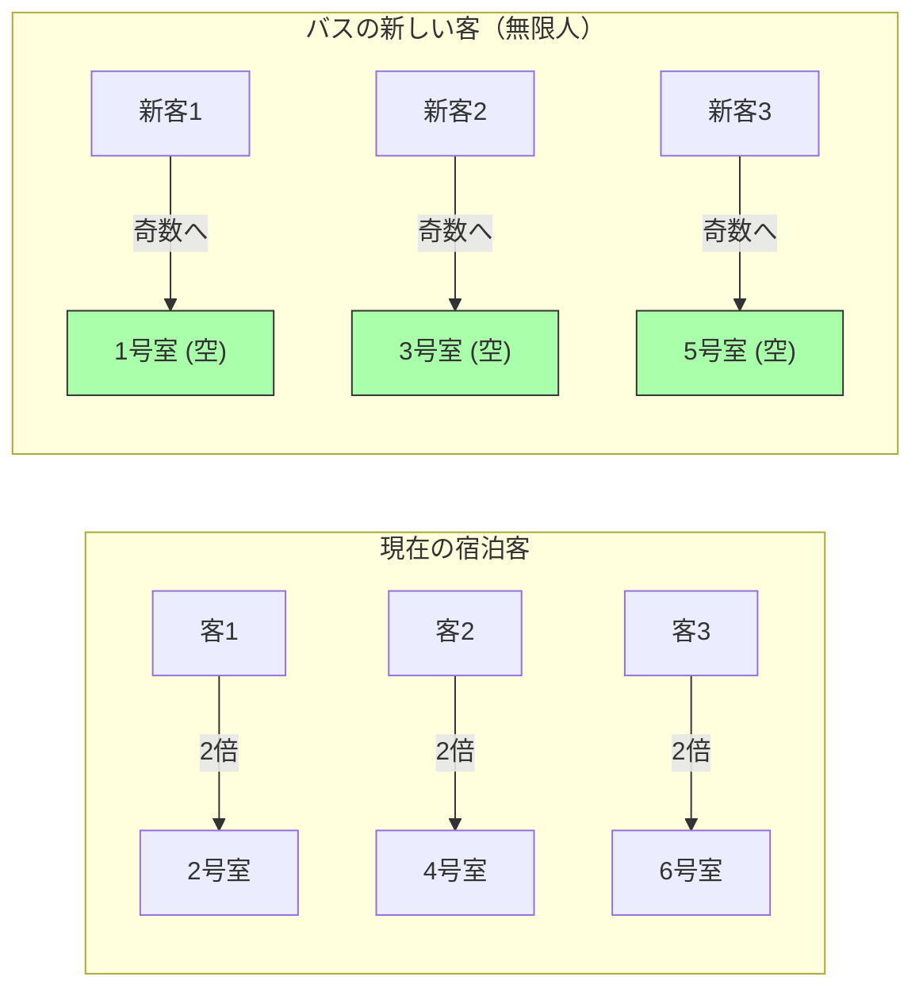

## 1. 究極のホテルへようこそ

ドイツの偉大な数学者ダフィット・ヒルベルトは、「無限」という概念がいかに人間の直感からかけ離れているかを説明するために、次のような面白い思考実験を考案しました。

想像してください。宇宙のどこかに**「ヒルベルトの無限ホテル」**というホテルがあります。
このホテルには、1号室、2号室、3号室……と、番号のついた客室が**無限個**存在しています。

ある日のこと、宇宙中で大イベントがあり、この無限ホテルはすべての部屋に客が入って**「満室」**になってしまいました。
そこへ、疲れ切った1人の旅人がやってきて、「部屋を1つ空けてもらえませんか？」とフロントに尋ねました。

普通のホテルなら「申し訳ありません、満室です」と断るしかありません。
しかし、ここは無限ホテルです。支配人は「かしこまりました。すぐにお部屋をご用意します」と微笑みました。
満室なのに、どうやって新しい客を泊めるのでしょうか？

---

## 2. ケース1：1人の新しい客を泊める方法

支配人は館内放送で、すでに泊まっているすべての客に次のようにアナウンスしました。

**「お客様にお願いいたします。現在の部屋番号に『プラス1』した番号の部屋へ移動してください。」**

するとどうなるでしょうか？
- 1号室の客は、2号室へ移動します。
- 2号室の客は、3号室へ移動します。
- 3号室の客は、4号室へ移動します。
- $n$号室の客は、$n+1$号室へ移動します。

部屋は無限にあるので、「一番最後の部屋の客が追い出される」ということは起こりません。全員が1つ隣の部屋に無事に引っ越すことができます。
そして見事、**1号室が空室になりました。** 新しい旅人は、無事に1号室に泊まることができたのです。

無限の世界では、$\infty + 1 = \infty$ が成り立ちます。
「全体（無限）」の中から「1つ」を取り出しても、全体の大きさは変わらないのです。

---

## 3. ケース2：無限人の新しい客を泊める方法

さて、翌日。ホテルは再び満室状態に戻りました。
そこへ今度は、なんと**「無限人の乗客」を乗せた無限バス**が到着しました。
バスから降りてきた客たちは、「全員分の部屋を用意してくれ！」とフロントに詰め寄ります。

昨日と同じように「プラス1」の移動をお願いしていては、永遠に時間がかかってしまいます。
しかし、支配人は慌てません。再び館内放送を入れました。

**「お客様にお願いいたします。現在の部屋番号を『2倍』した番号の部屋へ移動してください。」**

するとどうなるでしょうか？
- 1号室の客は、2号室へ移動します。
- 2号室の客は、4号室へ移動します。
- 3号室の客は、6号室へ移動します。
- $n$号室の客は、$2n$号室へ移動します。

この移動によって、すでに泊まっていた無限人の客は、**「すべての偶数番号の部屋」**にすっぽりと収まりました。
そして奇跡的なことに、**「すべての奇数番号の部屋（1号室、3号室、5号室...）」が完全に空室になった**のです！

奇数も無限に存在しますから、支配人は無限バスの乗客の先頭から順番に、1号室、3号室、5号室...と案内していけば、全員を泊めることができます。

無限の世界では、$\infty + \infty = \infty$ が成り立ちます。
無限に無限を足しても、やっぱりサイズは同じ「無限」のままなのです。

---

## 4. ケース3：無限台の無限バスが到着したら？

さらに翌日。またしてもホテルは満室です。
そこへなんと、**「無限人の乗客を乗せた無限バスが、無限台」**連なって到着しました。

バス1号車に無限人、バス2号車に無限人、バス3号車に無限人……これが無限台続きます。
さすがの支配人もパニックになりそうですが、彼は数学の天才でした。「素数」を使うことを思いついたのです。

支配人は次のように指示を出しました。

1. **すでにホテルに泊まっている客の移動**
   現在の部屋番号を $n$ としたとき、「$2^n$ 号室」に移動してもらう。
   （1号室 $\rightarrow$ 2号室、2号室 $\rightarrow$ 4号室、3号室 $\rightarrow$ 8号室...）
   これで現在の客は全員収まりました。

2. **バス1号車の客（無限人）の案内**
   客の座席番号を $n$ としたとき、「$3^n$ 号室」に案内する。
   （3号室、9号室、27号室...）

3. **バス2号車の客（無限人）の案内**
   次の素数である 5 を使い、「$5^n$ 号室」に案内する。
   （5号室、25号室、125号室...）

4. **バス $k$ 号車の客（無限人）の案内**
   $k+1$ 番目の素数 $P$ を使い、「$P^n$ 号室」に案内する。

「素因数分解の一意性（どんな数も素数の掛け算の組み合わせは1通りしかない）」という数学の強力な定理により、$2^n, 3^n, 5^n, 7^n \dots$ の部屋番号が他の誰かと重複することは絶対にありません。

こうして支配人は、**「無限 $\times$ 無限」**という途方もない人数の客を、1つの無限ホテルに見事に収容してしまったのです！

---

## 5. 無限には「大きさ」の違いがある（カントールの定理）

ヒルベルトの無限ホテルが教えてくれるのは、**「可算無限（1, 2, 3...と番号を振って数えられる無限）」は、いくら足し合わせても、掛け合わせても、結局は同じサイズの『可算無限』の枠に収まってしまう**という事実です。

しかし、数学者ゲオルグ・カントールは、さらに恐ろしい事実を発見しました。
「自然数」や「分数」は、すべてこの無限ホテルに泊めることができます。しかし、**「実数（無理数を含むすべての小数）」の客がやってきた場合、この無限ホテルを使っても絶対に全員を泊めることができない**のです。

実数の数は、無限ホテルの部屋の数（可算無限）よりも根本的に「大きい（レベルの高い）無限」であることが証明されています。
「無限」という言葉でひとくくりにされがちですが、実は無限の中にも「小さな無限」と「絶対にたどり着けないほど大きな無限」という階層構造（濃度）が存在するのです。

---

## 6. まとめ：人間の直感を破壊する「無限」

ヒルベルトの無限ホテルは、私たちの日常生活で培われた「有限の常識」がいかに「無限の世界」では通用しないかを、鮮やかに描き出しています。

「全体は部分よりも大きい」
「満室のホテルには誰も入れない」
「無限に無限を足したら、もっと大きくなる」

こうした当たり前の直感は、すべて見事に裏切られます。
無限の世界は、パラドックス（直感に反する真理）の宝庫です。数学者たちはこのパラドックスを恐れるのではなく、論理の力でねじ伏せ、分類し、現代の集合論という美しい体系を作り上げました。

次に「ホテルが満室です」と断られたときは、ぜひ「もしこのホテルがヒルベルトの無限ホテルだったらな」と想像してみてください。
