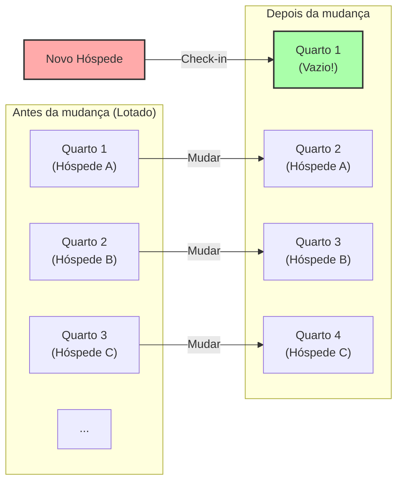

## 1. Bem-vindo ao Hotel Definitivo

O grande matemático alemão David Hilbert concebeu o seguinte experimento mental interessante para explicar o quão distante o conceito de "infinito" está da intuição humana.

Imagine. Em algum lugar do universo existe um hotel chamado **"O Grande Hotel de Hilbert"**.
Neste hotel, existem **infinitos** quartos numerados: quarto 1, quarto 2, quarto 3...

Certo dia, houve um grande evento no universo, e todos os quartos deste hotel infinito foram ocupados, ficando **"lotado"**.
Foi então que um viajante exausto chegou e perguntou na recepção: "Vocês poderiam me arranjar um quarto?"

Em um hotel normal, a única resposta seria: "Desculpe, estamos lotados."
Porém, este é um hotel infinito. O gerente sorriu e disse: "Certamente. Vou preparar o seu quarto imediatamente."
Mesmo estando lotado, como ele hospedará um novo cliente?

---

## 2. Caso 1: Como hospedar um novo hóspede

O gerente fez um anúncio pelo sistema de som para todos os hóspedes já acomodados:

**"Atenção senhores hóspedes. Por favor, mudem-se para o quarto com o número 'mais um' em relação ao seu quarto atual."**

Então, o que acontece?
- O hóspede do quarto 1 muda-se para o quarto 2.
- O hóspede do quarto 2 muda-se para o quarto 3.
- O hóspede do quarto 3 muda-se para o quarto 4.
- O hóspede do quarto $n$ muda-se para o quarto $n+1$.

Como há infinitos quartos, nunca ocorrerá de "o hóspede do último quarto ser expulso". Todos conseguirão mudar-se em segurança para o quarto ao lado.
E, maravilhosamente, **o quarto 1 ficou vazio.** O novo viajante pôde se hospedar no quarto 1 sem problemas.

No mundo do infinito, $\infty + 1 = \infty$ é válido.
Mesmo tirando "um" do "todo (infinito)", o tamanho do todo não muda.

---

## 3. Caso 2: Como hospedar infinitos novos hóspedes

Bem, no dia seguinte. O hotel voltou a ficar lotado.
E então chegou um **ônibus infinito transportando "infinitos passageiros"**.
Os passageiros desceram do ônibus e exigiram na recepção: "Queremos quartos para todos!"

Se ele pedir a mudança de "mais um" como no dia anterior, isso levaria uma eternidade.
Mas o gerente não entra em pânico. Ele faz outro anúncio pelo sistema de som.

**"Atenção senhores hóspedes. Por favor, mudem-se para o quarto cujo número é o 'dobro' do seu quarto atual."**

Então, o que acontece?
- O hóspede do quarto 1 muda-se para o quarto 2.
- O hóspede do quarto 2 muda-se para o quarto 4.
- O hóspede do quarto 3 muda-se para o quarto 6.
- O hóspede do quarto $n$ muda-se para o quarto $2n$.

Com essa mudança, os infinitos hóspedes que já estavam lá se acomodaram perfeitamente em **"todos os quartos de número par"**.
E, milagrosamente, **"todos os quartos de número ímpar (quarto 1, quarto 3, quarto 5...)" ficaram completamente vazios**!

```mermaid
graph LR
    subgraph "Hóspedes atuais"
        G1["Hóspede 1"] -->|Dobro| R2["Quarto 2"]
        G2["Hóspede 2"] -->|Dobro| R4["Quarto 4"]
        G3["Hóspede 3"] -->|Dobro| R6["Quarto 6"]
    end
    
    subgraph "Novos hóspedes do ônibus (infinitos)"
        N1["Novo Hóspede 1"] -->|Para ímpar| R1["Quarto 1 (Vazio)"]
        N2["Novo Hóspede 2"] -->|Para ímpar| R3["Quarto 3 (Vazio)"]
        N3["Novo Hóspede 3"] -->|Para ímpar| R5["Quarto 5 (Vazio)"]
    end
    
    style R1 fill:#aaffaa,stroke:#333
    style R3 fill:#aaffaa,stroke:#333
    style R5 fill:#aaffaa,stroke:#333
```

Como também há infinitos números ímpares, o gerente pode orientar os passageiros do ônibus infinito, um por um, para o quarto 1, quarto 3, quarto 5... e conseguir hospedar a todos.

No mundo do infinito, $\infty + \infty = \infty$ é válido.
Mesmo somando infinito a infinito, o tamanho continua sendo o mesmo "infinito".

---

## 4. Caso 3: E se chegarem infinitos ônibus infinitos?

Ainda no dia seguinte. O hotel estava lotado mais uma vez.
E então, para surpresa, **"infinitos ônibus infinitos, cada um com infinitos passageiros"** chegaram em fila.

Infinitas pessoas no ônibus 1, infinitas pessoas no ônibus 2, infinitas pessoas no ônibus 3... e isso continuava em infinitos ônibus.
Até o gerente quase entrou em pânico, mas ele era um gênio da matemática. Ele teve a ideia de usar "números primos".

O gerente deu as seguintes instruções:

1. **Mudança dos hóspedes que já estão no hotel**
   Seja $n$ o número do quarto atual, ele pede para que se mudem para o "quarto $2^n$".
   (Quarto 1 $\rightarrow$ quarto 2, quarto 2 $\rightarrow$ quarto 4, quarto 3 $\rightarrow$ quarto 8...)
   Com isso, todos os hóspedes atuais foram acomodados.

2. **Orientação dos hóspedes do ônibus 1 (infinitas pessoas)**
   Seja $n$ o número do assento do passageiro, eles são direcionados para o "quarto $3^n$".
   (Quarto 3, quarto 9, quarto 27...)

3. **Orientação dos hóspedes do ônibus 2 (infinitas pessoas)**
   Usando o próximo número primo, o 5, eles são direcionados para o "quarto $5^n$".
   (Quarto 5, quarto 25, quarto 125...)

4. **Orientação dos hóspedes do ônibus $k$ (infinitas pessoas)**
   Usando o $k+1$-ésimo número primo $P$, eles são direcionados para o "quarto $P^n$".

Pelo poderoso teorema matemático da "unicidade da fatoração em primos (qualquer número tem apenas uma única combinação de multiplicação de números primos)", é absolutamente impossível que os números dos quartos $2^n, 3^n, 5^n, 7^n \dots$ se sobreponham com os de qualquer outra pessoa.

Assim, o gerente conseguiu acomodar o número inimaginável de hóspedes **"infinito $\times$ infinito"** em um único hotel infinito!

---

## 5. Existem diferenças de "tamanho" no infinito (Teorema de Cantor)

O que o Grande Hotel de Hilbert nos ensina é o fato de que **o "infinito enumerável (o infinito que pode ser contado com números 1, 2, 3...)", não importa quanto você o some ou multiplique, sempre se encaixará no mesmo tamanho de "infinito enumerável"**.

No entanto, o matemático Georg Cantor descobriu um fato ainda mais assustador.
"Números naturais" e "frações" podem todos ser hospedados neste hotel infinito. Porém, **se chegarem os "números reais (todos os decimais, incluindo números irracionais)", será absolutamente impossível hospedar todos eles, mesmo usando este hotel infinito**.

Foi provado que a quantidade de números reais é fundamentalmente um "infinito maior (de nível mais alto)" do que a quantidade de quartos do hotel infinito (infinito enumerável).
Costumamos colocar tudo sob a palavra "infinito", mas na verdade existe uma estrutura hierárquica (cardinalidade) dentro do infinito, desde "infinitos pequenos" até "infinitos tão grandes que são absolutamente inalcançáveis".

---

## 6. Conclusão: O "infinito" que destrói a intuição humana

O Grande Hotel de Hilbert ilustra vividamente como o "senso comum do finito" cultivado em nossa vida diária não se aplica ao "mundo do infinito".

"O todo é maior que a parte"
"Ninguém pode entrar em um hotel lotado"
"Se você somar infinito com infinito, fica maior"

Todas essas intuições óbvias são espetacularmente traídas.
O mundo do infinito é um tesouro de paradoxos (verdades contrárias à intuição). Os matemáticos, em vez de temerem esses paradoxos, os dominaram pelo poder da lógica, classificaram-nos e criaram o belo sistema moderno da teoria dos conjuntos.

Da próxima vez que você ouvir "o hotel está lotado", por favor, imagine: "E se este hotel fosse o Grande Hotel de Hilbert?".
