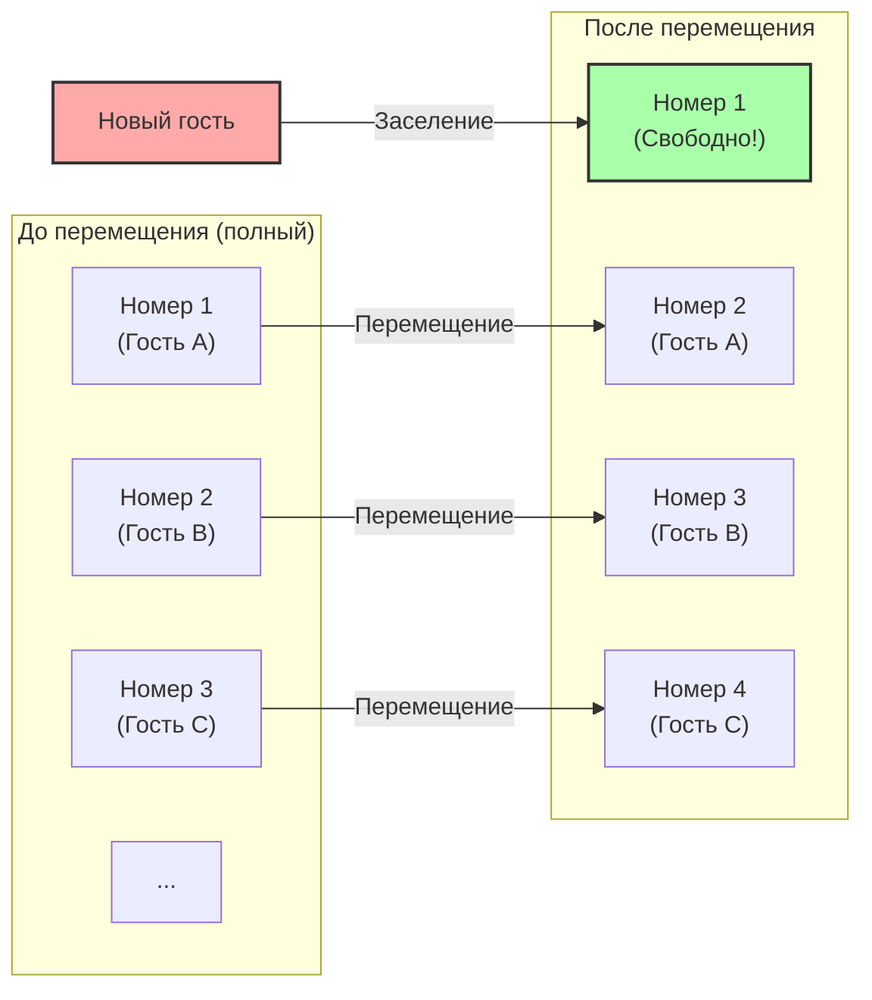
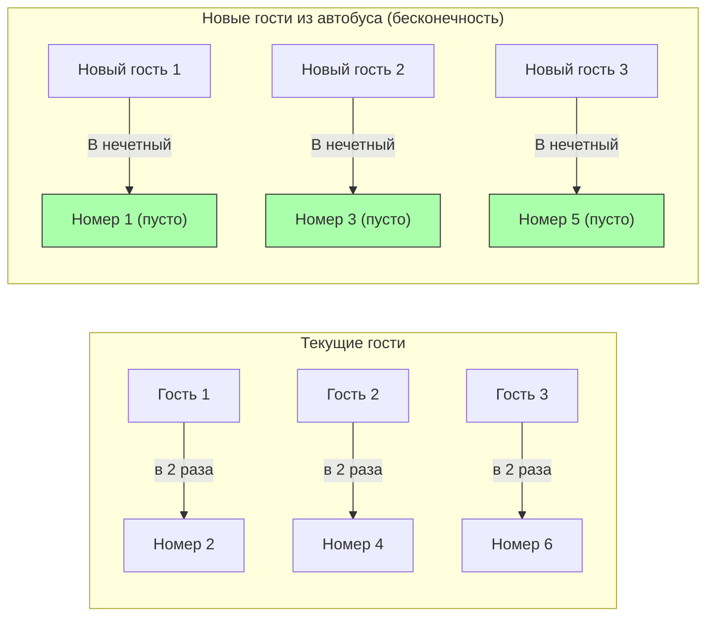

## 1. Добро пожаловать в абсолютный отель

Великий немецкий математик Давид Гильберт придумал следующий забавный мысленный эксперимент, чтобы проиллюстрировать, насколько концепция «бесконечности» далека от человеческой интуиции.

Представьте себе: где-то во Вселенной находится отель под названием **«Отель бесконечности Гильберта»**.
В этом отеле существует **бесконечное** количество пронумерованных номеров: номер 1, номер 2, номер 3 и так далее.

В один прекрасный день во Вселенной произошло грандиозное событие, и все номера в этом бесконечном отеле были заняты, он оказался **«заполнен»**.
В этот момент прибывает уставший путешественник и спрашивает на стойке регистрации: «Не могли бы вы найти для меня один номер?»

Обычный отель мог бы только отказаться, сказав: «Извините, свободных мест нет».
Однако это отель бесконечности. Менеджер улыбнулся и ответил: «Конечно. Сейчас подготовим для вас номер».
Как же можно разместить нового гостя, если отель переполнен?

---

## 2. Случай 1: Как разместить 1 нового гостя

Менеджер по системе громкой связи отеля сделал следующее объявление для всех уже проживающих гостей:

**«Уважаемые гости, пожалуйста, переместитесь в номер, номер которого равен вашему текущему номеру "плюс 1".»**

Что же произойдет?
- Гость из номера 1 переместится в номер 2.
- Гость из номера 2 переместится в номер 3.
- Гость из номера 3 переместится в номер 4.
- Гость из номера $n$ переместится в номер $n+1$.

Так как комнат бесконечное множество, ситуации, при которой «гостя из самой последней комнаты выгонят», не произойдет. Все благополучно переезжают в соседнюю комнату.
И вот, **номер 1 стал свободным.** Новый путешественник смог благополучно заселиться в номер 1.

В мире бесконечности справедливо равенство $\infty + 1 = \infty$.
Даже если прибавить или отнять «один» от «целого (бесконечности)», размер целого не изменится.

---

## 3. Случай 2: Как разместить бесконечное число новых гостей

Итак, на следующий день. Отель снова вернулся в состояние заполненности.
И вот прибывает **бесконечный автобус с «бесконечным числом пассажиров»**.
Гости, выходящие из автобуса, подходят к стойке регистрации и требуют: «Подготовьте номера для всех!»

Если просить переместиться на «плюс 1», как вчера, это займет вечность.
Но менеджер не паникует. Он снова делает объявление по громкой связи:

**«Уважаемые гости, пожалуйста, переместитесь в номер, номер которого в "2 раза" больше вашего текущего номера.»**

Что же произойдет?
- Гость из номера 1 переместится в номер 2.
- Гость из номера 2 переместится в номер 4.
- Гость из номера 3 переместится в номер 6.
- Гость из номера $n$ переместится в номер $2n$.

Благодаря этому перемещению бесконечное число уже проживающих гостей идеально разместилось во **«всех номерах с четными номерами»**.
И чудесным образом **«все номера с нечетными номерами (номер 1, номер 3, номер 5...)» стали совершенно свободными**!

Так как нечетных чисел также бесконечно много, менеджер может по очереди направлять пассажиров из бесконечного автобуса в номера 1, 3, 5... и таким образом разместить всех.

В мире бесконечности справедливо равенство $\infty + \infty = \infty$.
Даже если к бесконечности прибавить бесконечность, размер останется тем же — «бесконечностью».

---

## 4. Случай 3: Что если прибудет бесконечное число бесконечных автобусов?

На следующий день. Отель снова заполнен.
Но вот прибывает **бесконечная колонна из «бесконечных автобусов, каждый из которых перевозит бесконечное число пассажиров»**.

Бесконечное число людей в автобусе №1, бесконечное число в автобусе №2, бесконечное число в автобусе №3... и так до бесконечности.
Тут бы и менеджеру поддаться панике, но он был математическим гением. Он догадался использовать «простые числа».

Менеджер отдал следующие распоряжения:

1. **Перемещение уже проживающих в отеле гостей**
   Если текущий номер комнаты равен $n$, гости должны переехать в номер «$2^n$».
   (Номер 1 $\rightarrow$ номер 2, номер 2 $\rightarrow$ номер 4, номер 3 $\rightarrow$ номер 8...)
   Таким образом, все текущие гости размещены.

2. **Размещение гостей из автобуса №1 (бесконечное число)**
   Если номер места гостя равен $n$, направить его в номер «$3^n$».
   (Номер 3, номер 9, номер 27...)

3. **Размещение гостей из автобуса №2 (бесконечное число)**
   Используя следующее простое число 5, направить их в номер «$5^n$».
   (Номер 5, номер 25, номер 125...)

4. **Размещение гостей из автобуса №$k$ (бесконечное число)**
   Используя $k+1$-е простое число $P$, направить их в номер «$P^n$».

Благодаря мощной математической теореме об «однозначности разложения на простые множители» (любое число может быть представлено в виде произведения простых чисел только одним способом), номера комнат $2^n, 3^n, 5^n, 7^n \dots$ абсолютно никогда не совпадут ни с чьими другими.

Таким образом, менеджер блестяще разместил в одном бесконечном отеле невероятное количество гостей: **«бесконечность $\times$ бесконечность»**!

---

## 5. В бесконечностях есть разница в «размерах» (Теорема Кантора)

Отель бесконечности Гильберта учит нас тому, что **«счетная бесконечность (бесконечность, которую можно пересчитать, присвоив номера 1, 2, 3...)», сколько бы вы ее ни складывали или ни умножали, в конечном итоге умещается в рамки «счетной бесконечности» того же размера**.

Однако математик Георг Кантор открыл еще более пугающий факт.
Всех «натуральных» или «дробных» чисел (рациональных) можно заселить в этот бесконечный отель. Но **если прибудут гости, являющиеся «действительными числами (все десятичные дроби, включая иррациональные)», то даже в этом бесконечном отеле невозможно будет разместить всех**.

Доказано, что множество действительных чисел является фундаментально «бóльшей (бесконечностью более высокого уровня)», чем количество номеров в бесконечном отеле (счетная бесконечность).
Хотя мы склонны обобщать все словом «бесконечность», на самом деле внутри нее существует иерархическая структура (мощность): от «малых бесконечностей» до «настолько больших бесконечностей, что их невозможно достичь».

---

## 6. Заключение: «Бесконечность», разрушающая человеческую интуицию

Отель бесконечности Гильберта ярко демонстрирует, как наш «конечный здравый смысл», взращенный в повседневной жизни, не работает в «мире бесконечности».

«Целое больше своей части»
«В полностью занятом отеле нет мест ни для кого»
«Если к бесконечности прибавить бесконечность, она станет больше»

Все эти очевидные интуитивные представления с блеском опровергаются.
Мир бесконечности — это сокровищница парадоксов (истин, противоречащих интуиции). Математики не боялись этих парадоксов; силой логики они подчинили их, классифицировали и создали прекрасную систему современной теории множеств.

В следующий раз, когда вам откажут, сказав: «Отель полностью занят», обязательно представьте себе: «А что, если бы этот отель был Отелем бесконечности Гильберта».
