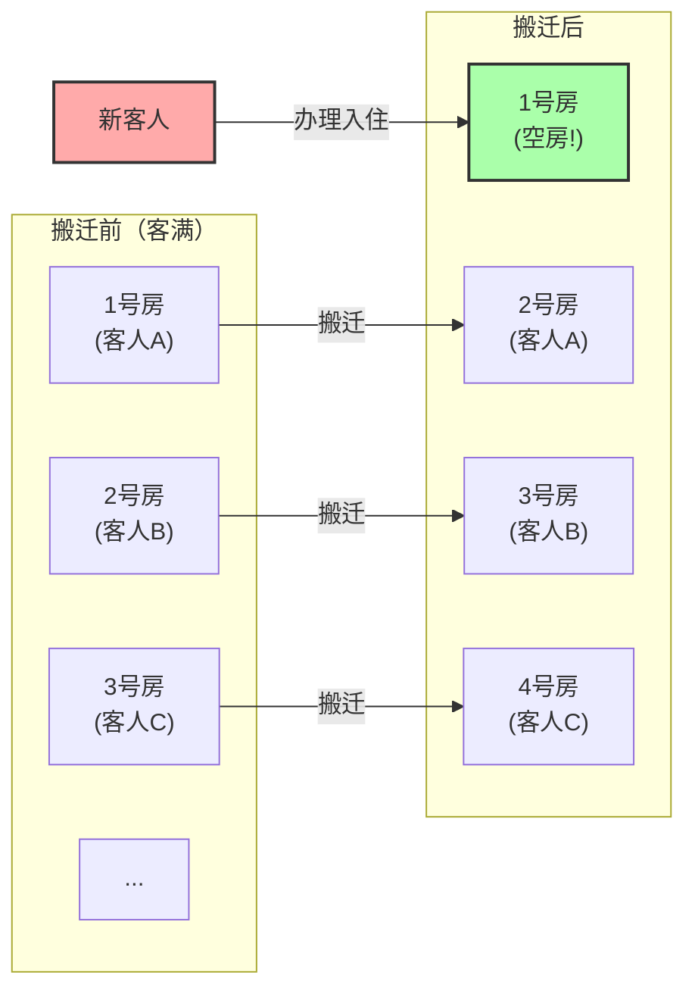
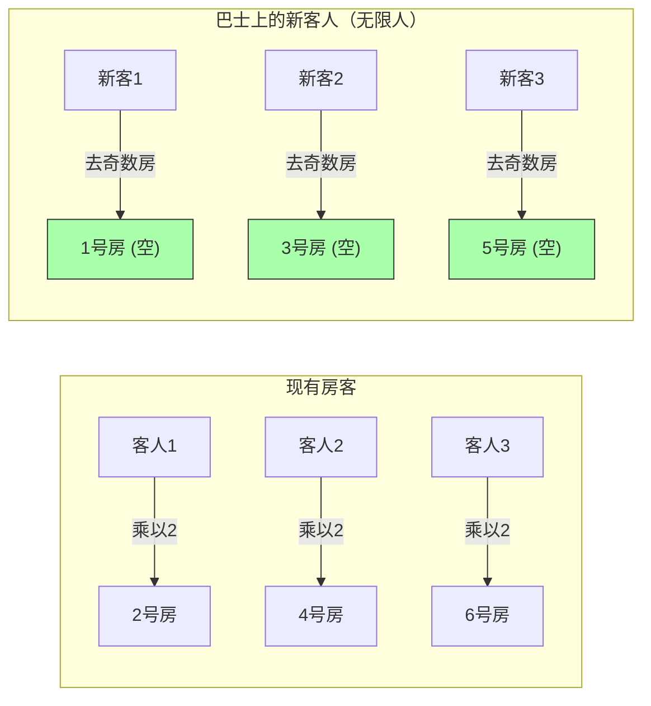

## 1. 欢迎来到终极旅馆

德国伟大的数学家大卫·希尔伯特（David Hilbert），为了说明“无限”这个概念是多么违背人类的直觉，构思了以下这个有趣的思维实验。

请想象一下。在宇宙的某个地方，有一家名叫**“希尔伯特无限旅馆”**的旅馆。
这家旅馆有1号房、2号房、3号房……总共存在着**无限个**带有编号的房间。

有一天，宇宙中举办了一场盛大的活动，这家无限旅馆的所有房间都住满了客人，宣告**“客满”**。
就在这时，一位疲惫不堪的旅行者来到前台，问道：“能给我腾出一间空房吗？”

如果是普通的旅馆，只能拒绝说：“非常抱歉，我们已经客满了。”
但是，这里可是无限旅馆。经理微笑着回答：“好的，马上为您准备房间。”
明明已经客满，要怎么让新客人住进来呢？

---

## 2. 案例1：安排1位新客人入住的方法

经理通过馆内广播，向所有已经入住的客人播报了如下通知：

**“各位客人请注意。请各位搬到当前房间号‘加1’的房间。”**

这样一来会发生什么呢？
- 1号房的客人，搬到了2号房。
- 2号房的客人，搬到了3号房。
- 3号房的客人，搬到了4号房。
- $n$号房的客人，搬到了$n+1$号房。

由于房间是无限的，所以不会发生“最后一间房的客人被赶出去”的情况。所有人都能顺利地搬到隔壁的房间。
而且奇妙的是，**1号房空出来了。** 新来的旅行者顺利地住进了1号房。

在无限的世界里，$\infty + 1 = \infty$ 是成立的。
从“整体（无限）”中拿出“1个”，整体的大小并不会改变。

---

## 3. 案例2：安排无限位新客人入住的方法

到了第二天。旅馆再次恢复了客满状态。
没想到这次，一辆载着**“无限位乘客”的无限巴士**到达了。
从巴士上下来的客人们涌向前台，要求：“给我们所有人准备房间！”

如果像昨天那样拜托大家“加1”搬迁的话，需要花费永远也走不到头的时间。
然而，经理并没有慌张。他再次进行了馆内广播。

**“各位客人请注意。请各位搬到当前房间号‘乘以2’的房间。”**

这样一来会发生什么呢？
- 1号房的客人，搬到了2号房。
- 2号房的客人，搬到了4号房。
- 3号房的客人，搬到了6号房。
- $n$号房的客人，搬到了$2n$号房。

通过这次搬迁，原本已经入住的无限位客人，被完完全全地安置在了**“所有偶数号的房间”**里。
而奇迹般的是，**“所有奇数号的房间（1号房、3号房、5号房...）”完全空出来了**！

由于奇数也是无限的，所以经理只要按无限巴士乘客的顺序，依次将他们引导至1号房、3号房、5号房...就可以让所有人住下了。

在无限的世界里，$\infty + \infty = \infty$ 是成立的。
无限加上无限，结果在大小上依然是相等的“无限”。

---

## 4. 案例3：如果有无限辆无限巴士到达呢？

又到了第二天。旅馆又是客满状态。
谁知这次，竟然到达了**“无限辆载有无限位乘客的无限巴士”**。

1号巴士上有无限人，2号巴士上有无限人，3号巴士上有无限人……就这样有无限辆巴士排成一列。
这下就连经理也快要恐慌了，但他是一位数学天才。他想到了使用“质数”。

经理发出了如下指示：

1. **让已经住在旅馆的客人搬迁**
   设当前的房间号为 $n$，请客人搬到“$2^n$ 号房”。
   （1号房 $\rightarrow$ 2号房、2号房 $\rightarrow$ 4号房、3号房 $\rightarrow$ 8号房...）
   这样现有的客人就全部安置好了。

2. **引导1号巴士的客人（无限人）**
   设客人的座位号为 $n$，引导至“$3^n$ 号房”。
   （3号房、9号房、27号房...）

3. **引导2号巴士的客人（无限人）**
   使用下一个质数 5，引导至“$5^n$ 号房”。
   （5号房、25号房、125号房...）

4. **引导第 $k$ 号巴士的客人（无限人）**
   使用第 $k+1$ 个质数 $P$，引导至“$P^n$ 号房”。

根据数学中一个强大的定理“算术基本定理（任何大于1的自然数都可以唯一地分解为质数的乘积）”，$2^n, 3^n, 5^n, 7^n \dots$ 这些房间号绝对不可能与其他任何人发生重复。

就这样，经理将**“无限 $\times$ 无限”**这样难以估量的庞大客流，完美地容纳进了一家无限旅馆中！

---

## 5. 无限也有“大小”之分（康托尔定理）

希尔伯特无限旅馆告诉我们一个事实：**“可数无限（可以像1, 2, 3...这样标号计数的无限）”，无论怎么相加、怎么相乘，最终都会落入相同大小的“可数无限”的框架内**。

然而，数学家格奥尔格·康托尔（Georg Cantor）发现了一个更可怕的事实。
“自然数”和“分数”，全都能住进这家无限旅馆。但是，**如果来的是“实数（包含无理数在内的所有小数）”的客人，即使使用这家无限旅馆也绝对无法让所有人住下**。

数学证明，实数的数量，在根本上是比无限旅馆房间数量（可数无限）“更大（级别更高）的无限”。
虽然常常被笼统地称为“无限”，但实际上在无限之中，也存在着“较小的无限”和“无论如何也达不到的巨大的无限”这种层级结构（势）。

---

## 6. 总结：颠覆人类直觉的“无限”

希尔伯特无限旅馆，生动地描绘了我们在日常生活中培养出的“有限的常识”，在“无限的世界”里是如何行不通的。

“整体大于部分”
“客满的旅馆进不去任何人”
“无限加上无限会变得更大”

这些理所当然的直觉，全都被完美地推翻了。
无限的世界，是悖论（违背直觉的真理）的宝库。数学家们并没有害怕这些悖论，而是用逻辑的力量将其征服、分类，并建立起了现代集合论这一美丽的体系。

下次当你被拒绝说“旅馆客满”时，请务必想象一下“如果这家旅馆是希尔伯特无限旅馆就好了”。
