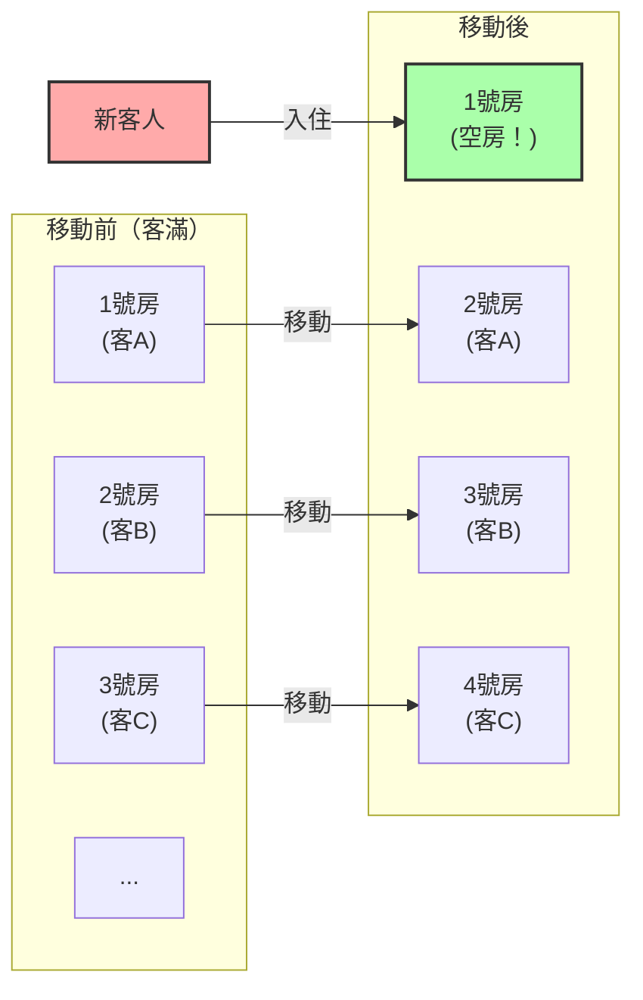
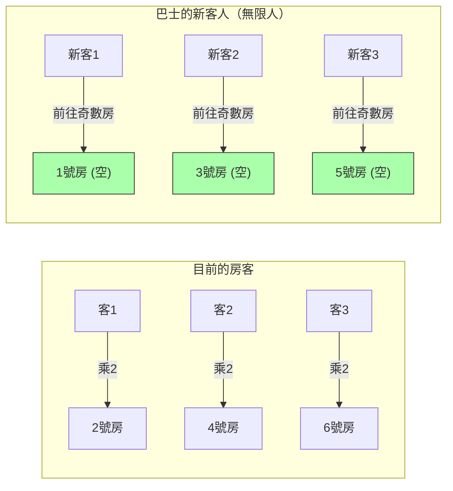

## 1. 歡迎來到終極旅館

德國偉大的數學家大衛·希爾伯特（David Hilbert），為了說明「無限」這個概念與人類的直覺有多麼脫節，構思了以下這個有趣的思考實驗。

想像一下，在宇宙的某個地方有一家**「希爾伯特的無限旅館」**。
這家旅館擁有1號房、2號房、3號房……等標有號碼的客房，數量是**無限個**。

有一天，宇宙中舉辦了一場大型活動，這家無限旅館的所有房間都住滿了客人，達到了**「客滿」**的狀態。
這時，一位疲憊不堪的旅人抵達了，並向櫃檯詢問：「能幫我空出一間房嗎？」

如果是一般的旅館，只能拒絕說：「非常抱歉，我們已經客滿了。」
然而，這裡是無限旅館。經理微笑著說：「好的，馬上為您準備房間。」
明明已經客滿了，到底要怎麼讓新客人住下呢？

---

## 2. 情況一：讓1位新客人入住的方法

經理透過館內廣播，向所有已經入住的客人做出了以下宣佈：

**「各位貴賓請注意，請移動到您目前房號『加1』的房間。」**

這樣會發生什麼事呢？
- 1號房的客人，移動到2號房。
- 2號房的客人，移動到3號房。
- 3號房的客人，移動到4號房。
- $n$號房的客人，移動到$n+1$號房。

因為房間有無限多個，所以「最後一間房的客人會被趕出去」的情況並不會發生。所有人都能順利地搬到隔壁的房間。
然後奇蹟發生了，**1號房空出來了。** 新的旅人順利地住進了1號房。

在無限的世界裡，$\infty + 1 = \infty$ 是成立的。
即使從「全體（無限）」中取出「1個」，整體的大小也不會改變。

---

## 3. 情況二：讓無限位新客人入住的方法

到了第二天。旅館再次回到了客滿的狀態。
這時，竟然來了一輛載著**「無限位乘客」的無限巴士**。
從巴士上下來的客人們擠到櫃檯前要求：「給我們準備所有人的房間！」

如果像昨天一樣請大家「加1」移動，那將會花費永遠的時間。
但是，經理並不慌張。他再次進行了館內廣播。

**「各位貴賓請注意，請移動到您目前房號『乘以2』的房間。」**

這樣會發生什麼事呢？
- 1號房的客人，移動到2號房。
- 2號房的客人，移動到4號房。
- 3號房的客人，移動到6號房。
- $n$號房的客人，移動到$2n$號房。

透過這次移動，原本已經入住的無限位客人，就完全被安置在**「所有偶數號碼的房間」**裡了。
而奇蹟般地，**「所有奇數號碼的房間（1號房、3號房、5號房...）」就完全空出來了**！

因為奇數也是無限多的，所以經理只要從無限巴士乘客的排頭開始，依序引導他們到1號房、3號房、5號房...就能讓所有人都住下來。

在無限的世界裡，$\infty + \infty = \infty$ 是成立的。
無限加上無限，其大小仍然是相同的「無限」。

---

## 4. 情況三：如果來了無限輛的無限巴士呢？

又到了隔天。旅館依然是客滿的。
這時竟然發生了，**「載著無限位乘客的無限巴士，來了無限輛」**，連綿不絕地抵達了。

1號巴士有無限人、2號巴士有無限人、3號巴士有無限人……就這樣有無限輛。
即使是經理這下似乎也要陷入恐慌了，但他是一位數學天才。他想到了使用「質數」。

經理下達了以下指示：

1. **已經入住旅館的客人的移動**
   假設目前的房號為 $n$，請他們移動到「$2^n$ 號房」。
   （1號房 $\rightarrow$ 2號房、2號房 $\rightarrow$ 4號房、3號房 $\rightarrow$ 8號房...）
   這樣目前的客人就全部安置好了。

2. **1號巴士客人的引導（無限人）**
   假設客人的座位號碼為 $n$，引導他們到「$3^n$ 號房」。
   （3號房、9號房、27號房...）

3. **2號巴士客人的引導（無限人）**
   使用下一個質數 5，引導他們到「$5^n$ 號房」。
   （5號房、25號房、125號房...）

4. **第 $k$ 號巴士客人的引導（無限人）**
   使用第 $k+1$ 個質數 $P$，引導他們到「$P^n$ 號房」。

根據「質因數分解的唯一性（任何數字分解為質數乘積的組合都只有一種）」這個強大的數學定理，$2^n, 3^n, 5^n, 7^n \dots$ 這些房號絕對不會與其他任何人重複。

就這樣，經理漂亮地將**「無限 $\times$ 無限」**這樣數量驚人的客人，全部收容進了一家無限旅館裡！

---

## 5. 無限也有「大小」之分（康托爾定理）

希爾伯特的無限旅館告訴我們一個事實：**「可數無限（能用1、2、3...編號來計算的無限）」，不管怎麼相加、怎麼相乘，最終都會被容納在同等大小的『可數無限』框架之內**。

然而，數學家格奧爾格·康托爾（Georg Cantor）發現了更令人畏懼的事實。
「自然數」或「分數」，全都能住進這家無限旅館。但是，**如果來的是「實數（包含無理數在內的所有小數）」客人，即使使用這家無限旅館，也絕對無法讓所有人住下**。

數學上已經證明，實數的數量，從根本上是比無限旅館的房間數（可數無限）還要「更大（層級更高）的無限」。
雖然我們常把「無限」一概而論，但其實在無限之中，存在著「較小的無限」與「大到絕對無法企及的無限」這樣的階層結構（勢）。

---

## 6. 總結：顛覆人類直覺的「無限」

希爾伯特的無限旅館鮮明地描繪出，我們在日常生活中培養的「有限常識」，在「無限世界」裡是多麼地不管用。

「整體大於部分」
「客滿的旅館誰也進不去」
「無限加上無限，會變得更大」

這些理所當然的直覺，全都被完美地顛覆了。
無限的世界是悖論（違反直覺的真理）的寶庫。數學家們並不害怕這些悖論，而是用邏輯的力量將其降伏、分類，並建立起現代集合論這套優美的體系。

下次如果遇到被告知「旅館已經客滿」而被拒絕時，請務必想像一下「如果這家旅館是希爾伯特的無限旅館該有多好」。
