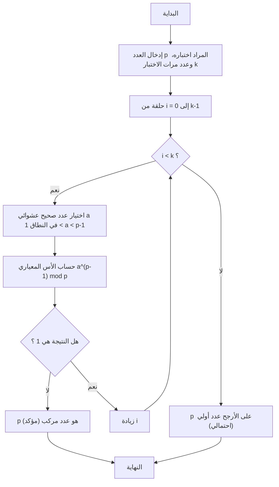
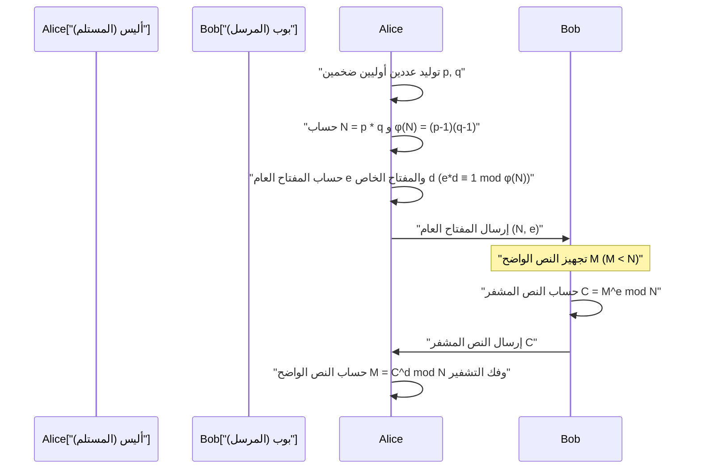

## 1. مقدمة: الغموض الرياضي الذي يدعم التشفير الحديث

في المجتمع الرقمي الحديث، وخاصة في الاتصالات عبر الإنترنت، أصبح "التشفير" تقنية أساسية لا غنى عنها. إن قدرتنا على تصفح مواقع الويب بأمان عبر HTTPS في متصفحات الويب، وإجراء المعاملات المالية عبر الخدمات المصرفية عبر الإنترنت، والتواصل الخاص عبر تطبيقات المراسلة، كلها ممكنة بفضل بروتوكولات التشفير المدعومة بنظريات رياضية متقدمة تعمل في الخلفية. من بين هذه البروتوكولات، يلعب "تشفير المفتاح العام" دورًا مهمًا للغاية، وأبرز مثال عليه هو **تشفير RSA**.

تعتمد سلامة وصحة العديد من خوارزميات التشفير، بما في ذلك تشفير RSA، بشكل كبير على مبرهنة جميلة وقوية جدًا اكتشفها عالم الرياضيات الفرنسي في القرن السابع عشر بيير دي فيرما (Pierre de Fermat). هذه المبرهنة هي **مبرهنة فيرما الصغرى (Fermat's Little Theorem)**. علاوة على ذلك، فإن مبرهنة ليونهارت أويلر (Leonhard Euler)، التي تعمم هذه المبرهنة، تلعب أيضًا دورًا حاسمًا في نظرية التشفير.

في هذا المقال، سنشرح بالتفصيل ومن الأساسيات كيف يتم تطبيق اكتشاف رياضي بحت مثل مبرهنة فيرما الصغرى في تقنيات التشفير العملية الحديثة، وخاصة في "اختبار الأولية" و "تشفير RSA". سيكون هذا دليلًا تقنيًا مفصلاً للغاية يغطي الإثباتات الرياضية، وآليات التشفير وفك التشفير، وصولاً إلى تطبيقات الخوارزميات المحددة باستخدام C++ و Python.

---

## 2. أساسيات التطابق والحساب المعياري

لفهم مبرهنة فيرما الصغرى، يجب أولاً التعرف على المفهوم الرياضي لـ "الحساب المعياري (التطابق)". الحساب المعياري هو نظام حسابي يركز على "الباقي" بعد القسمة على عدد ثابت (يسمى المعيار أو المقياس). نظرًا لأنه يشبه الحساب على مينا الساعة (التي تكمل دورة كل 12 ساعة)، يُطلق عليه أيضًا "رياضيات الساعة".

عندما يكون باقي قسمة العددين الصحيحين $a$ و $b$ على عدد صحيح موجب $n$ متساويًا، يتم التعبير عن ذلك رياضيًا على النحو التالي:

$$
a \equiv b \pmod n
$$

يُقرأ هذا " $a$ و $b$ متطابقان بمقياس $n$ ". على سبيل المثال، باقي قسمة 17 على 5 هو 2، وباقي قسمة 12 على 5 هو 2 أيضًا. لذلك، يمكننا كتابة ما يلي:

$$
17 \equiv 12 \pmod 5 \equiv 2 \pmod 5
$$

في الحساب المعياري، تنطبق العمليات الحسابية الأساسية الأربع (الجمع والطرح والضرب) كما هي:

1. **الجمع**: إذا كان $a \equiv b \pmod n$ و $c \equiv d \pmod n$، فإن $a + c \equiv b + d \pmod n$
2. **الطرح**: إذا كان $a \equiv b \pmod n$ و $c \equiv d \pmod n$، فإن $a - c \equiv b - d \pmod n$
3. **الضرب**: إذا كان $a \equiv b \pmod n$ و $c \equiv d \pmod n$، فإن $a \times c \equiv b \times d \pmod n$
4. **الأسس**: إذا كان $a \equiv b \pmod n$، فإنه لأي عدد طبيعي $k$، يكون $a^k \equiv b^k \pmod n$

ومع ذلك، يجب توخي الحذر فيما يتعلق بـ **القسمة**. بشكل عام، فقط لأن $a \times c \equiv b \times c \pmod n$، فهذا لا يعني أنه يمكنك قسمة كلا الجانبين على $c$ للحصول على $a \equiv b \pmod n$. هذا ينطبق فقط عندما يكون $c$ و $n$ أوليين فيما بينهما (القاسم المشترك الأكبر هو 1). هذا المفهوم لـ "المعكوس الضربي المعياري" سيكون في غاية الأهمية في توليد مفاتيح تشفير RSA، والذي سيتم مناقشته لاحقًا.

---

## 3. الخلفية الرياضية لمبرهنة فيرما الصغرى وإثباتها

الآن وقد فهمنا أساسيات الحساب المعياري، دعونا ننتقل إلى الموضوع الرئيسي وهو مبرهنة فيرما الصغرى.

### 3.1 تعريف المبرهنة

تُصاغ مبرهنة فيرما الصغرى على النحو التالي:

> **مبرهنة فيرما الصغرى (Fermat's Little Theorem)**
> ليكن $p$ عددًا أوليًا، و $a$ أي عدد صحيح ليس من مضاعفات $p$ (بمعنى أن $a$ و $p$ أوليان فيما بينهما). عندئذ، تتحقق علاقة التطابق التالية:
> $$ a^{p-1} \equiv 1 \pmod p $$

من الشائع أيضًا التعبير عنها بشكل ينطبق على جميع الأعداد الصحيحة $a$ عن طريق إزالة شرط " $a$ ليس من مضاعفات $p$ ". في هذه الحالة، نضرب كلا الجانبين في $a$ لنحصل على:

$$
a^p \equiv a \pmod p
$$

### 3.2 التحقق باستخدام أمثلة محددة

دعونا نستخدم أرقامًا محددة للتحقق مما إذا كانت المبرهنة صحيحة حقًا.
لنفترض أن العدد الأولي $p = 5$. إذن $p-1 = 4$. سنختار عددًا صحيحًا لـ $a$ ليس من مضاعفات $p$.

- في حالة $a = 2$: $2^{5-1} = 2^4 = 16$. $16 \div 5 = 3$ والباقي $1$. لذلك $16 \equiv 1 \pmod 5$. (صحيح)
- في حالة $a = 3$: $3^{5-1} = 3^4 = 81$. $81 \div 5 = 16$ والباقي $1$. لذلك $81 \equiv 1 \pmod 5$. (صحيح)
- في حالة $a = 4$: $4^{5-1} = 4^4 = 256$. $256 \div 5 = 51$ والباقي $1$. لذلك $256 \equiv 1 \pmod 5$. (صحيح)

وبهذه الطريقة، بغض النظر عن قيمة $a$ التي تختارها (طالما أنها ليست من مضاعفات 5)، فإن رفعها للقوة الرابعة وقسمتها على 5 سيؤدي دائمًا إلى باقي مقداره 1. يبدو الأمر كالسحر، لكن هذا ينبع من الخصائص الجميلة للأعداد الأولية.

### 3.3 الإثبات الرياضي للمبرهنة

لماذا هذا صحيح؟ هنا سنقدم إثباتًا أنيقًا باستخدام فئات البواقي.

لننظر في المجموعة $S = \{1, 2, 3, \dots, p-1\}$. هذه هي ممثلات الأعداد الصحيحة التي يكون باقي قسمتها على $p$ من $1$ إلى $p-1$.
الآن، لننظر في مجموعة جديدة $T$ عن طريق ضرب كل عنصر في عدد صحيح $a$ أولي نسبيًا مع $p$.
$$ T = \{1a, 2a, 3a, \dots, (p-1)a\} $$

لننظر في باقي قسمة كل عنصر من عناصر هذه المجموعة $T$ على $p$. والمثير للدهشة أن هذه البواقي، على الرغم من أن ترتيبها قد يتغير، تتطابق تمامًا مع عناصر المجموعة الأصلية $S$.
والسبب هو:
1. عناصر $T$ لا تكون أبدًا من مضاعفات $p$ (لأن كلاً من $a$ والعناصر الأصلية ليست من مضاعفات $p$).
2. لا يوجد عنصران مختلفان في $T$ متطابقان بمقياس $p$. إذا افترضنا أن $ia \equiv ja \pmod p$ ($i \neq j$)، بما أن $a$ و $p$ أوليان نسبيًا، يمكننا القسمة على $a$ للحصول على $i \equiv j \pmod p$، وهو تناقض.

لذلك، حاصل ضرب جميع عناصر $S$ متطابق مع حاصل ضرب جميع عناصر $T$ بمقياس $p$.

$$
(1a) \times (2a) \times \dots \times ((p-1)a) \equiv 1 \times 2 \times \dots \times (p-1) \pmod p
$$

بترتيب الجانب الأيسر، يوجد $p-1$ من $a$، لذلك:

$$
a^{p-1} \cdot (p-1)! \equiv (p-1)! \pmod p
$$

بما أن $(p-1)!$ أولي نسبيًا مع $p$، يمكننا قسمة كلا الجانبين على $(p-1)!$ لنحصل في النهاية على المبرهنة التالية:

$$
a^{p-1} \equiv 1 \pmod p
$$

هذا هو إثبات مبرهنة فيرما الصغرى.

---

## 4. دالة مؤشر أويلر ومبرهنة أويلر

مبرهنة فيرما الصغرى هي مبرهنة تتعلق بـ "الأعداد الأولية $p$"، ولكن تم تعميمها على "أي عدد صحيح موجب $n$" بواسطة ليونهارت أويلر. لفهم تشفير RSA، هذا التوسيع ضروري.

### 4.1 دالة مؤشر أويلر $\phi(n)$

دالة مؤشر أويلر (أو دالة فاي لأويلر) $\phi(n)$ هي دالة تمثل "عدد الأعداد الصحيحة من $1$ إلى $n$ التي هي أولية نسبيًا مع $n$".

- في حالة العدد الأولي $p$، جميع الأعداد الصحيحة من $1$ إلى $p-1$ أولية نسبيًا مع $p$، لذلك $\phi(p) = p - 1$.
- بالنسبة لعددين أوليين مختلفين $p, q$، وحاصلهما $n = p \times q$، يمكن إيجاد $\phi(n)$ بصيغة بسيطة جدًا:
  $$ \phi(p \times q) = \phi(p) \times \phi(q) = (p - 1)(q - 1) $$

هذه الخاصية هي المنطق الأساسي في توليد مفاتيح تشفير RSA.

### 4.2 مبرهنة أويلر

عمم أويلر مبرهنة فيرما الصغرى على النحو التالي:

> **مبرهنة أويلر (Euler's Theorem)**
> لأي عدد صحيح موجب $n$ وعدد صحيح $a$ أولي نسبيًا معه، يتحقق ما يلي:
> $$ a^{\phi(n)} \equiv 1 \pmod n $$

إذا كان $n$ عددًا أوليًا $p$، فإن $\phi(p) = p - 1$، وبالتالي تصبح هذه المبرهنة هي مبرهنة فيرما الصغرى نفسها ($a^{p-1} \equiv 1 \pmod p$). وبعبارة أخرى، مبرهنة فيرما الصغرى ليست سوى حالة خاصة من مبرهنة أويلر.

---

## 5. العثور على أعداد أولية ضخمة: اختبار فيرما للأولية

في تقنيات التشفير (مثل تشفير RSA وتبادل مفاتيح Diffie-Hellman)، من الضروري العثور بسرعة على "أعداد أولية ضخمة" قد تصل إلى مئات الأرقام. ومع ذلك، لتحديد ما إذا كان رقم ضخم $N$ أوليًا، فإن "طريقة القسمة التجريبية"، والتي تختبر قابلية القسمة على كل الأرقام من $2$ إلى $\sqrt{N}$، ستستغرق وقتًا يعادل عمر الكون.

هنا يأتي دور "اختبار الأولية الاحتمالي" الذي يعكس مبرهنة فيرما الصغرى، وهو **اختبار فيرما (Fermat Primality Test)**.

### 5.1 ما هو اختبار الأولية الاحتمالي

وفقًا لمبرهنة فيرما الصغرى، إذا كان $p$ أوليًا، فبالنسبة لأي $a$ ($1 < a < p$)، فإن $a^{p-1} \equiv 1 \pmod p$ يتحقق دائمًا.
بأخذ المعاكس الإيجابي لهذا، يمكننا القول: "إذا كان $a^{p-1} \not\equiv 1 \pmod p$ بالنسبة لـ $a$ معين، فإن $p$ **ليس عددًا أوليًا بالتأكيد (إنه عدد مركب)**".

لذلك، إذا أردنا تحديد ما إذا كان $N$ أوليًا أم لا، نختار عددًا قليلاً من قيم $a$ عشوائيًا ونحسب $a^{N-1} \pmod N$ للتحقق مما إذا كان يساوي $1$. إذا كانت الإجابة بخلاف $1$ ولو مرة واحدة، فهذا يؤكد أن $N$ هو عدد مركب. وإذا كانت النتيجة $1$ بغض النظر عن عدد المرات التي نختبر فيها ذلك، فيمكننا استنتاج باحتمال كبير أن $N$ هو "على الأرجح عدد أولي".

### 5.2 شرح الخوارزمية ومخطط الانسياب

خوارزمية اختبار فيرما هي كما يلي:



### 5.3 فخ أرقام كارمايكل (الأعداد شبه الأولية)

اختبار فيرما سريع للغاية، ولكن به عيب خطير. وهو وجود أرقام شيطانية تحقق $a^{N-1} \equiv 1 \pmod N$ لجميع قيم $a$ على الرغم من أنها أعداد مركبة. تسمى هذه بـ **أرقام كارمايكل (Carmichael numbers)**. أصغر رقم كارمايكل هو $561$ ($3 \times 11 \times 17$).

نظرًا لوجود أرقام كارمايكل، لا يمكن لاختبار فيرما النقي وحده تقديم تحديد قاطع للأولية. لذلك، في أنظمة التشفير الفعلية (مثل OpenSSL)، يُستخدم عادةً **اختبار ميلر-رابين للأولية (Miller-Rabin)**، وهو نسخة محسنة من اختبار فيرما. يمكن لاختبار ميلر-رابين اكتشاف أرقام كارمايكل، مما يقلل بشكل فعال احتمال التحديد الخاطئ إلى الصفر.

### 5.4 الأس المعياري السريع (طريقة التربيع المتكرر)

يتطلب خوارزمية اختبار الأولية حساب $a^{N-1} \pmod N$، ولكن عندما يكون $N$ ضخمًا، يصبح $a^{N-1}$ عددًا هائلاً بأرقام فلكية، ولن يتسع في ذاكرة الكمبيوتر.
يتم حل هذه المشكلة بواسطة **التربيع المتكرر (Exponentiation by Squaring)** أو حساب الأس المعياري. من خلال أخذ الباقي (mod N) في كل خطوة من العملية الحسابية، تظل القيمة دائمًا أقل من $N$، مما يتيح حسابها بسرعة كبيرة (تعقيد زمني $O(\log N)$).

---

## 6. تنفيذ اختبار الأولية والأس المعياري

دعونا ننفذ اختبار فيرما للأولية والتربيع المتكرر في C++ و Python.

### 6.1 التنفيذ بلغة C++

في C++، تكون أنواع الأعداد الصحيحة القياسية عرضة لتجاوز السعة (overflow)، لذلك هناك حاجة إلى مكتبة أعداد صحيحة متعددة الدقة (مثل GMP) للتعامل مع الأرقام الضخمة. ومع ذلك، لفهم الخوارزمية، سنعرض التنفيذ ضمن نطاق الأعداد الصحيحة 64 بت (`unsigned long long`).

```cpp
#include <iostream>
#include <random>

using namespace std;

// حساب الأس المعياري السريع (a^b mod m) - طريقة التربيع المتكرر
unsigned long long power_mod(unsigned long long a, unsigned long long b, unsigned long long m) {
    unsigned long long result = 1;
    a = a % m;
    while (b > 0) {
        // إذا كان البت الأقل أهمية لـ b هو 1، نضرب النتيجة في a
        if (b % 2 == 1) {
            result = (__int128)result * a % m; // تمديد لـ 128 بت لمنع تجاوز السعة
        }
        // تربيع a
        a = (__int128)a * a % m;
        // إزاحة b لليمين (قسمة على 2)
        b /= 2;
    }
    return result;
}

// اختبار فيرما للأولية
bool fermat_is_prime(unsigned long long p, int iterations = 5) {
    if (p <= 1) return false;
    if (p <= 3) return true;
    if (p % 2 == 0) return false;

    random_device rd;
    mt19937_64 gen(rd());
    uniform_int_distribution<unsigned long long> dis(2, p - 2);

    for (int i = 0; i < iterations; ++i) {
        unsigned long long a = dis(gen);
        // إذا كان a^(p-1) mod p لا يساوي 1، فهو عدد مركب
        if (power_mod(a, p - 1, p) != 1) {
            return false;
        }
    }
    return true; // على الأرجح أولي
}

int main() {
    unsigned long long num = 1000000007; // عدد أولي معروف
    if (fermat_is_prime(num, 10)) {
        cout << num << " is probably prime." << endl;
    } else {
        cout << num << " is composite." << endl;
    }
    return 0;
}
```

### 6.2 التنفيذ بلغة Python

تدعم أنواع الأعداد الصحيحة القياسية في Python الدقة المتعددة، لذلك لا داعي للقلق بشأن تجاوز السعة. علاوة على ذلك، تستخدم الدالة المدمجة `pow(a, b, m)` في Python التربيع المتكرر داخليًا، مما يجعلها سريعة للغاية.

```python
import random

def fermat_is_prime(p, iterations=5):
    """
    اختبار الأولية الاحتمالي باستخدام اختبار فيرما
    """
    if p <= 1:
        return False
    if p <= 3:
        return True
    if p % 2 == 0:
        return False

    for _ in range(iterations):
        # اختيار عدد عشوائي a بين 2 و p-2
        a = random.randint(2, p - 2)
        # حساب a^(p-1) mod p. الدالة المدمجة pow سريعة.
        if pow(a, p - 1, p) != 1:
            return False # عدد مركب مؤكد

    return True # على الأرجح أولي

# اختبار
number_to_test = 104729
if fermat_is_prime(number_to_test, 10):
    print(f"{number_to_test} على الأرجح عدد أولي.")
else:
    print(f"{number_to_test} هو عدد مركب.")
```

---

## 7. التطبيق في تشفير RSA: حيث تلتقي أفكار فيرما وأويلر

إن التطبيق الأعظم لمبرهنة فيرما الصغرى (ومبرهنة أويلر) هو **تشفير RSA**، الذي طوره ريفست (Rivest)، وشامير (Shamir)، وأدلمان (Adleman) في عام 1977.
تشفير RSA هو نظام رائد يُعرف باسم "تشفير المفتاح العام"، حيث يتم نشر مفتاح التشفير (المفتاح العام) للعالم بأسره، بينما مفتاح فك التشفير (المفتاح الخاص) لا يعرفه سوى المستلم نفسه.

يعتمد عدم التماثل هذا على الأمان الحسابي المتمثل في أن "تحليل الأعداد المركبة الضخمة إلى عواملها الأولية أمر صعب للغاية".

### 7.1 آلية تشفير RSA (توليد المفتاح، التشفير، فك التشفير)

دعونا نتحقق من سير الاتصال الشامل لتشفير RSA باستخدام مخطط تسلسل Mermaid.



فيما يلي، سنشرح الخطوات الرياضية التفصيلية.

#### الخطوة 1: توليد المفتاح (مهمة المستلم أليس)

1. قم بتوليد عددين أوليين ضخمين عشوائيًا $p$ و $q$ (هنا يتم استخدام اختبار الأولية المذكور أعلاه).
2. احسب حاصل ضربهما $N = p \times q$. هذا الـ $N$ يصبح علنيًا.
3. باستخدام دالة مؤشر أويلر، احسب $\phi(N) = (p-1)(q-1)$.
4. اختر عددًا صحيحًا $e$ (الأس العام) يكون أوليًا نسبيًا مع $\phi(N)$ (غالبًا ما يُستخدم $e = 65537$).
5. احسب المعكوس الضربي المعياري $d$ لـ $e$ (الأس الخاص). أي، أوجد $d$ بحيث يتحقق ما يلي:
   $$ e \cdot d \equiv 1 \pmod{\phi(N)} $$
   يُستخدم **خوارزمية إقليدس الممتدة** في هذه العملية الحسابية.

بهذا، يكون **المفتاح العام هو $(N, e)$**، و**المفتاح الخاص هو $(N, d)$**. (يجب التخلص من $p, q, \phi(N)$ على الفور أو إخفائها بصرامة).

#### الخطوة 2: التشفير (مهمة المرسل بوب)

لنفترض أن بوب يريد إرسال الرسالة $M$ إلى أليس (يتم تحويل $M$ من حروف إلى أرقام، حيث $0 \le M < N$).
يستخدم بوب المفتاح العام لأليس $(N, e)$ لإجراء العملية الحسابية التالية لإنشاء النص المشفر $C$.

$$
C \equiv M^e \pmod N
$$

يرسل بوب هذا الـ $C$ إلى أليس عبر الشبكة.

#### الخطوة 3: فك التشفير (مهمة المستلم أليس)

تقوم أليس، التي تستقبل النص المشفر $C$، بإجراء العملية الحسابية التالية باستخدام مفتاحها الخاص $d$ الذي تعرفه وحدها.

$$
M' \equiv C^d \pmod N
$$

بشكل مثير للدهشة، تتطابق نتيجة هذا الحساب $M'$ تمامًا مع الرسالة الأصلية $M$.

### 7.2 لماذا يمكن فك التشفير؟ (إثبات رياضي)

هنا، تظهر مبرهنة فيرما الصغرى (ومبرهنة أويلر) قيمتها الحقيقية. لماذا يعود $C^d \pmod N$ إلى $M$؟

دعونا نوسع معادلة فك التشفير.
بما أن $C \equiv M^e \pmod N$، إذن:
$$ C^d \equiv (M^e)^d \equiv M^{ed} \pmod N $$

في خطوة توليد المفتاح، اخترنا $d$ بحيث يكون $e \cdot d \equiv 1 \pmod{\phi(N)}$. هذا يعني أنه يوجد عدد صحيح $k$ بحيث يمكن كتابته على النحو التالي:
$$ e \cdot d = 1 + k \cdot \phi(N) $$

نعوض بهذا في المعادلة السابقة:
$$ M^{ed} = M^{1 + k \cdot \phi(N)} = M \cdot M^{k \cdot \phi(N)} = M \cdot (M^{\phi(N)})^k \pmod N $$

هنا تظهر **مبرهنة أويلر** ($M^{\phi(N)} \equiv 1 \pmod N$). (※ بدقة، يجب أن يكون $M$ و $N$ أوليين نسبيًا، ولكن في RSA، فإن احتمال عدم كون $M$ و $N$ أوليين نسبيًا منخفض فلكيًا، وباستخدام مبرهنة الباقي الصينية، يمكن إثبات أنها تظل صحيحة حتى لو لم يكونا أوليين نسبيًا).

وبتطبيق مبرهنة أويلر، حيث $M^{\phi(N)} \equiv 1$:
$$ M \cdot (1)^k \equiv M \pmod N $$

لقد تم استعادة $M$ بنجاح! إن خصائص الأرقام التي اكتشفها فيرما وأويلر قبل مئات السنين تضمن تمامًا سرية الاتصالات الرقمية الحديثة.

---

## 8. تنفيذ مبسط لتشفير RSA بلغة (Python)

نظرًا لأن النظرية وحدها قد تكون صعبة الاستيعاب، دعونا نستخدم Python لتنفيذ عملية توليد مفتاح تشفير RSA والتشفير وفك التشفير بالفعل. هذا "تنفيذ مبسط (لعبة)" للأغراض التعليمية، لكن الرياضيات المستخدمة فيه مطابقة تمامًا لتلك الحقيقية.

سنقوم أيضًا بتضمين "خوارزمية إقليدس الممتدة" لإيجاد المعكوس الضربي المعياري $d$.

```python
import random

# إيجاد القاسم المشترك الأكبر
def gcd(a, b):
    while b != 0:
        a, b = b, a % b
    return a

# خوارزمية إقليدس الممتدة (إيجاد x, y في ax + by = gcd(a,b))
# تُستخدم لإيجاد d في e*d ≡ 1 (mod φ(N))
def extended_gcd(a, b):
    if a == 0:
        return (b, 0, 1)
    else:
        g, y, x = extended_gcd(b % a, a)
        return (g, x - (b // a) * y, y)

def mod_inverse(e, phi):
    g, x, y = extended_gcd(e, phi)
    if g != 1:
        raise Exception('المعكوس الضربي غير موجود')
    else:
        return x % phi

# دالة توليد الأعداد الأولية (نسخة مبسطة: توليد أعداد أولية صغيرة)
def generate_prime(bits):
    while True:
        p = random.getrandbits(bits)
        # استخدام اختبار مبسط بدلاً من اختبار فيرما المذكور سابقاً
        if p > 1 and pow(2, p-1, p) == 1 and pow(3, p-1, p) == 1:
            return p

# توليد مفاتيح RSA
def generate_keypair(bits=16):
    p = generate_prime(bits)
    q = generate_prime(bits)
    # التأكد من أن p و q غير متساويين
    while p == q:
        q = generate_prime(bits)

    n = p * q
    phi = (p - 1) * (q - 1)

    # غالباً ما يُستخدم 65537 للأس e، ولكن هنا سنختاره عشوائياً
    e = random.randrange(1, phi)
    g = gcd(e, phi)
    while g != 1:
        e = random.randrange(1, phi)
        g = gcd(e, phi)

    # حساب المفتاح الخاص d
    d = mod_inverse(e, phi)
    
    # المفتاح العام (e, n)، المفتاح الخاص (d, n)
    return ((e, n), (d, n))

def encrypt(pk, plaintext):
    e, n = pk
    # حساب plaintext^e mod n
    cipher = [pow(ord(char), e, n) for char in plaintext]
    return cipher

def decrypt(sk, ciphertext):
    d, n = sk
    # حساب cipher^d mod n وتحويله مرة أخرى إلى حروف
    plain = [chr(pow(char, d, n)) for char in ciphertext]
    return ''.join(plain)

# مثال على التنفيذ
if __name__ == '__main__':
    print("--- تنفيذ مبسط لتشفير RSA ---")
    public_key, private_key = generate_keypair(bits=12) # استخدام أعداد أولية 12 بت
    
    print(f"المفتاح العام (e, n): {public_key}")
    print(f"المفتاح الخاص (d, n): {private_key}")

    message = "Hello Math!"
    print(f"\nالرسالة الأصلية: {message}")

    # التشفير
    encrypted_msg = encrypt(public_key, message)
    print(f"النص المشفر: {encrypted_msg}")

    # فك التشفير
    decrypted_msg = decrypt(private_key, encrypted_msg)
    print(f"الرسالة التي تم فك تشفيرها: {decrypted_msg}")
```

عند تشغيل هذا الكود، ستتمكن من رؤية كيف تتحول مصفوفة من الأحرف إلى مصفوفة من الأرقام غير المألوفة (نص مشفر)، وكيف يتم استعادتها ببراعة إلى السلسلة الأصلية بواسطة المفتاح الخاص.

---

## 9. خاتمة: تقاطع الجمال الرياضي مع التطبيق العملي

في القرن السابع عشر، عندما اكتشف بيير دي فيرما هذه "المبرهنة الصغرى"، لم يعتقد أحد أنها ستكون مفيدة لأي شيء. فيرما نفسه أجرى أبحاثه في نظرية الأعداد بدافع من الفضول الرياضي البحت.

ومع ذلك، بعد حوالي 300 عام، وتحديدًا في السبعينيات أثناء فجر شبكات الكمبيوتر، عادت مبرهنة فيرما للظهور بشكل دراماتيكي كتقنية تشفير لا غنى عنها لإنشاء بروتوكولات اتصال آمنة. تقنيات اختبار الأولية القائمة على مبرهنة فيرما الصغرى، وتشفير RSA القائم على مبرهنة أويلر، تدعم حرفياً البنية التحتية للإنترنت الحديثة.

إن رسائل LINE التي نرسلها دون تفكير كل يوم، ومشترياتنا من أمازون، كلها ترقص على أنغام هذه الصيغة البسيطة والجميلة $a^{p-1} \equiv 1 \pmod p$. تعلمنا مبرهنة فيرما الصغرى أنه مهما كانت الرياضيات مجردة، فسيأتي يوم تكون فيه مفيدة للبشرية.

أثناء دراسة البرمجة ونظرية التشفير، فإن فهم الهياكل الرياضية التي تكمن في أساسها سيكون سلاحًا رائعًا لفهم سلوك المكتبات المقدمة كـ "صناديق سوداء" بعمق، ولتصميم أنظمة أكثر أمانًا.
