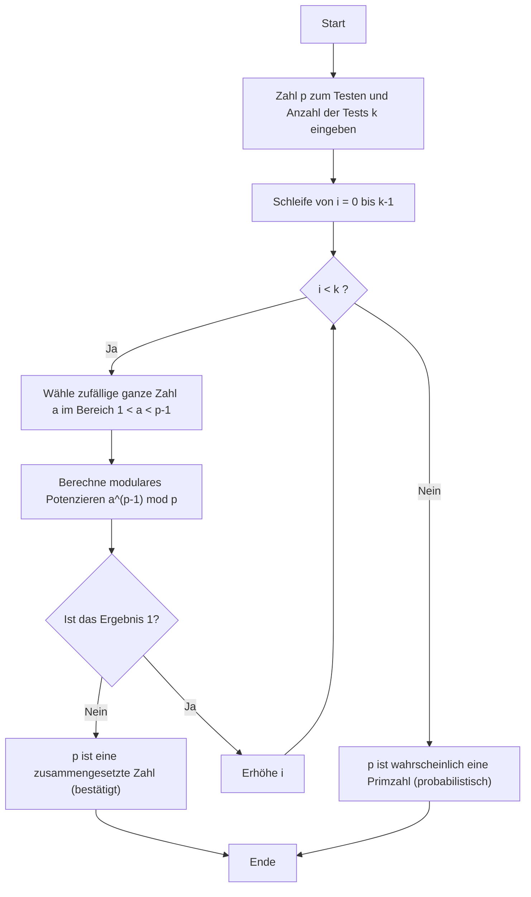
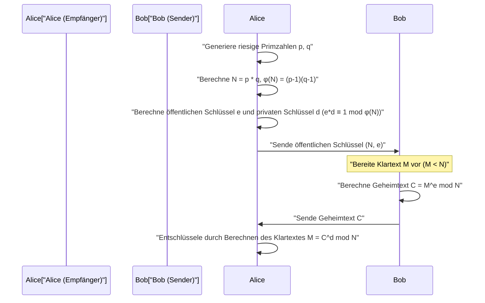

## 1. Einführung: Das Geheimnis der Mathematik hinter der modernen Kryptographie

In der modernen digitalen Gesellschaft, insbesondere bei der Kommunikation über das Internet, ist "Verschlüsselung" zu einer unverzichtbaren Basistechnologie geworden. Dass wir Websites über HTTPS sicher in einem Webbrowser durchsuchen, Finanztransaktionen im Online-Banking durchführen und privat in Messaging-Apps kommunizieren können, liegt daran, dass kryptographische Protokolle, die durch fortgeschrittene mathematische Theorien gestützt werden, im Hintergrund arbeiten. Eine besonders wichtige Rolle spielt dabei die "Public-Key-Kryptographie", deren prominentester Vertreter die **RSA-Verschlüsselung** ist.

Die Sicherheit und Gültigkeit vieler kryptographischer Algorithmen, einschließlich RSA, hängt stark von einem sehr schönen und mächtigen Satz ab, der im 17. Jahrhundert vom französischen Mathematiker Pierre de Fermat entdeckt wurde. Das ist der **kleine Satz von Fermat**. Darüber hinaus spielt der Satz von Leonhard Euler, der diesen verallgemeinert, eine entscheidende Rolle in der Kryptographietheorie.

In diesem Artikel werden wir von Grund auf ausführlich erklären, wie die Entdeckung der reinen Mathematik, der kleine Satz von Fermat, in der modernen, praktischen Kryptographie, insbesondere beim "Primzahltest" und bei der "RSA-Verschlüsselung", Anwendung findet. Dies ist ein sehr detaillierter technischer Leitfaden, der mathematische Beweise, Ver- und Entschlüsselungsmechanismen sowie spezifische Algorithmus-Implementierungen in C++ und Python abdeckt.

---

## 2. Grundlagen der Kongruenzen und der modularen Arithmetik

Um den kleinen Satz von Fermat zu verstehen, müssen wir uns zunächst mit dem mathematischen Konzept der "modularen Arithmetik (Kongruenz)" vertraut machen. Die modulare Arithmetik ist ein Rechensystem, das sich auf den "Rest" nach der Division durch eine bestimmte feste Zahl (Modul genannt) konzentriert. Da es sich um eine Berechnung wie beim Zifferblatt einer Uhr (die in 12 Stunden einen Umlauf macht) handelt, wird sie auch "Uhrenarithmetik" genannt.

Wenn die Reste der Division der ganzen Zahlen $a$ und $b$ durch eine positive ganze Zahl $n$ gleich sind, wird dies mathematisch wie folgt beschrieben:

$$
a \equiv b \pmod n
$$

Dies liest sich als "$a$ und $b$ sind kongruent modulo $n$". Zum Beispiel ist der Rest von 17 geteilt durch 5 gleich 2, und der Rest von 12 geteilt durch 5 ist ebenfalls 2. Daher können wir schreiben:

$$
17 \equiv 12 \pmod 5 \equiv 2 \pmod 5
$$

In der modularen Arithmetik gelten die üblichen vier Grundrechenarten (Addition, Subtraktion, Multiplikation) wie gewohnt:

1. **Addition**: Wenn $a \equiv b \pmod n$ und $c \equiv d \pmod n$, dann $a + c \equiv b + d \pmod n$
2. **Subtraktion**: Wenn $a \equiv b \pmod n$ und $c \equiv d \pmod n$, dann $a - c \equiv b - d \pmod n$
3. **Multiplikation**: Wenn $a \equiv b \pmod n$ und $c \equiv d \pmod n$, dann $a \times c \equiv b \times d \pmod n$
4. **Potenzieren**: Wenn $a \equiv b \pmod n$, dann $a^k \equiv b^k \pmod n$ für jede natürliche Zahl $k$

Bei der **Division** ist jedoch Vorsicht geboten. Im Allgemeinen bedeutet $a \times c \equiv b \times c \pmod n$ nicht, dass wir beide Seiten durch $c$ teilen und $a \equiv b \pmod n$ erhalten können. Dies gilt nur, wenn $c$ und $n$ teilerfremd sind (ihr größter gemeinsamer Teiler ist 1). Dieses Konzept des "modularen Inversen" ist extrem wichtig bei der Schlüsselgenerierung der RSA-Verschlüsselung, die später beschrieben wird.

---

## 3. Mathematischer Hintergrund und Beweis des kleinen Satzes von Fermat

Nachdem wir nun die Grundlagen der modularen Arithmetik behandelt haben, kommen wir zum Hauptthema: dem kleinen Satz von Fermat.

### 3.1 Definition des Satzes

Der kleine Satz von Fermat wird wie folgt formuliert:

> **Kleiner Satz von Fermat (Fermat's Little Theorem)**
> Sei $p$ eine Primzahl und $a$ eine beliebige ganze Zahl, die kein Vielfaches von $p$ ist (d.h. $a$ und $p$ sind teilerfremd). Dann gilt die folgende Kongruenz:
> $$ a^{p-1} \equiv 1 \pmod p $$

Es ist auch üblich, die Bedingung "$a$ ist kein Vielfaches von $p$" zu entfernen und es so auszudrücken, dass es für alle ganzen Zahlen $a$ gilt. In diesem Fall multiplizieren wir beide Seiten mit $a$ und erhalten:

$$
a^p \equiv a \pmod p
$$

### 3.2 Bestätigung durch konkrete Beispiele

Lassen Sie uns anhand konkreter Zahlen prüfen, ob der Satz wirklich gilt.
Sei die Primzahl $p = 5$. Dann ist $p-1 = 4$. Wir wählen als $a$ ganze Zahlen, die keine Vielfachen von $p$ sind.

- Für $a = 2$: $2^{5-1} = 2^4 = 16$. $16 \div 5 = 3$ Rest $1$. Also $16 \equiv 1 \pmod 5$. (Gültig)
- Für $a = 3$: $3^{5-1} = 3^4 = 81$. $81 \div 5 = 16$ Rest $1$. Also $81 \equiv 1 \pmod 5$. (Gültig)
- Für $a = 4$: $4^{5-1} = 4^4 = 256$. $256 \div 5 = 51$ Rest $1$. Also $256 \equiv 1 \pmod 5$. (Gültig)

Wie Sie sehen können, egal welches $a$ Sie wählen (solange es kein Vielfaches von 5 ist), ist der Rest immer 1, wenn Sie es zur 4. Potenz erheben und durch 5 teilen. Es scheint wie Magie, aber es stammt von den wunderbaren Eigenschaften der Primzahlen ab.

### 3.3 Mathematischer Beweis des Satzes

Warum ist das so? Hier stellen wir einen eleganten Beweis mit Hilfe der Menge der Restklassen vor.

Betrachten wir die Menge $S = \{1, 2, 3, \dots, p-1\}$. Dies sind Repräsentanten der ganzen Zahlen, deren Rest bei Division durch $p$ von $1$ bis $p-1$ reicht.
Betrachten wir nun eine neue Menge $T$, in der jedes Element mit einer zu $p$ teilerfremden ganzen Zahl $a$ multipliziert wird.
$$ T = \{1a, 2a, 3a, \dots, (p-1)a\} $$

Betrachten wir den Rest jedes Elements dieser Menge $T$ bei der Division durch $p$. Erstaunlicherweise stimmen diese Reste – obwohl ihre Reihenfolge vertauscht sein mag – genau mit der Menge der Elemente der ursprünglichen Menge $S$ überein.
Weil:
1. Kein Element von $T$ ein Vielfaches von $p$ wird (da weder $a$ noch die ursprünglichen Elemente Vielfache von $p$ sind).
2. Es in $T$ keine zwei verschiedenen Elemente gibt, die modulo $p$ kongruent sind. Wenn $ia \equiv ja \pmod p$ ($i \neq j$) wäre, könnten wir durch $a$ teilen, da $a$ und $p$ teilerfremd sind, und bekämen $i \equiv j \pmod p$, was ein Widerspruch ist.

Daher ist das Produkt aller Elemente von $S$ kongruent zum Produkt aller Elemente von $T$ modulo $p$.

$$
(1a) \times (2a) \times \dots \times ((p-1)a) \equiv 1 \times 2 \times \dots \times (p-1) \pmod p
$$

Wenn wir die linke Seite umstellen, haben wir $p-1$ mal $a$, also:

$$
a^{p-1} \cdot (p-1)! \equiv (p-1)! \pmod p
$$

Da $(p-1)!$ teilerfremd zu $p$ ist, können wir beide Seiten durch $(p-1)!$ teilen und erhalten schließlich den folgenden Satz:

$$
a^{p-1} \equiv 1 \pmod p
$$

Dies ist der Beweis für den kleinen Satz von Fermat.

---

## 4. Eulersche Phi-Funktion und der Satz von Euler

Der kleine Satz von Fermat ist ein Satz über "Primzahlen $p$", aber Leonhard Euler verallgemeinerte ihn für "beliebige positive ganze Zahlen $n$". Diese Erweiterung ist entscheidend, um die RSA-Verschlüsselung zu verstehen.

### 4.1 Die Eulersche Phi-Funktion $\phi(n)$

Die Eulersche Phi-Funktion (oder Eulersche Totientenfunktion) $\phi(n)$ ist eine Funktion, die die "Anzahl der ganzen Zahlen von $1$ bis $n$, die teilerfremd zu $n$ sind", angibt.

- Für eine Primzahl $p$ sind alle ganzen Zahlen von $1$ bis $p-1$ teilerfremd zu $p$, also ist $\phi(p) = p - 1$.
- Für zwei verschiedene Primzahlen $p$ und $q$ und deren Produkt $n = p \times q$ kann $\phi(n)$ mit einer sehr einfachen Formel berechnet werden:
  $$ \phi(p \times q) = \phi(p) \times \phi(q) = (p - 1)(q - 1) $$

Diese Eigenschaft ist die Kernlogik bei der Schlüsselgenerierung für die RSA-Verschlüsselung.

### 4.2 Der Satz von Euler

Euler verallgemeinerte den kleinen Satz von Fermat wie folgt:

> **Satz von Euler (Euler's Theorem)**
> Für eine positive ganze Zahl $n$ und eine zu ihr teilerfremde ganze Zahl $a$ gilt:
> $$ a^{\phi(n)} \equiv 1 \pmod n $$

Wenn $n$ eine Primzahl $p$ ist, dann ist $\phi(p) = p - 1$, also ist dies genau der kleine Satz von Fermat ($a^{p-1} \equiv 1 \pmod p$). Der kleine Satz von Fermat ist also nur ein Spezialfall des Satzes von Euler.

---

## 5. Riesige Primzahlen finden: Der Fermat-Primzahltest

In der Kryptographie (wie bei der RSA-Verschlüsselung und dem Diffie-Hellman-Schlüsselaustausch) ist es notwendig, schnell "riesige Primzahlen" mit hunderten von Ziffern zu finden. Um jedoch zu testen, ob eine riesige Zahl $N$ prim ist, würde die Methode der "Probedivision", bei der man versucht, durch alle Zahlen von $2$ bis $\sqrt{N}$ zu teilen, etwa so lange dauern wie das Alter des Universums.

Hier kommt der **Fermat-Primzahltest (Fermat Primality Test)** ins Spiel, ein "probabilistischer Primzahltest", der den kleinen Satz von Fermat umkehrt.

### 5.1 Was ist ein probabilistischer Primzahltest?

Nach dem kleinen Satz von Fermat gilt, wenn $p$ eine Primzahl ist, für jedes $a$ ($1 < a < p$) immer $a^{p-1} \equiv 1 \pmod p$.
Wenn wir die Kontraposition davon nehmen, können wir sagen: "Wenn es ein $a$ gibt, für das $a^{p-1} \not\equiv 1 \pmod p$ ist, dann ist $p$ **absolut keine Primzahl (es ist eine zusammengesetzte Zahl)**".

Wenn wir also testen wollen, ob $N$ prim ist, wählen wir zufällig einige $a$ und berechnen $a^{N-1} \pmod N$, um zu sehen, ob das Ergebnis $1$ ist. Wenn wir auch nur einmal ein anderes Ergebnis als $1$ erhalten, ist mit Sicherheit bestätigt, dass $N$ eine zusammengesetzte Zahl ist. Wenn das Ergebnis nach vielen Versuchen immer $1$ ist, können wir mit hoher Wahrscheinlichkeit schlussfolgern, dass $N$ "wahrscheinlich eine Primzahl ist".

### 5.2 Erklärung des Algorithmus und Flussdiagramm

Der Algorithmus für den Fermat-Test ist wie folgt:



### 5.3 Die Falle der Carmichael-Zahlen (Pseudoprimzahlen)

Der Fermat-Test ist sehr schnell, hat aber einen großen Fehler. Es gibt teuflische Zahlen, die zusammengesetzt sind, aber dennoch $a^{N-1} \equiv 1 \pmod N$ für alle $a$ erfüllen. Diese werden **Carmichael-Zahlen (Carmichael numbers)** genannt. Die kleinste Carmichael-Zahl ist $561$ ($3 \times 11 \times 17$).

Aufgrund der Existenz von Carmichael-Zahlen kann ein reiner Fermat-Test allein keinen absoluten Primzahltest garantieren. Daher verwenden reale Verschlüsselungssysteme (wie OpenSSL) standardmäßig den **Miller-Rabin-Primzahltest**, der eine Verbesserung des Fermat-Tests darstellt. Der Miller-Rabin-Test kann Carmichael-Zahlen erkennen, wodurch die Wahrscheinlichkeit eines falschen Ergebnisses praktisch auf Null reduziert wird.

### 5.4 Schnelles modulares Potenzieren (Binäre Exponentiation)

Im Primzahltestalgorithmus müssen wir $a^{N-1} \pmod N$ berechnen. Wenn $N$ riesig ist, hat $a^{N-1}$ eine astronomische Anzahl von Ziffern und passt nicht in den Speicher des Computers.
Die Lösung dafür ist die **binäre Exponentiation (Exponentiation by Squaring)** oder das modulare Potenzieren. Durch das Modulo (mod N) bei jedem Schritt der Berechnung wird der Wert immer kleiner als $N$ gehalten, und die Berechnung wird sehr schnell möglich (Zeitkomplexität $O(\log N)$).

---

## 6. Implementierung von Primzahltest und modularem Potenzieren

Lassen Sie uns nun den Fermat-Primzahltest und die binäre Exponentiation in C++ und Python implementieren.

### 6.1 Implementierung in C++

In C++ laufen Standard-Ganzzahltypen leicht über, daher ist eine Big-Integer-Bibliothek (wie GMP) erforderlich, um riesige Zahlen zu handhaben. Aber hier zeigen wir eine Implementierung innerhalb des Bereichs von 64-Bit-Ganzzahlen (`unsigned long long`), um den Algorithmus zu verstehen.

```cpp
#include <iostream>
#include <random>

using namespace std;

// Schnelles modulares Potenzieren (a^b mod m) - Binäre Exponentiation
unsigned long long power_mod(unsigned long long a, unsigned long long b, unsigned long long m) {
    unsigned long long result = 1;
    a = a % m;
    while (b > 0) {
        // Wenn das niedrigstwertige Bit von b 1 ist, multipliziere das Ergebnis mit a
        if (b % 2 == 1) {
            result = (__int128)result * a % m; // 128-Bit-Erweiterung zur Vermeidung von Überlauf
        }
        // a quadrieren
        a = (__int128)a * a % m;
        // b nach rechts verschieben (halbieren)
        b /= 2;
    }
    return result;
}

// Fermat-Primzahltest
bool fermat_is_prime(unsigned long long p, int iterations = 5) {
    if (p <= 1) return false;
    if (p <= 3) return true;
    if (p % 2 == 0) return false;

    random_device rd;
    mt19937_64 gen(rd());
    uniform_int_distribution<unsigned long long> dis(2, p - 2);

    for (int i = 0; i < iterations; ++i) {
        unsigned long long a = dis(gen);
        // Wenn a^(p-1) mod p nicht 1 ist, ist es eine zusammengesetzte Zahl
        if (power_mod(a, p - 1, p) != 1) {
            return false;
        }
    }
    return true; // Wahrscheinlich prim
}

int main() {
    unsigned long long num = 1000000007; // Bekannte Primzahl
    if (fermat_is_prime(num, 10)) {
        cout << num << " is probably prime." << endl;
    } else {
        cout << num << " is composite." << endl;
    }
    return 0;
}
```

### 6.2 Implementierung in Python

Der Standard-Ganzzahltyp von Python unterstützt beliebig große Zahlen, sodass Sie sich keine Sorgen über einen Überlauf machen müssen. Darüber hinaus verwendet die in Python integrierte Funktion `pow(a, b, m)` intern die binäre Exponentiation und ist sehr schnell.

```python
import random

def fermat_is_prime(p, iterations=5):
    """
    Probabilistischer Primzahltest unter Verwendung des Fermat-Primzahltests
    """
    if p <= 1:
        return False
    if p <= 3:
        return True
    if p % 2 == 0:
        return False

    for _ in range(iterations):
        # Wähle eine zufällige Zahl a zwischen 2 und p-2
        a = random.randint(2, p - 2)
        # Berechne a^(p-1) mod p. Das integrierte pow ist schnell.
        if pow(a, p - 1, p) != 1:
            return False # Bestätigt zusammengesetzt

    return True # Wahrscheinlich prim

# Test
number_to_test = 104729
if fermat_is_prime(number_to_test, 10):
    print(f"{number_to_test} ist wahrscheinlich prim.")
else:
    print(f"{number_to_test} ist zusammengesetzt.")
```

---

## 7. Anwendung auf die RSA-Verschlüsselung: Wo Fermat und Euler zusammenkommen

Die großartigste Anwendung des kleinen Satzes von Fermat (und des Satzes von Euler) ist die **RSA-Verschlüsselung**, die 1977 von Rivest, Shamir und Adleman entwickelt wurde.
Die RSA-Verschlüsselung ist ein revolutionäres "Public-Key-Kryptographie"-System, das es ermöglicht, den Schlüssel zur Verschlüsselung (öffentlicher Schlüssel) der ganzen Welt zugänglich zu machen, während nur der Empfänger den Schlüssel zur Entschlüsselung (privater Schlüssel) kennt.

Diese Asymmetrie beruht auf der rechnerischen Sicherheit der Tatsache, dass "es extrem schwierig ist, eine riesige zusammengesetzte Zahl in ihre Primfaktoren zu zerlegen".

### 7.1 Wie die RSA-Verschlüsselung funktioniert (Schlüsselgenerierung, Verschlüsselung, Entschlüsselung)

Lassen Sie uns den gesamten Kommunikationsfluss der RSA-Verschlüsselung anhand eines Mermaid-Sequenzdiagramms untersuchen.



Im Folgenden erklären wir die mathematischen Schritte im Detail.

#### Schritt 1: Schlüsselgenerierung (Arbeit der Empfängerin Alice)

1. Generiere zufällig zwei riesige Primzahlen $p$ und $q$ (hier wird der zuvor erwähnte Primzahltest verwendet).
2. Berechne ihr Produkt $N = p \times q$. Dieses $N$ wird veröffentlicht.
3. Berechne $\phi(N) = (p-1)(q-1)$ unter Verwendung der Eulerschen Phi-Funktion.
4. Wähle eine ganze Zahl $e$ (öffentlicher Exponent), die teilerfremd zu $\phi(N)$ ist (oft wird $e = 65537$ verwendet).
5. Berechne das modulare Inverse $d$ (privater Exponent) von $e$. Finde also $d$ so, dass Folgendes gilt:
   $$ e \cdot d \equiv 1 \pmod{\phi(N)} $$
   Für diese Berechnung wird der **erweiterte euklidische Algorithmus** verwendet.

Der **öffentliche Schlüssel ist somit $(N, e)$** und der **private Schlüssel ist $(N, d)$**. ($p, q$ und $\phi(N)$ sollten sofort vernichtet oder streng geheim gehalten werden).

#### Schritt 2: Verschlüsselung (Arbeit des Senders Bob)

Nehmen wir an, Bob möchte die Nachricht $M$ an Alice senden ($M$ ist eine numerische Darstellung von Zeichen, und $0 \le M < N$).
Bob verwendet Alices öffentlichen Schlüssel $(N, e)$, um die folgende Berechnung durchzuführen und den Geheimtext $C$ zu erstellen:

$$
C \equiv M^e \pmod N
$$

Dieser $C$ wird über das Netzwerk an Alice gesendet.

#### Schritt 3: Entschlüsselung (Arbeit der Empfängerin Alice)

Nach Erhalt des Geheimtextes $C$ führt Alice die folgende Berechnung unter Verwendung des privaten Schlüssels $d$ durch, den nur sie kennt:

$$
M' \equiv C^d \pmod N
$$

Erstaunlicherweise stimmt das Ergebnis dieser Berechnung $M'$ perfekt mit der ursprünglichen Nachricht $M$ überein.

### 7.2 Warum kann es entschlüsselt werden? (Mathematischer Beweis)

Hier zeigen der kleine Satz von Fermat (und der Satz von Euler) ihren wahren Wert. Warum kehrt $C^d \pmod N$ zu $M$ zurück?

Lassen Sie uns die Entschlüsselungsformel erweitern.
Da $C \equiv M^e \pmod N$, haben wir:
$$ C^d \equiv (M^e)^d \equiv M^{ed} \pmod N $$

Im Schritt der Schlüsselgenerierung haben wir $d$ so gewählt, dass $e \cdot d \equiv 1 \pmod{\phi(N)}$. Das bedeutet, es gibt eine ganze Zahl $k$, sodass wir schreiben können:
$$ e \cdot d = 1 + k \cdot \phi(N) $$

Setzen wir dies in die obige Gleichung ein:
$$ M^{ed} = M^{1 + k \cdot \phi(N)} = M \cdot M^{k \cdot \phi(N)} = M \cdot (M^{\phi(N)})^k \pmod N $$

Hier kommt der **Satz von Euler** ($M^{\phi(N)} \equiv 1 \pmod N$) ins Spiel. (*Streng genommen müssen $M$ und $N$ teilerfremd sein, aber in RSA ist die Wahrscheinlichkeit, dass $M$ und $N$ nicht teilerfremd sind, astronomisch gering, und mithilfe des Chinesischen Restsatzes kann bewiesen werden, dass es auch gilt, wenn sie nicht teilerfremd sind*).

Wenden wir den Satz von Euler an, da $M^{\phi(N)} \equiv 1$ ist:
$$ M \cdot (1)^k \equiv M \pmod N $$

Hervorragend, $M$ wurde wiederhergestellt! Die Eigenschaften von Zahlen, die von Fermat und Euler vor Hunderten von Jahren entdeckt wurden, garantieren perfekt die Vertraulichkeit der modernen digitalen Kommunikation.

---

## 8. Spielzeug-Implementierung der RSA-Verschlüsselung (Python)

Da es schwer ist, ein Gefühl nur für die Theorie zu bekommen, verwenden wir Python, um den Prozess der RSA-Schlüsselgenerierung, Verschlüsselung und Entschlüsselung tatsächlich zu implementieren. Dies ist eine "Spielzeug-Implementierung" für Bildungszwecke, aber die verwendete Mathematik ist genau dieselbe wie bei der echten.

Wir fügen auch den "erweiterten euklidischen Algorithmus" hinzu, um das modulare Inverse $d$ zu finden.

```python
import random

# Größten gemeinsamen Teiler finden
def gcd(a, b):
    while b != 0:
        a, b = b, a % b
    return a

# Erweiterter euklidischer Algorithmus (findet x, y für ax + by = gcd(a,b))
# Verwendet, um d für e*d ≡ 1 (mod φ(N)) zu finden
def extended_gcd(a, b):
    if a == 0:
        return (b, 0, 1)
    else:
        g, y, x = extended_gcd(b % a, a)
        return (g, x - (b // a) * y, y)

def mod_inverse(e, phi):
    g, x, y = extended_gcd(e, phi)
    if g != 1:
        raise Exception('Inverses existiert nicht')
    else:
        return x % phi

# Primzahl-Generierungsfunktion (Vereinfachte Version: generiert kleine Primzahlen)
def generate_prime(bits):
    while True:
        p = random.getrandbits(bits)
        # Einfacher Test anstelle des zuvor erwähnten Fermat-Tests
        if p > 1 and pow(2, p-1, p) == 1 and pow(3, p-1, p) == 1:
            return p

# RSA-Schlüsselgenerierung
def generate_keypair(bits=16):
    p = generate_prime(bits)
    q = generate_prime(bits)
    # Stellen Sie sicher, dass p und q nicht gleich sind
    while p == q:
        q = generate_prime(bits)

    n = p * q
    phi = (p - 1) * (q - 1)

    # Für e werden oft Primzahlen wie 65537 verwendet, aber hier wird es zufällig gewählt
    e = random.randrange(1, phi)
    g = gcd(e, phi)
    while g != 1:
        e = random.randrange(1, phi)
        g = gcd(e, phi)

    # Berechnung des privaten Schlüssels d
    d = mod_inverse(e, phi)
    
    # Öffentlicher Schlüssel (e, n), Privater Schlüssel (d, n)
    return ((e, n), (d, n))

def encrypt(pk, plaintext):
    e, n = pk
    # Berechne plaintext^e mod n
    cipher = [pow(ord(char), e, n) for char in plaintext]
    return cipher

def decrypt(sk, ciphertext):
    d, n = sk
    # Berechne cipher^d mod n und konvertiere zurück in Zeichen
    plain = [chr(pow(char, d, n)) for char in ciphertext]
    return ''.join(plain)

# Ausführungsbeispiel
if __name__ == '__main__':
    print("--- RSA-Verschlüsselung Spielzeug-Implementierung ---")
    public_key, private_key = generate_keypair(bits=12) # Verwendet 12-Bit-Primzahlen
    
    print(f"Öffentlicher Schlüssel (e, n): {public_key}")
    print(f"Privater Schlüssel (d, n): {private_key}")

    message = "Hello Math!"
    print(f"\nUrsprüngliche Nachricht: {message}")

    # Verschlüsselung
    encrypted_msg = encrypt(public_key, message)
    print(f"Geheimtext: {encrypted_msg}")

    # Entschlüsselung
    decrypted_msg = decrypt(private_key, encrypted_msg)
    print(f"Entschlüsselte Nachricht: {decrypted_msg}")
```

Wenn Sie diesen Code ausführen, können Sie sehen, wie ein Array von Zeichen in ein Array unvertrauter Zahlen (Geheimtext) umgewandelt wird, welches durch den privaten Schlüssel wunderschön in den ursprünglichen String wiederhergestellt wird.

---

## 9. Fazit: Die Kreuzung von mathematischer Schönheit und Praktikabilität

Als Pierre de Fermat im 17. Jahrhundert diesen "kleinen Satz" entdeckte, dachte niemand, dass er für irgendetwas nützlich sein würde. Fermat selbst betrieb zahlentheoretische Forschung aus reiner mathematischer Neugier.

Etwa 300 Jahre später, in den 1970er Jahren, an den Anfängen von Computernetzwerken, feierte der Satz von Fermat jedoch ein dramatisches Comeback als unverzichtbare Verschlüsselungstechnologie zur Etablierung sicherer Kommunikationsprotokolle. Die Primzahltesttechnologie, die auf dem kleinen Satz von Fermat basiert, und die RSA-Verschlüsselung, die auf dem Satz von Euler basiert, stützen buchstäblich die moderne Internet-Infrastruktur.

Die LINE-Nachrichten, die wir jeden Tag beiläufig senden, und unsere Einkäufe bei Amazon tanzen alle auf dieser einfachen und schönen Formel $a^{p-1} \equiv 1 \pmod p$. Egal wie abstrakt Mathematik ist, der kleine Satz von Fermat lehrt uns, dass immer die Zeit kommen wird, in der sie für die Menschheit nützlich sein wird.

Beim Erlernen von Programmierung und Kryptographietheorie wird das Verständnis der zugrunde liegenden mathematischen Strukturen eine starke Waffe sein, um das Verhalten von Bibliotheken, die als Blackboxes bereitgestellt werden, tiefgreifend zu verstehen und sicherere Systeme zu entwerfen.
