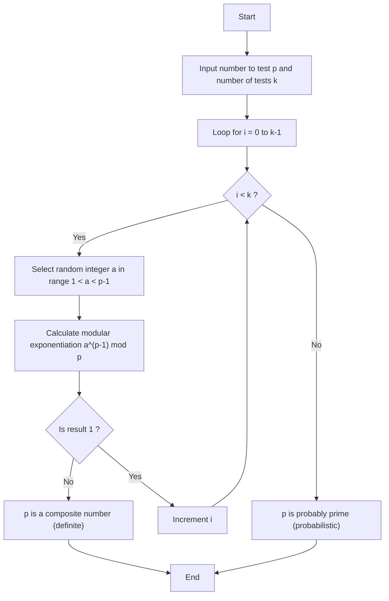
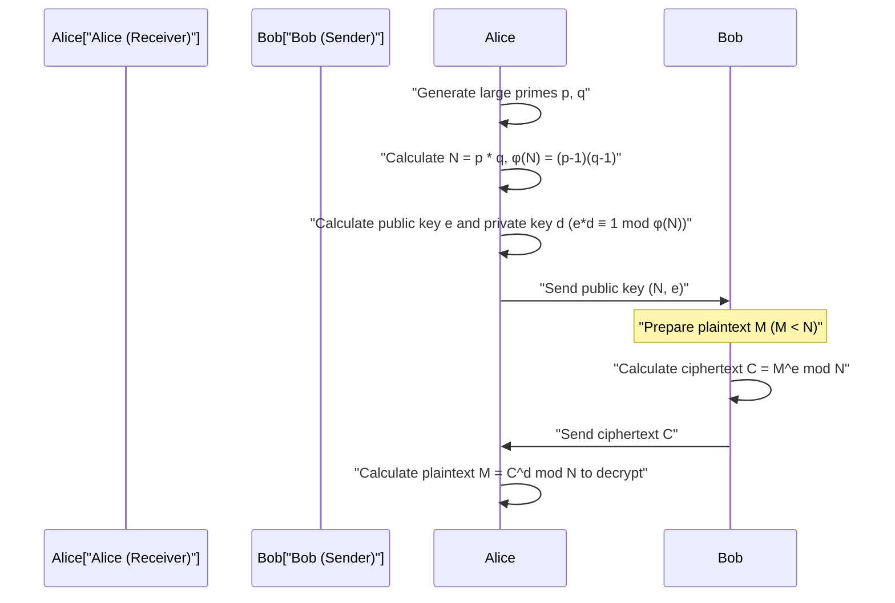

## 1. Introduction: The Mystery of Mathematics Supporting Modern Cryptography

In modern digital society, especially in communication over the Internet, "encryption" has become an indispensable foundational technology. The reason we can securely browse websites via HTTPS, perform financial transactions through online banking, and exchange private messages on messaging apps is because cryptographic protocols backed by highly advanced mathematical theories are working behind the scenes. Among them, "Public-Key Cryptography" plays a particularly important role, and its prime representative is **RSA cryptography**.

The security and correctness of many cryptographic algorithms, including RSA cryptography, depend heavily on a very beautiful and powerful theorem discovered by the 17th-century French mathematician Pierre de Fermat. That is **Fermat's Little Theorem**. Furthermore, Leonhard Euler's theorem, which generalizes this, also plays a decisive role in cryptographic theory.

In this article, we will thoroughly explain from the basics how the pure mathematical discovery of Fermat's Little Theorem is applied to modern practical cryptographic technologies, especially "primality testing" and "RSA cryptography". This will be a highly detailed technical guide covering mathematical proofs, encryption and decryption mechanisms, and specific algorithm implementations using C++ and Python.

---

## 2. Fundamentals of Congruences and Modular Arithmetic

To understand Fermat's Little Theorem, you first need to become familiar with the mathematical concept of "modular arithmetic (congruence)". Modular arithmetic is a calculation system that focuses on the "remainder" when dividing by a certain fixed number (called the modulus). Because it's a calculation like a clock face (which cycles every 12 hours), it is also called "clock mathematics".

When the remainders of dividing integers $a$ and $b$ by a positive integer $n$ are equal, it is described mathematically as follows:

$$
a \equiv b \pmod n
$$

This is read as "$a$ and $b$ are congruent modulo $n$". For example, the remainder of 17 divided by 5 is 2, and the remainder of 12 divided by 5 is also 2. Therefore, it can be written as:

$$
17 \equiv 12 \pmod 5 \equiv 2 \pmod 5
$$

In modular arithmetic, normal basic arithmetic operations (addition, subtraction, multiplication) apply as they are.

1. **Addition**: If $a \equiv b \pmod n$ and $c \equiv d \pmod n$, then $a + c \equiv b + d \pmod n$
2. **Subtraction**: If $a \equiv b \pmod n$ and $c \equiv d \pmod n$, then $a - c \equiv b - d \pmod n$
3. **Multiplication**: If $a \equiv b \pmod n$ and $c \equiv d \pmod n$, then $a \times c \equiv b \times d \pmod n$
4. **Exponentiation**: If $a \equiv b \pmod n$, then for any natural number $k$, $a^k \equiv b^k \pmod n$

However, care must be taken with **division**. In general, just because $a \times c \equiv b \times c \pmod n$, you cannot divide both sides by $c$ to get $a \equiv b \pmod n$. This only holds true when $c$ and $n$ are coprime (their greatest common divisor is 1). This concept of "modular inverse" becomes extremely important in the key generation of RSA cryptography discussed later.

---

## 3. Mathematical Background and Proof of Fermat's Little Theorem

Having grasped the basics of modular arithmetic, let's look at the main subject, Fermat's Little Theorem.

### 3.1 Definition of the Theorem

Fermat's Little Theorem is formulated as follows:

> **Fermat's Little Theorem**
> Let $p$ be a prime number, and let $a$ be any integer that is not a multiple of $p$ (i.e., $a$ and $p$ are coprime). Then, the following congruence holds:
> $$ a^{p-1} \equiv 1 \pmod p $$

It is also common to express it in a form that holds for all integers $a$ by removing the condition that "$a$ is not a multiple of $p$". In that case, multiplying both sides by $a$ gives:

$$
a^p \equiv a \pmod p
$$

### 3.2 Verification with Concrete Examples

Let's check if the theorem really holds using specific numbers.
Let the prime number $p = 5$. $p-1 = 4$. We choose an integer $a$ that is not a multiple of $p$.

- For $a = 2$: $2^{5-1} = 2^4 = 16$. $16 \div 5 = 3$ remainder $1$. Thus $16 \equiv 1 \pmod 5$. (Holds)
- For $a = 3$: $3^{5-1} = 3^4 = 81$. $81 \div 5 = 16$ remainder $1$. Thus $81 \equiv 1 \pmod 5$. (Holds)
- For $a = 4$: $4^{5-1} = 4^4 = 256$. $256 \div 5 = 51$ remainder $1$. Thus $256 \equiv 1 \pmod 5$. (Holds)

In this way, no matter what $a$ you choose (as long as it's not a multiple of 5), raising it to the 4th power and dividing by 5 will always yield a remainder of 1. It seems like magic, but this comes from the beautiful properties that prime numbers possess.

### 3.3 Mathematical Proof of the Theorem

Why does this happen? Here we introduce an elegant proof using the set of residue classes.

Consider the set $S = \{1, 2, 3, \dots, p-1\}$. These are representatives of integers whose remainders when divided by $p$ are from $1$ to $p-1$.
Here, consider a new set $T$ obtained by multiplying each element by an integer $a$ that is coprime to $p$:
$$ T = \{1a, 2a, 3a, \dots, (p-1)a\} $$

Consider the remainder of each element of this set $T$ when divided by $p$. Surprisingly, these remainders, although their order might change, perfectly match the set of elements in the original set $S$.
Because:
1. No element of $T$ can be a multiple of $p$ (since neither $a$ nor the original elements are multiples of $p$).
2. There are no two distinct elements in $T$ that are congruent modulo $p$. If $ia \equiv ja \pmod p$ ($i \neq j$), since $a$ and $p$ are coprime, we can divide by $a$ to get $i \equiv j \pmod p$, which is a contradiction.

Therefore, the product of all elements of $S$ and the product of all elements of $T$ are congruent modulo $p$.

$$
(1a) \times (2a) \times \dots \times ((p-1)a) \equiv 1 \times 2 \times \dots \times (p-1) \pmod p
$$

Simplifying the left side, since there are $p-1$ copies of $a$:

$$
a^{p-1} \cdot (p-1)! \equiv (p-1)! \pmod p
$$

Since $(p-1)!$ is coprime to $p$, we can divide both sides by $(p-1)!$, which finally leads to the theorem:

$$
a^{p-1} \equiv 1 \pmod p
$$

This is the proof of Fermat's Little Theorem.

---

## 4. Euler's Totient Function and Euler's Theorem

Fermat's Little Theorem is a theorem concerning "prime numbers $p$", but it was Leonhard Euler who generalized this to "any positive integer $n$". This extension is essential for understanding RSA cryptography.

### 4.1 Euler's Totient Function $\phi(n)$

Euler's totient function (or Euler's $\phi$ function) $\phi(n)$ is a function that represents "the number of integers from $1$ to $n$ that are coprime to $n$".

- For a prime number $p$, all integers from $1$ to $p-1$ are coprime to $p$, so $\phi(p) = p - 1$.
- For two distinct prime numbers $p, q$, their product $n = p \times q$ has a $\phi(n)$ given by a very simple formula:
  $$ \phi(p \times q) = \phi(p) \times \phi(q) = (p - 1)(q - 1) $$

This property is the fundamental logic in RSA key generation.

### 4.2 Euler's Theorem

Euler generalized Fermat's Little Theorem as follows:

> **Euler's Theorem**
> For a positive integer $n$ and an integer $a$ coprime to it, the following holds:
> $$ a^{\phi(n)} \equiv 1 \pmod n $$

If $n$ is a prime number $p$, then $\phi(p) = p - 1$, so this becomes Fermat's Little Theorem itself ($a^{p-1} \equiv 1 \pmod p$). In other words, Fermat's Little Theorem is merely a special case of Euler's Theorem.

---

## 5. Finding Giant Prime Numbers: Fermat Primality Test

In cryptographic technologies (such as RSA cryptography and Diffie-Hellman key exchange), it is necessary to find "giant prime numbers" spanning hundreds of digits at high speed. However, to test whether a giant number $N$ is prime, checking if it is divisible by every number from $2$ to $\sqrt{N}$ (trial division) would take as long as the lifespan of the universe.

This is where the **Fermat Primality Test** comes in, a "probabilistic primality test" that takes advantage of Fermat's Little Theorem.

### 5.1 What is a Probabilistic Primality Test?

According to Fermat's Little Theorem, if $p$ is prime, then for any $a$ ($1 < a < p$), $a^{p-1} \equiv 1 \pmod p$ must hold.
Taking the contrapositive, we can say that "if $a^{p-1} \not\equiv 1 \pmod p$ for some $a$, then $p$ is **absolutely not a prime number (it is a composite number)**".

Therefore, if we want to determine whether $N$ is prime, we randomly choose several $a$'s, calculate $a^{N-1} \pmod N$, and check if it equals $1$. If an answer other than $1$ appears even once, $N$ is definitively a composite number. If it equals $1$ no matter how many times we try, we can determine with high probability that $N$ is "probably prime".

### 5.2 Algorithm Explanation and Flowchart

The algorithm for the Fermat primality test is as follows:



### 5.3 The Pitfall of Carmichael Numbers (Pseudoprimes)

While the Fermat test is very fast, it has a significant flaw. There are devilish numbers that are composite numbers but still satisfy $a^{N-1} \equiv 1 \pmod N$ for all $a$. These are called **Carmichael numbers**. The smallest Carmichael number is $561$ ($3 \times 11 \times 17$).

Because Carmichael numbers exist, a pure Fermat test alone cannot provide absolute primality testing. Therefore, in actual cryptographic systems (such as OpenSSL), the **Miller-Rabin primality test**, an improved version of the Fermat test, is used as the standard. The Miller-Rabin test can detect Carmichael numbers, effectively reducing the probability of misjudgment to zero.

### 5.4 Fast Modular Exponentiation (Exponentiation by Squaring)

In the primality testing algorithm, we need to calculate $a^{N-1} \pmod N$, but when $N$ is huge, $a^{N-1}$ becomes an astronomically large number that cannot fit into a computer's memory.
This is solved by **Exponentiation by Squaring** or modular exponentiation. By taking the modulo ($mod N$) at each step of the calculation, the value is always kept smaller than $N$, allowing it to be calculated very quickly (with a computational complexity of $O(\log N)$).

---

## 6. Implementation of Primality Testing and Modular Exponentiation

Now, let's implement the Fermat primality test and exponentiation by squaring in C++ and Python.

### 6.1 Implementation in C++

In C++, standard integer types are prone to overflow, so handling giant numbers requires a multiple-precision integer library (like GMP), but here we show an implementation within the range of 64-bit integers (`unsigned long long`) to understand the algorithm.

```cpp
#include <iostream>
#include <random>

using namespace std;

// Fast modular exponentiation (a^b mod m) - Exponentiation by squaring
unsigned long long power_mod(unsigned long long a, unsigned long long b, unsigned long long m) {
    unsigned long long result = 1;
    a = a % m;
    while (b > 0) {
        // If the lowest bit of b is 1, multiply result by a
        if (b % 2 == 1) {
            result = (__int128)result * a % m; // 128-bit extension to prevent overflow
        }
        // Square a
        a = (__int128)a * a % m;
        // Right shift b (halve it)
        b /= 2;
    }
    return result;
}

// Fermat primality test
bool fermat_is_prime(unsigned long long p, int iterations = 5) {
    if (p <= 1) return false;
    if (p <= 3) return true;
    if (p % 2 == 0) return false;

    random_device rd;
    mt19937_64 gen(rd());
    uniform_int_distribution<unsigned long long> dis(2, p - 2);

    for (int i = 0; i < iterations; ++i) {
        unsigned long long a = dis(gen);
        // If a^(p-1) mod p is not 1, it's composite
        if (power_mod(a, p - 1, p) != 1) {
            return false;
        }
    }
    return true; // Probably prime
}

int main() {
    unsigned long long num = 1000000007; // A known prime
    if (fermat_is_prime(num, 10)) {
        cout << num << " is probably prime." << endl;
    } else {
        cout << num << " is composite." << endl;
    }
    return 0;
}
```

### 6.2 Implementation in Python

Python's standard integer type supports arbitrary precision integers, so there's no need to worry about overflow. Furthermore, Python's built-in function `pow(a, b, m)` internally uses exponentiation by squaring, so it's very fast.

```python
import random

def fermat_is_prime(p, iterations=5):
    """
    Probabilistic primality test using Fermat's primality test
    """
    if p <= 1:
        return False
    if p <= 3:
        return True
    if p % 2 == 0:
        return False

    for _ in range(iterations):
        # Choose a random number a between 2 and p-2
        a = random.randint(2, p - 2)
        # Calculate a^(p-1) mod p. Built-in pow is fast.
        if pow(a, p - 1, p) != 1:
            return False # Definitely composite

    return True # Probably prime

# Test
number_to_test = 104729
if fermat_is_prime(number_to_test, 10):
    print(f"{number_to_test} is probably prime.")
else:
    print(f"{number_to_test} is composite.")
```

---

## 7. Application to RSA Cryptography: Where Fermat and Euler Bear Fruit

The greatest application of Fermat's Little Theorem (and Euler's Theorem) is **RSA cryptography**, developed in 1977 by Rivest, Shamir, and Adleman.
RSA cryptography is an epoch-making system called "public-key cryptography", realizing a mechanism where the key for encryption (public key) is published to the whole world, while the key for decryption (private key) is known only to the receiver themselves.

This asymmetry is based on the computational security that "factorizing a giant composite number into its prime factors is extremely difficult."

### 7.1 Mechanism of RSA Cryptography (Key Generation, Encryption, Decryption)

Let's check the overall communication flow of RSA cryptography with a Mermaid sequence diagram.



The mathematical detail steps are explained below.

#### Step 1: Key Generation (Task of Receiver Alice)

1. Randomly generate two giant prime numbers $p$ and $q$ (the primality test mentioned above is used here).
2. Calculate their product $N = p \times q$. This $N$ is made public.
3. Using Euler's totient function, calculate $\phi(N) = (p-1)(q-1)$.
4. Choose an integer $e$ (public exponent) that is coprime to $\phi(N)$ (often $e = 65537$ is used).
5. Calculate the modular inverse $d$ (private exponent) of $e$. In other words, find $d$ that satisfies:
   $$ e \cdot d \equiv 1 \pmod{\phi(N)} $$
   The **extended Euclidean algorithm** is used for this calculation.

Now, the **public key is $(N, e)$**, and the **private key is $(N, d)$**. ($p, q, \phi(N)$ are immediately discarded or strictly hidden).

#### Step 2: Encryption (Task of Sender Bob)

Suppose Bob wants to send a message $M$ to Alice ($M$ is a numerically converted character, and $0 \le M < N$).
Bob uses Alice's public key $(N, e)$ to perform the following calculation to create ciphertext $C$.

$$
C \equiv M^e \pmod N
$$

He sends this $C$ to Alice over the network.

#### Step 3: Decryption (Task of Receiver Alice)

Alice, receiving the ciphertext $C$, performs the following calculation using the private key $d$ that only she knows.

$$
M' \equiv C^d \pmod N
$$

Surprisingly, this calculation result $M'$ perfectly matches the original message $M$.

### 7.2 Why can it be decrypted? (Mathematical Proof)

Here, Fermat's Little Theorem (Euler's Theorem) shows its true worth. Why does $C^d \pmod N$ return to $M$?

Let's expand the decryption equation.
Since $C \equiv M^e \pmod N$,
$$ C^d \equiv (M^e)^d \equiv M^{ed} \pmod N $$

In the key generation step, we chose $d$ such that $e \cdot d \equiv 1 \pmod{\phi(N)}$. This means there exists an integer $k$ such that it can be written as:
$$ e \cdot d = 1 + k \cdot \phi(N) $$

Substitute this into the above equation:
$$ M^{ed} = M^{1 + k \cdot \phi(N)} = M \cdot M^{k \cdot \phi(N)} = M \cdot (M^{\phi(N)})^k \pmod N $$

Here, **Euler's Theorem** ($M^{\phi(N)} \equiv 1 \pmod N$) comes into play. (*Strictly speaking, $M$ and $N$ need to be coprime, but in RSA, the probability that $M$ and $N$ are not coprime is astronomically low, and using the Chinese Remainder Theorem, it can be proven to hold even if they are not coprime).

Applying Euler's Theorem, since $M^{\phi(N)} \equiv 1$:
$$ M \cdot (1)^k \equiv M \pmod N $$

$M$ is beautifully restored! The properties of numbers discovered hundreds of years ago by Fermat and Euler perfectly guarantee the confidentiality of modern digital communication.

---

## 8. Toy Implementation of RSA Cryptography (Python)

It's hard to get a real feel from theory alone, so let's actually implement the key generation, encryption, and decryption process of RSA cryptography using Python. This is a "toy implementation" for educational purposes, but the math used is exactly the same as the real thing.

The "extended Euclidean algorithm" for finding the modular inverse $d$ is also included in the implementation.

```python
import random

# Find the greatest common divisor
def gcd(a, b):
    while b != 0:
        a, b = b, a % b
    return a

# Extended Euclidean algorithm (Find x, y for ax + by = gcd(a,b))
# Used to find d for e*d ≡ 1 (mod φ(N))
def extended_gcd(a, b):
    if a == 0:
        return (b, 0, 1)
    else:
        g, y, x = extended_gcd(b % a, a)
        return (g, x - (b // a) * y, y)

def mod_inverse(e, phi):
    g, x, y = extended_gcd(e, phi)
    if g != 1:
        raise Exception('Inverse does not exist')
    else:
        return x % phi

# Prime number generation function (simplified version: generates small primes)
def generate_prime(bits):
    while True:
        p = random.getrandbits(bits)
        # Simplified check instead of the Fermat test mentioned above
        if p > 1 and pow(2, p-1, p) == 1 and pow(3, p-1, p) == 1:
            return p

# RSA key generation
def generate_keypair(bits=16):
    p = generate_prime(bits)
    q = generate_prime(bits)
    # Ensure p and q are not the same
    while p == q:
        q = generate_prime(bits)

    n = p * q
    phi = (p - 1) * (q - 1)

    # e is often a prime like 65537, but here we choose it randomly
    e = random.randrange(1, phi)
    g = gcd(e, phi)
    while g != 1:
        e = random.randrange(1, phi)
        g = gcd(e, phi)

    # Calculation of private key d
    d = mod_inverse(e, phi)
    
    # Public key (e, n), Private key (d, n)
    return ((e, n), (d, n))

def encrypt(pk, plaintext):
    e, n = pk
    # Calculate plaintext^e mod n
    cipher = [pow(ord(char), e, n) for char in plaintext]
    return cipher

def decrypt(sk, ciphertext):
    d, n = sk
    # Calculate cipher^d mod n and convert back to characters
    plain = [chr(pow(char, d, n)) for char in ciphertext]
    return ''.join(plain)

# Example execution
if __name__ == '__main__':
    print("--- RSA Cryptography Toy Implementation ---")
    public_key, private_key = generate_keypair(bits=12) # Use 12-bit primes
    
    print(f"Public key (e, n): {public_key}")
    print(f"Private key (d, n): {private_key}")

    message = "Hello Math!"
    print(f"\nOriginal message: {message}")

    # Encryption
    encrypted_msg = encrypt(public_key, message)
    print(f"Ciphertext: {encrypted_msg}")

    # Decryption
    decrypted_msg = decrypt(private_key, encrypted_msg)
    print(f"Decrypted message: {decrypted_msg}")
```

When you run this code, you can see how an array of characters is converted into an unfamiliar array of numbers (ciphertext), which is then beautifully restored to the original string by the private key.

---

## 9. Conclusion: The Intersection of Mathematical Beauty and Practicality

In the 17th century when Pierre de Fermat discovered this "Little Theorem", no one thought it would be of any use. Fermat himself studied number theory out of pure mathematical curiosity.

However, about 300 years later in the 1970s, at the dawn of computer networks, Fermat's theorem made a dramatic comeback as an indispensable cryptographic technology for establishing secure communication protocols. Primality testing technology based on Fermat's Little Theorem and RSA cryptography based on Euler's theorem literally support modern Internet infrastructure.

The LINE messages we casually send every day, the shopping on Amazon, all dance on this simple and beautiful formula $a^{p-1} \equiv 1 \pmod p$. No matter how abstract mathematics may be, Fermat's Little Theorem teaches us that the time will definitely come when it will be useful to humanity.

When studying programming or cryptographic theory, understanding the mathematical structures at their foundation will become a great weapon for deeply understanding the behavior of libraries provided as black boxes and designing more secure systems.
