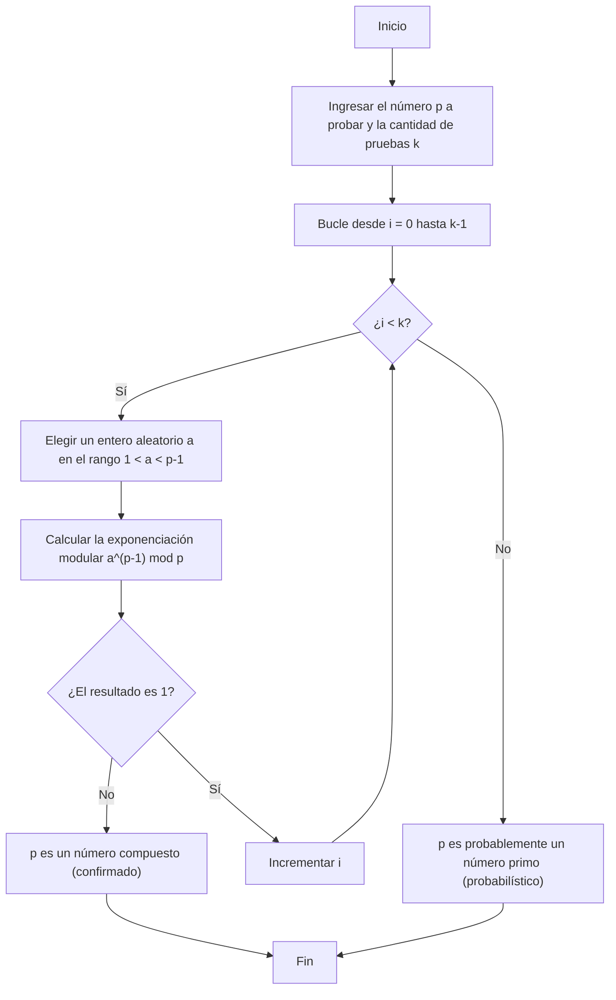
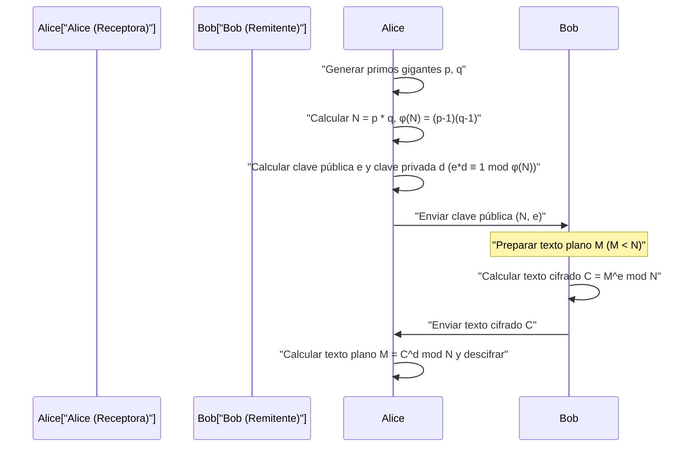

## 1. Introducción: El misterio matemático que sustenta la criptografía moderna

En la sociedad digital moderna, especialmente en las comunicaciones a través de Internet, la "criptografía" se ha convertido en una tecnología base indispensable. El hecho de que podamos navegar de forma segura por sitios web a través de HTTPS en nuestros navegadores web, realizar transacciones financieras en la banca en línea e intercambiar mensajes privados en aplicaciones de mensajería, se debe a que detrás funcionan protocolos criptográficos respaldados por teorías matemáticas avanzadas. Entre ellos, la "criptografía de clave pública" desempeña un papel particularmente importante, y su representante principal es el **cifrado RSA**.

La seguridad y validez de muchos algoritmos criptográficos, incluido el cifrado RSA, dependen en gran medida de un teorema muy hermoso y poderoso descubierto por el matemático francés del siglo XVII Pierre de Fermat. Este es el **pequeño teorema de Fermat (Fermat's Little Theorem)**. Además, el teorema de Leonhard Euler, que es una generalización de este, también juega un papel decisivo en la teoría criptográfica.

En este artículo, explicaremos exhaustivamente desde los fundamentos cómo el descubrimiento de las matemáticas puras, el pequeño teorema de Fermat, se aplica a la tecnología criptográfica práctica moderna, especialmente a la "prueba de primalidad" y al "cifrado RSA". Será una guía técnica muy detallada que cubrirá las demostraciones matemáticas, los mecanismos de cifrado y descifrado, y las implementaciones de algoritmos específicos utilizando C++ y Python.

---

## 2. Fundamentos de las congruencias y la aritmética modular

Para entender el pequeño teorema de Fermat, primero debemos familiarizarnos con el concepto matemático de la "aritmética modular (congruencias)". La aritmética modular es un sistema de cálculo que se centra en el "resto" después de dividir por un número fijo (llamado módulo). Dado que es un cálculo similar a la esfera de un reloj (que da una vuelta cada 12 horas), también se le llama "aritmética del reloj".

Cuando el resto de dividir los enteros $a$ y $b$ por un entero positivo $n$ es igual, se escribe matemáticamente de la siguiente manera:

$$
a \equiv b \pmod n
$$

Esto se lee como "$a$ y $b$ son congruentes módulo $n$". Por ejemplo, el resto de dividir 17 entre 5 es 2, y el resto de dividir 12 entre 5 también es 2. Por lo tanto, se puede escribir de la siguiente manera:

$$
17 \equiv 12 \pmod 5 \equiv 2 \pmod 5
$$

En la aritmética modular, las cuatro operaciones aritméticas básicas (suma, resta y multiplicación) se mantienen tal cual.

1. **Adición**: Si $a \equiv b \pmod n$ y $c \equiv d \pmod n$, entonces $a + c \equiv b + d \pmod n$
2. **Sustracción**: Si $a \equiv b \pmod n$ y $c \equiv d \pmod n$, entonces $a - c \equiv b - d \pmod n$
3. **Multiplicación**: Si $a \equiv b \pmod n$ y $c \equiv d \pmod n$, entonces $a \times c \equiv b \times d \pmod n$
4. **Exponenciación**: Si $a \equiv b \pmod n$, entonces para cualquier número natural $k$, $a^k \equiv b^k \pmod n$

Sin embargo, hay que tener cuidado con la **división**. En general, incluso si $a \times c \equiv b \times c \pmod n$, no podemos dividir ambos lados por $c$ y concluir que $a \equiv b \pmod n$. Esto solo es válido cuando $c$ y $n$ son coprimos (su máximo común divisor es 1). Este concepto de "inverso modular" será extremadamente importante en la generación de claves del cifrado RSA, que discutiremos más adelante.

---

## 3. Contexto matemático y demostración del pequeño teorema de Fermat

Habiendo cubierto los fundamentos de la aritmética modular, echemos un vistazo al tema principal, el pequeño teorema de Fermat.

### 3.1 Definición del teorema

El pequeño teorema de Fermat se formula de la siguiente manera:

> **Pequeño teorema de Fermat (Fermat's Little Theorem)**
> Sea $p$ un número primo y sea $a$ cualquier número entero que no sea un múltiplo de $p$ (es decir, $a$ y $p$ son coprimos). Entonces, se cumple la siguiente congruencia:
> $$ a^{p-1} \equiv 1 \pmod p $$

También es común expresarlo en una forma que se aplica a todos los enteros $a$, eliminando la condición "que $a$ no sea un múltiplo de $p$". En ese caso, multiplicamos ambos lados por $a$ para obtener lo siguiente:

$$
a^p \equiv a \pmod p
$$

### 3.2 Confirmación con ejemplos concretos

Confirmemos si el teorema realmente se cumple utilizando números concretos.
Sea el número primo $p = 5$. Entonces $p-1 = 4$. Elegimos como $a$ enteros que no sean múltiplos de $p$.

- Caso $a = 2$: $2^{5-1} = 2^4 = 16$. $16 \div 5 = 3$ resto $1$. Por lo tanto, $16 \equiv 1 \pmod 5$. (Se cumple)
- Caso $a = 3$: $3^{5-1} = 3^4 = 81$. $81 \div 5 = 16$ resto $1$. Por lo tanto, $81 \equiv 1 \pmod 5$. (Se cumple)
- Caso $a = 4$: $4^{5-1} = 4^4 = 256$. $256 \div 5 = 51$ resto $1$. Por lo tanto, $256 \equiv 1 \pmod 5$. (Se cumple)

De esta manera, no importa qué $a$ elijas (siempre que no sea un múltiplo de 5), al elevarlo a la cuarta potencia y dividirlo por 5, el resto será siempre 1. Parece magia, pero esto proviene de las hermosas propiedades que poseen los números primos.

### 3.3 Demostración matemática del teorema

¿Por qué se cumple esto? Aquí presentamos una demostración elegante utilizando conjuntos de clases de residuos.

Consideremos el conjunto $S = \{1, 2, 3, \dots, p-1\}$. Estos son los representantes de los números enteros cuyo resto al dividir por $p$ va de $1$ a $p-1$.
Ahora, consideramos un nuevo conjunto $T$ donde multiplicamos cada elemento por un entero $a$ que es coprimo con $p$.
$$ T = \{1a, 2a, 3a, \dots, (p-1)a\} $$

Consideremos los restos al dividir cada elemento de este conjunto $T$ por $p$. Sorprendentemente, estos restos coinciden completamente con el conjunto de elementos del conjunto original $S$, aunque el orden pueda cambiar.
Porque:
1. Ningún elemento de $T$ será un múltiplo de $p$ (porque ni $a$ ni los elementos originales son múltiplos de $p$).
2. No existen dos elementos diferentes en $T$ que sean congruentes módulo $p$. Si supusiéramos que $ia \equiv ja \pmod p$ ($i \neq j$), dado que $a$ y $p$ son coprimos, podríamos dividir por $a$ y obtener $i \equiv j \pmod p$, lo que es una contradicción.

Por lo tanto, el producto de todos los elementos de $S$ y el producto de todos los elementos de $T$ son congruentes módulo $p$.

$$
(1a) \times (2a) \times \dots \times ((p-1)a) \equiv 1 \times 2 \times \dots \times (p-1) \pmod p
$$

Reorganizando el lado izquierdo, tenemos $p-1$ veces $a$, por lo que:

$$
a^{p-1} \cdot (p-1)! \equiv (p-1)! \pmod p
$$

Dado que $(p-1)!$ es coprimo con $p$, podemos dividir ambos lados por $(p-1)!$, y finalmente se deriva el siguiente teorema:

$$
a^{p-1} \equiv 1 \pmod p
$$

Esta es la demostración del pequeño teorema de Fermat.

---

## 4. Función totiente de Euler y teorema de Euler

El pequeño teorema de Fermat es un teorema sobre "números primos $p$", pero fue Leonhard Euler quien generalizó esto a "cualquier entero positivo $n$". Esta extensión es esencial para entender el cifrado RSA.

### 4.1 Función totiente de Euler $\phi(n)$

La función totiente de Euler (o función $\phi$ de Euler) $\phi(n)$ es una función que representa "la cantidad de enteros del $1$ al $n$ que son coprimos con $n$".

- En el caso de un número primo $p$, todos los enteros del $1$ al $p-1$ son coprimos con $p$, por lo que $\phi(p) = p - 1$.
- Para dos números primos diferentes $p$ y $q$, y su producto $n = p \times q$, $\phi(n)$ se puede calcular con una fórmula muy simple:
  $$ \phi(p \times q) = \phi(p) \times \phi(q) = (p - 1)(q - 1) $$

Esta propiedad es la lógica fundamental en la generación de claves del cifrado RSA.

### 4.2 Teorema de Euler

Euler generalizó el pequeño teorema de Fermat de la siguiente manera:

> **Teorema de Euler (Euler's Theorem)**
> Para cualquier entero positivo $n$ y un entero $a$ coprimo con $n$, se cumple lo siguiente:
> $$ a^{\phi(n)} \equiv 1 \pmod n $$

Si $n$ es un número primo $p$, entonces $\phi(p) = p - 1$, por lo que esto se convierte en el pequeño teorema de Fermat mismo ($a^{p-1} \equiv 1 \pmod p$). En otras palabras, el pequeño teorema de Fermat no es más que un caso especial del teorema de Euler.

---

## 5. Encontrar números primos gigantes: Prueba de primalidad de Fermat

En las tecnologías criptográficas (como el cifrado RSA y el intercambio de claves de Diffie-Hellman), es necesario encontrar rápidamente "números primos gigantes" de cientos de dígitos. Sin embargo, para determinar si un número gigantesco $N$ es primo, el método de "división por tentativa" (intentar dividir por todos los números desde $2$ hasta $\sqrt{N}$) tomaría un tiempo comparable a la edad del universo.

Ahí es donde entra en juego la **prueba de primalidad de Fermat (Fermat Primality Test)**, un "método de prueba de primalidad probabilística" que aprovecha el pequeño teorema de Fermat a la inversa.

### 5.1 ¿Qué es un método de prueba de primalidad probabilística?

Según el pequeño teorema de Fermat, si $p$ es primo, para cualquier $a$ ($1 < a < p$), se debe cumplir obligatoriamente $a^{p-1} \equiv 1 \pmod p$.
Tomando la contrapuesta de esto, podemos decir que "si para algún $a$, $a^{p-1} \not\equiv 1 \pmod p$, entonces $p$ **definitivamente no es primo (es un número compuesto)**".

Por lo tanto, si queremos determinar si $N$ es primo, elegimos varios $a$ al azar, calculamos $a^{N-1} \pmod N$ y verificamos si el resultado es $1$. Si se obtiene una respuesta distinta de $1$ incluso una vez, se confirma que $N$ es un número compuesto. Si el resultado es $1$ repetidas veces, podemos juzgar con alta probabilidad que $N$ es "probablemente un número primo".

### 5.2 Explicación del algoritmo y diagrama de flujo

El algoritmo de la prueba de Fermat es el siguiente:



### 5.3 La trampa de los números de Carmichael (pseudoprimos)

La prueba de Fermat es muy rápida, pero tiene un defecto importante. Existen números diabólicos que, a pesar de ser números compuestos, cumplen que $a^{N-1} \equiv 1 \pmod N$ para todos los $a$. Estos se denominan **números de Carmichael (Carmichael numbers)**. El número de Carmichael más pequeño es $561$ ($3 \times 11 \times 17$).

Debido a la existencia de los números de Carmichael, una prueba de Fermat pura por sí sola no puede determinar la primalidad de manera absoluta. Por lo tanto, en los sistemas criptográficos reales (como OpenSSL), se utiliza de forma estándar la **prueba de primalidad de Miller-Rabin**, que es una versión mejorada de la prueba de Fermat. La prueba de Miller-Rabin puede desenmascarar los números de Carmichael, reduciendo la probabilidad de falsos positivos prácticamente a cero.

### 5.4 Exponenciación modular rápida (método de cuadratura sucesiva)

En el algoritmo de la prueba de primalidad, es necesario calcular $a^{N-1} \pmod N$, pero si $N$ es gigantesco, $a^{N-1}$ se convierte en un número con una cantidad astronómica de dígitos que no cabe en la memoria de la computadora.
Esto se resuelve mediante el **método de cuadratura sucesiva (Exponentiation by Squaring)** o exponenciación modular. Al tomar el módulo (mod N) en cada paso del cálculo, el valor siempre se mantiene menor que $N$, permitiendo que el cálculo sea extremadamente rápido (complejidad temporal $O(\log N)$).

---

## 6. Implementación de la prueba de primalidad y la exponenciación modular

Ahora, intentemos implementar la prueba de primalidad de Fermat y el método de cuadratura sucesiva en C++ y Python.

### 6.1 Implementación en C++

En C++, los tipos enteros estándar son propensos al desbordamiento (overflow), por lo que se requiere una biblioteca de enteros de precisión múltiple (como GMP) para manejar números enormes. Sin embargo, aquí mostraremos una implementación dentro del rango de enteros de 64 bits (`unsigned long long`) para comprender el algoritmo.

```cpp
#include <iostream>
#include <random>

using namespace std;

// Exponenciación modular rápida (a^b mod m) - Método de cuadratura sucesiva
unsigned long long power_mod(unsigned long long a, unsigned long long b, unsigned long long m) {
    unsigned long long result = 1;
    a = a % m;
    while (b > 0) {
        // Si el bit menos significativo de b es 1, multiplicar a al resultado
        if (b % 2 == 1) {
            result = (__int128)result * a % m; // Extensión a 128 bits para evitar desbordamiento
        }
        // Elevar a al cuadrado
        a = (__int128)a * a % m;
        // Desplazamiento a la derecha de b (dividir a la mitad)
        b /= 2;
    }
    return result;
}

// Prueba de primalidad de Fermat
bool fermat_is_prime(unsigned long long p, int iterations = 5) {
    if (p <= 1) return false;
    if (p <= 3) return true;
    if (p % 2 == 0) return false;

    random_device rd;
    mt19937_64 gen(rd());
    uniform_int_distribution<unsigned long long> dis(2, p - 2);

    for (int i = 0; i < iterations; ++i) {
        unsigned long long a = dis(gen);
        // Si a^(p-1) mod p no es 1, es un número compuesto
        if (power_mod(a, p - 1, p) != 1) {
            return false;
        }
    }
    return true; // Probablemente primo
}

int main() {
    unsigned long long num = 1000000007; // Número primo conocido
    if (fermat_is_prime(num, 10)) {
        cout << num << " is probably prime." << endl;
    } else {
        cout << num << " is composite." << endl;
    }
    return 0;
}
```

### 6.2 Implementación en Python

Los tipos enteros estándar de Python soportan enteros de precisión múltiple, por lo que no hay necesidad de preocuparse por el desbordamiento de dígitos. Además, la función incorporada de Python `pow(a, b, m)` utiliza internamente el método de cuadratura sucesiva, por lo que es extremadamente rápida.

```python
import random

def fermat_is_prime(p, iterations=5):
    """
    Prueba de primalidad probabilística usando el test de Fermat
    """
    if p <= 1:
        return False
    if p <= 3:
        return True
    if p % 2 == 0:
        return False

    for _ in range(iterations):
        # Elegir un número aleatorio a entre 2 y p-2
        a = random.randint(2, p - 2)
        # Calcular a^(p-1) mod p. La función pow incorporada es rápida.
        if pow(a, p - 1, p) != 1:
            return False # Compuesto confirmado

    return True # Probablemente primo

# Prueba
number_to_test = 104729
if fermat_is_prime(number_to_test, 10):
    print(f"{number_to_test} es probablemente primo.")
else:
    print(f"{number_to_test} es un número compuesto.")
```

---

## 7. Aplicación al cifrado RSA: Donde Fermat y Euler convergen

La mayor aplicación del pequeño teorema de Fermat (y del teorema de Euler) es el **cifrado RSA**, desarrollado en 1977 por Rivest, Shamir y Adleman.
El cifrado RSA es un sistema revolucionario de "criptografía de clave pública", que realiza un mecanismo en el que la clave para cifrar (clave pública) se publica en todo el mundo, mientras que la clave para descifrar (clave privada) es conocida únicamente por el propio receptor.

Esta asimetría se basa en la seguridad computacional de que "la factorización en números primos de números compuestos enormes es extremadamente difícil".

### 7.1 Funcionamiento del cifrado RSA (generación de claves, cifrado, descifrado)

Veamos el flujo de comunicación general del cifrado RSA con un diagrama de secuencia de Mermaid.



A continuación, se explican los pasos matemáticos detallados.

#### Paso 1: Generación de claves (tarea de la receptora Alice)

1. Generar aleatoriamente dos números primos enormes, $p$ y $q$ (aquí se utiliza el método de prueba de primalidad mencionado anteriormente).
2. Calcular su producto $N = p \times q$. Este $N$ se hace público.
3. Utilizando la función totiente de Euler, calcular $\phi(N) = (p-1)(q-1)$.
4. Elegir un número entero $e$ (exponente público) que sea coprimo con $\phi(N)$ (a menudo se usa $e = 65537$).
5. Calcular el inverso modular $d$ (exponente privado) de $e$. Es decir, encontrar $d$ que cumpla lo siguiente:
   $$ e \cdot d \equiv 1 \pmod{\phi(N)} $$
   Para este cálculo, se utiliza el **algoritmo de Euclides extendido**.

Con esto, la **clave pública es $(N, e)$** y la **clave privada es $(N, d)$**. (Se deben descartar inmediatamente u ocultar estrictamente $p, q$ y $\phi(N)$).

#### Paso 2: Cifrado (tarea del remitente Bob)

Supongamos que Bob quiere enviar el mensaje $M$ a Alice ($M$ es el texto convertido en valor numérico, donde $0 \le M < N$).
Bob utiliza la clave pública de Alice $(N, e)$ para realizar el siguiente cálculo y crear el texto cifrado $C$.

$$
C \equiv M^e \pmod N
$$

Este $C$ se transmite a Alice a través de la red.

#### Paso 3: Descifrado (tarea de la receptora Alice)

Alice, habiendo recibido el texto cifrado $C$, utiliza la clave privada $d$ que solo ella conoce para realizar el siguiente cálculo.

$$
M' \equiv C^d \pmod N
$$

Sorprendentemente, este resultado del cálculo $M'$ coincide exactamente con el mensaje original $M$.

### 7.2 ¿Por qué se puede descifrar? (Demostración matemática)

Aquí es donde el pequeño teorema de Fermat (teorema de Euler) demuestra su verdadero valor. ¿Por qué $C^d \pmod N$ vuelve a $M$?

Vamos a expandir la fórmula de descifrado.
Dado que $C \equiv M^e \pmod N$,
$$ C^d \equiv (M^e)^d \equiv M^{ed} \pmod N $$

En el paso de generación de claves, elegimos $d$ de manera que $e \cdot d \equiv 1 \pmod{\phi(N)}$. Esto significa que existe un cierto entero $k$ tal que se puede escribir como sigue:
$$ e \cdot d = 1 + k \cdot \phi(N) $$

Sustituimos esto en la ecuación anterior.
$$ M^{ed} = M^{1 + k \cdot \phi(N)} = M \cdot M^{k \cdot \phi(N)} = M \cdot (M^{\phi(N)})^k \pmod N $$

Aquí es donde entra el **teorema de Euler** ($M^{\phi(N)} \equiv 1 \pmod N$). (※Estrictamente hablando, $M$ y $N$ necesitan ser coprimos, pero en RSA la probabilidad de que $M$ y $N$ no sean coprimos es astronómicamente baja, y además, se puede demostrar que es válido incluso si no son coprimos utilizando el teorema chino del resto).

Aplicando el teorema de Euler, dado que $M^{\phi(N)} \equiv 1$,
$$ M \cdot (1)^k \equiv M \pmod N $$

¡$M$ ha sido restaurado magníficamente! Las propiedades de los números descubiertas por Fermat y Euler hace cientos de años garantizan perfectamente la confidencialidad de las comunicaciones digitales modernas.

---

## 8. Implementación de juguete del cifrado RSA (Python)

Como es difícil captar la idea solo con teoría, intentemos implementar el proceso de generación de claves, cifrado y descifrado del cifrado RSA usando Python. Esta es una "implementación de juguete" con fines educativos, pero las matemáticas utilizadas son exactamente las mismas que las reales.

También incluiremos en la implementación el "algoritmo de Euclides extendido" para encontrar el inverso modular $d$.

```python
import random

# Encontrar el máximo común divisor
def gcd(a, b):
    while b != 0:
        a, b = b, a % b
    return a

# Algoritmo de Euclides extendido (encontrar x, y tal que ax + by = gcd(a,b))
# Se usa para encontrar d donde e*d ≡ 1 (mod φ(N))
def extended_gcd(a, b):
    if a == 0:
        return (b, 0, 1)
    else:
        g, y, x = extended_gcd(b % a, a)
        return (g, x - (b // a) * y, y)

def mod_inverse(e, phi):
    g, x, y = extended_gcd(e, phi)
    if g != 1:
        raise Exception('El inverso modular no existe')
    else:
        return x % phi

# Función de generación de números primos (versión simple: genera primos pequeños)
def generate_prime(bits):
    while True:
        p = random.getrandbits(bits)
        # Determinación simple en lugar de la prueba de Fermat mencionada anteriormente
        if p > 1 and pow(2, p-1, p) == 1 and pow(3, p-1, p) == 1:
            return p

# Generación de par de claves RSA
def generate_keypair(bits=16):
    p = generate_prime(bits)
    q = generate_prime(bits)
    # Asegurarse de que p y q no sean iguales
    while p == q:
        q = generate_prime(bits)

    n = p * q
    phi = (p - 1) * (q - 1)

    # A menudo se usan primos como 65537 para e, pero aquí se elige al azar
    e = random.randrange(1, phi)
    g = gcd(e, phi)
    while g != 1:
        e = random.randrange(1, phi)
        g = gcd(e, phi)

    # Cálculo de la clave privada d
    d = mod_inverse(e, phi)
    
    # Clave pública (e, n), Clave privada (d, n)
    return ((e, n), (d, n))

def encrypt(pk, plaintext):
    e, n = pk
    # Calcular plaintext^e mod n
    cipher = [pow(ord(char), e, n) for char in plaintext]
    return cipher

def decrypt(sk, ciphertext):
    d, n = sk
    # Calcular cipher^d mod n, y volver al carácter
    plain = [chr(pow(char, d, n)) for char in ciphertext]
    return ''.join(plain)

# Ejemplo de ejecución
if __name__ == '__main__':
    print("--- Implementación de juguete de cifrado RSA ---")
    public_key, private_key = generate_keypair(bits=12) # Uso de primos de 12 bits
    
    print(f"Clave pública (e, n): {public_key}")
    print(f"Clave privada (d, n): {private_key}")

    message = "Hello Math!"
    print(f"\nMensaje original: {message}")

    # Cifrado
    encrypted_msg = encrypt(public_key, message)
    print(f"Texto cifrado: {encrypted_msg}")

    # Descifrado
    decrypted_msg = decrypt(private_key, encrypted_msg)
    print(f"Mensaje descifrado: {decrypted_msg}")
```

Al ejecutar este código, puedes confirmar cómo una matriz de caracteres se convierte en una matriz de números desconocidos (texto cifrado), y cómo la clave privada la restaura magníficamente a la cadena original.

---

## 9. Conclusión: La intersección entre la belleza matemática y la utilidad práctica

En el siglo XVII, cuando Pierre de Fermat descubrió este "pequeño teorema", nadie pensaba que sería útil para nada. El propio Fermat investigó la teoría de números por pura curiosidad matemática.

Sin embargo, unos 300 años más tarde, en la década de 1970, en los albores de las redes informáticas, el teorema de Fermat hizo un regreso dramático como una tecnología criptográfica indispensable para establecer protocolos de comunicación seguros. La tecnología de prueba de primalidad basada en el pequeño teorema de Fermat, y el cifrado RSA basado en el teorema de Euler, sostienen literalmente la infraestructura moderna de Internet.

Los mensajes de WhatsApp que enviamos de forma casual todos los días, y nuestras compras en Amazon, todo está bailando sobre esta fórmula simple y hermosa: $a^{p-1} \equiv 1 \pmod p$. El pequeño teorema de Fermat nos enseña que por muy abstractas que sean las matemáticas, siempre llegará un momento en el que sean útiles para la humanidad.

Al estudiar programación o teoría criptográfica, comprender la estructura matemática que sirve como base será una gran herramienta para comprender profundamente el comportamiento de las bibliotecas que se proporcionan como cajas negras y para diseñar sistemas más seguros.
