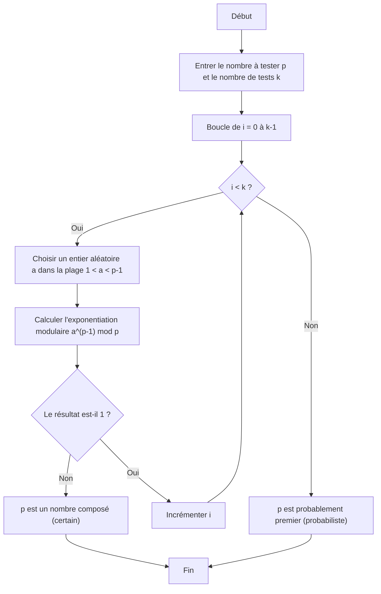
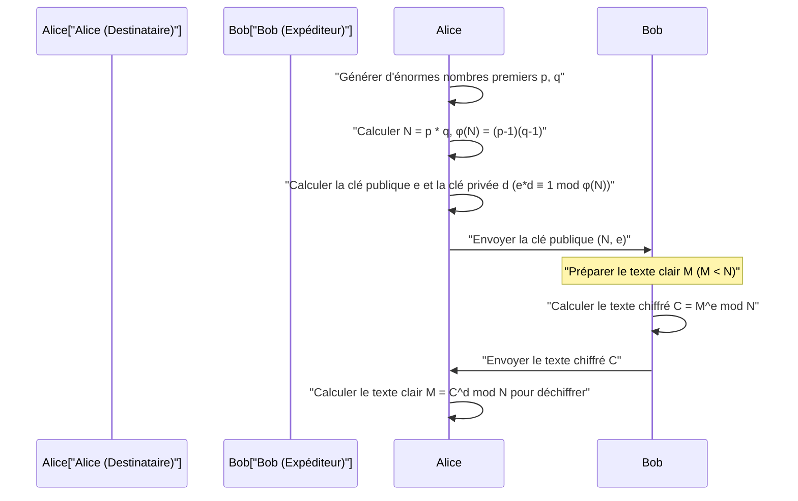

## 1. Introduction : Le mystère mathématique qui sous-tend la cryptographie moderne

Dans la société numérique d'aujourd'hui, et particulièrement dans les communications sur Internet, le "chiffrement" est devenu une technologie fondamentale indispensable. Le fait que nous puissions naviguer en toute sécurité sur des sites web via HTTPS dans nos navigateurs, effectuer des transactions financières par le biais des services bancaires en ligne, et avoir des échanges privés sur des applications de messagerie est dû aux protocoles cryptographiques basés sur des théories mathématiques avancées fonctionnant en arrière-plan. Parmi ceux-ci, la "cryptographie à clé publique" joue un rôle particulièrement important, dont le représentant le plus célèbre est le **chiffrement RSA**.

La sécurité et la validité de nombreux algorithmes cryptographiques, y compris RSA, dépendent fortement d'un théorème extrêmement beau et puissant découvert par le mathématicien français du 17e siècle, Pierre de Fermat. Il s'agit du **petit théorème de Fermat (Fermat's Little Theorem)**. De plus, le théorème de Leonhard Euler, qui généralise ce théorème, joue également un rôle décisif dans la théorie cryptographique.

Cet article explique en détail, depuis les bases, comment la découverte mathématique pure qu'est le petit théorème de Fermat s'applique aux technologies cryptographiques pratiques modernes, en particulier aux "tests de primalité" et au "chiffrement RSA". Il s'agit d'un guide technique très détaillé couvrant tout, des preuves mathématiques, aux mécanismes de chiffrement et de déchiffrement, jusqu'à l'implémentation concrète des algorithmes en C++ et Python.

---

## 2. Bases des congruences et de l'arithmétique modulaire

Pour comprendre le petit théorème de Fermat, vous devez d'abord vous familiariser avec le concept mathématique d'"arithmétique modulaire (congruences)". L'arithmétique modulaire est un système de calcul qui se concentre sur le "reste" lorsqu'un nombre est divisé par un nombre fixe (appelé module). Comme il s'agit d'un calcul similaire à celui du cadran d'une horloge (qui fait un tour en 12 heures), on l'appelle aussi parfois "mathématiques de l'horloge".

Lorsque le reste de la division de deux entiers $a$ et $b$ par un entier positif $n$ est égal, on l'écrit mathématiquement comme suit :

$$
a \equiv b \pmod n
$$

Cela se lit "$a$ et $b$ sont congrus modulo $n$". Par exemple, le reste de 17 divisé par 5 est 2, et le reste de 12 divisé par 5 est également 2. Par conséquent, on peut écrire ce qui suit :

$$
17 \equiv 12 \pmod 5 \equiv 2 \pmod 5
$$

En arithmétique modulaire, les quatre opérations arithmétiques habituelles (addition, soustraction, multiplication) s'appliquent telles quelles.

1. **Addition** : Si $a \equiv b \pmod n$ et $c \equiv d \pmod n$, alors $a + c \equiv b + d \pmod n$
2. **Soustraction** : Si $a \equiv b \pmod n$ et $c \equiv d \pmod n$, alors $a - c \equiv b - d \pmod n$
3. **Multiplication** : Si $a \equiv b \pmod n$ et $c \equiv d \pmod n$, alors $a \times c \equiv b \times d \pmod n$
4. **Exponentiation** : Si $a \equiv b \pmod n$, alors pour tout entier naturel $k$, $a^k \equiv b^k \pmod n$

Cependant, il faut faire attention à la **division**. En général, même si $a \times c \equiv b \times c \pmod n$, vous ne pouvez pas diviser les deux côtés par $c$ pour obtenir $a \equiv b \pmod n$. Cela n'est vrai que si $c$ et $n$ sont premiers entre eux (leur plus grand commun diviseur est 1). Ce concept d'"inverse modulaire" devient extrêmement important dans la génération de clés pour le chiffrement RSA, que nous aborderons plus tard.

---

## 3. Contexte mathématique et preuve du petit théorème de Fermat

Maintenant que nous avons couvert les bases de l'arithmétique modulaire, examinons le sujet principal, le petit théorème de Fermat.

### 3.1 Définition du théorème

Le petit théorème de Fermat est formulé comme suit :

> **Petit théorème de Fermat (Fermat's Little Theorem)**
> Soit $p$ un nombre premier et $a$ un entier quelconque qui n'est pas un multiple de $p$ (c'est-à-dire que $a$ et $p$ sont premiers entre eux). Alors, la congruence suivante est vraie :
> $$ a^{p-1} \equiv 1 \pmod p $$

Il est également courant d'exprimer ce théorème sous une forme valable pour tout entier $a$, en supprimant la condition "$a$ n'est pas un multiple de $p$". Dans ce cas, on multiplie les deux côtés par $a$, ce qui donne :

$$
a^p \equiv a \pmod p
$$

### 3.2 Vérification par des exemples concrets

Vérifions si le théorème se vérifie vraiment en utilisant des nombres concrets.
Soit le nombre premier $p = 5$. Alors $p-1 = 4$. Nous choisissons un entier pour $a$ qui n'est pas un multiple de $p$.

- Pour $a = 2$ : $2^{5-1} = 2^4 = 16$. $16 \div 5 = 3$ avec un reste de $1$. Donc $16 \equiv 1 \pmod 5$. (Vérifié)
- Pour $a = 3$ : $3^{5-1} = 3^4 = 81$. $81 \div 5 = 16$ avec un reste de $1$. Donc $81 \equiv 1 \pmod 5$. (Vérifié)
- Pour $a = 4$ : $4^{5-1} = 4^4 = 256$. $256 \div 5 = 51$ avec un reste de $1$. Donc $256 \equiv 1 \pmod 5$. (Vérifié)

Ainsi, quel que soit le $a$ que vous choisissez (à condition qu'il ne soit pas un multiple de 5), le reste de sa 4ème puissance divisée par 5 sera toujours 1. Cela ressemble à de la magie, mais cela découle des magnifiques propriétés des nombres premiers.

### 3.3 Preuve mathématique du théorème

Pourquoi cela est-il vrai ? Nous présentons ici une preuve élégante utilisant l'ensemble des classes de restes.

Considérons l'ensemble $S = \{1, 2, 3, \dots, p-1\}$. Ce sont les représentants des entiers dont les restes de la division par $p$ vont de $1$ à $p-1$.
Considérons maintenant un nouvel ensemble $T$ obtenu en multipliant chaque élément par un entier $a$ qui est premier avec $p$.
$$ T = \{1a, 2a, 3a, \dots, (p-1)a\} $$

Considérons les restes de chaque élément de cet ensemble $T$ divisé par $p$. Étonnamment, ces restes, bien que leur ordre puisse changer, correspondent exactement à l'ensemble des éléments de l'ensemble d'origine $S$.
Pourquoi ?
1. Les éléments de $T$ ne peuvent jamais être des multiples de $p$ (car ni $a$ ni les éléments d'origine ne sont des multiples de $p$).
2. Il n'y a pas deux éléments distincts dans $T$ qui sont congrus modulo $p$. Si $ia \equiv ja \pmod p$ ($i \neq j$), puisque $a$ et $p$ sont premiers entre eux, nous pouvons diviser par $a$ pour obtenir $i \equiv j \pmod p$, ce qui est une contradiction.

Par conséquent, le produit de tous les éléments de $S$ et le produit de tous les éléments de $T$ sont congrus modulo $p$.

$$
(1a) \times (2a) \times \dots \times ((p-1)a) \equiv 1 \times 2 \times \dots \times (p-1) \pmod p
$$

En réorganisant le côté gauche, puisqu'il y a $p-1$ termes de $a$,

$$
a^{p-1} \cdot (p-1)! \equiv (p-1)! \pmod p
$$

Comme $(p-1)!$ est premier avec $p$, nous pouvons diviser les deux côtés par $(p-1)!$, ce qui conduit finalement au théorème suivant :

$$
a^{p-1} \equiv 1 \pmod p
$$

Ceci est la preuve du petit théorème de Fermat.

---

## 4. La fonction indicatrice d'Euler et le théorème d'Euler

Le petit théorème de Fermat est un théorème concernant "un nombre premier $p$", mais il a été généralisé à "tout entier positif $n$" par Leonhard Euler. Cette extension est essentielle pour comprendre le chiffrement RSA.

### 4.1 La fonction indicatrice d'Euler $\phi(n)$

La fonction indicatrice d'Euler (ou fonction $\phi$ d'Euler) $\phi(n)$ est une fonction qui représente "le nombre d'entiers de $1$ à $n$ qui sont premiers avec $n$".

- Dans le cas d'un nombre premier $p$, puisque tous les entiers de $1$ à $p-1$ sont premiers avec $p$, $\phi(p) = p - 1$.
- Pour le produit de deux nombres premiers distincts $p$ et $q$, c'est-à-dire $n = p \times q$, $\phi(n)$ peut être calculé avec une formule très simple :
  $$ \phi(p \times q) = \phi(p) \times \phi(q) = (p - 1)(q - 1) $$

Cette propriété est la logique fondamentale derrière la génération de clés dans le chiffrement RSA.

### 4.2 Le théorème d'Euler

Euler a généralisé le petit théorème de Fermat comme suit :

> **Théorème d'Euler (Euler's Theorem)**
> Pour tout entier positif $n$ et tout entier $a$ qui lui est premier entre eux, ce qui suit est vrai :
> $$ a^{\phi(n)} \equiv 1 \pmod n $$

Si $n$ est un nombre premier $p$, alors $\phi(p) = p - 1$, donc cela devient exactement le petit théorème de Fermat ($a^{p-1} \equiv 1 \pmod p$). En d'autres termes, le petit théorème de Fermat n'est qu'un cas particulier du théorème d'Euler.

---

## 5. Trouver d'énormes nombres premiers : Le test de primalité de Fermat

Dans les technologies cryptographiques (comme le chiffrement RSA et l'échange de clés Diffie-Hellman), il est nécessaire de trouver rapidement "d'énormes nombres premiers" s'étendant sur des centaines de chiffres. Cependant, utiliser la méthode de la "division par essais", qui consiste à essayer de diviser par tous les nombres de $2$ à $\sqrt{N}$ pour déterminer si un grand nombre $N$ est premier, prendrait un temps équivalent à l'âge de l'univers.

C'est là qu'intervient le **test de primalité de Fermat (Fermat Primality Test)**, un "test de primalité probabiliste" qui utilise le petit théorème de Fermat à l'envers.

### 5.1 Qu'est-ce qu'un test de primalité probabiliste ?

Selon le petit théorème de Fermat, si $p$ est premier, alors $a^{p-1} \equiv 1 \pmod p$ est toujours vrai pour tout $a$ ($1 < a < p$).
La contraposée de cette affirmation est : "S'il existe un $a$ pour lequel $a^{p-1} \not\equiv 1 \pmod p$, alors $p$ **n'est absolument pas un nombre premier (c'est un nombre composé)**".

Par conséquent, si vous voulez déterminer si $N$ est premier, vous choisissez quelques valeurs aléatoires de $a$, calculez $a^{N-1} \pmod N$ et vérifiez si le résultat est $1$. Si vous obtenez une réponse autre que $1$ ne serait-ce qu'une seule fois, il est certain que $N$ est un nombre composé. S'il vaut $1$ peu importe le nombre de fois que vous essayez, vous pouvez juger avec une forte probabilité que $N$ est "probablement premier".

### 5.2 Explication de l'algorithme et organigramme

L'algorithme du test de Fermat est le suivant :



### 5.3 Le piège des nombres de Carmichael (pseudo-premiers)

Bien que le test de Fermat soit extrêmement rapide, il présente un défaut majeur. Il existe des nombres diaboliques qui, bien qu'ils soient composés, satisfont $a^{N-1} \equiv 1 \pmod N$ pour tous les $a$. Ceux-ci sont appelés **nombres de Carmichael (Carmichael numbers)**. Le plus petit nombre de Carmichael est $561$ ($3 \times 11 \times 17$).

En raison de l'existence des nombres de Carmichael, un test de Fermat pur seul ne peut pas déterminer la primalité de manière absolue. C'est pourquoi, dans les systèmes cryptographiques réels (comme OpenSSL), le **test de primalité de Miller-Rabin (Miller-Rabin primality test)**, qui est une version améliorée du test de Fermat, est utilisé en standard. Le test de Miller-Rabin peut détecter les nombres de Carmichael, réduisant ainsi la probabilité de fausse détection à presque zéro.

### 5.4 Exponentiation modulaire rapide (Méthode d'exponentiation par carrés)

Dans l'algorithme de test de primalité, il est nécessaire de calculer $a^{N-1} \pmod N$. Si $N$ est énorme, $a^{N-1}$ aura un nombre de chiffres astronomique et ne tiendra pas dans la mémoire d'un ordinateur.
La solution à ce problème est la **méthode d'exponentiation par carrés (Exponentiation by Squaring)** ou exponentiation modulaire. En prenant le modulo (mod N) à chaque étape du calcul, la valeur est toujours maintenue plus petite que $N$, ce qui permet un calcul très rapide (complexité temporelle $O(\log N)$).

---

## 6. Implémentation du test de primalité et de l'exponentiation modulaire

Maintenant, implémentons le test de primalité de Fermat et la méthode d'exponentiation par carrés en C++ et Python.

### 6.1 Implémentation en C++

En C++, les types d'entiers standard ont tendance à déborder facilement, donc une bibliothèque d'entiers à précision multiple (comme GMP) est nécessaire pour manipuler des nombres géants. Cependant, pour comprendre l'algorithme, nous montrons ici une implémentation dans la limite des entiers 64 bits (`unsigned long long`).

```cpp
#include <iostream>
#include <random>

using namespace std;

// Exponentiation modulaire rapide (a^b mod m) - Exponentiation par carrés
unsigned long long power_mod(unsigned long long a, unsigned long long b, unsigned long long m) {
    unsigned long long result = 1;
    a = a % m;
    while (b > 0) {
        // Si le bit de poids faible de b est 1, multiplier le résultat par a
        if (b % 2 == 1) {
            result = (__int128)result * a % m; // Extension en 128 bits pour éviter le débordement
        }
        // Élever a au carré
        a = (__int128)a * a % m;
        // Décaler b vers la droite (diviser par la moitié)
        b /= 2;
    }
    return result;
}

// Test de primalité de Fermat
bool fermat_is_prime(unsigned long long p, int iterations = 5) {
    if (p <= 1) return false;
    if (p <= 3) return true;
    if (p % 2 == 0) return false;

    random_device rd;
    mt19937_64 gen(rd());
    uniform_int_distribution<unsigned long long> dis(2, p - 2);

    for (int i = 0; i < iterations; ++i) {
        unsigned long long a = dis(gen);
        // Si a^(p-1) mod p n'est pas 1, alors c'est un nombre composé
        if (power_mod(a, p - 1, p) != 1) {
            return false;
        }
    }
    return true; // Probablement premier
}

int main() {
    unsigned long long num = 1000000007; // Nombre premier connu
    if (fermat_is_prime(num, 10)) {
        cout << num << " is probably prime." << endl;
    } else {
        cout << num << " is composite." << endl;
    }
    return 0;
}
```

### 6.2 Implémentation en Python

En Python, le type entier standard prend en charge les entiers à précision multiple, il n'y a donc pas besoin de s'inquiéter du débordement. De plus, la fonction intégrée `pow(a, b, m)` de Python utilise l'exponentiation par carrés en interne et est très rapide.

```python
import random

def fermat_is_prime(p, iterations=5):
    """
    Test de primalité probabiliste utilisant le test de Fermat
    """
    if p <= 1:
        return False
    if p <= 3:
        return True
    if p % 2 == 0:
        return False

    for _ in range(iterations):
        # Choisir un nombre aléatoire a entre 2 et p-2
        a = random.randint(2, p - 2)
        # Calculer a^(p-1) mod p. La fonction intégrée pow est rapide.
        if pow(a, p - 1, p) != 1:
            return False # Certitude que c'est un nombre composé

    return True # Probablement premier

# Test
number_to_test = 104729
if fermat_is_prime(number_to_test, 10):
    print(f"{number_to_test} est probablement premier.")
else:
    print(f"{number_to_test} est un nombre composé.")
```

---

## 7. Application au chiffrement RSA : Où Fermat et Euler se rencontrent

La plus grande application du petit théorème de Fermat (et du théorème d'Euler) est le **chiffrement RSA**, développé en 1977 par Rivest, Shamir et Adleman.
Le chiffrement RSA est un système révolutionnaire de "cryptographie à clé publique", qui réalise un mécanisme où la clé de chiffrement (clé publique) est rendue publique au monde entier, tandis que la clé de déchiffrement (clé privée) n'est connue que du destinataire.

Cette asymétrie repose sur la sécurité computationnelle selon laquelle "la factorisation en nombres premiers de nombres composés géants est extrêmement difficile".

### 7.1 Fonctionnement du chiffrement RSA (Génération de clés, Chiffrement, Déchiffrement)

Vérifions le flux de communication global du chiffrement RSA avec un diagramme de séquence Mermaid.



Voici une explication des étapes mathématiques détaillées.

#### Étape 1 : Génération de clés (Travail du destinataire Alice)

1. Générer aléatoirement deux énormes nombres premiers $p$ et $q$ (c'est là que la méthode de test de primalité mentionnée ci-dessus est utilisée).
2. Calculer leur produit $N = p \times q$. Ce $N$ est rendu public.
3. En utilisant la fonction indicatrice d'Euler, calculer $\phi(N) = (p-1)(q-1)$.
4. Choisir un entier $e$ (exposant public) qui est premier avec $\phi(N)$ (souvent $e = 65537$ est utilisé).
5. Calculer l'inverse modulaire $d$ (exposant privé) de $e$. C'est-à-dire, trouver $d$ qui satisfait ce qui suit :
   $$ e \cdot d \equiv 1 \pmod{\phi(N)} $$
   **L'algorithme d'Euclide étendu** est utilisé pour ce calcul.

La **clé publique est maintenant $(N, e)$** et la **clé privée est $(N, d)$**. ($p$, $q$, et $\phi(N)$ doivent être immédiatement détruits ou strictement dissimulés).

#### Étape 2 : Chiffrement (Travail de l'expéditeur Bob)

Supposons que Bob veuille envoyer un message $M$ à Alice ($M$ est la version numérisée des caractères, avec $0 \le M < N$).
Bob utilise la clé publique d'Alice $(N, e)$ pour effectuer le calcul suivant et créer le texte chiffré $C$.

$$
C \equiv M^e \pmod N
$$

Ce $C$ est envoyé à Alice via le réseau.

#### Étape 3 : Déchiffrement (Travail du destinataire Alice)

Alice, après avoir reçu le texte chiffré $C$, effectue le calcul suivant en utilisant sa clé privée $d$, qu'elle seule connaît.

$$
M' \equiv C^d \pmod N
$$

Étonnamment, ce résultat de calcul $M'$ correspond parfaitement au message original $M$.

### 7.2 Pourquoi cela peut-il être déchiffré ? (Preuve mathématique)

C'est ici que le petit théorème de Fermat (le théorème d'Euler) montre sa véritable valeur. Pourquoi $C^d \pmod N$ revient-il à $M$ ?

Développons la formule de déchiffrement.
Puisque $C \equiv M^e \pmod N$,
$$ C^d \equiv (M^e)^d \equiv M^{ed} \pmod N $$

Lors de l'étape de génération de clés, nous avons choisi $d$ de sorte que $e \cdot d \equiv 1 \pmod{\phi(N)}$. Cela signifie qu'il existe un entier $k$ tel qu'il peut s'écrire comme suit :
$$ e \cdot d = 1 + k \cdot \phi(N) $$

En substituant cela dans la formule ci-dessus :
$$ M^{ed} = M^{1 + k \cdot \phi(N)} = M \cdot M^{k \cdot \phi(N)} = M \cdot (M^{\phi(N)})^k \pmod N $$

Ici, le **théorème d'Euler** ($M^{\phi(N)} \equiv 1 \pmod N$) entre en jeu. (*Strictement parlant, $M$ et $N$ doivent être premiers entre eux, mais dans RSA, la probabilité que $M$ et $N$ ne soient pas premiers entre eux est astronomiquement faible, et en utilisant le théorème des restes chinois, il peut être prouvé que cela est vrai même s'ils ne sont pas premiers entre eux*).

En appliquant le théorème d'Euler, puisque $M^{\phi(N)} \equiv 1$,
$$ M \cdot (1)^k \equiv M \pmod N $$

$M$ est magnifiquement restauré ! Les propriétés des nombres que Fermat et Euler ont découvertes il y a des centaines d'années garantissent parfaitement la confidentialité des communications numériques modernes.

---

## 8. Implémentation jouet du chiffrement RSA (Python)

Comme il est difficile de saisir cela uniquement en théorie, utilisons Python pour implémenter réellement le processus de génération de clés, de chiffrement et de déchiffrement RSA. Bien qu'il s'agisse d'une "implémentation jouet" à des fins éducatives, les mathématiques utilisées sont exactement les mêmes que les vraies.

Nous inclurons également une implémentation de "l'algorithme d'Euclide étendu" pour trouver l'inverse modulaire $d$.

```python
import random

# Trouver le plus grand commun diviseur
def gcd(a, b):
    while b != 0:
        a, b = b, a % b
    return a

# Algorithme d'Euclide étendu (trouver x, y pour ax + by = gcd(a,b))
# Utilisé pour trouver d pour e*d ≡ 1 (mod φ(N))
def extended_gcd(a, b):
    if a == 0:
        return (b, 0, 1)
    else:
        g, y, x = extended_gcd(b % a, a)
        return (g, x - (b // a) * y, y)

def mod_inverse(e, phi):
    g, x, y = extended_gcd(e, phi)
    if g != 1:
        raise Exception("L'inverse n'existe pas")
    else:
        return x % phi

# Fonction de génération de nombres premiers (Version simplifiée : génère de petits nombres premiers)
def generate_prime(bits):
    while True:
        p = random.getrandbits(bits)
        # Jugement simplifié au lieu du test de Fermat mentionné ci-dessus
        if p > 1 and pow(2, p-1, p) == 1 and pow(3, p-1, p) == 1:
            return p

# Génération de clés RSA
def generate_keypair(bits=16):
    p = generate_prime(bits)
    q = generate_prime(bits)
    # S'assurer que p et q ne sont pas identiques
    while p == q:
        q = generate_prime(bits)

    n = p * q
    phi = (p - 1) * (q - 1)

    # e est souvent un nombre premier comme 65537, mais ici il est choisi aléatoirement
    e = random.randrange(1, phi)
    g = gcd(e, phi)
    while g != 1:
        e = random.randrange(1, phi)
        g = gcd(e, phi)

    # Calcul de la clé privée d
    d = mod_inverse(e, phi)
    
    # Clé publique (e, n), Clé privée (d, n)
    return ((e, n), (d, n))

def encrypt(pk, plaintext):
    e, n = pk
    # Calculer plaintext^e mod n
    cipher = [pow(ord(char), e, n) for char in plaintext]
    return cipher

def decrypt(sk, ciphertext):
    d, n = sk
    # Calculer cipher^d mod n et reconvertir en caractères
    plain = [chr(pow(char, d, n)) for char in ciphertext]
    return ''.join(plain)

# Exemple d'exécution
if __name__ == '__main__':
    print("--- Implémentation jouet du chiffrement RSA ---")
    public_key, private_key = generate_keypair(bits=12) # Utilisation de nombres premiers de 12 bits
    
    print(f"Clé publique (e, n): {public_key}")
    print(f"Clé privée (d, n): {private_key}")

    message = "Hello Math!"
    print(f"\nMessage d'origine : {message}")

    # Chiffrement
    encrypted_msg = encrypt(public_key, message)
    print(f"Texte chiffré : {encrypted_msg}")

    # Déchiffrement
    decrypted_msg = decrypt(private_key, encrypted_msg)
    print(f"Message déchiffré : {decrypted_msg}")
```

Lorsque vous exécutez ce code, vous pouvez voir le tableau de caractères être converti en un tableau de nombres peu familiers (texte chiffré), qui est ensuite magnifiquement restauré en la chaîne d'origine par la clé privée.

---

## 9. Conclusion : L'intersection de la beauté mathématique et de la praticité

Au 17ème siècle, lorsque Pierre de Fermat a découvert ce "petit théorème", personne ne pensait qu'il serait utile à quoi que ce soit. Fermat lui-même a mené des recherches en théorie des nombres par pure curiosité mathématique.

Cependant, environ 300 ans plus tard, dans les années 1970, à l'aube des réseaux informatiques, le théorème de Fermat a fait un retour spectaculaire en tant que technologie cryptographique essentielle pour l'établissement de protocoles de communication sécurisés. La technologie de test de primalité basée sur le petit théorème de Fermat et le chiffrement RSA basé sur le théorème d'Euler soutiennent littéralement l'infrastructure Internet moderne.

Les messages LINE que nous envoyons nonchalamment tous les jours, les achats sur Amazon, tout cela danse sur cette belle et simple formule $a^{p-1} \equiv 1 \pmod p$. Le petit théorème de Fermat nous enseigne que peu importe à quel point les mathématiques peuvent être abstraites, le moment viendra toujours où elles seront utiles à l'humanité.

Dans l'apprentissage de la programmation et de la théorie cryptographique, comprendre les structures mathématiques à la base de celles-ci sera une arme puissante pour comprendre en profondeur le comportement des bibliothèques fournies sous forme de boîtes noires et pour concevoir des systèmes plus sécurisés.
