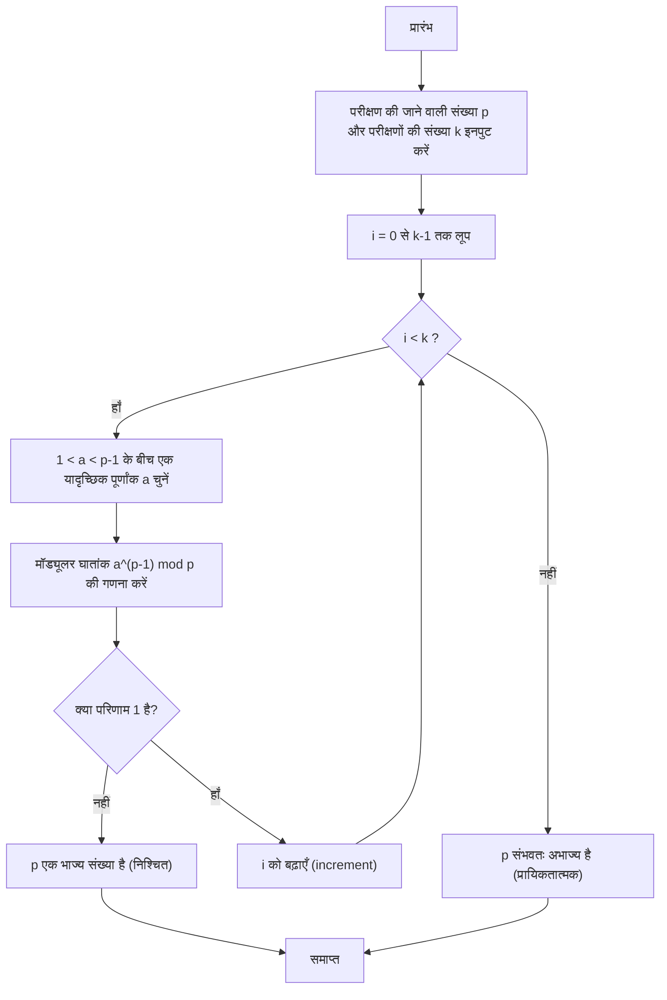
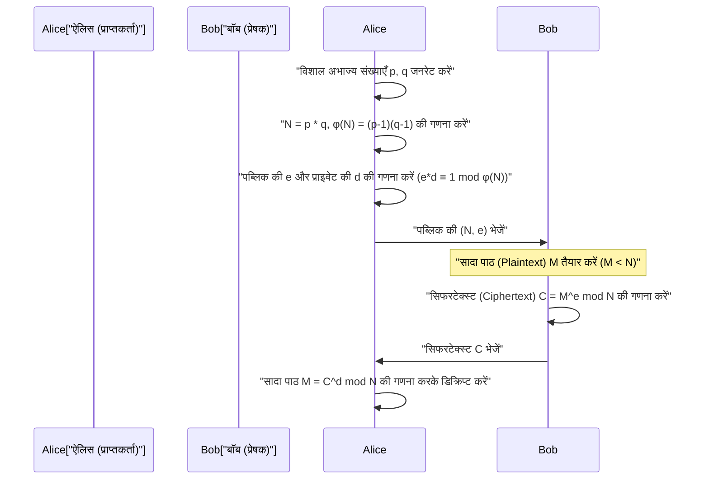

## 1. परिचय: आधुनिक क्रिप्टोग्राफी का समर्थन करने वाले गणित का रहस्य

आधुनिक डिजिटल समाज में, विशेष रूप से इंटरनेट के माध्यम से संचार में, 'क्रिप्टोग्राफी' (एन्क्रिप्शन) एक अपरिहार्य आधारभूत तकनीक बन गई है। हम वेब ब्राउज़र में HTTPS के माध्यम से सुरक्षित रूप से वेबसाइट ब्राउज़ कर सकते हैं, ऑनलाइन बैंकिंग में वित्तीय लेनदेन कर सकते हैं, और मैसेजिंग ऐप्स पर निजी बातचीत कर सकते हैं, यह सब उन्नत गणितीय सिद्धांतों द्वारा समर्थित क्रिप्टोग्राफ़िक प्रोटोकॉल के बैकग्राउंड में काम करने के कारण संभव है। इनमें से 'पब्लिक-की क्रिप्टोग्राफी' (सार्वजनिक-कुंजी क्रिप्टोग्राफी) एक बहुत ही महत्वपूर्ण भूमिका निभाती है, और इसका सबसे प्रमुख उदाहरण **RSA क्रिप्टोग्राफी** है।

RSA सहित कई क्रिप्टोग्राफिक एल्गोरिदम की सुरक्षा और वैधता 17वीं सदी के फ्रांसीसी गणितज्ञ पियरे डी फर्मेट (Pierre de Fermat) द्वारा खोजे गए एक अत्यंत सुंदर और शक्तिशाली प्रमेय पर काफी हद तक निर्भर करती है। यह **फर्मेट का छोटा प्रमेय (Fermat's Little Theorem)** है। इसके अलावा, लियोनहार्ड यूलर (Leonhard Euler) का प्रमेय, जो कि इसका सामान्यीकरण है, भी क्रिप्टोग्राफिक सिद्धांत में एक निर्णायक भूमिका निभाता है।

इस लेख में, हम शुरुआत से गहराई से बताएंगे कि कैसे फर्मेट के छोटे प्रमेय, जो कि शुद्ध गणित की एक खोज है, को आधुनिक व्यावहारिक क्रिप्टोग्राफिक तकनीकों, विशेष रूप से 'अभाज्य संख्या परीक्षण' (Primality Test) और 'RSA क्रिप्टोग्राफी' में लागू किया जाता है। यह एक बहुत विस्तृत तकनीकी मार्गदर्शिका होगी, जिसमें गणितीय प्रमाण, एन्क्रिप्शन और डिक्रिप्शन के तंत्र, और C++ और Python का उपयोग करके विशिष्ट एल्गोरिदम के कार्यान्वयन को शामिल किया गया है।

---

## 2. सर्वांगसमता (Congruence) और मॉड्यूलर अंकगणित के मूल सिद्धांत

फर्मेट के छोटे प्रमेय को समझने के लिए, सबसे पहले 'मॉड्यूलर अंकगणित (सर्वांगसमता)' की गणितीय अवधारणा से परिचित होना आवश्यक है। मॉड्यूलर अंकगणित गणना की एक प्रणाली है जो किसी निश्चित संख्या (जिसे मॉड्यूलस कहा जाता है) से विभाजित करने पर प्राप्त 'शेषफल' (remainder) पर केंद्रित होती है। चूंकि यह घड़ी के डायल (जो 12 घंटे में एक चक्कर पूरा करता है) की तरह एक गणना है, इसे अक्सर 'घड़ी का गणित' भी कहा जाता है।

जब पूर्णांक $a$ और $b$ को धनात्मक पूर्णांक $n$ से विभाजित करने पर शेषफल समान होता है, तो गणितीय रूप से इसे इस प्रकार लिखा जाता है:

$$
a \equiv b \pmod n
$$

इसे इस प्रकार पढ़ा जाता है: "$a$ और $b$ मॉड्यूलो $n$ सर्वांगसम (congruent) हैं"। उदाहरण के लिए, 17 को 5 से भाग देने पर शेषफल 2 आता है, और 12 को 5 से भाग देने पर भी शेषफल 2 आता है। इसलिए, इसे इस प्रकार लिखा जा सकता है:

$$
17 \equiv 12 \pmod 5 \equiv 2 \pmod 5
$$

मॉड्यूलर अंकगणित में, सामान्य बुनियादी अंकगणितीय संक्रियाएँ (जोड़, घटाव, गुणा) वैसे ही लागू होती हैं:

1. **जोड़ (Addition)**: यदि $a \equiv b \pmod n$ और $c \equiv d \pmod n$, तो $a + c \equiv b + d \pmod n$
2. **घटाव (Subtraction)**: यदि $a \equiv b \pmod n$ और $c \equiv d \pmod n$, तो $a - c \equiv b - d \pmod n$
3. **गुणा (Multiplication)**: यदि $a \equiv b \pmod n$ और $c \equiv d \pmod n$, तो $a \times c \equiv b \times d \pmod n$
4. **घातांक (Exponentiation)**: यदि $a \equiv b \pmod n$, तो किसी भी प्राकृतिक संख्या $k$ के लिए $a^k \equiv b^k \pmod n$

हालाँकि, **भाग (Division)** के संबंध में सावधानी बरतने की आवश्यकता है। सामान्य तौर पर, यदि $a \times c \equiv b \times c \pmod n$ है, तो इसका मतलब यह नहीं है कि हम दोनों पक्षों को $c$ से भाग देकर $a \equiv b \pmod n$ कर सकते हैं। यह केवल तभी सत्य होता है जब $c$ और $n$ सह-अभाज्य (coprime) हों (यानी, उनका महत्तम समापवर्तक 1 हो)। 'मॉड्यूलर व्युत्क्रम (Modular inverse)' की यह अवधारणा RSA क्रिप्टोग्राफी में कुंजी निर्माण (key generation) के लिए अत्यंत महत्वपूर्ण है, जिस पर हम बाद में चर्चा करेंगे।

---

## 3. फर्मेट के छोटे प्रमेय की गणितीय पृष्ठभूमि और प्रमाण

मॉड्यूलर अंकगणित के मूल सिद्धांतों को समझने के बाद, आइए हमारे मुख्य विषय, फर्मेट के छोटे प्रमेय (Fermat's Little Theorem) पर नज़र डालते हैं।

### 3.1 प्रमेय की परिभाषा

फर्मेट के छोटे प्रमेय को इस प्रकार तैयार किया गया है:

> **फर्मेट का छोटा प्रमेय (Fermat's Little Theorem)**
> मान लीजिए कि $p$ एक अभाज्य संख्या (prime number) है, और $a$ कोई ऐसा पूर्णांक है जो $p$ का गुणज नहीं है (अर्थात $a$ और $p$ सह-अभाज्य हैं)। इस स्थिति में, निम्नलिखित सर्वांगसमता (congruence) सत्य होगी:
> $$ a^{p-1} \equiv 1 \pmod p $$

इसके अलावा, "$a$, $p$ का गुणज नहीं है" की शर्त को हटाकर इसे एक ऐसे रूप में व्यक्त करना भी आम है जो सभी पूर्णांकों $a$ के लिए सही है। उस स्थिति में, दोनों पक्षों को $a$ से गुणा करने पर निम्नलिखित प्राप्त होता है:

$$
a^p \equiv a \pmod p
$$

### 3.2 विशिष्ट उदाहरणों के साथ सत्यापन

आइए विशिष्ट संख्याओं का उपयोग करके जांचें कि क्या यह प्रमेय वास्तव में काम करता है।
मान लें कि अभाज्य संख्या $p = 5$ है। तो $p-1 = 4$ होगा। हम $a$ के रूप में एक पूर्णांक चुनते हैं जो $p$ का गुणज नहीं है।

- यदि $a = 2$: $2^{5-1} = 2^4 = 16$. $16 \div 5 = 3$ शेषफल $1$. अतः $16 \equiv 1 \pmod 5$. (सत्यापित)
- यदि $a = 3$: $3^{5-1} = 3^4 = 81$. $81 \div 5 = 16$ शेषफल $1$. अतः $81 \equiv 1 \pmod 5$. (सत्यापित)
- यदि $a = 4$: $4^{5-1} = 4^4 = 256$. $256 \div 5 = 51$ शेषफल $1$. अतः $256 \equiv 1 \pmod 5$. (सत्यापित)

इस प्रकार, हम जो भी $a$ चुनते हैं (जब तक कि वह 5 का गुणज न हो), उसे घात 4 तक बढ़ाने और 5 से भाग देने पर शेषफल हमेशा 1 होगा। यह जादू जैसा लग सकता है, लेकिन यह अभाज्य संख्याओं के सुंदर गुणों से उत्पन्न होता है।

### 3.3 प्रमेय का गणितीय प्रमाण

ऐसा क्यों होता है? यहाँ हम अवशिष्ट वर्गों (residue classes) के सेट का उपयोग करते हुए एक सुरुचिपूर्ण प्रमाण प्रस्तुत करते हैं।

मान लीजिए एक सेट $S = \{1, 2, 3, \dots, p-1\}$ है। ये उन पूर्णांकों के प्रतिनिधि हैं जिन्हें $p$ से विभाजित करने पर शेषफल $1$ से $p-1$ तक आते हैं।
अब, एक नए सेट $T$ पर विचार करें जहाँ $S$ के प्रत्येक तत्व को $p$ के साथ सह-अभाज्य पूर्णांक $a$ से गुणा किया गया है:
$$ T = \{1a, 2a, 3a, \dots, (p-1)a\} $$

इस सेट $T$ के प्रत्येक तत्व को $p$ से विभाजित करने पर प्राप्त शेषफलों पर विचार करें। आश्चर्यजनक रूप से, ये शेषफल, भले ही उनका क्रम बदल गया हो, मूल सेट $S$ के तत्वों से पूरी तरह मेल खाएंगे।
ऐसा इसलिए है क्योंकि:
1. $T$ का कोई भी तत्व $p$ का गुणज नहीं हो सकता (क्योंकि न तो $a$ और न ही मूल तत्व $p$ के गुणज हैं)।
2. $T$ में ऐसे कोई दो भिन्न तत्व नहीं हैं जो मॉड्यूलो $p$ सर्वांगसम हों। यदि $ia \equiv ja \pmod p$ (जहाँ $i \neq j$) है, तो चूंकि $a$ और $p$ सह-अभाज्य हैं, हम $a$ से भाग दे सकते हैं और $i \equiv j \pmod p$ प्राप्त कर सकते हैं, जो एक विरोधाभास है।

इसलिए, $S$ के सभी तत्वों का गुणनफल और $T$ के सभी तत्वों का गुणनफल मॉड्यूलो $p$ सर्वांगसम होंगे।

$$
(1a) \times (2a) \times \dots \times ((p-1)a) \equiv 1 \times 2 \times \dots \times (p-1) \pmod p
$$

बायें पक्ष को व्यवस्थित करने पर, चूंकि $a$, $p-1$ बार है:

$$
a^{p-1} \cdot (p-1)! \equiv (p-1)! \pmod p
$$

चूंकि $(p-1)!$ और $p$ सह-अभाज्य हैं, हम दोनों पक्षों को $(p-1)!$ से भाग दे सकते हैं, जिससे अंततः निम्नलिखित प्रमेय प्राप्त होता है:

$$
a^{p-1} \equiv 1 \pmod p
$$

यह फर्मेट के छोटे प्रमेय का प्रमाण है।

---

## 4. यूलर का टोटिएंट फलन (Euler's Totient Function) और यूलर का प्रमेय

फर्मेट का छोटा प्रमेय 'अभाज्य संख्या $p$' के बारे बारे में है, लेकिन लियोनहार्ड यूलर ने इसे 'किसी भी धनात्मक पूर्णांक $n$' के लिए सामान्यीकृत किया। RSA क्रिप्टोग्राफी को समझने के लिए यह विस्तार आवश्यक है।

### 4.1 यूलर का टोटिएंट फलन $\phi(n)$

यूलर का टोटिएंट फलन (या यूलर का $\phi$ फलन) $\phi(n)$ एक ऐसा फलन है जो "$1$ से $n$ तक के उन पूर्णांकों की संख्या को दर्शाता है जो $n$ के साथ सह-अभाज्य हैं"।

- किसी अभाज्य संख्या $p$ के लिए, $1$ से $p-1$ तक के सभी पूर्णांक $p$ के साथ सह-अभाज्य होते हैं, इसलिए $\phi(p) = p - 1$ होगा।
- दो भिन्न अभाज्य संख्याओं $p, q$ के लिए, यदि उनका गुणनफल $n = p \times q$ है, तो $\phi(n)$ को एक बहुत ही सरल सूत्र द्वारा निकाला जा सकता है:
  $$ \phi(p \times q) = \phi(p) \times \phi(q) = (p - 1)(q - 1) $$

यह गुण RSA क्रिप्टोग्राफी में कुंजी निर्माण का मूल तर्क (logic) बन जाता है।

### 4.2 यूलर का प्रमेय

यूलर ने फर्मेट के छोटे प्रमेय को इस प्रकार सामान्यीकृत किया:

> **यूलर का प्रमेय (Euler's Theorem)**
> एक धनात्मक पूर्णांक $n$ और उसके साथ सह-अभाज्य पूर्णांक $a$ के लिए, निम्नलिखित सत्य है:
> $$ a^{\phi(n)} \equiv 1 \pmod n $$

यदि $n$ एक अभाज्य संख्या $p$ है, तो $\phi(p) = p - 1$, जिसका अर्थ है कि यह स्वयं फर्मेट का छोटा प्रमेय ($a^{p-1} \equiv 1 \pmod p$) बन जाता है। दूसरे शब्दों में, फर्मेट का छोटा प्रमेय यूलर के प्रमेय का ही एक विशेष मामला है।

---

## 5. विशाल अभाज्य संख्याएँ ढूँढना: फर्मेट का अभाज्य परीक्षण (Primality Test)

क्रिप्टोग्राफी (जैसे RSA क्रिप्टोग्राफी और डिफी-हेलमैन (Diffie-Hellman) कुंजी विनिमय) में, सैकड़ों अंकों की 'विशाल अभाज्य संख्याएँ' तेज़ी से खोजना आवश्यक है। हालाँकि, यह निर्धारित करने के लिए कि क्या एक विशाल संख्या $N$ अभाज्य है, 'परीक्षण विभाजन विधि' (Trial division), जिसमें $2$ से $\sqrt{N}$ तक की सभी संख्याओं से भाग देकर जाँचा जाता है, में ब्रह्मांड के जीवनकाल जितना समय लग सकता है।

यहीं पर फर्मेट के छोटे प्रमेय का उपयोग करने वाला 'प्रायिकतात्मक अभाज्य परीक्षण' (Probabilistic primality test), जिसे **फर्मेट टेस्ट (Fermat Primality Test)** कहा जाता है, सामने आता है।

### 5.1 प्रायिकतात्मक अभाज्य परीक्षण क्या है?

फर्मेट के छोटे प्रमेय के अनुसार, यदि $p$ अभाज्य है, तो किसी भी $a$ ($1 < a < p$) के लिए, $a^{p-1} \equiv 1 \pmod p$ हमेशा सत्य होगा।
इसका प्रतिलोम (contrapositive) लेने पर हम कह सकते हैं, "यदि किसी $a$ के लिए $a^{p-1} \not\equiv 1 \pmod p$ है, तो $p$ **निश्चित रूप से अभाज्य नहीं है (यह एक भाज्य संख्या (composite number) है)**"।

इसलिए, यदि हम परीक्षण करना चाहते हैं कि क्या $N$ अभाज्य है, तो हम यादृच्छिक रूप से कुछ $a$ चुनते हैं, $a^{N-1} \pmod N$ की गणना करते हैं, और जांचते हैं कि क्या यह $1$ है। यदि उत्तर एक बार भी $1$ के अलावा कुछ और आता है, तो $N$ निश्चित रूप से एक भाज्य संख्या है। यदि कई बार परीक्षण करने के बाद भी यह $1$ आता है, तो हम उच्च संभावना के साथ कह सकते हैं कि $N$ "संभवतः अभाज्य (probably prime)" है।

### 5.2 एल्गोरिदम का विवरण और फ़्लोचार्ट

फर्मेट टेस्ट का एल्गोरिदम इस प्रकार है:



### 5.3 कारमाइकल संख्याएँ (Pseudoprimes) का जाल

फर्मेट टेस्ट बहुत तेज़ है, लेकिन इसमें एक गंभीर दोष है। कुछ ऐसी दुष्ट संख्याएँ होती हैं जो भाज्य (composite) होने के बावजूद, सभी $a$ के लिए $a^{N-1} \equiv 1 \pmod N$ को संतुष्ट करती हैं। इन्हें **कारमाइकल संख्याएँ (Carmichael numbers)** कहा जाता है। सबसे छोटी कारमाइकल संख्या $561$ ($3 \times 11 \times 17$) है।

कारमाइकल संख्याओं के अस्तित्व के कारण, केवल शुद्ध फर्मेट टेस्ट से पूर्ण अभाज्य परीक्षण नहीं किया जा सकता है। इसलिए, वास्तविक एन्क्रिप्शन सिस्टम (जैसे OpenSSL) मानक के रूप में **मिलर-राबिन (Miller-Rabin) अभाज्य परीक्षण** का उपयोग करते हैं, जो फर्मेट टेस्ट का एक उन्नत संस्करण है। मिलर-राबिन परीक्षण कारमाइकल संख्याओं का पता लगा सकता है, जिससे गलत निर्णय की संभावना लगभग शून्य हो जाती है।

### 5.4 तेज़ मॉड्यूलर घातांक (Exponentiation by Squaring)

अभाज्य परीक्षण एल्गोरिदम में, $a^{N-1} \pmod N$ की गणना करना आवश्यक है, लेकिन यदि $N$ बहुत बड़ा है, तो $a^{N-1}$ खगोलीय अंकों में होगा और कंप्यूटर की मेमोरी में फिट नहीं होगा।
इसका समाधान **निरंतर वर्ग विधि (Exponentiation by Squaring)** या मॉड्यूलर घातांक (modular exponentiation) है। गणना के प्रत्येक चरण में मॉड्यूलो (mod N) लेने से, मान हमेशा $N$ से छोटा रखा जाता है, जिससे गणना बहुत तेज़ी से (समय जटिलता $O(\log N)$ में) की जा सकती है।

---

## 6. अभाज्य परीक्षण और मॉड्यूलर घातांक का कार्यान्वयन

तो चलिए C++ और Python में फर्मेट अभाज्य परीक्षण और निरंतर वर्ग विधि (exponentiation by squaring) को लागू करते हैं।

### 6.1 C++ में कार्यान्वयन

C++ में, मानक पूर्णांक प्रकार (standard integer types) आसानी से ओवरफ़्लो हो जाते हैं, इसलिए बड़ी संख्याओं को संभालने के लिए मल्टी-प्रिसिजन इंटीजर लाइब्रेरी (जैसे GMP) की आवश्यकता होती है, लेकिन यहाँ हम एल्गोरिदम को समझने के लिए 64-बिट पूर्णांक (`unsigned long long`) की सीमा के भीतर एक कार्यान्वयन दिखाएंगे।

```cpp
#include <iostream>
#include <random>

using namespace std;

// तेज़ मॉड्यूलर घातांक (a^b mod m) - निरंतर वर्ग विधि (Exponentiation by squaring)
unsigned long long power_mod(unsigned long long a, unsigned long long b, unsigned long long m) {
    unsigned long long result = 1;
    a = a % m;
    while (b > 0) {
        // यदि b का सबसे निचला बिट 1 है, तो परिणाम को a से गुणा करें
        if (b % 2 == 1) {
            result = (__int128)result * a % m; // ओवरफ़्लो रोकने के लिए 128-बिट विस्तार
        }
        // a का वर्ग करें
        a = (__int128)a * a % m;
        // b को राइट शिफ्ट करें (आधा करें)
        b /= 2;
    }
    return result;
}

// फर्मेट का अभाज्य परीक्षण
bool fermat_is_prime(unsigned long long p, int iterations = 5) {
    if (p <= 1) return false;
    if (p <= 3) return true;
    if (p % 2 == 0) return false;

    random_device rd;
    mt19937_64 gen(rd());
    uniform_int_distribution<unsigned long long> dis(2, p - 2);

    for (int i = 0; i < iterations; ++i) {
        unsigned long long a = dis(gen);
        // यदि a^(p-1) mod p, 1 नहीं है, तो यह भाज्य संख्या है
        if (power_mod(a, p - 1, p) != 1) {
            return false;
        }
    }
    return true; // संभवतः अभाज्य
}

int main() {
    unsigned long long num = 1000000007; // ज्ञात अभाज्य
    if (fermat_is_prime(num, 10)) {
        cout << num << " is probably prime." << endl;
    } else {
        cout << num << " is composite." << endl;
    }
    return 0;
}
```

### 6.2 Python में कार्यान्वयन

Python का मानक पूर्णांक प्रकार (standard integer type) मनमाने आकार की संख्याओं (arbitrary-precision integers) का समर्थन करता है, इसलिए ओवरफ्लो के बारे में चिंता करने की कोई आवश्यकता नहीं है। इसके अलावा, Python का अंतर्निहित फ़ंक्शन `pow(a, b, m)` आंतरिक रूप से निरंतर वर्ग विधि का उपयोग करता है, इसलिए यह बहुत तेज़ है।

```python
import random

def fermat_is_prime(p, iterations=5):
    """
    फर्मेट के अभाज्य परीक्षण का उपयोग करके प्रायिकतात्मक अभाज्य परीक्षण
    """
    if p <= 1:
        return False
    if p <= 3:
        return True
    if p % 2 == 0:
        return False

    for _ in range(iterations):
        # 2 से p-2 के बीच एक यादृच्छिक संख्या a चुनें
        a = random.randint(2, p - 2)
        # a^(p-1) mod p की गणना करें। अंतर्निहित pow बहुत तेज़ है।
        if pow(a, p - 1, p) != 1:
            return False # निश्चित भाज्य

    return True # संभवतः अभाज्य

# परीक्षण
number_to_test = 104729
if fermat_is_prime(number_to_test, 10):
    print(f"{number_to_test} संभवतः अभाज्य है।")
else:
    print(f"{number_to_test} एक भाज्य संख्या है।")
```

---

## 7. RSA क्रिप्टोग्राफी में अनुप्रयोग: जहाँ फर्मेट और यूलर फलीभूत होते हैं

फर्मेट के छोटे प्रमेय (और यूलर के प्रमेय) का सबसे बड़ा अनुप्रयोग 1977 में रिवेस्ट, शमीर और एडलमैन द्वारा विकसित **RSA क्रिप्टोग्राफी** है।
RSA क्रिप्टोग्राफी एक क्रांतिकारी प्रणाली है जिसे 'पब्लिक-की क्रिप्टोग्राफी' (public-key cryptography) कहा जाता है। यह एक ऐसा तंत्र प्रदान करता है जहाँ एन्क्रिप्ट करने के लिए कुंजी (पब्लिक की/सार्वजनिक कुंजी) दुनिया के सामने सार्वजनिक की जा सकती है, जबकि डिक्रिप्ट करने वाली कुंजी (प्राइवेट की/निजी कुंजी) केवल प्राप्तकर्ता को ही पता होती है।

यह विषमता (asymmetry) इस कम्प्यूटेशनल सुरक्षा पर आधारित है कि "विशाल भाज्य संख्याओं का अभाज्य गुणनखंडन (prime factorization) अत्यंत कठिन है"।

### 7.1 RSA क्रिप्टोग्राफी तंत्र (कुंजी निर्माण, एन्क्रिप्शन, डिक्रिप्शन)

आइए मर्मेड (Mermaid) अनुक्रम आरेख (sequence diagram) के माध्यम से RSA क्रिप्टोग्राफी के समग्र संचार प्रवाह की जांच करें।



नीचे गणितीय चरणों का विस्तृत विवरण दिया गया है।

#### चरण 1: कुंजी निर्माण (प्राप्तकर्ता ऐलिस का कार्य)

1. दो विशाल अभाज्य संख्याएँ $p$ और $q$ यादृच्छिक रूप से जनरेट करें (यहाँ पहले उल्लिखित अभाज्य परीक्षण विधि का उपयोग किया जाता है)।
2. उनके गुणनफल $N = p \times q$ की गणना करें। यह $N$ सार्वजनिक किया जाता है।
3. यूलर के टोटिएंट फलन का उपयोग करते हुए, $\phi(N) = (p-1)(q-1)$ की गणना करें।
4. $\phi(N)$ के साथ सह-अभाज्य एक पूर्णांक $e$ (सार्वजनिक घातांक/public exponent) चुनें (अक्सर $e = 65537$ का उपयोग किया जाता है)।
5. $e$ के मॉड्यूलर व्युत्क्रम (modular inverse) $d$ (निजी घातांक/private exponent) की गणना करें। अर्थात, ऐसा $d$ खोजें जो निम्नलिखित को संतुष्ट करे:
   $$ e \cdot d \equiv 1 \pmod{\phi(N)} $$
   इस गणना के लिए **विस्तारित यूक्लिडियन एल्गोरिदम (Extended Euclidean Algorithm)** का उपयोग किया जाता है।

इसके साथ, **पब्लिक की (सार्वजनिक कुंजी) $(N, e)$** और **प्राइवेट की (निजी कुंजी) $(N, d)$** हो जाती है। ($p, q,$ और $\phi(N)$ को तुरंत नष्ट कर दिया जाना चाहिए या सख्ती से छिपाकर रखा जाना चाहिए)।

#### चरण 2: एन्क्रिप्शन (प्रेषक बॉब का कार्य)

मान लें कि बॉब ऐलिस को एक संदेश $M$ भेजना चाहता है ($M$ वर्णों (characters) का एक संख्यात्मक प्रतिनिधित्व है, जहाँ $0 \le M < N$ है)।
बॉब ऐलिस की पब्लिक की $(N, e)$ का उपयोग करता है और सिफरटेक्स्ट (Ciphertext) $C$ बनाने के लिए निम्नलिखित गणना करता है:

$$
C \equiv M^e \pmod N
$$

वह इस $C$ को नेटवर्क के माध्यम से ऐलिस को भेजता है।

#### चरण 3: डिक्रिप्शन (प्राप्तकर्ता ऐलिस का कार्य)

सिफरटेक्स्ट $C$ प्राप्त करने के बाद, ऐलिस अपनी गुप्त प्राइवेट की $d$ का उपयोग करके निम्नलिखित गणना करती है:

$$
M' \equiv C^d \pmod N
$$

आश्चर्यजनक रूप से, यह गणना परिणाम $M'$ मूल संदेश $M$ से पूरी तरह मेल खाता है।

### 7.2 इसे डिक्रिप्ट क्यों किया जा सकता है? (गणितीय प्रमाण)

यहीं पर फर्मेट का छोटा प्रमेय (यूलर का प्रमेय) अपनी वास्तविक शक्ति दिखाता है। $C^d \pmod N$, $M$ में वापस क्यों बदल जाता है?

आइए डिक्रिप्शन समीकरण का विस्तार करें:
चूंकि $C \equiv M^e \pmod N$ है,
$$ C^d \equiv (M^e)^d \equiv M^{ed} \pmod N $$

कुंजी निर्माण चरण में, हमने $d$ को इस प्रकार चुना था कि $e \cdot d \equiv 1 \pmod{\phi(N)}$ हो। इसका मतलब है कि एक ऐसा पूर्णांक $k$ मौजूद है जिसे इस प्रकार लिखा जा सकता है:
$$ e \cdot d = 1 + k \cdot \phi(N) $$

इसे उपरोक्त समीकरण में प्रतिस्थापित (substitute) करने पर:
$$ M^{ed} = M^{1 + k \cdot \phi(N)} = M \cdot M^{k \cdot \phi(N)} = M \cdot (M^{\phi(N)})^k \pmod N $$

यहीं पर **यूलर का प्रमेय** ($M^{\phi(N)} \equiv 1 \pmod N$) लागू होता है। (※कड़ाई से कहें तो, $M$ और $N$ का सह-अभाज्य होना आवश्यक है, लेकिन RSA में, $M$ और $N$ के सह-अभाज्य न होने की संभावना खगोलीय रूप से कम है, और यह सिद्ध किया जा सकता है कि चाइनीज़ रिमाइंडर थ्योरम (Chinese Remainder Theorem) का उपयोग करके यह सह-अभाज्य न होने पर भी काम करता है)।

यूलर के प्रमेय को लागू करने पर, चूंकि $M^{\phi(N)} \equiv 1$ है:
$$ M \cdot (1)^k \equiv M \pmod N $$

सफलतापूर्वक $M$ को बहाल कर लिया गया है! संख्याओं के वे गुण, जिन्हें फर्मेट और यूलर ने सैकड़ों साल पहले खोजा था, आज आधुनिक डिजिटल संचार की गोपनीयता की पूरी तरह से गारंटी देते हैं।

---

## 8. RSA क्रिप्टोग्राफी का टॉय इम्प्लीमेंटेशन (Python)

केवल सिद्धांत के साथ इसे महसूस करना मुश्किल हो सकता है, तो चलिए Python का उपयोग करके वास्तविक RSA कुंजी जनरेशन, एन्क्रिप्शन और डिक्रिप्शन प्रक्रिया को लागू करते हैं। यह एक शैक्षिक "टॉय इम्प्लीमेंटेशन (toy implementation)" है, लेकिन इसमें प्रयुक्त गणित बिल्कुल वास्तविक के समान है।

हम मॉड्यूलर व्युत्क्रम (modular inverse) $d$ खोजने के लिए "विस्तारित यूक्लिडियन एल्गोरिदम (Extended Euclidean Algorithm)" को भी कार्यान्वयन में शामिल करेंगे।

```python
import random

# महत्तम समापवर्तक (GCD) खोजें
def gcd(a, b):
    while b != 0:
        a, b = b, a % b
    return a

# विस्तारित यूक्लिडियन एल्गोरिदम (ax + by = gcd(a,b) के x, y खोजें)
# e*d ≡ 1 (mod φ(N)) के लिए d खोजने के लिए उपयोग किया जाता है
def extended_gcd(a, b):
    if a == 0:
        return (b, 0, 1)
    else:
        g, y, x = extended_gcd(b % a, a)
        return (g, x - (b // a) * y, y)

def mod_inverse(e, phi):
    g, x, y = extended_gcd(e, phi)
    if g != 1:
        raise Exception('व्युत्क्रम मौजूद नहीं है')
    else:
        return x % phi

# अभाज्य जनरेशन फ़ंक्शन (सरलीकृत संस्करण: छोटी अभाज्य संख्याएँ जनरेट करें)
def generate_prime(bits):
    while True:
        p = random.getrandbits(bits)
        # पहले बताए गए फर्मेट टेस्ट के बजाय सरल परीक्षण
        if p > 1 and pow(2, p-1, p) == 1 and pow(3, p-1, p) == 1:
            return p

# RSA कुंजी जनरेशन
def generate_keypair(bits=16):
    p = generate_prime(bits)
    q = generate_prime(bits)
    # सुनिश्चित करें कि p और q समान न हों
    while p == q:
        q = generate_prime(bits)

    n = p * q
    phi = (p - 1) * (q - 1)

    # e के लिए अक्सर 65537 जैसी अभाज्य संख्या का उपयोग किया जाता है, लेकिन यहाँ इसे यादृच्छिक रूप से चुना गया है
    e = random.randrange(1, phi)
    g = gcd(e, phi)
    while g != 1:
        e = random.randrange(1, phi)
        g = gcd(e, phi)

    # प्राइवेट की d की गणना
    d = mod_inverse(e, phi)
    
    # पब्लिक की (e, n), प्राइवेट की (d, n)
    return ((e, n), (d, n))

def encrypt(pk, plaintext):
    e, n = pk
    # plaintext^e mod n की गणना करें
    cipher = [pow(ord(char), e, n) for char in plaintext]
    return cipher

def decrypt(sk, ciphertext):
    d, n = sk
    # cipher^d mod n की गणना करें, और वापस वर्णों में बदलें
    plain = [chr(pow(char, d, n)) for char in ciphertext]
    return ''.join(plain)

# निष्पादन उदाहरण
if __name__ == '__main__':
    print("--- RSA क्रिप्टोग्राफी टॉय इम्प्लीमेंटेशन ---")
    public_key, private_key = generate_keypair(bits=12) # 12-बिट अभाज्य संख्याओं का उपयोग
    
    print(f"पब्लिक की (e, n): {public_key}")
    print(f"प्राइवेट की (d, n): {private_key}")

    message = "Hello Math!"
    print(f"\nमूल संदेश: {message}")

    # एन्क्रिप्शन
    encrypted_msg = encrypt(public_key, message)
    print(f"सिफरटेक्स्ट: {encrypted_msg}")

    # डिक्रिप्शन
    decrypted_msg = decrypt(private_key, encrypted_msg)
    print(f"डिक्रिप्ट किया गया संदेश: {decrypted_msg}")
```

जब आप यह कोड चलाते हैं, तो आप देख सकते हैं कि वर्णों की एक सरणी अज्ञात संख्याओं की एक सरणी (सिफरटेक्स्ट) में परिवर्तित हो जाती है, जिसे बाद में प्राइवेट की का उपयोग करके सफलतापूर्वक मूल स्ट्रिंग में बहाल कर लिया जाता है।

---

## 9. निष्कर्ष: गणित की सुंदरता और व्यावहारिकता का प्रतिच्छेदन (Intersection)

17वीं शताब्दी में जब पियरे डी फर्मेट ने इस 'छोटे प्रमेय' की खोज की थी, तब किसी ने नहीं सोचा था कि यह किसी काम आएगा। खुद फर्मेट ने शुद्ध गणितीय जिज्ञासा से संख्या सिद्धांत (number theory) पर शोध किया था।

हालाँकि, लगभग 300 साल बाद 1970 के दशक में, कंप्यूटर नेटवर्क के शुरुआती दिनों में, सुरक्षित संचार प्रोटोकॉल स्थापित करने के लिए आवश्यक क्रिप्टोग्राफिक तकनीक के रूप में फर्मेट के प्रमेय का नाटकीय रूप से पुनरुत्थान हुआ। फर्मेट के छोटे प्रमेय पर आधारित अभाज्य परीक्षण तकनीक और यूलर के प्रमेय पर आधारित RSA क्रिप्टोग्राफी आज के इंटरनेट बुनियादी ढांचे को सचमुच में सहारा देती है।

हमारे द्वारा प्रतिदिन भेजे जाने वाले LINE या WhatsApp संदेश, या Amazon पर हमारी खरीदारी, यह सब इसी सरल और सुंदर सूत्र $a^{p-1} \equiv 1 \pmod p$ के इर्द-गिर्द घूमती है। फर्मेट का छोटा प्रमेय हमें सिखाता है कि गणित चाहे कितना भी अमूर्त क्यों न हो, एक समय ऐसा ज़रूर आएगा जब यह मानवता के काम आएगा।

प्रोग्रामिंग या क्रिप्टोग्राफिक सिद्धांत सीखते समय, इसके अंतर्निहित गणितीय ढांचे को समझना उन पुस्तकालयों (libraries) के व्यवहार को गहराई से समझने में एक बड़ा हथियार होगा जो ब्लैक बॉक्स के रूप में प्रदान किए जाते हैं, और यह अधिक सुरक्षित सिस्टम डिज़ाइन करने में मदद करेगा।
