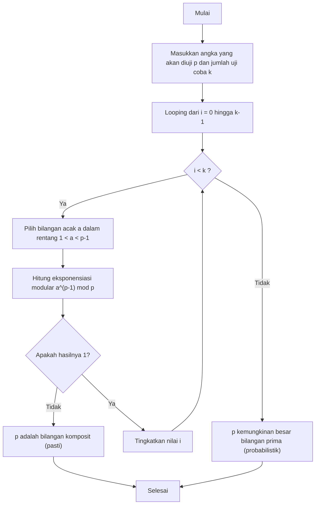
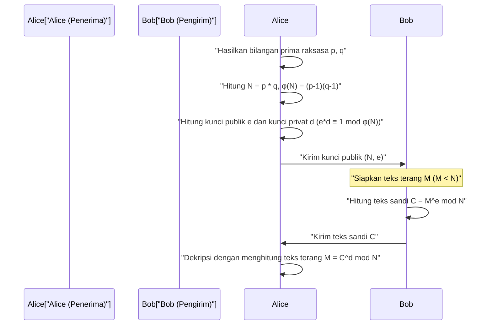

## 1. Pendahuluan: Misteri Matematika yang Mendukung Kriptografi Modern

Dalam masyarakat digital modern, khususnya dalam komunikasi melalui internet, "kriptografi" (enkripsi) telah menjadi teknologi dasar yang sangat penting. Kemampuan kita untuk menjelajahi situs web dengan aman melalui HTTPS di peramban, melakukan transaksi keuangan melalui perbankan daring, dan bertukar pesan pribadi di aplikasi perpesanan, semuanya dimungkinkan karena adanya protokol kriptografi yang didukung oleh teori matematika tingkat tinggi yang bekerja di latar belakang. Di antaranya, "kriptografi kunci publik" memainkan peran yang sangat penting, dan perwakilan utamanya adalah **Kriptografi RSA**.

Keamanan dan keabsahan banyak algoritma kriptografi, termasuk kriptografi RSA, sangat bergantung pada teorema yang sangat indah dan kuat yang ditemukan oleh ahli matematika Prancis abad ke-17, Pierre de Fermat. Itulah **Teorema Kecil Fermat (Fermat's Little Theorem)**. Selanjutnya, Teorema Euler dari Leonhard Euler, yang merupakan generalisasi dari teorema ini, juga memainkan peran penting dalam teori kriptografi.

Artikel ini akan membahas secara mendalam dari dasar bagaimana penemuan matematika murni berupa Teorema Kecil Fermat diterapkan pada teknologi kriptografi praktis modern, khususnya dalam "pengujian primalitas" (primality test) dan "kriptografi RSA". Ini adalah panduan teknis yang sangat rinci yang mencakup pembuktian matematika, mekanisme enkripsi dan dekripsi, serta implementasi algoritma spesifik menggunakan C++ dan Python.

---

## 2. Dasar-dasar Kongruensi dan Aritmetika Modular

Untuk memahami Teorema Kecil Fermat, pertama-tama kita perlu membiasakan diri dengan konsep matematika yang disebut "aritmetika modular" (kekongruenan). Aritmetika modular adalah sistem perhitungan yang berfokus pada "sisa" ketika dibagi dengan bilangan tertentu yang tetap (disebut modulus). Karena perhitungannya mirip dengan tampilan jam (yang berputar kembali setiap 12 jam), ini sering juga disebut "matematika jam".

Ketika bilangan bulat $a$ dan $b$ memiliki sisa yang sama saat dibagi dengan bilangan bulat positif $n$, secara matematis ditulis sebagai berikut:

$$
a \equiv b \pmod n
$$

Ini dibaca "$a$ dan $b$ kongruen dalam modulo $n$". Misalnya, sisa dari 17 dibagi 5 adalah 2, dan sisa dari 12 dibagi 5 juga 2. Oleh karena itu, kita dapat menulisnya sebagai berikut:

$$
17 \equiv 12 \pmod 5 \equiv 2 \pmod 5
$$

Dalam aritmetika modular, empat operasi aritmetika dasar (penjumlahan, pengurangan, perkalian) berlaku seperti biasa.

1. **Penjumlahan**: Jika $a \equiv b \pmod n$ dan $c \equiv d \pmod n$, maka $a + c \equiv b + d \pmod n$
2. **Pengurangan**: Jika $a \equiv b \pmod n$ dan $c \equiv d \pmod n$, maka $a - c \equiv b - d \pmod n$
3. **Perkalian**: Jika $a \equiv b \pmod n$ dan $c \equiv d \pmod n$, maka $a \times c \equiv b \times d \pmod n$
4. **Perpangkatan**: Jika $a \equiv b \pmod n$, maka untuk sembarang bilangan asli $k$, $a^k \equiv b^k \pmod n$

Namun, perlu berhati-hati mengenai **pembagian**. Secara umum, meskipun $a \times c \equiv b \times c \pmod n$, kita tidak bisa begitu saja membagi kedua ruas dengan $c$ untuk mendapatkan $a \equiv b \pmod n$. Hal ini hanya berlaku jika $c$ dan $n$ saling prima (faktor persekutuan terbesarnya adalah 1). Konsep "invers modular" ini akan menjadi sangat penting dalam pembuatan kunci untuk kriptografi RSA yang akan dibahas nanti.

---

## 3. Latar Belakang Matematika dan Pembuktian Teorema Kecil Fermat

Setelah memahami dasar-dasar aritmetika modular, mari kita lihat Teorema Kecil Fermat yang menjadi topik utama.

### 3.1 Definisi Teorema

Teorema Kecil Fermat dirumuskan sebagai berikut:

> **Teorema Kecil Fermat (Fermat's Little Theorem)**
> Misalkan $p$ adalah bilangan prima dan $a$ adalah sembarang bilangan bulat yang bukan kelipatan $p$ (yaitu $a$ dan $p$ saling prima). Maka, persamaan kongruensi berikut berlaku:
> $$ a^{p-1} \equiv 1 \pmod p $$

Secara umum, ini juga sering direpresentasikan dengan menghilangkan syarat "$a$ bukan kelipatan $p$" sehingga berlaku untuk semua bilangan bulat $a$. Dalam hal ini, kedua ruas dikalikan dengan $a$ menjadi:

$$
a^p \equiv a \pmod p
$$

### 3.2 Konfirmasi dengan Contoh Spesifik

Mari kita periksa apakah teorema ini benar-benar berlaku menggunakan angka-angka spesifik.
Misalkan bilangan prima $p = 5$. Maka $p-1 = 4$. Kita pilih sembarang bilangan bulat $a$ yang bukan kelipatan $p$.

- Untuk $a = 2$: $2^{5-1} = 2^4 = 16$. $16 \div 5 = 3$ sisa $1$. Jadi $16 \equiv 1 \pmod 5$. (Berlaku)
- Untuk $a = 3$: $3^{5-1} = 3^4 = 81$. $81 \div 5 = 16$ sisa $1$. Jadi $81 \equiv 1 \pmod 5$. (Berlaku)
- Untuk $a = 4$: $4^{5-1} = 4^4 = 256$. $256 \div 5 = 51$ sisa $1$. Jadi $256 \equiv 1 \pmod 5$. (Berlaku)

Dengan cara ini, tidak peduli berapa nilai $a$ yang dipilih (asalkan bukan kelipatan 5), jika dipangkatkan 4 lalu dibagi 5, sisanya pasti 1. Terlihat seperti sulap, tetapi ini berasal dari sifat indah yang dimiliki bilangan prima.

### 3.3 Pembuktian Matematika dari Teorema

Mengapa hal ini bisa terjadi? Di sini kita akan memperkenalkan pembuktian elegan menggunakan himpunan kelas residu.

Pertimbangkan himpunan $S = \{1, 2, 3, \dots, p-1\}$. Ini adalah elemen perwakilan dari bilangan bulat yang memiliki sisa $1$ hingga $p-1$ jika dibagi dengan $p$.
Sekarang, pertimbangkan himpunan baru $T$ di mana setiap elemen dikalikan dengan bilangan bulat $a$ yang saling prima dengan $p$.
$$ T = \{1a, 2a, 3a, \dots, (p-1)a\} $$

Mari kita pertimbangkan sisa dari setiap elemen di himpunan $T$ ketika dibagi dengan $p$. Hebatnya, meskipun urutannya mungkin berubah, himpunan sisa-sisa ini persis sama dengan himpunan elemen asli $S$.
Mengapa:
1. Tidak ada elemen di $T$ yang menjadi kelipatan $p$ (karena baik $a$ maupun elemen aslinya bukan kelipatan $p$).
2. Tidak ada dua elemen berbeda di $T$ yang kongruen modulo $p$. Jika $ia \equiv ja \pmod p$ ($i \neq j$), karena $a$ dan $p$ saling prima, kita dapat membagi kedua ruas dengan $a$, sehingga didapat $i \equiv j \pmod p$ yang mana ini adalah kontradiksi.

Oleh karena itu, hasil kali semua elemen di $S$ dan hasil kali semua elemen di $T$ akan kongruen dalam modulo $p$.

$$
(1a) \times (2a) \times \dots \times ((p-1)a) \equiv 1 \times 2 \times \dots \times (p-1) \pmod p
$$

Jika kita menyederhanakan ruas kiri, karena terdapat $a$ sebanyak $p-1$ buah,

$$
a^{p-1} \cdot (p-1)! \equiv (p-1)! \pmod p
$$

Karena $(p-1)!$ saling prima dengan $p$, kita dapat membagi kedua ruas dengan $(p-1)!$, dan pada akhirnya menghasilkan teorema berikut.

$$
a^{p-1} \equiv 1 \pmod p
$$

Inilah pembuktian Teorema Kecil Fermat.

---

## 4. Fungsi Totient Euler dan Teorema Euler

Teorema Kecil Fermat adalah teorema tentang "bilangan prima $p$", namun Leonhard Euler menggeneralisasinya menjadi berlaku untuk "sembarang bilangan bulat positif $n$". Generalisasi ini sangat penting untuk memahami kriptografi RSA.

### 4.1 Fungsi Totient Euler $\phi(n)$

Fungsi Totient Euler (atau fungsi $\phi$ Euler) $\phi(n)$ adalah fungsi yang menyatakan "jumlah bilangan bulat dari $1$ hingga $n$ yang saling prima dengan $n$".

- Untuk bilangan prima $p$, karena semua bilangan dari $1$ hingga $p-1$ saling prima dengan $p$, maka $\phi(p) = p - 1$.
- Untuk dua bilangan prima berbeda $p, q$, pada hasil kalinya $n = p \times q$, $\phi(n)$ dapat dicari dengan rumus yang sangat sederhana.
  $$ \phi(p \times q) = \phi(p) \times \phi(q) = (p - 1)(q - 1) $$

Sifat ini menjadi logika inti dalam pembuatan kunci kriptografi RSA.

### 4.2 Teorema Euler

Euler menggeneralisasi Teorema Kecil Fermat sebagai berikut:

> **Teorema Euler (Euler's Theorem)**
> Untuk bilangan bulat positif $n$ dan bilangan bulat $a$ yang saling prima dengannya, berlaku persamaan berikut:
> $$ a^{\phi(n)} \equiv 1 \pmod n $$

Jika $n$ adalah bilangan prima $p$, karena $\phi(p) = p - 1$, ini menjadi tepat sama dengan Teorema Kecil Fermat ($a^{p-1} \equiv 1 \pmod p$). Dengan kata lain, Teorema Kecil Fermat hanyalah kasus khusus dari Teorema Euler.

---

## 5. Menemukan Bilangan Prima Raksasa: Uji Primalitas Fermat

Dalam teknologi kriptografi (seperti RSA dan pertukaran kunci Diffie-Hellman), kita perlu menemukan "bilangan prima raksasa" yang panjangnya bisa mencapai ratusan digit dengan sangat cepat. Namun, untuk menentukan apakah sebuah angka besar $N$ adalah bilangan prima, menggunakan metode "uji pembagian" yang mencoba membagi angka tersebut dengan semua bilangan dari $2$ hingga $\sqrt{N}$ akan memakan waktu selama umur alam semesta.

Oleh karena itu, muncul "metode uji primalitas probabilistik" yang memanfaatkan Teorema Kecil Fermat, yaitu **Uji Fermat (Fermat Primality Test)**.

### 5.1 Apa itu Uji Primalitas Probabilistik?

Menurut Teorema Kecil Fermat, jika $p$ adalah bilangan prima, maka untuk sembarang $a$ ($1 < a < p$), $a^{p-1} \equiv 1 \pmod p$ pasti berlaku.
Berdasarkan kontraposisinya, kita dapat menyatakan bahwa "jika untuk suatu $a$ berlaku $a^{p-1} \not\equiv 1 \pmod p$, maka $p$ **pasti bukan bilangan prima (merupakan bilangan komposit)**".

Dengan demikian, jika kita ingin menguji apakah $N$ adalah bilangan prima, kita memilih beberapa $a$ secara acak, menghitung $a^{N-1} \pmod N$, dan memeriksa apakah hasilnya $1$. Jika setidaknya satu kali menghasilkan selain $1$, maka dipastikan $N$ adalah bilangan komposit. Jika hasilnya selalu $1$ tak peduli berapa kali kita mencoba, kita dapat menyimpulkan dengan probabilitas tinggi bahwa $N$ "kemungkinan besar adalah bilangan prima".

### 5.2 Penjelasan Algoritma dan Diagram Alur

Algoritma Uji Fermat adalah sebagai berikut:



### 5.3 Perangkap Bilangan Carmichael (Bilangan Prima Semu)

Meskipun Uji Fermat sangat cepat, ada kelemahan fatal. Terdapat bilangan komposit bagaikan iblis yang tetap memenuhi $a^{N-1} \equiv 1 \pmod N$ untuk semua nilai $a$. Angka ini disebut **Bilangan Carmichael (Carmichael numbers)**. Bilangan Carmichael terkecil adalah $561$ ($3 \times 11 \times 17$).

Karena adanya bilangan Carmichael, kita tidak bisa melakukan uji primalitas yang mutlak hanya dengan Uji Fermat murni. Oleh karena itu, dalam sistem kriptografi nyata (seperti OpenSSL), standar yang digunakan adalah modifikasi dari Uji Fermat, yaitu **Uji Primalitas Miller-Rabin**. Uji Miller-Rabin mampu mendeteksi bilangan Carmichael sehingga dapat menekan probabilitas kesalahan identifikasi hingga mendekati nol secara praktis.

### 5.4 Eksponensiasi Modular Cepat (Metode Penguadratan Berulang)

Dalam algoritma uji primalitas, kita perlu menghitung $a^{N-1} \pmod N$. Jika $N$ sangat besar, jumlah digit $a^{N-1}$ akan menjadi angka astronomis yang tidak muat dalam memori komputer.
Solusi untuk masalah ini adalah **Metode Penguadratan Berulang (Exponentiation by Squaring)** atau operasi eksponensiasi modular. Dengan mengambil sisa (mod N) pada setiap langkah perhitungan, nilainya selalu dijaga lebih kecil dari $N$, sehingga perhitungan dapat diselesaikan dengan sangat cepat (kompleksitas waktu $O(\log N)$).

---

## 6. Implementasi Uji Primalitas dan Eksponensiasi Modular

Sekarang mari kita coba mengimplementasikan Uji Primalitas Fermat dan metode penguadratan berulang dalam C++ dan Python.

### 6.1 Implementasi dengan C++

Di C++, tipe integer standar mudah mengalami overflow, sehingga pustaka integer presisi ganda (seperti GMP) diperlukan untuk menangani angka besar. Namun di sini, untuk memahami algoritmanya, kita akan menunjukkannya dalam batas integer 64-bit (`unsigned long long`).

```cpp
#include <iostream>
#include <random>

using namespace std;

// Eksponensiasi modular cepat (a^b mod m) - Metode penguadratan berulang
unsigned long long power_mod(unsigned long long a, unsigned long long b, unsigned long long m) {
    unsigned long long result = 1;
    a = a % m;
    while (b > 0) {
        // Jika bit terendah dari b adalah 1, kalikan hasilnya dengan a
        if (b % 2 == 1) {
            result = (__int128)result * a % m; // Ekspansi ke 128-bit untuk mencegah overflow
        }
        // Kuadratkan a
        a = (__int128)a * a % m;
        // Geser b ke kanan (bagi dua)
        b /= 2;
    }
    return result;
}

// Uji Primalitas Fermat
bool fermat_is_prime(unsigned long long p, int iterations = 5) {
    if (p <= 1) return false;
    if (p <= 3) return true;
    if (p % 2 == 0) return false;

    random_device rd;
    mt19937_64 gen(rd());
    uniform_int_distribution<unsigned long long> dis(2, p - 2);

    for (int i = 0; i < iterations; ++i) {
        unsigned long long a = dis(gen);
        // Jika a^(p-1) mod p bukan 1, maka itu bilangan komposit
        if (power_mod(a, p - 1, p) != 1) {
            return false;
        }
    }
    return true; // Kemungkinan besar prima
}

int main() {
    unsigned long long num = 1000000007; // Bilangan prima yang diketahui
    if (fermat_is_prime(num, 10)) {
        cout << num << " is probably prime." << endl;
    } else {
        cout << num << " is composite." << endl;
    }
    return 0;
}
```

### 6.2 Implementasi dengan Python

Tipe integer standar pada Python mendukung presisi ganda, jadi kita tidak perlu khawatir akan terjadinya overflow. Selain itu, fungsi bawaan Python `pow(a, b, m)` secara internal menggunakan metode penguadratan berulang sehingga sangat cepat.

```python
import random

def fermat_is_prime(p, iterations=5):
    """
    Uji primalitas probabilistik menggunakan Uji Primalitas Fermat
    """
    if p <= 1:
        return False
    if p <= 3:
        return True
    if p % 2 == 0:
        return False

    for _ in range(iterations):
        # Pilih angka acak a antara 2 hingga p-2
        a = random.randint(2, p - 2)
        # Hitung a^(p-1) mod p. Fungsi bawaan pow sangat cepat.
        if pow(a, p - 1, p) != 1:
            return False # Pasti komposit

    return True # Kemungkinan besar prima

# Uji Coba
number_to_test = 104729
if fermat_is_prime(number_to_test, 10):
    print(f"{number_to_test} kemungkinan besar adalah bilangan prima.")
else:
    print(f"{number_to_test} adalah bilangan komposit.")
```

---

## 7. Penerapan pada Kriptografi RSA: Tempat Fermat dan Euler Membuahkan Hasil

Penerapan paling hebat dari Teorema Kecil Fermat (dan Teorema Euler) adalah **Kriptografi RSA**, yang dikembangkan pada tahun 1977 oleh Rivest, Shamir, dan Adleman.
Kriptografi RSA adalah sistem "kriptografi kunci publik" yang revolusioner, di mana kunci untuk mengenkripsi (kunci publik) dipublikasikan ke seluruh dunia, sementara kunci untuk mendekripsi (kunci privat) hanya diketahui oleh penerima.

Asimetri ini didasarkan pada keamanan komputasional bahwa "memfaktorkan bilangan komposit raksasa menjadi faktor primanya adalah hal yang sangat sulit".

### 7.1 Mekanisme Kriptografi RSA (Pembuatan Kunci, Enkripsi, Dekripsi)

Mari kita periksa keseluruhan alur komunikasi pada kriptografi RSA menggunakan diagram sekuens Mermaid.



Berikut adalah penjelasan langkah-langkah detail secara matematis.

#### Langkah 1: Pembuatan Kunci (Tugas Alice sebagai Penerima)

1. Hasilkan secara acak dua bilangan prima raksasa $p$ dan $q$ (di sini metode uji primalitas sebelumnya digunakan).
2. Hitung hasil kalinya, $N = p \times q$. Nilai $N$ ini akan dipublikasikan.
3. Gunakan Fungsi Totient Euler untuk menghitung $\phi(N) = (p-1)(q-1)$.
4. Pilih bilangan bulat $e$ (eksponen publik) yang saling prima dengan $\phi(N)$ (sering kali $e = 65537$ digunakan).
5. Hitung invers modular $d$ (eksponen privat) dari $e$. Dengan kata lain, temukan $d$ yang memenuhi:
   $$ e \cdot d \equiv 1 \pmod{\phi(N)} $$
   Perhitungan ini menggunakan **Algoritma Euclidean Diperluas** (Extended Euclidean algorithm).

Sekarang, **Kunci Publiknya adalah $(N, e)$**, dan **Kunci Privatnya adalah $(N, d)$**. ($p, q, \phi(N)$ harus segera dimusnahkan atau disembunyikan dengan ketat).

#### Langkah 2: Enkripsi (Tugas Bob sebagai Pengirim)

Misalkan Bob ingin mengirim pesan $M$ ke Alice ($M$ adalah angka hasil konversi karakter, dan $0 \le M < N$).
Bob menggunakan kunci publik Alice $(N, e)$ untuk membuat teks sandi $C$ dengan perhitungan berikut.

$$
C \equiv M^e \pmod N
$$

Bob kemudian mengirimkan $C$ ini kepada Alice melalui jaringan.

#### Langkah 3: Dekripsi (Tugas Alice sebagai Penerima)

Setelah menerima teks sandi $C$, Alice yang merupakan satu-satunya orang yang mengetahui kunci privat $d$, melakukan perhitungan berikut.

$$
M' \equiv C^d \pmod N
$$

Menariknya, hasil perhitungan $M'$ ini persis sama dengan pesan asli $M$.

### 7.2 Mengapa Dapat Didekripsi? (Pembuktian Matematika)

Di sinilah nilai sebenarnya dari Teorema Kecil Fermat (Teorema Euler) terlihat. Mengapa $C^d \pmod N$ bisa kembali menjadi $M$?

Mari kita jabarkan rumus dekripsinya.
Karena $C \equiv M^e \pmod N$, maka:
$$ C^d \equiv (M^e)^d \equiv M^{ed} \pmod N $$

Pada langkah pembuatan kunci, kita memilih $d$ sedemikian rupa sehingga $e \cdot d \equiv 1 \pmod{\phi(N)}$. Ini berarti bahwa ada suatu bilangan bulat $k$ sehingga dapat ditulis sebagai berikut:
$$ e \cdot d = 1 + k \cdot \phi(N) $$

Substitusikan ini ke dalam persamaan sebelumnya.
$$ M^{ed} = M^{1 + k \cdot \phi(N)} = M \cdot M^{k \cdot \phi(N)} = M \cdot (M^{\phi(N)})^k \pmod N $$

Di sini **Teorema Euler** ($M^{\phi(N)} \equiv 1 \pmod N$) berperan. (*Secara ketat, $M$ dan $N$ harus saling prima, tetapi dalam RSA, probabilitas $M$ dan $N$ tidak saling prima sangatlah kecil secara astronomis, dan menggunakan Teorema Sisa Tiongkok (Chinese Remainder Theorem) dapat dibuktikan bahwa ini tetap berlaku meskipun tidak saling prima*).

Dengan menerapkan Teorema Euler, karena $M^{\phi(N)} \equiv 1$, maka:
$$ M \cdot (1)^k \equiv M \pmod N $$

Luar biasa, $M$ berhasil dipulihkan! Sifat angka yang ditemukan oleh Fermat dan Euler berabad-abad lalu mampu memberikan jaminan kerahasiaan komunikasi digital modern secara sempurna.

---

## 8. Implementasi Mainan Kriptografi RSA (Python)

Karena hanya belajar teori rasanya belum lengkap, mari kita coba mengimplementasikan proses pembuatan kunci, enkripsi, dan dekripsi RSA secara langsung menggunakan Python. Ini hanyalah "implementasi mainan (toy)" untuk tujuan edukasi, tetapi matematika yang digunakan sama persis dengan aslinya.

Kita juga akan menyertakan implementasi "Algoritma Euclidean Diperluas" untuk mencari invers modular $d$.

```python
import random

# Mencari Faktor Persekutuan Terbesar (FPB)
def gcd(a, b):
    while b != 0:
        a, b = b, a % b
    return a

# Algoritma Euclidean Diperluas (Mencari x, y untuk ax + by = gcd(a,b))
# Digunakan untuk mencari d pada e*d ≡ 1 (mod φ(N))
def extended_gcd(a, b):
    if a == 0:
        return (b, 0, 1)
    else:
        g, y, x = extended_gcd(b % a, a)
        return (g, x - (b // a) * y, y)

def mod_inverse(e, phi):
    g, x, y = extended_gcd(e, phi)
    if g != 1:
        raise Exception('Invers modular tidak ada')
    else:
        return x % phi

# Fungsi pembuat bilangan prima (Versi sederhana: membuat bilangan prima kecil)
def generate_prime(bits):
    while True:
        p = random.getrandbits(bits)
        # Pemeriksaan sederhana sebagai pengganti Uji Fermat sebelumnya
        if p > 1 and pow(2, p-1, p) == 1 and pow(3, p-1, p) == 1:
            return p

# Pembuatan Kunci RSA
def generate_keypair(bits=16):
    p = generate_prime(bits)
    q = generate_prime(bits)
    # Pastikan p dan q tidak sama
    while p == q:
        q = generate_prime(bits)

    n = p * q
    phi = (p - 1) * (q - 1)

    # e umumnya menggunakan bilangan prima seperti 65537, tetapi di sini dipilih secara acak
    e = random.randrange(1, phi)
    g = gcd(e, phi)
    while g != 1:
        e = random.randrange(1, phi)
        g = gcd(e, phi)

    # Perhitungan kunci privat d
    d = mod_inverse(e, phi)
    
    # Kunci Publik (e, n), Kunci Privat (d, n)
    return ((e, n), (d, n))

def encrypt(pk, plaintext):
    e, n = pk
    # Hitung plaintext^e mod n
    cipher = [pow(ord(char), e, n) for char in plaintext]
    return cipher

def decrypt(sk, ciphertext):
    d, n = sk
    # Hitung cipher^d mod n, lalu ubah kembali menjadi karakter
    plain = [chr(pow(char, d, n)) for char in ciphertext]
    return ''.join(plain)

# Contoh Eksekusi
if __name__ == '__main__':
    print("--- Implementasi Mainan Kriptografi RSA ---")
    public_key, private_key = generate_keypair(bits=12) # Menggunakan bilangan prima 12-bit
    
    print(f"Kunci Publik (e, n): {public_key}")
    print(f"Kunci Privat (d, n): {private_key}")

    message = "Hello Math!"
    print(f"\nPesan asli: {message}")

    # Enkripsi
    encrypted_msg = encrypt(public_key, message)
    print(f"Teks Sandi: {encrypted_msg}")

    # Dekripsi
    decrypted_msg = decrypt(private_key, encrypted_msg)
    print(f"Pesan yang Didekripsi: {decrypted_msg}")
```

Jika Anda menjalankan kode ini, Anda dapat melihat array karakter diubah menjadi array angka asing (teks sandi), yang kemudian berhasil dikembalikan menjadi string aslinya menggunakan kunci privat.

---

## 9. Penutup: Titik Temu Keindahan dan Kepraktisan Matematika

Pada abad ke-17 ketika Pierre de Fermat menemukan "Teorema Kecil" ini, tidak ada yang berpikir bahwa ini akan berguna untuk sesuatu. Fermat sendiri melakukan penelitian pada teori bilangan murni karena rasa ingin tahunya terhadap matematika.

Namun, sekitar 300 tahun kemudian, pada era awal jaringan komputer di tahun 1970-an, Teorema Fermat dibangkitkan kembali secara dramatis sebagai teknologi kriptografi yang mutlak diperlukan untuk membangun protokol komunikasi yang aman. Teknologi uji primalitas yang didasarkan pada Teorema Kecil Fermat dan kriptografi RSA yang didasarkan pada Teorema Euler, benar-benar menjadi pilar yang menopang infrastruktur internet modern.

Pesan LINE yang kita kirimkan tanpa berpikir setiap harinya, atau belanja yang kita lakukan di Amazon, semuanya menari di atas persamaan matematika yang indah dan sederhana: $a^{p-1} \equiv 1 \pmod p$. Teorema Kecil Fermat mengajarkan kita bahwa betapa pun abstraknya sebuah konsep matematika, suatu saat nanti ia pasti akan berguna bagi umat manusia.

Dalam mempelajari pemrograman dan teori kriptografi, memahami struktur matematika yang menjadi dasarnya akan menjadi senjata yang ampuh untuk memahami secara mendalam cara kerja perpustakaan (library) perangkat lunak yang disajikan sebagai kotak hitam, dan untuk merancang sistem yang lebih aman.
