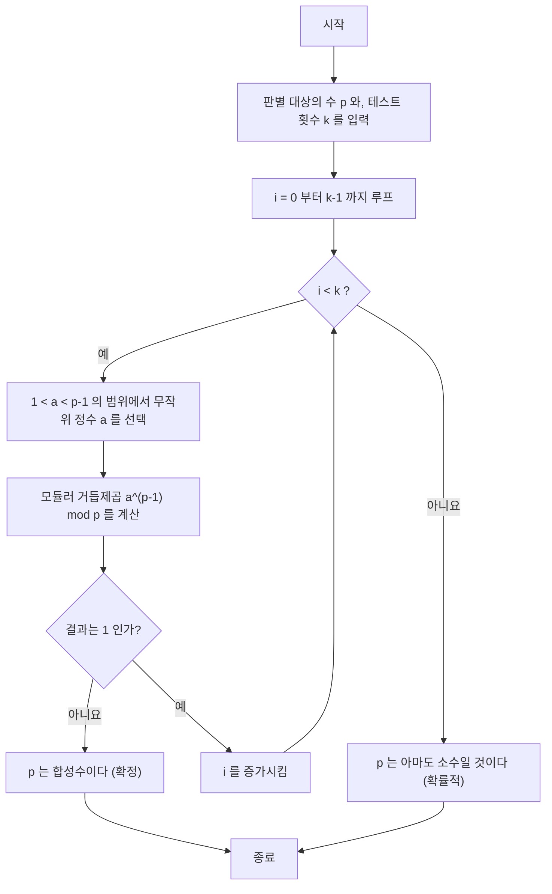
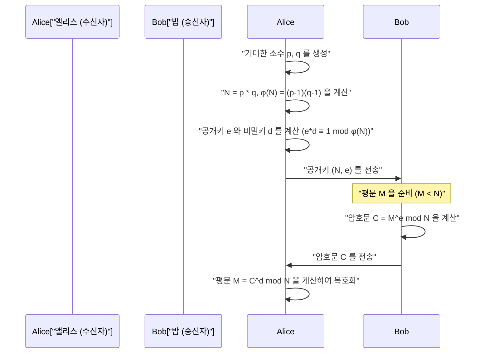

## 1. 시작하며: 현대 암호를 지탱하는 수학의 신비

현대 디지털 사회, 특히 인터넷을 통한 통신에서 '암호화'는 필수 불가결한 기반 기술이 되었습니다. 우리가 웹 브라우저에서 HTTPS를 통해 안전하게 웹사이트를 탐색하고, 온라인 뱅킹으로 금융 거래를 하며, 메시징 앱으로 사적인 대화를 나눌 수 있는 것은 고도의 수학적 이론이 뒷받침된 암호 프로토콜이 배후에서 작동하고 있기 때문입니다. 그중에서도 특히 중요한 역할을 담당하고 있는 것이 '공개키 암호 방식'이며, 그 대표적인 예가 **RSA 암호**입니다.

RSA 암호를 비롯한 많은 암호 알고리즘의 안전성과 정당성은 17세기 프랑스의 수학자 피에르 드 페르마(Pierre de Fermat)가 발견한 매우 아름답고 강력한 정리에 크게 의존하고 있습니다. 그것이 바로 **페르마의 소정리(Fermat's Little Theorem)**입니다. 더 나아가 이를 일반화한 레온하르트 오일러(Leonhard Euler)의 정리 역시 암호 이론에서 결정적인 역할을 하고 있습니다.

본 기사에서는 페르마의 소정리라는 순수 수학의 발견이 어떻게 현대의 실용적인 암호 기술, 특히 '소수 판별'과 'RSA 암호'에 응용되고 있는지를 기초부터 철저하게 해설합니다. 수학적인 증명, 암호화 및 복호화의 메커니즘, 그리고 C++와 Python을 활용한 구체적인 알고리즘 구현까지 모두 다루는 매우 상세한 기술 가이드가 될 것입니다.

---

## 2. 합동식과 모듈러 연산의 기초

페르마의 소정리를 이해하기 위해서는 먼저 '모듈러 연산(합동식)'이라는 수학 개념에 친숙해질 필요가 있습니다. 모듈러 연산이란 어떤 정해진 수(법, 모듈러스라고 부름)로 나눈 '나머지'에 주목한 계산 체계를 말합니다. 시계의 문자판(12시간에 1바퀴를 돎)과 같은 계산이기 때문에 '시계 산술'이라고도 불립니다.

정수 $a$와 $b$를 양의 정수 $n$으로 나눈 나머지가 같을 때, 수학적으로는 다음과 같이 기술합니다.

$$
a \equiv b \pmod n
$$

이것은 '$n$을 법으로 하여 $a$와 $b$는 합동이다'라고 읽습니다. 예를 들어, 17을 5로 나눈 나머지는 2이고, 12를 5로 나눈 나머지 역시 2입니다. 따라서 다음과 같이 쓸 수 있습니다.

$$
17 \equiv 12 \pmod 5 \equiv 2 \pmod 5
$$

모듈러 연산에서는 일반적인 사칙연산(덧셈, 뺄셈, 곱셈)이 그대로 성립합니다.

1. **덧셈**: $a \equiv b \pmod n$ 이고 $c \equiv d \pmod n$ 이면, $a + c \equiv b + d \pmod n$
2. **뺄셈**: $a \equiv b \pmod n$ 이고 $c \equiv d \pmod n$ 이면, $a - c \equiv b - d \pmod n$
3. **곱셈**: $a \equiv b \pmod n$ 이고 $c \equiv d \pmod n$ 이면, $a \times c \equiv b \times d \pmod n$
4. **거듭제곱**: $a \equiv b \pmod n$ 이면, 임의의 자연수 $k$에 대해 $a^k \equiv b^k \pmod n$

단, **나눗셈**에 대해서는 주의가 필요합니다. 일반적으로 $a \times c \equiv b \times c \pmod n$ 이라고 해서 양변을 $c$로 나누어 $a \equiv b \pmod n$ 으로 만들 수는 없습니다. 이것이 성립하는 것은 $c$와 $n$이 서로소(최대공약수가 1)인 경우에 한합니다. 이 '모듈러 역원'의 개념은 후술할 RSA 암호의 키 생성에서 극히 중요해집니다.

---

## 3. 페르마의 소정리의 수학적 배경과 증명

모듈러 연산의 기초를 다졌으니, 본 주제인 페르마의 소정리에 대해 살펴보겠습니다.

### 3.1 정리의 정의

페르마의 소정리는 다음과 같이 정식화됩니다.

> **페르마의 소정리 (Fermat's Little Theorem)**
> $p$를 소수라 하고, $a$를 $p$의 배수가 아닌(즉 $a$와 $p$는 서로소인) 임의의 정수라고 하자. 이때 다음의 합동식이 성립한다.
> $$ a^{p-1} \equiv 1 \pmod p $$

또한, 조건 '$a$가 $p$의 배수가 아닐 것'을 제외하고, 모든 정수 $a$에 대해 성립하는 형태로 표현하는 것도 일반적입니다. 그 경우는 양변에 $a$를 곱하여 다음과 같이 됩니다.

$$
a^p \equiv a \pmod p
$$

### 3.2 구체적인 예를 통한 확인

정리가 정말로 성립하는지 구체적인 숫자를 사용하여 확인해 봅시다.
소수 $p = 5$라고 합시다. $p-1 = 4$입니다. $a$로서 $p$의 배수가 아닌 정수를 선택합니다.

- $a = 2$인 경우: $2^{5-1} = 2^4 = 16$. $16 \div 5 = 3$ 나머지 $1$. 따라서 $16 \equiv 1 \pmod 5$. (성립)
- $a = 3$인 경우: $3^{5-1} = 3^4 = 81$. $81 \div 5 = 16$ 나머지 $1$. 따라서 $81 \equiv 1 \pmod 5$. (성립)
- $a = 4$인 경우: $4^{5-1} = 4^4 = 256$. $256 \div 5 = 51$ 나머지 $1$. 따라서 $256 \equiv 1 \pmod 5$. (성립)

이처럼 어떤 $a$를 선택하든(5의 배수만 아니라면) 4제곱하여 5로 나눈 나머지는 항상 1이 됩니다. 마법처럼 보이지만, 이는 소수가 가지는 아름다운 성질에서 유래한 것입니다.

### 3.3 정리의 수학적 증명

어째서 이런 일이 성립하는 것일까요. 여기서는 잉여류의 집합을 이용한 우아한 증명을 소개합니다.

집합 $S = \{1, 2, 3, \dots, p-1\}$을 생각합니다. 이들은 $p$로 나눈 나머지가 $1$부터 $p-1$이 되는 정수들의 대표원입니다.
여기서 각 원소에 $p$와 서로소인 정수 $a$를 곱한 새로운 집합 $T$를 생각합니다.
$$ T = \{1a, 2a, 3a, \dots, (p-1)a\} $$

이 집합 $T$의 각 원소를 $p$로 나눈 나머지를 생각해 봅니다. 놀랍게도 이 나머지들은 순서는 바뀔지 몰라도 원래 집합 $S$의 원소들의 집합과 완전히 일치합니다.
왜냐하면:
1. $T$의 원소가 $p$의 배수가 되는 일은 없습니다($a$도 원래의 원소도 $p$의 배수가 아니기 때문).
2. $T$ 안에서 $p$를 법으로 하여 합동이 되는 서로 다른 두 원소는 존재하지 않습니다. 만약 $ia \equiv ja \pmod p$ ($i \neq j$)라고 한다면, $a$와 $p$는 서로소이므로 $a$로 나눌 수 있고, $i \equiv j \pmod p$가 되어 모순되기 때문입니다.

따라서 $S$의 원소를 모두 곱한 것과 $T$의 원소를 모두 곱한 것은 $p$를 법으로 하여 합동이 됩니다.

$$
(1a) \times (2a) \times \dots \times ((p-1)a) \equiv 1 \times 2 \times \dots \times (p-1) \pmod p
$$

좌변을 정리하면 $a$가 $p-1$개 있으므로,

$$
a^{p-1} \cdot (p-1)! \equiv (p-1)! \pmod p
$$

$(p-1)!$은 $p$와 서로소이므로 양변을 $(p-1)!$로 나눌 수 있으며, 최종적으로 다음의 정리가 도출됩니다.

$$
a^{p-1} \equiv 1 \pmod p
$$

이것이 페르마의 소정리의 증명입니다.

---

## 4. 오일러의 피 함수와 오일러의 정리

페르마의 소정리는 '소수 $p$'에 관한 정리지만, 이를 '임의의 양의 정수 $n$'으로 일반화한 사람이 레온하르트 오일러입니다. RSA 암호를 이해하려면 이 확장이 필수적입니다.

### 4.1 오일러의 피(토션트) 함수 $\phi(n)$

오일러의 피 함수(또는 오일러의 $\phi$ 함수) $\phi(n)$은 '$1$부터 $n$까지의 정수 중 $n$과 서로소인 것의 개수'를 나타내는 함수입니다.

- 소수 $p$의 경우, $1$부터 $p-1$까지의 모든 정수가 $p$와 서로소이므로 $\phi(p) = p - 1$이 됩니다.
- 서로 다른 두 소수 $p, q$에 대해, 그 곱인 $n = p \times q$의 경우 $\phi(n)$은 매우 간단한 식으로 구해집니다.
  $$ \phi(p \times q) = \phi(p) \times \phi(q) = (p - 1)(q - 1) $$

이 성질이 RSA 암호의 키 생성에 있어 근간이 되는 로직이 됩니다.

### 4.2 오일러의 정리

오일러는 페르마의 소정리를 다음과 같이 일반화했습니다.

> **오일러의 정리 (Euler's Theorem)**
> 양의 정수 $n$과, 그 수와 서로소인 정수 $a$에 대하여 다음이 성립한다.
> $$ a^{\phi(n)} \equiv 1 \pmod n $$

만약 $n$이 소수 $p$라면 $\phi(p) = p - 1$이므로, 이것은 페르마의 소정리 자체($a^{p-1} \equiv 1 \pmod p$)가 됩니다. 즉, 페르마의 소정리는 오일러의 정리의 특수한 경우에 불과합니다.

---

## 5. 거대한 소수 찾기: 페르마의 소수 판별법

암호 기술(RSA 암호나 Diffie-Hellman 키 교환 등)에서는 수백 자리에 달하는 '거대한 소수'를 고속으로 찾아낼 필요가 있습니다. 하지만 거대한 수 $N$이 소수인지 판별하기 위해 $2$부터 $\sqrt{N}$까지의 모든 수로 나누어 떨어지는지 시험하는 '시도 나눗셈법'으로는 우주의 수명만큼의 시간이 걸려 버립니다.

그래서 등장하는 것이 페르마의 소정리를 역으로 이용한 '확률적 소수 판별법'인 **페르마 테스트(Fermat Primality Test)**입니다.

### 5.1 확률적 소수 판별법이란

페르마의 소정리에 의하면, $p$가 소수라면 임의의 $a$ ($1 < a < p$)에 대해 $a^{p-1} \equiv 1 \pmod p$ 가 반드시 성립합니다.
이의 대우를 취하면, '어떤 $a$에 대해 $a^{p-1} \not\equiv 1 \pmod p$ 가 될 경우, $p$는 **절대로 소수가 아니다(합성수이다)**'라는 것을 말할 수 있습니다.

따라서 $N$이 소수인지 판별하고 싶은 경우, 무작위로 몇 개의 $a$를 선택하여 $a^{N-1} \pmod N$을 계산해서 $1$이 되는지를 확인합니다. 만약 한 번이라도 $1$이 아닌 답이 나오면 $N$은 합성수임이 확정됩니다. 몇 번을 시험해도 $1$이 되는 경우 $N$은 '아마도 소수일 것이다'라고 높은 확률로 판단할 수 있습니다.

### 5.2 알고리즘의 해설과 플로우차트

페르마 테스트의 알고리즘은 다음과 같습니다.



### 5.3 카마이클 수(위소수)의 함정

페르마 테스트는 매우 빠르지만 중대한 단점이 있습니다. 그것은 합성수임에도 불구하고 모든 $a$에 대해 $a^{N-1} \equiv 1 \pmod N$을 만족시켜 버리는 악마와 같은 수가 존재한다는 것입니다. 이를 **카마이클 수(Carmichael numbers)**라고 부릅니다. 가장 작은 카마이클 수는 $561$ ($3 \times 11 \times 17$)입니다.

카마이클 수가 존재하기 때문에 순수한 페르마 테스트만으로는 절대적인 소수 판별을 할 수 없습니다. 그러므로 실제 암호화 시스템(OpenSSL 등)에서는 페르마 테스트를 개량한 **밀러-라빈(Miller-Rabin) 소수 판별법**이 표준적으로 사용되고 있습니다. 밀러-라빈 판별법은 카마이클 수를 꿰뚫어 볼 수 있어 오판 확률을 실질적으로 제로에 가깝게 만들 수 있습니다.

### 5.4 고속 거듭제곱 나머지 연산(분할 정복 거듭제곱)

소수 판별 알고리즘 내에서 $a^{N-1} \pmod N$을 계산해야 하지만, $N$이 거대한 경우 $a^{N-1}$은 천문학적인 자릿수가 되어 컴퓨터 메모리에 다 들어가지 않습니다.
이를 해결하는 것이 **분할 정복 거듭제곱(Exponentiation by Squaring)** 또는 모듈러 거듭제곱 연산입니다. 계산의 각 단계마다 나머지(mod N)를 취함으로써 항상 값을 $N$보다 작게 유지하며 매우 고속($O(\log N)$의 시간 복잡도)으로 계산 가능하게 됩니다.

---

## 6. 소수 판별과 거듭제곱 나머지 구현

그러면 페르마의 소수 판별법과 분할 정복 거듭제곱을 C++와 Python으로 구현해 보겠습니다.

### 6.1 C++를 이용한 구현

C++에서는 표준 정수형이 오버플로우되기 쉽기 때문에 거대한 수를 다루려면 다정밀도 정수 라이브러리(GMP 등)가 필요하지만, 여기서는 알고리즘을 이해하기 위해 64비트 정수(`unsigned long long`) 범위 내에서의 구현을 보여줍니다.

```cpp
#include <iostream>
#include <random>

using namespace std;

// 고속 거듭제곱 나머지 연산 (a^b mod m) - 분할 정복 거듭제곱
unsigned long long power_mod(unsigned long long a, unsigned long long b, unsigned long long m) {
    unsigned long long result = 1;
    a = a % m;
    while (b > 0) {
        // b의 최하위 비트가 1인 경우, 결과에 a를 곱함
        if (b % 2 == 1) {
            result = (__int128)result * a % m; // 오버플로우 방지를 위해 128비트 확장
        }
        // a를 제곱함
        a = (__int128)a * a % m;
        // b를 오른쪽 시프트 (절반으로 만듦)
        b /= 2;
    }
    return result;
}

// 페르마의 소수 판별법
bool fermat_is_prime(unsigned long long p, int iterations = 5) {
    if (p <= 1) return false;
    if (p <= 3) return true;
    if (p % 2 == 0) return false;

    random_device rd;
    mt19937_64 gen(rd());
    uniform_int_distribution<unsigned long long> dis(2, p - 2);

    for (int i = 0; i < iterations; ++i) {
        unsigned long long a = dis(gen);
        // a^(p-1) mod p 가 1 이 아니면 합성수
        if (power_mod(a, p - 1, p) != 1) {
            return false;
        }
    }
    return true; // 아마도 소수
}

int main() {
    unsigned long long num = 1000000007; // 이미 알려진 소수
    if (fermat_is_prime(num, 10)) {
        cout << num << " is probably prime." << endl;
    } else {
        cout << num << " is composite." << endl;
    }
    return 0;
}
```

### 6.2 Python을 이용한 구현

Python의 표준 정수형은 다정밀도 정수를 지원하므로 자릿수 넘침을 걱정할 필요가 없습니다. 게다가 Python의 내장 함수 `pow(a, b, m)`는 내부적으로 분할 정복 거듭제곱을 사용하기 때문에 매우 빠릅니다.

```python
import random

def fermat_is_prime(p, iterations=5):
    """
    페르마의 소수 판별법을 이용한 확률적 소수 판별
    """
    if p <= 1:
        return False
    if p <= 3:
        return True
    if p % 2 == 0:
        return False

    for _ in range(iterations):
        # 2 에서 p-2 사이의 무작위 수 a 를 고름
        a = random.randint(2, p - 2)
        # a^(p-1) mod p 를 계산. 내장 pow 는 고속.
        if pow(a, p - 1, p) != 1:
            return False # 합성수 확정

    return True # 아마도 소수

# 테스트
number_to_test = 104729
if fermat_is_prime(number_to_test, 10):
    print(f"{number_to_test} 는 아마도 소수입니다.")
else:
    print(f"{number_to_test} 는 합성수입니다.")
```

---

## 7. RSA 암호에의 응용: 페르마와 오일러가 결실을 맺는 곳

페르마의 소정리(및 오일러의 정리)의 가장 위대한 응용처가 1977년에 Rivest, Shamir, Adleman 세 사람에 의해 개발된 **RSA 암호**입니다.
RSA 암호는 '공개키 암호'라는 획기적인 시스템으로, 암호화하기 위한 키(공개키)는 전 세계에 공개해 두면서, 복호화하기 위한 키(비밀키)는 수신자 본인만이 알고 있는 구조를 구현하고 있습니다.

이 비대칭성은 '거대한 합성수의 소인수분해는 지극히 어렵다'라는 계산 복잡도 기반 안전성에 근거하고 있습니다.

### 7.1 RSA 암호의 구조 (키 생성, 암호화, 복호화)

RSA 암호의 전체적인 통신 흐름을 Mermaid 시퀀스 다이어그램으로 확인해 봅시다.



아래에 수학적인 세부 단계를 해설합니다.

#### 단계 1: 키 생성 (수신자 앨리스의 작업)

1. 두 개의 거대한 소수 $p$와 $q$를 무작위로 생성합니다(여기서 앞서 말한 소수 판별법이 사용됩니다).
2. 그 곱인 $N = p \times q$를 계산합니다. 이 $N$은 공개됩니다.
3. 오일러의 피 함수를 사용하여 $\phi(N) = (p-1)(q-1)$을 계산합니다.
4. $\phi(N)$과 서로소인 정수 $e$(공개 지수)를 선택합니다(종종 $e = 65537$이 사용됩니다).
5. $e$의 모듈러 역원 $d$(비밀 지수)를 계산합니다. 즉, 다음을 만족하는 $d$를 찾습니다.
   $$ e \cdot d \equiv 1 \pmod{\phi(N)} $$
   이 계산에는 **확장 유클리드 호제법**이 사용됩니다.

이것으로 **공개키는 $(N, e)$**, **비밀키는 $(N, d)$**가 됩니다. ($p, q, \phi(N)$은 즉시 파기하거나 엄중히 숨깁니다).

#### 단계 2: 암호화 (송신자 밥의 작업)

밥은 앨리스에게 메시지 $M$을 보내고 싶다고 합시다($M$은 문자를 수치화한 것으로 $0 \le M < N$입니다).
밥은 앨리스의 공개키 $(N, e)$를 사용하여 다음 계산을 수행해 암호문 $C$를 만듭니다.

$$
C \equiv M^e \pmod N
$$

이 $C$를 네트워크를 통해 앨리스에게 송신합니다.

#### 단계 3: 복호화 (수신자 앨리스의 작업)

암호문 $C$를 받은 앨리스는 자신만이 알고 있는 비밀키 $d$를 사용하여 다음 계산을 수행합니다.

$$
M' \equiv C^d \pmod N
$$

놀랍게도 이 계산 결과 $M'$은 원래의 메시지 $M$과 완전히 일치합니다.

### 7.2 왜 복호화가 가능한가? (수학적 증명)

여기서 페르마의 소정리(오일러의 정리)가 진가를 발휘합니다. 어째서 $C^d \pmod N$이 $M$으로 되돌아가는 것일까요?

복호화 식을 전개해 봅니다.
$C \equiv M^e \pmod N$ 이므로,
$$ C^d \equiv (M^e)^d \equiv M^{ed} \pmod N $$

키 생성 단계에서 $e \cdot d \equiv 1 \pmod{\phi(N)}$ 이 되도록 $d$를 선택했습니다. 이것은 어떤 정수 $k$가 존재하여 다음과 같이 쓸 수 있음을 의미합니다.
$$ e \cdot d = 1 + k \cdot \phi(N) $$

이것을 위의 식에 대입합니다.
$$ M^{ed} = M^{1 + k \cdot \phi(N)} = M \cdot M^{k \cdot \phi(N)} = M \cdot (M^{\phi(N)})^k \pmod N $$

여기서 **오일러의 정리** ($M^{\phi(N)} \equiv 1 \pmod N$)가 등장합니다. (※엄밀히는 $M$과 $N$이 서로소여야 하지만, RSA에서는 $M$과 $N$이 서로소가 아닐 확률이 천문학적으로 낮으며 중국인의 나머지 정리를 사용하면 서로소가 아니어도 성립함이 증명 가능합니다).

오일러의 정리를 적용하면 $M^{\phi(N)} \equiv 1$ 이므로,
$$ M \cdot (1)^k \equiv M \pmod N $$

보기 좋게 $M$이 복원되었습니다! 페르마와 오일러가 수백 년 전에 발견한 수의 성질이 현대 디지털 통신의 기밀성을 완벽하게 보장하고 있는 것입니다.

---

## 8. RSA 암호의 토이 구현 (Python)

이론만으로는 실감이 나지 않기 때문에 Python을 사용하여 실제로 RSA 암호의 키 생성, 암호화, 복호화의 과정을 구현해 보겠습니다. 이것은 교육용 '토이(장난감) 구현'이지만 사용된 수학은 진짜와 완전히 같습니다.

모듈러 역원 $d$를 구하기 위한 '확장 유클리드 호제법'도 구현에 포함시킵니다.

```python
import random

# 최대공약수를 구함
def gcd(a, b):
    while b != 0:
        a, b = b, a % b
    return a

# 확장 유클리드 호제법 (ax + by = gcd(a,b) 의 x, y 를 구함)
# e*d ≡ 1 (mod φ(N)) 의 d 를 찾기 위해 사용
def extended_gcd(a, b):
    if a == 0:
        return (b, 0, 1)
    else:
        g, y, x = extended_gcd(b % a, a)
        return (g, x - (b // a) * y, y)

def mod_inverse(e, phi):
    g, x, y = extended_gcd(e, phi)
    if g != 1:
        raise Exception('역원이 존재하지 않습니다')
    else:
        return x % phi

# 소수 생성 함수 (간이판: 작은 소수를 생성)
def generate_prime(bits):
    while True:
        p = random.getrandbits(bits)
        # 앞서 말한 페르마 테스트 대신 간이로 판별
        if p > 1 and pow(2, p-1, p) == 1 and pow(3, p-1, p) == 1:
            return p

# RSA 키 생성
def generate_keypair(bits=16):
    p = generate_prime(bits)
    q = generate_prime(bits)
    # p 와 q 가 같아지지 않도록 함
    while p == q:
        q = generate_prime(bits)

    n = p * q
    phi = (p - 1) * (q - 1)

    # e 는 65537 등의 소수가 자주 사용되지만, 여기서는 무작위로 고름
    e = random.randrange(1, phi)
    g = gcd(e, phi)
    while g != 1:
        e = random.randrange(1, phi)
        g = gcd(e, phi)

    # 비밀키 d 계산
    d = mod_inverse(e, phi)
    
    # 공개키 (e, n), 비밀키 (d, n)
    return ((e, n), (d, n))

def encrypt(pk, plaintext):
    e, n = pk
    # plaintext^e mod n 을 계산
    cipher = [pow(ord(char), e, n) for char in plaintext]
    return cipher

def decrypt(sk, ciphertext):
    d, n = sk
    # cipher^d mod n 을 계산하고 문자로 되돌림
    plain = [chr(pow(char, d, n)) for char in ciphertext]
    return ''.join(plain)

# 실행 예시
if __name__ == '__main__':
    print("--- RSA 암호 토이 구현 ---")
    public_key, private_key = generate_keypair(bits=12) # 12비트의 소수 사용
    
    print(f"공개키 (e, n): {public_key}")
    print(f"비밀키 (d, n): {private_key}")

    message = "Hello Math!"
    print(f"\n원래의 메시지: {message}")

    # 암호화
    encrypted_msg = encrypt(public_key, message)
    print(f"암호문: {encrypted_msg}")

    # 복호화
    decrypted_msg = decrypt(private_key, encrypted_msg)
    print(f"복호화된 메시지: {decrypted_msg}")
```

이 코드를 실행하면 문자 배열이 낯선 숫자 배열(암호문)로 변환되고, 그것이 비밀키에 의해 훌륭하게 원래 문자열로 복원되는 모습을 확인할 수 있습니다.

---

## 9. 마치며: 수학의 아름다움과 실용성의 교차점

피에르 드 페르마가 이 '소정리'를 발견한 17세기 당시, 이것이 어딘가에 쓸모가 있을 것이라고 생각한 사람은 아무도 없었습니다. 페르마 자신도 순수한 수학적 탐구심에서 정수론 연구를 하고 있었습니다.

하지만 약 300년 후인 1970년대, 컴퓨터 네트워크의 여명기에 안전한 통신 프로토콜을 확립하기 위해 없어서는 안 될 암호 기술로서 페르마의 정리는 극적인 부활을 이뤘습니다. 페르마의 소정리에 기반한 소수 판별 기술과 오일러의 정리에 기반한 RSA 암호는 현대의 인터넷 인프라를 말 그대로 지탱하고 있습니다.

우리가 매일 무심코 보내는 메신저의 메시지도, 쇼핑몰에서의 물건 구매도, 모든 것은 이 $a^{p-1} \equiv 1 \pmod p$ 라는 심플하고 아름다운 수식 위에서 춤추고 있는 것입니다. 수학이 아무리 추상적이라 할지라도 언젠가는 반드시 인류에게 도움이 될 때가 온다는 것을 페르마의 소정리는 가르쳐 주고 있습니다.

프로그래밍이나 암호 이론을 배울 때 그 기초에 있는 수학적 구조를 이해하는 것은 블랙박스로 제공되는 라이브러리의 동작을 깊이 이해하고, 더 안전한 시스템을 설계하기 위한 큰 무기가 될 것입니다.
