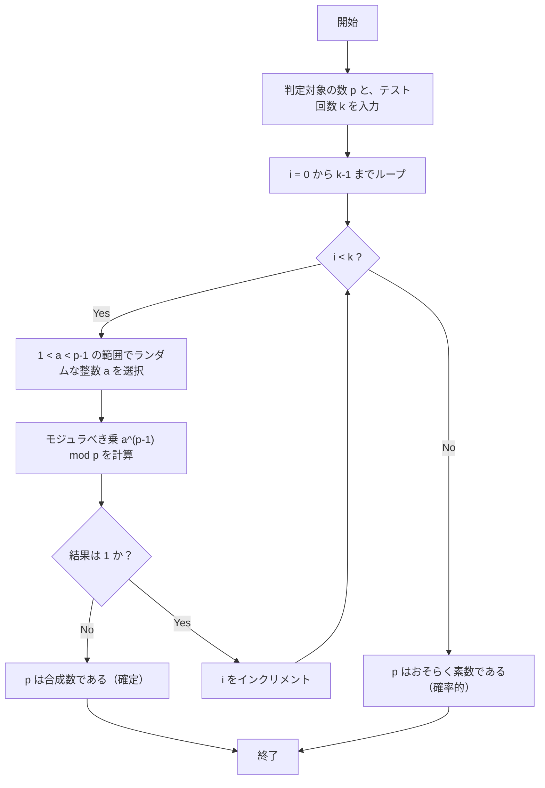
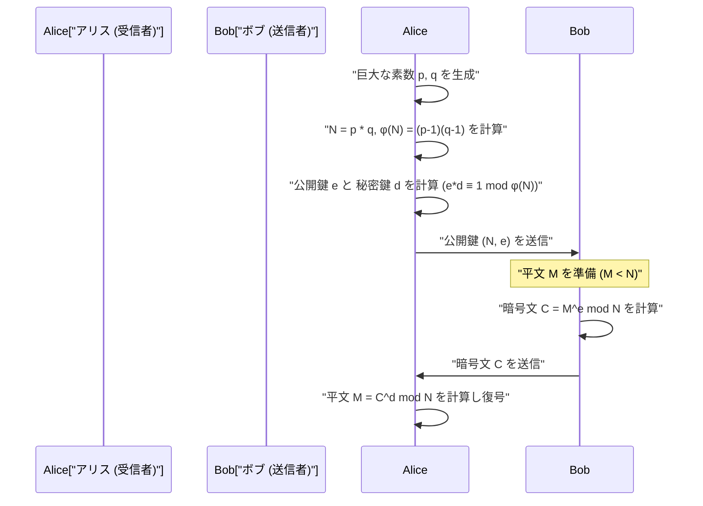

## 1. はじめに：現代暗号を支える数学の神秘

現代のデジタル社会、とりわけインターネットを介した通信において、「暗号化」は不可欠な基盤技術となっています。私たちがウェブブラウザでHTTPS経由で安全にウェブサイトを閲覧し、オンラインバンキングで金融取引を行い、メッセージングアプリでプライベートなやり取りができるのは、高度な数学的理論に裏打ちされた暗号プロトコルが背後で機能しているからです。その中でも特に重要な役割を担っているのが「公開鍵暗号方式」であり、その代表格が **RSA暗号** です。

RSA暗号をはじめとする多くの暗号アルゴリズムの安全性や正当性は、17世紀のフランスの数学者ピエール・ド・フェルマー（Pierre de Fermat）が発見した非常に美しく、かつ強力な定理に大きく依存しています。それが **フェルマーの小定理（Fermat's Little Theorem）** です。さらに、これを一般化したレオンハルト・オイラー（Leonhard Euler）の定理も、暗号理論において決定的な役割を果たしています。

本記事では、フェルマーの小定理という純粋数学の発見が、いかにして現代の実用的な暗号技術、特に「素数判定」や「RSA暗号」へと応用されているのかを、基礎から徹底的に解説します。数学的な証明、暗号化・復号のメカニズム、そして C++ と Python を用いた具体的なアルゴリズムの実装までを網羅する、非常に詳細な技術ガイドとなります。

---

## 2. 合同式とモジュラ演算の基礎

フェルマーの小定理を理解するためには、まず「モジュラ演算（合同式）」という数学の概念に慣れ親しむ必要があります。モジュラ演算とは、ある決まった数（法、モジュラスと呼ばれる）で割った「余り」に着目した計算体系のことです。時計の文字盤（12時間で1周する）のような計算であるため、「時計の数学」とも呼ばれます。

整数 $a$ と $b$ を正の整数 $n$ で割った余りが等しいとき、数学的には以下のように記述します。

$$
a \equiv b \pmod n
$$

これは「$n$ を法として $a$ と $b$ は合同である」と読みます。例えば、17 を 5 で割った余りは 2 であり、12 を 5 で割った余りも 2 です。したがって、次のように書くことができます。

$$
17 \equiv 12 \pmod 5 \equiv 2 \pmod 5
$$

モジュラ演算においては、通常の四則演算（足し算、引き算、掛け算）がそのまま成り立ちます。

1. **加法**: $a \equiv b \pmod n$ かつ $c \equiv d \pmod n$ ならば、$a + c \equiv b + d \pmod n$
2. **減法**: $a \equiv b \pmod n$ かつ $c \equiv d \pmod n$ ならば、$a - c \equiv b - d \pmod n$
3. **乗法**: $a \equiv b \pmod n$ かつ $c \equiv d \pmod n$ ならば、$a \times c \equiv b \times d \pmod n$
4. **べき乗**: $a \equiv b \pmod n$ ならば、任意の自然数 $k$ について $a^k \equiv b^k \pmod n$

ただし、**除法（割り算）** については注意が必要です。一般に、$a \times c \equiv b \times c \pmod n$ だからといって、両辺を $c$ で割って $a \equiv b \pmod n$ とすることはできません。これが成り立つのは、$c$ と $n$ が互いに素（最大公約数が 1）である場合に限られます。この「モジュラ逆元」の概念は、後述するRSA暗号の鍵生成において極めて重要になります。

---

## 3. フェルマーの小定理の数学的背景と証明

モジュラ演算の基礎を押さえたところで、本題であるフェルマーの小定理について見ていきましょう。

### 3.1 定理の定義

フェルマーの小定理は次のように定式化されます。

> **フェルマーの小定理 (Fermat's Little Theorem)**
> $p$ を素数とし、$a$ を $p$ の倍数ではない（すなわち $a$ と $p$ は互いに素である）任意の整数とする。このとき、次の合同式が成り立つ。
> $$ a^{p-1} \equiv 1 \pmod p $$

また、条件「$a$ が $p$ の倍数でない」を外し、すべての整数 $a$ に対して成り立つ形として表現することも一般的です。その場合は両辺に $a$ を掛けて次のようになります。

$$
a^p \equiv a \pmod p
$$

### 3.2 具体例による確認

定理が本当に成り立つのか、具体的な数字を使って確認してみましょう。
素数 $p = 5$ とします。$p-1 = 4$ です。$a$ として $p$ の倍数ではない整数を選びます。

- $a = 2$ の場合: $2^{5-1} = 2^4 = 16$。$16 \div 5 = 3$ 余り $1$。よって $16 \equiv 1 \pmod 5$。（成立）
- $a = 3$ の場合: $3^{5-1} = 3^4 = 81$。$81 \div 5 = 16$ 余り $1$。よって $81 \equiv 1 \pmod 5$。（成立）
- $a = 4$ の場合: $4^{5-1} = 4^4 = 256$。$256 \div 5 = 51$ 余り $1$。よって $256 \equiv 1 \pmod 5$。（成立）

このように、どんな $a$ を選んでも（5の倍数でなければ）、4乗して5で割った余りは必ず1になります。魔法のように見えますが、これは素数が持つ美しい性質に由来しています。

### 3.3 定理の数学的証明

なぜこのようなことが成り立つのでしょうか。ここでは剰余類の集合を用いたエレガントな証明を紹介します。

集合 $S = \{1, 2, 3, \dots, p-1\}$ を考えます。これらは $p$ で割った余りが $1$ から $p-1$ になる整数の代表元です。
ここで、各要素に $p$ と互いに素な整数 $a$ を掛けた新しい集合 $T$ を考えます。
$$ T = \{1a, 2a, 3a, \dots, (p-1)a\} $$

この集合 $T$ の各要素を $p$ で割った余りを考えます。驚くべきことに、これらの余りは、順番こそ入れ替わるかもしれませんが、元の集合 $S$ の要素の集合と完全に一致します。
なぜなら：
1. $T$ の要素が $p$ の倍数になることはありません（$a$ も元の要素も $p$ の倍数ではないため）。
2. $T$ の中で $p$ を法として合同になる2つの異なる要素は存在しません。もし $ia \equiv ja \pmod p$ （$i \neq j$）だとすると、$a$ と $p$ は互いに素なので $a$ で割ることができ、$i \equiv j \pmod p$ となって矛盾するからです。

したがって、$S$ の要素をすべて掛け合わせたものと、$T$ の要素をすべて掛け合わせたものは、$p$ を法として合同になります。

$$
(1a) \times (2a) \times \dots \times ((p-1)a) \equiv 1 \times 2 \times \dots \times (p-1) \pmod p
$$

左辺を整理すると $a$ が $p-1$ 個あるので、

$$
a^{p-1} \cdot (p-1)! \equiv (p-1)! \pmod p
$$

$(p-1)!$ は $p$ と互いに素なので、両辺を $(p-1)!$ で割ることができ、最終的に次の定理が導かれます。

$$
a^{p-1} \equiv 1 \pmod p
$$

これがフェルマーの小定理の証明です。

---

## 4. オイラーのトーティエント関数とオイラーの定理

フェルマーの小定理は「素数 $p$」に関する定理ですが、これを「任意の正の整数 $n$」に一般化したのが、レオンハルト・オイラーです。RSA暗号を理解するには、この拡張が不可欠です。

### 4.1 オイラーのトーティエント関数 $\phi(n)$

オイラーのトーティエント関数（あるいはオイラーの $\phi$ 関数） $\phi(n)$ は、「$1$ から $n$ までの整数のうち、$n$ と互いに素であるものの個数」を表す関数です。

- 素数 $p$ の場合、$1$ から $p-1$ までのすべての整数が $p$ と互いに素なので、$\phi(p) = p - 1$ となります。
- 2つの異なる素数 $p, q$ について、その積 $n = p \times q$ の場合、$\phi(n)$ は非常に簡単な式で求まります。
  $$ \phi(p \times q) = \phi(p) \times \phi(q) = (p - 1)(q - 1) $$

この性質が、RSA暗号の鍵生成における根幹のロジックとなります。

### 4.2 オイラーの定理

オイラーは、フェルマーの小定理を次のように一般化しました。

> **オイラーの定理 (Euler's Theorem)**
> 正の整数 $n$ と、それと互いに素な整数 $a$ に対して、次が成り立つ。
> $$ a^{\phi(n)} \equiv 1 \pmod n $$

もし $n$ が素数 $p$ であれば $\phi(p) = p - 1$ なので、これはフェルマーの小定理そのもの（$a^{p-1} \equiv 1 \pmod p$）になります。つまり、フェルマーの小定理はオイラーの定理の特殊なケースに過ぎません。

---

## 5. 巨大な素数を見つける：フェルマーの素数判定法

暗号技術（RSA暗号やDiffie-Hellman鍵交換など）においては、数百桁にも及ぶ「巨大な素数」を高速に見つけ出す必要があります。しかし、巨大な数 $N$ が素数かどうかを判定するために、$2$ から $\sqrt{N}$ までのすべての数で割り切れるか試す「試し割り法」では、宇宙の寿命ほどの時間がかかってしまいます。

そこで登場するのが、フェルマーの小定理を逆手に取った「確率的素数判定法」である **フェルマーテスト（Fermat Primality Test）** です。

### 5.1 確率的素数判定法とは

フェルマーの小定理によれば、$p$ が素数ならば、任意の $a$ ($1 < a < p$) に対して $a^{p-1} \equiv 1 \pmod p$ が必ず成立します。
この対偶をとると、「ある $a$ について $a^{p-1} \not\equiv 1 \pmod p$ となった場合、$p$ は**絶対に素数ではない（合成数である）**」ということが言えます。

したがって、$N$ が素数かどうかを判定したい場合、ランダムにいくつか $a$ を選び、$a^{N-1} \pmod N$ を計算して $1$ になるかを確認します。もし1回でも $1$ 以外の答えが出れば、$N$ は合成数であると確定します。何度試しても $1$ になる場合、$N$ は「おそらく素数である」と高い確率で判断できます。

### 5.2 アルゴリズムの解説とフローチャート

フェルマーテストのアルゴリズムは以下の通りです。



### 5.3 カーマイケル数（偽素数）の落とし穴

フェルマーテストは非常に高速ですが、重大な欠点があります。それは、合成数であるにもかかわらず、すべての $a$ に対して $a^{N-1} \equiv 1 \pmod N$ を満たしてしまう悪魔のような数が存在することです。これを **カーマイケル数 (Carmichael numbers)** と呼びます。最も小さいカーマイケル数は $561$ ($3 \times 11 \times 17$) です。

カーマイケル数が存在するため、純粋なフェルマーテストだけでは絶対的な素数判定はできません。そのため、実際の暗号化システム（OpenSSLなど）では、フェルマーテストを改良した **ミラー・ラビン（Miller-Rabin）素数判定法** が標準的に使用されています。ミラー・ラビン判定法はカーマイケル数を見破ることができるため、誤判定の確率を実質的にゼロにすることができます。

### 5.4 高速なべき乗剰余演算（繰り返し二乗法）

素数判定アルゴリズムの中で $a^{N-1} \pmod N$ を計算する必要がありますが、$N$ が巨大な場合、$a^{N-1}$ は天文学的な桁数になり、コンピュータのメモリに入りきりません。
これを解決するのが **繰り返し二乗法（Exponentiation by Squaring）** またはモジュラべき乗演算です。計算の各ステップで剰余（mod N）を取ることで、常に値が $N$ より小さく保たれ、非常に高速（$O(\log N)$の計算量）で計算可能になります。

---

## 6. 素数判定とべき乗剰余の実装

それでは、フェルマーの素数判定法と繰り返し二乗法を、C++とPythonで実装してみましょう。

### 6.1 C++ による実装

C++では標準の整数型がオーバーフローしやすいため、巨大な数を扱うには多倍長整数ライブラリ（GMPなど）が必要ですが、ここではアルゴリズムを理解するために64bit整数（`unsigned long long`）の範囲内での実装を示します。

```cpp
#include <iostream>
#include <random>

using namespace std;

// 高速なべき乗剰余演算 (a^b mod m) - 繰り返し二乗法
unsigned long long power_mod(unsigned long long a, unsigned long long b, unsigned long long m) {
    unsigned long long result = 1;
    a = a % m;
    while (b > 0) {
        // bの最下位ビットが1の場合、結果にaを掛ける
        if (b % 2 == 1) {
            result = (__int128)result * a % m; // オーバーフロー防止のため128bit拡張
        }
        // aを二乗する
        a = (__int128)a * a % m;
        // bを右シフト（半分にする）
        b /= 2;
    }
    return result;
}

// フェルマーの素数判定法
bool fermat_is_prime(unsigned long long p, int iterations = 5) {
    if (p <= 1) return false;
    if (p <= 3) return true;
    if (p % 2 == 0) return false;

    random_device rd;
    mt19937_64 gen(rd());
    uniform_int_distribution<unsigned long long> dis(2, p - 2);

    for (int i = 0; i < iterations; ++i) {
        unsigned long long a = dis(gen);
        // a^(p-1) mod p が 1 でなければ合成数
        if (power_mod(a, p - 1, p) != 1) {
            return false;
        }
    }
    return true; // おそらく素数
}

int main() {
    unsigned long long num = 1000000007; // 既知の素数
    if (fermat_is_prime(num, 10)) {
        cout << num << " is probably prime." << endl;
    } else {
        cout << num << " is composite." << endl;
    }
    return 0;
}
```

### 6.2 Python による実装

Pythonの標準の整数型は多倍長整数をサポートしており、桁溢れを気にする必要がありません。さらにPythonの組み込み関数 `pow(a, b, m)` は内部的に繰り返し二乗法を使用しているため非常に高速です。

```python
import random

def fermat_is_prime(p, iterations=5):
    """
    フェルマーの素数判定法を用いた確率的素数判定
    """
    if p <= 1:
        return False
    if p <= 3:
        return True
    if p % 2 == 0:
        return False

    for _ in range(iterations):
        # 2 から p-2 の間でランダムな数 a を選ぶ
        a = random.randint(2, p - 2)
        # a^(p-1) mod p を計算。組み込みの pow は高速。
        if pow(a, p - 1, p) != 1:
            return False # 合成数確定

    return True # おそらく素数

# テスト
number_to_test = 104729
if fermat_is_prime(number_to_test, 10):
    print(f"{number_to_test} はおそらく素数です。")
else:
    print(f"{number_to_test} は合成数です。")
```

---

## 7. RSA暗号への応用：フェルマーとオイラーが結実する場所

フェルマーの小定理（およびオイラーの定理）の最も偉大な応用先が、1977年にRivest, Shamir, Adlemanの3人によって開発された **RSA暗号** です。
RSA暗号は「公開鍵暗号」という画期的なシステムであり、暗号化するための鍵（公開鍵）は全世界に公開しておきながら、復号するための鍵（秘密鍵）は受信者本人だけが知っているという仕組みを実現しています。

この非対称性は、「巨大な合成数の素因数分解は極めて困難である」という計算量的安全性に基づいています。

### 7.1 RSA暗号の仕組み（鍵生成、暗号化、復号）

RSA暗号の全体的な通信フローをMermaidのシーケンス図で確認しましょう。



以下に、数学的な詳細ステップを解説します。

#### ステップ1：鍵の生成（受信者アリスの作業）

1. 2つの巨大な素数 $p$ と $q$ をランダムに生成します（ここで前述の素数判定法が使われます）。
2. その積 $N = p \times q$ を計算します。この $N$ は公開されます。
3. オイラーのトーティエント関数を用いて、$\phi(N) = (p-1)(q-1)$ を計算します。
4. $\phi(N)$ と互いに素な整数 $e$ （公開指数）を選びます（よく $e = 65537$ が使われます）。
5. $e$ のモジュラ逆元 $d$ （秘密指数）を計算します。すなわち、次を満たす $d$ を見つけます。
   $$ e \cdot d \equiv 1 \pmod{\phi(N)} $$
   この計算には **拡張ユークリッドの互除法** が用いられます。

これで、**公開鍵は $(N, e)$**、**秘密鍵は $(N, d)$** となります。（$p, q, \phi(N)$ は直ちに破棄するか厳重に隠匿します）。

#### ステップ2：暗号化（送信者ボブの作業）

ボブはアリスにメッセージ $M$ を送りたいとします（$M$ は文字を数値化したもので、$0 \le M < N$ です）。
ボブはアリスの公開鍵 $(N, e)$ を使い、次の計算を行って暗号文 $C$ を作ります。

$$
C \equiv M^e \pmod N
$$

この $C$ をネットワーク経由でアリスに送信します。

#### ステップ3：復号（受信者アリスの作業）

暗号文 $C$ を受け取ったアリスは、自分だけが知っている秘密鍵 $d$ を使って次の計算を行います。

$$
M' \equiv C^d \pmod N
$$

驚くべきことに、この計算結果 $M'$ は元のメッセージ $M$ と完全に一致します。

### 7.2 なぜ復号できるのか？（数学的証明）

ここで、フェルマーの小定理（オイラーの定理）が真価を発揮します。なぜ $C^d \pmod N$ が $M$ に戻るのでしょうか？

復号の式を展開してみます。
$C \equiv M^e \pmod N$ ですから、
$$ C^d \equiv (M^e)^d \equiv M^{ed} \pmod N $$

鍵生成のステップにおいて、$e \cdot d \equiv 1 \pmod{\phi(N)}$ となるように $d$ を選びました。これは、ある整数 $k$ が存在して、次のように書けることを意味します。
$$ e \cdot d = 1 + k \cdot \phi(N) $$

これを上の式に代入します。
$$ M^{ed} = M^{1 + k \cdot \phi(N)} = M \cdot M^{k \cdot \phi(N)} = M \cdot (M^{\phi(N)})^k \pmod N $$

ここで **オイラーの定理** ($M^{\phi(N)} \equiv 1 \pmod N$) が登場します。（※厳密には $M$ と $N$ が互いに素である必要がありますが、RSAにおいては $M$ と $N$ が互いに素でない確率は天文学的に低く、かつ中国剰余定理を用いることで互いに素でなくても成立することが証明できます）。

オイラーの定理を適用すると、$M^{\phi(N)} \equiv 1$ なので、
$$ M \cdot (1)^k \equiv M \pmod N $$

見事に $M$ が復元されました！ フェルマーとオイラーが何百年も前に発見した数の性質が、現代のデジタル通信の機密性を完璧に保証しているのです。

---

## 8. RSA暗号のトイ実装 (Python)

理論だけでは実感が湧きにくいため、Pythonを使って実際にRSA暗号の鍵生成・暗号化・復号のプロセスを実装してみましょう。これは教育用の「トイ（おもちゃ）実装」ですが、使われている数学は本物と全く同じです。

モジュラ逆元 $d$ を求めるための「拡張ユークリッドの互除法」も実装に含めます。

```python
import random

# 最大公約数を求める
def gcd(a, b):
    while b != 0:
        a, b = b, a % b
    return a

# 拡張ユークリッドの互除法 (ax + by = gcd(a,b) の x, y を求める)
# e*d ≡ 1 (mod φ(N)) の d を見つけるために使用
def extended_gcd(a, b):
    if a == 0:
        return (b, 0, 1)
    else:
        g, y, x = extended_gcd(b % a, a)
        return (g, x - (b // a) * y, y)

def mod_inverse(e, phi):
    g, x, y = extended_gcd(e, phi)
    if g != 1:
        raise Exception('逆元が存在しません')
    else:
        return x % phi

# 素数生成関数（簡易版：小さな素数を生成）
def generate_prime(bits):
    while True:
        p = random.getrandbits(bits)
        # 前述のフェルマーテストの代わりに簡易的に判定
        if p > 1 and pow(2, p-1, p) == 1 and pow(3, p-1, p) == 1:
            return p

# RSA 鍵生成
def generate_keypair(bits=16):
    p = generate_prime(bits)
    q = generate_prime(bits)
    # p と q が同じにならないようにする
    while p == q:
        q = generate_prime(bits)

    n = p * q
    phi = (p - 1) * (q - 1)

    # e は 65537 などの素数がよく使われるが、ここではランダムに選ぶ
    e = random.randrange(1, phi)
    g = gcd(e, phi)
    while g != 1:
        e = random.randrange(1, phi)
        g = gcd(e, phi)

    # 秘密鍵 d の計算
    d = mod_inverse(e, phi)
    
    # 公開鍵 (e, n), 秘密鍵 (d, n)
    return ((e, n), (d, n))

def encrypt(pk, plaintext):
    e, n = pk
    # plaintext^e mod n を計算
    cipher = [pow(ord(char), e, n) for char in plaintext]
    return cipher

def decrypt(sk, ciphertext):
    d, n = sk
    # cipher^d mod n を計算し、文字に戻す
    plain = [chr(pow(char, d, n)) for char in ciphertext]
    return ''.join(plain)

# 実行例
if __name__ == '__main__':
    print("--- RSA暗号 トイ実装 ---")
    public_key, private_key = generate_keypair(bits=12) # 12bitの素数を使用
    
    print(f"公開鍵 (e, n): {public_key}")
    print(f"秘密鍵 (d, n): {private_key}")

    message = "Hello Math!"
    print(f"\n元のメッセージ: {message}")

    # 暗号化
    encrypted_msg = encrypt(public_key, message)
    print(f"暗号文: {encrypted_msg}")

    # 復号
    decrypted_msg = decrypt(private_key, encrypted_msg)
    print(f"復号されたメッセージ: {decrypted_msg}")
```

このコードを実行すると、文字の配列が見慣れない数字の配列（暗号文）に変換され、それが秘密鍵によって見事に元の文字列に復元される様子が確認できます。

---

## 9. おわりに：数学の美しさと実用性の交差点

ピエール・ド・フェルマーがこの「小定理」を発見した17世紀当時、これが何かの役に立つと考えた人は皆無でした。フェルマー自身も純粋な数学的探求心から数論の研究を行っていました。

しかし、約300年後の1970年代、コンピュータネットワークの黎明期において、安全な通信プロトコルを確立するために不可欠な暗号技術として、フェルマーの定理は劇的な復活を遂げました。フェルマーの小定理に基づく素数判定技術と、オイラーの定理に基づくRSA暗号は、現代のインターネットインフラを文字通り支えています。

私たちが日々何気なく送っているLINEのメッセージも、Amazonでの買い物も、すべてはこの $a^{p-1} \equiv 1 \pmod p$ というシンプルで美しい数式の上で踊っているのです。数学がいかに抽象的であっても、いつか必ず人類の役に立つ時が来るということを、フェルマーの小定理は教えてくれています。

プログラミングや暗号理論を学ぶ上で、その基礎にある数学的構造を理解することは、ブラックボックスとして提供されているライブラリの挙動を深く理解し、よりセキュアなシステムを設計するための大きな武器になるでしょう。
