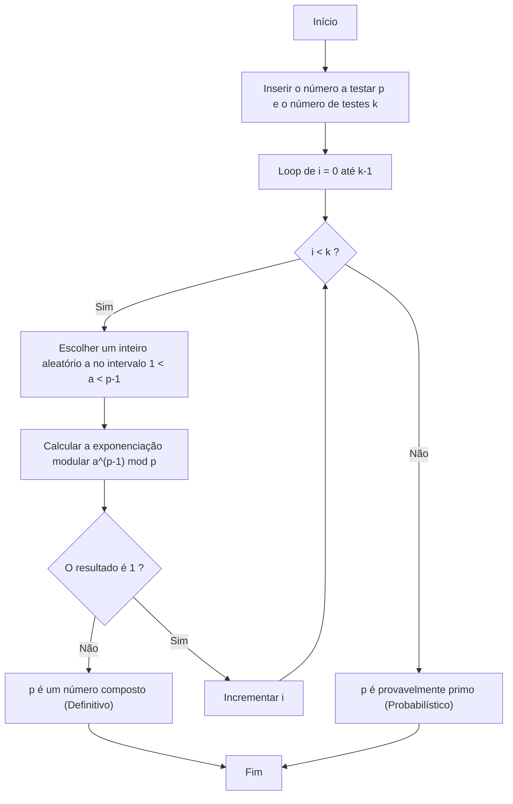
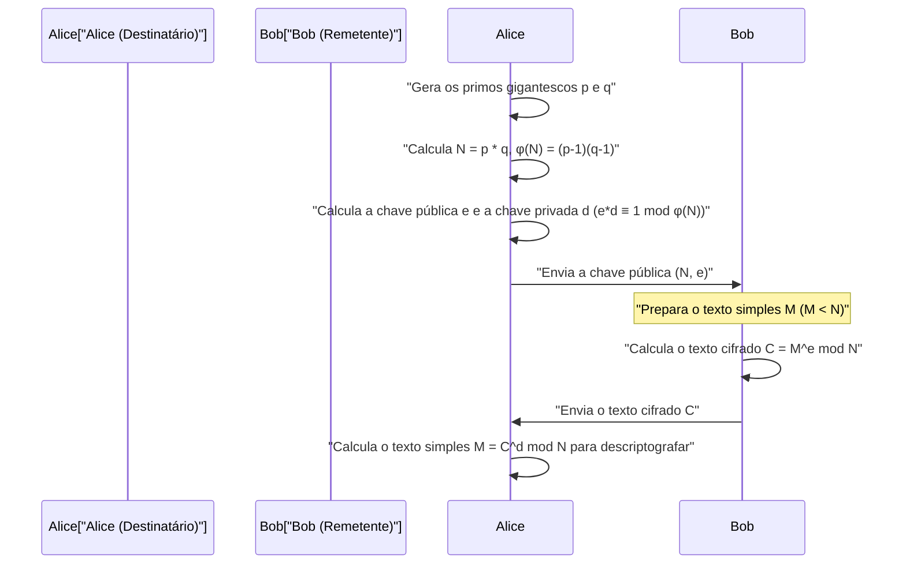

## 1. Introdução: O mistério matemático que sustenta a criptografia moderna

Na sociedade digital moderna, especialmente nas comunicações via Internet, a "criptografia" tornou-se uma tecnologia fundamental indispensável. O fato de podermos navegar na web de forma segura via HTTPS em nossos navegadores, realizar transações financeiras no internet banking e trocar mensagens privadas em aplicativos de mensagens é possível devido aos protocolos criptográficos apoiados por teorias matemáticas avançadas que operam nos bastidores. Entre eles, o sistema de "criptografia de chave pública" desempenha um papel particularmente importante, e seu principal representante é a **Criptografia RSA**.

A segurança e a validade de muitos algoritmos criptográficos, incluindo o RSA, dependem fortemente de um teorema muito belo e poderoso descoberto pelo matemático francês do século 17, Pierre de Fermat. Esse é o **Pequeno Teorema de Fermat (Fermat's Little Theorem)**. Além disso, o teorema de Leonhard Euler, que generaliza isso, também desempenha um papel decisivo na teoria da criptografia.

Neste artigo, explicaremos detalhadamente desde o básico como a descoberta do Pequeno Teorema de Fermat, na matemática pura, é aplicada às tecnologias de criptografia práticas modernas, em particular ao "teste de primalidade" e à "criptografia RSA". Este será um guia técnico muito detalhado que cobre provas matemáticas, os mecanismos de criptografia e descriptografia, e implementações de algoritmos específicos em C++ e Python.

---

## 2. Fundamentos de Congruências e Aritmética Modular

Para entender o Pequeno Teorema de Fermat, primeiro precisamos nos familiarizar com o conceito matemático de "aritmética modular (congruências)". A aritmética modular é um sistema de cálculo que foca no "resto" quando dividido por um número fixo (chamado de módulo). Por ser um cálculo parecido com o mostrador de um relógio (que dá uma volta em 12 horas), também é chamada de "matemática do relógio".

Quando o resto da divisão dos inteiros $a$ e $b$ por um inteiro positivo $n$ é igual, matematicamente, descrevemos da seguinte forma:

$$
a \equiv b \pmod n
$$

Isso é lido como "$a$ e $b$ são congruentes módulo $n$". Por exemplo, o resto da divisão de 17 por 5 é 2, e o resto da divisão de 12 por 5 também é 2. Portanto, podemos escrever:

$$
17 \equiv 12 \pmod 5 \equiv 2 \pmod 5
$$

Na aritmética modular, as quatro operações aritméticas normais (adição, subtração e multiplicação) valem como são:

1. **Adição**: Se $a \equiv b \pmod n$ e $c \equiv d \pmod n$, então $a + c \equiv b + d \pmod n$
2. **Subtração**: Se $a \equiv b \pmod n$ e $c \equiv d \pmod n$, então $a - c \equiv b - d \pmod n$
3. **Multiplicação**: Se $a \equiv b \pmod n$ e $c \equiv d \pmod n$, então $a \times c \equiv b \times d \pmod n$
4. **Exponenciação**: Se $a \equiv b \pmod n$, então para qualquer número natural $k$, $a^k \equiv b^k \pmod n$

No entanto, é necessário ter cuidado com a **divisão**. Em geral, o fato de que $a \times c \equiv b \times c \pmod n$ não significa que podemos dividir ambos os lados por $c$ para obter $a \equiv b \pmod n$. Isso só é verdadeiro se $c$ e $n$ forem coprimos (o máximo divisor comum for 1). Esse conceito de "inverso modular" torna-se extremamente importante na geração de chaves da criptografia RSA descrita mais adiante.

---

## 3. Fundamentação Matemática e Prova do Pequeno Teorema de Fermat

Agora que entendemos os fundamentos da aritmética modular, vamos analisar o assunto principal: o Pequeno Teorema de Fermat.

### 3.1 Definição do Teorema

O Pequeno Teorema de Fermat é formulado da seguinte maneira:

> **Pequeno Teorema de Fermat (Fermat's Little Theorem)**
> Seja $p$ um número primo e $a$ um número inteiro que não seja um múltiplo de $p$ (ou seja, $a$ e $p$ são coprimos). Então, a seguinte congruência é válida:
> $$ a^{p-1} \equiv 1 \pmod p $$

Também é comum expressá-lo de uma forma que seja válida para todos os inteiros $a$, removendo a condição "se $a$ não for múltiplo de $p$". Nesse caso, multiplicando ambos os lados por $a$, temos:

$$
a^p \equiv a \pmod p
$$

### 3.2 Confirmação com Exemplos Específicos

Vamos confirmar se o teorema é realmente válido usando números específicos.
Seja o número primo $p = 5$. Então $p-1 = 4$. Escolheremos um número inteiro $a$ que não seja um múltiplo de $p$.

- Para $a = 2$: $2^{5-1} = 2^4 = 16$. $16 \div 5 = 3$ com resto $1$. Portanto, $16 \equiv 1 \pmod 5$. (Válido)
- Para $a = 3$: $3^{5-1} = 3^4 = 81$. $81 \div 5 = 16$ com resto $1$. Portanto, $81 \equiv 1 \pmod 5$. (Válido)
- Para $a = 4$: $4^{5-1} = 4^4 = 256$. $256 \div 5 = 51$ com resto $1$. Portanto, $256 \equiv 1 \pmod 5$. (Válido)

Como podemos ver, qualquer $a$ que escolhermos (desde que não seja um múltiplo de 5), o resto após elevá-lo à quarta potência e dividi-lo por 5 será sempre 1. Parece magia, mas isso se origina das belas propriedades que os números primos possuem.

### 3.3 Prova Matemática do Teorema

Por que isso acontece? Aqui apresentamos uma prova elegante usando conjuntos de classes de resíduos.

Considere o conjunto $S = \{1, 2, 3, \dots, p-1\}$. Estes são os representantes dos números inteiros cujos restos da divisão por $p$ são de $1$ a $p-1$.
Agora, considere um novo conjunto $T$, formado pela multiplicação de cada elemento por um inteiro $a$, coprimo com $p$.
$$ T = \{1a, 2a, 3a, \dots, (p-1)a\} $$

Vamos considerar o resto de cada elemento desse conjunto $T$ quando dividido por $p$. Surpreendentemente, esses restos, embora a ordem possa mudar, coincidem perfeitamente com o conjunto de elementos do conjunto original $S$.
Por que:
1. Nenhum elemento de $T$ será múltiplo de $p$ (porque nem $a$ nem os elementos originais são múltiplos de $p$).
2. Não existem dois elementos diferentes em $T$ que sejam congruentes módulo $p$. Se houvesse $ia \equiv ja \pmod p$ ($i \neq j$), já que $a$ e $p$ são coprimos, poderíamos dividir por $a$ e obter $i \equiv j \pmod p$, o que é uma contradição.

Portanto, o produto de todos os elementos de $S$ e o produto de todos os elementos de $T$ são congruentes módulo $p$.

$$
(1a) \times (2a) \times \dots \times ((p-1)a) \equiv 1 \times 2 \times \dots \times (p-1) \pmod p
$$

Organizando o lado esquerdo, como temos $p-1$ fatores $a$, obtemos:

$$
a^{p-1} \cdot (p-1)! \equiv (p-1)! \pmod p
$$

Como $(p-1)!$ e $p$ são coprimos, podemos dividir ambos os lados por $(p-1)!$, o que nos leva finalmente ao seguinte teorema:

$$
a^{p-1} \equiv 1 \pmod p
$$

Esta é a prova do Pequeno Teorema de Fermat.

---

## 4. A Função Totiente de Euler e o Teorema de Euler

O Pequeno Teorema de Fermat é um teorema sobre um "número primo $p$", mas quem o generalizou para "qualquer inteiro positivo $n$" foi Leonhard Euler. Essa extensão é essencial para compreender a criptografia RSA.

### 4.1 Função Totiente de Euler $\phi(n)$

A função totiente de Euler (ou função $\phi$ de Euler) $\phi(n)$ é uma função que representa "a quantidade de inteiros de $1$ a $n$ que são coprimos com $n$".

- Para um número primo $p$, como todos os inteiros de $1$ a $p-1$ são coprimos com $p$, temos $\phi(p) = p - 1$.
- Para dois números primos distintos $p$ e $q$, o valor de $\phi(n)$ para o seu produto $n = p \times q$ pode ser calculado com uma fórmula muito simples:
  $$ \phi(p \times q) = \phi(p) \times \phi(q) = (p - 1)(q - 1) $$

Esta propriedade é a lógica central na geração de chaves da criptografia RSA.

### 4.2 Teorema de Euler

Euler generalizou o Pequeno Teorema de Fermat da seguinte maneira:

> **Teorema de Euler (Euler's Theorem)**
> Para qualquer inteiro positivo $n$ e um inteiro $a$ coprimo com ele, é válido que:
> $$ a^{\phi(n)} \equiv 1 \pmod n $$

Se $n$ for um número primo $p$, então $\phi(p) = p - 1$, o que o torna exatamente o Pequeno Teorema de Fermat ($a^{p-1} \equiv 1 \pmod p$). Em outras palavras, o Pequeno Teorema de Fermat não passa de um caso especial do Teorema de Euler.

---

## 5. Encontrando Números Primos Gigantescos: O Teste de Primalidade de Fermat

Na tecnologia criptográfica (como a criptografia RSA e a troca de chaves Diffie-Hellman), é necessário encontrar "números primos gigantescos" de centenas de dígitos em alta velocidade. No entanto, para testar se um número gigante $N$ é primo através da "divisão por tentativa" (testando a divisibilidade por todos os números de $2$ a $\sqrt{N}$), levaria tanto tempo quanto a idade do universo.

Aqui entra o **Teste de Primalidade de Fermat (Fermat Primality Test)**, um "teste de primalidade probabilístico" que usa o Pequeno Teorema de Fermat.

### 5.1 O que é um Teste de Primalidade Probabilístico?

De acordo com o Pequeno Teorema de Fermat, se $p$ for um número primo, então, para qualquer $a$ ($1 < a < p$), $a^{p-1} \equiv 1 \pmod p$ é sempre válido.
Tomando a contrapositiva: "Se houver algum $a$ para o qual $a^{p-1} \not\equiv 1 \pmod p$, então $p$ **absolutamente não é um número primo (é um número composto)**".

Portanto, se quisermos testar se $N$ é um número primo, escolhemos aleatoriamente alguns valores para $a$, calculamos $a^{N-1} \pmod N$ e verificamos se o resultado é $1$. Se obtivermos uma resposta diferente de $1$ mesmo que seja apenas uma vez, concluímos que $N$ é um número composto. Se o resultado for sempre $1$, independentemente de quantas vezes testarmos, podemos julgar com alta probabilidade que $N$ "provavelmente é primo".

### 5.2 Explicação do Algoritmo e Fluxograma

O algoritmo do teste de Fermat é o seguinte.



### 5.3 A Armadilha dos Números de Carmichael (Pseudoprimos)

O teste de Fermat é extremamente rápido, mas tem uma desvantagem séria. Existem números maldosos que, apesar de serem compostos, satisfazem $a^{N-1} \equiv 1 \pmod N$ para todos os valores de $a$. Estes são chamados de **Números de Carmichael (Carmichael numbers)**. O menor número de Carmichael é $561$ ($3 \times 11 \times 17$).

Devido à existência dos números de Carmichael, não se pode realizar um teste de primalidade absoluto usando apenas o teste puro de Fermat. Por esta razão, em sistemas criptográficos reais (como o OpenSSL), o **Teste de Primalidade de Miller-Rabin**, que é um aprimoramento do teste de Fermat, é usado como padrão. O teste de Miller-Rabin consegue detectar os números de Carmichael, reduzindo a probabilidade de falso julgamento praticamente a zero.

### 5.4 Exponenciação Modular Rápida (Método de Exponenciação Binária)

No algoritmo de teste de primalidade, precisamos calcular $a^{N-1} \pmod N$, mas se $N$ for enorme, $a^{N-1}$ terá uma quantidade astronômica de dígitos e não caberá na memória do computador.
O que resolve esse problema é a **Exponenciação Binária (Exponentiation by Squaring)** ou exponenciação modular. Ao aplicar o módulo (mod N) a cada etapa do cálculo, o valor é mantido sempre inferior a $N$, permitindo um cálculo muito rápido (complexidade $O(\log N)$).

---

## 6. Implementação do Teste de Primalidade e Exponenciação Modular

Agora, vamos implementar o teste de primalidade de Fermat e o método de exponenciação binária em C++ e Python.

### 6.1 Implementação em C++

Em C++, os tipos de inteiros padrão tendem a transbordar, exigindo bibliotecas de inteiros de precisão arbitrária (como GMP) para lidar com números enormes, mas aqui mostramos uma implementação dentro do limite de um inteiro de 64 bits (`unsigned long long`) para entender o algoritmo.

```cpp
#include <iostream>
#include <random>

using namespace std;

// Exponenciação modular rápida (a^b mod m) - Método de exponenciação binária
unsigned long long power_mod(unsigned long long a, unsigned long long b, unsigned long long m) {
    unsigned long long result = 1;
    a = a % m;
    while (b > 0) {
        // Se o bit menos significativo de b for 1, multiplica o resultado por a
        if (b % 2 == 1) {
            result = (__int128)result * a % m; // Extensão para 128 bits para evitar transbordamento
        }
        // Eleva a ao quadrado
        a = (__int128)a * a % m;
        // Desloca b para a direita (divide por 2)
        b /= 2;
    }
    return result;
}

// Teste de primalidade de Fermat
bool fermat_is_prime(unsigned long long p, int iterations = 5) {
    if (p <= 1) return false;
    if (p <= 3) return true;
    if (p % 2 == 0) return false;

    random_device rd;
    mt19937_64 gen(rd());
    uniform_int_distribution<unsigned long long> dis(2, p - 2);

    for (int i = 0; i < iterations; ++i) {
        unsigned long long a = dis(gen);
        // Se a^(p-1) mod p não for 1, é um número composto
        if (power_mod(a, p - 1, p) != 1) {
            return false;
        }
    }
    return true; // Provavelmente primo
}

int main() {
    unsigned long long num = 1000000007; // Número primo conhecido
    if (fermat_is_prime(num, 10)) {
        cout << num << " is probably prime." << endl;
    } else {
        cout << num << " is composite." << endl;
    }
    return 0;
}
```

### 6.2 Implementação em Python

O tipo inteiro padrão do Python suporta precisão arbitrária nativamente, de modo que não há necessidade de se preocupar com estouro de dígitos. Além disso, a função interna do Python `pow(a, b, m)` usa internamente o método de exponenciação binária, tornando-a muito rápida.

```python
import random

def fermat_is_prime(p, iterations=5):
    """
    Teste de primalidade probabilístico usando o Teste de Primalidade de Fermat
    """
    if p <= 1:
        return False
    if p <= 3:
        return True
    if p % 2 == 0:
        return False

    for _ in range(iterations):
        # Escolhe um número aleatório a entre 2 e p-2
        a = random.randint(2, p - 2)
        # Calcula a^(p-1) mod p. A função interna pow é rápida.
        if pow(a, p - 1, p) != 1:
            return False # Definitivamente composto

    return True # Provavelmente primo

# Teste
number_to_test = 104729
if fermat_is_prime(number_to_test, 10):
    print(f"{number_to_test} é provavelmente primo.")
else:
    print(f"{number_to_test} é composto.")
```

---

## 7. Aplicação na Criptografia RSA: Onde Fermat e Euler dão Frutos

A maior aplicação do Pequeno Teorema de Fermat (e do Teorema de Euler) é a **Criptografia RSA**, desenvolvida por Rivest, Shamir e Adleman em 1977.
A criptografia RSA é um sistema revolucionário de "criptografia de chave pública", que consegue um mecanismo onde a chave para criptografar (a chave pública) é revelada a todo o mundo, enquanto a chave para descriptografar (a chave privada) é conhecida apenas pelo destinatário pretendido.

Essa assimetria é baseada na segurança computacional proporcionada pelo fato de que "a fatoração de um número composto gigantesco é extremamente difícil".

### 7.1 Como Funciona a Criptografia RSA (Geração de Chaves, Criptografia, Descriptografia)

Vamos ver o fluxo geral de comunicação da criptografia RSA com um diagrama de sequência Mermaid.



Abaixo, explicaremos os passos matemáticos detalhados.

#### Passo 1: Geração de Chaves (Tarefa da destinatária Alice)

1. Gera dois números primos gigantescos aleatórios $p$ e $q$ (o método de teste de primalidade descrito acima é usado aqui).
2. Calcula o seu produto $N = p \times q$. Este $N$ torna-se público.
3. Usando a função totiente de Euler, calcula $\phi(N) = (p-1)(q-1)$.
4. Escolhe um número inteiro $e$ (expoente público) que seja coprimo com $\phi(N)$ (geralmente $e = 65537$ é usado).
5. Calcula o inverso modular $d$ (expoente privado) de $e$. Ou seja, encontra $d$ que satisfaça o seguinte:
   $$ e \cdot d \equiv 1 \pmod{\phi(N)} $$
   Para esse cálculo, o **Algoritmo de Euclides Estendido** é usado.

Com isso, a **chave pública é $(N, e)$** e a **chave privada é $(N, d)$**. (Eles descartam imediatamente ou ocultam estritamente $p, q, \phi(N)$).

#### Passo 2: Criptografia (Tarefa do remetente Bob)

Suponha que Bob queira enviar a mensagem $M$ para Alice ($M$ é uma representação numérica de caracteres, onde $0 \le M < N$).
Bob usa a chave pública de Alice $(N, e)$ para realizar o seguinte cálculo e criar o texto cifrado $C$.

$$
C \equiv M^e \pmod N
$$

Este $C$ é então enviado para Alice pela rede.

#### Passo 3: Descriptografia (Tarefa da destinatária Alice)

Ao receber o texto cifrado $C$, Alice realiza o seguinte cálculo usando a chave privada $d$ que apenas ela conhece.

$$
M' \equiv C^d \pmod N
$$

Surpreendentemente, o resultado desse cálculo, $M'$, é exatamente igual à mensagem original $M$.

### 7.2 Por que pode ser Descriptografado? (Prova Matemática)

É aqui que o Pequeno Teorema de Fermat (Teorema de Euler) mostra seu verdadeiro valor. Por que $C^d \pmod N$ retorna a $M$?

Vamos expandir a equação de descriptografia.
Como $C \equiv M^e \pmod N$,
$$ C^d \equiv (M^e)^d \equiv M^{ed} \pmod N $$

No passo de geração da chave, $d$ foi escolhido para que $e \cdot d \equiv 1 \pmod{\phi(N)}$. Isso significa que existe um número inteiro $k$ tal que:
$$ e \cdot d = 1 + k \cdot \phi(N) $$

Substituindo isso na equação acima:
$$ M^{ed} = M^{1 + k \cdot \phi(N)} = M \cdot M^{k \cdot \phi(N)} = M \cdot (M^{\phi(N)})^k \pmod N $$

Aqui, entra o **Teorema de Euler** ($M^{\phi(N)} \equiv 1 \pmod N$). (*Rigorosamente, $M$ e $N$ precisam ser coprimos, mas em RSA, a probabilidade de que $M$ e $N$ não sejam coprimos é astronomicamente baixa, e pelo Teorema Chinês do Resto, pode-se provar que é válido mesmo se não forem coprimos*).

Aplicando o Teorema de Euler, como $M^{\phi(N)} \equiv 1$, temos:
$$ M \cdot (1)^k \equiv M \pmod N $$

$M$ foi perfeitamente restaurado! As propriedades dos números que Fermat e Euler descobriram há centenas de anos garantem perfeitamente a confidencialidade das comunicações digitais modernas.

---

## 8. Implementação da Criptografia RSA de Brinquedo (Python)

Uma vez que é difícil ter uma noção de como isso funciona baseando-se apenas na teoria, vamos usar o Python para implementar o processo de geração de chaves, criptografia e descriptografia da criptografia RSA na prática. Esta é uma "implementação de brinquedo" educacional, mas a matemática subjacente é exatamente a mesma.

O "Algoritmo de Euclides Estendido" para encontrar o inverso modular $d$ também será incluído na implementação.

```python
import random

# Encontrar o máximo divisor comum
def gcd(a, b):
    while b != 0:
        a, b = b, a % b
    return a

# Algoritmo de Euclides Estendido (encontra x e y para ax + by = gcd(a,b))
# Usado para encontrar d para e*d ≡ 1 (mod φ(N))
def extended_gcd(a, b):
    if a == 0:
        return (b, 0, 1)
    else:
        g, y, x = extended_gcd(b % a, a)
        return (g, x - (b // a) * y, y)

def mod_inverse(e, phi):
    g, x, y = extended_gcd(e, phi)
    if g != 1:
        raise Exception('O inverso não existe')
    else:
        return x % phi

# Função de geração de primos (Versão simples: gera números primos pequenos)
def generate_prime(bits):
    while True:
        p = random.getrandbits(bits)
        # Substitui o teste de Fermat acima por um teste simplificado
        if p > 1 and pow(2, p-1, p) == 1 and pow(3, p-1, p) == 1:
            return p

# Geração de par de chaves RSA
def generate_keypair(bits=16):
    p = generate_prime(bits)
    q = generate_prime(bits)
    # Evita que p e q sejam iguais
    while p == q:
        q = generate_prime(bits)

    n = p * q
    phi = (p - 1) * (q - 1)

    # e costuma usar um número primo como 65537, mas vamos escolher aleatoriamente aqui
    e = random.randrange(1, phi)
    g = gcd(e, phi)
    while g != 1:
        e = random.randrange(1, phi)
        g = gcd(e, phi)

    # Cálculo da chave privada d
    d = mod_inverse(e, phi)
    
    # Chave pública (e, n), chave privada (d, n)
    return ((e, n), (d, n))

def encrypt(pk, plaintext):
    e, n = pk
    # Calcula plaintext^e mod n
    cipher = [pow(ord(char), e, n) for char in plaintext]
    return cipher

def decrypt(sk, ciphertext):
    d, n = sk
    # Calcula cipher^d mod n e reverte para um caractere
    plain = [chr(pow(char, d, n)) for char in ciphertext]
    return ''.join(plain)

# Exemplo de execução
if __name__ == '__main__':
    print("--- Implementação da Criptografia RSA de Brinquedo ---")
    public_key, private_key = generate_keypair(bits=12) # Usa um número primo de 12 bits
    
    print(f"Chave pública (e, n): {public_key}")
    print(f"Chave privada (d, n): {private_key}")

    message = "Hello Math!"
    print(f"\nMensagem original: {message}")

    # Criptografia
    encrypted_msg = encrypt(public_key, message)
    print(f"Texto cifrado: {encrypted_msg}")

    # Descriptografia
    decrypted_msg = decrypt(private_key, encrypted_msg)
    print(f"Mensagem descriptografada: {decrypted_msg}")
```

Quando você executa este código, você pode confirmar como a matriz de caracteres é convertida em um array de números estranhos (texto cifrado), e como isso é restaurado perfeitamente para a string original através da chave privada.

---

## 9. Conclusão: A Intersecção entre a Beleza da Matemática e a Praticidade

Quando Pierre de Fermat descobriu este "pequeno teorema" no século 17, ninguém pensou que isso pudesse ser útil de alguma forma. O próprio Fermat conduziu suas pesquisas em teoria dos números com curiosidade puramente matemática.

No entanto, nos anos 1970, cerca de 300 anos depois, nos primórdios das redes de computadores, o teorema de Fermat fez um retorno dramático como uma tecnologia de criptografia essencial para estabelecer protocolos de comunicação seguros. A tecnologia do teste de primalidade baseada no Pequeno Teorema de Fermat e a Criptografia RSA, com base no Teorema de Euler, sustentam literalmente a infraestrutura moderna da internet.

Até mesmo a mensagem no LINE que enviamos casualmente todos os dias e nossas compras na Amazon, estão todas dançando no topo desta simples e bela fórmula: $a^{p-1} \equiv 1 \pmod p$. O Pequeno Teorema de Fermat nos ensina que, não importa o quão abstrata seja a matemática, o momento em que ela for útil para a humanidade sem dúvida chegará algum dia.

Ao aprender programação e teoria criptográfica, compreender a estrutura matemática em seus fundamentos será uma grande arma para o profundo entendimento do comportamento das bibliotecas fornecidas como caixas-pretas e para o design de sistemas mais seguros.
