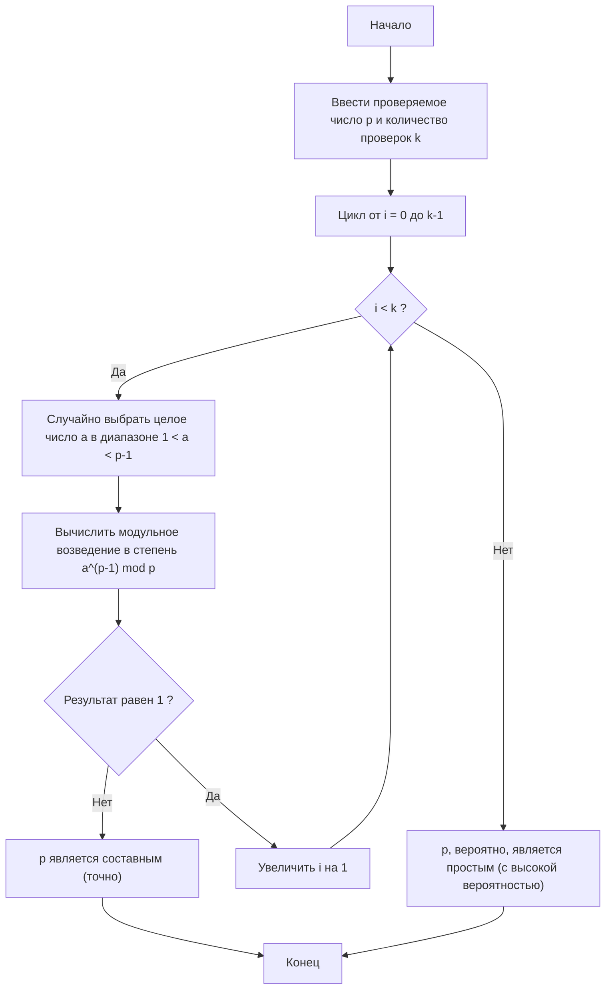
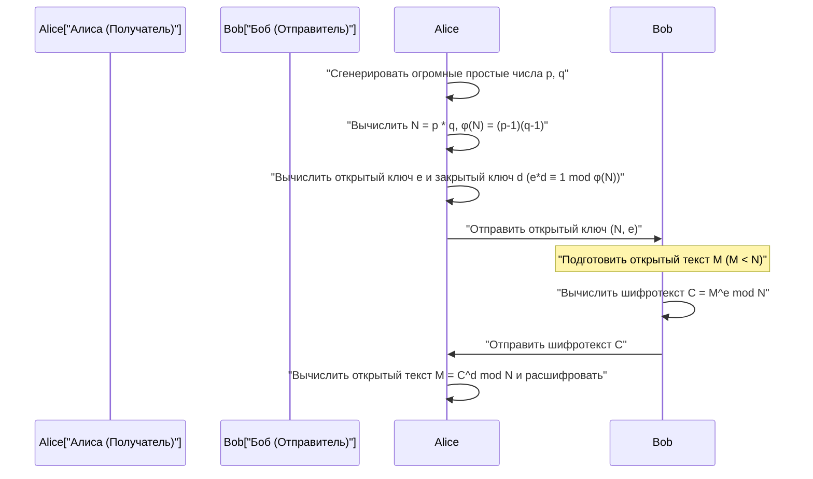

## 1. Введение: Тайна математики, лежащая в основе современной криптографии

В современном цифровом обществе, особенно в связи с передачей данных через Интернет, «криптография» стала неотъемлемой базовой технологией. То, что мы можем безопасно просматривать веб-сайты через HTTPS в веб-браузерах, совершать финансовые операции в онлайн-банкинге и приватно общаться в приложениях для обмена сообщениями, возможно благодаря криптографическим протоколам, работающим в фоновом режиме и опирающимся на продвинутую математическую теорию. Среди них особо важную роль играет «криптография с открытым ключом», ярким представителем которой является **алгоритм RSA**.

Безопасность и корректность многих криптографических алгоритмов, включая RSA, во многом зависят от очень красивой и мощной теоремы, открытой в 17 веке французским математиком Пьером де Ферма (Pierre de Fermat). Это **Малая теорема Ферма (Fermat's Little Theorem)**. Кроме того, теорема Леонарда Эйлера (Leonhard Euler), которая является ее обобщением, также играет решающую роль в теории криптографии.

В этой статье подробно и с самых основ объясняется, как открытие из области чистой математики, такое как малая теорема Ферма, применяется в современных практических криптографических технологиях, в частности, для «проверки на простоту» и в «алгоритме RSA». Это очень подробное техническое руководство, охватывающее математические доказательства, механизмы шифрования и дешифрования, а также конкретные реализации алгоритмов на C++ и Python.

---

## 2. Основы сравнений и модульной арифметики

Чтобы понять малую теорему Ферма, сначала необходимо ознакомиться с математической концепцией «модульной арифметики (сравнений по модулю)». Модульная арифметика — это система вычислений, в которой основное внимание уделяется «остатку» от деления на определенное заданное число (называемое модулем). Поскольку вычисления похожи на циферблат часов (который делает полный оборот за 12 часов), ее также называют «арифметикой часов».

Когда остатки от деления целых чисел $a$ и $b$ на положительное целое число $n$ равны, математически это записывается следующим образом:

$$
a \equiv b \pmod n
$$

Это читается как «$a$ и $b$ сравнимы по модулю $n$». Например, остаток от деления 17 на 5 равен 2, и остаток от деления 12 на 5 также равен 2. Поэтому мы можем записать:

$$
17 \equiv 12 \pmod 5 \equiv 2 \pmod 5
$$

В модульной арифметике обычные четыре арифметических действия (сложение, вычитание, умножение) работают так же:

1. **Сложение**: Если $a \equiv b \pmod n$ и $c \equiv d \pmod n$, то $a + c \equiv b + d \pmod n$
2. **Вычитание**: Если $a \equiv b \pmod n$ и $c \equiv d \pmod n$, то $a - c \equiv b - d \pmod n$
3. **Умножение**: Если $a \equiv b \pmod n$ и $c \equiv d \pmod n$, то $a \times c \equiv b \times d \pmod n$
4. **Возведение в степень**: Если $a \equiv b \pmod n$, то для любого натурального числа $k$ верно $a^k \equiv b^k \pmod n$

Однако с **делением** следует быть осторожными. В общем случае, из того, что $a \times c \equiv b \times c \pmod n$, нельзя разделить обе части на $c$ и получить $a \equiv b \pmod n$. Это справедливо только в том случае, когда $c$ и $n$ взаимно просты (их наибольший общий делитель равен 1). Эта концепция «модульного обратного элемента» станет чрезвычайно важной при генерации ключей RSA, которая будет обсуждаться позже.

---

## 3. Математические основы и доказательство малой теоремы Ферма

Теперь, когда мы усвоили основы модульной арифметики, давайте перейдем к главной теме — малой теореме Ферма.

### 3.1 Определение теоремы

Малая теорема Ферма формулируется следующим образом:

> **Малая теорема Ферма (Fermat's Little Theorem)**
> Пусть $p$ — простое число, а $a$ — любое целое число, не кратное $p$ (то есть $a$ и $p$ взаимно просты). Тогда справедливо следующее сравнение:
> $$ a^{p-1} \equiv 1 \pmod p $$

Также часто встречается форма, в которой условие «$a$ не кратно $p$» убирается, и теорема выражается в виде, справедливом для всех целых чисел $a$. В этом случае, если умножить обе части на $a$, мы получим:

$$
a^p \equiv a \pmod p
$$

### 3.2 Проверка на конкретных примерах

Давайте проверим на конкретных числах, действительно ли работает эта теорема.
Пусть простое число $p = 5$. Тогда $p-1 = 4$. В качестве $a$ выберем целые числа, не кратные $p$.

- Для $a = 2$: $2^{5-1} = 2^4 = 16$. $16 \div 5 = 3$ с остатком $1$. Следовательно, $16 \equiv 1 \pmod 5$. (Выполняется)
- Для $a = 3$: $3^{5-1} = 3^4 = 81$. $81 \div 5 = 16$ с остатком $1$. Следовательно, $81 \equiv 1 \pmod 5$. (Выполняется)
- Для $a = 4$: $4^{5-1} = 4^4 = 256$. $256 \div 5 = 51$ с остатком $1$. Следовательно, $256 \equiv 1 \pmod 5$. (Выполняется)

Таким образом, какое бы $a$ мы ни выбрали (при условии, что оно не кратно 5), остаток от деления 4-й степени на 5 всегда будет равен 1. Это выглядит как магия, но проистекает из прекрасных свойств простых чисел.

### 3.3 Математическое доказательство теоремы

Почему же это справедливо? Здесь мы приведем элегантное доказательство с использованием множества классов вычетов.

Рассмотрим множество $S = \{1, 2, 3, \dots, p-1\}$. Это представители целых чисел, остатки от деления которых на $p$ находятся в диапазоне от $1$ до $p-1$.
Теперь рассмотрим новое множество $T$, полученное умножением каждого элемента на целое число $a$, взаимно простое с $p$:
$$ T = \{1a, 2a, 3a, \dots, (p-1)a\} $$

Рассмотрим остатки от деления каждого элемента множества $T$ на $p$. Удивительно, но эти остатки (возможно, в другом порядке) полностью совпадают с множеством элементов исходного множества $S$.
Это происходит потому что:
1. Никакой элемент $T$ не может быть кратен $p$ (так как ни $a$, ни исходные элементы не кратны $p$).
2. В $T$ не существует двух различных элементов, сравнимых по модулю $p$. Если бы $ia \equiv ja \pmod p$ (при $i \neq j$), то, поскольку $a$ и $p$ взаимно просты, мы могли бы разделить обе части на $a$, получив $i \equiv j \pmod p$, что является противоречием.

Таким образом, произведение всех элементов множества $S$ сравнимо с произведением всех элементов множества $T$ по модулю $p$:

$$
(1a) \times (2a) \times \dots \times ((p-1)a) \equiv 1 \times 2 \times \dots \times (p-1) \pmod p
$$

Если преобразовать левую часть, мы получим $p-1$ множителей $a$, поэтому:

$$
a^{p-1} \cdot (p-1)! \equiv (p-1)! \pmod p
$$

Поскольку $(p-1)!$ взаимно просто с $p$, мы можем разделить обе части на $(p-1)!$, и в итоге выводится следующая теорема:

$$
a^{p-1} \equiv 1 \pmod p
$$

Это и есть доказательство малой теоремы Ферма.

---

## 4. Функция Эйлера и теорема Эйлера

Малая теорема Ферма касается «простого числа $p$», но Леонард Эйлер обобщил ее для «любого положительного целого числа $n$». Это расширение необходимо для понимания алгоритма RSA.

### 4.1 Функция Эйлера $\phi(n)$

Функция Эйлера (также называемая тотиентом или $\phi$-функцией Эйлера) $\phi(n)$ представляет собой функцию, возвращающую «количество целых чисел от $1$ до $n$, взаимно простых с $n$».

- В случае простого числа $p$ все целые числа от $1$ до $p-1$ взаимно просты с $p$, поэтому $\phi(p) = p - 1$.
- Для двух различных простых чисел $p$ и $q$, в случае их произведения $n = p \times q$, $\phi(n)$ вычисляется по очень простой формуле:
  $$ \phi(p \times q) = \phi(p) \times \phi(q) = (p - 1)(q - 1) $$

Это свойство становится фундаментальной логикой при генерации ключей RSA.

### 4.2 Теорема Эйлера

Эйлер обобщил малую теорему Ферма следующим образом:

> **Теорема Эйлера (Euler's Theorem)**
> Для любого положительного целого числа $n$ и взаимно простого с ним целого числа $a$ справедливо следующее:
> $$ a^{\phi(n)} \equiv 1 \pmod n $$

Если $n$ — простое число $p$, то $\phi(p) = p - 1$, и это становится самой малой теоремой Ферма ($a^{p-1} \equiv 1 \pmod p$). Иными словами, малая теорема Ферма является лишь частным случаем теоремы Эйлера.

---

## 5. Поиск огромных простых чисел: Тест Ферма на простоту

В криптографических технологиях (таких как алгоритм RSA или обмен ключами Диффи-Хеллмана) необходимо быстро находить «огромные простые числа», длина которых может составлять сотни цифр. Однако, чтобы определить, является ли огромное число $N$ простым с помощью метода «перебора делителей» от $2$ до $\sqrt{N}$, потребовалось бы время, сравнимое с возрастом Вселенной.

И здесь на помощь приходит «вероятностный тест на простоту», использующий малую теорему Ферма наоборот. Он называется **тест Ферма (Fermat Primality Test)**.

### 5.1 Что такое вероятностный тест на простоту

Согласно малой теореме Ферма, если $p$ — простое число, то для любого $a$ ($1 < a < p$) обязательно выполняется $a^{p-1} \equiv 1 \pmod p$.
Если взять контрапозицию, то можно сказать: «Если для некоторого $a$ выполняется $a^{p-1} \not\equiv 1 \pmod p$, то $p$ **абсолютно точно не является простым (является составным числом)**».

Следовательно, если мы хотим проверить, является ли число $N$ простым, мы случайно выбираем несколько чисел $a$, вычисляем $a^{N-1} \pmod N$ и проверяем, равно ли это $1$. Если хотя бы раз ответ будет отличным от $1$, то точно установлено, что $N$ — составное число. Если же мы пробуем много раз и всегда получаем $1$, то с высокой долей вероятности можно судить, что $N$ «вероятно, простое».

### 5.2 Объяснение алгоритма и блок-схема

Алгоритм теста Ферма выглядит следующим образом:



### 5.3 Подводный камень: числа Кармайкла (псевдопростые)

Тест Ферма очень быстр, но у него есть один существенный недостаток. Существуют такие дьявольские числа, которые, будучи составными, удовлетворяют условию $a^{N-1} \equiv 1 \pmod N$ для всех возможных $a$. Такие числа называются **числами Кармайкла (Carmichael numbers)**. Наименьшим числом Кармайкла является $561$ ($3 \times 11 \times 17$).

Из-за существования чисел Кармайкла только лишь с помощью теста Ферма нельзя абсолютно точно определить простоту числа. Поэтому в реальных криптографических системах (таких как OpenSSL) стандартно используется усовершенствованная версия теста Ферма — **тест простоты Миллера-Рабина (Miller-Rabin Primality Test)**. Поскольку алгоритм Миллера-Рабина способен выявлять числа Кармайкла, вероятность ложного срабатывания может быть сведена практически к нулю.

### 5.4 Быстрое модульное возведение в степень (метод бинарного возведения в степень)

В алгоритме проверки на простоту необходимо вычислять $a^{N-1} \pmod N$, но если $N$ огромно, то $a^{N-1}$ будет иметь астрономическое количество цифр и не поместится в память компьютера.
Решением этой проблемы является **метод бинарного возведения в степень (Exponentiation by Squaring)**, или быстрое модульное возведение в степень. Путем взятия остатка (mod N) на каждом шаге вычисления значение всегда сохраняется меньше $N$, что позволяет выполнять вычисления очень быстро (со сложностью $O(\log N)$).

---

## 6. Реализация проверки на простоту и модульного возведения в степень

Теперь давайте реализуем тест Ферма на простоту и метод бинарного возведения в степень на C++ и Python.

### 6.1 Реализация на C++

В C++ стандартные целочисленные типы подвержены переполнению, поэтому для работы с большими числами требуются библиотеки многократной точности (например, GMP), но здесь мы приведем реализацию в пределах 64-битных целых чисел (`unsigned long long`) для понимания алгоритма.

```cpp
#include <iostream>
#include <random>

using namespace std;

// Быстрое модульное возведение в степень (a^b mod m) - метод бинарного возведения в степень
unsigned long long power_mod(unsigned long long a, unsigned long long b, unsigned long long m) {
    unsigned long long result = 1;
    a = a % m;
    while (b > 0) {
        // Если младший бит b равен 1, умножаем результат на a
        if (b % 2 == 1) {
            result = (__int128)result * a % m; // Расширение до 128 бит для предотвращения переполнения
        }
        // Возводим a в квадрат
        a = (__int128)a * a % m;
        // Сдвигаем b вправо (делим пополам)
        b /= 2;
    }
    return result;
}

// Тест Ферма на простоту
bool fermat_is_prime(unsigned long long p, int iterations = 5) {
    if (p <= 1) return false;
    if (p <= 3) return true;
    if (p % 2 == 0) return false;

    random_device rd;
    mt19937_64 gen(rd());
    uniform_int_distribution<unsigned long long> dis(2, p - 2);

    for (int i = 0; i < iterations; ++i) {
        unsigned long long a = dis(gen);
        // Если a^(p-1) mod p не равно 1, то это составное число
        if (power_mod(a, p - 1, p) != 1) {
            return false;
        }
    }
    return true; // Вероятно, простое
}

int main() {
    unsigned long long num = 1000000007; // Известное простое число
    if (fermat_is_prime(num, 10)) {
        cout << num << " is probably prime." << endl;
    } else {
        cout << num << " is composite." << endl;
    }
    return 0;
}
```

### 6.2 Реализация на Python

Стандартный целочисленный тип в Python поддерживает числа произвольной точности, поэтому не нужно беспокоиться о переполнении. Кроме того, встроенная функция Python `pow(a, b, m)` внутренне использует метод бинарного возведения в степень и работает очень быстро.

```python
import random

def fermat_is_prime(p, iterations=5):
    """
    Вероятностный тест на простоту с использованием теста Ферма
    """
    if p <= 1:
        return False
    if p <= 3:
        return True
    if p % 2 == 0:
        return False

    for _ in range(iterations):
        # Выбираем случайное число a от 2 до p-2
        a = random.randint(2, p - 2)
        # Вычисляем a^(p-1) mod p. Встроенная функция pow работает быстро.
        if pow(a, p - 1, p) != 1:
            return False # Точно составное число

    return True # Вероятно, простое

# Тестирование
number_to_test = 104729
if fermat_is_prime(number_to_test, 10):
    print(f"{number_to_test} вероятно, является простым.")
else:
    print(f"{number_to_test} является составным.")
```

---

## 7. Применение в алгоритме RSA: Место встречи Ферма и Эйлера

Самым великим применением малой теоремы Ферма (и теоремы Эйлера) является **алгоритм RSA**, разработанный в 1977 году Ривестом, Шамиром и Адлеманом.
RSA — это инновационная криптографическая система с «открытым ключом», в которой ключ для шифрования (открытый ключ) доступен всему миру, а ключ для дешифрования (закрытый ключ) известен только самому получателю.

Эта асимметричность основана на вычислительной безопасности, обусловленной тем, что «разложение огромного составного числа на простые множители является чрезвычайно сложной задачей».

### 7.1 Механизм RSA (генерация ключей, шифрование, дешифрование)

Давайте рассмотрим весь процесс обмена данными в алгоритме RSA с помощью диаграммы последовательности Mermaid.



Ниже описаны подробные математические шаги.

#### Шаг 1: Генерация ключей (действия получателя Алисы)

1. Случайным образом генерируются два огромных простых числа $p$ и $q$ (здесь используется упомянутый ранее тест на простоту).
2. Вычисляется их произведение $N = p \times q$. Это значение $N$ публикуется открыто.
3. Используя функцию Эйлера, вычисляется $\phi(N) = (p-1)(q-1)$.
4. Выбирается целое число $e$ (открытая экспонента), взаимно простое с $\phi(N)$ (часто используется $e = 65537$).
5. Вычисляется модульный обратный элемент $d$ (закрытая экспонента) для $e$. То есть, находится такое $d$, которое удовлетворяет условию:
   $$ e \cdot d \equiv 1 \pmod{\phi(N)} $$
   Для этих вычислений используется **расширенный алгоритм Евклида**.

Таким образом, **открытым ключом становится пара $(N, e)$**, а **закрытым ключом — пара $(N, d)$**. (Значения $p, q, \phi(N)$ следует немедленно уничтожить или строго хранить в секрете).

#### Шаг 2: Шифрование (действия отправителя Боба)

Предположим, Боб хочет отправить Алисе сообщение $M$ (где $M$ — это преобразованный в числа текст, и $0 \le M < N$).
Боб использует открытый ключ Алисы $(N, e)$ для вычисления шифротекста $C$ следующим образом:

$$
C \equiv M^e \pmod N
$$

Затем этот $C$ передается Алисе по сети.

#### Шаг 3: Дешифрование (действия получателя Алисы)

Получив шифротекст $C$, Алиса использует свой закрытый ключ $d$, который знает только она, для выполнения следующего вычисления:

$$
M' \equiv C^d \pmod N
$$

Поразительно, но результат этого вычисления $M'$ полностью совпадает с исходным сообщением $M$.

### 7.2 Почему возможна расшифровка? (Математическое доказательство)

Здесь малая теорема Ферма (и теорема Эйлера) проявляет свою истинную ценность. Почему $C^d \pmod N$ превращается обратно в $M$?

Давайте раскроем формулу дешифрования.
Поскольку $C \equiv M^e \pmod N$, то:
$$ C^d \equiv (M^e)^d \equiv M^{ed} \pmod N $$

На шаге генерации ключей мы выбрали $d$ таким образом, что $e \cdot d \equiv 1 \pmod{\phi(N)}$. Это означает, что существует некоторое целое число $k$, при котором можно записать:
$$ e \cdot d = 1 + k \cdot \phi(N) $$

Подставим это в верхнюю формулу:
$$ M^{ed} = M^{1 + k \cdot \phi(N)} = M \cdot M^{k \cdot \phi(N)} = M \cdot (M^{\phi(N)})^k \pmod N $$

Здесь и появляется **теорема Эйлера** ($M^{\phi(N)} \equiv 1 \pmod N$). (※Строго говоря, $M$ и $N$ должны быть взаимно простыми, но в RSA вероятность того, что $M$ и $N$ не взаимно просты, астрономически мала, и, используя китайскую теорему об остатках, можно доказать, что это будет работать, даже если они не взаимно просты).

Применяя теорему Эйлера, так как $M^{\phi(N)} \equiv 1$, получаем:
$$ M \cdot (1)^k \equiv M \pmod N $$

$M$ чудесным образом восстановлено! Свойства чисел, открытые Ферма и Эйлером столетия назад, идеально гарантируют конфиденциальность современной цифровой связи.

---

## 8. Игрушечная реализация алгоритма RSA (Python)

Только в теории все может казаться сложным, поэтому давайте используем Python для фактической реализации процесса генерации ключей, шифрования и дешифрования RSA. Хотя это обучающая «игрушечная реализация», используемая математика абсолютно реальна.

Мы также включим в реализацию «расширенный алгоритм Евклида» для нахождения модульного обратного элемента $d$.

```python
import random

# Нахождение наибольшего общего делителя
def gcd(a, b):
    while b != 0:
        a, b = b, a % b
    return a

# Расширенный алгоритм Евклида (находим x, y для ax + by = gcd(a,b))
# Используется для нахождения d из e*d ≡ 1 (mod φ(N))
def extended_gcd(a, b):
    if a == 0:
        return (b, 0, 1)
    else:
        g, y, x = extended_gcd(b % a, a)
        return (g, x - (b // a) * y, y)

def mod_inverse(e, phi):
    g, x, y = extended_gcd(e, phi)
    if g != 1:
        raise Exception('Обратного элемента не существует')
    else:
        return x % phi

# Функция генерации простых чисел (упрощенная: генерирует небольшие простые числа)
def generate_prime(bits):
    while True:
        p = random.getrandbits(bits)
        # Упрощенная проверка вместо упомянутого ранее теста Ферма
        if p > 1 and pow(2, p-1, p) == 1 and pow(3, p-1, p) == 1:
            return p

# Генерация ключей RSA
def generate_keypair(bits=16):
    p = generate_prime(bits)
    q = generate_prime(bits)
    # Убедимся, что p и q не одинаковые
    while p == q:
        q = generate_prime(bits)

    n = p * q
    phi = (p - 1) * (q - 1)

    # Для e часто используют простые числа, например 65537, но здесь выберем случайно
    e = random.randrange(1, phi)
    g = gcd(e, phi)
    while g != 1:
        e = random.randrange(1, phi)
        g = gcd(e, phi)

    # Вычисление закрытого ключа d
    d = mod_inverse(e, phi)
    
    # Открытый ключ (e, n), Закрытый ключ (d, n)
    return ((e, n), (d, n))

def encrypt(pk, plaintext):
    e, n = pk
    # Вычисляем plaintext^e mod n
    cipher = [pow(ord(char), e, n) for char in plaintext]
    return cipher

def decrypt(sk, ciphertext):
    d, n = sk
    # Вычисляем cipher^d mod n и преобразуем обратно в символы
    plain = [chr(pow(char, d, n)) for char in ciphertext]
    return ''.join(plain)

# Пример выполнения
if __name__ == '__main__':
    print("--- Игрушечная реализация RSA ---")
    public_key, private_key = generate_keypair(bits=12) # Используем 12-битные простые числа
    
    print(f"Открытый ключ (e, n): {public_key}")
    print(f"Закрытый ключ (d, n): {private_key}")

    message = "Hello Math!"
    print(f"\nИсходное сообщение: {message}")

    # Шифрование
    encrypted_msg = encrypt(public_key, message)
    print(f"Шифротекст: {encrypted_msg}")

    # Дешифрование
    decrypted_msg = decrypt(private_key, encrypted_msg)
    print(f"Расшифрованное сообщение: {decrypted_msg}")
```

При запуске этого кода вы увидите, как массив символов преобразуется в массив незнакомых чисел (шифротекст), а затем блестяще восстанавливается в исходную строку с помощью закрытого ключа.

---

## 9. Заключение: Место пересечения красоты и практичности математики

Когда в 17 веке Пьер де Ферма открыл эту «малую теорему», никто не мог подумать, что она когда-нибудь пригодится. Сам Ферма занимался теорией чисел исключительно из чистого математического любопытства.

Однако почти 300 лет спустя, в 1970-х годах, на заре компьютерных сетей теорема Ферма совершила драматическое возрождение в качестве криптографической технологии, необходимой для создания безопасных протоколов связи. Метод проверки простоты, основанный на малой теореме Ферма, и алгоритм RSA, основанный на теореме Эйлера, буквально поддерживают инфраструктуру современного Интернета.

И сообщения в мессенджерах, которые мы отправляем каждый день, и покупки на Amazon — все это танцует на фундаменте одной простой и красивой формулы: $a^{p-1} \equiv 1 \pmod p$. Малая теорема Ферма учит нас тому, что независимо от того, насколько абстрактной может быть математика, однажды обязательно наступит время, когда она послужит человечеству.

При изучении программирования и теории криптографии понимание базовых математических структур станет для вас мощным инструментом. Это поможет глубоко понять поведение библиотек, предоставляемых в виде черных ящиков, и разрабатывать более безопасные системы.
