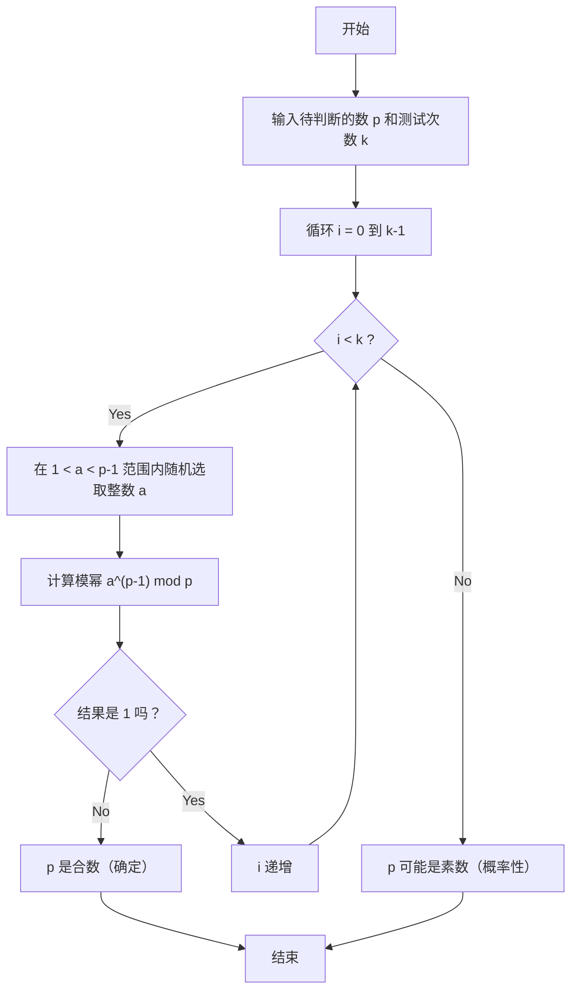
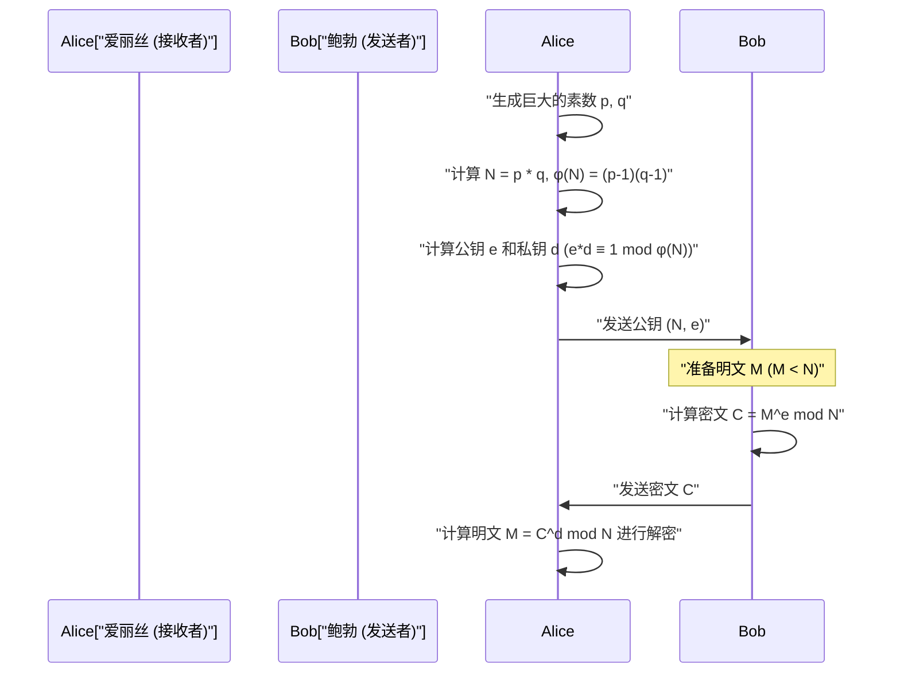

## 1. 引言：支撑现代密码学的数学奥秘

在现代数字社会，尤其是基于互联网的通信中，“加密”已经成为不可或缺的基础设施技术。我们在网络浏览器上通过HTTPS安全地浏览网站、在网上银行进行金融交易、在即时通讯应用上进行私密交流，这一切的背后，都是由基于高级数学理论的加密协议在发挥作用。其中发挥关键作用的是“公钥加密算法”，其代表就是 **RSA加密**。

包括RSA加密在内的许多加密算法的安全性与合理性，都极大地依赖于17世纪法国数学家皮埃尔·德·费马（Pierre de Fermat）发现的一个非常优美且强大的定理。那就是 **费马小定理（Fermat's Little Theorem）**。此外，将其一般化的莱昂哈德·欧拉（Leonhard Euler）定理也在密码学理论中发挥了决定性作用。

本文将从基础开始全面解析，纯数学的发现——费马小定理，是如何被应用到现代实用的加密技术中，特别是在“素数测试”和“RSA加密”中的。本篇将是一份非常详细的技术指南，涵盖数学证明、加密与解密的机制，以及使用 C++ 和 Python 进行的具体算法实现。

---

## 2. 同余与模运算基础

要理解费马小定理，首先需要熟悉“模运算（同余式）”这一数学概念。模运算是一种关注除以某个固定数（称为模数）后所得“余数”的计算体系。因为类似于钟表表盘（12小时转一圈）的计算，所以也被称为“时钟算术”。

当整数 $a$ 和 $b$ 除以正整数 $n$ 的余数相等时，在数学上可以这样描述：

$$
a \equiv b \pmod n
$$

这读作“在模 $n$ 下 $a$ 和 $b$ 同余”。例如，17 除以 5 的余数是 2，12 除以 5 的余数也是 2。因此，可以写成如下形式：

$$
17 \equiv 12 \pmod 5 \equiv 2 \pmod 5
$$

在模运算中，常规的四则运算（加、减、乘）依然成立。

1. **加法**: 如果 $a \equiv b \pmod n$ 且 $c \equiv d \pmod n$，那么 $a + c \equiv b + d \pmod n$
2. **减法**: 如果 $a \equiv b \pmod n$ 且 $c \equiv d \pmod n$，那么 $a - c \equiv b - d \pmod n$
3. **乘法**: 如果 $a \equiv b \pmod n$ 且 $c \equiv d \pmod n$，那么 $a \times c \equiv b \times d \pmod n$
4. **幂运算**: 如果 $a \equiv b \pmod n$，那么对于任意自然数 $k$，都有 $a^k \equiv b^k \pmod n$

但是，关于 **除法** 则需要特别注意。通常情况下，即使 $a \times c \equiv b \times c \pmod n$，也不能直接将两边同时除以 $c$ 得到 $a \equiv b \pmod n$。这只有在 $c$ 和 $n$ 互质（最大公约数为1）的情况下才成立。这个“模逆元”的概念，在后文所述的RSA加密密钥生成中极其重要。

---

## 3. 费马小定理的数学背景与证明

掌握了模运算的基础后，让我们进入正题，来看费马小定理。

### 3.1 定理的定义

费马小定理的表述如下：

> **费马小定理 (Fermat's Little Theorem)**
> 设 $p$ 为一个素数，且 $a$ 是任意一个不是 $p$ 的倍数的整数（即 $a$ 和 $p$ 互质）。此时，以下同余式成立：
> $$ a^{p-1} \equiv 1 \pmod p $$

另外，去掉“$a$ 不是 $p$ 的倍数”这一条件，将其表述为对所有整数 $a$ 都成立的形式也很常见。这种情况下，两边同时乘以 $a$，变成如下形式：

$$
a^p \equiv a \pmod p
$$

### 3.2 通过具体例子进行验证

定理是否真的成立呢？让我们用具体的数字来验证一下。
假设素数 $p = 5$。则 $p-1 = 4$。选择一个不是 $p$ 的倍数的整数作为 $a$。

- 当 $a = 2$ 时: $2^{5-1} = 2^4 = 16$。$16 \div 5 = 3$ 余 $1$。因此 $16 \equiv 1 \pmod 5$。（成立）
- 当 $a = 3$ 时: $3^{5-1} = 3^4 = 81$。$81 \div 5 = 16$ 余 $1$。因此 $81 \equiv 1 \pmod 5$。（成立）
- 当 $a = 4$ 时: $4^{5-1} = 4^4 = 256$。$256 \div 5 = 51$ 余 $1$。因此 $256 \equiv 1 \pmod 5$。（成立）

就像这样，无论选择什么样的 $a$（只要不是5的倍数），其4次方除以5的余数一定为1。这看起来像魔法，但其实源于素数所具有的优美性质。

### 3.3 定理的数学证明

为什么会成立这样的定理呢？这里介绍一种使用剩余类集合的优雅证明方法。

考虑集合 $S = \{1, 2, 3, \dots, p-1\}$。这些是除以 $p$ 后余数为 $1$ 到 $p-1$ 的整数的代表元。
现在，考虑一个新集合 $T$，它是将 $S$ 中的每个元素都乘以与 $p$ 互质的整数 $a$ 得到的：
$$ T = \{1a, 2a, 3a, \dots, (p-1)a\} $$

考虑集合 $T$ 的各个元素除以 $p$ 的余数。令人惊讶的是，这些余数，虽然顺序可能发生改变，但它们组成的集合与原来的集合 $S$ 完全一致。
这是因为：
1. $T$ 的元素不可能成为 $p$ 的倍数（因为 $a$ 和原来的元素都不是 $p$ 的倍数）。
2. 在 $T$ 中，不存在在模 $p$ 下同余的两个不同元素。如果 $ia \equiv ja \pmod p$ （其中 $i \neq j$），因为 $a$ 和 $p$ 互质，所以可以除以 $a$，得到 $i \equiv j \pmod p$，这导致矛盾。

因此，$S$ 中所有元素的乘积，与 $T$ 中所有元素的乘积，在模 $p$ 下是同余的。

$$
(1a) \times (2a) \times \dots \times ((p-1)a) \equiv 1 \times 2 \times \dots \times (p-1) \pmod p
$$

整理左边，因为有 $p-1$ 个 $a$，所以：

$$
a^{p-1} \cdot (p-1)! \equiv (p-1)! \pmod p
$$

因为 $(p-1)!$ 与 $p$ 互质，所以两边可以同时除以 $(p-1)!$，最终导出以下定理：

$$
a^{p-1} \equiv 1 \pmod p
$$

这就是费马小定理的证明。

---

## 4. 欧拉函数与欧拉定理

费马小定理是关于“素数 $p$”的定理，而将其推广到“任意正整数 $n$”的人，正是莱昂哈德·欧拉。要理解RSA加密，这种推广是必不可少的。

### 4.1 欧拉函数 $\phi(n)$

欧拉的totient函数（或称欧拉的 $\phi$ 函数） $\phi(n)$，是一个表示“从 $1$ 到 $n$ 的整数中，与 $n$ 互质的数的个数”的函数。

- 对于素数 $p$，从 $1$ 到 $p-1$ 的所有整数都与 $p$ 互质，因此 $\phi(p) = p - 1$。
- 对于两个不同的素数 $p, q$，它们的乘积 $n = p \times q$，$\phi(n)$ 可以通过一个非常简单的公式求出：
  $$ \phi(p \times q) = \phi(p) \times \phi(q) = (p - 1)(q - 1) $$

这个性质，构成了RSA加密中密钥生成的核心逻辑。

### 4.2 欧拉定理

欧拉对费马小定理进行了如下的推广。

> **欧拉定理 (Euler's Theorem)**
> 对于正整数 $n$ 以及与其互质的整数 $a$，以下等式成立：
> $$ a^{\phi(n)} \equiv 1 \pmod n $$

如果 $n$ 是素数 $p$，那么 $\phi(p) = p - 1$，此时就变成了费马小定理本身（$a^{p-1} \equiv 1 \pmod p$）。换句话说，费马小定理只是欧拉定理的一个特例。

---

## 5. 寻找巨大的素数：费马素性测试

在加密技术（如RSA加密或Diffie-Hellman密钥交换等）中，需要高速地找出长达数百位的“巨大素数”。然而，为了判断一个巨大的数 $N$ 是否为素数，如果尝试用 $2$ 到 $\sqrt{N}$ 之间的所有数去试除，这种“试除法”可能需要耗费宇宙寿命般的时间。

于是，利用费马小定理逆向思维的“概率素性测试”——**费马测试（Fermat Primality Test）** 登场了。

### 5.1 什么是概率素性测试

根据费马小定理，如果 $p$ 是素数，那么对于任意的 $a$ ($1 < a < p$)，$a^{p-1} \equiv 1 \pmod p$ 必定成立。
取其逆否命题，可以说：“如果对于某个 $a$，$a^{p-1} \not\equiv 1 \pmod p$，那么 $p$ **绝对不是素数（是合数）**”。

因此，如果想判断 $N$ 是否为素数，可以随机选取几个 $a$，计算 $a^{N-1} \pmod N$ 看是否等于 $1$。如果只要有一次得出除 $1$ 以外的结果，就可以确定 $N$ 是合数。如果尝试多次结果都为 $1$，就可以以很高的概率判断 $N$ “可能是一个素数”。

### 5.2 算法解说与流程图

费马测试的算法如下：



### 5.3 卡迈克尔数（伪素数）的陷阱

费马测试速度极快，但也存在一个重大的缺点。那就是存在这样一种恶魔般的数：虽然是合数，但对于所有的 $a$，都满足 $a^{N-1} \equiv 1 \pmod N$。这被称为 **卡迈克尔数 (Carmichael numbers)**。最小的卡迈克尔数是 $561$ ($3 \times 11 \times 17$)。

因为卡迈克尔数的存在，单纯的费马测试无法做出绝对的素数判定。因此，在实际的加密系统（如OpenSSL等）中，标准使用的是改进了费马测试的 **米勒-拉宾（Miller-Rabin）素性测试**。米勒-拉宾测试能够识破卡迈克尔数，从而将误判的概率实质上降至零。

### 5.4 高速模幂运算（反复平方法）

在素性测试算法中需要计算 $a^{N-1} \pmod N$，但当 $N$ 非常巨大时，$a^{N-1}$ 的位数将是天文数字，计算机的内存根本装不下。
解决这个问题的方法是 **反复平方法（Exponentiation by Squaring）** 或模幂运算。通过在计算的每一步都取模（mod N），始终保持数值小于 $N$，从而实现极高速（计算复杂度为 $O(\log N)$）的计算。

---

## 6. 素性测试与模幂的实现

那么，让我们用C++和Python来实现费马素性测试和反复平方法吧。

### 6.1 C++ 实现

在C++中，标准的整数类型很容易溢出，因此处理巨大的数字通常需要高精度整数库（如GMP等），但这里为了理解算法，展示在64位整数（`unsigned long long`）范围内的实现。

```cpp
#include <iostream>
#include <random>

using namespace std;

// 高速模幂运算 (a^b mod m) - 反复平方法
unsigned long long power_mod(unsigned long long a, unsigned long long b, unsigned long long m) {
    unsigned long long result = 1;
    a = a % m;
    while (b > 0) {
        // 当 b 的最低位为 1 时，结果乘以 a
        if (b % 2 == 1) {
            result = (__int128)result * a % m; // 为防止溢出扩展为128位
        }
        // a 自身平方
        a = (__int128)a * a % m;
        // b 右移（减半）
        b /= 2;
    }
    return result;
}

// 费马素性测试
bool fermat_is_prime(unsigned long long p, int iterations = 5) {
    if (p <= 1) return false;
    if (p <= 3) return true;
    if (p % 2 == 0) return false;

    random_device rd;
    mt19937_64 gen(rd());
    uniform_int_distribution<unsigned long long> dis(2, p - 2);

    for (int i = 0; i < iterations; ++i) {
        unsigned long long a = dis(gen);
        // 如果 a^(p-1) mod p 不等于 1，则是合数
        if (power_mod(a, p - 1, p) != 1) {
            return false;
        }
    }
    return true; // 可能是素数
}

int main() {
    unsigned long long num = 1000000007; // 已知的素数
    if (fermat_is_prime(num, 10)) {
        cout << num << " is probably prime." << endl;
    } else {
        cout << num << " is composite." << endl;
    }
    return 0;
}
```

### 6.2 Python 实现

Python的内置整数类型支持高精度整数，所以完全不需要担心溢出问题。此外，Python的内置函数 `pow(a, b, m)` 内部就是使用了反复平方法，因此速度非常快。

```python
import random

def fermat_is_prime(p, iterations=5):
    """
    使用费马素性测试进行概率素数判断
    """
    if p <= 1:
        return False
    if p <= 3:
        return True
    if p % 2 == 0:
        return False

    for _ in range(iterations):
        # 在 2 到 p-2 之间随机选取数字 a
        a = random.randint(2, p - 2)
        # 计算 a^(p-1) mod p。内置的 pow 函数速度很快。
        if pow(a, p - 1, p) != 1:
            return False # 确定是合数

    return True # 可能是素数

# 测试
number_to_test = 104729
if fermat_is_prime(number_to_test, 10):
    print(f"{number_to_test} 可能是素数。")
else:
    print(f"{number_to_test} 是合数。")
```

---

## 7. 在RSA加密中的应用：费马与欧拉的结晶

费马小定理（以及欧拉定理）最伟大的应用领域，就是1977年由Rivest、Shamir和Adleman三人开发的 **RSA加密**。
RSA加密是一种革命性的“公钥加密”系统，它实现了一种机制：用于加密的密钥（公钥）对全世界公开，而用于解密的密钥（私钥）只有接收者本人知晓。

这种非对称性，是基于“对巨大的合数进行质因数分解极其困难”的计算复杂性安全保证的。

### 7.1 RSA加密机制（密钥生成、加密、解密）

让我们通过Mermaid的时序图来了解RSA加密的整体通信流程。



以下将解说数学上的详细步骤。

#### 步骤1：密钥生成（接收者爱丽丝的操作）

1. 随机生成两个巨大的素数 $p$ 和 $q$（这里会用到前面提到的素性测试算法）。
2. 计算它们的乘积 $N = p \times q$。这个 $N$ 是公开的。
3. 利用欧拉函数，计算 $\phi(N) = (p-1)(q-1)$。
4. 选择一个与 $\phi(N)$ 互质的整数 $e$ （公开指数）（通常使用 $e = 65537$）。
5. 计算 $e$ 的模逆元 $d$ （私有指数）。即，找到满足以下条件的 $d$：
   $$ e \cdot d \equiv 1 \pmod{\phi(N)} $$
   这个计算需要用到 **扩展欧几里得算法**。

至此，**公钥为 $(N, e)$**，**私钥为 $(N, d)$**。（$p, q, \phi(N)$ 应立即销毁或严格保密）。

#### 步骤2：加密（发送者鲍勃的操作）

假设鲍勃想给爱丽丝发送消息 $M$（$M$ 是字符数字化后的数值，且 $0 \le M < N$）。
鲍勃使用爱丽丝的公钥 $(N, e)$，进行如下计算生成密文 $C$：

$$
C \equiv M^e \pmod N
$$

然后通过网络将这个 $C$ 发送给爱丽丝。

#### 步骤3：解密（接收者爱丽丝的操作）

收到密文 $C$ 的爱丽丝，使用只有自己知道的私钥 $d$ 进行如下计算：

$$
M' \equiv C^d \pmod N
$$

令人惊奇的是，这个计算结果 $M'$ 与原始消息 $M$ 完全一致。

### 7.2 为什么能够解密？（数学证明）

在这里，费马小定理（欧拉定理）发挥了真正的价值。为什么 $C^d \pmod N$ 能够还原成 $M$ 呢？

展开解密的公式。
因为 $C \equiv M^e \pmod N$，所以：
$$ C^d \equiv (M^e)^d \equiv M^{ed} \pmod N $$

在密钥生成步骤中，我们选择 $d$ 使得 $e \cdot d \equiv 1 \pmod{\phi(N)}$。这意味着存在一个整数 $k$，可以写成如下形式：
$$ e \cdot d = 1 + k \cdot \phi(N) $$

将此代入上面的公式：
$$ M^{ed} = M^{1 + k \cdot \phi(N)} = M \cdot M^{k \cdot \phi(N)} = M \cdot (M^{\phi(N)})^k \pmod N $$

此时，**欧拉定理** ($M^{\phi(N)} \equiv 1 \pmod N$) 就登场了。（※严格来说，这要求 $M$ 和 $N$ 互质，但在RSA中，$M$ 和 $N$ 不互质的概率是天文数字级别的低，而且利用中国剩余定理可以证明即使不互质等式也成立）。

应用欧拉定理，由于 $M^{\phi(N)} \equiv 1$，因此：
$$ M \cdot (1)^k \equiv M \pmod N $$

漂亮地还原了 $M$！几百年前费马和欧拉发现的数字规律，完美地保证了现代数字通信的机密性。

---

## 8. RSA加密的玩具实现 (Python)

仅凭理论可能难以有直观感受，所以我们用Python来实际实现一下RSA加密的密钥生成、加密、解密的过程。这是一个用于教学的“玩具实现（Toy Implementation）”，但所使用的数学原理与实际完全相同。

求模逆元 $d$ 的“扩展欧几里得算法”也会包含在实现中。

```python
import random

# 求最大公约数
def gcd(a, b):
    while b != 0:
        a, b = b, a % b
    return a

# 扩展欧几里得算法 (求 ax + by = gcd(a,b) 中的 x, y)
# 用于寻找 e*d ≡ 1 (mod φ(N)) 中的 d
def extended_gcd(a, b):
    if a == 0:
        return (b, 0, 1)
    else:
        g, y, x = extended_gcd(b % a, a)
        return (g, x - (b // a) * y, y)

def mod_inverse(e, phi):
    g, x, y = extended_gcd(e, phi)
    if g != 1:
        raise Exception('逆元不存在')
    else:
        return x % phi

# 素数生成函数（简易版：生成较小的素数）
def generate_prime(bits):
    while True:
        p = random.getrandbits(bits)
        # 用简易判断替代前面提到的费马测试
        if p > 1 and pow(2, p-1, p) == 1 and pow(3, p-1, p) == 1:
            return p

# RSA 密钥生成
def generate_keypair(bits=16):
    p = generate_prime(bits)
    q = generate_prime(bits)
    # 防止 p 和 q 相同
    while p == q:
        q = generate_prime(bits)

    n = p * q
    phi = (p - 1) * (q - 1)

    # e 通常使用 65537 等素数，但这里随机选择
    e = random.randrange(1, phi)
    g = gcd(e, phi)
    while g != 1:
        e = random.randrange(1, phi)
        g = gcd(e, phi)

    # 计算私钥 d
    d = mod_inverse(e, phi)
    
    # 公钥 (e, n), 私钥 (d, n)
    return ((e, n), (d, n))

def encrypt(pk, plaintext):
    e, n = pk
    # 计算 plaintext^e mod n
    cipher = [pow(ord(char), e, n) for char in plaintext]
    return cipher

def decrypt(sk, ciphertext):
    d, n = sk
    # 计算 cipher^d mod n，并转换回字符
    plain = [chr(pow(char, d, n)) for char in ciphertext]
    return ''.join(plain)

# 运行示例
if __name__ == '__main__':
    print("--- RSA加密 玩具实现 ---")
    public_key, private_key = generate_keypair(bits=12) # 使用12位素数
    
    print(f"公钥 (e, n): {public_key}")
    print(f"私钥 (d, n): {private_key}")

    message = "Hello Math!"
    print(f"\n原始消息: {message}")

    # 加密
    encrypted_msg = encrypt(public_key, message)
    print(f"密文: {encrypted_msg}")

    # 解密
    decrypted_msg = decrypt(private_key, encrypted_msg)
    print(f"解密后的消息: {decrypted_msg}")
```

运行这段代码，你会看到字符数组被转换成陌生的数字数组（密文），然后通过私钥又完美地恢复成了原始字符串。

---

## 9. 结语：数学之美与实用性的交汇点

17世纪皮埃尔·德·费马发现这个“小定理”时，没有人觉得这会有什么用处。费马本人也是出于纯粹的数学探求欲才去研究数论的。

然而，在大约300年后的20世纪70年代，计算机网络黎明期，作为确立安全通信协议不可或缺的加密技术，费马定理迎来了戏剧性的复苏。基于费马小定理的素性测试技术和基于欧拉定理的RSA加密，字面意义上支撑了现代的互联网基础设施。

我们每天不经意间发送的微信消息、在淘宝上的购物，这一切都在 $a^{p-1} \equiv 1 \pmod p$ 这个简单而优美的数学公式之上舞动。费马小定理告诉我们，无论数学多么抽象，总有一天它必然会为人类所用。

在学习编程和密码学理论时，理解其基础的数学结构，将成为深入理解那些作为黑盒提供的库的行为、并设计出更加安全的系统的强大武器。
