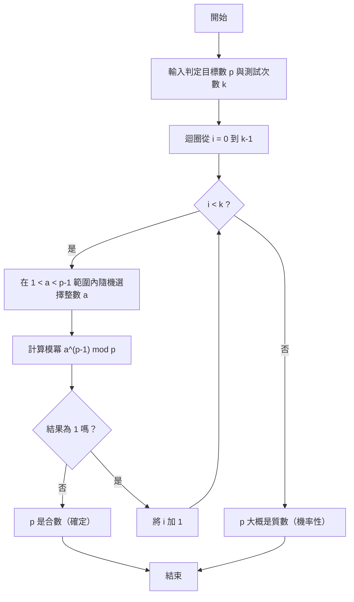
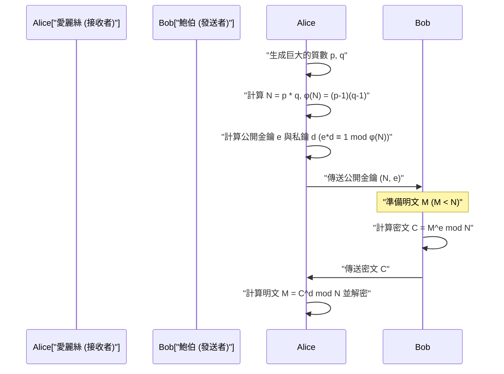

## 1. 簡介：支撐現代密碼學的數學奧秘

在現代數位社會，特別是透過網際網路進行通訊時，「加密」已成為不可或缺的基礎技術。我們能透過網頁瀏覽器經由 HTTPS 安全地瀏覽網站、在網路銀行進行金融交易，以及在通訊應用程式中進行私密對話，全是因為有高度數學理論支持的加密協定在背後運作。其中扮演特別重要角色的就是「公開金鑰加密」，而其代表正是 **RSA 加密**。

包含 RSA 加密在內的許多加密演算法，其安全性與正確性在很大程度上依賴於 17 世紀法國數學家皮耶·德·費馬（Pierre de Fermat）所發現的一個非常優美且強大的定理。這就是**費馬小定理（Fermat's Little Theorem）**。此外，將其一般化的李昂哈德·歐拉（Leonhard Euler）定理，在密碼學理論中也發揮了決定性的作用。

本篇文章將從基礎開始，徹底解說費馬小定理這個純數學的發現，是如何應用於現代實用的加密技術，特別是「質數判定」與「RSA 加密」。這是一份非常詳細的技術指南，內容涵蓋數學證明、加密與解密機制，以及使用 C++ 與 Python 進行具體演算法實作。

---

## 2. 同餘與模算數基礎

為了理解費馬小定理，首先必須熟悉「模算數（同餘式）」這個數學概念。模算數是一種著眼於除以某個固定數字（稱為模數）後的「餘數」之計算系統。因為它像時鐘的表面（每 12 小時繞一圈）一樣運算，所以也被稱為「時鐘數學」。

當整數 $a$ 和 $b$ 除以正整數 $n$ 的餘數相等時，數學上會以下列方式表示：

$$
a \equiv b \pmod n
$$

這讀作「在模 $n$ 之下，$a$ 與 $b$ 同餘」。例如，17 除以 5 的餘數是 2，而 12 除以 5 的餘數也是 2。因此，可以寫成如下形式：

$$
17 \equiv 12 \pmod 5 \equiv 2 \pmod 5
$$

在模算數中，一般的四則運算（加法、減法、乘法）可以直接成立：

1. **加法**: 若 $a \equiv b \pmod n$ 且 $c \equiv d \pmod n$，則 $a + c \equiv b + d \pmod n$
2. **減法**: 若 $a \equiv b \pmod n$ 且 $c \equiv d \pmod n$，則 $a - c \equiv b - d \pmod n$
3. **乘法**: 若 $a \equiv b \pmod n$ 且 $c \equiv d \pmod n$，則 $a \times c \equiv b \times d \pmod n$
4. **指數**: 若 $a \equiv b \pmod n$，則對於任意自然數 $k$，$a^k \equiv b^k \pmod n$ 成立

不過，關於**除法**必須特別注意。一般來說，即使 $a \times c \equiv b \times c \pmod n$，也不能直接將兩邊除以 $c$ 得出 $a \equiv b \pmod n$。這只有在 $c$ 和 $n$ 互質（最大公因數為 1）的情況下才成立。這個「模反元素（模逆元）」的概念，在後文將提到的 RSA 加密金鑰生成中非常重要。

---

## 3. 費馬小定理的數學背景與證明

掌握了模算數的基礎後，讓我們來看看本篇的主題——費馬小定理。

### 3.1 定理的定義

費馬小定理可以表述如下：

> **費馬小定理 (Fermat's Little Theorem)**
> 設 $p$ 為質數，$a$ 為不是 $p$ 的倍數（即 $a$ 與 $p$ 互質）的任意整數。此時，以下同餘式成立：
> $$ a^{p-1} \equiv 1 \pmod p $$

此外，拿掉「$a$ 不是 $p$ 的倍數」的條件，將其表示為對所有整數 $a$ 都成立的形式也很常見。在這種情況下，兩邊同乘 $a$ 可得：

$$
a^p \equiv a \pmod p
$$

### 3.2 透過具體例子確認

為了確認定理是否真的成立，我們用具體的數字來驗證看看。
設質數 $p = 5$。則 $p-1 = 4$。我們選擇不是 $p$ 的倍數的整數作為 $a$。

- 當 $a = 2$ 時：$2^{5-1} = 2^4 = 16$。$16 \div 5 = 3$ 餘 $1$。因此 $16 \equiv 1 \pmod 5$。（成立）
- 當 $a = 3$ 時：$3^{5-1} = 3^4 = 81$。$81 \div 5 = 16$ 餘 $1$。因此 $81 \equiv 1 \pmod 5$。（成立）
- 當 $a = 4$ 時：$4^{5-1} = 4^4 = 256$。$256 \div 5 = 51$ 餘 $1$。因此 $256 \equiv 1 \pmod 5$。（成立）

就這樣，無論選擇什麼樣的 $a$（只要不是 5 的倍數），其 4 次方除以 5 的餘數必然為 1。看起來像魔法一樣，但這源自於質數所具備的優美性質。

### 3.3 定理的數學證明

為什麼會成立這樣的事實呢？這裡我們介紹一個使用剩餘系集合的優雅證明。

考慮集合 $S = \{1, 2, 3, \dots, p-1\}$。這些是除以 $p$ 後餘數為 $1$ 到 $p-1$ 的整數代表元素。
現在，我們將各個元素乘上與 $p$ 互質的整數 $a$，得到一個新集合 $T$：
$$ T = \{1a, 2a, 3a, \dots, (p-1)a\} $$

我們考慮這個集合 $T$ 中的各個元素除以 $p$ 的餘數。令人驚訝的是，這些餘數雖然順序可能改變，但與原來集合 $S$ 的元素集合完全一致。
因為：
1. $T$ 的元素不會是 $p$ 的倍數（因為 $a$ 和原本的元素都不是 $p$ 的倍數）。
2. 在 $T$ 之中，不存在兩個在模 $p$ 下同餘的不同元素。如果 $ia \equiv ja \pmod p$ （其中 $i \neq j$），因為 $a$ 和 $p$ 互質，我們可以除以 $a$，得到 $i \equiv j \pmod p$，這就產生了矛盾。

因此，將 $S$ 的所有元素相乘的結果，與將 $T$ 的所有元素相乘的結果，在模 $p$ 之下是同餘的。

$$
(1a) \times (2a) \times \dots \times ((p-1)a) \equiv 1 \times 2 \times \dots \times (p-1) \pmod p
$$

將左邊整理，因為有 $p-1$ 個 $a$，所以：

$$
a^{p-1} \cdot (p-1)! \equiv (p-1)! \pmod p
$$

因為 $(p-1)!$ 與 $p$ 互質，所以兩邊可以除以 $(p-1)!$，最終導出以下定理：

$$
a^{p-1} \equiv 1 \pmod p
$$

這就是費馬小定理的證明。

---

## 4. 歐拉函數與歐拉定理

費馬小定理是關於「質數 $p$」的定理，而將其推廣至「任意正整數 $n$」的人，就是李昂哈德·歐拉。為了理解 RSA 加密，這個推廣是不可或缺的。

### 4.1 歐拉函數 $\phi(n)$

歐拉函數（或稱歐拉 $\phi$ 函數） $\phi(n)$ 是一個表示「在 $1$ 到 $n$ 的整數中，與 $n$ 互質的數字個數」的函數。

- 當為質數 $p$ 時，由於 $1$ 到 $p-1$ 的所有整數都與 $p$ 互質，因此 $\phi(p) = p - 1$。
- 對於兩個相異質數 $p, q$，其乘積 $n = p \times q$ 的情況，$\phi(n)$ 可以用非常簡單的算式求出：
  $$ \phi(p \times q) = \phi(p) \times \phi(q) = (p - 1)(q - 1) $$

這個性質，正是 RSA 加密金鑰生成的根本邏輯。

### 4.2 歐拉定理

歐拉將費馬小定理推廣如下：

> **歐拉定理 (Euler's Theorem)**
> 對於正整數 $n$ 以及與其互質的整數 $a$，以下關係成立：
> $$ a^{\phi(n)} \equiv 1 \pmod n $$

如果 $n$ 是質數 $p$，則 $\phi(p) = p - 1$，這就變成了費馬小定理本身（$a^{p-1} \equiv 1 \pmod p$）。也就是說，費馬小定理只不過是歐拉定理的一個特例。

---

## 5. 尋找巨大的質數：費馬質數判定法

在加密技術（如 RSA 加密與 Diffie-Hellman 金鑰交換等）中，必須能高速找出長達數百位數的「巨大質數」。然而，如果要判定一個巨大數字 $N$ 是否為質數，若使用測試除以從 $2$ 到 $\sqrt{N}$ 的所有數字是否能整除的「試除法」，將會花費等同於宇宙壽命般漫長的時間。

因此，反過來利用費馬小定理的「機率性質數判定法」，即 **費馬質數判定法（Fermat Primality Test）** 便應運而生。

### 5.1 什麼是機率性質數判定法

根據費馬小定理，若 $p$ 為質數，則對於任意的 $a$ ($1 < a < p$)，$a^{p-1} \equiv 1 \pmod p$ 必然成立。
取其逆否命題，可以說「如果對於某個 $a$，得出 $a^{p-1} \not\equiv 1 \pmod p$，那麼 $p$ **絕對不是質數（是合數）**」。

因此，如果想判定 $N$ 是否為質數，隨機選擇幾個 $a$，計算 $a^{N-1} \pmod N$ 並確認結果是否為 $1$。如果只要有一次得出 $1$ 以外的答案，就可以確定 $N$ 是合數。如果試了多次結果都是 $1$，則可以高度機率地判斷 $N$ 「大概是質數」。

### 5.2 演算法解說與流程圖

費馬質數判定法的演算法如下。



### 5.3 卡邁克爾數（偽質數）的陷阱

費馬質數判定法雖然非常快速，但有一個重大的缺點。那就是存在著像惡魔一般的數字，明明是合數，卻對所有的 $a$ 都滿足 $a^{N-1} \equiv 1 \pmod N$。這被稱為 **卡邁克爾數 (Carmichael numbers)**。最小的卡邁克爾數是 $561$ ($3 \times 11 \times 17$)。

由於卡邁克爾數的存在，單純的費馬測試無法進行絕對的質數判定。因此，在實際的加密系統（如 OpenSSL 等）中，標準使用的是改良自費馬測試的 **米勒-拉賓（Miller-Rabin）質數判定法**。因為米勒-拉賓判定法能看穿卡邁克爾數，可將誤判的機率實質上降至零。

### 5.4 高速的模冪運算（反覆平方法）

在質數判定演算法中，需要計算 $a^{N-1} \pmod N$，但當 $N$ 巨大時，$a^{N-1}$ 將成為天文數字級別的位數，無法裝入電腦的記憶體中。
解決這個問題的是 **反覆平方法（Exponentiation by Squaring）** 或模冪運算。透過在計算的每一個步驟都取餘數（mod N），可以讓數值始終保持小於 $N$，從而能非常高速（計算複雜度為 $O(\log N)$）地進行計算。

---

## 6. 質數判定與模冪運算的實作

那麼，我們就來使用 C++ 和 Python 實作費馬質數判定法和反覆平方法吧。

### 6.1 使用 C++ 實作

在 C++ 中，標準整數型別容易發生溢位，處理巨大數字時需要多精度整數函式庫（如 GMP 等）。不過，為了理解演算法，這裡展示在 64 位元整數（`unsigned long long`）範圍內的實作。

```cpp
#include <iostream>
#include <random>

using namespace std;

// 高速的模冪運算 (a^b mod m) - 反覆平方法
unsigned long long power_mod(unsigned long long a, unsigned long long b, unsigned long long m) {
    unsigned long long result = 1;
    a = a % m;
    while (b > 0) {
        // 若 b 的最低位元為 1，則將 result 乘上 a
        if (b % 2 == 1) {
            result = (__int128)result * a % m; // 為防止溢位擴展為 128bit
        }
        // 將 a 平方
        a = (__int128)a * a % m;
        // 將 b 右移（減半）
        b /= 2;
    }
    return result;
}

// 費馬質數判定法
bool fermat_is_prime(unsigned long long p, int iterations = 5) {
    if (p <= 1) return false;
    if (p <= 3) return true;
    if (p % 2 == 0) return false;

    random_device rd;
    mt19937_64 gen(rd());
    uniform_int_distribution<unsigned long long> dis(2, p - 2);

    for (int i = 0; i < iterations; ++i) {
        unsigned long long a = dis(gen);
        // 若 a^(p-1) mod p 不為 1，則是合數
        if (power_mod(a, p - 1, p) != 1) {
            return false;
        }
    }
    return true; // 大概是質數
}

int main() {
    unsigned long long num = 1000000007; // 已知的質數
    if (fermat_is_prime(num, 10)) {
        cout << num << " is probably prime." << endl;
    } else {
        cout << num << " is composite." << endl;
    }
    return 0;
}
```

### 6.2 使用 Python 實作

Python 的標準整數型別支援多精度整數，因此不需擔心位數溢位。此外，Python 的內建函數 `pow(a, b, m)` 內部就使用了反覆平方法，因此非常快速。

```python
import random

def fermat_is_prime(p, iterations=5):
    """
    使用費馬質數判定法的機率性質數判定
    """
    if p <= 1:
        return False
    if p <= 3:
        return True
    if p % 2 == 0:
        return False

    for _ in range(iterations):
        # 在 2 到 p-2 之間隨機選擇一個數字 a
        a = random.randint(2, p - 2)
        # 計算 a^(p-1) mod p。內建的 pow 很快速。
        if pow(a, p - 1, p) != 1:
            return False # 確定是合數

    return True # 大概是質數

# 測試
number_to_test = 104729
if fermat_is_prime(number_to_test, 10):
    print(f"{number_to_test} 大概是質數。")
else:
    print(f"{number_to_test} 是合數。")
```

---

## 7. 在 RSA 加密中的應用：費馬與歐拉結果的地方

費馬小定理（以及歐拉定理）最偉大的應用領域，就是 1977 年由 Rivest、Shamir 與 Adleman 三人所開發的 **RSA 加密**。
RSA 加密是一個名為「公開金鑰加密」的劃時代系統，它實現了一種機制：用來加密的金鑰（公開金鑰）對全世界公開，但用來解密的金鑰（私鑰）只有接收者本人知道。

這種不對稱性，是基於「將巨大的合數進行質因數分解是極度困難的」這一計算複雜度上的安全性。

### 7.1 RSA 加密的機制（金鑰生成、加密、解密）

讓我們透過 Mermaid 的循序圖來確認 RSA 加密的整體通訊流程。



以下解說數學上的詳細步驟。

#### 步驟 1：金鑰的生成（接收者愛麗絲的作業）

1. 隨機生成兩個巨大的質數 $p$ 與 $q$（這裡會用到前述的質數判定法）。
2. 計算其乘積 $N = p \times q$。這個 $N$ 會被公開。
3. 使用歐拉函數，計算 $\phi(N) = (p-1)(q-1)$。
4. 選擇與 $\phi(N)$ 互質的整數 $e$（公開指數）（常使用 $e = 65537$）。
5. 計算 $e$ 的模反元素 $d$（私密指數）。亦即，找出滿足下式的 $d$：
   $$ e \cdot d \equiv 1 \pmod{\phi(N)} $$
   這個計算使用了**擴展歐幾里得演算法**。

至此，**公開金鑰為 $(N, e)$**，**私鑰為 $(N, d)$**。（$p, q, \phi(N)$ 會立即銷毀或嚴格保密）。

#### 步驟 2：加密（發送者鮑伯的作業）

假設鮑伯想發送訊息 $M$ 給愛麗絲（$M$ 是將文字轉換為數值後的結果，且 $0 \le M < N$）。
鮑伯使用愛麗絲的公開金鑰 $(N, e)$，進行以下計算製作密文 $C$：

$$
C \equiv M^e \pmod N
$$

透過網路將這個 $C$ 發送給愛麗絲。

#### 步驟 3：解密（接收者愛麗絲的作業）

收到密文 $C$ 的愛麗絲，使用只有自己知道的私鑰 $d$ 進行以下計算：

$$
M' \equiv C^d \pmod N
$$

令人驚奇的是，這個計算結果 $M'$ 會與原始訊息 $M$ 完全一致。

### 7.2 為什麼能解密？（數學證明）

在這裡，費馬小定理（歐拉定理）發揮了它的真正價值。為什麼 $C^d \pmod N$ 能變回 $M$ 呢？

我們將解密的式子展開。
因為 $C \equiv M^e \pmod N$，所以：
$$ C^d \equiv (M^e)^d \equiv M^{ed} \pmod N $$

在金鑰生成的步驟中，我們選擇了 $d$ 使得 $e \cdot d \equiv 1 \pmod{\phi(N)}$。這意味著存在某個整數 $k$，可以寫成如下形式：
$$ e \cdot d = 1 + k \cdot \phi(N) $$

將其代入上面的式子：
$$ M^{ed} = M^{1 + k \cdot \phi(N)} = M \cdot M^{k \cdot \phi(N)} = M \cdot (M^{\phi(N)})^k \pmod N $$

在這裡**歐拉定理** ($M^{\phi(N)} \equiv 1 \pmod N$) 登場了。（※嚴格來說，$M$ 和 $N$ 必須互質，但在 RSA 中 $M$ 和 $N$ 不互質的機率是天文數字級別地低，且透過中國剩餘定理可以證明即使不互質也成立）。

應用歐拉定理，$M^{\phi(N)} \equiv 1$，因此：
$$ M \cdot (1)^k \equiv M \pmod N $$

完美地還原了 $M$！費馬與歐拉在幾百年前發現的數之性質，完美地保證了現代數位通訊的機密性。

---

## 8. RSA 加密的簡易實作 (Python)

因為只有理論較難體會，所以我們用 Python 來實際實作 RSA 加密的金鑰生成、加密、解密的過程吧。這是一個供教育用途的「簡易（玩具）實作」，但所使用的數學與真實情況完全相同。

用來求得模反元素 $d$ 的「擴展歐幾里得演算法」也包含在實作中。

```python
import random

# 求最大公因數
def gcd(a, b):
    while b != 0:
        a, b = b, a % b
    return a

# 擴展歐幾里得演算法 (求得 ax + by = gcd(a,b) 的 x, y)
# 用於尋找 e*d ≡ 1 (mod φ(N)) 中的 d
def extended_gcd(a, b):
    if a == 0:
        return (b, 0, 1)
    else:
        g, y, x = extended_gcd(b % a, a)
        return (g, x - (b // a) * y, y)

def mod_inverse(e, phi):
    g, x, y = extended_gcd(e, phi)
    if g != 1:
        raise Exception('不存在反元素')
    else:
        return x % phi

# 質數生成函數（簡易版：生成小質數）
def generate_prime(bits):
    while True:
        p = random.getrandbits(bits)
        # 用簡單判定來代替前述的費馬測試
        if p > 1 and pow(2, p-1, p) == 1 and pow(3, p-1, p) == 1:
            return p

# RSA 金鑰生成
def generate_keypair(bits=16):
    p = generate_prime(bits)
    q = generate_prime(bits)
    # 避免 p 和 q 變成一樣
    while p == q:
        q = generate_prime(bits)

    n = p * q
    phi = (p - 1) * (q - 1)

    # e 常使用 65537 等質數，但這裡隨機選擇
    e = random.randrange(1, phi)
    g = gcd(e, phi)
    while g != 1:
        e = random.randrange(1, phi)
        g = gcd(e, phi)

    # 私鑰 d 的計算
    d = mod_inverse(e, phi)
    
    # 公開金鑰 (e, n), 私鑰 (d, n)
    return ((e, n), (d, n))

def encrypt(pk, plaintext):
    e, n = pk
    # 計算 plaintext^e mod n
    cipher = [pow(ord(char), e, n) for char in plaintext]
    return cipher

def decrypt(sk, ciphertext):
    d, n = sk
    # 計算 cipher^d mod n，並轉回字元
    plain = [chr(pow(char, d, n)) for char in ciphertext]
    return ''.join(plain)

# 執行範例
if __name__ == '__main__':
    print("--- RSA加密 簡易實作 ---")
    public_key, private_key = generate_keypair(bits=12) # 使用 12bit 的質數
    
    print(f"公開金鑰 (e, n): {public_key}")
    print(f"私鑰 (d, n): {private_key}")

    message = "Hello Math!"
    print(f"\n原始訊息: {message}")

    # 加密
    encrypted_msg = encrypt(public_key, message)
    print(f"密文: {encrypted_msg}")

    # 解密
    decrypted_msg = decrypt(private_key, encrypted_msg)
    print(f"解密後的訊息: {decrypted_msg}")
```

執行這段程式碼後，就可以確認字元陣列如何被轉換成不眼熟的數字陣列（密文），然後再透過私鑰完美還原為原始字串的過程。

---

## 9. 結語：數學之美與實用性的交會點

在 17 世紀，當皮耶·德·費馬發現這個「小定理」時，沒有人認為這會有什麼實際用途。費馬本人也是出於純粹的數學探求心在進行數論的研究。

然而，大約 300 年後的 1970 年代，在電腦網路的黎明期，作為確立安全通訊協定不可或缺的加密技術，費馬定理實現了戲劇性的復活。基於費馬小定理的質數判定技術，以及基於歐拉定理的 RSA 加密，字面上支撐著現代的網際網路基礎設施。

我們每天不經意發送的 LINE 訊息、在 Amazon 上的購物，全都是在這個 $a^{p-1} \equiv 1 \pmod p$ 簡單而優美的數學公式之上舞動著的。費馬小定理告訴我們，無論數學多麼抽象，總有一天必定會派上用場。

在學習程式設計或密碼學理論時，理解其基礎的數學結構，將會成為深入理解那些被當作黑盒子般提供的函式庫運作方式，並設計出更安全系統的一大武器。
