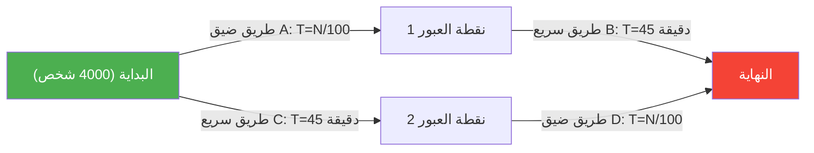
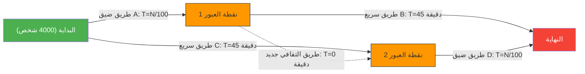

صباح مليء بالازدحام المروري خلال أوقات الذروة. بينما تشعر بالإحباط من الطرق المزدحمة يوميًا، تصلك أخبار سارة.
"للتخلص من الازدحام المروري، قامت إدارة التخطيط الحضري ببناء **طريق مختصر جديد تمامًا**!"
من المؤكد أن الجميع توقعوا أنه بإمكانهم النوم لفترة أطول قليلاً ابتداءً من الغد.

ولكن في اليوم التالي، عندما تم افتتاح الطريق الجديد، بدلاً من أن تتحسن الأمور، تسبب في **ازدحام مروري أسوأ من ذي قبل**، وأصبح وقت التنقل للجميع أطول.

هذه ليست أسطورة حضرية أو قصة فشل إداري. إنها ظاهرة شهيرة في نظرية الشبكات تُعرف باسم **"مفارقة براس (Braess's Paradox)"**، والتي أثبتها رياضيًا عالم الرياضيات الألماني ديتريش براس عام 1968.

## نموذج المفارقة: 4,000 مسافر

دعونا نتحقق من خلال نموذج رياضي بسيط من سبب حدوث ظاهرة "زيادة عدد الطرق تؤدي إلى إبطاء الجميع".

يوجد 4,000 سائق يتجهون من نقطة البداية (المنطقة السكنية) إلى نقطة النهاية (المنطقة التجارية).
في البداية، لم يكن هناك سوى طريقين (الطريق العلوي والطريق السفلي) كما هو موضح أدناه:

- **الطريق العلوي**: يمر عبر طريق ضيق $A$، ثم يمر عبر طريق سريع واسع $B$.
- **الطريق السفلي**: يمر عبر طريق سريع واسع $C$، ثم يمر عبر طريق ضيق $D$.

"الطريق الضيق" يزدحم عندما يزداد عدد السيارات، لذا فإن وقت الرحلة يستغرق "عدد السيارات التي تسير $\div 100$" دقيقة.
"الطريق السريع الواسع" لا يزدحم مهما كان عدد السيارات القادمة، ويستغرق دائمًا "45 دقيقة".

### وقت التنقل 【قبل بناء الطريق】

السائقون أذكياء، لذا يحاولون اختيار المسار الأسرع ولو بقليل. ونتيجة لذلك، ينقسم الـ 4,000 شخص بالتساوي بين الطريق العلوي (2,000 شخص) والطريق السفلي (2,000 شخص).

- **وقت التنقل للطريق العلوي**: $\frac{2000}{100}$ دقيقة (طريق ضيق) + $45$ دقيقة (طريق سريع) = **$65$ دقيقة**
- **وقت التنقل للطريق السفلي**: $45$ دقيقة (طريق سريع) + $\frac{2000}{100}$ دقيقة (طريق ضيق) = **$65$ دقيقة**

بغض النظر عن الطريق الذي يختارونه، يستقر وقت التنقل عند "65 دقيقة" للجميع.

## فخ الطريق المختصر

هنا، لنفترض أن العمدة قام ببناء **"طريق التفافي فائق السرعة للحلم يمكن التنقل فيه في 0 دقيقة (لحظة واحدة)"** من نقطة العبور 1 إلى نقطة العبور 2.

حصل السائقون على خيار مسار جديد.
يفكر السائق الذي يقف عند نقطة البداية على النحو التالي:
"استخدام الطريق الضيق A أفضل من استخدام الطريق السريع C (45 دقيقة). لأنه حتى في أسوأ الحالات، إذا اختار جميع الـ 4000 شخص الطريق A، فسيستغرق الأمر 40 دقيقة فقط (4000/100)."

وبالتالي، **يتجه جميع الـ 4,000 شخص إلى "الطريق الضيق A"**.
عندما يصلون إلى نقطة العبور 1، يفكرون مرة أخرى:
"المرور عبر الطريق الالتفافي الجديد (0 دقيقة) واستخدام الطريق الضيق D أفضل من استخدام الطريق السريع B (45 دقيقة). لأنه حتى في أسوأ الحالات، إذا مر الجميع عبر D، فسيستغرق الأمر 40 دقيقة فقط."

وبالتالي، **يتجه جميع الـ 4,000 شخص عبر "الطريق الالتفافي الجديد" إلى "الطريق الضيق D"**.

### وقت التنقل 【بعد بناء الطريق】

نتيجة اختيار الجميع لـ "الخيار الأسرع (العقلاني) بالنسبة لهم"، انتهى الأمر بالجميع إلى اتخاذ نفس المسار (A → طريق التفافي جديد → D).

دعونا نحسب وقت التنقل لذلك:
- الطريق الضيق $A$: $\frac{4000}{100} = 40$ دقيقة
- طريق التفافي جديد: $0$ دقيقة
- الطريق الضيق $D$: $\frac{4000}{100} = 40$ دقيقة
- **الإجمالي: $80$ دقيقة**

بشكل مذهل، على الرغم من إنشاء طريق مختصر جديد ومريح، إلا أن وقت التنقل للجميع **تدهور من "65 دقيقة" إلى "80 دقيقة"**.

قد تفكر: "لماذا لا يستخدم ولو شخص واحد المسار القديم؟"، ولكن إذا اختار شخص واحد مسار الطريق السريع القديم (45 دقيقة + 40 دقيقة = 85 دقيقة)، فسيكون أبطأ من الـ 80 دقيقة الحالية، لذلك لن يحاول أحد تغيير مساره.
يُطلق على هذا في نظرية الألعاب اسم الوصول إلى **"توازن ناش (Nash Equilibrium)"**. نتيجة لاتخاذ كل شخص للإجراء الأمثل بالنسبة له، يقع النظام ككل في أسوأ نتيجة.

## أمثلة واقعية

مفارقة براس ليست مجرد نظرية مكتبية، بل تمت ملاحظتها مرارًا وتكرارًا في شبكات النقل الحضري وأنظمة الشبكات في العالم الحقيقي.

- **عام 1969 في شتوتغارت، ألمانيا**:
  تم بناء طرق جديدة لحل مشكلة الازدحام المروري، لكن الازدحام تفاقم. في النهاية، **تحسن تدفق حركة المرور عندما تم إغلاق ذلك الطريق الجديد**.
- **عام 1990 في نيويورك**:
  في حدث يوم الأرض، عندما تم إغلاق "الشارع 42"، الذي يعد بؤرة للازدحام، بالكامل، وخلافًا لتوقعات خبراء المرور، **تلاشى الازدحام بشكل كبير** في جميع أنحاء مانهاتن.
- **شبكات الاتصالات**:
  يمكن أن تحدث نفس الظاهرة في توجيه الإنترنت أو شبكات الكهرباء. فبمجرد إضافة كابل أو خط جديد، قد تتمركز حزم البيانات في "أقصر مسار يُعتقد أنه الأمثل"، مما قد يؤدي إلى تعطل الشبكة بالكامل.

تعبر مفارقة براس ببراعة عن معضلة المجتمعات المعقدة، حيث **"لا تؤدي بالضرورة مجموعة الخيارات الفردية العقلانية (الأنانية)" إلى "النتيجة المثلى للجميع"**. في بعض الأحيان، يمكن أن يكون "سلب الخيارات (الحرية)" في مصلحة الجميع.
