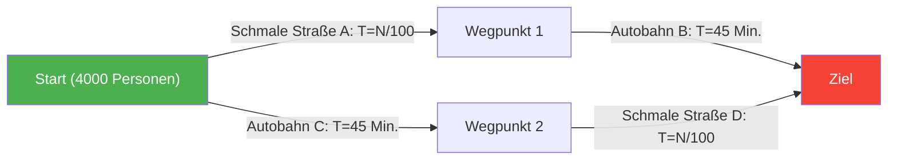
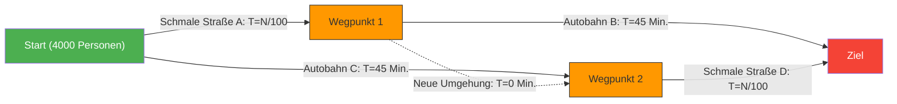

---
title: "Neue Straße gebaut, aber der Stau wird schlimmer? Das Braess-Paradoxon"
description: "Ein seltsames Paradoxon der Netzwerktheorie, bei dem der Bau einer neuen Umgehungsstraße zur Lösung von Verkehrsstaus paradoxerweise dazu führt, dass sich die Pendelzeit für alle verlängert."
date: 2026-09-10T21:00:00+09:00
draft: false
slug: "braess-paradox"
image: "img/braess_paradox.jpg"
math: true
mermaid: true
categories: ["Mathematisches Paradoxon", "Spieltheorie"]
tags: ["Paradoxon", "Netzwerk", "Verkehr", "Nash-Gleichgewicht", "Braess-Paradoxon"]
---

Der morgendliche Berufsverkehr. Während Sie jeden Tag vom Stau genervt sind, erreicht Sie eine gute Nachricht:
"Um die Staus zu verringern, hat die Stadtplanung eine **brandneue Abkürzung** gebaut!"
Jeder hätte wohl erwartet, dass man ab morgen ein wenig länger schlafen kann.

Aber als die neue Straße am nächsten Tag eröffnet wird, wird die Situation keineswegs besser, sondern führt zu einem **noch schlimmeren Stau als zuvor**, und die Pendelzeit verlängert sich für alle.

Dies ist keine urbane Legende oder das Versagen der Verwaltung. Es handelt sich um ein in der Netzwerktheorie bekanntes Phänomen, das 1968 vom deutschen Mathematiker Dietrich Braess mathematisch bewiesen wurde: das **"Braess-Paradoxon"**.

## Das Modell des Paradoxons: 4.000 Pendler

Lassen Sie uns anhand eines einfachen mathematischen Modells überprüfen, warum das Phänomen auftritt, dass "alle langsamer werden, obwohl es mehr Straßen gibt".

Es gibt 4.000 Autofahrer, die von einem Startpunkt (Wohngebiet) zu einem Zielpunkt (Geschäftsviertel) fahren.
Anfangs gab es nur zwei Routen (eine obere und eine untere Route) wie folgt:

- **Obere Route**: Führt über eine schmale Straße $A$ und danach über eine breite Autobahn $B$.
- **Untere Route**: Führt über eine breite Autobahn $C$ und danach über eine schmale Straße $D$.

Da die "schmale Straße" verstopft, wenn mehr Autos kommen, beträgt die benötigte Zeit "Anzahl der fahrenden Autos $\div 100$" Minuten.
Die "breite Autobahn" hat keinen Stau, egal wie viele Autos kommen, und dauert immer "45 Minuten".

### Benötigte Zeit 【Vor dem Straßenbau】

Da die Autofahrer klug sind, versuchen sie eine Route zu wählen, die auch nur ein bisschen schneller ist. Das Ergebnis ist, dass sich die 4.000 Personen gleichmäßig auf die obere Route (2.000 Personen) und die untere Route (2.000 Personen) verteilen.

- **Dauer der oberen Route**: $\frac{2000}{100}$ Min. (schmale Straße) + $45$ Min. (Autobahn) = **$65$ Min.**
- **Dauer der unteren Route**: $45$ Min. (Autobahn) + $\frac{2000}{100}$ Min. (schmale Straße) = **$65$ Min.**

Egal, welche Route sie wählen, die Zeit stabilisiert sich für alle auf "65 Minuten".

## Die Falle der Abkürzung

Nehmen wir nun an, der Bürgermeister baut einen **Traum von einer superschnellen Umgehungsstraße, die Wegpunkt 1 und Wegpunkt 2 in 0 Minuten (im Handumdrehen) verbindet**.

Die Fahrer haben nun eine neue Routenoption erhalten.
Ein Fahrer, der am Startpunkt steht, denkt wie folgt:
"Es ist besser, die schmale Straße A zu nehmen, als die Autobahn C (45 Minuten). Denn selbst im schlimmsten Fall, wenn alle 4.000 Personen A wählen, dauert es nur 40 Minuten (4000/100)."

Daher steuern **alle 4.000 Personen die "schmale Straße A" an**.
Wenn sie an Wegpunkt 1 ankommen, denken sie wieder:
"Es ist besser, über die neue Umgehung (0 Minuten) zur schmalen Straße D zu fahren, als die Autobahn B (45 Minuten) zu nutzen. Denn selbst wenn alle D nehmen, dauert es höchstens 40 Minuten."

Daher fahren **alle 4.000 Personen über die "neue Umgehung" zur "schmalen Straße D"**.

### Benötigte Zeit 【Nach dem Straßenbau】

Als Folge der Entscheidung jedes Einzelnen für die für ihn schnellste (rationale) Option nehmen alle dieselbe Route (A → neue Umgehung → D).

Lassen Sie uns diese Zeit berechnen.
- Schmale Straße $A$: $\frac{4000}{100} = 40$ Min.
- Neue Umgehung: $0$ Min.
- Schmale Straße $D$: $\frac{4000}{100} = 40$ Min.
- **Gesamt: $80$ Min.**

Überraschenderweise hat sich die Pendelzeit für alle trotz der neuen praktischen Abkürzung **von "65 Minuten" auf "80 Minuten" verschlechtert**.

Man könnte denken: "Warum benutzt nicht einfach eine Person den Schleichweg (die alte Route)?" Aber wenn eine Person die schnelle Route über den Schleichweg wählt (45 Min. + 40 Min. = 85 Min.), wäre sie noch langsamer als die jetzigen 80 Minuten, also wird niemand die Route ändern wollen.
In der Spieltheorie wird dies als Erreichen eines **"Nash-Gleichgewichts"** bezeichnet. Als Ergebnis davon, dass jeder für sich die optimale Entscheidung trifft, führt dies für das Kollektiv zum schlechtestmöglichen Ergebnis.

## Beispiele aus der realen Welt

Das Braess-Paradoxon ist nicht nur eine theoretische Spekulation am Schreibtisch, sondern wurde in realen städtischen Verkehrs- und Netzwerksystemen viele Male beobachtet.

- **1969 Stuttgart, Deutschland**:
  Um Staus zu reduzieren, wurden neue Straßen gebaut, aber der Stau verschlimmerte sich. Als diese neue Straße schließlich **gesperrt wurde, verbesserte sich der Verkehrsfluss**.
- **1990 New York**:
  Während einer Veranstaltung zum Earth Day wurde die "42. Straße", ein Brennpunkt für Staus, komplett gesperrt. Entgegen den Erwartungen von Verkehrsexperten **lösten sich die Staus in ganz Manhattan dramatisch auf**.
- **Kommunikationsnetzwerke**:
  Dasselbe Phänomen kann beim Routing im Internet oder in Stromnetzen auftreten. Sobald neue Kabel oder Leitungen hinzugefügt werden, können sich Datenpakete auf dem "scheinbar optimalen kürzesten Weg" konzentrieren und das gesamte Netzwerk zum Absturz bringen.

Das Braess-Paradoxon ist ein perfekter Ausdruck für das Dilemma komplexer sozialer Systeme, in denen **"die Ansammlung rationaler individueller Entscheidungen (Egoismus)" nicht immer "das beste Ergebnis für alle"** bringt. Manchmal kann "das Wegnehmen von Optionen (Freiheit)" im besten Interesse aller sein.
