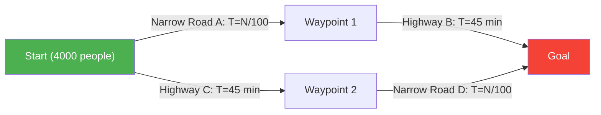
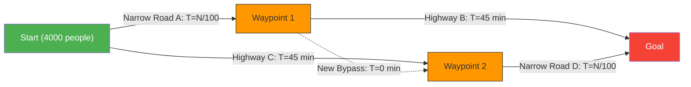

---
title: "Why did building a new road somehow make traffic worse?: Braess's Paradox"
description: "A bizarre paradox in network theory where building a new bypass to relieve traffic congestion ends up increasing the commute time for everyone."
date: 2026-09-10T21:00:00+09:00
draft: false
slug: "braess-paradox"
image: "img/braess_paradox.jpg"
math: true
mermaid: true
categories: ["Mathematical Paradox", "Game Theory"]
tags: ["Paradox", "Network", "Traffic", "Nash Equilibrium", "Braess's Paradox"]
---

Morning rush hour. You are frustrated by the roads that are jammed every day, but good news has arrived.
"To eliminate traffic congestion, the city planning department has built the **latest shortcut road**!"
Everyone must have hoped that they could sleep a little longer starting tomorrow.

However, the next day, when the new road opened, instead of making things better, it caused a **much worse traffic jam than before**, and everyone's commute time became longer.

This is not an urban legend or an administrative failure. It is a famous phenomenon in network theory called **"Braess's Paradox"**, which was mathematically proven by the German mathematician Dietrich Braess in 1968.

## The Paradox Model: 4,000 Commuters

Let's check with a simple mathematical model why the phenomenon of "everyone slowing down even though the number of roads has increased" occurs.

There are 4,000 drivers heading from the starting point (residential area) to the goal point (business district).
Initially, there were only two routes (upper route and lower route) as follows.

- **Upper Route**: Go through a narrow road $A$, and then through a wide highway $B$.
- **Lower Route**: Go through a wide highway $C$, and then through a narrow road $D$.

The "narrow road" gets congested as the number of cars increases, so the travel time takes "the number of running cars $\div 100$" minutes.
The "wide highway" never gets congested no matter how many cars come, and always takes "45 minutes".

### Travel Time [Before Road Construction]

The drivers are smart, so they try to choose a faster route even slightly. As a result, the 4,000 people are evenly divided into the upper route (2,000 people) and the lower route (2,000 people).

- **Upper Route Travel Time**: $\frac{2000}{100}$ minutes (narrow road) + $45$ minutes (highway) = **$65$ minutes**
- **Lower Route Travel Time**: $45$ minutes (highway) + $\frac{2000}{100}$ minutes (narrow road) = **$65$ minutes**

No matter which route is chosen, the travel time stabilizes at "65 minutes" for everyone.

## The Trap of the Shortcut Road

Now, suppose the mayor has built a "**dream ultra-high-speed bypass that allows you to travel from Waypoint 1 to Waypoint 2 in 0 minutes (instantly)**".

The drivers have gained a new route option.
A driver standing at the starting point thinks like this.
"It's better to use the narrow road A than to use the highway C (45 minutes). Because even at worst, if all 4,000 people chose A, it would only take 40 minutes (4000/100)."

Therefore, **all 4,000 people head to "Narrow Road A"**.
When they arrive at Waypoint 1, they think again.
"It's better to go through the new bypass (0 minutes) and use the narrow road D than to use the highway B (45 minutes). Because even if everyone goes through D, it's 40 minutes at worst."

Therefore, **all 4,000 people head to "Narrow Road D" through the "New Bypass"**.

### Travel Time [After Road Construction]

As a result of everyone making "the fastest (rational) choice for themselves", everyone ends up taking the same route (A → New Bypass → D).

Let's calculate the travel time.
- Narrow Road $A$: $\frac{4000}{100} = 40$ minutes
- New Bypass: $0$ minutes
- Narrow Road $D$: $\frac{4000}{100} = 40$ minutes
- **Total: $80$ minutes**

Surprisingly, despite the creation of a convenient new shortcut, everyone's commute time **worsened from "65 minutes" to "80 minutes"**.

You might think, "Why doesn't at least one person use the back road (the old route)?", but if one person chooses the old highway route (45 minutes + 40 minutes = 85 minutes), it will be even slower than the current 80 minutes, so no one tries to change their route.
In game theory, this is said to have reached a **"Nash Equilibrium"**. As a result of everyone taking the optimal action for themselves, it has fallen into the worst outcome as a whole.

## Real-world Examples

Braess's Paradox is not just an armchair theory; it has been observed multiple times in real-world urban traffic and network systems.

- **1969 Stuttgart, Germany**:
  A new road was built to relieve traffic congestion, but the congestion worsened. Eventually, when the new road was **closed off, traffic flow improved**.
- **1990 New York**:
  When "42nd Street", a mecca of traffic congestion, was completely closed off for an Earth Day event, contrary to the expectations of traffic experts, the overall congestion in Manhattan was **dramatically relieved**.
- **Communication Networks**:
  The same phenomenon can occur in internet routing and power grids. The moment a new cable or line is added, data packets can concentrate on the "perceived optimal shortest path", sometimes causing the entire network to go down.

Braess's Paradox beautifully illustrates the dilemma of complex societies: **"a collection of rational individual choices (egoism)" does not necessarily lead to "an optimal outcome for the whole"**. Sometimes, "taking away choices (freedom)" can be to the benefit of everyone.
