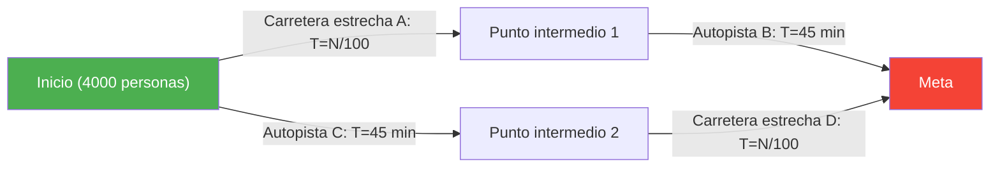
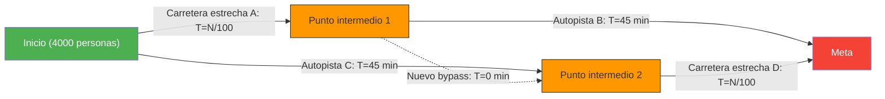

La hora punta de la mañana. Estás harto del tráfico diario cuando llegan buenas noticias:
"¡El departamento de planificación urbana ha construido **una nueva carretera de atajo de última generación** para resolver la congestión!"
Todos esperaban poder dormir un poco más a partir de mañana.

Sin embargo, al día siguiente, cuando la nueva carretera se abrió al público, lejos de mejorar, provocó **un embotellamiento aún peor que antes**, aumentando el tiempo de viaje de todos.

Esto no es una leyenda urbana ni un error administrativo. Es un fenómeno famoso de la teoría de redes llamado **"La paradoja de Braess (Braess's Paradox)"**, demostrado matemáticamente en 1968 por el matemático alemán Dietrich Braess.

## Modelo de la paradoja: 4.000 conductores

Veamos con un modelo matemático sencillo por qué ocurre el fenómeno de que "hay más carreteras pero todos tardan más".

Hay 4.000 conductores que se dirigen desde un punto de partida (zona residencial) hasta un punto de destino (distrito de oficinas).
Al principio, solo existían las siguientes 2 rutas (ruta superior y ruta inferior):

- **Ruta superior**: Se pasa por la carretera estrecha $A$ y luego por la autopista ancha $B$.
- **Ruta inferior**: Se pasa por la autopista ancha $C$ y luego por la carretera estrecha $D$.

Las "carreteras estrechas" se congestionan cuando aumentan los coches, por lo que el tiempo de recorrido es "número de coches $\div 100$" minutos.
Las "autopistas anchas" nunca se congestionan sin importar cuántos coches circulen, y siempre tardan "45 minutos".

### Tiempo de recorrido【antes de la construcción】

Los conductores son inteligentes e intentan elegir la ruta más rápida posible. Como resultado, los 4.000 se dividen equitativamente entre la ruta superior (2.000 personas) y la ruta inferior (2.000 personas).

- **Tiempo de la ruta superior**: $\frac{2000}{100}$ min (carretera estrecha) + $45$ min (autopista) = **$65$ minutos**
- **Tiempo de la ruta inferior**: $45$ min (autopista) + $\frac{2000}{100}$ min (carretera estrecha) = **$65$ minutos**

Independientemente de la ruta elegida, el tiempo de recorrido se estabiliza en "65 minutos" para todos.

## La trampa de la carretera de atajo

Ahora supongamos que el alcalde construye un **"bypass ultrarrápido de ensueño que permite ir del punto intermedio 1 al punto intermedio 2 en 0 minutos (instantáneamente)"**.

Los conductores ahora tienen una nueva opción de ruta.
Un conductor en el punto de partida piensa así:
"Es mejor usar la carretera estrecha A que la autopista C (45 min). Incluso en el peor caso, si las 4.000 personas eligen A, solo tardaría 40 minutos (4000/100)."

Por lo tanto, **las 4.000 personas se dirigen a la "carretera estrecha A"**.
Al llegar al punto intermedio 1, vuelven a pensar:
"Es mejor pasar por el nuevo bypass (0 min) y usar la carretera estrecha D que usar la autopista B (45 min). Incluso si todos pasan por D, solo tardaría 40 minutos."

Por lo tanto, **las 4.000 personas pasan por el "nuevo bypass" hacia la "carretera estrecha D"**.

### Tiempo de recorrido【después de la construcción】

Como resultado de que todos hicieron "la elección más rápida (racional) para sí mismos", todos terminaron tomando la misma ruta (A → nuevo bypass → D).

Calculemos el tiempo de recorrido:
- Carretera estrecha $A$: $\frac{4000}{100} = 40$ min
- Nuevo bypass: $0$ min
- Carretera estrecha $D$: $\frac{4000}{100} = 40$ min
- **Total: $80$ minutos**

Sorprendentemente, a pesar de la construcción de un cómodo nuevo atajo, el tiempo de viaje de todos **empeoró de "65 minutos" a "80 minutos"**.

Podrías pensar: "¿No podría al menos una persona usar la ruta antigua (por la autopista)?", pero si una persona elige la ruta por la autopista (45 min + 40 min = 85 min), tardaría aún más que los 80 minutos actuales, por lo que nadie quiere cambiar de ruta.
En teoría de juegos, esto se denomina haber alcanzado un **"equilibrio de Nash"**. Como resultado de que todos actuaron de manera óptima para sí mismos, el conjunto ha caído en el peor resultado posible.

## Ejemplos en el mundo real

La paradoja de Braess no es una mera teoría abstracta; ha sido observada repetidamente en el tráfico urbano real y en sistemas de redes.

- **1969, Stuttgart, Alemania**:
  Se construyó una nueva carretera para resolver la congestión del tráfico, pero la congestión empeoró. Finalmente, al **cerrar esa nueva carretera, el flujo del tráfico mejoró**.
- **1990, Nueva York**:
  Durante un evento del Día de la Tierra, se cerró por completo la "Calle 42", epicentro de la congestión. Contrariamente a las predicciones de los expertos en tráfico, **la congestión en todo Manhattan se redujo drásticamente**.
- **Redes de comunicación**:
  El mismo fenómeno puede ocurrir en el enrutamiento de Internet y en las redes eléctricas. Al añadir nuevos cables o líneas, los paquetes de datos se concentran en "la ruta más corta que parece óptima", lo que puede provocar la caída de toda la red.

La paradoja de Braess ilustra magistralmente el dilema de las sociedades complejas: **"la suma de las decisiones racionales individuales (egoísmo) no siempre conduce al resultado óptimo para el conjunto"**. A veces, "eliminar opciones (libertad)" puede beneficiar a todos.
