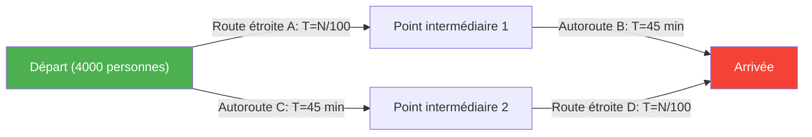
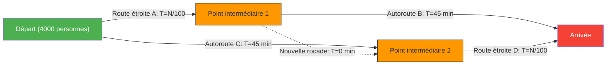

L'heure de pointe du matin. Alors que vous êtes frustré par les embouteillages quotidiens, une bonne nouvelle arrive.
« Pour réduire les embouteillages, le département d'urbanisme a construit un **tout nouveau raccourci** ! »
Tout le monde s'attendait à pouvoir dormir un peu plus longtemps à partir du lendemain.

Cependant, le jour suivant, lors de l'ouverture de la nouvelle route, loin d'améliorer la situation, elle a provoqué des **embouteillages encore pires qu'avant**, rallongeant le temps de trajet de tout le monde.

Il ne s'agit pas d'une légende urbaine ni d'un échec administratif. C'est un phénomène célèbre de la théorie des réseaux appelé **« paradoxe de Braess »**, prouvé mathématiquement en 1968 par le mathématicien allemand Dietrich Braess.

## Le modèle du paradoxe : 4 000 banlieusards

Voyons avec un modèle mathématique simple pourquoi ce phénomène de « plus de routes mais tout le monde est ralenti » se produit.

Il y a 4 000 conducteurs se rendant d'un point de départ (zone résidentielle) à un point d'arrivée (quartier d'affaires).
Au début, il n'y avait que deux itinéraires possibles (l'itinéraire du haut et celui du bas) :

- **Itinéraire du haut** : on prend la route étroite $A$, puis la grande autoroute $B$.
- **Itinéraire du bas** : on prend la grande autoroute $C$, puis la route étroite $D$.

Les « routes étroites » s'engorgent lorsqu'il y a plus de voitures, le temps de trajet est donc de « nombre de voitures en circulation $\div 100$ » minutes.
Les « grandes autoroutes » ne sont jamais embouteillées, peu importe le nombre de voitures, et le trajet prend toujours « 45 minutes ».

### Temps de trajet 【Avant la construction de la route】

Les conducteurs étant intelligents, ils essaient de choisir l'itinéraire le plus rapide. En conséquence, les 4 000 personnes se répartissent équitablement entre l'itinéraire du haut (2 000 personnes) et l'itinéraire du bas (2 000 personnes).

- **Temps de trajet de l'itinéraire du haut** : $\frac{2000}{100}$ min (route étroite) + $45$ min (autoroute) = **$65$ minutes**
- **Temps de trajet de l'itinéraire du bas** : $45$ min (autoroute) + $\frac{2000}{100}$ min (route étroite) = **$65$ minutes**

Quel que soit l'itinéraire choisi, le temps de trajet se stabilise à « 65 minutes » pour tout le monde.

## Le piège de la route de raccourci

Supposons maintenant que le maire construise **« une rocade ultra-rapide de rêve permettant de se déplacer du point intermédiaire 1 au point intermédiaire 2 en 0 minute (instantanément) »**.

Les conducteurs ont désormais une nouvelle option d'itinéraire.
Un conducteur se trouvant au point de départ pense ainsi :
« Il vaut mieux prendre la route étroite A plutôt que l'autoroute C (45 minutes). Même dans le pire des cas, si les 4 000 personnes choisissent A, cela ne prendra que 40 minutes (4000/100). »

Par conséquent, **les 4 000 personnes se dirigent vers la « route étroite A »**.
Arrivés au point intermédiaire 1, ils réfléchissent à nouveau :
« Il vaut mieux prendre la nouvelle rocade (0 minute) et utiliser la route étroite D plutôt que l'autoroute B (45 minutes). Même si tout le monde prend D, cela prendra au pire 40 minutes. »

Par conséquent, **les 4 000 personnes prennent la « nouvelle rocade » et se dirigent vers la « route étroite D »**.

### Temps de trajet 【Après la construction de la route】

Suite au choix par chacun de la « solution la plus rapide (et rationnelle) pour soi », tout le monde finit par emprunter le même itinéraire (A → Nouvelle rocade → D).

Calculons ce temps de trajet :
- Route étroite $A$ : $\frac{4000}{100} = 40$ min
- Nouvelle rocade : $0$ min
- Route étroite $D$ : $\frac{4000}{100} = 40$ min
- **Total : $80$ minutes**

Incroyablement, malgré l'ajout d'un nouveau raccourci pratique, le temps de trajet de tout le monde **s'est aggravé, passant de « 65 minutes » à « 80 minutes »**.

Vous pourriez penser : « Il suffit qu'une seule personne prenne l'ancienne route (l'ancien itinéraire) ». Mais si une personne choisit l'ancien itinéraire passant par l'autoroute (45 minutes + 40 minutes = 85 minutes), cela sera encore plus lent que les 80 minutes actuelles, donc personne ne veut changer d'itinéraire.
Dans la théorie des jeux, on dit que l'on a atteint un **« équilibre de Nash »**. Le fait que chacun prenne la décision optimale pour lui-même conduit au pire résultat pour l'ensemble.

## Exemples dans le monde réel

Le paradoxe de Braess n'est pas qu'une simple théorie abstraite ; il a été observé à de nombreuses reprises dans le trafic urbain et les systèmes de réseaux du monde réel.

- **1969, Stuttgart, Allemagne** :
  Une nouvelle route a été construite pour réduire les embouteillages, mais la circulation a empiré. Finalement, en **fermant cette nouvelle route, la fluidité du trafic s'est améliorée**.
- **1990, New York** :
  Lors de l'événement du Jour de la Terre, la « 42e rue », haut lieu des embouteillages, a été complètement fermée. Contrairement aux attentes des experts en circulation, les **embouteillages se sont considérablement résorbés** dans l'ensemble de Manhattan.
- **Réseaux de communication** :
  Le même phénomène peut se produire dans le routage Internet ou les réseaux électriques. Dès l'ajout d'un nouveau câble ou d'une nouvelle ligne, les paquets de données peuvent se concentrer sur ce qui semble être le « chemin le plus court et optimal », ce qui peut entraîner la panne de l'ensemble du réseau.

Le paradoxe de Braess illustre parfaitement le dilemme des sociétés complexes où **« l'ensemble des choix rationnels individuels (l'égoïsme) » ne conduit pas nécessairement à « un résultat optimal pour tous »**. Parfois, « retirer une option (une liberté) » peut s'avérer bénéfique pour le bien de tous.
