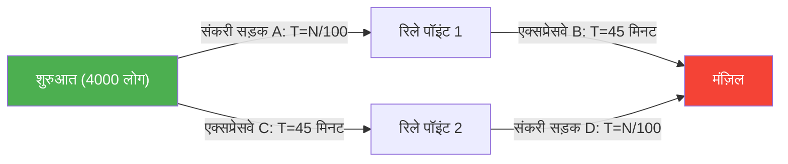
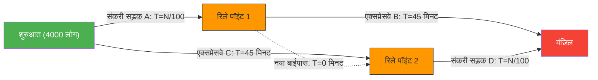

---
title: "एक नई सड़क बनाने से ट्रैफिक जाम और भी बदतर क्यों हो गया?: ब्रैस का पैराडॉक्स"
description: "नेटवर्क थ्योरी का एक अजीब पैराडॉक्स जहाँ ट्रैफिक जाम को हल करने के लिए एक नया बाईपास बनाने से हर किसी के आने-जाने का समय बढ़ जाता है।"
date: 2026-09-10T21:00:00+09:00
draft: false
slug: "braess-paradox"
image: "img/braess_paradox.jpg"
math: true
mermaid: true
categories: ["गणितीय पैराडॉक्स", "गेम थ्योरी"]
tags: ["पैराडॉक्स", "नेटवर्क", "ट्रैफिक", "नैश इक्विलिब्रियम", "ब्रैस का पैराडॉक्स"]
---

सुबह के समय काम पर जाने की जल्दी (रश आवर)। आपको एक खुशखबरी मिलती है, आप जो रोज़ ट्रैफिक जाम से परेशान हैं:
"ट्रैफिक जाम को कम करने के लिए, शहरी योजना विभाग ने एक **नया शॉर्टकट रास्ता** बनाया है!"
हर कोई यह उम्मीद करेगा कि कल से वे थोड़ी देर और सो सकेंगे।

लेकिन अगले दिन, जब नई सड़क खुलती है, तो चीजें बेहतर होने के बजाय **पहले से भी भयानक ट्रैफिक जाम** पैदा कर देती हैं, और सभी के आने-जाने का समय बढ़ जाता है।

यह कोई शहरी किंवदंती या प्रशासनिक विफलता नहीं है। 1968 में जर्मन गणितज्ञ डिट्रिच ब्रैस द्वारा गणितीय रूप से सिद्ध किया गया यह नेटवर्क थ्योरी में एक प्रसिद्ध घटना है जिसे **"ब्रैस का पैराडॉक्स (Braess's Paradox)"** कहा जाता है।

## पैराडॉक्स का मॉडल: 4,000 यात्री

आइए एक सरल गणितीय मॉडल के साथ देखें कि यह घटना क्यों घटित होती है जहाँ "सड़कें बढ़ने पर भी सभी की गति धीमी हो जाती है"।

मान लें कि 4,000 ड्राइवर शुरुआती बिंदु (घर के क्षेत्र) से अंतिम बिंदु (कार्यालय क्षेत्र) की ओर जा रहे हैं।
शुरुआत में, केवल 2 मार्ग (ऊपरी मार्ग और निचला मार्ग) उपलब्ध थे, जैसा कि नीचे दिखाया गया है:

- **ऊपरी मार्ग**: एक संकरी सड़क $A$ से होकर गुजरता है, और फिर एक चौड़े एक्सप्रेसवे $B$ से होकर गुजरता है।
- **निचला मार्ग**: एक चौड़े एक्सप्रेसवे $C$ से होकर गुजरता है, और फिर एक संकरी सड़क $D$ से होकर गुजरता है।

"संकरी सड़क" पर कारों की संख्या बढ़ने पर जाम लग जाता है, इसलिए लगने वाला समय "(कारों की संख्या $\div 100$)" मिनट होता है।
"चौड़े एक्सप्रेसवे" पर कितनी भी कारें आएं, जाम नहीं लगता और हमेशा "45 मिनट" लगते हैं।

### [सड़क निर्माण से पहले] लगने वाला समय

ड्राइवर स्मार्ट हैं, इसलिए वे थोड़ा भी तेज़ मार्ग चुनने की कोशिश करते हैं। परिणामस्वरूप, 4,000 लोग ऊपरी मार्ग (2,000 लोग) और निचले मार्ग (2,000 लोग) के बीच समान रूप से विभाजित हो जाते हैं।

- **ऊपरी मार्ग में लगने वाला समय**: $\frac{2000}{100}$ मिनट (संकरी सड़क) + $45$ मिनट (एक्सप्रेसवे) = **$65$ मिनट**
- **निचले मार्ग में लगने वाला समय**: $45$ मिनट (एक्सप्रेसवे) + $\frac{2000}{100}$ मिनट (संकरी सड़क) = **$65$ मिनट**

चाहे कोई भी मार्ग चुना जाए, सभी के लिए लगने वाला समय "65 मिनट" पर स्थिर रहता है।

## शॉर्टकट सड़क का जाल

अब, मान लीजिए कि मेयर ने "रिले पॉइंट 1 से रिले पॉइंट 2 तक **एक सपनों का सुपर हाई-स्पीड बाईपास** बनाया है जहाँ यात्रा का समय 0 मिनट (एक पल) है"।

ड्राइवरों को अब एक नया मार्ग विकल्प मिल गया है।
शुरुआती बिंदु पर खड़े ड्राइवर कुछ ऐसा सोचते हैं:
"एक्सप्रेसवे C (45 मिनट) का उपयोग करने से संकरी सड़क A का उपयोग करना बेहतर है। क्योंकि सबसे खराब स्थिति में भी, अगर सभी 4000 लोग A को चुनते हैं, तो भी यह केवल 40 मिनट (4000/100) ही लेगा।"

इसलिए, **सभी 4,000 लोग "संकरी सड़क A" की ओर बढ़ते हैं**।
रिले पॉइंट 1 पर पहुँचने पर, वे फिर सोचते हैं:
"एक्सप्रेसवे B (45 मिनट) का उपयोग करने से नए बाईपास (0 मिनट) से होकर संकरी सड़क D का उपयोग करना बेहतर है। क्योंकि सबसे खराब स्थिति में, अगर हर कोई D से गुजरता है, तो भी यह 40 मिनट ही लेगा।"

इसलिए, **सभी 4,000 लोग "नए बाईपास" से होकर "संकरी सड़क D" की ओर बढ़ते हैं**।

### [सड़क निर्माण के बाद] लगने वाला समय

हर किसी द्वारा "उनके लिए सबसे तेज़ (तर्कसंगत) विकल्प" चुनने के परिणामस्वरूप, सभी एक ही मार्ग (A → नया बाईपास → D) पर चलते हैं।

आइए इसके लिए लगने वाले समय की गणना करें।
- संकरी सड़क $A$: $\frac{4000}{100} = 40$ मिनट
- नया बाईपास: $0$ मिनट
- संकरी सड़क $D$: $\frac{4000}{100} = 40$ मिनट
- **कुल: $80$ मिनट**

हैरानी की बात है कि एक नया सुविधाजनक शॉर्टकट बनने के बावजूद, सभी का आने-जाने का समय **"65 मिनट" से बढ़कर "80 मिनट" हो गया**।

आप सोच सकते हैं, "क्या कोई एक व्यक्ति भी पुराने (पीछे के) मार्ग का उपयोग नहीं कर सकता?", लेकिन यदि एक व्यक्ति भी पुराने एक्सप्रेसवे मार्ग (45 मिनट + 40 मिनट = 85 मिनट) को चुनता है, तो यह वर्तमान 80 मिनट से भी अधिक धीमा होगा, इसलिए कोई भी मार्ग नहीं बदलता है।
गेम थ्योरी में इसे **"नैश इक्विलिब्रियम (Nash Equilibrium)"** तक पहुँचना कहा जाता है। अपने लिए सबसे इष्टतम कार्य चुनने वाले सभी लोगों का परिणाम, समग्र रूप से सबसे खराब परिणाम में बदल गया है।

## वास्तविक दुनिया में उदाहरण

ब्रैस का पैराडॉक्स केवल एक सैद्धांतिक विचार नहीं है, बल्कि इसे वास्तविक शहरी यातायात और नेटवर्क सिस्टम में कई बार देखा गया है।

- **1969 स्टटगार्ट, जर्मनी**:
  यातायात की भीड़ को कम करने के लिए एक नई सड़क का निर्माण किया गया, लेकिन भीड़ और भी बदतर हो गई। अंत में, जब नई सड़क को **बंद कर दिया गया, तो यातायात प्रवाह में सुधार हुआ**।
- **1990 न्यूयॉर्क**:
  पृथ्वी दिवस (Earth Day) के एक कार्यक्रम के लिए, जब 42वीं स्ट्रीट, जो कि ट्रैफिक जाम का केंद्र था, को पूरी तरह से बंद कर दिया गया, तो यातायात विशेषज्ञों की भविष्यवाणियों के विपरीत, पूरे मैनहट्टन में **ट्रैफिक जाम नाटकीय रूप से कम हो गया**।
- **संचार नेटवर्क**:
  यही घटना इंटरनेट रूटिंग और पावर ग्रिड में भी हो सकती है। एक नया केबल या लाइन जोड़े जाने के तुरंत बाद, डेटा पैकेट उस मार्ग पर केंद्रित हो जाते हैं जो "इष्टतम माना जाता है", और पूरा नेटवर्क डाउन हो सकता है।

ब्रैस का पैराडॉक्स शानदार ढंग से एक जटिल समाज की दुविधा को व्यक्त करता है: **"व्यक्तिगत तर्कसंगत विकल्पों (अहंकार) का संग्रह" हमेशा "समग्र रूप से इष्टतम परिणाम" नहीं लाता है**। कभी-कभी, "विकल्प (स्वतंत्रता) छीनना" भी सभी के लाभ में हो सकता है।
