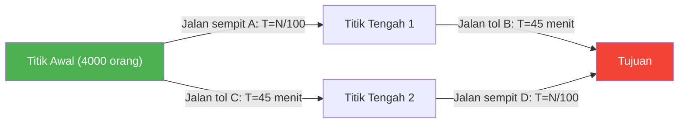
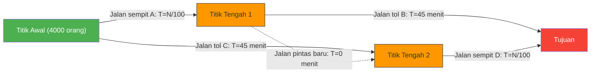

---
title: "Membangun Jalan Baru Malah Memperparah Kemacetan?: Paradoks Braess"
description: "Sebuah paradoks aneh dalam teori jaringan di mana membangun jalan pintas baru untuk mengatasi kemacetan lalu lintas justru mengakibatkan waktu komuter semua orang menjadi lebih lama."
date: 2026-09-10T21:00:00+09:00
draft: false
slug: "braess-paradox"
image: "img/braess_paradox.jpg"
math: true
mermaid: true
categories: ["Paradoks Matematika", "Teori Permainan"]
tags: ["Paradoks", "Jaringan", "Lalu Lintas", "Keseimbangan Nash", "Paradoks Braess"]
---

Jam sibuk komuter pagi hari. Kabar baik datang kepada Anda yang merasa frustrasi dengan jalanan yang macet setiap hari.
"Untuk mengurai kemacetan, departemen perencanaan kota telah membangun **jalan pintas terbaru**!"
Semua orang pasti berharap dengan ini mereka bisa tidur sedikit lebih lama mulai besok.

Namun keesokan harinya, saat jalan baru tersebut dibuka, alih-alih membaik, keadaan malah memicu **kemacetan lalu lintas yang lebih parah dari sebelumnya**, dan waktu perjalanan komuter semua orang menjadi lebih panjang.

Ini bukanlah legenda urban atau kisah kegagalan pemerintah. Ini adalah fenomena terkenal dalam teori jaringan yang dibuktikan secara matematis pada tahun 1968 oleh matematikawan Jerman Dietrich Braess, yang dikenal sebagai **"Paradoks Braess (Braess's Paradox)"**.

## Model Paradoks: 4.000 Komuter

Mari kita periksa dengan model matematika sederhana mengapa fenomena "jalan bertambah tetapi semua orang menjadi lebih lambat" bisa terjadi.

Ada 4.000 pengemudi yang menuju ke titik tujuan (kawasan perkantoran) dari titik awal (area perumahan).
Awalnya, hanya ada 2 rute berikut (rute atas dan rute bawah).

- **Rute Atas**: Melewati jalan sempit $A$, dan kemudian melewati jalan tol lebar $B$.
- **Rute Bawah**: Melewati jalan tol lebar $C$, dan kemudian melewati jalan sempit $D$.

Karena "jalan sempit" akan menjadi macet jika jumlah mobil bertambah, waktu yang dibutuhkan adalah "jumlah mobil yang berjalan $\div 100$" menit.
"Jalan tol lebar" tidak akan pernah macet tidak peduli berapa banyak mobil yang datang, dan selalu memakan waktu "45 menit".

### Waktu Tempuh [Sebelum Pembangunan Jalan]

Karena para pengemudi ini pintar, mereka akan mencoba memilih rute yang sedikit lebih cepat. Akibatnya, 4.000 orang terbagi rata ke rute atas (2.000 orang) dan rute bawah (2.000 orang).

- **Waktu tempuh rute atas**: $\frac{2000}{100}$ menit (jalan sempit) + $45$ menit (jalan tol) = **$65$ menit**
- **Waktu tempuh rute bawah**: $45$ menit (jalan tol) + $\frac{2000}{100}$ menit (jalan sempit) = **$65$ menit**

Rute mana pun yang dipilih, waktu tempuhnya stabil di angka "65 menit" untuk semua orang.

## Jebakan Jalan Pintas

Sekarang, misalkan wali kota membangun "**jalan pintas super cepat impian yang memungkinkan perpindahan dari Titik Tengah 1 ke Titik Tengah 2 dengan waktu tempuh 0 menit (sekejap)**".

Para pengemudi sekarang memiliki pilihan rute baru.
Pengemudi yang berdiri di titik awal akan berpikir:
"Daripada menggunakan jalan tol C (45 menit), lebih baik melewati jalan sempit A. Karena dalam skenario terburuk sekalipun, jika 4000 orang memilih A, itu hanya akan memakan waktu 40 menit (4000/100)."

Oleh karena itu, **ke-4.000 orang tersebut semuanya menuju ke "jalan sempit A"**.
Sesampainya di Titik Tengah 1, mereka kembali berpikir:
"Daripada menggunakan jalan tol B (45 menit), lebih baik melewati jalan pintas baru (0 menit) lalu menggunakan jalan sempit D. Karena paling buruk pun jika semua orang melewati D, itu hanya memakan waktu 40 menit."

Oleh karena itu, **ke-4.000 orang tersebut semuanya melewati "jalan pintas baru" dan menuju ke "jalan sempit D"**.

### Waktu Tempuh [Setelah Pembangunan Jalan]

Sebagai akibat dari semua orang membuat "pilihan tercepat (paling rasional) bagi diri mereka sendiri", semua orang akhirnya melewati rute yang sama (A → Jalan pintas baru → D).

Mari kita hitung waktu tempuhnya:
- Jalan sempit $A$: $\frac{4000}{100} = 40$ menit
- Jalan pintas baru: $0$ menit
- Jalan sempit $D$: $\frac{4000}{100} = 40$ menit
- **Total: $80$ menit**

Anehnya, meskipun telah dibangun jalan pintas baru yang nyaman, waktu komuter semua orang justru **memburuk dari "65 menit" menjadi "80 menit"**.

Anda mungkin berpikir, "Mengapa tidak salah satu saja menggunakan jalan belakang (rute lama)?" Namun, jika satu orang memilih rute jalan tol (45 menit + 40 menit = 85 menit), itu akan menjadi lebih lambat dari 80 menit saat ini, sehingga tidak ada yang bersedia mengubah rute.
Dalam teori permainan, ini disebut telah mencapai **"Keseimbangan Nash" (Nash Equilibrium)**. Akibat dari setiap orang mengambil tindakan terbaik untuk diri mereka sendiri, secara keseluruhan justru jatuh ke dalam hasil yang paling buruk.

## Contoh Nyata di Dunia Nyata

Paradoks Braess bukan sekadar teori di atas kertas semata, melainkan telah diamati berkali-kali dalam lalu lintas kota dan sistem jaringan di dunia nyata.

- **Tahun 1969, Stuttgart, Jerman**:
  Sebuah jalan baru dibangun untuk mengurai kemacetan lalu lintas, namun kemacetan justru semakin parah. Pada akhirnya, ketika jalan baru tersebut **ditutup, aliran lalu lintas menjadi membaik**.
- **Tahun 1990, New York**:
  Pada acara Hari Bumi, ketika "Jalan 42" yang merupakan pusat kemacetan ditutup sepenuhnya, bertentangan dengan prediksi para pakar lalu lintas, kemacetan di seluruh Manhattan secara dramatis **terurai**.
- **Jaringan Komunikasi**:
  Fenomena yang sama juga dapat terjadi pada perutean internet dan jaringan listrik. Segera setelah kabel atau jalur baru ditambahkan, paket data dapat menumpuk di "jalur terpendek yang dianggap optimal", yang terkadang menyebabkan gangguan pada seluruh jaringan.

Paradoks Braess dengan sangat baik menggambarkan dilema dalam masyarakat sistem yang kompleks, di mana **"kumpulan pilihan rasional (egoisme) individu" tidak selalu menghasilkan "hasil optimal secara keseluruhan"**. Terkadang, "mencabut pilihan (kebebasan)" justru dapat menguntungkan semua pihak.
