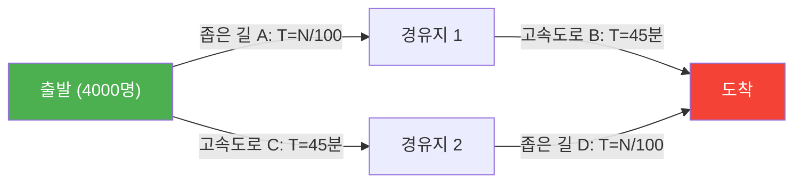
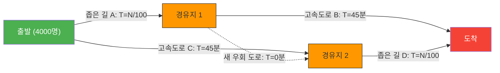

아침 출근길 러시. 매일 막히는 도로 때문에 짜증이 난 당신에게 희소식이 들려왔습니다.
"교통 체증 해소를 위해 도시 계획 부서에서 **최신 지름길(쇼트컷) 도로**를 건설했습니다!"
이걸로 내일부터는 조금 더 오래 잘 수 있겠다고 누구나 기대했을 것입니다.

하지만 다음 날, 새로운 도로가 개통되자 상황은 좋아지기는커녕 **예전보다 더 심한 대정체**를 일으켰고, 모두의 통근 시간이 길어지고 말았습니다.

이것은 도시 전설이나 행정의 실패담이 아닙니다. 1968년 독일의 수학자 디트리히 브라스에 의해 수학적으로 증명된, 네트워크 이론의 유명한 현상 **'브라스의 역설(Braess's Paradox)'**입니다.

## 역설의 모델: 4,000명의 통근자

왜 "길이 늘어났는데도 모두가 느려지는" 현상이 일어나는 것인지, 간단한 수학 모델로 확인해 봅시다.

출발 지점(자택 지역)에서 도착 지점(오피스 타운)으로 향하는 4,000명의 운전자가 있습니다.
처음에는 다음과 같은 2개의 경로(위쪽 경로・아래쪽 경로)밖에 없었습니다.

- **위쪽 경로**: 좁은 길 $A$를 지나고, 그 다음 넓은 고속도로 $B$를 통과한다.
- **아래쪽 경로**: 넓은 고속도로 $C$를 지나고, 그 다음 좁은 길 $D$를 통과한다.

'좁은 길'은 차가 늘어나면 막히기 때문에, 소요 시간은 '달리고 있는 차의 수 $\div 100$'분이 걸립니다.
'넓은 고속도로'는 차가 아무리 많이 와도 막히지 않으며, 항상 '45분'이 걸립니다.

### [도로 건설 전]의 소요 시간

운전자들은 똑똑하기 때문에, 조금이라도 더 빠른 경로를 선택하려고 합니다. 결과적으로 4,000명은 위쪽 경로(2,000명)와 아래쪽 경로(2,000명)로 균등하게 나뉩니다.

- **위쪽 경로의 소요 시간**: $\frac{2000}{100}$ 분(좁은 길) + $45$ 분(고속도로) = **$65$분**
- **아래쪽 경로의 소요 시간**: $45$ 분(고속도로) + $\frac{2000}{100}$ 분(좁은 길) = **$65$분**

어느 경로를 선택하든, 소요 시간은 모두 '65분'으로 안정됩니다.

## 지름길 도로의 함정

여기서 시장이 "경유지 1에서 경유지 2로, **소요 시간 0분(순식간)에 이동할 수 있는 꿈의 초고속 우회 도로(바이패스)**"를 건설했다고 가정해 봅시다.

운전자들은 새로운 경로의 선택지를 얻었습니다.
출발 지점에 선 운전자는 이렇게 생각합니다.
"고속도로 C(45분)를 이용하는 것보다, 좁은 길 A를 이용하는 편이 낫다. 최악의 경우 4,000명 전원이 A를 선택한다고 해도 40분(4000/100)이면 충분하기 때문이다."

따라서 **4,000명 전원이 '좁은 길 A'로 향합니다**.
경유지 1에 도착한 그들은 다시 생각합니다.
"고속도로 B(45분)를 이용하는 것보다, 새 우회 도로(0분)를 통과하여 좁은 길 D를 이용하는 편이 낫다. 최악의 경우 전원이 D를 통과하더라도 40분이기 때문이다."

따라서 **4,000명 전원이 '새 우회 도로'를 통과하여 '좁은 길 D'로 향합니다**.

### [도로 건설 후]의 소요 시간

모두가 '자신에게 가장 빠른(합리적인) 선택'을 한 결과, 전원이 같은 경로(A → 새 우회 도로 → D)를 통과하게 되었습니다.

그 소요 시간을 계산해 봅시다.
- 좁은 길 $A$: $\frac{4000}{100} = 40$분
- 새 우회 도로: $0$분
- 좁은 길 $D$: $\frac{4000}{100} = 40$분
- **합계: $80$분**

놀랍게도, 편리한 새로운 지름길이 생겼음에도 불구하고 모두의 통근 시간이 **'65분'에서 '80분'으로 악화**되고 말았습니다.

"누구 한 명이라도 뒷길(이전 경로)을 이용하면 되지 않느냐"고 생각할 수도 있지만, 만약 한 명이 뒷길인 고속도로 경로(45분+40분=85분)를 선택하면 지금의 80분보다 더욱 늦어지기 때문에 아무도 경로를 바꾸려 하지 않습니다.
이를 게임 이론에서는 **'내시 균형'**에 도달했다고 말합니다. 모두가 자신에게 최적인 행동을 취한 결과, 전체적으로는 최악의 결과에 빠져버린 것입니다.

## 현실 세계에서의 실제 사례

브라스의 역설은 단순한 탁상공론이 아니라, 현실의 도시 교통이나 네트워크 시스템에서 여러 번 관찰되고 있습니다.

- **1969년 독일 슈투트가르트**:
  교통 체증을 해소하기 위해 새로운 도로를 건설했지만 체증이 악화되었습니다. 결국 그 새로운 도로를 **폐쇄하자, 교통 흐름이 개선**되었습니다.
- **1990년 뉴욕**:
  지구의 날 행사로 체증의 메카인 '42번가'를 완전히 폐쇄하자, 교통 전문가의 예상과 달리 맨해튼 전체의 **교통 체증이 극적으로 해소**되었습니다.
- **통신 네트워크**:
  인터넷의 라우팅이나 전력망에서도 같은 현상이 일어날 수 있습니다. 새로운 케이블이나 회선을 추가하는 순간, 데이터 패킷이 '최적이라고 생각되는 최단 경로'에 집중되어 네트워크 전체가 다운되는 경우가 있습니다.

브라스의 역설은 **'개인의 합리적인 선택(이기주의)의 집합'이 반드시 '전체의 최적 결과'를 가져오는 것은 아니다**라는 복잡계 사회의 딜레마를 훌륭하게 표현하고 있습니다. 때로는 '선택지(자유)를 빼앗는 것'이 모두의 이익이 되는 경우도 있는 것입니다.
