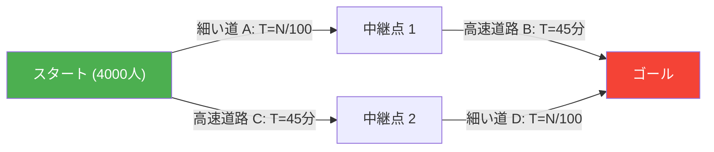
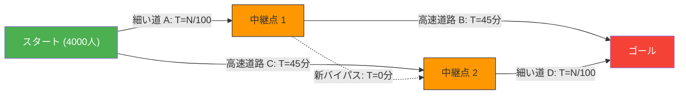

朝の通勤ラッシュ。毎日渋滞する道路にイライラしているあなたのもとに、朗報が届きました。
「渋滞解消のため、都市計画部門が**最新のショートカット道路**を建設しました！」
これで明日から少し長く眠れる、と誰もが期待したはずです。

しかし翌日、新しい道路がオープンすると、事態は良くなるどころか**前よりもひどい大渋滞**を引き起こし、全員の通勤時間が長くなってしまいました。

これは都市伝説や行政の失敗談ではありません。1968年にドイツの数学者ディートリッヒ・ブラスによって数学的に証明された、ネットワーク理論における有名な現象**「ブラスのパラドックス（Braess's Paradox）」**です。

## パラドックスのモデル：4,000人の通勤者

なぜ「道が増えたのに全員が遅くなる」現象が起こるのか、簡単な数学モデルで確認してみましょう。

スタート地点（自宅エリア）からゴール地点（オフィス街）に向かう4,000人のドライバーがいます。
最初は、以下のような2つのルート（上ルート・下ルート）しかありませんでした。

- **上ルート**：細い道 $A$ を通り、そのあと広い高速道路 $B$ を通る。
- **下ルート**：広い高速道路 $C$ を通り、そのあと細い道 $D$ を通る。

「細い道」は車が増えると渋滞するため、所要時間は「走っている車の数 $\div 100$」分かかります。
「広い高速道路」はどれだけ車が来ても渋滞せず、常に「45分」かかります。

### 【道路建設前】の所要時間

ドライバーたちは賢いので、少しでも早いルートを選ぼうとします。結果として、4,000人は上ルート（2,000人）と下ルート（2,000人）に均等に分かれます。

- **上ルートの所要時間**：$\frac{2000}{100}$ 分（細い道） + $45$ 分（高速） = **$65$分**
- **下ルートの所要時間**：$45$ 分（高速） + $\frac{2000}{100}$ 分（細い道） = **$65$分**

どちらのルートを選んでも、所要時間は全員「65分」で安定します。

## ショートカット道路の罠

ここで、市長が「中継点1から中継点2へ、**所要時間0分（一瞬）で移動できる夢の超高速バイパス**」を建設したとします。

ドライバーたちは新しいルートの選択肢を手に入れました。
スタート地点に立ったドライバーはこう考えます。
「高速道路C（45分）を使うより、細い道Aを使った方がマシだ。最悪でも4000人全員がAを選んだとして40分（4000/100）で済むからだ」

したがって、**4,000人全員が「細い道A」に向かいます**。
中継点1に着いた彼らは、また考えます。
「高速道路B（45分）を使うより、新バイパス（0分）を通って細い道Dを使った方がマシだ。最悪全員がDを通っても40分だからだ」

したがって、**4,000人全員が「新バイパス」を通って「細い道D」に向かいます**。

### 【道路建設後】の所要時間

全員が「自分にとって一番早い（合理的な）選択」をした結果、全員が同じルート（A → 新バイパス → D）を通ることになりました。

その所要時間を計算してみましょう。
- 細い道 $A$：$\frac{4000}{100} = 40$分
- 新バイパス：$0$分
- 細い道 $D$：$\frac{4000}{100} = 40$分
- **合計：$80$分**

なんと、便利な新しいショートカットができたにもかかわらず、全員の通勤時間が**「65分」から「80分」に悪化**してしまいました。

「誰か一人でも裏道を（旧ルート）を使えばいいじゃないか」と思うかもしれませんが、もし一人が裏道の高速ルート（45分+40分=85分）を選ぶと、今の80分よりもさらに遅くなってしまうため、誰もルートを変えようとはしません。
これをゲーム理論では**「ナッシュ均衡」**に達していると言います。全員が自分にとって最適な行動をとった結果、全体としては最悪の結果に陥ってしまっているのです。

## 現実世界での実例

ブラスのパラドックスは単なる机上の空論ではなく、現実の都市交通やネットワークシステムで何度も観察されています。

- **1969年 ドイツ・シュトゥットガルト**：
  交通渋滞を解消するために新しい道路を建設しましたが、渋滞が悪化。結局、その新しい道路を**封鎖したところ、交通の流れが改善**しました。
- **1990年 ニューヨーク**：
  アースデーのイベントで、渋滞のメッカである「42丁目」を完全に封鎖したところ、交通の専門家の予想に反して、マンハッタン全体の**渋滞が劇的に解消**しました。
- **通信ネットワーク**：
  インターネットのルーティングや電力網でも同じ現象が起こり得ます。新しいケーブルや回線を追加した途端に、データパケットが「最適だと思われる最短経路」に集中してしまい、ネットワーク全体がダウンすることがあります。

ブラスのパラドックスは、**「個人の合理的な選択（エゴイズム）の集合」が、必ずしも「全体の最適な結果」をもたらすとは限らない**という、複雑系社会のジレンマを見事に表現しています。時には、「選択肢（自由）を奪うこと」が、全員の利益になることもあるのです。
