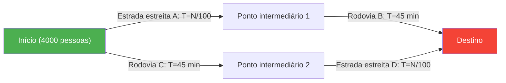
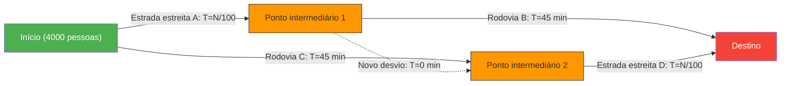

A hora do rush matinal. Enquanto você se irrita com as estradas congestionadas todos os dias, uma boa notícia chega:
"Para aliviar o trânsito, o departamento de planejamento urbano construiu uma **nova estrada de atalho**!"
Todos esperavam que, com isso, pudessem dormir um pouco mais a partir de amanhã.

No entanto, no dia seguinte, quando a nova estrada foi inaugurada, longe de melhorar a situação, ela causou um **congestionamento ainda pior do que antes**, aumentando o tempo de deslocamento de todos.

Isso não é uma lenda urbana ou uma história de fracasso administrativo. É um fenômeno famoso na teoria das redes chamado **"Paradoxo de Braess"**, provado matematicamente pelo matemático alemão Dietrich Braess em 1968.

## O Modelo do Paradoxo: 4.000 Passageiros

Vamos ver através de um modelo matemático simples por que o fenômeno "mais estradas tornam todos mais lentos" acontece.

Existem 4.000 motoristas indo de um ponto de partida (área residencial) para um destino (bairro comercial).
Inicialmente, havia apenas duas rotas, conforme mostrado abaixo (rota superior e rota inferior):

- **Rota Superior**: Passa pela estrada estreita $A$ e depois pela rodovia larga $B$.
- **Rota Inferior**: Passa pela rodovia larga $C$ e depois pela estrada estreita $D$.

Como a "estrada estreita" fica congestionada quando o número de carros aumenta, o tempo de viagem leva "o número de carros em trânsito $\div 100$" minutos.
A "rodovia larga" nunca fica congestionada, não importa quantos carros passem, e sempre leva "45 minutos".

### Tempo de Viagem [Antes da Construção da Estrada]

Como os motoristas são espertos, eles tentarão escolher a rota mais rápida possível. Como resultado, as 4.000 pessoas se dividirão igualmente entre a rota superior (2.000 pessoas) e a rota inferior (2.000 pessoas).

- **Tempo da rota superior**: $\frac{2000}{100}$ min (estrada estreita) + $45$ min (rodovia) = **$65$ minutos**
- **Tempo da rota inferior**: $45$ min (rodovia) + $\frac{2000}{100}$ min (estrada estreita) = **$65$ minutos**

Seja qual for a rota escolhida, o tempo de viagem para todos se estabiliza em "65 minutos".

## A Armadilha da Estrada de Atalho

Agora, suponha que o prefeito construiu um **desvio ultrarrápido dos sonhos que permite viajar do ponto intermediário 1 para o ponto intermediário 2 em 0 minutos (instantaneamente)**.

Os motoristas agora têm uma nova opção de rota.
Um motorista no ponto de partida pensa assim:
"Em vez de usar a rodovia C (45 minutos), é melhor usar a estrada estreita A. Na pior das hipóteses, mesmo se todas as 4.000 pessoas escolherem A, levará apenas 40 minutos (4000/100)."

Portanto, **todas as 4.000 pessoas vão para a "estrada estreita A"**.
Ao chegarem ao ponto intermediário 1, eles pensam de novo:
"Em vez de usar a rodovia B (45 minutos), é melhor pegar o novo desvio (0 minutos) e usar a estrada estreita D. Na pior das hipóteses, mesmo que todos passem por D, levará 40 minutos."

Portanto, **todas as 4.000 pessoas pegam o "novo desvio" em direção à "estrada estreita D"**.

### Tempo de Viagem [Após a Construção da Estrada]

Como resultado de todos fazerem a "escolha mais rápida (racional) para si mesmos", todos acabaram tomando a mesma rota (A → Novo desvio → D).

Vamos calcular esse tempo de viagem:
- Estrada estreita $A$: $\frac{4000}{100} = 40$ min
- Novo desvio: $0$ min
- Estrada estreita $D$: $\frac{4000}{100} = 40$ min
- **Total: $80$ minutos**

Incrivelmente, apesar da construção de um atalho novo e conveniente, o tempo de deslocamento de todos **piorou de "65 minutos" para "80 minutos"**.

Você pode pensar: "Alguém deveria apenas usar o caminho alternativo (a rota antiga)". No entanto, se uma pessoa escolhesse a rota da rodovia alternativa (45 min + 40 min = 85 min), ela seria ainda mais lenta que os atuais 80 minutos, de modo que ninguém tentará mudar de rota.

Na teoria dos jogos, isso é chamado de atingir um **"Equilíbrio de Nash"**. Como resultado de todos tomarem a melhor ação para si mesmos, como um todo, eles caíram no pior resultado possível.

## Exemplos no Mundo Real

O Paradoxo de Braess não é apenas uma teoria de gaveta; foi observado muitas vezes em tráfego urbano real e sistemas de redes.

- **1969, Stuttgart, Alemanha**:
  Eles construíram uma nova estrada para aliviar o congestionamento do tráfego, mas o congestionamento piorou. No final, quando eles **fecharam a nova estrada, o fluxo de tráfego melhorou**.
- **1990, Nova Iorque**:
  No evento do Dia da Terra, quando a "Rua 42", um paraíso de congestionamento, foi completamente fechada, contrariando as expectativas dos especialistas em trânsito, o **congestionamento em toda Manhattan foi dramaticamente aliviado**.
- **Redes de Comunicação**:
  O mesmo fenômeno pode ocorrer no roteamento da Internet e em redes elétricas. Assim que novos cabos ou linhas são adicionados, os pacotes de dados podem se concentrar na "rota mais curta percebida como ideal", causando a queda de toda a rede.

O Paradoxo de Braess expressa perfeitamente o dilema de uma sociedade complexa, onde **"a coleção de escolhas racionais individuais (egoísmo)" não leva necessariamente ao "resultado ideal para todos"**. Às vezes, "tirar as opções (liberdade)" pode ser do interesse de todos.
