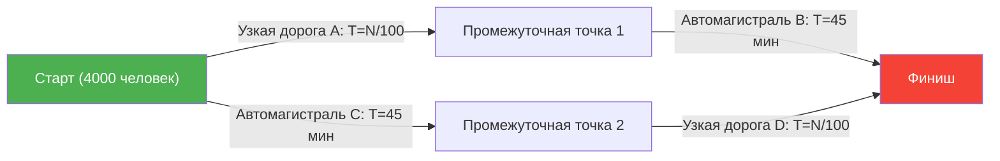
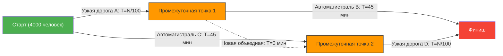

---
title: "Почему после строительства новой дороги пробки стали только хуже? Парадокс Браеса"
description: "Странный парадокс теории сетей, когда в результате строительства новой объездной дороги для устранения пробок, время в пути для всех увеличивается."
date: 2026-09-10T21:00:00+09:00
draft: false
slug: "braess-paradox"
image: "img/braess_paradox.jpg"
math: true
mermaid: true
categories: ["Математические парадоксы", "Теория игр"]
tags: ["Парадокс", "Сети", "Трафик", "Равновесие Нэша", "Парадокс Браеса"]
---

Утренний час пик. Вы, раздраженные ежедневными пробками на дорогах, получаете отличную новость.
«Для устранения пробок отдел городского планирования построил **новую короткую дорогу (шорткат)**!»
Все наверняка подумали: «Ну теперь-то с завтрашнего дня можно будет поспать подольше».

Однако на следующий день, когда открыли новую дорогу, ситуация не только не улучшилась, но и вызвала **еще более серьезные пробки, чем раньше**, а время в пути для всех увеличилось.

Это не городская легенда или история провала администрации. Это известное явление в теории сетей, математически доказанное немецким математиком Дитрихом Браесом в 1968 году, — **«Парадокс Браеса» (Braess's Paradox)**.

## Модель парадокса: 4000 пассажиров

Давайте рассмотрим простую математическую модель, чтобы понять, почему возникает явление: «дорог стало больше, но все едут медленнее».

Есть 4000 водителей, которые едут от точки старта (жилой район) к точке финиша (деловой район).
Изначально было только 2 маршрута (верхний и нижний):

- **Верхний маршрут**: проехать по узкой дороге $A$, затем по широкой автомагистрали $B$.
- **Нижний маршрут**: проехать по широкой автомагистрали $C$, затем по узкой дороге $D$.

Поскольку на «узкой дороге» с увеличением числа машин возникают пробки, время в пути составляет: «количество едущих машин $\div 100$» минут.
«Широкая автомагистраль» никогда не стоит в пробках, сколько бы машин ни приехало, и поездка по ней всегда занимает «45 минут».

### Время в пути 【ДО строительства новой дороги】

Водители умны, поэтому каждый пытается выбрать самый быстрый маршрут. В результате 4000 человек распределяются поровну: по верхнему маршруту (2000 человек) и по нижнему маршруту (2000 человек).

- **Время верхнего маршрута**: $\frac{2000}{100}$ мин (узкая дорога) + $45$ мин (автомагистраль) = **$65$ минут**
- **Время нижнего маршрута**: $45$ мин (автомагистраль) + $\frac{2000}{100}$ мин (узкая дорога) = **$65$ минут**

Независимо от выбранного маршрута, время в пути стабилизируется на уровне «65 минут» для всех.

## Ловушка короткой дороги

Предположим, мэр построил «сверхскоростную объездную дорогу мечты», позволяющую переместиться от Промежуточной точки 1 до Промежуточной точки 2 за **0 минут (мгновенно)**.

Водители получили новый вариант маршрута.
Водитель на точке старта думает так:
«Лучше поехать по узкой дороге A, чем по автомагистрали C (45 минут). В худшем случае, даже если все 4000 человек выберут A, это займет 40 минут (4000/100)».

Поэтому **все 4000 человек направляются на «узкую дорогу A»**.
Добравшись до Промежуточной точки 1, они снова думают:
«Вместо того чтобы ехать по автомагистрали B (45 минут), лучше проехать по новой объездной (0 минут) и затем по узкой дороге D. Ведь в худшем случае, даже если все поедут по D, это займет 40 минут».

Поэтому **все 4000 человек едут по «новой объездной» и направляются на «узкую дорогу D»**.

### Время в пути 【ПОСЛЕ строительства новой дороги】

В результате того, что каждый сделал «самый быстрый (рациональный) выбор для себя», все поехали по одному и тому же маршруту (A → Новая объездная → D).

Давайте посчитаем это время в пути:
- Узкая дорога $A$: $\frac{4000}{100} = 40$ мин
- Новая объездная: $0$ мин
- Узкая дорога $D$: $\frac{4000}{100} = 40$ мин
- **Итого: $80$ минут**

Оказывается, несмотря на то, что появился удобный новый короткий путь, время поездки для всех **ухудшилось с «65 минут» до «80 минут»**.

Вы можете подумать: «А почему бы хоть кому-нибудь не воспользоваться старым маршрутом?» Но если один человек выберет скоростной маршрут в объезд (45 минут + 40 минут = 85 минут), он будет ехать еще медленнее, чем текущие 80 минут. Поэтому никто не станет менять маршрут.
В теории игр это называется достижением **«равновесия Нэша»**. В результате того, что каждый принял оптимальное для себя решение, в целом все оказались в наихудшем положении.

## Примеры из реального мира

Парадокс Браеса — это не просто кабинетная теория, он многократно наблюдался в реальном городском движении и сетевых системах.

- **1969 год, Штутгарт, Германия**:
  Была построена новая дорога для борьбы с пробками, но пробки только усилились. В итоге, когда новую дорогу **закрыли, поток движения улучшился**.
- **1990 год, Нью-Йорк**:
  Во время проведения Дня Земли полностью перекрыли 42-ю улицу, известную своими пробками. Вопреки ожиданиям экспертов по транспорту, **пробки на всем Манхэттене резко уменьшились**.
- **Телекоммуникационные сети**:
  То же самое явление может происходить и в маршрутизации интернета, и в электросетях. Как только добавляется новый кабель или линия, пакеты данных могут устремиться по «кратчайшему, казалось бы, оптимальному маршруту», что иногда приводит к падению всей сети.

Парадокс Браеса прекрасно иллюстрирует дилемму сложного общества, в котором **«совокупность рациональных выборов индивидов (эгоизм)» не всегда приводит к «оптимальному результату для всех»**. Иногда «лишение выбора (свободы)» может пойти на пользу всем.
