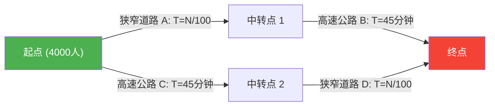

---
title: "新建了道路，为何拥堵反而恶化了？：布雷斯悖论"
description: "为了缓解交通拥堵而修建了新的快速通道，结果却导致所有人的通勤时间变长——这是网络理论中一个奇妙的悖论。"
date: 2026-09-10T21:00:00+09:00
draft: false
slug: "braess-paradox"
image: "img/braess_paradox.jpg"
math: true
mermaid: true
categories: ["数学悖论", "博弈论"]
tags: ["悖论", "网络", "交通", "纳什均衡", "布雷斯悖论"]
---

早晨的通勤高峰。每天都在因道路拥堵而烦躁的你，收到了一个好消息。
“为了缓解拥堵，城市规划部门建设了**最新的捷径道路**！”
所有人都应该期待着，从明天起能多睡一会儿了。

然而到了第二天，新道路一开通，情况不但没有好转，反而引发了**比以前更严重的大拥堵**，导致所有人的通勤时间都变长了。

这并不是都市传说，也不是行政规划的失败案例。这是由德国数学家迪特里希·布雷斯（Dietrich Braess）在1968年通过数学证明的，网络理论中著名的现象——**“布雷斯悖论（Braess's Paradox）”**。

## 悖论模型：4,000名通勤者

为什么会发生“道路增加了，所有人却变慢了”的现象呢？让我们用一个简单的数学模型来确认一下。

有4,000名司机从起点（居住区）前往终点（办公区）。
最初，只有以下两条路线（上路线・下路线）。

- **上路线**：通过狭窄道路 $A$，之后通过宽阔的高速公路 $B$。
- **下路线**：通过宽阔的高速公路 $C$，之后通过狭窄道路 $D$。

“狭窄道路”在车辆增加时会发生拥堵，因此所需时间为“行驶的车辆数 $\div 100$”分钟。
“宽阔的高速公路”无论来多少车都不会拥堵，时间始终固定为“45分钟”。

### 【道路建设前】的所需时间

司机们都很聪明，所以会尽量选择稍微快一点的路线。结果是，4,000人均匀地分流到上路线（2,000人）和下路线（2,000人）。

- **上路线的所需时间**：$\frac{2000}{100}$ 分钟（狭窄道路） + $45$ 分钟（高速） = **$65$分钟**
- **下路线的所需时间**：$45$ 分钟（高速） + $\frac{2000}{100}$ 分钟（狭窄道路） = **$65$分钟**

无论选择哪条路线，所有人的所需时间都稳定在“65分钟”。

## 捷径道路的陷阱

此时，假设市长建设了一条“从中转点1到中转点2，**所需时间为0分钟（瞬间）即可到达的梦幻超高速快速通道**”。

司机们获得了新的路线选择。
站在起点的司机会这么想：
“比起走高速公路C（45分钟），走狭窄道路A还是好些。因为最坏的情况下，即使4000人全都选择A，也只需要40分钟（4000/100）。”

因此，**4,000人全都会驶向“狭窄道路A”**。
到达中转点1后，他们又会想：
“比起走高速公路B（45分钟），通过新快速通道（0分钟）走狭窄道路D还是好些。因为最坏的情况下就算所有人走D也只需要40分钟。”

因此，**4,000人全都会通过“新快速通道”驶向“狭窄道路D”**。

### 【道路建设后】的所需时间

所有人都做出了“对自己最快（最合理）的选择”的结果是，所有人都走了相同的路线（A → 新快速通道 → D）。

我们来计算一下所需的总时间。
- 狭窄道路 $A$：$\frac{4000}{100} = 40$分钟
- 新快速通道：$0$分钟
- 狭窄道路 $D$：$\frac{4000}{100} = 40$分钟
- **合计：$80$分钟**

没想到，尽管修建了便利的新捷径，所有人的通勤时间却**从“65分钟”恶化到了“80分钟”**。

你可能会想：“只要有一个人去走旧路线不就好了吗？”但如果有一个人选择了旧的绕远路线（45分钟+40分钟=85分钟），会比现在的80分钟还要慢，所以没有人会去改变路线。
这在博弈论中被称为达到了**“纳什均衡”**。所有人采取了对自己最优行动的结果，就是整体陷入了最糟糕的局面。

## 现实世界中的实例

布雷斯悖论不仅是纸上谈兵，在现实的城市交通和网络系统中也已被多次观察到。

- **1969年 德国斯图加特**：
  为了缓解交通拥堵而修建了新道路，拥堵却随之恶化。最终，将那条新道路**封闭后，交通状况反而得到了改善**。
- **1990年 纽约**：
  在世界地球日的活动中，作为拥堵重灾区的“42街”被完全封闭。然而出乎交通专家预料的是，曼哈顿整体的**拥堵得到了戏剧性的缓解**。
- **通信网络**：
  在互联网路由或电网中也可能发生同样的现象。有时刚添加新的电缆或线路，数据包就会集中涌向“被认为是最佳的最短路径”，从而导致整个网络瘫痪。

布雷斯悖论精彩地展现了复杂社会系统中的困境：**“个人合理选择（利己主义）的集合”，未必能带来“整体的最优结果”**。有时，“剥夺选择项（自由）”反而能符合所有人的利益。
