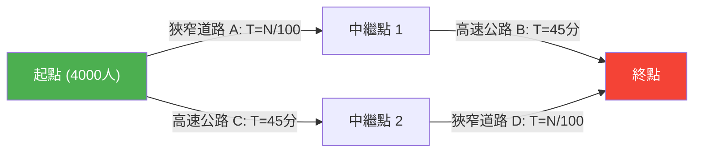

---
title: "新蓋了道路，為什麼塞車反而變嚴重了？：布雷斯悖論"
description: "為了解決交通擁塞而建設了新的外環道，結果卻導致所有人的通勤時間變長的網路理論奇妙悖論。"
date: 2026-09-10T21:00:00+09:00
draft: false
slug: "braess-paradox"
image: "img/braess_paradox.jpg"
math: true
mermaid: true
categories: ["數學悖論", "賽局理論"]
tags: ["悖論", "網路", "交通", "納許均衡", "布雷斯悖論"]
---

早晨的通勤尖峰。每天都對塞車感到煩躁的你，收到了一個好消息。
「為了解決塞車問題，都市計畫部門建設了**最新的捷徑道路**！」
每個人一定都滿心期待，想著這樣從明天開始就能多睡一會兒了。

然而到了隔天，新道路一開通，情況不但沒有好轉，反而引發了**比以前更嚴重的大塞車**，所有人的通勤時間都變長了。

這並非都市傳說或行政機關的失敗故事。這是 1968 年由德國數學家迪特里希·布雷斯 (Dietrich Braess) 在數學上證明過的網路理論著名現象——**「布雷斯悖論 (Braess's Paradox)」**。

## 悖論模型：4,000 名通勤者

為什麼會發生「道路增加了，所有人卻都變慢了」的現象呢？讓我們用一個簡單的數學模型來確認。

有 4,000 名駕駛要從起點（住宅區）前往終點（辦公區）。
一開始，只有以下兩條路線（上方路線、下方路線）。

- **上方路線**：經過狹窄的道路 $A$，然後經過寬闊的高速公路 $B$。
- **下方路線**：經過寬闊的高速公路 $C$，然後經過狹窄的道路 $D$。

「狹窄的道路」車輛一多就會塞車，因此所需時間為「行駛的車輛數 $\div 100$」分鐘。
「寬闊的高速公路」無論來多少車都不會塞車，永遠固定需要「45 分鐘」。

### 【道路建設前】的所需時間

駕駛們很聰明，會試圖選擇哪怕只快一點點的路線。結果，4,000 人會平均分配到上方路線（2,000 人）和下方路線（2,000 人）。

- **上方路線的所需時間**：$\frac{2000}{100}$ 分鐘（狹窄道路） + $45$ 分鐘（高速公路） = **$65$ 分鐘**
- **下方路線的所需時間**：$45$ 分鐘（高速公路） + $\frac{2000}{100}$ 分鐘（狹窄道路） = **$65$ 分鐘**

無論選擇哪條路線，所有人的所需時間都會穩定在「65 分鐘」。

## 捷徑道路的陷阱

這時，假設市長建設了一條「從中繼點 1 到中繼點 2，**只需 0 分鐘（瞬間）即可抵達的夢幻超高速外環道**」。

駕駛們獲得了新的路線選擇。
站在起點的駕駛會這樣想：
「與其走高速公路 C（45 分鐘），不如走狹窄道路 A 還比較好。因為最壞的情況下，就算 4000 人全部都選擇 A，也只需要 40 分鐘（4000/100）。」

因此，**4,000 人全部都會朝「狹窄道路 A」前進**。
到達中繼點 1 後，他們又會想：
「與其走高速公路 B（45 分鐘），不如走新外環道（0 分鐘）去接狹窄道路 D 還比較好。因為最壞的情況下，就算所有人都走 D 也只需要 40 分鐘。」

因此，**4,000 人全部都會通過「新外環道」朝「狹窄道路 D」前進**。

### 【道路建設後】的所需時間

所有人都做出「對自己而言最快（最合理）的選擇」的結果，就是所有人都走上了同一條路線（A → 新外環道 → D）。

讓我們來計算一下所需時間。
- 狹窄道路 $A$：$\frac{4000}{100} = 40$ 分鐘
- 新外環道：$0$ 分鐘
- 狹窄道路 $D$：$\frac{4000}{100} = 40$ 分鐘
- **總計：$80$ 分鐘**

沒想到，明明建成了方便的新捷徑，所有人的通勤時間卻**從「65 分鐘」惡化到了「80 分鐘」**。

你也許會想：「只要有其中一個人去走原本的路線不就好了嗎？」，但是如果有一個人選擇了原本有高速公路的路線（45 分鐘 + 40 分鐘 = 85 分鐘），會比現在的 80 分鐘還要慢，因此沒有人會想要改變路線。
在賽局理論中，這被稱為達到了**「納許均衡」**。所有人都採取了對自己最有利的行動，結果卻導致整體陷入了最糟的局面。

## 現實世界中的實例

布雷斯悖論不僅僅是紙上談兵，在現實的都市交通和網路系統中也已被觀察到許多次。

- **1969 年 德國斯圖加特**：
  為了解決交通擁塞而建設了新道路，結果塞車反而變嚴重。最後，**封閉了那條新道路後，交通流量才獲得改善**。
- **1990 年 紐約**：
  在地球日活動中，將經常塞車的「第 42 街」全面封閉，結果出乎交通專家的預料，曼哈頓整體的**塞車情況戲劇性地緩解了**。
- **通訊網路**：
  在網際網路的路由和電網中也可能發生同樣的現象。每當新增了纜線或線路，資料封包就可能會集中在「看似最佳的最短路徑」上，導致整個網路癱瘓。

布雷斯悖論完美地表現了複雜社會體系中的兩難：**「個人合理選擇（利己主義）的集合」，並不一定會帶來「整體的最佳結果」**。有時候，「剝奪選擇（自由）」，反而能為所有人帶來利益。
