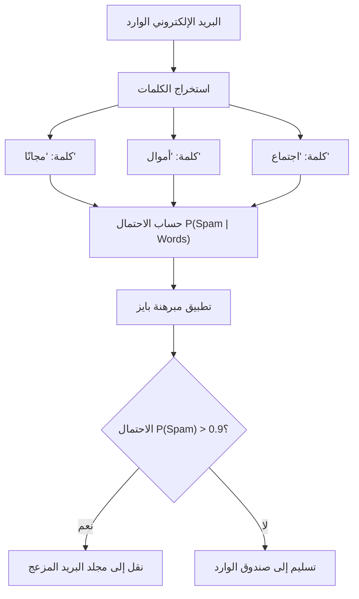
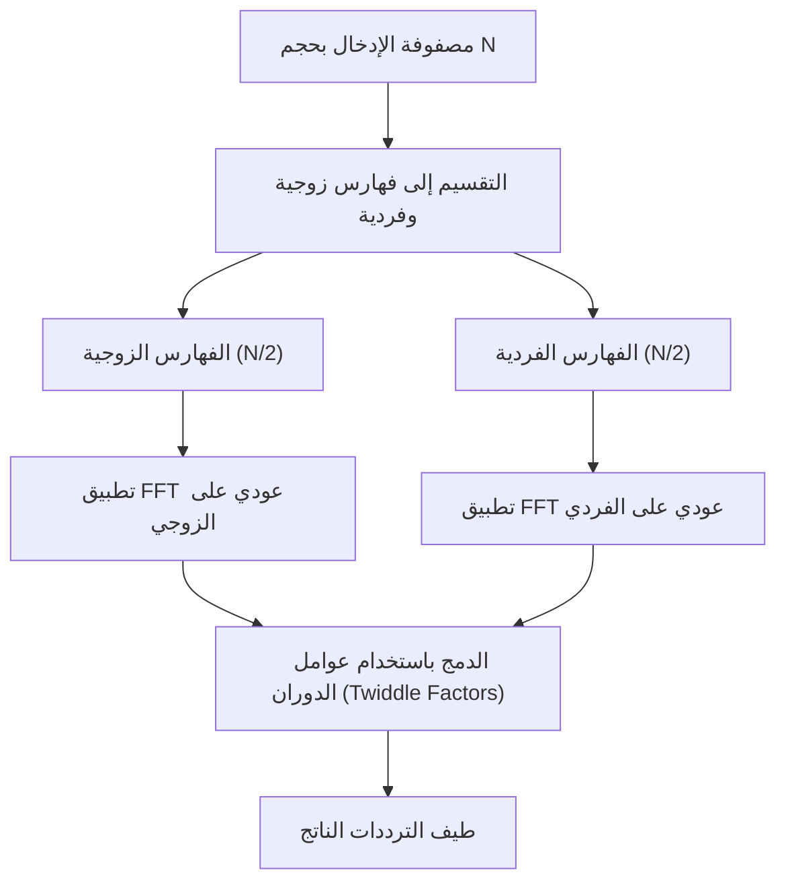
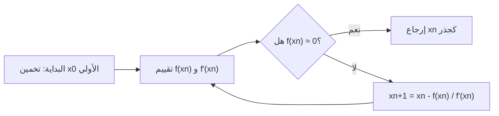
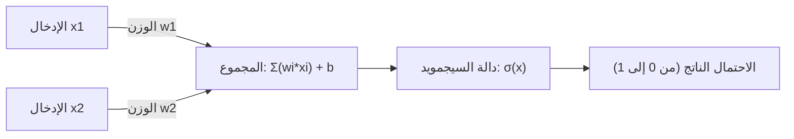

# لعشاق الرياضيات! 10 معادلات رياضية جميلة ومفيدة في البرمجة

قد تبدو البرمجة والرياضيات للوهلة الأولى كمجالين مختلفين تمامًا. فالبرمجة هي عملية كتابة كود منطقي ومحدد، بينما الرياضيات هي دراسة تسعى وراء حقائق مجردة وعالمية. ومع ذلك، فإن الرياضيات حاضرة دائمًا في أساس علوم الحاسوب. في تحسين الخوارزميات، وعلوم البيانات، والتعلم الآلي، ورسومات الحاسوب، وحتى في خلفية التطبيقات اليومية، تعمل المعادلات الرياضية الجميلة بصمت وقوة.

في هذا المقال، قمنا باختيار 10 معادلات رياضية بعناية، ليست فقط جميلة من الناحية الرياضية، بل تلعب أيضًا دورًا عمليًا ومهمًا للغاية في سياق البرمجة والخوارزميات. سنتعمق في الخلفية الرياضية لكل معادلة، ونشرح بالتفصيل الممل كيف يتم تطبيقها في مجال البرمجة، مع تقديم مقتطفات برمجية (Code Snippets) عملية بلغات Python و C++.

مرحبًا بك في العالم الذي يتقاطع فيه جمال الرياضيات مع التطبيق العملي للبرمجة.

---

## 1. متطابقة أويلر (Euler's Identity)

### جمال المعادلة ونظرة عامة
هذه هي متطابقة أويلر، والتي تُوصف بـ "كنز البشرية" و"أجمل معادلة في العالم". تم دمج الثوابت الخمسة الأكثر أهمية في الرياضيات (العدد النيبيري $e$، الوحدة التخيلية $i$، ثابت الدائرة $\pi$، العنصر المحايد الضربي $1$، والعنصر المحايد الجمعي $0$) في معادلة واحدة بسيطة.

$$ e^{i\pi} + 1 = 0 $$

هذه المتطابقة تُشتق من صيغة أويلر الأكثر عمومية $e^{i\theta} = \cos\theta + i\sin\theta$ عن طريق التعويض بقيمة $\theta = \pi$.

### التطبيقات في البرمجة
في البرمجة، وخاصة في رسومات الحاسوب وتطوير الألعاب، تُعد صيغة أويلر أداة قوية جدًا للتعامل مع "الدوران" (Rotation). يمكن تدوير النقاط في الفضاء ثنائي الأبعاد باستخدام حسابات المصفوفات، ولكن استخدام الأعداد المركبة يجعل الحسابات بسيطة للغاية وبديهية. نظرًا لأن الدوران على المستوى المركب يمكن تحقيقه ببساطة عن طريق الضرب في $e^{i\theta}$، يصبح الكود البرمجي أكثر إيجازًا.

### مثال برمجي (C++)
فيما يلي برنامج بلغة C++ يستخدم المكتبة القياسية `<complex>` لتدوير نقطة في إحداثيات ثنائية الأبعاد بزاوية محددة (بالراديان).

```cpp
#include <iostream>
#include <complex>
#include <cmath>

// اسم مستعار للنوع للتعامل مع الإحداثيات ثنائية الأبعاد كأعداد مركبة
using Point2D = std::complex<double>;

// دالة لتدوير النقطة حول نقطة الأصل بزاوية theta (بالراديان)
Point2D rotatePoint(const Point2D& point, double theta) {
    // بناءً على صيغة أويلر، يتم إنشاء العدد المركب للدوران e^{i*theta}
    // داخليًا سيكون cos(theta) + i*sin(theta)
    Point2D rotation(std::cos(theta), std::sin(theta));
    
    // تطبيق الدوران من خلال ضرب الأعداد المركبة
    return point * rotation;
}

int main() {
    // الإحداثيات الأولية (x=1.0, y=0.0)
    Point2D p(1.0, 0.0);
    
    // الدوران بـ 90 درجة (π/2 راديان)
    double theta = M_PI / 2.0;
    Point2D rotated_p = rotatePoint(p, theta);
    
    std::cout << "Original Point: (" << p.real() << ", " << p.imag() << ")\n";
    // النتيجة المتوقعة هي تقريبًا (0, 1)
    std::cout << "Rotated Point: (" << rotated_p.real() << ", " << rotated_p.imag() << ")\n";
    
    return 0;
}
```

**شرح مفصل**:
تكمن ميزة هذا النهج في إمكانية تغليف حسابات مصفوفة الدوران (4 عمليات ضرب وعمليتي جمع) كعمليات على الأعداد المركبة. علاوة على ذلك، في الفضاء ثلاثي الأبعاد، يتم استخدام مفهوم موسع يسمى "الكواتيرنيون" (Quaternions). باستخدام الكواتيرنيون، يمكن تجنب المشكلة القاتلة المعروفة باسم "قفل المحور" (Gimbal Lock) التي تحدث مع زوايا أويلر، وتحقيق استيفاء خطي كروي سلس (Slerp).

---

## 2. متسلسلة تايلور (Taylor Series)

### جمال المعادلة ونظرة عامة
متسلسلة تايلور هي طريقة رياضية لتمثيل الدوال المعقدة (مثل الدوال المثلثية والدوال الأسية) كمجموع لمتعددة حدود لا نهائية. يُعرّف مفكوك تايلور لدالة $f(x)$ حول النقطة $a$ على النحو التالي:

$$ f(x) = \sum_{n=0}^\infty \frac{f^{(n)}(a)}{n!}(x-a)^n $$

تحديدًا، تُسمى الحالة التي يكون فيها $a=0$ بـ "متسلسلة ماكلورين".

### التطبيقات في البرمجة
في الجوهر، أجهزة الحاسوب (وحدات المعالجة المركزية CPU ووحدات الفاصلة العائمة FPU) لا يمكنها تنفيذ سوى العمليات الحسابية الأربع: الجمع، الطرح، الضرب، والقسمة. إذن، كيف يتم حساب `sin(x)` أو `exp(x)`؟ في المعالجات الحديثة، غالبًا ما تُستخدم خوارزمية CORDIC أو تقريب تشيبيشيف، ولكن عند تنفيذ الدوال الرياضية على مستوى البرمجيات، أو عند إنشاء دوال تقريبية سريعة بدقة منخفضة من أجل تحسين الأداء، فإن متسلسلة تايلور (أو المتغيرات التابعة لها) تكون مفيدة بشكل مباشر.

### مثال برمجي (Python)
فيما يلي كود Python يحسب تقريبًا لدالة الجيب (Sine) باستخدام متسلسلة ماكلورين.

$$ \sin(x) \approx x - \frac{x^3}{3!} + \frac{x^5}{5!} - \frac{x^7}{7!} + \dots $$

```python
import math

def taylor_sin(x, terms=10):
    """
    يحسب تقريباً لـ sin(x) باستخدام متسلسلة تايلور (متسلسلة ماكلورين).
    
    :param x: الزاوية (بالراديان)
    :param terms: عدد الحدود التي سيتم حسابها (كلما زاد العدد، زادت الدقة)
    :return: القيمة التقريبية لـ sin(x)
    """
    # تسوية قيمة x لتكون في النطاق من -π إلى π باستخدام الدورية (لتحسين الدقة)
    x = (x + math.pi) % (2 * math.pi) - math.pi
    
    result = 0.0
    for n in range(terms):
        # استخدام الحدود الفردية فقط: 2n + 1
        power = 2 * n + 1
        
        # تتغير الإشارة مع كل حد: (-1)^n
        sign = (-1) ** n
        
        # حساب المضروب (Factorial)
        fact = math.factorial(power)
        
        # تقييم المعادلة والجمع
        term = sign * (x ** power) / fact
        result += term
        
    return result

# اختبار
angle = math.radians(45) # 45 درجة = π/4
print(f"Math library sin: {math.sin(angle)}")
print(f"Taylor series sin: {taylor_sin(angle, terms=5)}")
```

**شرح مفصل**:
في الكود أعلاه، نقوم بتسوية قيمة الإدخال `x` لتكون في النطاق $[-\pi, \pi]$. وذلك لأن متسلسلة تايلور لها خاصية زيادة الخطأ بسرعة كلما ابتعدنا عن مركز التوسع (وهنا هو 0) وهو ما يُعرف بـ (Truncation error). نظرًا لأن الحسابات اللانهائية مستحيلة في البرمجة، فإننا نوقف الحساب عند عدد محدود من الحدود `terms`. إن إدارة المفاضلة (Trade-off) بين "خطأ التقريب" و"خطأ الاقتطاع" الناتج عن ذلك هي جوهر برمجة الحسابات العددية.

---

## 3. مبرهنة بايز (Bayes' Theorem)

### جمال المعادلة ونظرة عامة
مبرهنة بايز هي مبرهنة تُستخدم لتحديث احتمال وقوع حدث (الاحتمال البعدي) بناءً على المعرفة المسبقة (الاحتمال القبلي) المتعلقة بهذا الحدث. إنها واحدة من أهم الصيغ في نظرية الاحتمالات والإحصاء.

$$ P(A|B) = \frac{P(B|A)P(A)}{P(B)} $$

هنا، يمثل $P(A|B)$ احتمال وقوع الحدث A بشرط وقوع الحدث B (الاحتمال البعدي).

### التطبيقات في البرمجة
تُستخدم المبرهنة على نطاق واسع كـ "مصنف بايز الساذج" (Naive Bayes Classifier) في مجالات التعلم الآلي وعلوم البيانات. المثال التطبيقي الأشهر هو تصفية رسائل البريد الإلكتروني العشوائية (Spam). حيث يتم حساب إجابة السؤال ديناميكيًا بناءً على البيانات السابقة: "إذا كانت هذه الرسالة تحتوي على كلمة 'مجانًا'، فما هو احتمال أن تكون رسالة مزعجة؟".



### مثال برمجي (Python)
كود يوضح المنطق الأساسي لمرشح البريد المزعج.

```python
def calculate_spam_probability(
    prob_spam, 
    prob_word_given_spam, 
    prob_word_given_ham
):
    """
    يحسب احتمال أن يكون البريد الإلكتروني الذي يحتوي على كلمة معينة بريدًا مزعجًا باستخدام مبرهنة بايز.
    
    :param prob_spam: الاحتمال القبلي P(Spam) - احتمال أن يكون البريد مزعجًا
    :param prob_word_given_spam: الاحتمال P(Word|Spam) - احتمال وجود الكلمة في البريد المزعج
    :param prob_word_given_ham: الاحتمال P(Word|Ham) - احتمال وجود الكلمة في البريد العادي
    :return: الاحتمال P(Spam|Word) - احتمال أن يكون البريد مزعجًا في حال احتوائه على الكلمة
    """
    # الاحتمال القبلي للبريد العادي P(Ham) = 1 - P(Spam)
    prob_ham = 1.0 - prob_spam
    
    # احتمال ظهور الكلمة في جميع رسائل البريد P(Word) = P(Word|Spam)P(Spam) + P(Word|Ham)P(Ham)
    # هذا يعتمد على قانون الاحتمال الكلي
    prob_word = (prob_word_given_spam * prob_spam) + (prob_word_given_ham * prob_ham)
    
    # مبرهنة بايز P(Spam|Word) = P(Word|Spam) * P(Spam) / P(Word)
    if prob_word == 0:
        return 0.0 # تجنب القسمة على صفر
        
    prob_spam_given_word = (prob_word_given_spam * prob_spam) / prob_word
    return prob_spam_given_word

# مثال: احتمال الكلمة "فوز"
# بيانات سابقة: 20% من كل البريد يعتبر مزعجاً
p_spam = 0.2
# 80% من البريد المزعج يحتوي على كلمة "فوز"
p_win_given_spam = 0.8
# 1% من البريد العادي يحتوي على كلمة "فوز"
p_win_given_ham = 0.01

result = calculate_spam_probability(p_spam, p_win_given_spam, p_win_given_ham)
print(f"احتمال أن يكون البريد الذي يحتوي على كلمة 'فوز' بريدًا مزعجًا: {result:.2%}")
```

**شرح مفصل**:
في التنفيذ الفعلي (مصنف بايز الساذج)، نقوم بضرب احتمالات الكلمات المتعددة معًا. ومع ذلك، إذا قمت بضرب الاحتمالات (قيم بين 0 و 1) آلاف المرات، ستصبح القيمة صفرًا بسبب حدود تمثيل الفاصلة العائمة في الحاسوب (Underflow). لذلك، في البرمجة العملية، يُعد تحويل ضرب الاحتمالات إلى "مجموع اللوغاريتمات" (`log(a * b) = log(a) + log(b)`) تقنية أساسية وحيوية.

---

## 4. إنتروبيا شانون (Shannon Entropy)

### جمال المعادلة ونظرة عامة
الإنتروبيا (Entropy)، التي عرّفها كلود شانون "أبو نظرية المعلومات"، هي معادلة تُقيس كميًا "عدم اليقين" أو "العشوائية" أو "متوسط كمية المعلومات" التي يمتلكها مصدر المعلومات.

$$ H(X) = - \sum_{i=1}^n P(x_i) \log_2 P(x_i) $$

### التطبيقات في البرمجة
الإنتروبيا هي وجود لا غنى عنه في ضغط بيانات الملفات (الترميز الهوفماني أو الحدود النظرية لخوارزميات ضغط ZIP)، وتقييم قوة الأرقام العشوائية في نظرية التشفير، وخوارزميات "أشجار القرار" (Decision Trees) في التعلم الآلي (مثل ID3 و C4.5). عند بناء شجرة قرار، نجد الميزة (Feature) التي تعطي أقصى مقدار من النقصان في الإنتروبيا (كسب المعلومات: Information Gain) عند تقسيم البيانات.

### مثال برمجي (Python)
دالة لحساب الإنتروبيا لسلسلة نصية (مجموعة بيانات) وتقييم كمية المعلومات.

```python
import math
from collections import Counter

def calculate_entropy(data):
    """
    يحسب إنتروبيا شانون لمجموعة بيانات معطاة (سلسلة نصية أو قائمة).
    """
    if not data:
        return 0.0
        
    # حساب عدد مرات ظهور كل عنصر
    counts = Counter(data)
    total_len = len(data)
    
    entropy = 0.0
    for element, count in counts.items():
        # الاحتمال P(x_i)
        probability = count / total_len
        
        # - P(x_i) * log2(P(x_i))
        entropy -= probability * math.log2(probability)
        
    return entropy

# اختبار
# إذا كانت جميع الحروف متطابقة، يكون عدم اليقين 0
data_deterministic = "AAAAAAAAAA" 
# إذا كانت الحروف عشوائية، يكون عدم اليقين عاليًا
data_random = "ABACBCBACB"

print(f"Entropy of '{data_deterministic}': {calculate_entropy(data_deterministic)}")
print(f"Entropy of '{data_random}': {calculate_entropy(data_random)}")
```

**شرح مفصل**:
وحدة الإنتروبيا هي "بت" (bits). إذا كانت الإنتروبيا `1.5`، فهذا يعني أننا بحاجة إلى 1.5 بت في المتوسط لتمثيل كل عنصر في تلك البيانات. في مجال البرمجة، يتم حساب الإنتروبيا بشكل روتيني كمعيار لقياس كفاءة خوارزميات الضغط، أو كمؤشر مهم في اختيار الميزات (Feature Selection) لنماذج التعلم الآلي.

---

## 5. تحويل فورييه السريع (Fast Fourier Transform - FFT)

### جمال المعادلة ونظرة عامة
تحويل فورييه المتقطع (DFT) يحول الإشارات من المجال الزمني إلى مجال التردد. معادلته هي كما يلي:

$$ X_k = \sum_{n=0}^{N-1} x_n e^{-i 2\pi k n / N} $$

إذا قمنا بحساب هذا التحويل بطريقة ساذجة، فإن التعقيد الحسابي (Time Complexity) سيكون $O(N^2)$، وسيصبح الحساب بطيئًا جدًا بشكل مفاجئ كلما زاد حجم البيانات. الخوارزمية التي تسرع هذا الحساب بشكل كبير إلى $O(N \log N)$ باستخدام طريقة "فرق تسد" (Divide and Conquer) هي "تحويل فورييه السريع" (FFT). تُعد واحدة من أهم 10 خوارزميات في القرن العشرين.



### التطبيقات في البرمجة
يُعد تحويل فورييه السريع (FFT) تقنية أساسية تدعم المجتمع الحديث. فهو يعمل في كل مكان، بدءًا من التعرف على الصوت (Siri أو Alexa)، ضغط بيانات MP3 أو JPEG/MPEG، الاتصالات الرقمية مثل LTE و Wi-Fi، وحتى ضرب الأعداد الصحيحة الضخمة جدًا (خوارزمية شونهوجا-شتراسن).

### مثال برمجي (Python)
مثال على تنفيذ خوارزمية Cooley-Tukey العودية البسيطة. (*ملاحظة: في الممارسة العملية، نستخدم مكتبات مُحسّنة لأقصى حد بـ C أو التجميع (Assembly) مثل `FFTW` أو `numpy.fft`*)

```python
import cmath

def fft(x):
    """
    يحسب تحويل فورييه السريع أحادي البعد (FFT) باستخدام طريقة Cooley-Tukey.
    يجب أن يكون طول قائمة الإدخال N من مضاعفات العدد 2.
    """
    N = len(x)
    
    # الحالة الأساسية
    if N <= 1:
        return x
        
    # التقسيم (Divide) إلى العناصر ذات المؤشرات الزوجية والفردية
    even = fft(x[0::2])
    odd = fft(x[1::2])
    
    # دمج النتائج (Conquer)
    T = [cmath.exp(-2j * cmath.pi * k / N) * odd[k] for k in range(N // 2)]
    
    # استغلال التناظر لتقليل التعقيد الحسابي
    return [even[k] + T[k] for k in range(N // 2)] + \
           [even[k] - T[k] for k in range(N // 2)]

# اختبار: إشارة بسيطة
signal = [1.0, 1.0, 1.0, 1.0, 0.0, 0.0, 0.0, 0.0]
spectrum = fft(signal)

print("Frequency Spectrum (Magnitude):")
for k, val in enumerate(spectrum):
    # حساب القيمة المطلقة (السعة)
    print(f"Freq {k}: {abs(val):.3f}")
```

**شرح مفصل**:
يكمن جوهر هذه الخوارزمية في استخدام التناظر والدورية للأعداد المركبة، والتي تُسمى بـ "عامل الدوران" (Twiddle factor). هذا يلغي الهدر الناتج عن تكرار العمليات الحسابية، وفي حالة $N=1024$، فإنه يقلل عدد العمليات المطلوبة من $1,048,576$ إلى حوالي $10,240$ فقط. يمكن القول بحق إنها معجزة نتجت عن اندماج الرياضيات والخوارزميات.

---

## 6. صيغة هافيرسين (Haversine Formula)

### جمال المعادلة ونظرة عامة
إنها صيغة تُستخدم لحساب أقصر مسافة بين نقطتين (مسافة الدائرة العظمى) على سطح كروي، مثل سطح الأرض.

$$ a = \sin^2\left(\frac{\Delta\phi}{2}\right) + \cos\phi_1 \cos\phi_2 \sin^2\left(\frac{\Delta\lambda}{2}\right) $$
$$ c = 2\cdot \text{atan2}\left(\sqrt{a}, \sqrt{1-a}\right) $$
$$ d = R \cdot c $$

(حيث تمثل $\phi$ خط العرض، $\lambda$ خط الطول، و $R$ نصف قطر الأرض)

### التطبيقات في البرمجة
تُعد هذه المعادلة ضرورية عند حساب المسافة بين إحداثيات خطوط العرض والطول في تطبيقات تتبع نظام تحديد المواقع العالمي (GPS)، والخدمات القائمة على الموقع مثل Uber أو Pokemon GO. يؤدي استخدام حساب المسافة بخط مستقيم باستخدام مبرهنة فيثاغورس إلى حدوث أخطاء كبيرة عبر المسافات الطويلة لأنه لا يأخذ في الاعتبار كروية الأرض.

### مثال برمجي (Python)
دالة تستقبل إحداثيتين (خط العرض وخط الطول) وتُرجع المسافة بينهما (بالكيلومتر).

```python
import math

def haversine_distance(lat1, lon1, lat2, lon2):
    """
    حساب مسافة الدائرة العظمى بين نقطتين باستخدام صيغة هافيرسين.
    """
    # متوسط نصف قطر الأرض (بالكيلومتر)
    R = 6371.0 
    
    # تحويل خطوط العرض والطول من الدرجات إلى الراديان
    phi1, phi2 = math.radians(lat1), math.radians(lat2)
    delta_phi = math.radians(lat2 - lat1)
    delta_lambda = math.radians(lon2 - lon1)
    
    # حساب هافيرسين
    a = math.sin(delta_phi / 2.0)**2 + \
        math.cos(phi1) * math.cos(phi2) * \
        math.sin(delta_lambda / 2.0)**2
        
    c = 2 * math.atan2(math.sqrt(a), math.sqrt(1 - a))
    
    # حساب المسافة
    distance = R * c
    return distance

# المسافة من برج طوكيو (35.6586, 139.7454) إلى تمثال الحرية (40.6892, -74.0445)
tokyo = (35.6586, 139.7454)
ny = (40.6892, -74.0445)

dist = haversine_distance(tokyo[0], tokyo[1], ny[0], ny[1])
print(f"المسافة من برج طوكيو إلى تمثال الحرية: تقريباً {dist:.2f} كم")
```

**شرح مفصل**:
على الرغم من وجود طريقة لاستخدام قانون جيب التمام لعلم المثلثات الكروية، إلا أنه عندما تكون المسافة بين النقطتين قريبة جدًا (على سبيل المثال، أمتار قليلة)، يحدث ما يُعرف بـ "الإلغاء الكارثي" (Catastrophic cancellation) في دقة حسابات الفاصلة العائمة. نظرًا لأن صيغة هافيرسين تستخدم `sin^2`، فإن لها ميزة برمجية كبيرة تتمثل في قدرتها على إجراء حسابات مستقرة عدديًا حتى بالنسبة للمسافات الصغيرة جدًا. إذا لزم الأمر دقة أعلى، يتم استخدام صيغ فينسنتي (Vincenty's formulae)، التي تتعامل مع الأرض كمجسم بيضاوي.

---

## 7. طريقة نيوتن-رافسون (Newton-Raphson Method)

### جمال المعادلة ونظرة عامة
خوارزمية قوية جدًا لإيجاد الجذور، حيث تجد حلاً (جذرًا) للمعادلة $f(x) = 0$ بشكل تكراري باستخدام المماسات.

$$ x_{n+1} = x_n - \frac{f(x_n)}{f'(x_n)} $$

باستخدام قيمة الدالة $f(x_n)$ عند الموضع الحالي $x_n$ وميلها (مشتقتها) $f'(x_n)$، نستنتج الموضع الأكثر دقة $x_{n+1}$ للبحث في الخطوة التالية.



### التطبيقات في البرمجة
تُستخدم في تصيير (Rendering) محركات الرسومات، واكتشاف الاصطدامات في المحاكاة الفيزيائية، ومشاكل التحسين (Optimization). ومما يلفت النظر بشكل خاص اختراق "الجذر التربيعي العكسي السريع" (Fast Inverse Square Root) المدفون في كود المصدر الخاص بلعبة التصويب الشهيرة (Quake III Arena). كان هذا اختراقًا يستخدم طريقة نيوتن مرة واحدة فقط لحساب $1/\sqrt{x}$ بسرعة فائقة، وكان ضروريًا لتسوية المتجهات.

### مثال برمجي (C++)
نوضح هنا مثالاً لحساب الجذر التربيعي القياسي $\sqrt{N}$ (أي حل المعادلة $x^2 - N = 0$) بوضوح باستخدام طريقة نيوتن. في هذه الحالة، $f(x) = x^2 - N$ و $f'(x) = 2x$.

```cpp
#include <iostream>
#include <cmath>

double newton_sqrt(double N, double tolerance = 1e-7) {
    if (N < 0) return NAN; // الجذر التربيعي لعدد سالب هو NaN (ليس رقماً)
    if (N == 0) return 0;
    
    // القيمة التخمينية الأولية (نبدأ من N نفسه)
    double x = N; 
    
    while (true) {
        // حساب القيمة التخمينية التالية: x_new = x - (x^2 - N) / (2x) = (x + N/x) / 2
        double x_new = 0.5 * (x + N / x);
        
        // إذا كان مقدار التغيير أقل من الخطأ المسموح به (tolerance)، نعتبره قد تقارب
        if (std::abs(x - x_new) < tolerance) {
            break;
        }
        x = x_new;
    }
    
    return x;
}

int main() {
    double number = 612.0;
    std::cout << "Square root of " << number << " is: " << newton_sqrt(number) << "\n";
    return 0;
}
```

**شرح مفصل**:
أكبر جاذبية لطريقة نيوتن هي "التقارب التربيعي" (Quadratic convergence) إذا استوفت الشروط. هذا يعني سرعة تقارب مذهلة حيث يتضاعف عدد أرقام الإجابة الصحيحة تقريبًا في كل تكرار. بالنظر إلى أن البحث الثنائي (Binary Search) ذو تقارب خطي، يمكنك رؤية قوة استخدام معلومات المشتقة (الميل الصغير). في اختراق لعبة "Quake III"، تم اشتقاق القيمة الأولية الأولى لطريقة نيوتن هذه بدقة مذهلة عن طريق اختراق بنية الفاصلة العائمة IEEE 754 باستخدام الرقم السحري (Magic Number) للعمليات على البتات `0x5f3759df`.

---

## 8. منحنيات بيزيير (Bézier Curves)

### جمال المعادلة ونظرة عامة
معادلة بارامترية (وسيطية) تُعرف منحنى ناعمًا باستخدام نقاط تحكم متعددة (Control Points). يحتوي منحنى بيزيير التكعيبي (Cubic Bézier Curve) الأكثر استخدامًا على أربع نقاط $P_0, P_1, P_2, P_3$، ويحدد الإحداثي $B(t)$ على المنحنى بواسطة المعلمة $t \ (0 \le t \le 1)$.

$$ B(t) = (1-t)^3 P_0 + 3(1-t)^2 t P_1 + 3(1-t) t^2 P_2 + t^3 P_3 $$

### التطبيقات في البرمجة
منحنيات بيزيير هي أساس رسومات الحاسوب. تُستخدم كلما تمت برمجة "حركة أو شكل سلس"، مثل أدوات الرسم المتجهي كـ Adobe Illustrator، وتصيير الخطوط (TrueType و OpenType)، وانتقالات (Transitions) CSS باستخدام الدالة `cubic-bezier()` لدوال التخفيف في الرسوم المتحركة (Easing functions)، والتحكم في مسار الكاميرا داخل الألعاب.

### مثال برمجي (Python)
كود يُنشئ مجموعة نقاط على منحنى بيزيير تكعيبي بناءً على أربع نقاط تحكم.

```python
def cubic_bezier(p0, p1, p2, p3, steps=10):
    """
    توليد قائمة إحداثيات على منحنى بيزيير تكعيبي.
    p0, p1, p2, p3 عبارة عن مجموعات (Tuples) من الإحداثيات (x, y).
    steps يحدد عدد المقاطع التي سيُقسم إليها المنحنى.
    """
    curve_points = []
    
    for i in range(steps + 1):
        # المعلمة t تتغير من 0.0 إلى 1.0
        t = i / steps
        
        # حساب المعاملات المكونة للمعادلة
        u = 1 - t
        tt = t * t
        uu = u * u
        uuu = uu * u
        ttt = tt * t
        
        # حساب الإحداثيات x و y لكل نقطة
        x = (uuu * p0[0]) + \
            (3 * uu * t * p1[0]) + \
            (3 * u * tt * p2[0]) + \
            (ttt * p3[0])
            
        y = (uuu * p0[1]) + \
            (3 * uu * t * p1[1]) + \
            (3 * u * tt * p2[1]) + \
            (ttt * p3[1])
            
        curve_points.append((x, y))
        
    return curve_points

# نقطة البداية، نقطة التحكم 1، نقطة التحكم 2، ونقطة النهاية
p0 = (0, 0)
p1 = (5, 10)
p2 = (15, 10)
p3 = (20, 0)

points = cubic_bezier(p0, p1, p2, p3, steps=5)
for i, pt in enumerate(points):
    print(f"t={i/5:.1f} -> Point({pt[0]:.2f}, {pt[1]:.2f})")
```

**شرح مفصل**:
هذه المعادلة عبارة عن توسيع لخوارزمية دي كاستيلجو (De Casteljau's algorithm)، والتي تُطبق الاستيفاء الخطي (Lerp: Linear Interpolation) بشكل تكراري. يتم العثور على الحل مباشرة باستخدام الحسابات متعددة الحدود (متعددات حدود بيرنشتين). في البرمجة، يتم تقريب المنحنى على أنه مجموعة من عدد لا يحصى من "الخطوط المستقيمة الصغيرة". لذلك، عن طريق ضبط دقة أو درجة تحليل $t$ (المتغير `steps`)، نتحكم في التوازن بين الأداء وجودة التصيير.

---

## 9. دالة السيجمويد (Sigmoid Function)

### جمال المعادلة ونظرة عامة
هي دالة ناعمة على شكل حرف S تقوم بضغط أو حصر أي إدخال لعدد حقيقي $x \ ( -\infty < x < \infty )$ بشكل مؤكد إلى قيمة بين $0$ و $1$.

$$ \sigma(x) = \frac{1}{1 + e^{-x}} $$

### التطبيقات في البرمجة
لعبت دورًا تاريخيًا بالغ الأهمية في الانحدار اللوجستي (Logistic Regression) وكـ "دالة التنشيط" (Activation Function) في الشبكات العصبية (التعلم العميق). وبما أن المخرجات تقع في النطاق من 0 إلى 1، فإن الميزة الأكبر هي أنه يمكن تفسير النتيجة على أنها "احتمال".



### مثال برمجي (Python)
كود يُطبق دالة السيجمويد على مصفوفة مدخلة (موتر / Tensor).

```python
import math

def sigmoid(x):
    """حساب السيجمويد لقيمة مفردة"""
    # غالبًا ما يتم تحديد أو تقييد قيمة الإدخال لمنع math.exp(-x) من تجاوز السعة (Overflow)
    # هذا التنفيذ قياسي للتبسيط
    if x >= 0:
        return 1.0 / (1.0 + math.exp(-x))
    else:
        # حل مشكلة تجاوز السعة (Overflow) عندما تكون x قيمة سالبة كبيرة
        return math.exp(x) / (1.0 + math.exp(x))

def apply_sigmoid(array):
    """تطبيق دالة السيجمويد على كافة العناصر داخل المصفوفة"""
    return [sigmoid(x) for x in array]

# البيانات الخام (اللوجيتس Logits) من طبقة المخرجات للشبكة العصبية
logits = [-5.0, -1.0, 0.0, 1.0, 5.0]
probabilities = apply_sigmoid(logits)

for val, prob in zip(logits, probabilities):
    print(f"Input: {val:4.1f} -> Probability: {prob:.4f}")
```

**شرح مفصل**:
سبب تشعب الكود أعلاه بـ `x >= 0` وغير ذلك، هو منع "تجاوز السعة" (Overflow) وهي مشكلة خاصة بالبرمجة. هذه تقنية حسابية عددية لمنع البرنامج من الانهيار (أو إرجاع قيمة ما لا نهاية Inf) عند محاولة حساب $e^{1000}$، على سبيل المثال في حالة $x = -1000$. حاليًا، في الطبقات المخفية (Intermediate layers) للتعلم العميق، تُعد دالة ReLU (حيث $f(x) = \max(0, x)$) هي السائدة نظرًا لسرعة الحساب وتجنب مشكلة تلاشي التدرج (Vanishing Gradient)، ولكن في طبقة المخرجات للتصنيف الثنائي (Binary Classification)، لا تزال دالة السيجمويد تحتفظ بمكانتها الراسخة.

---

## 10. المسافة الإقليدية ومبرهنة فيثاغورس (Euclidean Distance & Pythagorean Theorem)

### جمال المعادلة ونظرة عامة
إنه أساس الهندسة المنقول عن اليونان القديمة، وهو عبارة عن معادلة تُعرف مسافة الخط المستقيم بين نقطتين في فضاء $n$ الأبعاد. في الفضاء ثنائي الأبعاد، هي مبرهنة فيثاغورس نفسها ($a^2 + b^2 = c^2$).

تُعبر المسافة الإقليدية $d$ بين النقطتين $P(x_1, y_1, z_1)$ و $Q(x_2, y_2, z_2)$ في فضاء ثلاثي الأبعاد بالشكل التالي:

$$ d = \sqrt{(x_2-x_1)^2 + (y_2-y_1)^2 + (z_2-z_1)^2} $$

### التطبيقات في البرمجة
هذه الحسابات هي الجوهر الأساسي في كل عمليات تطوير الألعاب، ومحركات الفيزياء، وخوارزميات "أقرب K جار" (K-Nearest Neighbors) والتجميع أو العنقَدة (K-Means Clustering) في التعلم الآلي. في الألعاب، يتم حساب هذه المسافة ملايين المرات في كل إطار (Frame) لاكتشاف التصادم بين الشخصيات (مثل تصادم الدوائر أو المجالات - Bounding Circle / Sphere Collision).

### مثال برمجي (C++)
كود مُحسّن لتحديد ما إذا كانت دائرتان (أو كرتان) متصادمتين.

```cpp
#include <iostream>
#include <cmath>

struct Circle {
    double x, y; // إحداثيات المركز
    double radius; // نصف القطر
};

// دالة لتحديد ما إذا كانت هناك دائرتان متصادمتان أم لا
bool isColliding(const Circle& a, const Circle& b) {
    // الفرق بين الإحداثيات السينية (x) والإحداثيات الصادية (y) (دلتا)
    double dx = b.x - a.x;
    double dy = b.y - a.y;
    
    // حساب "مربع" المسافة
    double distanceSquared = (dx * dx) + (dy * dy);
    
    // حساب "مربع" مجموع أنصاف الأقطار
    double radiiSum = a.radius + b.radius;
    double radiiSumSquared = radiiSum * radiiSum;
    
    // مقارنة مربع المسافة بمربع مجموع أنصاف الأقطار
    return distanceSquared <= radiiSumSquared;
}

int main() {
    Circle player = {0.0, 0.0, 5.0};
    Circle enemy1 = {8.0, 0.0, 4.0}; // المسافة 8، مجموع أنصاف الأقطار 9 -> يوجد تصادم
    Circle enemy2 = {10.0, 10.0, 2.0}; // المسافة تقريباً 14.1، مجموع أنصاف الأقطار 7 -> لا يوجد تصادم
    
    std::cout << "Collision with enemy1: " << (isColliding(player, enemy1) ? "Yes" : "No") << "\n";
    std::cout << "Collision with enemy2: " << (isColliding(player, enemy2) ? "Yes" : "No") << "\n";
    
    return 0;
}
```

**شرح مفصل**:
عند الحساب تمامًا كما تنص الصيغة الرياضية، يجب أخذ الجذر التربيعي $\sqrt{\cdot}$ في النهاية. ولكن في البرمجة، يُعتبر استدعاء الدالة `sqrt()` عملية ثقيلة للغاية على المعالج (CPU) وتستهلك الكثير من دورات الساعة. لذلك، إذا كان الهدف فقط هو "مقارنة" المسافات، فإن الممارسة الشائعة في برمجة الألعاب هي **مقارنة كلا الجانبين وهما في حالة التربيع** (`distanceSquared <= radiiSumSquared`). هكذا، يُعد التحسين التقني لتقليل عبء الحسابات باستخدام خصائص المعادلات الرياضية أو المتباينات جزءًا من المتعة الحقيقية لتصميم الخوارزميات.

---

## الخلاصة

ما رأيك؟ من متطابقة أويلر إلى نظرية فيثاغورس، هذه المعادلات العشر ليست مجرد مفاهيم نظرية موجودة في الكتب المدرسية. إنها تنبض خلف الكواليس كـ "قلب نابض" للكود الذي نكتبه عادةً؛ حيث تقوم بضغط البيانات، وجعل نماذج التعلم الآلي تتنبأ، وتصيير رسوم متحركة سلسة، وتمكين عمليات البحث السريعة.

إن فهم الخلفية الرياضية ضروري للارتقاء من مجرد مبرمج يستدعي المكتبات الجاهزة (مثل `math.sin` أو `numpy.fft`) إلى مهندس يفهم البنية الداخلية ويمكنه استخراج أقصى إمكانياتها. في المرة القادمة التي تكتب فيها أي كود، حاول أن تتخيل قليلاً المعادلات الجميلة التي تعمل في الخلفية.

**برمجة ورياضيات سعيدة! (Happy Coding and Math!)**
