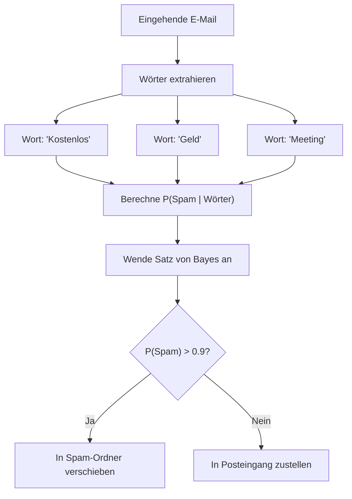
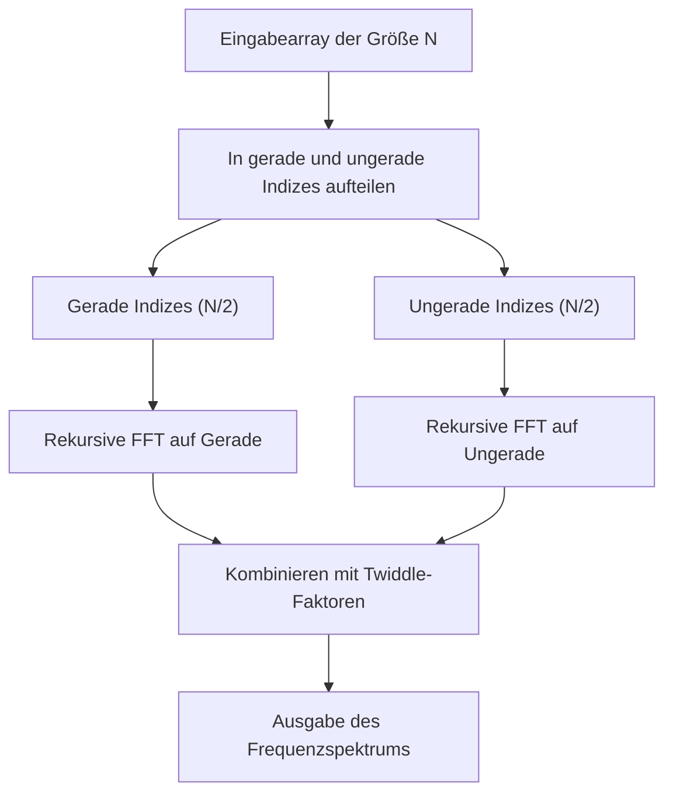
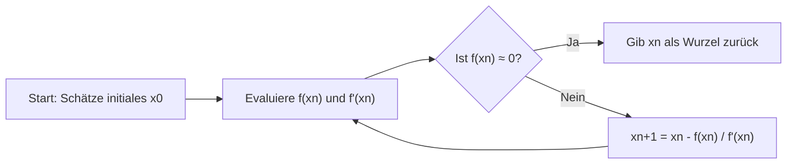
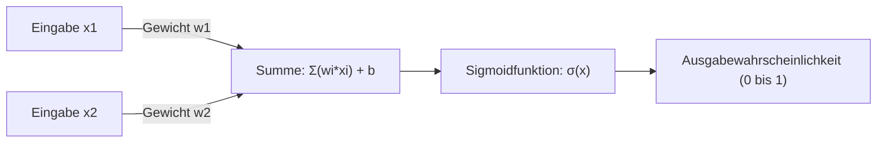

# Ein Muss für Mathe-Fans! 10 schöne mathematische Formeln für die Programmierung

Programmierung und Mathematik mögen auf den ersten Blick wie völlig unterschiedliche Bereiche erscheinen. Programmierung ist die Arbeit, logischen und konkreten Code zu schreiben, während Mathematik das Studium abstrakter und universeller Wahrheiten ist. Aber Mathematik liegt immer an der Basis der Informatik. Bei der Optimierung von Algorithmen, in der Datenwissenschaft, beim maschinellen Lernen, in der Computergrafik und sogar hinter alltäglichen Anwendungen wirken schöne mathematische Formeln leise und kraftvoll.

In diesem Artikel haben wir 10 mathematische Formeln sorgfältig ausgewählt, die nicht nur mathematisch schön sind, sondern auch eine sehr praktische und wichtige Rolle im Kontext der Programmierung und Algorithmen spielen. Wir werden tiefer in den mathematischen Hintergrund jeder Formel eintauchen und mit spezifischen Python- und C++-Code-Snippets sehr detailliert erklären, wie sie in der Programmierpraxis angewendet werden.

Willkommen in einer Welt, in der sich die Schönheit der Mathematik und die Praktikabilität der Programmierung kreuzen.

---

## 1. Eulersche Identität (Euler's Identity)

### Schönheit der Formel und Übersicht
Die Eulersche Identität wird oft als "der Schatz der Menschheit" oder "die schönste mathematische Formel der Welt" bezeichnet. Fünf der wichtigsten Konstanten der Mathematik (die Eulersche Zahl $e$, die imaginäre Einheit $i$, die Kreiszahl $\pi$, das neutrale Element der Multiplikation $1$ und das neutrale Element der Addition $0$) sind in einer einzigen, einfachen Gleichung vereint.

$$ e^{i\pi} + 1 = 0 $$

Diese Identität wird abgeleitet, indem man $\theta = \pi$ in die allgemeinere Eulersche Formel $e^{i\theta} = \cos\theta + i\sin\theta$ einsetzt.

### Anwendung in der Programmierung
In der Programmierung, insbesondere in der Computergrafik und Spieleentwicklung, ist die Eulersche Formel ein sehr mächtiges Werkzeug zur Behandlung von "Rotationen". Während die Rotation eines Punktes im 2D-Raum mit Matrixberechnungen durchgeführt werden kann, macht die Verwendung komplexer Zahlen die Berechnung extrem einfach und intuitiv. Da eine Rotation in der komplexen Ebene einfach durch die Multiplikation mit $e^{i\theta}$ erreicht werden kann, wird auch der Code kürzer.

### Implementierungsbeispiel (C++)
Das Folgende ist ein C++-Programm, das die Standardbibliothek `<complex>` verwendet, um einen Punkt auf einer 2D-Koordinate um einen bestimmten Winkel (im Bogenmaß) zu drehen.

```cpp
#include <iostream>
#include <complex>
#include <cmath>

// Typ-Alias zur Behandlung von 2D-Koordinaten als komplexe Zahlen
using Point2D = std::complex<double>;

// Funktion zum Drehen eines Punktes um den Ursprung um theta (Bogenmaß)
Point2D rotatePoint(const Point2D& point, double theta) {
    // Erstelle komplexe Zahl e^{i*theta} für die Rotation basierend auf Eulers Formel
    // Intern wird dies zu cos(theta) + i*sin(theta)
    Point2D rotation(std::cos(theta), std::sin(theta));
    
    // Wende die Rotation durch komplexe Multiplikation an
    return point * rotation;
}

int main() {
    // Anfangskoordinate (x=1.0, y=0.0)
    Point2D p(1.0, 0.0);
    
    // Um 90 Grad drehen (π/2 Bogenmaß)
    double theta = M_PI / 2.0;
    Point2D rotated_p = rotatePoint(p, theta);
    
    std::cout << "Original Point: (" << p.real() << ", " << p.imag() << ")\n";
    // Erwartete Ausgabe ist ungefähr (0, 1)
    std::cout << "Rotated Point: (" << rotated_p.real() << ", " << rotated_p.imag() << ")\n";
    
    return 0;
}
```

**Detaillierte Erklärung**:
Der Vorteil dieses Ansatzes besteht darin, dass die Berechnung der Rotationsmatrix (vier Multiplikationen und zwei Additionen) als Operation mit komplexen Zahlen gekapselt werden kann. Außerdem wird im 3D-Raum eine erweiterte Version dieses Konzepts namens "Quaternionen" verwendet. Durch die Verwendung von Quaternionen kann das fatale Problem des "Gimbal Lock", das bei Eulerwinkeln auftritt, vermieden und eine glatte sphärische lineare Interpolation (Slerp) erreicht werden.

---

## 2. Taylorreihe (Taylor Series)

### Schönheit der Formel und Übersicht
Die Taylorreihe ist eine mathematische Methode, um komplexe Funktionen (wie trigonometrische oder Exponentialfunktionen) als eine Summe einer unendlichen Folge von Polynomen darzustellen. Die Taylorreihe einer Funktion $f(x)$ um einen bestimmten Punkt $a$ ist wie folgt definiert:

$$ f(x) = \sum_{n=0}^\infty \frac{f^{(n)}(a)}{n!}(x-a)^n $$

Insbesondere wenn $a=0$ ist, wird sie als "Maclaurin-Reihe" bezeichnet.

### Anwendung in der Programmierung
Computer (CPUs und FPUs) können im Grunde nur die vier Grundrechenarten wie Addition, Subtraktion, Multiplikation und Division ausführen. Wie werden also `sin(x)` oder `exp(x)` berechnet? Während moderne Prozessoren oft den CORDIC-Algorithmus oder Chebyshev-Approximationen verwenden, ist die Taylorreihe (oder ihre Varianten) direkt nützlich, wenn man mathematische Funktionen auf Softwareebene implementiert oder eine eigene schnelle Näherungsfunktion mit reduzierter Genauigkeit aus Leistungsgründen erstellt.

### Implementierungsbeispiel (Python)
Unten ist ein Python-Code, der die Sinusfunktion mit Hilfe der Maclaurin-Reihe annähert.

$$ \sin(x) \approx x - \frac{x^3}{3!} + \frac{x^5}{5!} - \frac{x^7}{7!} + \dots $$

```python
import math

def taylor_sin(x, terms=10):
    """
    Nähert sin(x) unter Verwendung der Taylorreihe (Maclaurin-Reihe) an.
    
    :param x: Winkel (Bogenmaß)
    :param terms: Anzahl der zu berechnenden Terme (mehr bedeutet höhere Genauigkeit)
    :return: Angefäherter Wert von sin(x)
    """
    # Normalisiere x in den Bereich von -π bis π unter Nutzung der Periodizität (für bessere Genauigkeit)
    x = (x + math.pi) % (2 * math.pi) - math.pi
    
    result = 0.0
    for n in range(terms):
        # Verwende nur Terme mit ungeraden Exponenten: 2n + 1
        power = 2 * n + 1
        
        # Das Vorzeichen wechselt bei jedem Term: (-1)^n
        sign = (-1) ** n
        
        # Berechne die Fakultät
        fact = math.factorial(power)
        
        # Evaluiere und addiere den Term
        term = sign * (x ** power) / fact
        result += term
        
    return result

# Test
angle = math.radians(45) # 45 Grad = π/4
print(f"Math library sin: {math.sin(angle)}")
print(f"Taylor series sin: {taylor_sin(angle, terms=5)}")
```

**Detaillierte Erklärung**:
Im obigen Code wird der Eingabewert `x` in den Bereich $[-\pi, \pi]$ normalisiert. Dies liegt an der Eigenschaft der Taylorreihe, dass der Fehler schnell zunimmt, je weiter man sich vom Zentrum der Entwicklung (hier 0) entfernt (Abbruchfehler). Da unendliche Berechnungen in der Programmierung unmöglich sind, brechen wir die Berechnung bei endlichen `terms` ab. Der Schlüssel in der numerischen Programmierung liegt darin, den Kompromiss zwischen den dadurch verursachten "Rundungsfehlern" und "Abbruchfehlern" zu verwalten.

---

## 3. Satz von Bayes (Bayes' Theorem)

### Schönheit der Formel und Übersicht
Der Satz von Bayes ist ein Theorem zur Aktualisierung der Wahrscheinlichkeit eines Ereignisses (A-posteriori-Wahrscheinlichkeit) basierend auf Vorwissen, das mit diesem Ereignis zusammenhängt (A-priori-Wahrscheinlichkeit). Es ist eine der wichtigsten Formeln in der Wahrscheinlichkeitstheorie und Statistik.

$$ P(A|B) = \frac{P(B|A)P(A)}{P(B)} $$

Hier steht $P(A|B)$ für die Wahrscheinlichkeit, dass das Ereignis A eintritt, unter der Bedingung, dass das Ereignis B eingetreten ist (A-posteriori-Wahrscheinlichkeit).

### Anwendung in der Programmierung
In den Bereichen maschinelles Lernen und Datenwissenschaft wird es weithin als "Naive Bayes Klassifikator" (Naive Bayes Classifier) verwendet. Eine typische Anwendung ist die Spam-E-Mail-Filterung. Die Berechnung "Wie hoch ist die Wahrscheinlichkeit, dass diese E-Mail Spam ist, wenn sie das Wort 'Kostenlos' enthält?" wird dynamisch basierend auf vergangenen Daten berechnet.



### Implementierungsbeispiel (Python)
Dieser Code zeigt die grundlegende Logik eines Spam-Filters.

```python
def calculate_spam_probability(
    prob_spam, 
    prob_word_given_spam, 
    prob_word_given_ham
):
    """
    Berechnet die Wahrscheinlichkeit, dass eine E-Mail mit einem bestimmten Wort Spam ist, mithilfe des Satzes von Bayes.
    
    :param prob_spam: P(Spam) - A-priori-Wahrscheinlichkeit, dass eine E-Mail Spam ist
    :param prob_word_given_spam: P(Wort|Spam) - Wahrscheinlichkeit, dass ein Spam-Mail das Wort enthält
    :param prob_word_given_ham: P(Wort|Ham) - Wahrscheinlichkeit, dass eine normale E-Mail das Wort enthält
    :return: P(Spam|Wort) - Wahrscheinlichkeit, dass es sich um Spam handelt, wenn das Wort enthalten ist
    """
    # A-priori-Wahrscheinlichkeit für normale E-Mails P(Ham) = 1 - P(Spam)
    prob_ham = 1.0 - prob_spam
    
    # Auftrittswahrscheinlichkeit des Wortes in allen E-Mails P(Wort) = P(Wort|Spam)P(Spam) + P(Wort|Ham)P(Ham)
    # Dies folgt aus dem Gesetz der totalen Wahrscheinlichkeit
    prob_word = (prob_word_given_spam * prob_spam) + (prob_word_given_ham * prob_ham)
    
    # Satz von Bayes P(Spam|Wort) = P(Wort|Spam) * P(Spam) / P(Wort)
    if prob_word == 0:
        return 0.0 # Vermeidung von Division durch Null
        
    prob_spam_given_word = (prob_word_given_spam * prob_spam) / prob_word
    return prob_spam_given_word

# Beispiel: Wahrscheinlichkeit für das Wort "Gewinn"
# Vergangene Daten: 20% aller E-Mails sind Spam
p_spam = 0.2
# 80% des Spams enthalten das Wort "Gewinn"
p_win_given_spam = 0.8
# 1% der normalen E-Mails enthalten "Gewinn"
p_win_given_ham = 0.01

result = calculate_spam_probability(p_spam, p_win_given_spam, p_win_given_ham)
print(f"Wahrscheinlichkeit, dass eine E-Mail mit 'Gewinn' Spam ist: {result:.2%}")
```

**Detaillierte Erklärung**:
In der tatsächlichen Implementierung (beim Naive Bayes Klassifikator) werden die Wahrscheinlichkeiten mehrerer Wörter miteinander multipliziert. Wenn man jedoch Tausende von Wahrscheinlichkeiten (Werte von 0 bis 1) multipliziert, wird der Wert aufgrund der Grenzen der Fließkommadarstellung im Computer (Unterlauf) zu Null. Daher ist es in der Programmierpraxis eine wesentliche Technik, das Produkt der Wahrscheinlichkeiten in eine "Summe der Logarithmen" umzuwandeln (`log(a * b) = log(a) + log(b)`).

---

## 4. Shannon-Entropie (Shannon Entropy)

### Schönheit der Formel und Übersicht
Die von Claude Shannon, dem Vater der Informationstheorie, definierte "Entropie" ist eine Formel zur Quantifizierung der "Unsicherheit", "Zufälligkeit" oder des "durchschnittlichen Informationsgehalts" einer Informationsquelle.

$$ H(X) = - \sum_{i=1}^n P(x_i) \log_2 P(x_i) $$

### Anwendung in der Programmierung
Entropie ist unverzichtbar bei der Datenkomprimierung von Dateien (wie bei der Huffman-Codierung und der theoretischen Grenze von ZIP-Komprimierungsalgorithmen), bei der Bewertung der Stärke von Zufallszahlen in der Kryptographie und bei "Entscheidungsbaum"-Algorithmen (wie ID3 und C4.5) im maschinellen Lernen. Beim Aufbau eines Entscheidungsbaums finden wir das Merkmal, das bei der Aufteilung der Daten die größte Reduzierung der Entropie (Informationsgewinn, Information Gain) ergibt.

### Implementierungsbeispiel (Python)
Eine Funktion, die die Entropie einer Zeichenfolge (Datensatz) berechnet, um ihren Informationsgehalt zu bewerten.

```python
import math
from collections import Counter

def calculate_entropy(data):
    """
    Berechnet die Shannon-Entropie eines gegebenen Datensatzes (String oder Liste).
    """
    if not data:
        return 0.0
        
    # Zähle die Häufigkeit jedes Elements
    counts = Counter(data)
    total_len = len(data)
    
    entropy = 0.0
    for element, count in counts.items():
        # Auftrittswahrscheinlichkeit P(x_i)
        probability = count / total_len
        
        # - P(x_i) * log2(P(x_i))
        entropy -= probability * math.log2(probability)
        
    return entropy

# Test
# Bei lauter gleichen Zeichen ist die Unsicherheit 0
data_deterministic = "AAAAAAAAAA" 
# Bei zufälligen Zeichen ist die Unsicherheit hoch
data_random = "ABACBCBACB"

print(f"Entropy of '{data_deterministic}': {calculate_entropy(data_deterministic)}")
print(f"Entropy of '{data_random}': {calculate_entropy(data_random)}")
```

**Detaillierte Erklärung**:
Die Einheit der Entropie ist "Bits". Wenn die Entropie `1.5` ist, bedeutet dies, dass durchschnittlich mindestens 1.5 Bits pro Element benötigt werden, um die Daten darzustellen. Im Bereich der Programmierung wird sie routinemäßig als Benchmark zur Messung der Effizienz von Komprimierungsalgorithmen und als wichtiger Indikator für die Merkmalsauswahl in Modellen des maschinellen Lernens berechnet.

---

## 5. Schnelle Fourier-Transformation (Fast Fourier Transform - FFT)

### Schönheit der Formel und Übersicht
Die diskrete Fourier-Transformation (DFT), die ein Signal im Zeitbereich in ein Signal im Frequenzbereich umwandelt. Ihre Formel lautet wie folgt:

$$ X_k = \sum_{n=0}^{N-1} x_n e^{-i 2\pi k n / N} $$

Wenn diese DFT naiv berechnet wird, beträgt die Zeitkomplexität $O(N^2)$, wodurch die Berechnung bei zunehmender Datenmenge explosiv langsam wird. Der Algorithmus, der dies durch einen Teile-und-Herrsche-Ansatz dramatisch auf $O(N \log N)$ beschleunigt, ist die "Schnelle Fourier-Transformation (FFT)". Sie zählt zu den Top 10 der wichtigsten Algorithmen des 20. Jahrhunderts.



### Anwendung in der Programmierung
FFT ist eine unverzichtbare Technologie, die die moderne Gesellschaft unterstützt. Sie arbeitet überall: von Spracherkennung (Siri oder Alexa), Datenkomprimierung in MP3 oder JPEG/MPEG, digitaler Kommunikation wie LTE und Wi-Fi bis hin zur Multiplikation sehr großer ganzen Zahlen (Schönhage-Strassen-Algorithmus).

### Implementierungsbeispiel (Python)
Ein einfaches Implementierungsbeispiel eines rekursiven Cooley-Tukey-Algorithmus. (In der Praxis verwendet man hochoptimierte `FFTW`-Bibliotheken in C oder Assembler oder `numpy.fft`)

```python
import cmath

def fft(x):
    """
    Berechnet die eindimensionale Schnelle Fourier-Transformation (FFT) mit der Cooley-Tukey-Methode.
    Die Länge der Eingabeliste N muss eine Zweierpotenz sein.
    """
    N = len(x)
    
    # Basisfall
    if N <= 1:
        return x
        
    # Teile in Elemente mit geraden und ungeraden Indizes (Divide)
    even = fft(x[0::2])
    odd = fft(x[1::2])
    
    # Kombiniere die Ergebnisse (Conquer)
    T = [cmath.exp(-2j * cmath.pi * k / N) * odd[k] for k in range(N // 2)]
    
    # Nutze Symmetrie zur Reduzierung des Rechenaufwands
    return [even[k] + T[k] for k in range(N // 2)] + \
           [even[k] - T[k] for k in range(N // 2)]

# Test: Ein einfaches Signal
signal = [1.0, 1.0, 1.0, 1.0, 0.0, 0.0, 0.0, 0.0]
spectrum = fft(signal)

print("Frequency Spectrum (Magnitude):")
for k, val in enumerate(spectrum):
    # Berechne den absoluten Wert (Amplitude)
    print(f"Freq {k}: {abs(val):.3f}")
```

**Detaillierte Erklärung**:
Der Kern dieses Algorithmus liegt in der Ausnutzung der Symmetrie und Periodizität von komplexen Zahlen, den sogenannten "Rotationsfaktoren" (Twiddle factors). Dies vermeidet unnötige redundante Berechnungen und reduziert die für $N=1024$ benötigten Berechnungen von $1.048.576$ auf nur etwa $10.240$. Man kann wahrlich von einem Wunder sprechen, das aus der Verschmelzung von Mathematik und Algorithmen entstanden ist.

---

## 6. Haversine-Formel (Haversine Formula)

### Schönheit der Formel und Übersicht
Dies ist eine Formel zur Berechnung der kürzesten Entfernung (Großkreisdistanz) zwischen zwei Punkten auf einer Kugeloberfläche, wie der der Erde.

$$ a = \sin^2\left(\frac{\Delta\phi}{2}\right) + \cos\phi_1 \cos\phi_2 \sin^2\left(\frac{\Delta\lambda}{2}\right) $$
$$ c = 2\cdot \text{atan2}\left(\sqrt{a}, \sqrt{1-a}\right) $$
$$ d = R \cdot c $$

(Hier sind $\phi$ der Breitengrad, $\lambda$ der Längengrad und $R$ der Erdradius)

### Anwendung in der Programmierung
Es ist eine essenzielle Formel zur Berechnung der Entfernung zwischen zwei Breiten- und Längengradkoordinaten in GPS-Tracking-Apps und ortsbasierten Diensten wie Uber oder Pokémon GO. Bei der Berechnung linearer Entfernungen mit dem Satz des Pythagoras kann die Krümmung der Erde nicht berücksichtigt werden, was bei großen Entfernungen zu erheblichen Fehlern führt.

### Implementierungsbeispiel (Python)
Eine Funktion, die zwei Koordinaten (Breiten- und Längengrad) entgegennimmt und ihre Entfernung in Kilometern zurückgibt.

```python
import math

def haversine_distance(lat1, lon1, lat2, lon2):
    """
    Berechnet die Großkreisdistanz zwischen zwei Punkten mit der Haversine-Formel.
    """
    # Mittlerer Erdradius (in Kilometern)
    R = 6371.0 
    
    # Konvertiere Breitengrad/Längengrad von Grad in Bogenmaß
    phi1, phi2 = math.radians(lat1), math.radians(lat2)
    delta_phi = math.radians(lat2 - lat1)
    delta_lambda = math.radians(lon2 - lon1)
    
    # Haversine-Berechnung
    a = math.sin(delta_phi / 2.0)**2 + \
        math.cos(phi1) * math.cos(phi2) * \
        math.sin(delta_lambda / 2.0)**2
        
    c = 2 * math.atan2(math.sqrt(a), math.sqrt(1 - a))
    
    # Entfernungsberechnung
    distance = R * c
    return distance

# Entfernung vom Tokyo Tower (35.6586, 139.7454) zur Freiheitsstatue (40.6892, -74.0445)
tokyo = (35.6586, 139.7454)
ny = (40.6892, -74.0445)

dist = haversine_distance(tokyo[0], tokyo[1], ny[0], ny[1])
print(f"Entfernung vom Tokyo Tower zur Freiheitsstatue: ca. {dist:.2f} km")
```

**Detaillierte Erklärung**:
Es gibt auch Methoden, die den Kosinussatz der sphärischen Trigonometrie verwenden. Wenn die Entfernung zwischen zwei Punkten jedoch sehr gering ist (z.B. im Meterbereich), kommt es leicht zu Auslöschungen ("Catastrophic cancellation") in der Gleitkommagenauigkeit. Der große programmiertechnische Vorteil der Haversine-Formel besteht darin, dass sie durch die Verwendung von `sin^2` numerisch stabile Berechnungen auch für sehr kleine Entfernungen ermöglicht. Wenn eine noch höhere Genauigkeit erforderlich ist, werden die Vincenty-Formeln (Vincenty's formulae) verwendet, die die Erde als Ellipsoid modellieren.

---

## 7. Newton-Raphson-Verfahren (Newton-Raphson Method)

### Schönheit der Formel und Übersicht
Es ist ein sehr mächtiger Wurzelsuchalgorithmus, der Tangenten verwendet, um die Lösung (Wurzel) der Gleichung $f(x) = 0$ iterativ zu finden.

$$ x_{n+1} = x_n - \frac{f(x_n)}{f'(x_n)} $$

Anhand des Funktionswertes $f(x_n)$ und seiner Steigung (Ableitung) $f'(x_n)$ an der aktuellen Position $x_n$ leitet das Verfahren die nächste, genauere Position $x_{n+1}$ ab, die untersucht werden soll.



### Anwendung in der Programmierung
Wird in der Rendering-Pipeline von Grafik-Engines, bei Kollisionserkennungen in physikalischen Simulationen und bei Optimierungsproblemen verwendet. Ein bemerkenswertes Beispiel ist die "Schnelle inverse Quadratwurzel" (Fast Inverse Square Root), die im Quellcode des legendären FPS-Spiels "Quake III Arena" eingebettet war. Dies war ein Hack, der die Newton-Methode nur einmal anwandte, um $1/\sqrt{x}$ extrem schnell zu berechnen, was für die Vektornormalisierung unerlässlich war.

### Implementierungsbeispiel (C++)
Hier ist ein leicht verständliches Beispiel zur Berechnung der quadratischen Standardwurzel $\sqrt{N}$ (also der Lösung von $x^2 - N = 0$) mit dem Newton-Verfahren. Es ist $f(x) = x^2 - N$ und $f'(x) = 2x$.

```cpp
#include <iostream>
#include <cmath>

double newton_sqrt(double N, double tolerance = 1e-7) {
    if (N < 0) return NAN; // Quadratwurzel einer negativen Zahl ist NaN
    if (N == 0) return 0;
    
    // Initialer Schätzwert (wir beginnen mit N selbst)
    double x = N; 
    
    while (true) {
        // Berechne den nächsten Schätzwert: x_new = x - (x^2 - N) / (2x) = (x + N/x) / 2
        double x_new = 0.5 * (x + N / x);
        
        // Wenn die Änderung kleiner als die zulässige Toleranz ist, gilt sie als konvergiert
        if (std::abs(x - x_new) < tolerance) {
            break;
        }
        x = x_new;
    }
    
    return x;
}

int main() {
    double number = 612.0;
    std::cout << "Square root of " << number << " is: " << newton_sqrt(number) << "\n";
    return 0;
}
```

**Detaillierte Erklärung**:
Der größte Reiz der Newton-Methode liegt darin, dass sie bei Vorliegen der richtigen Bedingungen eine "quadratische Konvergenz" (Quadratic convergence) aufweist. Dies bedeutet eine erstaunliche Konvergenzgeschwindigkeit, bei der sich die Anzahl der korrekten Ziffern mit jeder Iteration etwa verdoppelt. Wenn man bedenkt, dass die binäre Suche (Binary Search) eine lineare Konvergenz hat, wird die Leistungsfähigkeit der Nutzung von Informationen über die Ableitung (winzige Steigungen) deutlich. Im Hack von "Quake III" wurde der anfängliche Schätzwert für dieses Newton-Verfahren mit erstaunlicher Genauigkeit abgeleitet, indem die IEEE 754-Gleitkommastruktur mithilfe der magischen Zahl `0x5f3759df` auf Bit-Ebene gehackt wurde.

---

## 8. Bézierkurven (Bézier Curves)

### Schönheit der Formel und Übersicht
Es handelt sich um eine parametrische Gleichung, die eine glatte Kurve mithilfe mehrerer Kontrollpunkte (Control Points) definiert. Die am häufigsten verwendete kubische Bézierkurve (Cubic Bézier Curve) hat vier Punkte $P_0, P_1, P_2, P_3$ und bestimmt die Koordinate $B(t)$ auf der Kurve durch den Parameter $t \ (0 \le t \le 1)$.

$$ B(t) = (1-t)^3 P_0 + 3(1-t)^2 t P_1 + 3(1-t) t^2 P_2 + t^3 P_3 $$

### Anwendung in der Programmierung
Bézierkurven bilden das Rückgrat der Computergrafik. Sie werden verwendet, um jede "glatte Bewegung oder Form" programmatisch zu zeichnen, wie z.B. in Vektorzeichenprogrammen wie Adobe Illustrator, beim Rendern von Schriftarten (TrueType und OpenType), bei CSS-`cubic-bezier()`-Übergängen und Easing-Funktionen für Animationen, sowie zur Steuerung von Kamerapfaden in Spielen.

### Implementierungsbeispiel (Python)
Code zur Generierung einer Reihe von Punkten auf einer kubischen Bézierkurve aus vier Kontrollpunkten.

```python
def cubic_bezier(p0, p1, p2, p3, steps=10):
    """
    Generiert eine Liste von Koordinaten auf einer kubischen Bézierkurve.
    p0, p1, p2, p3 sind (x, y) Tupel.
    steps bestimmt, in wie viele Segmente die Kurve unterteilt wird.
    """
    curve_points = []
    
    for i in range(steps + 1):
        # Der Parameter t variiert zwischen 0.0 und 1.0
        t = i / steps
        
        # Berechnung der Koeffizienten, aus denen die Formel besteht
        u = 1 - t
        tt = t * t
        uu = u * u
        uuu = uu * u
        ttt = tt * t
        
        # Berechne x- und y-Koordinaten jeweils für die Punkte
        x = (uuu * p0[0]) + \
            (3 * uu * t * p1[0]) + \
            (3 * u * tt * p2[0]) + \
            (ttt * p3[0])
            
        y = (uuu * p0[1]) + \
            (3 * uu * t * p1[1]) + \
            (3 * u * tt * p2[1]) + \
            (ttt * p3[1])
            
        curve_points.append((x, y))
        
    return curve_points

# Startpunkt, Kontrollpunkt 1, Kontrollpunkt 2, Endpunkt
p0 = (0, 0)
p1 = (5, 10)
p2 = (15, 10)
p3 = (20, 0)

points = cubic_bezier(p0, p1, p2, p3, steps=5)
for i, pt in enumerate(points):
    print(f"t={i/5:.1f} -> Point({pt[0]:.2f}, {pt[1]:.2f})")
```

**Detaillierte Erklärung**:
Diese Formel ist eine Erweiterung des "De-Casteljau-Algorithmus", der lineare Interpolation (Lerp) rekursiv anwendet. Die Lösung wird direkt durch Polynomrechnung (Bernstein-Polynome) gefunden. Beim Programmieren wird eine Kurve als eine Sammlung von unzähligen "winzigen geraden Linien" gezeichnet und angenähert. Durch Anpassen der Auflösung (steps) von $t$ können wir also das Gleichgewicht zwischen Leistung und Darstellungsqualität steuern.

---

## 9. Sigmoidfunktion (Sigmoid Function)

### Schönheit der Formel und Übersicht
Eine glatte, S-förmige Funktion, die jede reelle Eingabe $x \ ( -\infty < x < \infty )$ zuverlässig in einen Wert zwischen $0$ und $1$ komprimiert ("quetscht").

$$ \sigma(x) = \frac{1}{1 + e^{-x}} $$

### Anwendung in der Programmierung
Sie hat historisch gesehen eine sehr wichtige Rolle bei der logistischen Regression und als "Aktivierungsfunktion" in neuronalen Netzen (Deep Learning) gespielt. Da die Ausgabe in den Bereich von 0 bis 1 fällt, besteht ihr größter Vorteil darin, dass das Ergebnis als "Wahrscheinlichkeit" interpretiert werden kann.



### Implementierungsbeispiel (Python)
Code zur Anwendung der Sigmoidfunktion auf ein eingegebenes Array (Tensor).

```python
import math

def sigmoid(x):
    """Sigmoid-Berechnung für einen einzelnen Wert"""
    # Oft wird die Eingabe begrenzt, um einen Überlauf von math.exp(-x) zu verhindern
    # Standardimplementierung zur Vereinfachung
    if x >= 0:
        return 1.0 / (1.0 + math.exp(-x))
    else:
        # Überlaufschutz bei einem großen negativen Wert von x
        return math.exp(x) / (1.0 + math.exp(x))

def apply_sigmoid(array):
    """Wendet die Sigmoidfunktion auf alle Elemente in einem Array an"""
    return [sigmoid(x) for x in array]

# Rohdaten (Logits) aus der Ausgabeschicht eines neuronalen Netzwerks
logits = [-5.0, -1.0, 0.0, 1.0, 5.0]
probabilities = apply_sigmoid(logits)

for val, prob in zip(logits, probabilities):
    print(f"Input: {val:4.1f} -> Probability: {prob:.4f}")
```

**Detaillierte Erklärung**:
Die Verzweigung des obigen Codes mit `x >= 0` und anderen Werten dient dazu, "Überläufe" zu verhindern, ein programmierspezifisches Problem. Dies ist eine numerische Technik, die verhindert, dass das Programm abstürzt (oder Inf zurückgibt), wenn man versucht, bei $x = -1000$ beispielsweise $e^{1000}$ zu berechnen. Heutzutage ist ReLU ($f(x) = \max(0, x)$) in den verborgenen Schichten von Deep Learning wegen Berechnungsgeschwindigkeit und dem Problem des verschwindenden Gradienten der Mainstream, aber in der Ausgabeschicht der binären Klassifikation behält die Sigmoidfunktion nach wie vor ihre unerschütterliche Position.

---

## 10. Euklidischer Abstand und Satz des Pythagoras (Euclidean Distance & Pythagorean Theorem)

### Schönheit der Formel und Übersicht
Es ist die Grundlage der aus dem antiken Griechenland überlieferten Geometrie und die Formel, die den geradlinigen Abstand zwischen zwei Punkten in einem $n$-dimensionalen Raum definiert. Im zweidimensionalen Raum ist es der Satz des Pythagoras ($a^2 + b^2 = c^2$) selbst.

Der euklidische Abstand $d$ zwischen den Punkten $P(x_1, y_1, z_1)$ und $Q(x_2, y_2, z_2)$ in einem 3D-Raum wird wie folgt ausgedrückt:

$$ d = \sqrt{(x_2-x_1)^2 + (y_2-y_1)^2 + (z_2-z_1)^2} $$

### Anwendung in der Programmierung
Es ist die Kernberechnung bei jeder Spieleentwicklung, in Physik-Engines und in Machine-Learning-Algorithmen wie "k-Nearest Neighbors" (K-Nächste Nachbarn) und Clustering (K-Means). In Spielen wird es millionenfach pro Frame berechnet, beispielsweise bei der Kollisionserkennung zwischen Charakteren (Bounding Circle / Sphere Collision).

### Implementierungsbeispiel (C++)
Dies ist optimierter Code, um zu bestimmen, ob zwei Kreise (Kugeln) kollidieren.

```cpp
#include <iostream>
#include <cmath>

struct Circle {
    double x, y; // Mittelpunktkoordinaten
    double radius; // Radius
};

// Funktion um festzustellen, ob zwei Kreise kollidieren
bool isColliding(const Circle& a, const Circle& b) {
    // Differenz (Delta) von x- und y-Koordinaten
    double dx = b.x - a.x;
    double dy = b.y - a.y;
    
    // Berechne das "Quadrat" der Entfernung
    double distanceSquared = (dx * dx) + (dy * dy);
    
    // Berechne das "Quadrat" der Summe der Radien
    double radiiSum = a.radius + b.radius;
    double radiiSumSquared = radiiSum * radiiSum;
    
    // Vergleiche das Quadrat der Entfernung mit dem Quadrat der Radiensumme
    return distanceSquared <= radiiSumSquared;
}

int main() {
    Circle player = {0.0, 0.0, 5.0};
    Circle enemy1 = {8.0, 0.0, 4.0}; // Abstand 8, Radiensumme 9 -> Kollision
    Circle enemy2 = {10.0, 10.0, 2.0}; // Abstand ca. 14.1, Radiensumme 7 -> Keine Kollision
    
    std::cout << "Collision with enemy1: " << (isColliding(player, enemy1) ? "Yes" : "No") << "\n";
    std::cout << "Collision with enemy2: " << (isColliding(player, enemy2) ? "Yes" : "No") << "\n";
    
    return 0;
}
```

**Detaillierte Erklärung**:
Wenn man streng nach der mathematischen Formel berechnet, muss man am Ende die Quadratwurzel $\sqrt{\cdot}$ ziehen, aber beim Programmieren ist der Aufruf der Funktion `sqrt()` eine sehr schwere Operation für die CPU (die viele Taktzyklen verbraucht). Wenn Sie also nur Entfernungen vergleichen möchten, ist es in der Spieleprogrammierung gängige Praxis, **die quadrierten Werte beider Seiten direkt zu vergleichen** (`distanceSquared <= radiiSumSquared`). Eine solche Optimierung, die die Berechnungslast unter Ausnutzung der Eigenschaften mathematischer Gleichungen oder Ungleichungen reduziert, ist der eigentliche Reiz des Algorithmus-Designs.

---

## Fazit

Wie war das? Von der Eulerschen Identität bis zum Satz des Pythagoras sind diese 10 Formeln nicht bloß theoretische Konzepte in einem Lehrbuch. Hinter dem Code, den wir täglich schreiben, pulsieren sie als das "Herz", das Daten komprimiert, maschinelle Lernmodelle Vorhersagen treffen lässt, weiche Animationen rendert und blitzschnelle Suchen ermöglicht.

Das Verständnis des mathematischen Hintergrunds ist essenziell für den Aufstieg von einem Programmierer, der nur existierende Bibliotheken (wie `math.sin` oder `numpy.fft`) aufruft, zu einem Ingenieur, der deren interne Strukturen begreift und ihre Grenzen ausreizen kann. Wenn Sie das nächste Mal Code schreiben, versuchen Sie sich vorzustellen, welch schöne mathematische Formel im Hintergrund am Werk ist.

**Happy Coding and Math!**
