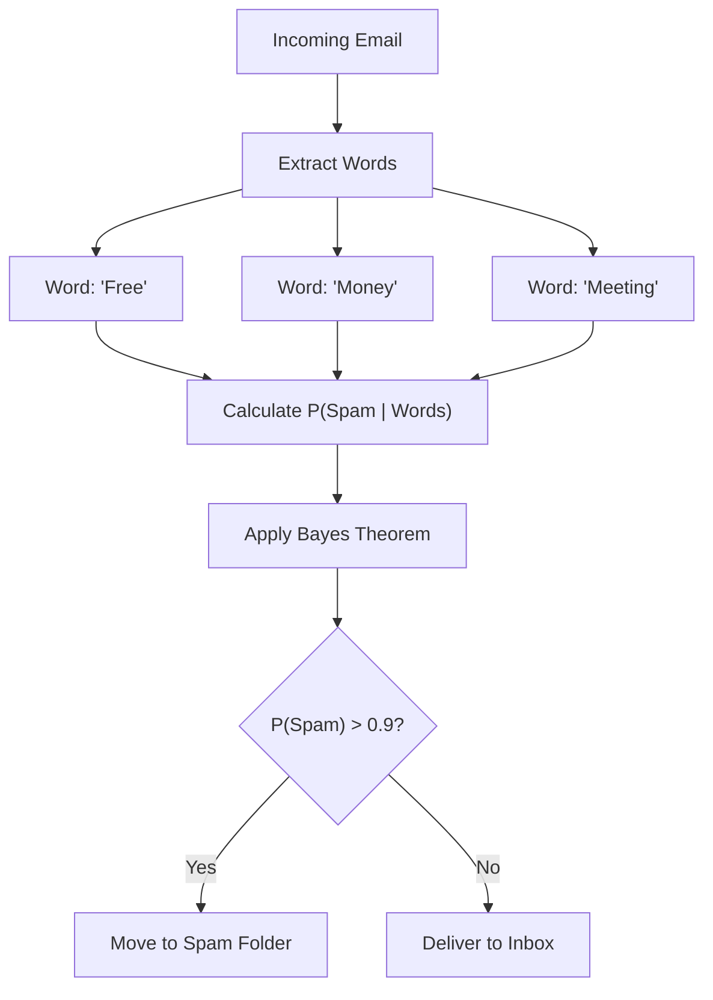
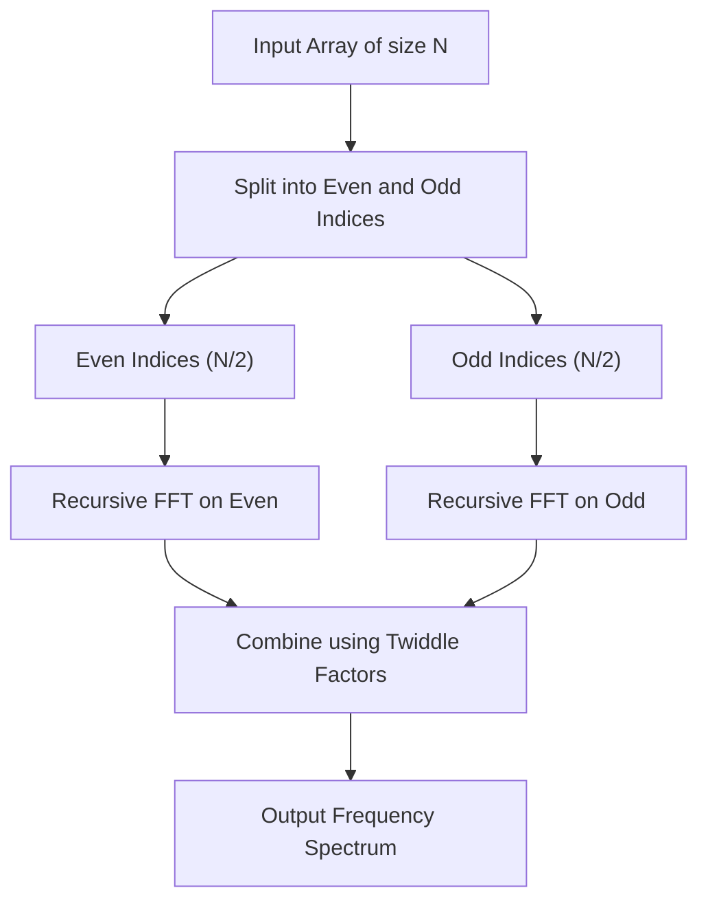
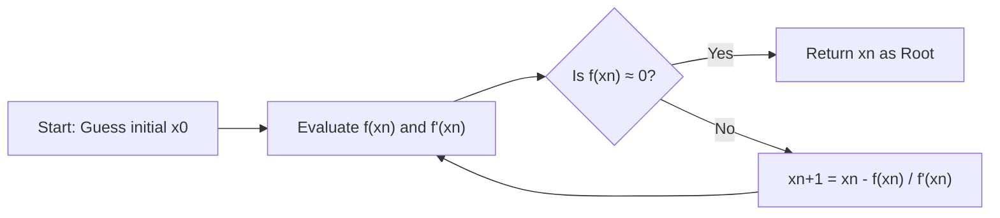
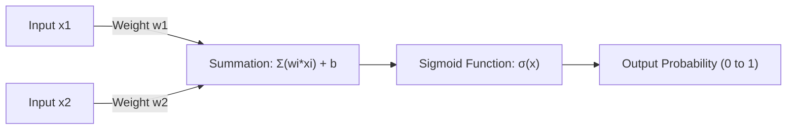

# A Must-See for Math Lovers! 10 Beautiful Math Formulas Useful for Programming

At first glance, programming and mathematics might seem like completely different fields. Programming is the act of writing logical and concrete code, while mathematics is the study of abstract and universal truths. However, mathematics is always at the foundation of computer science. Beautiful mathematical formulas work quietly and powerfully behind the scenes of algorithm optimization, data science, machine learning, computer graphics, and even everyday applications.

In this article, we have carefully selected 10 mathematical formulas that are not only mathematically beautiful but also highly practical and play crucial roles in the context of programming and algorithms. We will delve deeply into the mathematical background of each formula and explain in detail how they are applied in practical programming, using concrete Python and C++ code snippets.

Welcome to the world where the beauty of mathematics intersects with the practicality of programming.

---

## 1. Euler's Identity

### Beauty and Overview of the Formula
This is Euler's identity, hailed as the "jewel of humanity" and the "most beautiful formula in the world". Five of the most important constants in mathematics (Napier's constant $e$, the imaginary unit $i$, pi $\pi$, the multiplicative identity $1$, and the additive identity $0$) are unified into a single simple equation.

$$ e^{i\pi} + 1 = 0 $$

This identity is derived by substituting $\theta = \pi$ into the more general Euler's formula $e^{i\theta} = \cos\theta + i\sin\theta$.

### Applications in Programming
In programming, especially in computer graphics and game development, Euler's formula becomes a very powerful tool for handling "rotations". While rotating points in a 2D space can be done using matrix calculations, using complex numbers makes the calculation extremely simple and intuitive. Rotation on the complex plane can be achieved simply by multiplying by $e^{i\theta}$, which also simplifies the code.

### Implementation Example (C++)
Below is a program that uses the C++ standard library `<complex>` to rotate a point on 2D coordinates by a specified angle (in radians).

```cpp
#include <iostream>
#include <complex>
#include <cmath>

// Type alias to treat 2D coordinates as complex numbers
using Point2D = std::complex<double>;

// Function to rotate a point around the origin by theta (radians)
Point2D rotatePoint(const Point2D& point, double theta) {
    // Based on Euler's formula, create a complex number e^{i*theta} for rotation
    // Internally this is cos(theta) + i*sin(theta)
    Point2D rotation(std::cos(theta), std::sin(theta));
    
    // Apply rotation by multiplying complex numbers
    return point * rotation;
}

int main() {
    // Initial coordinate (x=1.0, y=0.0)
    Point2D p(1.0, 0.0);
    
    // Rotate 90 degrees (π/2 radians)
    double theta = M_PI / 2.0;
    Point2D rotated_p = rotatePoint(p, theta);
    
    std::cout << "Original Point: (" << p.real() << ", " << p.imag() << ")\n";
    // Expected output is approximately (0, 1)
    std::cout << "Rotated Point: (" << rotated_p.real() << ", " << rotated_p.imag() << ")\n";
    
    return 0;
}
```

**Detailed Explanation**:
The advantage of this approach lies in encapsulating the rotation matrix calculation (4 multiplications and 2 additions) into a complex number operation. Furthermore, in 3D space, an extension of this concept called "quaternions" is used. By using quaternions, we can avoid the fatal problem of "Gimbal Lock" that occurs with Euler angles and achieve smooth spherical linear interpolation (Slerp).

---

## 2. Taylor Series

### Beauty and Overview of the Formula
The Taylor series is a mathematical technique for expressing complex functions (such as trigonometric and exponential functions) as an infinite sum of polynomial terms. The Taylor series of a function $f(x)$ around a point $a$ is defined as follows:

$$ f(x) = \sum_{n=0}^\infty \frac{f^{(n)}(a)}{n!}(x-a)^n $$

The specific case where $a=0$ is called the "Maclaurin series".

### Applications in Programming
Computers (CPUs and FPUs) are essentially only capable of executing the four basic arithmetic operations: addition, subtraction, multiplication, and division. So, how are `sin(x)` and `exp(x)` calculated? Modern processors often use algorithms like CORDIC or Chebyshev approximation, but when implementing mathematical functions at the software level or creating custom fast approximation functions with reduced precision for performance, the Taylor series (or its variants) is directly useful.

### Implementation Example (Python)
Below is a Python code that approximates the sine function using the Maclaurin series.

$$ \sin(x) \approx x - \frac{x^3}{3!} + \frac{x^5}{5!} - \frac{x^7}{7!} + \dots $$

```python
import math

def taylor_sin(x, terms=10):
    """
    Approximates sin(x) using the Taylor series (Maclaurin series).
    
    :param x: Angle in radians
    :param terms: Number of terms to calculate (higher means more accurate)
    :return: Approximated value of sin(x)
    """
    # Normalize x to the range of -π to π using periodicity (for better accuracy)
    x = (x + math.pi) % (2 * math.pi) - math.pi
    
    result = 0.0
    for n in range(terms):
        # Use only odd-numbered terms: 2n + 1
        power = 2 * n + 1
        
        # The sign alternates for each term: (-1)^n
        sign = (-1) ** n
        
        # Calculate factorial
        fact = math.factorial(power)
        
        # Evaluate the term and add it to the result
        term = sign * (x ** power) / fact
        result += term
        
    return result

# Test
angle = math.radians(45) # 45 degrees = π/4
print(f"Math library sin: {math.sin(angle)}")
print(f"Taylor series sin: {taylor_sin(angle, terms=5)}")
```

**Detailed Explanation**:
In the code above, the input value `x` is normalized to the range $[-\pi, \pi]$. This is because the Taylor series has a property (truncation error) where the error grows rapidly the further it gets from the center of expansion (0 in this case). Since infinite computation is impossible in programming, the calculation is cut off at a finite number of `terms`, but managing the trade-off between the resulting "rounding error" and "truncation error" is the key to numerical programming.

---

## 3. Bayes' Theorem

### Beauty and Overview of the Formula
Bayes' theorem is a theorem for updating the probability of an event (posterior probability) based on prior knowledge (prior probability) related to that event. It is one of the most important formulas in probability theory and statistics.

$$ P(A|B) = \frac{P(B|A)P(A)}{P(B)} $$

Here, $P(A|B)$ represents the probability that event A occurs given that event B has occurred (posterior probability).

### Applications in Programming
It is widely utilized in the fields of machine learning and data science as the "Naive Bayes Classifier". A typical application example is spam email filtering. It dynamically calculates things like, "If this email contains the word 'free', what is the probability that it is spam?", based on past data.



### Implementation Example (Python)
Here is the code showing the basic logic of a spam filter.

```python
def calculate_spam_probability(
    prob_spam, 
    prob_word_given_spam, 
    prob_word_given_ham
):
    """
    Calculates the probability that an email containing a certain word is spam using Bayes' Theorem.
    
    :param prob_spam: P(Spam) - Prior probability that an email is spam
    :param prob_word_given_spam: P(Word|Spam) - Probability that a spam email contains the word
    :param prob_word_given_ham: P(Word|Ham) - Probability that a regular email contains the word
    :return: P(Spam|Word) - Probability that the email is spam given that it contains the word
    """
    # Prior probability of regular email P(Ham) = 1 - P(Spam)
    prob_ham = 1.0 - prob_spam
    
    # Probability of the word appearing in all emails P(Word) = P(Word|Spam)P(Spam) + P(Word|Ham)P(Ham)
    # This is based on the Law of Total Probability
    prob_word = (prob_word_given_spam * prob_spam) + (prob_word_given_ham * prob_ham)
    
    # Bayes' Theorem P(Spam|Word) = P(Word|Spam) * P(Spam) / P(Word)
    if prob_word == 0:
        return 0.0 # Avoid division by zero
        
    prob_spam_given_word = (prob_word_given_spam * prob_spam) / prob_word
    return prob_spam_given_word

# Example: Probability for the word "winner"
# Past data: 20% of all emails are spam
p_spam = 0.2
# 80% of spam contains "winner"
p_win_given_spam = 0.8
# 1% of regular emails contains "winner"
p_win_given_ham = 0.01

result = calculate_spam_probability(p_spam, p_win_given_spam, p_win_given_ham)
print(f"Probability that an email containing 'winner' is spam: {result:.2%}")
```

**Detailed Explanation**:
In actual implementations (Naive Bayes Classifier), probabilities of multiple words are multiplied together. However, multiplying probabilities (values from 0 to 1) thousands of times results in values becoming zero due to the limits of floating-point representation in computers (underflow). Therefore, in practical programming, transforming the product of probabilities into a "sum of logarithms" (`log(a * b) = log(a) + log(b)`) is used as an essential technique.

---

## 4. Shannon Entropy

### Beauty and Overview of the Formula
Defined by Claude Shannon, the father of information theory, "Entropy" is a mathematical formula that quantifies the "uncertainty", "randomness", or "average information content" of an information source.

$$ H(X) = - \sum_{i=1}^n P(x_i) \log_2 P(x_i) $$

### Applications in Programming
Entropy is indispensable in file data compression (such as the theoretical limits for Huffman coding and the ZIP compression algorithm), evaluating the strength of random numbers in cryptography, and in algorithms for "Decision Trees" in machine learning (like ID3 and C4.5). In constructing decision trees, we search for the feature that maximizes the reduction in entropy (Information Gain) when the data is split.

### Implementation Example (Python)
A function to calculate the entropy of a string (dataset) and evaluate its information content.

```python
import math
from collections import Counter

def calculate_entropy(data):
    """
    Calculates the Shannon entropy of a given dataset (string or list).
    """
    if not data:
        return 0.0
        
    # Count the occurrences of each element
    counts = Counter(data)
    total_len = len(data)
    
    entropy = 0.0
    for element, count in counts.items():
        # Probability of occurrence P(x_i)
        probability = count / total_len
        
        # - P(x_i) * log2(P(x_i))
        entropy -= probability * math.log2(probability)
        
    return entropy

# Test
# Uncertainty is 0 if all characters are the same
data_deterministic = "AAAAAAAAAA" 
# Uncertainty is high for random characters
data_random = "ABACBCBACB"

print(f"Entropy of '{data_deterministic}': {calculate_entropy(data_deterministic)}")
print(f"Entropy of '{data_random}': {calculate_entropy(data_random)}")
```

**Detailed Explanation**:
The unit of entropy is "bits". If the entropy is `1.5`, it means that an average of at least 1.5 bits per element is required to represent that data. In programming fields, it is routinely calculated as a benchmark to measure the efficiency of compression algorithms and as a crucial metric for feature selection in machine learning models.

---

## 5. Fast Fourier Transform (FFT)

### Beauty and Overview of the Formula
The Discrete Fourier Transform (DFT) converts a time-domain signal into a frequency-domain signal. Its mathematical formula is as follows:

$$ X_k = \sum_{n=0}^{N-1} x_n e^{-i 2\pi k n / N} $$

If you compute this DFT naively, the time complexity is $O(N^2)$, and calculations become explosively slow as the amount of data increases. The "Fast Fourier Transform (FFT)" is an algorithm that dramatically speeds this up to $O(N \log N)$ using a divide-and-conquer approach. It is counted among the top 10 most important algorithms of the 20th century.



### Applications in Programming
FFT is an essential technology supporting modern society. It is running everywhere, from speech recognition (Siri or Alexa), data compression like MP3 or JPEG/MPEG, digital communications like LTE and Wi-Fi, to even multiplying extremely large integers (Schönhage-Strassen algorithm).

### Implementation Example (Python)
A simple implementation example of the recursive Cooley-Tukey algorithm. (*In practice, you would use highly optimized `FFTW` libraries in C or assembly, or `numpy.fft`*)

```python
import cmath

def fft(x):
    """
    Computes the 1D Fast Fourier Transform (FFT) (Cooley-Tukey algorithm).
    The length of the input list N must be a power of 2.
    """
    N = len(x)
    
    # Base case
    if N <= 1:
        return x
        
    # Divide into even and odd indexed elements (Divide)
    even = fft(x[0::2])
    odd = fft(x[1::2])
    
    # Combine results (Conquer)
    T = [cmath.exp(-2j * cmath.pi * k / N) * odd[k] for k in range(N // 2)]
    
    # Exploit symmetry to reduce computational cost
    return [even[k] + T[k] for k in range(N // 2)] + \
           [even[k] - T[k] for k in range(N // 2)]

# Test: Simple signal
signal = [1.0, 1.0, 1.0, 1.0, 0.0, 0.0, 0.0, 0.0]
spectrum = fft(signal)

print("Frequency Spectrum (Magnitude):")
for k, val in enumerate(spectrum):
    # Calculate absolute value (amplitude)
    print(f"Freq {k}: {abs(val):.3f}")
```

**Detailed Explanation**:
The core of this algorithm lies in exploiting the symmetry and periodicity of complex numbers called "Twiddle factors". This eliminates the waste of duplicate calculations, reducing the required number of operations from $1,048,576$ to just about $10,240$ when $N=1024$. It can truly be called a miracle born from the fusion of mathematics and algorithms.

---

## 6. Haversine Formula

### Beauty and Overview of the Formula
This is a formula used to calculate the shortest distance (great-circle distance) between two points on a sphere, such as the surface of the Earth.

$$ a = \sin^2\left(\frac{\Delta\phi}{2}\right) + \cos\phi_1 \cos\phi_2 \sin^2\left(\frac{\Delta\lambda}{2}\right) $$
$$ c = 2\cdot \text{atan2}\left(\sqrt{a}, \sqrt{1-a}\right) $$
$$ d = R \cdot c $$

(Here, $\phi$ is the latitude, $\lambda$ is the longitude, and $R$ is the Earth's radius)

### Applications in Programming
This is an essential formula used in GPS tracking apps, and location-based services like Uber or Pokémon GO, when calculating the distance between two latitude/longitude coordinates. If you use the Pythagorean theorem to calculate linear distance, it cannot account for the Earth's curvature, resulting in large errors over long distances.

### Implementation Example (Python)
A function that takes two coordinates (latitude and longitude) and returns the distance (in kilometers).

```python
import math

def haversine_distance(lat1, lon1, lat2, lon2):
    """
    Calculates the great-circle distance between two points using the Haversine formula.
    """
    # Average radius of the Earth (in kilometers)
    R = 6371.0 
    
    # Convert latitude and longitude from degrees to radians
    phi1, phi2 = math.radians(lat1), math.radians(lat2)
    delta_phi = math.radians(lat2 - lat1)
    delta_lambda = math.radians(lon2 - lon1)
    
    # Haversine calculation
    a = math.sin(delta_phi / 2.0)**2 + \
        math.cos(phi1) * math.cos(phi2) * \
        math.sin(delta_lambda / 2.0)**2
        
    c = 2 * math.atan2(math.sqrt(a), math.sqrt(1 - a))
    
    # Calculate distance
    distance = R * c
    return distance

# Distance from Tokyo Tower (35.6586, 139.7454) to the Statue of Liberty (40.6892, -74.0445)
tokyo = (35.6586, 139.7454)
ny = (40.6892, -74.0445)

dist = haversine_distance(tokyo[0], tokyo[1], ny[0], ny[1])
print(f"Distance from Tokyo Tower to the Statue of Liberty: approx. {dist:.2f} km")
```

**Detailed Explanation**:
While you could use the spherical law of cosines, when the distance between two points is very close (e.g., in units of meters), it is prone to "Catastrophic cancellation" errors in floating-point precision. The Haversine formula uses `sin^2`, giving it a major programming advantage of being numerically stable even for minute distances. If even higher precision is required, Vincenty's formulae, which treat the Earth as an ellipsoid, are used.

---

## 7. Newton-Raphson Method

### Beauty and Overview of the Formula
A highly powerful root-finding algorithm that iteratively finds the solution (root) of an equation $f(x) = 0$ using tangents.

$$ x_{n+1} = x_n - \frac{f(x_n)}{f'(x_n)} $$

It uses the value of the function $f(x_n)$ at the current position $x_n$ and its slope (derivative) $f'(x_n)$ to guess a more accurate position $x_{n+1}$ to explore next.



### Applications in Programming
Used in graphics engine rendering, collision detection in physics simulations, optimization problems, and more. Notably, the "Fast Inverse Square Root" embedded in the source code of the legendary FPS game "Quake III Arena" is a famous hack. It applies Newton's method just once to calculate $1/\sqrt{x}$ blazingly fast, which was essential for vector normalization.

### Implementation Example (C++)
Here is a clear example of calculating a standard square root $\sqrt{N}$ (i.e., the root of $x^2 - N = 0$) using Newton's method. Let $f(x) = x^2 - N$ and $f'(x) = 2x$.

```cpp
#include <iostream>
#include <cmath>

double newton_sqrt(double N, double tolerance = 1e-7) {
    if (N < 0) return NAN; // Square root of a negative number is NaN
    if (N == 0) return 0;
    
    // Initial guess (starts from N itself)
    double x = N; 
    
    while (true) {
        // Calculate the next guess: x_new = x - (x^2 - N) / (2x) = (x + N/x) / 2
        double x_new = 0.5 * (x + N / x);
        
        // Consider it converged if the change is below the tolerance
        if (std::abs(x - x_new) < tolerance) {
            break;
        }
        x = x_new;
    }
    
    return x;
}

int main() {
    double number = 612.0;
    std::cout << "Square root of " << number << " is: " << newton_sqrt(number) << "\n";
    return 0;
}
```

**Detailed Explanation**:
The greatest appeal of Newton's method is that, under the right conditions, it exhibits "Quadratic convergence". This means the astonishing convergence speed where the number of correct digits approximately doubles with each iteration. Considering that binary search is linear in convergence, you can understand the power of utilizing derivative (infinitesimal slope) information. In the "Quake III" hack, the initial value for this Newton's method was derived with incredible precision by hacking the IEEE 754 floating-point structure using a bitwise magic number `0x5f3759df`.

---

## 8. Bézier Curves

### Beauty and Overview of the Formula
A parametric equation that defines smooth curves using multiple Control Points. The most commonly used Cubic Bézier Curve has four points $P_0, P_1, P_2, P_3$ and determines coordinates $B(t)$ on the curve via the parameter $t \ (0 \le t \le 1)$.

$$ B(t) = (1-t)^3 P_0 + 3(1-t)^2 t P_1 + 3(1-t) t^2 P_2 + t^3 P_3 $$

### Applications in Programming
Bézier curves are the foundation of computer graphics. They are used whenever you need to programmatically draw "smooth movements or shapes", such as in vector drawing tools like Adobe Illustrator, font rendering (TrueType and OpenType), CSS `cubic-bezier()` transition and animation easing functions, and controlling camera paths in games.

### Implementation Example (Python)
Code to generate a set of points on a cubic Bézier curve from 4 control points.

```python
def cubic_bezier(p0, p1, p2, p3, steps=10):
    """
    Generates a list of coordinates on a cubic Bézier curve.
    p0, p1, p2, p3 are (x, y) tuples.
    'steps' is how many line segments to divide the curve into.
    """
    curve_points = []
    
    for i in range(steps + 1):
        # Parameter t varies between 0.0 and 1.0
        t = i / steps
        
        # Calculate coefficients that make up the equation
        u = 1 - t
        tt = t * t
        uu = u * u
        uuu = uu * u
        ttt = tt * t
        
        # Calculate x and y coordinates for each point
        x = (uuu * p0[0]) + \
            (3 * uu * t * p1[0]) + \
            (3 * u * tt * p2[0]) + \
            (ttt * p3[0])
            
        y = (uuu * p0[1]) + \
            (3 * uu * t * p1[1]) + \
            (3 * u * tt * p2[1]) + \
            (ttt * p3[1])
            
        curve_points.append((x, y))
        
    return curve_points

# Start point, control point 1, control point 2, end point
p0 = (0, 0)
p1 = (5, 10)
p2 = (15, 10)
p3 = (20, 0)

points = cubic_bezier(p0, p1, p2, p3, steps=5)
for i, pt in enumerate(points):
    print(f"t={i/5:.1f} -> Point({pt[0]:.2f}, {pt[1]:.2f})")
```

**Detailed Explanation**:
This mathematical formula is an expansion of "De Casteljau's algorithm", which recursively applies linear interpolation (Lerp). It computes the solution directly using polynomial calculation (Bernstein polynomials). In programming, a curve is approximately drawn as a collection of countless "microscopic straight lines". Therefore, by adjusting the resolution of $t$ (steps), you control the balance between performance and rendering quality.

---

## 9. Sigmoid Function

### Beauty and Overview of the Formula
A smooth S-shaped function that invariably compresses (squeezes) any real-numbered input $x \ ( -\infty < x < \infty )$ into a value between $0$ and $1$.

$$ \sigma(x) = \frac{1}{1 + e^{-x}} $$

### Applications in Programming
It has historically played a hugely important role as an "Activation Function" in logistic regression and neural networks (deep learning). Because the output falls strictly within the 0 to 1 range, its greatest advantage is that the result can be interpreted as a "probability".



### Implementation Example (Python)
Code applying the sigmoid function to an input array (tensor).

```python
import math

def sigmoid(x):
    """Sigmoid calculation for a single value"""
    # The input value is often restricted to prevent math.exp(-x) from overflowing
    # A standard implementation for simplicity
    if x >= 0:
        return 1.0 / (1.0 + math.exp(-x))
    else:
        # Overflow countermeasure when x is a large negative value
        return math.exp(x) / (1.0 + math.exp(x))

def apply_sigmoid(array):
    """Applies the sigmoid function to all elements in the array"""
    return [sigmoid(x) for x in array]

# Raw data of the output layer of a neural network (logits)
logits = [-5.0, -1.0, 0.0, 1.0, 5.0]
probabilities = apply_sigmoid(logits)

for val, prob in zip(logits, probabilities):
    print(f"Input: {val:4.1f} -> Probability: {prob:.4f}")
```

**Detailed Explanation**:
Branching at `x >= 0` in the code above is to prevent "overflow," a problem specific to programming. It's a numerical computing technique to prevent the program from crashing (or returning Inf) when trying to calculate $e^{1000}$ if $x = -1000$, for example. Currently, ReLU ($f(x) = \max(0, x)$) is mainstream in the hidden layers of deep learning from the perspective of calculation speed and the vanishing gradient problem, but the sigmoid function still holds an immovable position in the output layer for binary classification.

---

## 10. Euclidean Distance & Pythagorean Theorem

### Beauty and Overview of the Formula
Passed down from ancient Greek geometry, this is the foundational mathematical formula defining the linear distance between two points in an $n$-dimensional space. In 2D space, it is exactly the Pythagorean theorem ($a^2 + b^2 = c^2$).

The Euclidean distance $d$ between point $P(x_1, y_1, z_1)$ and $Q(x_2, y_2, z_2)$ in a 3D space is expressed as follows:

$$ d = \sqrt{(x_2-x_1)^2 + (y_2-y_1)^2 + (z_2-z_1)^2} $$

### Applications in Programming
This is the core calculation for all game development, physics engines, and algorithms like "K-Nearest Neighbors" (KNN) or clustering (K-Means) in machine learning. In games, it is calculated millions of times per frame for things like collision detection between characters (Bounding Circle / Sphere Collision).

### Implementation Example (C++)
Optimized code to determine whether two circles (spheres) are colliding.

```cpp
#include <iostream>
#include <cmath>

struct Circle {
    double x, y; // Center coordinates
    double radius; // Radius
};

// Function to determine if two circles are colliding
bool isColliding(const Circle& a, const Circle& b) {
    // Difference (delta) in x and y coordinates
    double dx = b.x - a.x;
    double dy = b.y - a.y;
    
    // Calculate the "square" of the distance
    double distanceSquared = (dx * dx) + (dy * dy);
    
    // Calculate the "square" of the sum of the radii
    double radiiSum = a.radius + b.radius;
    double radiiSumSquared = radiiSum * radiiSum;
    
    // Compare the squared distance and the squared sum of the radii
    return distanceSquared <= radiiSumSquared;
}

int main() {
    Circle player = {0.0, 0.0, 5.0};
    Circle enemy1 = {8.0, 0.0, 4.0}; // Distance 8, sum of radii 9 -> Collision
    Circle enemy2 = {10.0, 10.0, 2.0}; // Distance approx. 14.1, sum of radii 7 -> No collision
    
    std::cout << "Collision with enemy1: " << (isColliding(player, enemy1) ? "Yes" : "No") << "\n";
    std::cout << "Collision with enemy2: " << (isColliding(player, enemy2) ? "Yes" : "No") << "\n";
    
    return 0;
}
```

**Detailed Explanation**:
If you compute this strictly according to the mathematical formula, you must take the square root $\sqrt{\cdot}$ at the end, but in programming, a call to the `sqrt()` function is a very heavy process for the CPU (consuming many clock cycles). Therefore, if you only need to compare distances, it is standard practice in game programming to **compare them while keeping both sides squared** (`distanceSquared <= radiiSumSquared`). Such optimizations that reduce computational load by exploiting the properties of mathematical equalities and inequalities are the real thrill of algorithm design.

---

## Conclusion

How was it? From Euler's identity to the Pythagorean theorem, these 10 formulas are not merely theoretical concepts found in textbooks. Behind the code we write every day, they pulsate as the "heart" that compresses data, allows machine learning models to make predictions, renders smooth animations, and enables high-speed searches.

Understanding the mathematical background is indispensable for stepping up from being just a coder who calls existing libraries (`math.sin` or `numpy.fft`) to an engineer who understands their internal structures and can push their limits. The next time you write code, try expanding your imagination a little about what beautiful mathematical formulas are running behind it.

**Happy Coding and Math!**
