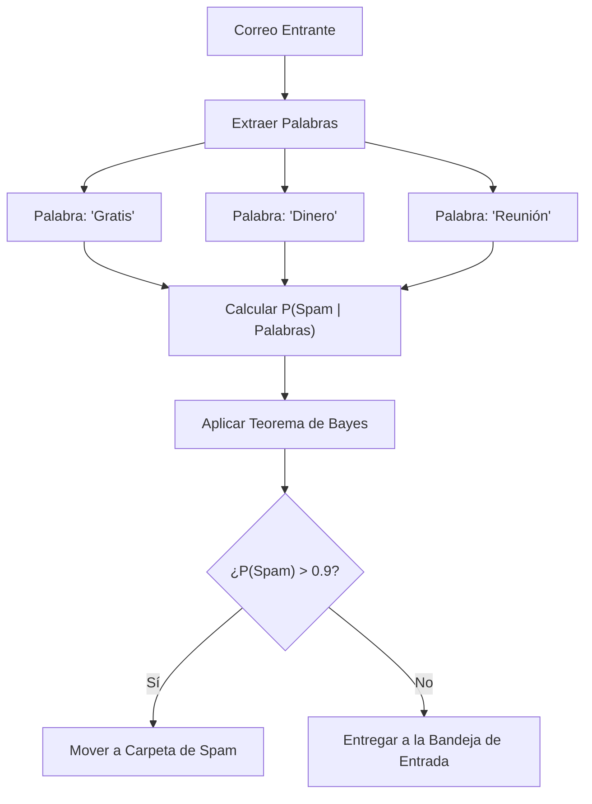
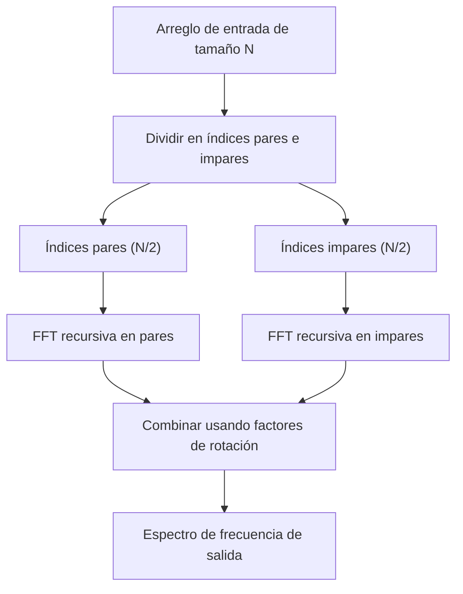
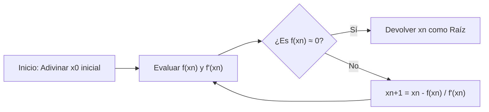
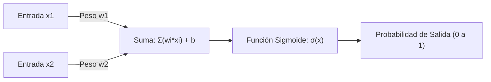

# ¡Imprescindible para los amantes de las matemáticas! 10 hermosas fórmulas matemáticas útiles para la programación

La programación y las matemáticas pueden parecer, a primera vista, campos completamente diferentes. La programación es la tarea de escribir código lógico y concreto, mientras que las matemáticas son el estudio que persigue verdades abstractas y universales. Sin embargo, las matemáticas siempre están presentes en la base de la informática. En la optimización de algoritmos, ciencia de datos, aprendizaje automático, gráficos por computadora, e incluso detrás de las aplicaciones cotidianas, hermosas fórmulas matemáticas están trabajando silenciosa y poderosamente.

En este artículo, hemos seleccionado 10 fórmulas que no solo son matemáticamente hermosas, sino que también desempeñan un papel muy práctico e importante en el contexto de la programación y los algoritmos. Profundizaremos en los fundamentos matemáticos de cada fórmula y explicaremos detalladamente cómo se aplican en la práctica de la programación, junto con fragmentos de código concretos en Python y C++.

Bienvenido a un mundo donde la belleza de las matemáticas y la practicidad de la programación se cruzan.

---

## 1. Identidad de Euler (Euler's Identity)

### Belleza matemática y resumen
Esta es la Identidad de Euler, a menudo llamada "el tesoro de la humanidad" o "la fórmula más hermosa del mundo". Cinco de las constantes más importantes de las matemáticas (el número de Euler $e$, la unidad imaginaria $i$, pi $\pi$, el elemento neutro multiplicativo $1$ y el elemento neutro aditivo $0$) se integran en una sola ecuación simple.

$$ e^{i\pi} + 1 = 0 $$

Esta identidad se deriva sustituyendo $\theta = \pi$ en la fórmula general de Euler $e^{i\theta} = \cos\theta + i\sin\theta$.

### Aplicaciones en programación
En programación, especialmente en gráficos por computadora y desarrollo de videojuegos, la fórmula de Euler es una herramienta extremadamente poderosa para manejar "rotaciones". La rotación de puntos en un espacio bidimensional se puede realizar con cálculos matriciales, pero el uso de números complejos hace que el cálculo sea extremadamente simple e intuitivo. Una rotación en el plano complejo se puede lograr simplemente multiplicando por $e^{i\theta}$, lo que resulta en un código conciso.

### Ejemplo de implementación (C++)
A continuación se muestra un programa que utiliza la biblioteca estándar de C++ `<complex>` para rotar un punto en coordenadas bidimensionales en un ángulo especificado (en radianes).

```cpp
#include <iostream>
#include <complex>
#include <cmath>

// Alias de tipo para tratar las coordenadas 2D como números complejos
using Point2D = std::complex<double>;

// Función para rotar un punto theta (radianes) alrededor del origen
Point2D rotatePoint(const Point2D& point, double theta) {
    // Crea el número complejo para rotación e^{i*theta} basado en la fórmula de Euler
    // Internamente se convierte en cos(theta) + i*sin(theta)
    Point2D rotation(std::cos(theta), std::sin(theta));
    
    // Aplica la rotación multiplicando los números complejos
    return point * rotation;
}

int main() {
    // Coordenada inicial (x=1.0, y=0.0)
    Point2D p(1.0, 0.0);
    
    // Rotación de 90 grados (π/2 radianes)
    double theta = M_PI / 2.0;
    Point2D rotated_p = rotatePoint(p, theta);
    
    std::cout << "Original Point: (" << p.real() << ", " << p.imag() << ")\n";
    // La salida esperada es aproximadamente (0, 1)
    std::cout << "Rotated Point: (" << rotated_p.real() << ", " << rotated_p.imag() << ")\n";
    
    return 0;
}
```

**Explicación detallada**:
La ventaja de este enfoque es que encapsula el cálculo de la matriz de rotación (4 multiplicaciones y 2 sumas) como una operación de números complejos. Además, en el espacio tridimensional, se utiliza una extensión de este concepto llamada "cuaterniones" (quaternions). Usando cuaterniones, se puede evitar el problema fatal del "bloqueo del cardán" (Gimbal Lock) que ocurre con los ángulos de Euler, permitiendo una interpolación esférica lineal suave (Slerp).

---

## 2. Serie de Taylor (Taylor Series)

### Belleza matemática y resumen
La serie de Taylor es un método matemático para expresar funciones complejas (como funciones trigonométricas y exponenciales) como una suma infinita de polinomios. La serie de Taylor de una función $f(x)$ alrededor de un punto $a$ se define de la siguiente manera:

$$ f(x) = \sum_{n=0}^\infty \frac{f^{(n)}(a)}{n!}(x-a)^n $$

El caso especial donde $a=0$ se conoce como la "serie de Maclaurin".

### Aplicaciones en programación
Las computadoras (CPU y FPU) fundamentalmente solo pueden realizar operaciones aritméticas básicas como suma, resta, multiplicación y división. Entonces, ¿cómo se calculan `sin(x)` o `exp(x)`? En los procesadores modernos se suelen utilizar algoritmos CORDIC o la aproximación de Chebyshev, pero cuando se implementan funciones matemáticas a nivel de software, o al crear funciones de aproximación rápidas con menor precisión para un mejor rendimiento, la serie de Taylor (o sus variantes) es directamente útil.

### Ejemplo de implementación (Python)
A continuación se muestra un código en Python que aproxima la función seno (Sine) utilizando la serie de Maclaurin.

$$ \sin(x) \approx x - \frac{x^3}{3!} + \frac{x^5}{5!} - \frac{x^7}{7!} + \dots $$

```python
import math

def taylor_sin(x, terms=10):
    """
    Aproxima sin(x) usando la serie de Taylor (serie de Maclaurin).
    
    :param x: Ángulo (radianes)
    :param terms: Número de términos a calcular (más términos = mayor precisión)
    :return: Valor aproximado de sin(x)
    """
    # Normaliza x al rango de -π a π usando su periodicidad (para mejorar la precisión)
    x = (x + math.pi) % (2 * math.pi) - math.pi
    
    result = 0.0
    for n in range(terms):
        # Usa solo los términos impares: 2n + 1
        power = 2 * n + 1
        
        # El signo se alterna por término: (-1)^n
        sign = (-1) ** n
        
        # Cálculo del factorial
        fact = math.factorial(power)
        
        # Evaluación de la expresión y suma
        term = sign * (x ** power) / fact
        result += term
        
    return result

# Prueba
angle = math.radians(45) # 45 grados = π/4
print(f"Math library sin: {math.sin(angle)}")
print(f"Taylor series sin: {taylor_sin(angle, terms=5)}")
```

**Explicación detallada**:
En el código anterior, el valor de entrada `x` se normaliza al rango $[-\pi, \pi]$. Esto se debe a que el error de truncamiento de la serie de Taylor aumenta rápidamente cuanto más se aleja del centro de expansión (aquí 0). Como los cálculos infinitos son imposibles en programación, el cálculo se detiene después de un número finito de `terms`, y gestionar el equilibrio entre el "error de redondeo" y el "error de truncamiento" causado por esto es el núcleo de la programación de cálculos numéricos.

---

## 3. Teorema de Bayes (Bayes' Theorem)

### Belleza matemática y resumen
El teorema de Bayes es un teorema para actualizar la probabilidad de un evento (probabilidad a posteriori) en función del conocimiento previo relacionado con ese evento (probabilidad a priori). Es una de las fórmulas más importantes en teoría de la probabilidad y estadística.

$$ P(A|B) = \frac{P(B|A)P(A)}{P(B)} $$

Aquí, $P(A|B)$ representa la probabilidad de que el evento A ocurra bajo la condición de que el evento B haya ocurrido (probabilidad a posteriori).

### Aplicaciones en programación
Se utiliza ampliamente en los campos del aprendizaje automático y ciencia de datos como el "clasificador Bayesiano ingenuo" (Naive Bayes Classifier). Un ejemplo típico de aplicación es el filtrado de correos no deseados (spam). La pregunta "Si este correo contiene la palabra 'gratis', ¿cuál es la probabilidad de que sea spam?" se calcula dinámicamente en función de datos históricos.



### Ejemplo de implementación (Python)
Código que muestra la lógica básica de un filtro de spam.

```python
def calculate_spam_probability(
    prob_spam, 
    prob_word_given_spam, 
    prob_word_given_ham
):
    """
    Calcula la probabilidad de que un correo sea spam si contiene una palabra usando el teorema de Bayes.
    
    :param prob_spam: P(Spam) - Probabilidad a priori de que el correo sea spam
    :param prob_word_given_spam: P(Palabra|Spam) - Probabilidad de que la palabra esté en un correo spam
    :param prob_word_given_ham: P(Palabra|Ham) - Probabilidad de que la palabra esté en un correo normal
    :return: P(Spam|Palabra) - Probabilidad de que sea spam si contiene esa palabra
    """
    # Probabilidad a priori de correo normal P(Ham) = 1 - P(Spam)
    prob_ham = 1.0 - prob_spam
    
    # Probabilidad de aparición de la palabra en todos los correos P(Palabra) = P(Palabra|Spam)P(Spam) + P(Palabra|Ham)P(Ham)
    # Esto es por la ley de probabilidad total
    prob_word = (prob_word_given_spam * prob_spam) + (prob_word_given_ham * prob_ham)
    
    # Teorema de Bayes P(Spam|Palabra) = P(Palabra|Spam) * P(Spam) / P(Palabra)
    if prob_word == 0:
        return 0.0 # Evitar división por cero
        
    prob_spam_given_word = (prob_word_given_spam * prob_spam) / prob_word
    return prob_spam_given_word

# Ejemplo: Probabilidad de la palabra "ganador"
# Datos pasados: 20% de todos los correos son spam
p_spam = 0.2
# 80% de los correos spam contienen la palabra "ganador"
p_win_given_spam = 0.8
# 1% de los correos normales contienen la palabra "ganador"
p_win_given_ham = 0.01

result = calculate_spam_probability(p_spam, p_win_given_spam, p_win_given_ham)
print(f"Probabilidad de que un correo con la palabra 'ganador' sea spam: {result:.2%}")
```

**Explicación detallada**:
En una implementación real (clasificador Bayesiano ingenuo), se multiplican las probabilidades de múltiples palabras. Sin embargo, si multiplicamos miles de veces probabilidades (valores entre 0 y 1), el valor se convierte en cero debido a los límites de representación de punto flotante de la computadora (subdesbordamiento o underflow). Por lo tanto, en la programación real, la técnica de convertir el producto de las probabilidades en "suma de logaritmos" (`log(a * b) = log(a) + log(b)`) es indispensable.

---

## 4. Entropía de Shannon (Shannon Entropy)

### Belleza matemática y resumen
La "entropía" definida por Claude Shannon, el padre de la teoría de la información, es una fórmula que cuantifica la "incertidumbre", el "desorden" o la "cantidad promedio de información" que posee una fuente de información.

$$ H(X) = - \sum_{i=1}^n P(x_i) \log_2 P(x_i) $$

### Aplicaciones en programación
La entropía es esencial en la compresión de datos de archivos (el límite teórico de la codificación Huffman y algoritmos de compresión ZIP), la evaluación de la fortaleza de los números aleatorios en criptografía, y en algoritmos de "árboles de decisión" (Decision Trees) en aprendizaje automático (como ID3 y C4.5). Al construir un árbol de decisión, el objetivo es encontrar la característica que maximice la reducción de la entropía (Ganancia de Información: Information Gain) al dividir los datos.

### Ejemplo de implementación (Python)
Una función que calcula la entropía de una cadena (conjunto de datos) y evalúa su cantidad de información.

```python
import math
from collections import Counter

def calculate_entropy(data):
    """
    Calcula la entropía de Shannon del conjunto de datos proporcionado (cadena o lista).
    """
    if not data:
        return 0.0
        
    # Contar las ocurrencias de cada elemento
    counts = Counter(data)
    total_len = len(data)
    
    entropy = 0.0
    for element, count in counts.items():
        # Probabilidad de aparición P(x_i)
        probability = count / total_len
        
        # - P(x_i) * log2(P(x_i))
        entropy -= probability * math.log2(probability)
        
    return entropy

# Prueba
# Si todos son la misma letra, la incertidumbre es 0
data_deterministic = "AAAAAAAAAA" 
# Si los caracteres son aleatorios, la incertidumbre es alta
data_random = "ABACBCBACB"

print(f"Entropy of '{data_deterministic}': {calculate_entropy(data_deterministic)}")
print(f"Entropy of '{data_random}': {calculate_entropy(data_random)}")
```

**Explicación detallada**:
La unidad de la entropía son los "bits" (bits). Si la entropía es `1.5`, significa que, en promedio, se requieren al menos 1.5 bits por elemento para representar esa información. En la práctica de la programación, se calcula habitualmente como punto de referencia para medir la eficiencia de los algoritmos de compresión, o como indicador crucial para la selección de características en modelos de aprendizaje automático.

---

## 5. Transformada Rápida de Fourier (Fast Fourier Transform - FFT)

### Belleza matemática y resumen
La Transformada Discreta de Fourier (DFT) transforma una señal en el dominio del tiempo a una señal en el dominio de la frecuencia. Su fórmula matemática es la siguiente:

$$ X_k = \sum_{n=0}^{N-1} x_n e^{-i 2\pi k n / N} $$

Si esta DFT se calcula ingenuamente, la complejidad computacional (complejidad temporal) es de $O(N^2)$, y el cálculo se vuelve explosivamente lento a medida que aumenta la cantidad de datos. El algoritmo que acelera esto dramáticamente hasta $O(N \log N)$ mediante el enfoque de divide y vencerás es la "Transformada Rápida de Fourier (FFT)". Se considera uno de los 10 algoritmos más importantes del siglo XX.



### Aplicaciones en programación
La FFT es una tecnología indispensable que sustenta la sociedad moderna. Funciona en todas partes, desde el reconocimiento de voz (Siri o Alexa), compresión de datos de MP3 y JPEG/MPEG, comunicaciones digitales como LTE y Wi-Fi, e incluso en la multiplicación de enteros muy grandes (algoritmo de Schönhage-Strassen).

### Ejemplo de implementación (Python)
Un ejemplo de implementación simple de un algoritmo recursivo tipo Cooley-Tukey. (※ En la práctica, se usan librerías optimizadas al extremo en C o ensamblador, como `FFTW` o `numpy.fft`)

```python
import cmath

def fft(x):
    """
    Calcula la Transformada Rápida de Fourier (FFT) en 1D (método Cooley-Tukey).
    La longitud N de la lista de entrada debe ser una potencia de 2.
    """
    N = len(x)
    
    # Caso base
    if N <= 1:
        return x
        
    # Dividir en elementos pares e impares (Divide)
    even = fft(x[0::2])
    odd = fft(x[1::2])
    
    # Combinar resultados (Conquer)
    T = [cmath.exp(-2j * cmath.pi * k / N) * odd[k] for k in range(N // 2)]
    
    # Aprovechar la simetría para reducir los cálculos
    return [even[k] + T[k] for k in range(N // 2)] + \
           [even[k] - T[k] for k in range(N // 2)]

# Prueba: Señal simple
signal = [1.0, 1.0, 1.0, 1.0, 0.0, 0.0, 0.0, 0.0]
spectrum = fft(signal)

print("Frequency Spectrum (Magnitude):")
for k, val in enumerate(spectrum):
    # Calcular el valor absoluto (amplitud)
    print(f"Freq {k}: {abs(val):.3f}")
```

**Explicación detallada**:
El núcleo de este algoritmo está en explotar la simetría y la periodicidad del número complejo llamado "factor de rotación (Twiddle factor)". Al evitar repetir cálculos redundantes, cuando $N=1024$, los cálculos necesarios se reducen de $1,048,576$ a apenas unos $10,240$. Es verdaderamente un milagro nacido de la fusión entre matemáticas y algoritmos.

---

## 6. Fórmula del semiverseno (Haversine Formula)

### Belleza matemática y resumen
Es una fórmula para calcular la distancia más corta (distancia ortodrómica o distancia del gran círculo) entre dos puntos en una superficie esférica, como la superficie de la Tierra.

$$ a = \sin^2\left(\frac{\Delta\phi}{2}\right) + \cos\phi_1 \cos\phi_2 \sin^2\left(\frac{\Delta\lambda}{2}\right) $$
$$ c = 2\cdot \text{atan2}\left(\sqrt{a}, \sqrt{1-a}\right) $$
$$ d = R \cdot c $$

(Donde $\phi$ es la latitud, $\lambda$ es la longitud y $R$ es el radio de la Tierra).

### Aplicaciones en programación
Es una fórmula esencial al calcular la distancia entre dos coordenadas de latitud y longitud en aplicaciones de rastreo GPS, y servicios basados en ubicación como Uber o Pokémon GO. Calcular la distancia lineal usando el teorema de Pitágoras produce grandes errores en largas distancias porque no toma en cuenta la curvatura de la Tierra.

### Ejemplo de implementación (Python)
Una función que toma dos coordenadas (latitud y longitud) y devuelve su distancia (en kilómetros).

```python
import math

def haversine_distance(lat1, lon1, lat2, lon2):
    """
    Calcula la distancia del gran círculo entre dos puntos usando la fórmula del semiverseno.
    """
    # Radio promedio de la Tierra (kilómetros)
    R = 6371.0 
    
    # Convertir latitud y longitud de grados a radianes
    phi1, phi2 = math.radians(lat1), math.radians(lat2)
    delta_phi = math.radians(lat2 - lat1)
    delta_lambda = math.radians(lon2 - lon1)
    
    # Cálculo del semiverseno (Haversine)
    a = math.sin(delta_phi / 2.0)**2 + \
        math.cos(phi1) * math.cos(phi2) * \
        math.sin(delta_lambda / 2.0)**2
        
    c = 2 * math.atan2(math.sqrt(a), math.sqrt(1 - a))
    
    # Cálculo de la distancia
    distance = R * c
    return distance

# Distancia desde la Torre de Tokio (35.6586, 139.7454) hasta la Estatua de la Libertad (40.6892, -74.0445)
tokyo = (35.6586, 139.7454)
ny = (40.6892, -74.0445)

dist = haversine_distance(tokyo[0], tokyo[1], ny[0], ny[1])
print(f"Distancia desde la Torre de Tokio a la Estatua de la Libertad: aprox. {dist:.2f} km")
```

**Explicación detallada**:
Existe otro método usando la ley de los cosenos esféricos, pero cuando la distancia entre los dos puntos es muy corta (por ejemplo, a nivel de metros), tiende a ocurrir una "cancelación catastrófica" (Catastrophic cancellation) en la precisión del cálculo de punto flotante. Debido a que la fórmula del semiverseno utiliza `sin^2`, tiene una gran ventaja en programación al ser numéricamente estable incluso para distancias minúsculas. Si se requiere aún más precisión, se utilizan las fórmulas de Vincenty, que tratan a la Tierra como un elipsoide.

---

## 7. Método de Newton-Raphson (Newton-Raphson Method)

### Belleza matemática y resumen
Es un algoritmo de búsqueda de raíces extremadamente poderoso que encuentra repetitivamente la solución (raíz) de la ecuación $f(x) = 0$ utilizando la recta tangente.

$$ x_{n+1} = x_n - \frac{f(x_n)}{f'(x_n)} $$

Utilizando el valor de la función $f(x_n)$ y su pendiente (derivada) $f'(x_n)$ en la posición actual $x_n$, se aproxima una posición más precisa $x_{n+1}$ para buscar a continuación.



### Aplicaciones en programación
Se utiliza en el renderizado de motores gráficos, detección de colisiones en simulaciones físicas, problemas de optimización, etc. Un caso notable es el "Fast Inverse Square Root" (Cálculo rápido de la raíz cuadrada inversa) incrustado en el código fuente del legendario juego de disparos en primera persona (FPS) "Quake III Arena". Fue un truco donde el método de Newton se aplicó solo una vez para calcular $1/\sqrt{x}$ de forma asombrosamente rápida, siendo indispensable para la normalización de vectores.

### Ejemplo de implementación (C++)
Aquí mostraremos un ejemplo estándar y comprensible del cálculo de la raíz cuadrada $\sqrt{N}$ (es decir, resolviendo $x^2 - N = 0$) con el método de Newton. Será $f(x) = x^2 - N$ y $f'(x) = 2x$.

```cpp
#include <iostream>
#include <cmath>

double newton_sqrt(double N, double tolerance = 1e-7) {
    if (N < 0) return NAN; // La raíz cuadrada de un número negativo es NaN
    if (N == 0) return 0;
    
    // Valor inicial estimado (comienza con N mismo)
    double x = N; 
    
    while (true) {
        // Calcular la siguiente suposición: x_new = x - (x^2 - N) / (2x) = (x + N/x) / 2
        double x_new = 0.5 * (x + N / x);
        
        // Si el cambio es menor que el error permitido (tolerancia), se considera que ha convergido
        if (std::abs(x - x_new) < tolerance) {
            break;
        }
        x = x_new;
    }
    
    return x;
}

int main() {
    double number = 612.0;
    std::cout << "Square root of " << number << " is: " << newton_sqrt(number) << "\n";
    return 0;
}
```

**Explicación detallada**:
El mayor atractivo del método de Newton es su "convergencia cuadrática" (Quadratic convergence) si se dan las condiciones. Esto significa que el número de dígitos correctos se duplica aproximadamente con cada iteración, una velocidad de convergencia asombrosa. Considerando que la búsqueda binaria (Binary search) tiene una convergencia lineal, queda claro lo poderosa que es la información proporcionada por la derivada (pequeña pendiente). En el truco de "Quake III", se logró una precisión increíble al determinar el valor inicial para el método de Newton utilizando el número mágico de operaciones a nivel de bits `0x5f3759df` hackeando la estructura del punto flotante de IEEE 754.

---

## 8. Curvas de Bézier (Bézier Curves)

### Belleza matemática y resumen
Es una ecuación paramétrica que define curvas suaves usando múltiples puntos de control (Control Points). La curva de Bézier cúbica (Cubic Bézier Curve) más comúnmente utilizada tiene 4 puntos $P_0, P_1, P_2, P_3$, y determina las coordenadas $B(t)$ sobre la curva mediante un parámetro $t \ (0 \le t \le 1)$.

$$ B(t) = (1-t)^3 P_0 + 3(1-t)^2 t P_1 + 3(1-t) t^2 P_2 + t^3 P_3 $$

### Aplicaciones en programación
Las curvas de Bézier son la base de los gráficos por computadora. Se utilizan en herramientas de dibujo vectorial como Adobe Illustrator, en la renderización de fuentes (TrueType y OpenType), en las funciones de aceleración (easing) para transiciones y animaciones con CSS `cubic-bezier()`, y en el control de rutas de cámara en videojuegos, es decir, en cualquier momento que se dibujen mediante programa "movimientos o formas suaves".

### Ejemplo de implementación (Python)
Este es el código que genera un conjunto de puntos sobre una curva de Bézier cúbica a partir de 4 puntos de control.

```python
def cubic_bezier(p0, p1, p2, p3, steps=10):
    """
    Genera una lista de coordenadas en una curva de Bézier cúbica.
    p0, p1, p2, p3 son tuplas (x, y).
    steps indica en cuántos segmentos se divide la curva.
    """
    curve_points = []
    
    for i in range(steps + 1):
        # El parámetro t varía entre 0.0 y 1.0
        t = i / steps
        
        # Cálculo de los coeficientes que componen la ecuación
        u = 1 - t
        tt = t * t
        uu = u * u
        uuu = uu * u
        ttt = tt * t
        
        # Calcular las coordenadas x e y para cada punto respectivo
        x = (uuu * p0[0]) + \
            (3 * uu * t * p1[0]) + \
            (3 * u * tt * p2[0]) + \
            (ttt * p3[0])
            
        y = (uuu * p0[1]) + \
            (3 * uu * t * p1[1]) + \
            (3 * u * tt * p2[1]) + \
            (ttt * p3[1])
            
        curve_points.append((x, y))
        
    return curve_points

# Punto de inicio, punto de control 1, punto de control 2, punto final
p0 = (0, 0)
p1 = (5, 10)
p2 = (15, 10)
p3 = (20, 0)

points = cubic_bezier(p0, p1, p2, p3, steps=5)
for i, pt in enumerate(points):
    print(f"t={i/5:.1f} -> Point({pt[0]:.2f}, {pt[1]:.2f})")
```

**Explicación detallada**:
Esta fórmula es el desarrollo del "algoritmo de De Casteljau" (De Casteljau's algorithm), que aplica repetidamente interpolaciones lineales (Lerp: Linear Interpolation). Encuentra la solución directa usando cálculos polinomiales (polinomios de Bernstein). En programación, una curva se aproxima dibujándola como una colección de infinitas "rectas diminutas". Por lo tanto, ajustar la resolución (steps) de $t$ permite controlar el equilibrio entre el rendimiento y la calidad del dibujo.

---

## 9. Función Sigmoide (Sigmoid Function)

### Belleza matemática y resumen
Es una función en forma de S suave que comprime siempre cualquier entrada de número real $x \ ( -\infty < x < \infty )$ en un valor entre $0$ y $1$.

$$ \sigma(x) = \frac{1}{1 + e^{-x}} $$

### Aplicaciones en programación
Históricamente, desempeñó un papel muy importante como "función de activación" (Activation Function) en regresión logística y redes neuronales (Deep Learning o aprendizaje profundo). Su mayor ventaja es que su salida está comprendida en el rango de 0 a 1, lo que permite que el resultado se interprete como una "probabilidad".



### Ejemplo de implementación (Python)
Este código aplica la función sigmoide a una matriz de entrada (tensor).

```python
import math

def sigmoid(x):
    """Cálculo sigmoide para un solo valor"""
    # A menudo se restringe el valor de entrada para evitar el desbordamiento de math.exp(-x)
    # Implementación estándar simplificada
    if x >= 0:
        return 1.0 / (1.0 + math.exp(-x))
    else:
        # Prevención de desbordamiento cuando x es un valor negativo grande
        return math.exp(x) / (1.0 + math.exp(x))

def apply_sigmoid(array):
    """Aplica la función sigmoide a todos los elementos en la matriz"""
    return [sigmoid(x) for x in array]

# Datos brutos de la capa de salida de una red neuronal (logits)
logits = [-5.0, -1.0, 0.0, 1.0, 5.0]
probabilities = apply_sigmoid(logits)

for val, prob in zip(logits, probabilities):
    print(f"Input: {val:4.1f} -> Probability: {prob:.4f}")
```

**Explicación detallada**:
En el código anterior, la bifurcación basada en `x >= 0` es para prevenir el "desbordamiento" (overflow), un problema específico en programación. Se trata de una técnica de cálculo numérico para evitar que el programa se bloquee (o devuelva Inf) al intentar calcular, por ejemplo, $e^{1000}$ cuando $x = -1000$. En la actualidad, la ReLU ($f(x) = \max(0, x)$) es la función principal en las capas ocultas del Deep Learning debido a la velocidad de cálculo y el problema del desvanecimiento del gradiente, pero la función sigmoide todavía mantiene una posición firme en las capas de salida para la clasificación binaria.

---

## 10. Distancia Euclidiana y Teorema de Pitágoras (Euclidean Distance & Pythagorean Theorem)

### Belleza matemática y resumen
Es la base de la geometría desde la antigua Grecia y una fórmula que define la distancia en línea recta entre dos puntos en un espacio de $n$ dimensiones. En un espacio de 2 dimensiones, es el propio Teorema de Pitágoras ($a^2 + b^2 = c^2$).

La distancia Euclidiana $d$ entre el punto $P(x_1, y_1, z_1)$ y $Q(x_2, y_2, z_2)$ en un espacio tridimensional se expresa de la siguiente manera:

$$ d = \sqrt{(x_2-x_1)^2 + (y_2-y_1)^2 + (z_2-z_1)^2} $$

### Aplicaciones en programación
Es el cálculo central de cualquier desarrollo de juegos, motor de físicas y algoritmos de "K-vecinos más cercanos" (K-Nearest Neighbors) o de agrupamiento (K-Means) en aprendizaje automático. En los videojuegos, se calcula millones de veces por frame para tareas como la detección de colisiones entre personajes (Bounding Circle / Sphere Collision).

### Ejemplo de implementación (C++)
Aquí se muestra código optimizado para determinar si dos círculos (esferas) están colisionando.

```cpp
#include <iostream>
#include <cmath>

struct Circle {
    double x, y; // Coordenadas del centro
    double radius; // Radio
};

// Función que determina si dos círculos están chocando
bool isColliding(const Circle& a, const Circle& b) {
    // Diferencia (delta) de las coordenadas x e y
    double dx = b.x - a.x;
    double dy = b.y - a.y;
    
    // Calcular el "cuadrado" de la distancia
    double distanceSquared = (dx * dx) + (dy * dy);
    
    // Calcular el "cuadrado" de la suma de los radios
    double radiiSum = a.radius + b.radius;
    double radiiSumSquared = radiiSum * radiiSum;
    
    // Comparar el cuadrado de la distancia con el cuadrado de la suma de los radios
    return distanceSquared <= radiiSumSquared;
}

int main() {
    Circle player = {0.0, 0.0, 5.0};
    Circle enemy1 = {8.0, 0.0, 4.0}; // Distancia 8, suma de radios 9 -> Colisión
    Circle enemy2 = {10.0, 10.0, 2.0}; // Distancia aprox 14.1, suma de radios 7 -> No colisión
    
    std::cout << "Collision with enemy1: " << (isColliding(player, enemy1) ? "Yes" : "No") << "\n";
    std::cout << "Collision with enemy2: " << (isColliding(player, enemy2) ? "Yes" : "No") << "\n";
    
    return 0;
}
```

**Explicación detallada**:
Si se calcula de acuerdo con la fórmula matemática exacta, es necesario tomar la raíz cuadrada $\sqrt{\cdot}$ al final. Sin embargo, en programación, llamar a la función `sqrt()` es una operación muy pesada para la CPU (consume muchos ciclos de reloj). Por lo tanto, si el objetivo es simplemente comparar distancias, es una práctica común en la programación de videojuegos **comparar ambos lados mientras aún están elevados al cuadrado** (`distanceSquared <= radiiSumSquared`). De esta manera, aprovechar las propiedades de igualdades y desigualdades matemáticas para optimizar y reducir la carga de cálculo es uno de los encantos del diseño de algoritmos.

---

## Conclusión

¿Qué te ha parecido? Desde la identidad de Euler hasta el teorema de Pitágoras, estas 10 fórmulas no son simplemente conceptos teóricos que se encuentran en los libros de texto. En el fondo del código que escribimos normalmente, laten como el "corazón" que comprime los datos, permite predecir los modelos de aprendizaje automático, dibuja animaciones suaves y hace posibles búsquedas rápidas.

Comprender los fundamentos matemáticos no es para quedarse siendo solo un codificador que simplemente llama a bibliotecas existentes (como `math.sin` o `numpy.fft`), sino que es indispensable para dar el salto a convertirse en un ingeniero capaz de comprender la estructura interna y superar sus límites. La próxima vez que escribas código, trata de imaginar por un momento qué hermosa fórmula matemática está funcionando silenciosamente por detrás.

**Happy Coding and Math!**
