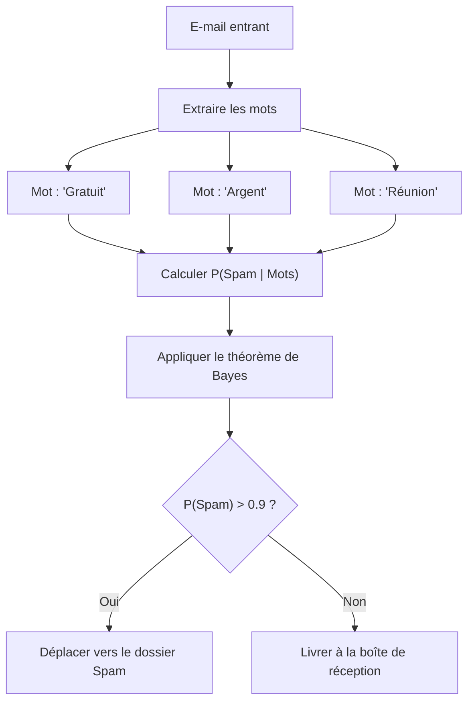
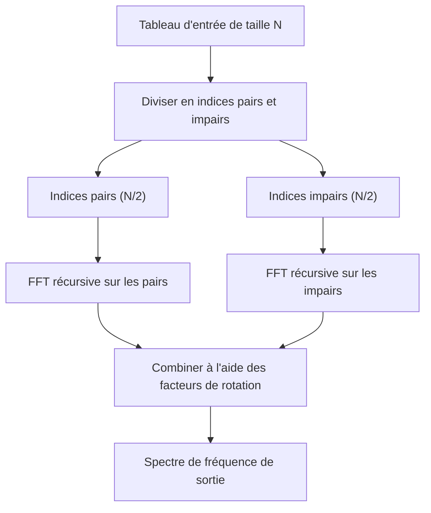
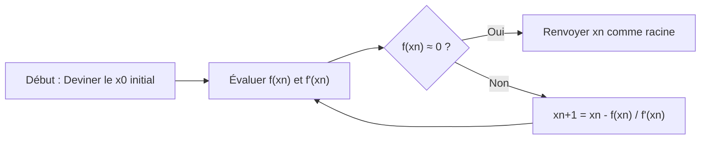
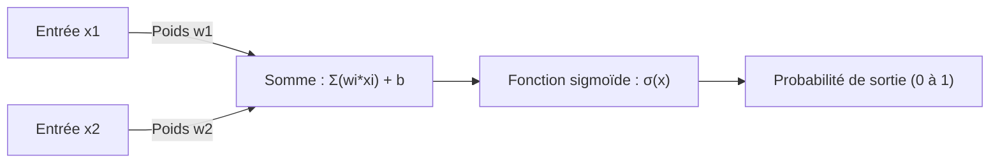

# Avis aux passionnés de mathématiques ! 10 superbes formules mathématiques utiles pour la programmation

La programmation et les mathématiques peuvent sembler à première vue être des domaines totalement différents. La programmation est le processus d'écriture de code logique et concret, tandis que les mathématiques sont la poursuite de vérités abstraites et universelles. Cependant, les mathématiques sont toujours au cœur de l'informatique. Derrière l'optimisation des algorithmes, la science des données, l'apprentissage automatique, l'infographie et même les applications quotidiennes, de belles formules mathématiques travaillent silencieusement et puissamment.

Dans cet article, nous avons soigneusement sélectionné 10 formules qui ne sont pas seulement belles mathématiquement, mais qui jouent également un rôle extrêmement pratique et important dans le contexte de la programmation et des algorithmes. Nous approfondirons le contexte mathématique de chaque formule et expliquerons en détail comment elle est appliquée dans la pratique de la programmation, avec des extraits de code concrets en Python et C++.

Bienvenue dans un monde où la beauté des mathématiques croise l'aspect pratique de la programmation.

---

## 1. Identité d'Euler (Euler's Identity)

### Beauté de la formule et aperçu
Voici l'identité d'Euler, souvent qualifiée de "trésor de l'humanité" ou de "la plus belle équation du monde". Les cinq constantes les plus importantes en mathématiques (le nombre de Néper $e$, l'unité imaginaire $i$, le nombre pi $\pi$, l'élément neutre de la multiplication $1$ et l'élément neutre de l'addition $0$) sont intégrées dans une seule formule simple.

$$ e^{i\pi} + 1 = 0 $$

Cette équation est dérivée de la formule d'Euler plus générale $e^{i\theta} = \cos\theta + i\sin\theta$ en y substituant $\theta = \pi$.

### Applications en programmation
En programmation, notamment dans l'infographie et le développement de jeux, la formule d'Euler devient un outil extrêmement puissant pour gérer les "rotations". La rotation d'un point dans un espace bidimensionnel peut être effectuée à l'aide de calculs matriciels, mais l'utilisation de nombres complexes rend le calcul extrêmement simple et intuitif. La rotation sur un plan complexe peut être réalisée en multipliant simplement par $e^{i\theta}$, ce qui rend le code très concis.

### Exemple d'implémentation (C++)
Voici un programme qui fait pivoter un point sur des coordonnées 2D d'un angle spécifié (en radians) à l'aide de la bibliothèque standard C++ `<complex>`.

```cpp
#include <iostream>
#include <complex>
#include <cmath>

// Alias de type pour traiter les coordonnées 2D comme des nombres complexes
using Point2D = std::complex<double>;

// Fonction pour faire pivoter un point autour de l'origine d'un angle theta (en radians)
Point2D rotatePoint(const Point2D& point, double theta) {
    // Créer le nombre complexe pour la rotation e^{i*theta} selon la formule d'Euler
    // En interne, cela correspond à cos(theta) + i*sin(theta)
    Point2D rotation(std::cos(theta), std::sin(theta));
    
    // Appliquer la rotation via la multiplication de nombres complexes
    return point * rotation;
}

int main() {
    // Coordonnées initiales (x=1.0, y=0.0)
    Point2D p(1.0, 0.0);
    
    // Rotation de 90 degrés (π/2 radians)
    double theta = M_PI / 2.0;
    Point2D rotated_p = rotatePoint(p, theta);
    
    std::cout << "Original Point: (" << p.real() << ", " << p.imag() << ")\n";
    // La sortie attendue est d'environ (0, 1)
    std::cout << "Rotated Point: (" << rotated_p.real() << ", " << rotated_p.imag() << ")\n";
    
    return 0;
}
```

**Explication détaillée** :
L'avantage de cette approche est que le calcul de la matrice de rotation (4 multiplications et 2 additions) peut être encapsulé sous forme d'opération sur les nombres complexes. De plus, dans l'espace tridimensionnel, on utilise les "quaternions", qui sont une extension de ce concept. L'utilisation des quaternions permet d'éviter le problème fatal du "blocage de cardan" (Gimbal Lock) qui se produit avec les angles d'Euler, et d'obtenir une interpolation linéaire sphérique fluide (Slerp).

---

## 2. Développement de Taylor (Taylor Series)

### Beauté de la formule et aperçu
Le développement de Taylor est une méthode mathématique qui exprime des fonctions complexes (telles que les fonctions trigonométriques et exponentielles) sous la forme d'une somme infinie de polynômes. Le développement de Taylor d'une fonction $f(x)$ autour d'un point $a$ est défini comme suit :

$$ f(x) = \sum_{n=0}^\infty \frac{f^{(n)}(a)}{n!}(x-a)^n $$

En particulier, le cas où $a=0$ est appelé "développement de Maclaurin".

### Applications en programmation
Les ordinateurs (CPU ou FPU) ne peuvent fondamentalement exécuter que des opérations arithmétiques basiques : addition, soustraction, multiplication et division. Alors, comment sont calculés `sin(x)` ou `exp(x)` ? Dans les processeurs modernes, l'algorithme CORDIC ou l'approximation de Tchebychev sont souvent utilisés, mais lorsque l'on implémente des fonctions mathématiques au niveau logiciel, ou que l'on crée ses propres fonctions d'approximation rapides en sacrifiant un peu de précision pour les performances, le développement de Taylor (ou ses variantes) est directement utile.

### Exemple d'implémentation (Python)
Voici un code Python qui calcule approximativement la fonction sinus à l'aide du développement de Maclaurin.

$$ \sin(x) \approx x - \frac{x^3}{3!} + \frac{x^5}{5!} - \frac{x^7}{7!} + \dots $$

```python
import math

def taylor_sin(x, terms=10):
    """
    Calcule une approximation de sin(x) en utilisant le développement de Taylor (développement de Maclaurin).
    
    :param x: Angle (en radians)
    :param terms: Nombre de termes à calculer (plus il y en a, plus la précision est élevée)
    :return: Valeur approximative de sin(x)
    """
    # Normaliser x dans la plage de -π à π en utilisant la périodicité (pour améliorer la précision)
    x = (x + math.pi) % (2 * math.pi) - math.pi
    
    result = 0.0
    for n in range(terms):
        # Utiliser uniquement les termes impairs : 2n + 1
        power = 2 * n + 1
        
        # Le signe est inversé pour chaque terme : (-1)^n
        sign = (-1) ** n
        
        # Calcul de la factorielle
        fact = math.factorial(power)
        
        # Évaluation de la formule et addition
        term = sign * (x ** power) / fact
        result += term
        
    return result

# Test
angle = math.radians(45) # 45 degrés = π/4
print(f"Math library sin: {math.sin(angle)}")
print(f"Taylor series sin: {taylor_sin(angle, terms=5)}")
```

**Explication détaillée** :
Dans le code ci-dessus, la valeur d'entrée `x` est normalisée dans la plage $[-\pi, \pi]$. C'est parce que le développement de Taylor a la propriété de voir son erreur augmenter rapidement à mesure que l'on s'éloigne du centre du développement (ici 0) (erreur de troncature). Comme les calculs infinis sont impossibles en programmation, nous tronquons le calcul à un nombre fini de `terms`, mais la gestion du compromis entre l'"erreur d'arrondi" et l'"erreur de troncature" qui en résulte est la clé de la programmation de calculs numériques.

---

## 3. Théorème de Bayes (Bayes' Theorem)

### Beauté de la formule et aperçu
Le théorème de Bayes est un théorème permettant de mettre à jour la probabilité d'un événement (probabilité a posteriori) sur la base de connaissances préalables (probabilité a priori) liées à cet événement. C'est l'une des formules les plus importantes en théorie des probabilités et en statistiques.

$$ P(A|B) = \frac{P(B|A)P(A)}{P(B)} $$

Ici, $P(A|B)$ représente la probabilité que l'événement A se produise sous la condition que l'événement B s'est produit (probabilité a posteriori).

### Applications en programmation
Il est largement utilisé dans les domaines de l'apprentissage automatique et de la science des données sous le nom de "classificateur naïf de Bayes" (Naive Bayes Classifier). Un exemple typique d'application est le filtrage des courriers indésirables (spam). Le calcul de "Quelle est la probabilité que cet e-mail soit un spam s'il contient le mot 'gratuit' ?" est effectué dynamiquement sur la base de données passées.



### Exemple d'implémentation (Python)
Voici un code illustrant la logique de base d'un filtre anti-spam.

```python
def calculate_spam_probability(
    prob_spam, 
    prob_word_given_spam, 
    prob_word_given_ham
):
    """
    Calcule la probabilité qu'un e-mail contenant un certain mot soit un spam en utilisant le théorème de Bayes.
    
    :param prob_spam: P(Spam) - Probabilité a priori que l'e-mail soit un spam
    :param prob_word_given_spam: P(Word|Spam) - Probabilité que le mot soit inclus dans un spam
    :param prob_word_given_ham: P(Word|Ham) - Probabilité que le mot soit inclus dans un e-mail normal
    :return: P(Spam|Word) - Probabilité qu'il s'agisse d'un spam si le mot est inclus
    """
    # Probabilité a priori d'un e-mail normal P(Ham) = 1 - P(Spam)
    prob_ham = 1.0 - prob_spam
    
    # Probabilité d'apparition de ce mot dans tous les e-mails P(Word) = P(Word|Spam)P(Spam) + P(Word|Ham)P(Ham)
    # Ceci est dû au théorème des probabilités totales
    prob_word = (prob_word_given_spam * prob_spam) + (prob_word_given_ham * prob_ham)
    
    # Théorème de Bayes P(Spam|Word) = P(Word|Spam) * P(Spam) / P(Word)
    if prob_word == 0:
        return 0.0 # Évitement de la division par zéro
        
    prob_spam_given_word = (prob_word_given_spam * prob_spam) / prob_word
    return prob_spam_given_word

# Exemple : Probabilité avec le mot "gagnant"
# Données passées : 20% de tous les e-mails sont des spams
p_spam = 0.2
# 80% des spams contiennent le mot "gagnant"
p_win_given_spam = 0.8
# 1% des e-mails normaux contiennent le mot "gagnant"
p_win_given_ham = 0.01

result = calculate_spam_probability(p_spam, p_win_given_spam, p_win_given_ham)
print(f"Probabilité qu'un e-mail contenant le mot 'gagnant' soit un spam : {result:.2%}")
```

**Explication détaillée** :
Dans une implémentation réelle (classificateur naïf de Bayes), les probabilités de plusieurs mots sont multipliées ensemble. Cependant, si l'on multiplie des probabilités (valeurs entre 0 et 1) des milliers de fois, la valeur devient nulle en raison des limites de la représentation en virgule flottante des ordinateurs (sous-dépassement ou underflow). Par conséquent, dans la programmation réelle, la technique consistant à convertir le produit des probabilités en "somme de logarithmes" (`log(a * b) = log(a) + log(b)`) est une technique essentielle.

---

## 4. Entropie de Shannon (Shannon Entropy)

### Beauté de la formule et aperçu
Définie par Claude Shannon, le père de la théorie de l'information, l'"entropie" est une formule qui quantifie l'"incertitude", le "désordre" ou la "quantité moyenne d'information" possédée par une source d'information.

$$ H(X) = - \sum_{i=1}^n P(x_i) \log_2 P(x_i) $$

### Applications en programmation
L'entropie est indispensable dans la compression des données de fichiers (le codage de Huffman et les limites théoriques de l'algorithme de compression ZIP), l'évaluation de la force des nombres aléatoires en cryptographie, et les algorithmes d'"arbres de décision" (Decision Trees, tels que ID3 ou C4.5) en apprentissage automatique. Lors de la construction d'un arbre de décision, l'algorithme cherche à trouver la caractéristique qui maximise la réduction de l'entropie (gain d'information) lors de la division des données.

### Exemple d'implémentation (Python)
Voici une fonction qui calcule l'entropie d'une chaîne de caractères (jeu de données) et évalue sa quantité d'information.

```python
import math
from collections import Counter

def calculate_entropy(data):
    """
    Calcule l'entropie de Shannon de l'ensemble de données donné (chaîne de caractères ou liste).
    """
    if not data:
        return 0.0
        
    # Compter le nombre d'occurrences de chaque élément
    counts = Counter(data)
    total_len = len(data)
    
    entropy = 0.0
    for element, count in counts.items():
        # Probabilité d'occurrence P(x_i)
        probability = count / total_len
        
        # - P(x_i) * log2(P(x_i))
        entropy -= probability * math.log2(probability)
        
    return entropy

# Tests
# Si tous les caractères sont les mêmes, l'incertitude est de 0
data_deterministic = "AAAAAAAAAA" 
# Pour des caractères aléatoires, l'incertitude est élevée
data_random = "ABACBCBACB"

print(f"Entropy of '{data_deterministic}': {calculate_entropy(data_deterministic)}")
print(f"Entropy of '{data_random}': {calculate_entropy(data_random)}")
```

**Explication détaillée** :
L'unité de l'entropie est le "bit" (bits). Si l'entropie est de `1.5`, cela signifie qu'en moyenne un minimum de 1,5 bits par élément est nécessaire pour représenter ces données. Dans le domaine de la programmation, elle est calculée quotidiennement comme repère pour mesurer l'efficacité des algorithmes de compression et comme indicateur clé dans la sélection des caractéristiques des modèles d'apprentissage automatique.

---

## 5. Transformée de Fourier rapide (Fast Fourier Transform - FFT)

### Beauté de la formule et aperçu
La transformée de Fourier discrète (DFT) convertit un signal du domaine temporel en un signal du domaine fréquentiel. Sa formule mathématique est la suivante :

$$ X_k = \sum_{n=0}^{N-1} x_n e^{-i 2\pi k n / N} $$

Si vous calculez cette DFT de manière naïve, la complexité temporelle sera de $O(N^2)$, et à mesure que la quantité de données augmente, le calcul deviendra de plus en plus lent de façon exponentielle. L'algorithme qui accélère considérablement cela jusqu'à $O(N \log N)$ grâce à l'approche diviser pour régner est la "Transformée de Fourier rapide" (FFT). Il est classé parmi les 10 algorithmes les plus importants du 20ème siècle.



### Applications en programmation
La FFT est une technologie indispensable qui soutient la société moderne. Elle fonctionne partout : reconnaissance vocale (Siri, Alexa), compression de données MP3 et JPEG/MPEG, communications numériques comme la 4G/LTE et le Wi-Fi, et même la multiplication d'entiers extrêmement grands (algorithme de Schönhage-Strassen).

### Exemple d'implémentation (Python)
Voici un exemple simple d'implémentation de l'algorithme récursif de type Cooley-Tukey. (*En pratique, on utilise des bibliothèques hautement optimisées en C ou en assembleur comme `FFTW` ou `numpy.fft`*)

```python
import cmath

def fft(x):
    """
    Calcule la Transformée de Fourier Rapide (FFT) 1D (méthode de Cooley-Tukey).
    La longueur N de la liste d'entrée doit être une puissance de 2.
    """
    N = len(x)
    
    # Cas de base
    if N <= 1:
        return x
        
    # Division en éléments d'indices pairs et impairs (Divide)
    even = fft(x[0::2])
    odd = fft(x[1::2])
    
    # Combinaison des résultats (Conquer)
    T = [cmath.exp(-2j * cmath.pi * k / N) * odd[k] for k in range(N // 2)]
    
    # Réduction de la complexité des calculs grâce à la symétrie
    return [even[k] + T[k] for k in range(N // 2)] + \
           [even[k] - T[k] for k in range(N // 2)]

# Test : signal simple
signal = [1.0, 1.0, 1.0, 1.0, 0.0, 0.0, 0.0, 0.0]
spectrum = fft(signal)

print("Frequency Spectrum (Magnitude):")
for k, val in enumerate(spectrum):
    # Calcul de la valeur absolue (amplitude)
    print(f"Freq {k}: {abs(val):.3f}")
```

**Explication détaillée** :
La clé de cet algorithme est qu'il exploite la symétrie et la périodicité des nombres complexes appelés "facteurs de rotation" (Twiddle factors). Cela évite les redondances dans les calculs et réduit le nombre d'opérations de $1 048 576$ à seulement environ $10 240$ pour $N=1024$. On peut dire que c'est véritablement un miracle né de la fusion des mathématiques et des algorithmes.

---

## 6. Formule de la haversine (Haversine Formula)

### Beauté de la formule et aperçu
C'est une formule pour calculer la distance la plus courte (distance du grand cercle) entre deux points sur une surface sphérique telle que la surface de la Terre.

$$ a = \sin^2\left(\frac{\Delta\phi}{2}\right) + \cos\phi_1 \cos\phi_2 \sin^2\left(\frac{\Delta\lambda}{2}\right) $$
$$ c = 2\cdot \text{atan2}\left(\sqrt{a}, \sqrt{1-a}\right) $$
$$ d = R \cdot c $$

(Ici, $\phi$ est la latitude, $\lambda$ est la longitude, et $R$ est le rayon de la Terre)

### Applications en programmation
Dans les applications de suivi GPS ou les services basés sur la localisation comme Uber ou Pokémon GO, cette équation est indispensable pour calculer la distance entre deux coordonnées de latitude et longitude. Le calcul de la distance en ligne droite à l'aide du théorème de Pythagore produit de grandes erreurs sur les longues distances car il ne tient pas compte de la courbure de la Terre.

### Exemple d'implémentation (Python)
Voici une fonction qui prend deux coordonnées (latitude et longitude) et renvoie la distance (en kilomètres) entre elles.

```python
import math

def haversine_distance(lat1, lon1, lat2, lon2):
    """
    Calcule la distance du grand cercle entre deux points en utilisant la formule de la haversine.
    """
    # Rayon moyen de la Terre (en kilomètres)
    R = 6371.0 
    
    # Conversion de la latitude et de la longitude des degrés aux radians
    phi1, phi2 = math.radians(lat1), math.radians(lat2)
    delta_phi = math.radians(lat2 - lat1)
    delta_lambda = math.radians(lon2 - lon1)
    
    # Calcul de la haversine
    a = math.sin(delta_phi / 2.0)**2 + \
        math.cos(phi1) * math.cos(phi2) * \
        math.sin(delta_lambda / 2.0)**2
        
    c = 2 * math.atan2(math.sqrt(a), math.sqrt(1 - a))
    
    # Calcul de la distance
    distance = R * c
    return distance

# Distance entre la Tour de Tokyo (35.6586, 139.7454) et la Statue de la Liberté (40.6892, -74.0445)
tokyo = (35.6586, 139.7454)
ny = (40.6892, -74.0445)

dist = haversine_distance(tokyo[0], tokyo[1], ny[0], ny[1])
print(f"Distance de la Tour de Tokyo à la Statue de la Liberté : environ {dist:.2f} km")
```

**Explication détaillée** :
Il existe également une méthode utilisant la loi des cosinus de la trigonométrie sphérique, mais lorsque la distance entre deux points est très courte (par exemple de l'ordre de quelques mètres), une "annulation catastrophique" (Catastrophic cancellation) dans la précision des calculs en virgule flottante a tendance à se produire. L'avantage majeur de la formule de la haversine en programmation est qu'elle utilise `sin^2`, ce qui permet d'obtenir des calculs numériquement stables même pour de très petites distances. Si une précision encore plus grande est requise, les formules de Vincenty (Vincenty's formulae), qui traitent la Terre comme un ellipsoïde, sont utilisées.

---

## 7. Méthode de Newton-Raphson (Newton-Raphson Method)

### Beauté de la formule et aperçu
C'est un algorithme de recherche de racines très puissant qui trouve de manière itérative la solution (racine) de l'équation $f(x) = 0$ en utilisant des tangentes.

$$ x_{n+1} = x_n - \frac{f(x_n)}{f'(x_n)} $$

À l'aide de la valeur de la fonction $f(x_n)$ et de sa pente (dérivée) $f'(x_n)$ à la position actuelle $x_n$, l'algorithme devine la position suivante, plus précise, $x_{n+1}$ à explorer.



### Applications en programmation
Elle est utilisée dans le rendu des moteurs graphiques, la détection des collisions dans les simulations physiques, les problèmes d'optimisation, etc. Fait remarquable, le célèbre "Fast Inverse Square Root" (calcul rapide de l'inverse de la racine carrée) intégré dans le code source du légendaire jeu FPS "Quake III Arena" était un hack qui appliquait la méthode de Newton une seule fois pour calculer $1/\sqrt{x}$ à une vitesse fulgurante, ce qui était essentiel pour la normalisation des vecteurs.

### Exemple d'implémentation (C++)
Voici un exemple clair qui calcule la racine carrée standard $\sqrt{N}$ (c'est-à-dire la solution de $x^2 - N = 0$) à l'aide de la méthode de Newton. Nous avons $f(x) = x^2 - N$ et $f'(x) = 2x$.

```cpp
#include <iostream>
#include <cmath>

double newton_sqrt(double N, double tolerance = 1e-7) {
    if (N < 0) return NAN; // La racine carrée d'un nombre négatif est NaN
    if (N == 0) return 0;
    
    // Estimation initiale (on commence avec N lui-même)
    double x = N; 
    
    while (true) {
        // Calcul de l'estimation suivante : x_new = x - (x^2 - N) / (2x) = (x + N/x) / 2
        double x_new = 0.5 * (x + N / x);
        
        // Si le changement est inférieur à la marge d'erreur (tolerance), on considère qu'il a convergé
        if (std::abs(x - x_new) < tolerance) {
            break;
        }
        x = x_new;
    }
    
    return x;
}

int main() {
    double number = 612.0;
    std::cout << "Square root of " << number << " is: " << newton_sqrt(number) << "\n";
    return 0;
}
```

**Explication détaillée** :
Le plus grand attrait de la méthode de Newton est que, si les conditions sont réunies, elle présente une "convergence quadratique" (Quadratic convergence). Cela signifie une vitesse de convergence phénoménale où le nombre de chiffres corrects double approximativement à chaque itération. Si l'on considère que la recherche binaire (dichotomie) a une convergence linéaire, on se rend compte de la puissance de l'utilisation de l'information de la dérivée (faible pente). Le hack de "Quake III" utilisait un nombre magique d'opérations bit à bit `0x5f3759df` pour pirater la structure du nombre à virgule flottante IEEE 754 afin d'obtenir la valeur initiale de la méthode de Newton avec une précision stupéfiante.

---

## 8. Courbes de Bézier (Bézier Curves)

### Beauté de la formule et aperçu
C'est une équation paramétrique qui définit une courbe lisse à l'aide de plusieurs points de contrôle (Control Points). La courbe de Bézier cubique (Cubic Bézier Curve) la plus couramment utilisée possède quatre points $P_0, P_1, P_2, P_3$ et détermine les coordonnées $B(t)$ sur la courbe en fonction du paramètre $t \ (0 \le t \le 1)$.

$$ B(t) = (1-t)^3 P_0 + 3(1-t)^2 t P_1 + 3(1-t) t^2 P_2 + t^3 P_3 $$

### Applications en programmation
Les courbes de Bézier sont le fondement de l'infographie. Elles sont utilisées chaque fois que vous souhaitez dessiner des "mouvements ou des formes lisses" par programme, comme dans les outils de dessin vectoriel comme Adobe Illustrator, le rendu de polices (TrueType ou OpenType), les fonctions d'assouplissement (easing) des transitions et animations CSS (`cubic-bezier()`), et le contrôle de la trajectoire de la caméra dans les jeux.

### Exemple d'implémentation (Python)
Voici un code qui génère un groupe de points sur une courbe de Bézier cubique à partir de quatre points de contrôle.

```python
def cubic_bezier(p0, p1, p2, p3, steps=10):
    """
    Génère une liste de coordonnées sur une courbe de Bézier cubique.
    p0, p1, p2, p3 sont des tuples (x, y).
    steps indique en combien de segments la courbe doit être divisée.
    """
    curve_points = []
    
    for i in range(steps + 1):
        # Le paramètre t varie de 0.0 à 1.0
        t = i / steps
        
        # Calcul des coefficients composant la formule
        u = 1 - t
        tt = t * t
        uu = u * u
        uuu = uu * u
        ttt = tt * t
        
        # Calcul des coordonnées x et y pour chaque point
        x = (uuu * p0[0]) + \
            (3 * uu * t * p1[0]) + \
            (3 * u * tt * p2[0]) + \
            (ttt * p3[0])
            
        y = (uuu * p0[1]) + \
            (3 * uu * t * p1[1]) + \
            (3 * u * tt * p2[1]) + \
            (ttt * p3[1])
            
        curve_points.append((x, y))
        
    return curve_points

# Point de départ, point de contrôle 1, point de contrôle 2, point d'arrivée
p0 = (0, 0)
p1 = (5, 10)
p2 = (15, 10)
p3 = (20, 0)

points = cubic_bezier(p0, p1, p2, p3, steps=5)
for i, pt in enumerate(points):
    print(f"t={i/5:.1f} -> Point({pt[0]:.2f}, {pt[1]:.2f})")
```

**Explication détaillée** :
Cette formule est un développement de l'"algorithme de De Casteljau" (De Casteljau's algorithm), qui applique récursivement l'interpolation linéaire (Lerp: Linear Interpolation). Elle calcule la solution directement à l'aide de polynômes (polynômes de Bernstein). En programmation, une courbe est dessinée approximativement comme un ensemble d'innombrables "lignes droites minuscules". Par conséquent, en ajustant la résolution de $t$ (steps), on contrôle l'équilibre entre les performances et la qualité du rendu.

---

## 9. Fonction sigmoïde (Sigmoid Function)

### Beauté de la formule et aperçu
C'est une fonction lisse en forme de S qui compresse toujours toute entrée de nombre réel $x \ ( -\infty < x < \infty )$ en une valeur comprise entre $0$ et $1$.

$$ \sigma(x) = \frac{1}{1 + e^{-x}} $$

### Applications en programmation
Elle a joué un rôle historiquement très important dans la régression logistique et comme "fonction d'activation" (Activation Function) dans les réseaux de neurones (Deep Learning). Son plus grand avantage est que la sortie est comprise entre 0 et 1, ce qui permet d'interpréter le résultat comme une "probabilité".



### Exemple d'implémentation (Python)
Voici un code qui applique la fonction sigmoïde à un tableau (tenseur) en entrée.

```python
import math

def sigmoid(x):
    """Calcul de la sigmoïde pour une seule valeur"""
    # On limite souvent la valeur d'entrée pour éviter que math.exp(-x) ne produise un dépassement (overflow)
    # Implémentation standard simplifiée
    if x >= 0:
        return 1.0 / (1.0 + math.exp(-x))
    else:
        # Mesure contre le dépassement lorsque x est une grande valeur négative
        return math.exp(x) / (1.0 + math.exp(x))

def apply_sigmoid(array):
    """Applique la fonction sigmoïde à tous les éléments d'un tableau"""
    return [sigmoid(x) for x in array]

# Données brutes de la couche de sortie du réseau de neurones (logits)
logits = [-5.0, -1.0, 0.0, 1.0, 5.0]
probabilities = apply_sigmoid(logits)

for val, prob in zip(logits, probabilities):
    print(f"Input: {val:4.1f} -> Probability: {prob:.4f}")
```

**Explication détaillée** :
La ramification conditionnelle avec `x >= 0` et le reste dans le code ci-dessus est pour éviter un problème spécifique à la programmation appelé "dépassement de capacité" (overflow). Si $x = -1000$ par exemple, c'est une technique de calcul numérique pour empêcher le programme de planter (ou de renvoyer Inf) en essayant de calculer $e^{1000}$. Actuellement, dans les couches intermédiaires du Deep Learning, ReLU ($f(x) = \max(0, x)$) est devenu dominant du point de vue de la vitesse de calcul et du problème de disparition du gradient, mais pour la couche de sortie de la classification binaire, la fonction sigmoïde conserve toujours une position inébranlable.

---

## 10. Distance euclidienne et théorème de Pythagore (Euclidean Distance & Pythagorean Theorem)

### Beauté de la formule et aperçu
C'est le fondement de la géométrie hérité de la Grèce antique, et une équation qui définit la distance en ligne droite entre deux points dans un espace à $n$ dimensions. Dans l'espace bidimensionnel, il s'agit du théorème de Pythagore ($a^2 + b^2 = c^2$) lui-même.

La distance euclidienne $d$ entre un point $P(x_1, y_1, z_1)$ et $Q(x_2, y_2, z_2)$ dans un espace tridimensionnel s'exprime comme suit :

$$ d = \sqrt{(x_2-x_1)^2 + (y_2-y_1)^2 + (z_2-z_1)^2} $$

### Applications en programmation
C'est le calcul au cœur du développement de tous les jeux, des moteurs physiques et des algorithmes d'apprentissage automatique tels que la méthode des "K plus proches voisins" (K-Nearest Neighbors) ou le regroupement (K-Means). Dans les jeux, il est calculé des millions de fois à chaque image pour la détection de collisions entre personnages (Bounding Circle / Sphere Collision).

### Exemple d'implémentation (C++)
Voici un code optimisé pour déterminer si deux cercles (ou sphères) sont en collision.

```cpp
#include <iostream>
#include <cmath>

struct Circle {
    double x, y; // Coordonnées du centre
    double radius; // Rayon
};

// Fonction pour déterminer si deux cercles entrent en collision
bool isColliding(const Circle& a, const Circle& b) {
    // Différence des coordonnées x et y (delta)
    double dx = b.x - a.x;
    double dy = b.y - a.y;
    
    // Calculer le "carré" de la distance
    double distanceSquared = (dx * dx) + (dy * dy);
    
    // Calculer le "carré" de la somme des rayons
    double radiiSum = a.radius + b.radius;
    double radiiSumSquared = radiiSum * radiiSum;
    
    // Comparer le carré de la distance avec le carré de la somme des rayons
    return distanceSquared <= radiiSumSquared;
}

int main() {
    Circle player = {0.0, 0.0, 5.0};
    Circle enemy1 = {8.0, 0.0, 4.0}; // Distance de 8, somme des rayons de 9 -> Collision
    Circle enemy2 = {10.0, 10.0, 2.0}; // Distance d'environ 14.1, somme des rayons de 7 -> Pas de collision
    
    std::cout << "Collision with enemy1: " << (isColliding(player, enemy1) ? "Yes" : "No") << "\n";
    std::cout << "Collision with enemy2: " << (isColliding(player, enemy2) ? "Yes" : "No") << "\n";
    
    return 0;
}
```

**Explication détaillée** :
Si vous calculez exactement selon la formule mathématique, vous devez prendre la racine carrée $\sqrt{\cdot}$ à la fin, mais en programmation, l'appel à la fonction `sqrt()` est un processus très lourd pour le CPU (qui consomme de nombreux cycles d'horloge). Par conséquent, s'il s'agit uniquement de comparer des distances, **les comparer en gardant les deux côtés au carré** (`distanceSquared <= radiiSumSquared`) est une pratique courante dans la programmation de jeux. Ainsi, l'optimisation visant à réduire la charge de calcul en utilisant les propriétés des équations et des inégalités mathématiques est le véritable plaisir de la conception d'algorithmes.

---

## Conclusion

Qu'en pensez-vous ? De l'identité d'Euler au théorème de Pythagore, ces 10 formules ne sont pas simplement des concepts théoriques que l'on trouve dans les manuels. Elles battent comme le "cœur" derrière le code que nous écrivons habituellement, pour compresser des données, faire des prédictions à l'aide de modèles d'apprentissage automatique, dessiner des animations fluides et permettre des recherches rapides.

Comprendre le contexte mathématique est essentiel pour passer du statut de codeur qui se contente d'appeler des bibliothèques existantes (`math.sin` ou `numpy.fft`) à celui d'ingénieur capable d'en comprendre la structure interne et d'en repousser les limites. La prochaine fois que vous écrirez du code, essayez d'imaginer un instant quelles magnifiques formules mathématiques opèrent en arrière-plan.

**Happy Coding and Math!**
