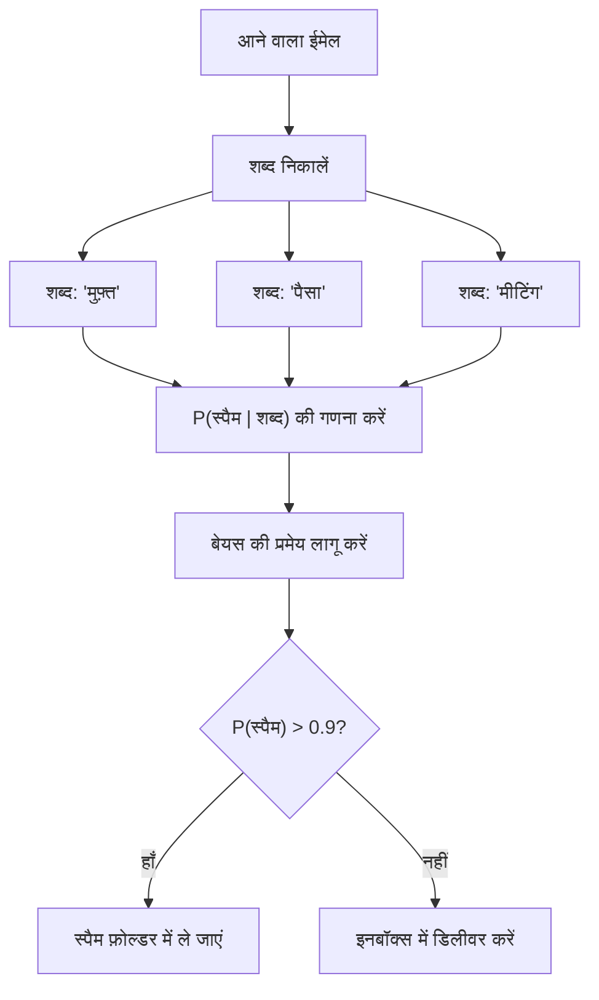
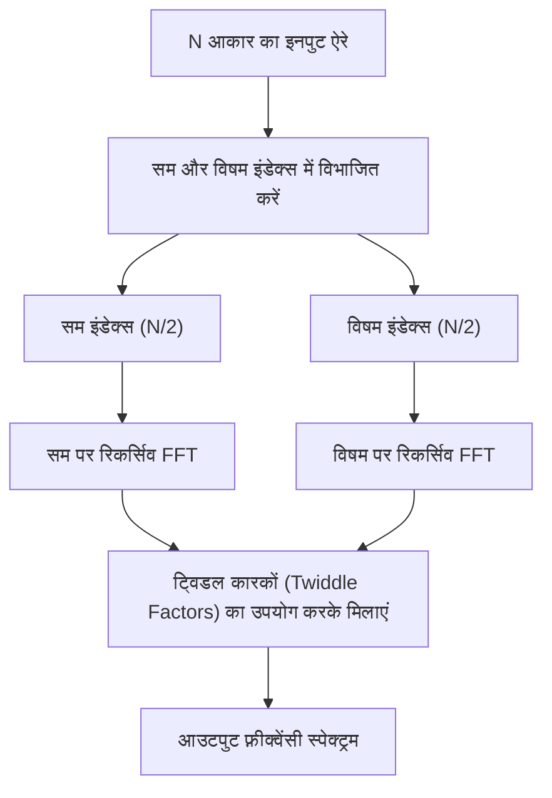
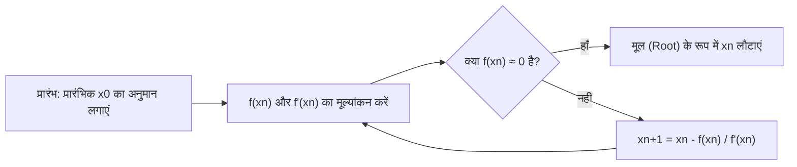
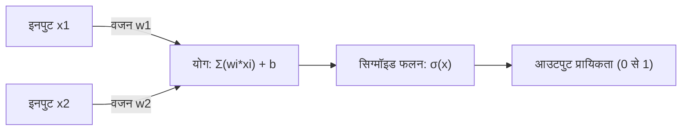

# गणित प्रेमियों के लिए! प्रोग्रामिंग में उपयोगी 10 सुंदर गणितीय सूत्र

प्रोग्रामिंग और गणित पहली नज़र में बिल्कुल अलग क्षेत्र लग सकते हैं। प्रोग्रामिंग तार्किक और ठोस कोड लिखने का काम है, जबकि गणित अमूर्त और सार्वभौमिक सत्य की खोज करने वाला विषय है। हालाँकि, कंप्यूटर विज्ञान के मूल में हमेशा गणित मौजूद रहता है। एल्गोरिदम के अनुकूलन (optimization), डेटा विज्ञान, मशीन लर्निंग, कंप्यूटर ग्राफिक्स, और यहाँ तक ​​कि रोज़मर्रा के अनुप्रयोगों (applications) के पीछे भी, सुंदर गणितीय सूत्र चुपचाप और मजबूती से काम कर रहे हैं।

इस लेख में, हमने 10 ऐसे गणितीय सूत्रों का चयन किया है जो न केवल गणितीय रूप से सुंदर हैं, बल्कि प्रोग्रामिंग और एल्गोरिदम के संदर्भ में भी अत्यधिक व्यावहारिक और महत्वपूर्ण भूमिका निभाते हैं। हम प्रत्येक सूत्र की गणितीय पृष्ठभूमि में गहराई से जाएंगे, और पाइथन (Python) और C++ के विशिष्ट कोड स्निपेट्स के साथ विस्तार से बताएंगे कि प्रोग्रामिंग के क्षेत्र में इन्हें कैसे लागू किया जाता है।

गणित की सुंदरता और प्रोग्रामिंग की व्यावहारिकता के प्रतिच्छेदन (intersection) की दुनिया में आपका स्वागत है।

---

## 1. यूलर की सर्वसमिका (Euler's Identity)

### सूत्र की सुंदरता और अवलोकन
इसे "मानव जाति का खजाना" और "दुनिया का सबसे सुंदर गणितीय सूत्र" कहा जाता है। गणित के पांच सबसे महत्वपूर्ण स्थिरांक (constants) (नेपियर की संख्या $e$, काल्पनिक इकाई $i$, पाई $\pi$, गुणात्मक तत्समक (multiplicative identity) $1$, और योगात्मक तत्समक (additive identity) $0$) को एक ही सरल समीकरण में एकीकृत किया गया है।

$$ e^{i\pi} + 1 = 0 $$

यह सर्वसमिका यूलर के सामान्य सूत्र $e^{i\theta} = \cos\theta + i\sin\theta$ में $\theta = \pi$ प्रतिस्थापित करने पर प्राप्त होती है।

### प्रोग्रामिंग में अनुप्रयोग
प्रोग्रामिंग में, विशेष रूप से कंप्यूटर ग्राफिक्स और गेम डेवलपमेंट में, यूलर का सूत्र "रोटेशन" (rotation) को संभालने के लिए एक बहुत ही शक्तिशाली उपकरण है। 2D स्पेस (2D space) में किसी बिंदु के रोटेशन को मैट्रिक्स गणनाओं के साथ भी किया जा सकता है, लेकिन सम्मिश्र संख्याओं (complex numbers) का उपयोग करने से गणना अत्यंत सरल और सहज हो जाती है। सम्मिश्र तल (complex plane) पर रोटेशन केवल $e^{i\theta}$ से गुणा करके प्राप्त किया जा सकता है, जिससे कोड भी संक्षिप्त हो जाता है।

### कार्यान्वयन का उदाहरण (C++)
यहाँ C++ मानक लाइब्रेरी `<complex>` का उपयोग करके एक प्रोग्राम दिया गया है जो 2D निर्देशांक (coordinates) पर एक बिंदु को निर्दिष्ट कोण (रेडियन) द्वारा घुमाता है।

```cpp
#include <iostream>
#include <complex>
#include <cmath>

// 2D निर्देशांक को सम्मिश्र संख्या के रूप में मानने के लिए टाइप एलियास (type alias)
using Point2D = std::complex<double>;

// बिंदु को मूल बिंदु (origin) के चारों ओर theta (रेडियन) घुमाने वाला फ़ंक्शन
Point2D rotatePoint(const Point2D& point, double theta) {
    // यूलर के सूत्र के आधार पर, रोटेशन के लिए सम्मिश्र संख्या e^{i*theta} बनाएं
    // आंतरिक रूप से यह cos(theta) + i*sin(theta) हो जाता है
    Point2D rotation(std::cos(theta), std::sin(theta));
    
    // सम्मिश्र संख्याओं के गुणन (multiplication) द्वारा रोटेशन लागू करें
    return point * rotation;
}

int main() {
    // प्रारंभिक निर्देशांक (x=1.0, y=0.0)
    Point2D p(1.0, 0.0);
    
    // 90 डिग्री (π/2 रेडियन) रोटेशन
    double theta = M_PI / 2.0;
    Point2D rotated_p = rotatePoint(p, theta);
    
    std::cout << "Original Point: (" << p.real() << ", " << p.imag() << ")\n";
    // अपेक्षित आउटपुट लगभग (0, 1) है
    std::cout << "Rotated Point: (" << rotated_p.real() << ", " << rotated_p.imag() << ")\n";
    
    return 0;
}
```

**विस्तृत व्याख्या**:
इस दृष्टिकोण का लाभ यह है कि रोटेशन मैट्रिक्स गणना (4 गुणन और 2 जोड़) को सम्मिश्र संख्या संचालन (operations) के रूप में एनकैप्सुलेट (encapsulate) किया जा सकता है। इसके अलावा, 3D स्पेस में, इसकी विस्तारित अवधारणा "क्वाटरनियन" (Quaternions) का उपयोग किया जाता है। क्वाटरनियन का उपयोग करके, यूलर एंगल्स (Euler angles) के साथ होने वाली "जिम्बल लॉक" (Gimbal Lock) की घातक समस्या से बचा जा सकता है, और चिकनी गोलाकार रैखिक प्रक्षेप (Spherical Linear Interpolation - Slerp) प्राप्त की जा सकती है।

---

## 2. टेलर श्रृंखला (Taylor Series)

### सूत्र की सुंदरता और अवलोकन
टेलर श्रृंखला एक गणितीय विधि है जो जटिल कार्यों (जैसे त्रिकोणमितीय और घातांकीय कार्य - trigonometric and exponential functions) को अनंत रूप से जारी रहने वाले बहुपदों (polynomials) के योग के रूप में व्यक्त करती है। एक बिंदु $a$ के आसपास फलन $f(x)$ का टेलर विस्तार इस प्रकार परिभाषित किया गया है:

$$ f(x) = \sum_{n=0}^\infty \frac{f^{(n)}(a)}{n!}(x-a)^n $$

विशेष रूप से जब $a=0$ होता है, तो इसे "मैकलॉरिन श्रृंखला" (Maclaurin series) कहा जाता है।

### प्रोग्रामिंग में अनुप्रयोग
कंप्यूटर (CPU या FPU) अनिवार्य रूप से केवल जोड़, घटाव, गुणा और भाग जैसे बुनियादी अंकगणितीय संचालन ही कर सकते हैं। तो, `sin(x)` या `exp(x)` की गणना कैसे की जाती है? आधुनिक प्रोसेसर अक्सर कॉर्डिक (CORDIC) एल्गोरिदम या चेबिशेव सन्निकटन (Chebyshev approximation) का उपयोग करते हैं, लेकिन सॉफ्टवेयर स्तर पर गणितीय कार्यों को लागू करते समय या प्रदर्शन (performance) के लिए कम सटीकता के साथ कस्टम सन्निकटन कार्यों (approximation functions) का निर्माण करते समय, टेलर विस्तार (या इसके प्रकार) सीधे उपयोगी होते हैं।

### कार्यान्वयन का उदाहरण (Python)
नीचे दिया गया पायथन (Python) कोड मैकलॉरिन विस्तार का उपयोग करके ज्या फलन (Sine function) की सन्निकट गणना (approximate calculation) करता है।

$$ \sin(x) \approx x - \frac{x^3}{3!} + \frac{x^5}{5!} - \frac{x^7}{7!} + \dots $$

```python
import math

def taylor_sin(x, terms=10):
    """
    टेलर विस्तार (मैकलॉरिन विस्तार) का उपयोग करके sin(x) की सन्निकट गणना करें।
    
    :param x: कोण (रेडियन)
    :param terms: गणना किए जाने वाले पदों की संख्या (जितना अधिक होगा, सटीकता उतनी ही अधिक होगी)
    :return: अनुमानित sin(x) का मान
    """
    # आवधिकता (periodicity) का उपयोग करके सटीकता में सुधार के लिए x को -π से π की सीमा में सामान्यीकृत (normalize) करें
    x = (x + math.pi) % (2 * math.pi) - math.pi
    
    result = 0.0
    for n in range(terms):
        # केवल विषम पदों का उपयोग करें: 2n + 1
        power = 2 * n + 1
        
        # चिह्न प्रत्येक पद के साथ बदलता है: (-1)^n
        sign = (-1) ** n
        
        # क्रमगुणित (factorial) की गणना
        fact = math.factorial(power)
        
        # सूत्र का मूल्यांकन और जोड़
        term = sign * (x ** power) / fact
        result += term
        
    return result

# परीक्षण (Test)
angle = math.radians(45) # 45 डिग्री = π/4
print(f"Math library sin: {math.sin(angle)}")
print(f"Taylor series sin: {taylor_sin(angle, terms=5)}")
```

**विस्तृत व्याख्या**:
उपरोक्त कोड में, इनपुट मान `x` को $[-\pi, \pi]$ की सीमा में सामान्यीकृत (normalized) किया गया है। इसका कारण यह है कि टेलर विस्तार में यह गुण होता है कि जैसे-जैसे यह विस्तार के केंद्र (यहाँ 0) से दूर जाता है, त्रुटि (truncation error) तेज़ी से बढ़ती है। चूँकि प्रोग्रामिंग में अनंत गणनाएँ संभव नहीं हैं, इसलिए हम एक सीमित `terms` पर गणना को रोक देते हैं। इसके परिणामस्वरूप होने वाली "गोलाई त्रुटि" (rounding error) और "काटने की त्रुटि" (truncation error) के बीच संतुलन का प्रबंधन करना संख्यात्मक कम्प्यूटेशनल प्रोग्रामिंग का मुख्य तत्व है।

---

## 3. बेयस की प्रमेय (Bayes' Theorem)

### सूत्र की सुंदरता और अवलोकन
बेयस की प्रमेय किसी घटना से जुड़े पूर्व ज्ञान (पूर्व प्रायिकता - prior probability) के आधार पर उस घटना की प्रायिकता (पश्च प्रायिकता - posterior probability) को अपडेट करने के लिए एक प्रमेय है। यह संभाव्यता सिद्धांत (probability theory) और सांख्यिकी (statistics) में सबसे महत्वपूर्ण सूत्रों में से short एक है।

$$ P(A|B) = \frac{P(B|A)P(A)}{P(B)} $$

यहाँ, $P(A|B)$ घटना A के घटित होने की प्रायिकता (पश्च प्रायिकता) का प्रतिनिधित्व करता है, इस शर्त पर कि घटना B घटित हुई है।

### प्रोग्रामिंग में अनुप्रयोग
इसका मशीन लर्निंग और डेटा साइंस के क्षेत्र में "नाइव बेयस क्लासिफायर" (Naive Bayes Classifier) के रूप में व्यापक रूप से उपयोग किया जाता है। एक विशिष्ट उदाहरण स्पैम ईमेल फ़िल्टरिंग है। "यदि इस ईमेल में 'मुफ़्त' शब्द है, तो इसके स्पैम होने की प्रायिकता क्या है?" यह गणना पिछले डेटा के आधार पर गतिशील (dynamically) रूप से की जाती है।



### कार्यान्वयन का उदाहरण (Python)
यह स्पैम फ़िल्टर के मूल लॉजिक को दर्शाने वाला कोड है।

```python
def calculate_spam_probability(
    prob_spam, 
    prob_word_given_spam, 
    prob_word_given_ham
):
    """
    बेयस की प्रमेय का उपयोग करके इस संभावना की गणना करें कि एक निश्चित शब्द वाला ईमेल स्पैम है।
    
    :param prob_spam: P(Spam) - ईमेल के स्पैम होने की पूर्व प्रायिकता (prior probability)
    :param prob_word_given_spam: P(Word|Spam) - स्पैम ईमेल में उस शब्द के शामिल होने की प्रायिकता
    :param prob_word_given_ham: P(Word|Ham) - सामान्य ईमेल में उस शब्द के शामिल होने की प्रायिकता
    :return: P(Spam|Word) - यदि वह शब्द शामिल है तो इसके स्पैम होने की प्रायिकता
    """
    # सामान्य ईमेल की पूर्व प्रायिकता P(Ham) = 1 - P(Spam)
    prob_ham = 1.0 - prob_spam
    
    # सभी ईमेल में उस शब्द के प्रकट होने की प्रायिकता P(Word) = P(Word|Spam)P(Spam) + P(Word|Ham)P(Ham)
    # यह कुल प्रायिकता के नियम (Law of total probability) के कारण है
    prob_word = (prob_word_given_spam * prob_spam) + (prob_word_given_ham * prob_ham)
    
    # बेयस की प्रमेय P(Spam|Word) = P(Word|Spam) * P(Spam) / P(Word)
    if prob_word == 0:
        return 0.0 # शून्य से विभाजन से बचें
        
    prob_spam_given_word = (prob_word_given_spam * prob_spam) / prob_word
    return prob_spam_given_word

# उदाहरण: "जीत" (विजेता) शब्द की प्रायिकता
# पिछला डेटा: सभी ईमेल का 20% स्पैम है
p_spam = 0.2
# 80% स्पैम में "जीत" शामिल है
p_win_given_spam = 0.8
# 1% सामान्य ईमेल में "जीत" शामिल है
p_win_given_ham = 0.01

result = calculate_spam_probability(p_spam, p_win_given_spam, p_win_given_ham)
print(f"ईमेल जिसमें 'जीत' है, उसके स्पैम होने की प्रायिकता: {result:.2%}")
```

**विस्तृत व्याख्या**:
वास्तविक कार्यान्वयन (नाइव बेयस क्लासिफायर) में, कई शब्दों की प्रायिकता को एक साथ गुणा किया जाता है। हालाँकि, यदि आप हज़ारों बार प्रायिकता (0 और 1 के बीच का मान) को गुणा करते हैं, तो कंप्यूटर के फ़्लोटिंग-पॉइंट प्रतिनिधित्व (अंडरफ़्लो - underflow) की सीमा के कारण मान शून्य हो जाएगा। इसलिए, व्यावहारिक प्रोग्रामिंग में, प्रायिकताओं के गुणनफल को "लघुगणक के योग" (sum of logarithms) (`log(a * b) = log(a) + log(b)`) में परिवर्तित करने की तकनीक का उपयोग एक आवश्यक तकनीक के रूप में किया जाता है।

---

## 4. शैनन एन्ट्रॉपी (Shannon Entropy)

### सूत्र की सुंदरता और अवलोकन
सूचना सिद्धांत के जनक क्लॉड शैनन द्वारा परिभाषित "एन्ट्रॉपी" एक गणितीय सूत्र है जो किसी सूचना स्रोत की "अनिश्चितता" (uncertainty), "यादृच्छिकता" (randomness), या "औसत सूचना सामग्री" (average information content) को मापता है।

$$ H(X) = - \sum_{i=1}^n P(x_i) \log_2 P(x_i) $$

### प्रोग्रामिंग में अनुप्रयोग
एन्ट्रॉपी फ़ाइल डेटा संपीड़न (हफ़मैन कोडिंग और ज़िप संपीड़न एल्गोरिदम की सैद्धांतिक सीमाएँ), क्रिप्टोग्राफी में यादृच्छिक संख्याओं की शक्ति का मूल्यांकन, और मशीन लर्निंग में "निर्णय वृक्ष" (Decision Trees) एल्गोरिदम (जैसे ID3 और C4.5) में अपरिहार्य है। निर्णय वृक्ष के निर्माण में, हम ऐसी विशेषताओं (features) की तलाश करते हैं जो डेटा को विभाजित करते समय एन्ट्रॉपी (सूचना लाभ: Information Gain) में सबसे बड़ी कमी लाएं।

### कार्यान्वयन का उदाहरण (Python)
यह एक फ़ंक्शन है जो स्ट्रिंग (डेटासेट) की एन्ट्रॉपी की गणना करता है और सूचना की मात्रा का मूल्यांकन करता है।

```python
import math
from collections import Counter

def calculate_entropy(data):
    """
    दिए गए डेटासेट (स्ट्रिंग या सूची) की शैनन एन्ट्रॉपी की गणना करें।
    """
    if not data:
        return 0.0
        
    # प्रत्येक तत्व (element) की घटनाओं की गणना करें
    counts = Counter(data)
    total_len = len(data)
    
    entropy = 0.0
    for element, count in counts.items():
        # प्रकट होने की प्रायिकता P(x_i)
        probability = count / total_len
        
        # - P(x_i) * log2(P(x_i))
        entropy -= probability * math.log2(probability)
        
    return entropy

# परीक्षण (Test)
# यदि सभी अक्षर समान हैं, तो अनिश्चितता 0 है
data_deterministic = "AAAAAAAAAA" 
# यादृच्छिक अक्षरों के लिए, अनिश्चितता अधिक है
data_random = "ABACBCBACB"

print(f"'{data_deterministic}' की एन्ट्रॉपी: {calculate_entropy(data_deterministic)}")
print(f"'{data_random}' की एन्ट्रॉपी: {calculate_entropy(data_random)}")
```

**विस्तृत व्याख्या**:
एन्ट्रॉपी की इकाई "बिट्स" (bits) है। यदि एन्ट्रॉपी `1.5` है, तो इसका मतलब है कि उस डेटा को प्रदर्शित करने के लिए औसतन कम से कम 1.5 बिट प्रति तत्व की आवश्यकता होती है। प्रोग्रामिंग के क्षेत्र में, संपीड़न एल्गोरिदम की दक्षता को मापने के लिए इसे बेंचमार्क (benchmark) के रूप में और मशीन लर्निंग मॉडल में फीचर चयन के लिए एक महत्वपूर्ण संकेतक (indicator) के रूप में नियमित रूप से गणना की जाती है।

---

## 5. फास्ट फूरियर ट्रांसफॉर्म (Fast Fourier Transform - FFT)

### सूत्र की सुंदरता और अवलोकन
डिस्क्रीट फूरियर ट्रांसफॉर्म (DFT) टाइम-डोमेन (time-domain) सिग्नल को फ़्रीक्वेंसी-डोमेन (frequency-domain) सिग्नल में परिवर्तित करता है। सूत्र इस प्रकार है:

$$ X_k = \sum_{n=0}^{N-1} x_n e^{-i 2\pi k n / N} $$

यदि आप इस DFT की सीधे गणना करते हैं, तो समय जटिलता (time complexity) $O(N^2)$ होगी, और डेटा की मात्रा बढ़ने पर गणना बहुत धीमी हो जाएगी। "फास्ट फूरियर ट्रांसफॉर्म (FFT)" एक एल्गोरिदम है जो फूट डालो और राज करो (divide and conquer) दृष्टिकोण का उपयोग करके नाटकीय रूप से इसे $O(N \log N)$ तक तेज़ कर देता है। इसे 20वीं सदी के शीर्ष 10 सबसे महत्वपूर्ण एल्गोरिदम में गिना जाता है।



### प्रोग्रामिंग में अनुप्रयोग
FFT एक आवश्यक तकनीक है जो आधुनिक समाज का समर्थन करती है। यह वॉयस रिकग्निशन (Siri या Alexa), MP3 या JPEG/MPEG डेटा कम्प्रेशन, डिजिटल संचार (digital communication) जैसे LTE और वाई-फाई (Wi-Fi), और यहां तक ​​कि बहुत बड़े पूर्णांक गुणन (Schönhage–Strassen algorithm) में हर जगह काम कर रहा है।

### कार्यान्वयन का उदाहरण (Python)
यह एक पुनरावर्ती (recursive) कूले-ट्यूकी (Cooley-Tukey) एल्गोरिदम का एक सरल कार्यान्वयन उदाहरण है। (*व्यावहारिक उपयोग में, C या असेंबली में अत्यधिक अनुकूलित `FFTW` लाइब्रेरी या `numpy.fft` का उपयोग किया जाता है*)

```python
import cmath

def fft(x):
    """
    1-आयामी (1D) फास्ट फूरियर ट्रांसफॉर्म (FFT) की गणना करें (कूले-ट्यूकी विधि)।
    इनपुट सूची की लंबाई N, 2 की शक्ति (power of 2) होनी चाहिए।
    """
    N = len(x)
    
    # बेस केस (Base case)
    if N <= 1:
        return x
        
    # सम और विषम तत्वों में विभाजित करें (Divide)
    even = fft(x[0::2])
    odd = fft(x[1::2])
    
    # परिणाम मिलाएं (Conquer)
    T = [cmath.exp(-2j * cmath.pi * k / N) * odd[k] for k in range(N // 2)]
    
    # जटिलता को कम करने के लिए समरूपता (symmetry) का उपयोग करें
    return [even[k] + T[k] for k in range(N // 2)] + \
           [even[k] - T[k] for k in range(N // 2)]

# परीक्षण: सरल सिग्नल
signal = [1.0, 1.0, 1.0, 1.0, 0.0, 0.0, 0.0, 0.0]
spectrum = fft(signal)

print("फ़्रीक्वेंसी स्पेक्ट्रम (परिमाण - Magnitude):")
for k, val in enumerate(spectrum):
    # निरपेक्ष मान (absolute value / amplitude) की गणना करें
    print(f"Freq {k}: {abs(val):.3f}")
```

**विस्तृत व्याख्या**:
इस एल्गोरिदम का मुख्य बिंदु यह है कि यह सम्मिश्र संख्याओं की समरूपता (symmetry) और आवधिकता (periodicity) का लाभ उठाता है, जिन्हें "ट्विडल फैक्टर" (Twiddle factor) कहा जाता है। यह अतिरेक (redundancy) को समाप्त करता है और, $N=1024$ के लिए, आवश्यक गणनाओं को $1,048,576$ से घटाकर केवल लगभग $10,240$ कर देता है। इसे वास्तव में गणित और एल्गोरिदम के संलयन (fusion) से निर्मित चमत्कार कहा जा सकता है।

---

## 6. हैवरसाइन का सूत्र (Haversine Formula)

### सूत्र की सुंदरता और अवलोकन
यह एक गोलाकार सतह पर, जैसे पृथ्वी की सतह पर, दो बिंदुओं (बड़ा वृत्त दूरी - Great-circle distance) के बीच की सबसे कम दूरी की गणना करने का सूत्र है।

$$ a = \sin^2\left(\frac{\Delta\phi}{2}\right) + \cos\phi_1 \cos\phi_2 \sin^2\left(\frac{\Delta\lambda}{2}\right) $$
$$ c = 2\cdot \text{atan2}\left(\sqrt{a}, \sqrt{1-a}\right) $$
$$ d = R \cdot c $$

(जहाँ $\phi$ अक्षांश (latitude) है, $\lambda$ देशांतर (longitude) है, और $R$ पृथ्वी की त्रिज्या है)

### प्रोग्रामिंग में अनुप्रयोग
GPS ट्रैकिंग ऐप्स और उबर (Uber) या पोकेमॉन गो (Pokemon GO) जैसी स्थान-आधारित सेवाओं (location-based services) में दो अक्षांश/देशांतर निर्देशांक (coordinates) के बीच की दूरी की गणना करते समय यह एक आवश्यक सूत्र है। पाइथागोरस प्रमेय (Pythagorean theorem) का उपयोग करके सीधी रेखा की दूरी की गणना पृथ्वी की वक्रता (curvature) को ध्यान में नहीं रखती है, जिसके परिणामस्वरूप लंबी दूरी पर बड़ी त्रुटियां होती हैं।

### कार्यान्वयन का उदाहरण (Python)
यह एक फ़ंक्शन है जो दो निर्देशांक (अक्षांश और देशांतर) लेता है और उनकी दूरी (किलोमीटर में) लौटाता है।

```python
import math

def haversine_distance(lat1, lon1, lat2, lon2):
    """
    हैवरसाइन के सूत्र का उपयोग करके दो बिंदुओं के बीच ग्रेट-सर्कल दूरी (great-circle distance) की गणना करें।
    """
    # पृथ्वी की औसत त्रिज्या (किलोमीटर में)
    R = 6371.0 
    
    # अक्षांश और देशांतर को डिग्री से रेडियन में बदलें
    phi1, phi2 = math.radians(lat1), math.radians(lat2)
    delta_phi = math.radians(lat2 - lat1)
    delta_lambda = math.radians(lon2 - lon1)
    
    # हैवरसाइन की गणना
    a = math.sin(delta_phi / 2.0)**2 + \
        math.cos(phi1) * math.cos(phi2) * \
        math.sin(delta_lambda / 2.0)**2
        
    c = 2 * math.atan2(math.sqrt(a), math.sqrt(1 - a))
    
    # दूरी की गणना
    distance = R * c
    return distance

# टोक्यो टावर (35.6586, 139.7454) से स्टैच्यू ऑफ लिबर्टी (40.6892, -74.0445) तक की दूरी
tokyo = (35.6586, 139.7454)
ny = (40.6892, -74.0445)

dist = haversine_distance(tokyo[0], tokyo[1], ny[0], ny[1])
print(f"टोक्यो टावर से स्टैच्यू ऑफ लिबर्टी तक की दूरी: लगभग {dist:.2f} किमी")
```

**विस्तृत व्याख्या**:
गोलाकार त्रिकोणमिति (spherical trigonometry) के कोसाइन के नियम का उपयोग करने का एक तरीका भी है, लेकिन जब दो बिंदुओं के बीच की दूरी बहुत करीब होती है (उदाहरण के लिए, कुछ मीटर), तो फ़्लोटिंग-पॉइंट गणना सटीकता में "कैटास्ट्रोफिक कैंसिलेशन" (Catastrophic cancellation) होने का खतरा होता है। क्योंकि हैवरसाइन का सूत्र `sin^2` का उपयोग करता है, प्रोग्रामिंग में इसका एक बड़ा फायदा है कि यह छोटी दूरी के लिए भी संख्यात्मक रूप से स्थिर गणना (numerically stable calculation) कर सकता है। उच्च सटीकता के लिए, विन्सेंटी के सूत्र (Vincenty's formulae) का उपयोग किया जाता है, जो पृथ्वी को एक दीर्घवृत्ताभ (ellipsoid) मानता है।

---

## 7. न्यूटन-रैफसन विधि (Newton-Raphson Method)

### सूत्र की सुंदरता और अवलोकन
यह एक बहुत ही शक्तिशाली रूट-फाइंडिंग एल्गोरिदम (root-finding algorithm) है जो स्पर्शरेखा (tangent line) का उपयोग करके समीकरण $f(x) = 0$ के मूल (root) को पुनरावृत्त रूप से (iteratively) ढूंढता है।

$$ x_{n+1} = x_n - \frac{f(x_n)}{f'(x_n)} $$

वर्तमान स्थिति $x_n$ पर फ़ंक्शन के मान $f(x_n)$ और उसके ढलान (व्युत्पन्न - derivative) $f'(x_n)$ का उपयोग करके, यह खोजने के लिए अगली अधिक सटीक स्थिति $x_{n+1}$ का अनुमान लगाता है।



### प्रोग्रामिंग में अनुप्रयोग
इसका उपयोग ग्राफिक्स इंजन रेंडरिंग (graphics engine rendering), भौतिकी सिमुलेशन (physics simulation) में टक्कर का पता लगाने (collision detection), अनुकूलन (optimization) समस्याओं आदि में किया जाता है। विशेष रूप से, प्रसिद्ध FPS गेम "Quake III Arena" के सोर्स कोड में "फास्ट इनवर्स स्क्वायर रूट" (Fast Inverse Square Root) एम्बेडेड था। यह $1/\sqrt{x}$ को बहुत तेज़ी से गणना करने के लिए केवल एक बार न्यूटन विधि को लागू करने वाला एक हैक था, और वेक्टर को सामान्य (normalize) करने के लिए आवश्यक था।

### कार्यान्वयन का उदाहरण (C++)
यहाँ न्यूटन की विधि का उपयोग करके मानक वर्गमूल (square root) $\sqrt{N}$ (यानी $x^2 - N = 0$ का समाधान) की गणना करने का एक स्पष्ट उदाहरण दिया गया है। $f(x) = x^2 - N$, $f'(x) = 2x$ होगा।

```cpp
#include <iostream>
#include <cmath>

double newton_sqrt(double N, double tolerance = 1e-7) {
    if (N < 0) return NAN; // ऋणात्मक संख्या का वर्गमूल NaN है
    if (N == 0) return 0;
    
    // प्रारंभिक अनुमान मान (N से ही शुरू करें)
    double x = N; 
    
    while (true) {
        // अगले अनुमानित मान की गणना करें: x_new = x - (x^2 - N) / (2x) = (x + N/x) / 2
        double x_new = 0.5 * (x + N / x);
        
        // यदि परिवर्तन सहिष्णुता (tolerance) से नीचे आता है, तो इसे अभिसरण (converged) माना जाता है
        if (std::abs(x - x_new) < tolerance) {
            break;
        }
        x = x_new;
    }
    
    return x;
}

int main() {
    double number = 612.0;
    std::cout << "Square root of " << number << " is: " << newton_sqrt(number) << "\n";
    return 0;
}
```

**विस्तृत व्याख्या**:
न्यूटन विधि का सबसे बड़ा आकर्षण यह है कि यदि शर्तें पूरी होती हैं, तो यह "द्विघात अभिसरण" (Quadratic convergence) प्राप्त करती है। इसका अर्थ है आश्चर्यजनक अभिसरण गति, जहाँ प्रत्येक पुनरावृत्ति (iteration) के साथ सही अंकों की संख्या लगभग दोगुनी हो जाती है। यह विचार करते हुए कि बाइनरी सर्च (binary search) में रैखिक अभिसरण (linear convergence) होता है, आप देख सकते हैं कि डेरिवेटिव्स (छोटे ढलानों) की जानकारी का उपयोग करना कितना शक्तिशाली है। "Quake III" के हैक में, बिटवाइज़ ऑपरेशन के मैजिक नंबर `0x5f3759df` का उपयोग करके IEEE 754 फ़्लोटिंग-पॉइंट संरचना को हैक करके न्यूटन विधि के पहले प्रारंभिक मान को अविश्वसनीय सटीकता के साथ निकाला गया था।

---

## 8. बेज़ियर कर्व्स (Bézier Curves)

### सूत्र की सुंदरता और अवलोकन
यह एक पैरामीट्रिक समीकरण (parametric equation) है जो कई नियंत्रण बिंदुओं (Control Points) का उपयोग करके एक चिकनी वक्र (curve) को परिभाषित करता है। सबसे अधिक उपयोग किया जाने वाला क्यूबिक बेज़ियर वक्र (Cubic Bézier Curve) 4 बिंदुओं $P_0, P_1, P_2, P_3$ का उपयोग करता है और वक्र पर निर्देशांक $B(t)$ एक पैरामीटर $t \ (0 \le t \le 1)$ द्वारा निर्धारित किए जाते हैं।

$$ B(t) = (1-t)^3 P_0 + 3(1-t)^2 t P_1 + 3(1-t) t^2 P_2 + t^3 P_3 $$

### प्रोग्रामिंग में अनुप्रयोग
बेज़ियर वक्र कंप्यूटर ग्राफिक्स की नींव हैं। इसका उपयोग एडोब इलस्ट्रेटर (Adobe Illustrator) जैसे वेक्टर ड्राइंग टूल्स, फ़ॉन्ट रेंडरिंग (TrueType या OpenType), CSS के `cubic-bezier()` ट्रांज़िशन या एनीमेशन ईज़िंग फ़ंक्शंस, गेम में कैमरा पाथ कंट्रोल और किसी भी "चिकनी गति और आकार" को प्रोग्रामेटिक रूप से खींचने के लिए किया जाता है।

### कार्यान्वयन का उदाहरण (Python)
यह कोड 4 नियंत्रण बिंदुओं से क्यूबिक बेज़ियर वक्र पर बिंदुओं का एक समूह बनाता है।

```python
def cubic_bezier(p0, p1, p2, p3, steps=10):
    """
    क्यूबिक बेज़ियर वक्र पर निर्देशांक की एक सूची तैयार करें।
    p0, p1, p2, p3 (x, y) के टपल (tuple) हैं।
    steps यह है कि वक्र को कितने रेखाखंडों (line segments) में विभाजित करना है।
    """
    curve_points = []
    
    for i in range(steps + 1):
        # पैरामीटर t 0.0 और 1.0 के बीच बदलता है
        t = i / steps
        
        # सूत्र बनाने वाले गुणांकों (coefficients) की गणना
        u = 1 - t
        tt = t * t
        uu = u * u
        uuu = uu * u
        ttt = tt * t
        
        # प्रत्येक बिंदु के लिए x और y निर्देशांक की गणना करें
        x = (uuu * p0[0]) + \
            (3 * uu * t * p1[0]) + \
            (3 * u * tt * p2[0]) + \
            (ttt * p3[0])
            
        y = (uuu * p0[1]) + \
            (3 * uu * t * p1[1]) + \
            (3 * u * tt * p2[1]) + \
            (ttt * p3[1])
            
        curve_points.append((x, y))
        
    return curve_points

# प्रारंभिक बिंदु, नियंत्रण बिंदु 1, नियंत्रण बिंदु 2, अंतिम बिंदु
p0 = (0, 0)
p1 = (5, 10)
p2 = (15, 10)
p3 = (20, 0)

points = cubic_bezier(p0, p1, p2, p3, steps=5)
for i, pt in enumerate(points):
    print(f"t={i/5:.1f} -> Point({pt[0]:.2f}, {pt[1]:.2f})")
```

**विस्तृत व्याख्या**:
यह सूत्र "डी कैस्टेलजाऊ के एल्गोरिदम" (De Casteljau's algorithm) का एक विस्तार है, जो पुनरावर्ती रूप से रैखिक प्रक्षेप (Linear Interpolation: Lerp) लागू करता है। हम बहुपद गणना (बर्नस्टीन बहुपद - Bernstein polynomials) का उपयोग करके सीधे समाधान प्राप्त करते हैं। प्रोग्रामिंग में, एक वक्र को अनगिनत "लघु सीधी रेखाओं" (tiny straight lines) के संग्रह के रूप में सन्निकट (approximated) रूप से खींचा जाता है। इसलिए, $t$ के रिज़ॉल्यूशन (steps) को समायोजित करके, आप प्रदर्शन (performance) और ड्राइंग गुणवत्ता (drawing quality) के बीच संतुलन को नियंत्रित कर सकते हैं।

---

## 9. सिग्मॉइड फलन (Sigmoid Function)

### सूत्र की सुंदरता और अवलोकन
यह एक चिकना S-आकार का फलन (function) है जो किसी भी वास्तविक इनपुट $x \ ( -\infty < x < \infty )$ को $0$ से $1$ के बीच के मान में संपीड़ित (squeeze) कर देता है।

$$ \sigma(x) = \frac{1}{1 + e^{-x}} $$

### प्रोग्रामिंग में अनुप्रयोग
लॉजिस्टिक रिग्रेशन और न्यूरल नेटवर्क (डीप लर्निंग) में "सक्रियण फ़ंक्शन" (Activation Function) के रूप में इसने ऐतिहासिक रूप से बहुत महत्वपूर्ण भूमिका निभाई है। इसका सबसे बड़ा लाभ यह है कि चूंकि आउटपुट 0 और 1 की सीमा के भीतर आता है, इसलिए परिणाम को "प्रायिकता" (probability) के रूप में व्याख्यायित किया जा सकता है।



### कार्यान्वयन का उदाहरण (Python)
यह कोड इनपुट एरे (टेन्सर) पर सिग्मॉइड फलन लागू करता है।

```python
import math

def sigmoid(x):
    """एकल मान के लिए सिग्मॉइड की गणना"""
    # math.exp(-x) को ओवरफ़्लो होने से रोकने के लिए इनपुट मानों को अक्सर सीमित किया जाता है
    # सरलीकरण के लिए एक मानक कार्यान्वयन
    if x >= 0:
        return 1.0 / (1.0 + math.exp(-x))
    else:
        # जब x एक बड़ा ऋणात्मक मान हो तो ओवरफ़्लो को रोकने के उपाय
        return math.exp(x) / (1.0 + math.exp(x))

def apply_sigmoid(array):
    """ऐरे के सभी तत्वों पर सिग्मॉइड फलन लागू करें"""
    return [sigmoid(x) for x in array]

# न्यूरल नेटवर्क की आउटपुट लेयर का कच्चा डेटा (लॉजिट्स - logits)
logits = [-5.0, -1.0, 0.0, 1.0, 5.0]
probabilities = apply_sigmoid(logits)

for val, prob in zip(logits, probabilities):
    print(f"Input: {val:4.1f} -> Probability: {prob:.4f}")
```

**विस्तृत व्याख्या**:
उपरोक्त कोड में `x >= 0` और अन्य मानों के बीच शाखाकरण (branching) "ओवरफ्लो" (overflow) को रोकने के लिए है, जो प्रोग्रामिंग में एक विशिष्ट समस्या है। यह एक संख्यात्मक गणना तकनीक है जो प्रोग्राम को क्रैश होने (या Inf वापस करने) से रोकती है जब वह $x = -1000$ जैसी चीजों के लिए $e^{1000}$ की गणना करने का प्रयास करता है। वर्तमान में, गणना की गति और लुप्त हो रहे ग्रेडिएंट समस्या (vanishing gradient problem) के संदर्भ में डीप लर्निंग की मध्य परतों में ReLU ($f(x) = \max(0, x)$) मुख्यधारा है, लेकिन बाइनरी वर्गीकरण (binary classification) की आउटपुट परत (output layer) में सिग्मॉइड फलन की अभी भी एक निर्विवाद स्थिति है।

---

## 10. यूक्लिडियन दूरी और पाइथागोरस प्रमेय (Euclidean Distance & Pythagorean Theorem)

### सूत्र की सुंदरता और अवलोकन
यह प्राचीन ग्रीस (Ancient Greece) की ज्यामिति (geometry) की नींव है, और यह गणितीय सूत्र $n$-आयामी (n-dimensional) स्थान में दो बिंदुओं के बीच की सीधी रेखा की दूरी को परिभाषित करता है। 2D स्पेस में यह पाइथागोरस प्रमेय ($a^2 + b^2 = c^2$) है।

3D स्पेस में बिंदु $P(x_1, y_1, z_1)$ और $Q(x_2, y_2, z_2)$ के बीच की यूक्लिडियन दूरी $d$ इस प्रकार व्यक्त की जाती है:

$$ d = \sqrt{(x_2-x_1)^2 + (y_2-y_1)^2 + (z_2-z_1)^2} $$

### प्रोग्रामिंग में अनुप्रयोग
यह सभी गेम डेवलपमेंट, फिजिक्स इंजन और मशीन लर्निंग में "के-नियरेस्ट नेबर्स" (K-Nearest Neighbors) और क्लस्टरिंग (K-Means) एल्गोरिदम के लिए मुख्य गणना है। गेम में, पात्रों के बीच टकराव का पता लगाने (Bounding Circle / Sphere Collision) के लिए प्रति फ्रेम लाखों बार इसकी गणना की जाती है।

### कार्यान्वयन का उदाहरण (C++)
यह जाँचने के लिए अनुकूलित (optimized) कोड है कि क्या दो वृत्त (या गोले) आपस में टकरा रहे हैं।

```cpp
#include <iostream>
#include <cmath>

struct Circle {
    double x, y; // केंद्र के निर्देशांक
    double radius; // त्रिज्या
};

// यह जाँचने का फलन कि क्या दो वृत्त आपस में टकरा रहे हैं
bool isColliding(const Circle& a, const Circle& b) {
    // x और y निर्देशांक (डेल्टा) में अंतर
    double dx = b.x - a.x;
    double dy = b.y - a.y;
    
    // दूरी के "वर्ग" (square) की गणना करें
    double distanceSquared = (dx * dx) + (dy * dy);
    
    // त्रिज्याओं के योग के "वर्ग" की गणना करें
    double radiiSum = a.radius + b.radius;
    double radiiSumSquared = radiiSum * radiiSum;
    
    // दूरी के वर्ग की तुलना त्रिज्याओं के योग के वर्ग से करें
    return distanceSquared <= radiiSumSquared;
}

int main() {
    Circle player = {0.0, 0.0, 5.0};
    Circle enemy1 = {8.0, 0.0, 4.0}; // दूरी 8, त्रिज्या का योग 9 -> टकराव
    Circle enemy2 = {10.0, 10.0, 2.0}; // दूरी लगभग 14.1, त्रिज्या का योग 7 -> कोई टकराव नहीं
    
    std::cout << "Collision with enemy1: " << (isColliding(player, enemy1) ? "Yes" : "No") << "\n";
    std::cout << "Collision with enemy2: " << (isColliding(player, enemy2) ? "Yes" : "No") << "\n";
    
    return 0;
}
```

**विस्तृत व्याख्या**:
गणितीय सूत्र के अनुसार गणना करते समय, आपको अंत में वर्गमूल $\sqrt{\cdot}$ लेने की आवश्यकता होती है, लेकिन प्रोग्रामिंग में, `sqrt()` फ़ंक्शन को कॉल करना CPU के लिए बहुत भारी ऑपरेशन (कई क्लॉक साइकल की खपत) है। इसलिए, यदि हम केवल दूरियों की तुलना कर रहे हैं, तो **दोनों पक्षों के वर्ग की तुलना करना** (`distanceSquared <= radiiSumSquared`) गेम प्रोग्रामिंग में एक मानक अभ्यास है। गणितीय समीकरणों और असमानताओं (inequalities) के गुणों का उपयोग करके कम्प्यूटेशनल लोड को कम करने के लिए इस तरह का अनुकूलन एल्गोरिदम डिजाइन का एक रोमांच है।

---

## निष्कर्ष

आपको यह कैसा लगा? यूलर की सर्वसमिका से लेकर पाइथागोरस प्रमेय तक, ये 10 गणितीय सूत्र केवल सैद्धांतिक अवधारणाएँ (theoretical concepts) नहीं हैं जो पाठ्यपुस्तकों में पाई जाती हैं। जिस कोड को हम रोज़ लिखते हैं, उसके पर्दे के पीछे, वे डेटा को संपीड़ित (compress) करने, मशीन लर्निंग मॉडल से भविष्यवाणी करवाने, सुचारू एनिमेशन बनाने, और तेज़ खोज सक्षम करने वाले "हृदय" (heart) के रूप में धड़कते हैं।

गणितीय पृष्ठभूमि को समझना एक कोडर (coder) - जो केवल मौजूदा पुस्तकालयों (जैसे `math.sin` या `numpy.fft`) को कॉल करता है - से एक इंजीनियर (engineer) - जो आंतरिक संरचना को समझता है और इसकी सीमाओं को बढ़ा सकता है - के रूप में अपग्रेड करने के लिए आवश्यक है। अगली बार जब आप कोड लिखें, तो ज़रा कल्पना करने की कोशिश करें कि इसके पीछे कौन सा सुंदर गणितीय सूत्र काम कर रहा है।

**Happy Coding and Math!**
