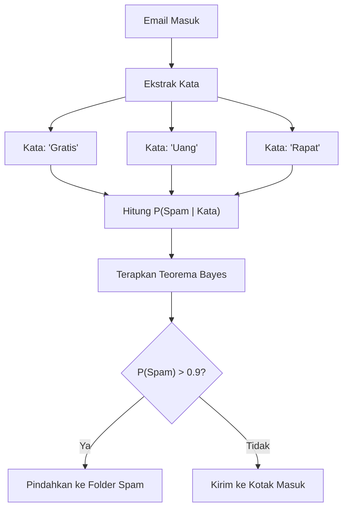
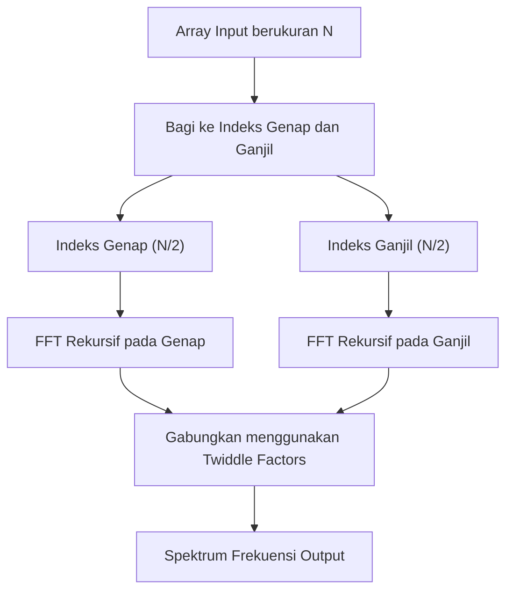
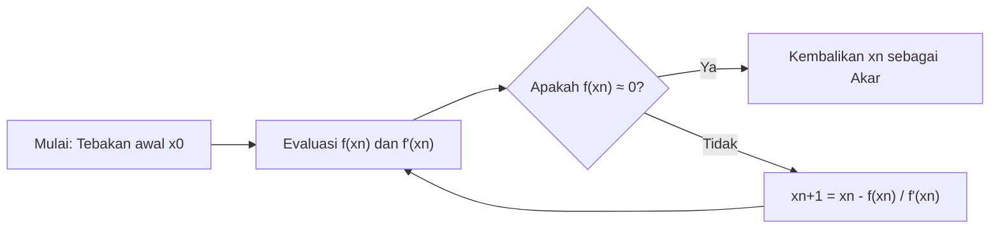
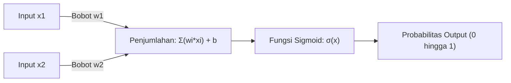

# Wajib Dibaca Pecinta Matematika! 10 Rumus Indah yang Bermanfaat untuk Pemrograman

Pemrograman dan matematika, sekilas mungkin tampak seperti bidang yang sama sekali berbeda. Pemrograman adalah pekerjaan menulis kode yang logis dan konkret, sedangkan matematika adalah disiplin akademis yang mengejar kebenaran abstrak dan universal. Namun, matematika selalu ada pada dasar ilmu komputer. Baik dalam optimalisasi algoritma, sains data, pembelajaran mesin, grafika komputer, maupun di balik aplikasi sehari-hari, rumus-rumus indah bekerja secara diam-diam dan kuat.

Dalam artikel ini, kami telah menyeleksi 10 rumus yang tidak hanya indah secara matematis, tetapi juga memainkan peran yang sangat praktis dan penting dalam konteks pemrograman dan algoritma. Kami akan menggali lebih dalam tentang latar belakang matematis dari setiap rumus, dan menjelaskan secara sangat rinci bagaimana rumus tersebut diaplikasikan di lapangan pemrograman, bersama dengan contoh kode Python dan C++ yang spesifik.

Selamat datang di dunia tempat bertemunya keindahan matematika dan kepraktisan pemrograman.

---

## 1. Identitas Euler (Euler's Identity)

### Keindahan Rumus dan Gambaran Umum
Ini adalah identitas Euler yang sering disebut "Harta Karun Umat Manusia" dan "Rumus Terindah di Dunia". Lima konstanta terpenting dalam matematika (bilangan Euler $e$, unit imajiner $i$, pi $\pi$, elemen identitas perkalian $1$, dan elemen identitas penjumlahan $0$) diintegrasikan ke dalam satu rumus tunggal yang sederhana.

$$ e^{i\pi} + 1 = 0 $$

Identitas ini diturunkan dengan mensubstitusi $\theta = \pi$ ke dalam rumus Euler yang lebih umum $e^{i\theta} = \cos\theta + i\sin\theta$.

### Aplikasi dalam Pemrograman
Dalam pemrograman, khususnya dalam grafika komputer dan pengembangan game, rumus Euler menjadi alat yang sangat kuat untuk menangani "rotasi". Rotasi titik dalam ruang 2D dapat dilakukan dengan perhitungan matriks, tetapi penggunaan bilangan kompleks membuat perhitungan menjadi sangat sederhana dan intuitif. Rotasi pada bidang kompleks dapat diwujudkan hanya dengan mengalikannya dengan $e^{i\theta}$, sehingga kodenya menjadi ringkas.

### Contoh Implementasi (C++)
Berikut adalah program yang merotasi suatu titik pada koordinat 2D dengan sudut (radian) yang ditentukan, menggunakan pustaka standar C++ `<complex>`.

```cpp
#include <iostream>
#include <complex>
#include <cmath>

// Alias tipe untuk menangani koordinat 2D sebagai bilangan kompleks
using Point2D = std::complex<double>;

// Fungsi untuk merotasi titik sebesar theta (radian) dengan pusat di titik asal (origin)
Point2D rotatePoint(const Point2D& point, double theta) {
    // Membuat bilangan kompleks untuk rotasi e^{i*theta} berdasarkan rumus Euler
    // Secara internal menjadi cos(theta) + i*sin(theta)
    Point2D rotation(std::cos(theta), std::sin(theta));
    
    // Menerapkan rotasi dengan perkalian bilangan kompleks
    return point * rotation;
}

int main() {
    // Koordinat awal (x=1.0, y=0.0)
    Point2D p(1.0, 0.0);
    
    // Rotasi 90 derajat (π/2 radian)
    double theta = M_PI / 2.0;
    Point2D rotated_p = rotatePoint(p, theta);
    
    std::cout << "Original Point: (" << p.real() << ", " << p.imag() << ")\n";
    // Output yang diharapkan adalah sekitar (0, 1)
    std::cout << "Rotated Point: (" << rotated_p.real() << ", " << rotated_p.imag() << ")\n";
    
    return 0;
}
```

**Penjelasan Rinci**:
Keuntungan dari pendekatan ini adalah bahwa perhitungan matriks rotasi (4 perkalian dan 2 penjumlahan) dapat dienkapsulasi sebagai operasi bilangan kompleks. Selain itu, dalam ruang 3D, konsep perluasannya yaitu "Quaternion" digunakan. Dengan menggunakan quaternion, kita dapat menghindari masalah fatal yang disebut "Gimbal Lock" yang terjadi dengan sudut Euler, dan mewujudkan interpolasi linier bola yang halus (Slerp).

---

## 2. Deret Taylor (Taylor Series)

### Keindahan Rumus dan Gambaran Umum
Deret Taylor adalah metode matematis untuk merepresentasikan fungsi kompleks (seperti fungsi trigonometri dan fungsi eksponensial) sebagai jumlah dari polinomial tak hingga. Deret Taylor dari fungsi $f(x)$ di sekitar suatu titik $a$ didefinisikan sebagai berikut:

$$ f(x) = \sum_{n=0}^\infty \frac{f^{(n)}(a)}{n!}(x-a)^n $$

Secara khusus, kasus di mana $a=0$ disebut "Deret Maclaurin".

### Aplikasi dalam Pemrograman
Komputer (CPU atau FPU) pada dasarnya hanya dapat menjalankan operasi aritmetika dasar seperti penjumlahan, pengurangan, perkalian, dan pembagian. Lalu, bagaimana `sin(x)` atau `exp(x)` dihitung? Meskipun prosesor modern sering kali menggunakan algoritma CORDIC atau aproksimasi Chebyshev, deret Taylor (atau variannya) sangat berguna secara langsung saat mengimplementasikan fungsi matematika di tingkat perangkat lunak, atau saat membuat sendiri fungsi aproksimasi berkecepatan tinggi dengan presisi yang diturunkan untuk tujuan performa.

### Contoh Implementasi (Python)
Berikut adalah kode Python yang menghitung aproksimasi fungsi sinus (Sine) menggunakan deret Maclaurin.

$$ \sin(x) \approx x - \frac{x^3}{3!} + \frac{x^5}{5!} - \frac{x^7}{7!} + \dots $$

```python
import math

def taylor_sin(x, terms=10):
    """
    Menghitung aproksimasi sin(x) menggunakan deret Taylor (deret Maclaurin).
    
    :param x: Sudut (radian)
    :param terms: Jumlah suku yang dihitung (lebih banyak berarti presisi lebih tinggi)
    :return: Nilai aproksimasi sin(x)
    """
    # Menggunakan periodisitas untuk menormalkan x ke rentang -π hingga π (untuk meningkatkan akurasi)
    x = (x + math.pi) % (2 * math.pi) - math.pi
    
    result = 0.0
    for n in range(terms):
        # Hanya menggunakan suku ganjil: 2n + 1
        power = 2 * n + 1
        
        # Tanda bergantian di setiap suku: (-1)^n
        sign = (-1) ** n
        
        # Perhitungan faktorial
        fact = math.factorial(power)
        
        # Evaluasi persamaan dan penjumlahan
        term = sign * (x ** power) / fact
        result += term
        
    return result

# Pengujian
angle = math.radians(45) # 45 derajat = π/4
print(f"Math library sin: {math.sin(angle)}")
print(f"Taylor series sin: {taylor_sin(angle, terms=5)}")
```

**Penjelasan Rinci**:
Pada kode di atas, nilai input `x` dinormalisasi ke dalam rentang $[-\pi, \pi]$. Ini karena deret Taylor memiliki karakteristik di mana kesalahan akan tumbuh dengan cepat (kesalahan pemotongan/truncation error) semakin jauh dari titik pusat ekspansi (di sini 0). Karena tidak mungkin melakukan perhitungan tak terhingga dalam pemrograman, perhitungan dipotong pada `terms` yang terhingga. Mengelola *trade-off* antara "kesalahan pembulatan" dan "kesalahan pemotongan" yang diakibatkannya adalah poin penting dalam pemrograman komputasi numerik.

---

## 3. Teorema Bayes (Bayes' Theorem)

### Keindahan Rumus dan Gambaran Umum
Teorema Bayes adalah teorema untuk memperbarui probabilitas suatu peristiwa (probabilitas posterior) berdasarkan pengetahuan sebelumnya (probabilitas prior) yang berkaitan dengan peristiwa tersebut. Ini adalah salah satu rumus paling penting dalam teori probabilitas dan statistik.

$$ P(A|B) = \frac{P(B|A)P(A)}{P(B)} $$

Di sini, $P(A|B)$ mewakili probabilitas bahwa peristiwa A terjadi dengan syarat peristiwa B telah terjadi (probabilitas posterior).

### Aplikasi dalam Pemrograman
Ini digunakan secara luas di bidang pembelajaran mesin dan sains data sebagai "Naive Bayes Classifier". Contoh aplikasi yang paling representatif adalah pemfilteran email spam. Perhitungan seperti "Jika email ini berisi kata 'gratis', berapa probabilitasnya bahwa ini adalah spam?" dihitung secara dinamis berdasarkan data historis.



### Contoh Implementasi (Python)
Ini adalah kode yang menunjukkan logika dasar pemfilteran spam.

```python
def calculate_spam_probability(
    prob_spam, 
    prob_word_given_spam, 
    prob_word_given_ham
):
    """
    Menghitung probabilitas bahwa email berisi kata tertentu adalah spam menggunakan Teorema Bayes.
    
    :param prob_spam: P(Spam) - Probabilitas prior email adalah spam
    :param prob_word_given_spam: P(Kata|Spam) - Probabilitas kata tersebut muncul di email spam
    :param prob_word_given_ham: P(Kata|Ham) - Probabilitas kata tersebut muncul di email normal
    :return: P(Spam|Kata) - Probabilitas spam jika email tersebut mengandung kata itu
    """
    # Probabilitas prior email normal P(Ham) = 1 - P(Spam)
    prob_ham = 1.0 - prob_spam
    
    # Probabilitas kemunculan kata tersebut di seluruh email P(Kata) = P(Kata|Spam)P(Spam) + P(Kata|Ham)P(Ham)
    # Ini berdasarkan teorema probabilitas total
    prob_word = (prob_word_given_spam * prob_spam) + (prob_word_given_ham * prob_ham)
    
    # Teorema Bayes P(Spam|Kata) = P(Kata|Spam) * P(Spam) / P(Kata)
    if prob_word == 0:
        return 0.0 # Mencegah pembagian dengan nol
        
    prob_spam_given_word = (prob_word_given_spam * prob_spam) / prob_word
    return prob_spam_given_word

# Contoh: Probabilitas kata "menang"
# Data historis: 20% dari seluruh email adalah spam
p_spam = 0.2
# 80% dari spam mengandung kata "menang"
p_win_given_spam = 0.8
# 1% dari email normal mengandung kata "menang"
p_win_given_ham = 0.01

result = calculate_spam_probability(p_spam, p_win_given_spam, p_win_given_ham)
print(f"Probabilitas email yang mengandung kata 'menang' adalah spam: {result:.2%}")
```

**Penjelasan Rinci**:
Pada implementasi aktual (pengklasifikasi Naive Bayes), probabilitas dihitung dengan mengalikan probabilitas dari banyak kata. Namun, jika Anda mengalikan probabilitas (nilai dari 0 hingga 1) ribuan kali, nilainya akan menjadi nol karena keterbatasan representasi *floating-point* komputer (*underflow*). Oleh karena itu, dalam pemrograman nyata, metode mengubah hasil kali probabilitas menjadi "jumlah logaritma" (`log(a * b) = log(a) + log(b)`) digunakan sebagai teknik wajib.

---

## 4. Entropi Shannon (Shannon Entropy)

### Keindahan Rumus dan Gambaran Umum
"Entropi" yang didefinisikan oleh bapak teori informasi, Claude Shannon, adalah rumus yang mengukur "ketidakpastian", "keacakan", atau "jumlah rata-rata informasi" dari sebuah sumber informasi.

$$ H(X) = - \sum_{i=1}^n P(x_i) \log_2 P(x_i) $$

### Aplikasi dalam Pemrograman
Entropi sangat diperlukan untuk kompresi data file (batas teoritis algoritma pengkodean Huffman dan kompresi ZIP), evaluasi kekuatan angka acak dalam teori kriptografi, serta algoritma "Pohon Keputusan (Decision Trees)" (seperti ID3 dan C4.5) dalam pembelajaran mesin. Dalam membangun pohon keputusan, kita mencari fitur yang memaksimalkan penurunan entropi (Information Gain) saat data dibagi.

### Contoh Implementasi (Python)
Berikut adalah fungsi untuk menghitung entropi dari string (kumpulan data) dan mengevaluasi jumlah informasinya.

```python
import math
from collections import Counter

def calculate_entropy(data):
    """
    Menghitung entropi Shannon dari dataset (string atau list) yang diberikan.
    """
    if not data:
        return 0.0
        
    # Menghitung frekuensi kemunculan setiap elemen
    counts = Counter(data)
    total_len = len(data)
    
    entropy = 0.0
    for element, count in counts.items():
        # Probabilitas kemunculan P(x_i)
        probability = count / total_len
        
        # - P(x_i) * log2(P(x_i))
        entropy -= probability * math.log2(probability)
        
    return entropy

# Pengujian
# Jika semua karakternya sama, ketidakpastiannya adalah 0
data_deterministic = "AAAAAAAAAA" 
# Jika karakternya acak, ketidakpastiannya tinggi
data_random = "ABACBCBACB"

print(f"Entropy of '{data_deterministic}': {calculate_entropy(data_deterministic)}")
print(f"Entropy of '{data_random}': {calculate_entropy(data_random)}")
```

**Penjelasan Rinci**:
Satuan entropi adalah "bit" (bits). Jika entropinya adalah `1.5`, ini berarti dibutuhkan rata-rata minimal 1.5 bit per elemen untuk merepresentasikan data tersebut. Di lapangan pemrograman, entropi dihitung secara rutin sebagai patokan (benchmark) untuk mengukur efisiensi algoritma kompresi, maupun sebagai indikator penting dalam pemilihan fitur untuk model pembelajaran mesin.

---

## 5. Transformasi Fourier Cepat (Fast Fourier Transform - FFT)

### Keindahan Rumus dan Gambaran Umum
Transformasi Fourier Diskret (DFT) mengubah sinyal di domain waktu menjadi sinyal di domain frekuensi. Rumusnya adalah sebagai berikut:

$$ X_k = \sum_{n=0}^{N-1} x_n e^{-i 2\pi k n / N} $$

Jika DFT dihitung secara polos, kompleksitas waktunya (*time complexity*) adalah $O(N^2)$, dan perhitungan akan menjadi sangat lambat secara eksponensial saat jumlah data meningkat. Algoritma yang secara dramatis mempercepat ini menggunakan pendekatan *divide-and-conquer* menjadi $O(N \log N)$ adalah "Transformasi Fourier Cepat (FFT)". Ini diakui sebagai salah satu dari 10 algoritma paling penting di abad ke-20.



### Aplikasi dalam Pemrograman
FFT adalah teknologi krusial yang menopang masyarakat modern. Ia beroperasi di mana-mana, mulai dari pengenalan suara (Siri dan Alexa), kompresi data MP3 atau JPEG/MPEG, komunikasi digital seperti LTE dan Wi-Fi, hingga perkalian bilangan bulat yang sangat besar (algoritma Schönhage–Strassen).

### Contoh Implementasi (Python)
Berikut adalah contoh implementasi algoritma Cooley-Tukey tipe rekursif yang sederhana. (*Dalam praktiknya, kita menggunakan pustaka `FFTW` atau `numpy.fft` yang sangat dioptimalkan dalam C atau assembler*)

```python
import cmath

def fft(x):
    """
    Menghitung Transformasi Fourier Cepat (FFT) 1 dimensi (metode Cooley-Tukey).
    Panjang list input N harus merupakan pangkat dari 2.
    """
    N = len(x)
    
    # Kasus dasar (base case)
    if N <= 1:
        return x
        
    # Membagi elemen menjadi indeks genap dan ganjil (Divide)
    even = fft(x[0::2])
    odd = fft(x[1::2])
    
    # Menggabungkan hasil (Conquer)
    T = [cmath.exp(-2j * cmath.pi * k / N) * odd[k] for k in range(N // 2)]
    
    # Memanfaatkan simetri untuk mengurangi jumlah perhitungan
    return [even[k] + T[k] for k in range(N // 2)] + \
           [even[k] - T[k] for k in range(N // 2)]

# Pengujian: Sinyal sederhana
signal = [1.0, 1.0, 1.0, 1.0, 0.0, 0.0, 0.0, 0.0]
spectrum = fft(signal)

print("Frequency Spectrum (Magnitude):")
for k, val in enumerate(spectrum):
    # Menghitung nilai absolut (magnitudo)
    print(f"Freq {k}: {abs(val):.3f}")
```

**Penjelasan Rinci**:
Inti dari algoritma ini adalah pemanfaatan simetri dan periodisitas bilangan kompleks yang disebut sebagai "faktor putaran (Twiddle factor)". Ini menghilangkan pemborosan dari perhitungan yang berulang. Untuk $N=1024$, jumlah operasi yang seharusnya membutuhkan $1,048,576$ perhitungan dikurangi menjadi hanya sekitar $10,240$ perhitungan. Hal ini benar-benar dapat dikatakan sebagai sebuah keajaiban yang dihasilkan dari perpaduan matematika dan algoritma.

---

## 6. Rumus Haversine (Haversine Formula)

### Keindahan Rumus dan Gambaran Umum
Ini adalah rumus untuk menghitung jarak terpendek (jarak lingkaran besar) antara 2 titik di atas permukaan bola seperti permukaan bumi.

$$ a = \sin^2\left(\frac{\Delta\phi}{2}\right) + \cos\phi_1 \cos\phi_2 \sin^2\left(\frac{\Delta\lambda}{2}\right) $$
$$ c = 2\cdot \text{atan2}\left(\sqrt{a}, \sqrt{1-a}\right) $$
$$ d = R \cdot c $$

(Di sini, $\phi$ adalah lintang, $\lambda$ adalah bujur, dan $R$ adalah jari-jari bumi)

### Aplikasi dalam Pemrograman
Rumus ini wajib digunakan ketika menghitung jarak antara dua koordinat garis lintang dan bujur dalam aplikasi pelacakan GPS, atau layanan berbasis lokasi seperti Uber dan Pokemon GO. Menghitung jarak lurus menggunakan teorema Pythagoras tidak dapat memperhitungkan kelengkungan bumi, sehingga akan terjadi kesalahan (error) besar dalam jarak yang jauh.

### Contoh Implementasi (Python)
Ini adalah fungsi yang menerima 2 koordinat (lintang dan bujur) dan mengembalikan jarak (kilometer).

```python
import math

def haversine_distance(lat1, lon1, lat2, lon2):
    """
    Menghitung jarak lingkaran besar antara dua titik menggunakan rumus Haversine.
    """
    # Jari-jari rata-rata Bumi (kilometer)
    R = 6371.0 
    
    # Mengonversi lintang/bujur dari derajat ke radian
    phi1, phi2 = math.radians(lat1), math.radians(lat2)
    delta_phi = math.radians(lat2 - lat1)
    delta_lambda = math.radians(lon2 - lon1)
    
    # Perhitungan Haversine
    a = math.sin(delta_phi / 2.0)**2 + \
        math.cos(phi1) * math.cos(phi2) * \
        math.sin(delta_lambda / 2.0)**2
        
    c = 2 * math.atan2(math.sqrt(a), math.sqrt(1 - a))
    
    # Menghitung jarak
    distance = R * c
    return distance

# Jarak dari Menara Tokyo (35.6586, 139.7454) ke Patung Liberty (40.6892, -74.0445)
tokyo = (35.6586, 139.7454)
ny = (40.6892, -74.0445)

dist = haversine_distance(tokyo[0], tokyo[1], ny[0], ny[1])
print(f"Jarak dari Menara Tokyo ke Patung Liberty: sekitar {dist:.2f} km")
```

**Penjelasan Rinci**:
Terdapat juga cara menggunakan hukum kosinus dari trigonometri bola, namun ketika jarak antara dua titik sangat dekat (misalnya beberapa meter), lebih rentan terjadi "Catastrophic cancellation" dalam akurasi perhitungan *floating-point*. Rumus Haversine memiliki keuntungan besar dalam pemrograman karena menggunakan `sin^2`, sehingga perhitungan stabil secara numerik bahkan untuk jarak yang sangat kecil. Jika dibutuhkan akurasi yang lebih tinggi lagi, digunakan rumus Vincenty (Vincenty's formulae) yang memperlakukan bentuk Bumi sebagai ellipsoid.

---

## 7. Metode Newton-Raphson (Newton-Raphson Method)

### Keindahan Rumus dan Gambaran Umum
Metode ini adalah algoritma pencarian akar yang sangat kuat untuk secara iteratif menemukan solusi (akar) dari persamaan $f(x) = 0$ dengan menggunakan garis singgung.

$$ x_{n+1} = x_n - \frac{f(x_n)}{f'(x_n)} $$

Metode ini menebak posisi yang lebih akurat $x_{n+1}$ yang harus dicari selanjutnya, menggunakan nilai fungsi $f(x_n)$ pada posisi saat ini $x_n$ dan kemiringannya (turunan) $f'(x_n)$.



### Aplikasi dalam Pemrograman
Digunakan untuk rendering dalam *graphics engine*, deteksi tabrakan pada simulasi fisik, hingga masalah optimasi. Yang patut disorot adalah "Fast Inverse Square Root", yang tertanam di *source code* game FPS legendaris, "Quake III Arena". Itu adalah sebuah peretasan yang menerapkan metode Newton hanya sekali untuk menghitung nilai $1/\sqrt{x}$ dengan sangat cepat, yang sangat diperlukan untuk menormalisasi vektor.

### Contoh Implementasi (C++)
Berikut ini adalah contoh pencarian akar kuadrat standar $\sqrt{N}$ (yaitu, solusi dari $x^2 - N = 0$) secara mudah dipahami dengan menggunakan metode Newton. Di mana $f(x) = x^2 - N$, $f'(x) = 2x$.

```cpp
#include <iostream>
#include <cmath>

double newton_sqrt(double N, double tolerance = 1e-7) {
    if (N < 0) return NAN; // Akar kuadrat dari bilangan negatif adalah NaN
    if (N == 0) return 0;
    
    // Nilai tebakan awal (mulai dari N itu sendiri)
    double x = N; 
    
    while (true) {
        // Menghitung nilai tebakan selanjutnya: x_new = x - (x^2 - N) / (2x) = (x + N/x) / 2
        double x_new = 0.5 * (x + N / x);
        
        // Dianggap konvergen jika perubahannya berada di bawah batas toleransi
        if (std::abs(x - x_new) < tolerance) {
            break;
        }
        x = x_new;
    }
    
    return x;
}

int main() {
    double number = 612.0;
    std::cout << "Square root of " << number << " is: " << newton_sqrt(number) << "\n";
    return 0;
}
```

**Penjelasan Rinci**:
Daya tarik terbesar dari metode Newton adalah, jika kondisinya terpenuhi, konvergensinya bersifat kuadratik ("Quadratic convergence"). Ini menunjukkan kecepatan konvergensi yang luar biasa, di mana pada setiap iterasinya, jumlah digit yang benar akan menjadi sekitar dua kali lipatnya. Mengingat bahwa pencarian biner (*binary search*) memiliki konvergensi linier, ini membuktikan kehebatan pemanfaatan informasi turunan (kemiringan kecil). Dalam *hack* "Quake III", nilai awal dari metode Newton ini dihasilkan dengan akurasi yang mencengangkan berkat meretas struktur *floating-point* IEEE 754 menggunakan *magic number* `0x5f3759df` secara *bitwise*.

---

## 8. Kurva Bézier (Bézier Curves)

### Keindahan Rumus dan Gambaran Umum
Persamaan parametrik yang mendefinisikan kurva halus menggunakan sejumlah titik kontrol (Control Points). Kurva Bézier Kubik (Cubic Bézier Curve) yang paling sering digunakan, mempunyai 4 titik yaitu $P_0, P_1, P_2, P_3$, dan posisi koordinat $B(t)$ pada kurva ditentukan oleh variabel perantara $t \ (0 \le t \le 1)$.

$$ B(t) = (1-t)^3 P_0 + 3(1-t)^2 t P_1 + 3(1-t) t^2 P_2 + t^3 P_3 $$

### Aplikasi dalam Pemrograman
Kurva Bézier merupakan fondasi grafika komputer. Kurva ini digunakan di alat gambar vektor seperti Adobe Illustrator, rendering font (seperti TrueType dan OpenType), fungsi *easing* pada transisi CSS dan animasi `cubic-bezier()`, manipulasi *camera path* dalam game, dan masih banyak lagi. Ini selalu digunakan setiap kali memprogram "gerakan atau bentuk yang mulus".

### Contoh Implementasi (Python)
Kode untuk menghasilkan kumpulan titik pada kurva Bézier kubik yang terbentuk dari 4 titik kontrol.

```python
def cubic_bezier(p0, p1, p2, p3, steps=10):
    """
    Menghasilkan daftar koordinat pada kurva Bézier kubik.
    p0, p1, p2, p3 adalah tuple (x, y).
    steps adalah seberapa banyak kurva akan dibagi menjadi segmen-segmen garis.
    """
    curve_points = []
    
    for i in range(steps + 1):
        # Parameter t bervariasi dari 0.0 hingga 1.0
        t = i / steps
        
        # Perhitungan koefisien penyusun persamaan
        u = 1 - t
        tt = t * t
        uu = u * u
        uuu = uu * u
        ttt = tt * t
        
        # x dan y dihitung untuk masing-masing titik koordinat
        x = (uuu * p0[0]) + \
            (3 * uu * t * p1[0]) + \
            (3 * u * tt * p2[0]) + \
            (ttt * p3[0])
            
        y = (uuu * p0[1]) + \
            (3 * uu * t * p1[1]) + \
            (3 * u * tt * p2[1]) + \
            (ttt * p3[1])
            
        curve_points.append((x, y))
        
    return curve_points

# Titik awal, Titik kontrol 1, Titik kontrol 2, Titik akhir
p0 = (0, 0)
p1 = (5, 10)
p2 = (15, 10)
p3 = (20, 0)

points = cubic_bezier(p0, p1, p2, p3, steps=5)
for i, pt in enumerate(points):
    print(f"t={i/5:.1f} -> Point({pt[0]:.2f}, {pt[1]:.2f})")
```

**Penjelasan Rinci**:
Rumus matematika di atas merupakan bentuk perluasan dari "Algoritma De Casteljau (De Casteljau's algorithm)" yang menerapkan Interpolasi Linier (Lerp) secara rekursif. Solusi langsung ini diperoleh melalui manipulasi polinomial (polinomial Bernstein). Pada pemrograman komputer, kurva direpresentasikan secara hampiran (*approximation*) sebagai kumpulan segmen garis lurus yang sangat banyak. Oleh sebab itu, dengan mengatur resolusi (steps) dari $t$, Anda dapat mengendalikan keseimbangan antara performa dan kualitas grafis.

---

## 9. Fungsi Sigmoid (Sigmoid Function)

### Keindahan Rumus dan Gambaran Umum
Fungsi berbentuk kurva S yang mulus, yang memampatkan nilai input bilangan riil $x \ ( -\infty < x < \infty )$ apa pun sehingga hasilnya pasti akan berada di rentang $0$ hingga $1$.

$$ \sigma(x) = \frac{1}{1 + e^{-x}} $$

### Aplikasi dalam Pemrograman
Fungsi ini telah secara historis memainkan peran yang sangat krusial sebagai "Fungsi Aktivasi (Activation Function)" dalam Regresi Logistik dan Jaringan Saraf Tiruan (*Deep Learning*). Nilai output yang berada dalam rentang 0 hingga 1 merupakan keunggulan utama fungsi ini, karena nilai tersebut dapat diinterpretasikan sebagai "probabilitas".



### Contoh Implementasi (Python)
Kode yang mengaplikasikan fungsi Sigmoid terhadap sebuah array (tensor) input.

```python
import math

def sigmoid(x):
    """Perhitungan fungsi sigmoid untuk nilai tunggal"""
    # Seringkali nilai input dibatasi agar math.exp(-x) tidak mengalami overflow
    # Implementasi standar yang disederhanakan
    if x >= 0:
        return 1.0 / (1.0 + math.exp(-x))
    else:
        # Pencegahan overflow ketika x adalah nilai negatif yang besar
        return math.exp(x) / (1.0 + math.exp(x))

def apply_sigmoid(array):
    """Menerapkan fungsi sigmoid pada semua elemen dalam array"""
    return [sigmoid(x) for x in array]

# Data mentah lapisan output pada Jaringan Saraf Tiruan (logits)
logits = [-5.0, -1.0, 0.0, 1.0, 5.0]
probabilities = apply_sigmoid(logits)

for val, prob in zip(logits, probabilities):
    print(f"Input: {val:4.1f} -> Probability: {prob:.4f}")
```

**Penjelasan Rinci**:
Pada kode di atas, kita melakukan percabangan `x >= 0` dan kebalikannya untuk mencegah terjadinya "overflow", yaitu masalah spesifik dalam pemrograman. Ini adalah teknik komputasi numerik untuk mencegah program crash (atau mengembalikan Inf) saat mencoba menghitung nilai $e^{1000}$ ketika nilai inputnya $x = -1000$. Saat ini, dalam *Deep Learning*, ReLU ($f(x) = \max(0, x)$) merupakan fungsi aktivasi yang paling dominan di *hidden layer* karena alasan kecepatan komputasi dan untuk menghindari masalah *vanishing gradient*. Namun demikian, fungsi sigmoid masih memegang peranan penting dan kedudukan yang kuat untuk fungsi *output* pada klasifikasi biner.

---

## 10. Jarak Euclidean dan Teorema Pythagoras (Euclidean Distance & Pythagorean Theorem)

### Keindahan Rumus dan Gambaran Umum
Sebagai fondasi geometri yang berasal dari Yunani kuno, rumus ini mendefinisikan jarak garis lurus antara dua titik dalam ruang $n$-dimensi. Dalam ruang 2 dimensi, ini tidak lain adalah Teorema Pythagoras itu sendiri ($a^2 + b^2 = c^2$).

Jarak Euclidean $d$ antara titik $P(x_1, y_1, z_1)$ dan $Q(x_2, y_2, z_2)$ dalam ruang 3 dimensi dinyatakan sebagai berikut:

$$ d = \sqrt{(x_2-x_1)^2 + (y_2-y_1)^2 + (z_2-z_1)^2} $$

### Aplikasi dalam Pemrograman
Ini adalah inti dari kalkulasi di setiap pengembangan game, *physics engine*, serta algoritma "K-Nearest Neighbors (K-NN)" dan pengklasteran (K-Means) dalam *machine learning*. Dalam game, perhitungan ini dieksekusi jutaan kali setiap frame untuk deteksi tabrakan antar karakter (Bounding Circle / Sphere Collision).

### Contoh Implementasi (C++)
Sintaks kode di bawah ini memproses penilaian tabrakan antara dua lingkaran (atau bola) yang sudah dioptimalkan.

```cpp
#include <iostream>
#include <cmath>

struct Circle {
    double x, y; // Titik pusat koordinat
    double radius; // Jari-jari
};

// Fungsi untuk mengecek apakah dua lingkaran bertabrakan
bool isColliding(const Circle& a, const Circle& b) {
    // Selisih antara nilai koordinat x dan y (delta)
    double dx = b.x - a.x;
    double dy = b.y - a.y;
    
    // Menghitung "kuadrat" jarak
    double distanceSquared = (dx * dx) + (dy * dy);
    
    // Menghitung "kuadrat" jumlah dari jari-jari
    double radiiSum = a.radius + b.radius;
    double radiiSumSquared = radiiSum * radiiSum;
    
    // Membandingkan kuadrat jarak dengan kuadrat jumlah jari-jari
    return distanceSquared <= radiiSumSquared;
}

int main() {
    Circle player = {0.0, 0.0, 5.0};
    Circle enemy1 = {8.0, 0.0, 4.0}; // Jarak 8, Total radius 9 -> Bertabrakan
    Circle enemy2 = {10.0, 10.0, 2.0}; // Jarak sekitar 14.1, Total radius 7 -> Tidak bertabrakan
    
    std::cout << "Collision with enemy1: " << (isColliding(player, enemy1) ? "Ya" : "Tidak") << "\n";
    std::cout << "Collision with enemy2: " << (isColliding(player, enemy2) ? "Ya" : "Tidak") << "\n";
    
    return 0;
}
```

**Penjelasan Rinci**:
Jika menghitung tepat sesuai rumus matematika, kita harus menghitung akar kuadrat $\sqrt{\cdot}$ di bagian akhir. Namun, dalam pemrograman, pemanggilan fungsi `sqrt()` adalah proses yang sangat berat bagi CPU (memakan banyak *clock cycle*). Oleh karena itu, jika kita hanya ingin membandingkan jarak, membandingkannya **dalam bentuk kuadrat pada kedua sisi** (`distanceSquared <= radiiSumSquared`) adalah trik standar dalam pemrograman game. Optimalisasi untuk mengurangi beban komputasi dengan memanfaatkan sifat-sifat persamaan dan pertidaksamaan matematika seperti ini adalah kesenangan tersendiri dari merancang algoritma.

---

## Kesimpulan

Bagaimana menurut Anda? Dari Identitas Euler hingga Teorema Pythagoras, 10 rumus ini bukanlah sekadar konsep teoritis yang hanya tertulis di buku teks. Di balik kode yang kita tulis sehari-hari, rumus-rumus ini berdenyut sebagai "jantung" yang mengompresi data, memungkinkan model *machine learning* membuat prediksi, merender animasi dengan mulus, dan memungkinkan pencarian data berkecepatan tinggi.

Memahami latar belakang matematika dari rumus-rumus ini adalah langkah penting untuk meningkatkan diri, dari sekadar *coder* yang memanggil pustaka/library yang sudah ada (seperti `math.sin` atau `numpy.fft`), menjadi seorang *engineer* yang mampu memahami struktur internal dan mengeluarkan potensi maksimal dari sistem tersebut. Saat Anda menulis kode berikutnya, cobalah bayangkan sejenak, rumus matematika indah apa yang mungkin sedang bekerja di baliknya.

**Happy Coding and Math!**
