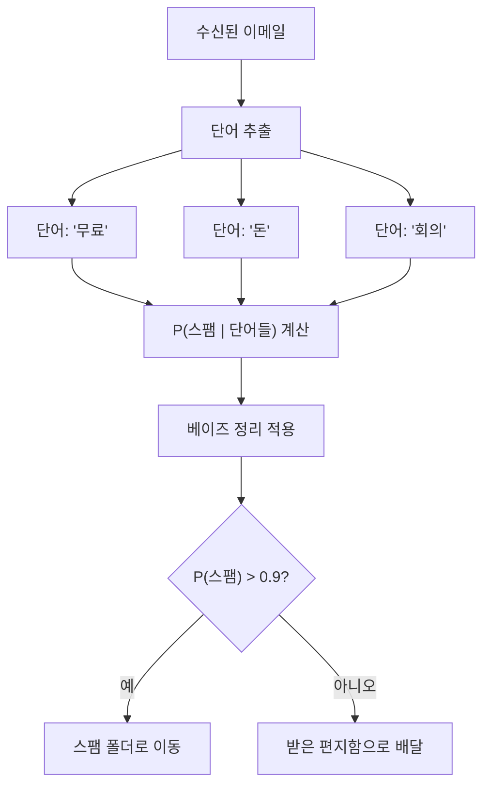
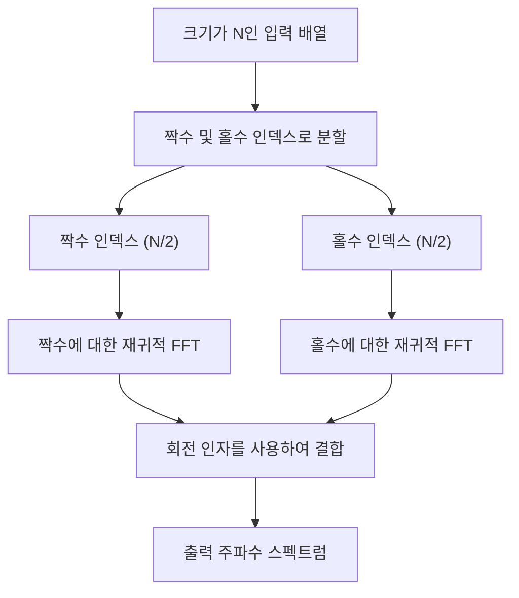
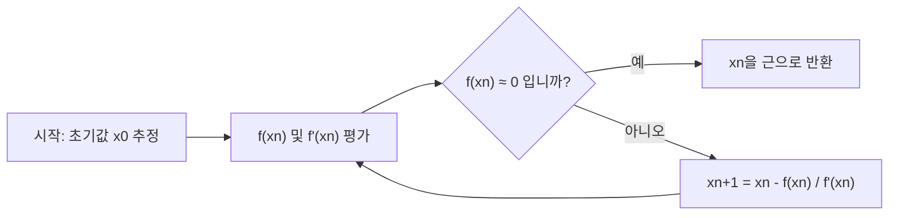
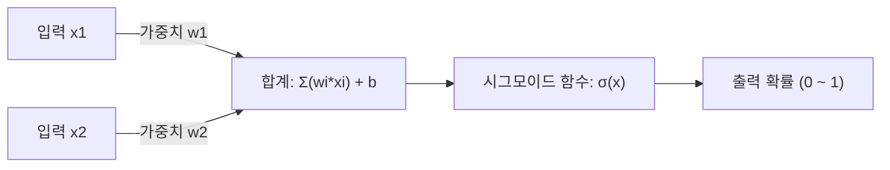

# 수학을 좋아하는 사람이라면 필독! 프로그래밍에 유용한 아름다운 수식 10선

프로그래밍과 수학은 언뜻 보면 전혀 다른 분야처럼 보일 수 있습니다. 프로그래밍은 논리적이고 구체적인 코드를 작성하는 작업이며, 수학은 추상적이고 보편적인 진리를 추구하는 학문입니다. 하지만 컴퓨터 과학의 근저에는 항상 수학이 존재합니다. 알고리즘의 최적화, 데이터 과학, 기계 학습, 컴퓨터 그래픽스, 나아가 일상적인 애플리케이션의 이면에서도 아름다운 수식이 조용하고 강력하게 작용하고 있습니다.

이 글에서는 수학적으로 아름다울 뿐만 아니라 프로그래밍이나 알고리즘의 맥락에서 매우 실용적이고 중요한 역할을 하는 10가지 수식을 엄선했습니다. 각각의 수식이 가진 수학적 배경을 깊이 파고들어, 그것이 프로그래밍 현장에서 어떻게 응용되고 있는지 구체적인 Python이나 C++ 코드 스니펫과 함께 매우 상세하게 해설해 드리겠습니다.

수학의 아름다움과 프로그래밍의 실용성이 교차하는 세계로 오신 것을 환영합니다.

---

## 1. 오일러의 등식 (Euler's Identity)

### 수식의 아름다움과 개요
'인류의 보배', '세상에서 가장 아름다운 수식'으로 불리는 오일러의 등식입니다. 수학에서 가장 중요한 5가지 상수(자연로그의 밑 $e$, 허수 단위 $i$, 원주율 $\pi$, 곱셈의 항등원 $1$, 덧셈의 항등원 $0$)가 단 하나의 단순한 식에 통합되어 있습니다.

$$ e^{i\pi} + 1 = 0 $$

이 등식은 보다 일반적인 오일러의 공식 $e^{i\theta} = \cos\theta + i\sin\theta$ 에서 $\theta = \pi$ 를 대입하여 도출됩니다.

### 프로그래밍에서의 응용
프로그래밍, 특히 컴퓨터 그래픽스나 게임 개발에서 오일러의 공식은 '회전'을 다루기 위한 매우 강력한 도구가 됩니다. 2차원 공간에서 점의 회전은 행렬 계산으로도 수행할 수 있지만, 복소수를 사용하면 계산이 극히 단순하고 직관적이 됩니다. 복소평면에서의 회전은 단순히 $e^{i\theta}$ 를 곱하는 것만으로 구현할 수 있으므로 코드도 간결해집니다.

### 구현 예제 (C++)
다음은 C++의 표준 라이브러리 `<complex>`를 사용하여, 2차원 좌표상의 점을 지정한 각도(라디안)만큼 회전시키는 프로그램입니다.

```cpp
#include <iostream>
#include <complex>
#include <cmath>

// 2차원 좌표를 복소수로 다루기 위한 타입 에일리어스
using Point2D = std::complex<double>;

// 점을 원점을 중심으로 theta (라디안) 회전시키는 함수
Point2D rotatePoint(const Point2D& point, double theta) {
    // 오일러의 공식에 기반하여, 회전용 복소수 e^{i*theta} 를 생성
    // 내부적으로는 cos(theta) + i*sin(theta) 가 됨
    Point2D rotation(std::cos(theta), std::sin(theta));
    
    // 복소수 곱셈을 통해 회전을 적용
    return point * rotation;
}

int main() {
    // 초기 좌표 (x=1.0, y=0.0)
    Point2D p(1.0, 0.0);
    
    // 90도(π/2 라디안) 회전
    double theta = M_PI / 2.0;
    Point2D rotated_p = rotatePoint(p, theta);
    
    std::cout << "Original Point: (" << p.real() << ", " << p.imag() << ")\n";
    // 기대되는 출력은 약 (0, 1)
    std::cout << "Rotated Point: (" << rotated_p.real() << ", " << rotated_p.imag() << ")\n";
    
    return 0;
}
```

**상세 해설**:
이 접근 방식의 장점은 회전 행렬 계산(4번의 곱셈과 2번의 덧셈)을 복소수 연산으로 캡슐화할 수 있다는 점에 있습니다. 또한 3차원 공간에서는 이것의 확장 개념인 '사원수(쿼터니언)'가 사용됩니다. 쿼터니언을 사용함으로써 오일러 각에서 발생하는 '짐벌 락(Gimbal Lock)'이라는 치명적인 문제를 회피하고, 부드러운 구면 선형 보간(Slerp)을 구현할 수 있습니다.

---

## 2. 테일러 전개 (Taylor Series)

### 수식의 아름다움과 개요
테일러 전개는 복잡한 함수(삼각함수나 지수함수 등)를 무한히 이어지는 다항식의 합으로 표현하는 수학적 기법입니다. 어떤 점 $a$ 주위에서의 함수 $f(x)$ 의 테일러 전개는 다음과 같이 정의됩니다.

$$ f(x) = \sum_{n=0}^\infty \frac{f^{(n)}(a)}{n!}(x-a)^n $$

특히 $a=0$ 인 경우를 '매클로린 전개'라고 부릅니다.

### 프로그래밍에서의 응용
컴퓨터(CPU나 FPU)는 본질적으로 덧셈, 뺄셈, 곱셈, 나눗셈 등의 사칙연산밖에 실행할 수 없습니다. 그렇다면 `sin(x)` 나 `exp(x)` 는 어떻게 계산되고 있는 것일까요? 현대 프로세서에서는 CORDIC 알고리즘이나 체비쇼프 근사 등이 자주 사용되지만, 소프트웨어 수준에서 수학 함수를 구현할 때나, 성능을 위해 정밀도를 낮춘 고속 근사 함수를 직접 만들 때는 테일러 전개(또는 그 변형)가 직접적으로 도움이 됩니다.

### 구현 예제 (Python)
다음은 사인 함수(Sine)를 매클로린 전개를 사용하여 근사 계산하는 Python 코드입니다.

$$ \sin(x) \approx x - \frac{x^3}{3!} + \frac{x^5}{5!} - \frac{x^7}{7!} + \dots $$

```python
import math

def taylor_sin(x, terms=10):
    """
    테일러 전개(매클로린 전개)를 사용하여 sin(x)를 근사 계산한다.
    
    :param x: 각도 (라디안)
    :param terms: 계산할 항의 수 (많을수록 고정밀도)
    :return: 근사된 sin(x)의 값
    """
    # 주기성을 이용하여 x를 -π에서 π 범위로 정규화 (정밀도 향상을 위함)
    x = (x + math.pi) % (2 * math.pi) - math.pi
    
    result = 0.0
    for n in range(terms):
        # 홀수 번째 항만 사용: 2n + 1
        power = 2 * n + 1
        
        # 부호는 항마다 반전: (-1)^n
        sign = (-1) ** n
        
        # 팩토리얼 계산
        fact = math.factorial(power)
        
        # 식의 평가와 덧셈
        term = sign * (x ** power) / fact
        result += term
        
    return result

# 테스트
angle = math.radians(45) # 45도 = π/4
print(f"Math library sin: {math.sin(angle)}")
print(f"Taylor series sin: {taylor_sin(angle, terms=5)}")
```

**상세 해설**:
위의 코드에서는 입력값 `x` 를 $[-\pi, \pi]$ 범위로 정규화하고 있습니다. 이는 테일러 전개가 전개의 중심(여기서는 0)에서 멀어질수록 오차가 급격히 커지는 성질(절단 오차)을 가지기 때문입니다. 프로그래밍에서 무한한 계산은 불가능하므로 유한한 `terms` 로 계산을 중단하지만, 이로 인해 발생하는 '반올림 오차'와 '절단 오차'의 트레이드오프를 관리하는 것이 수치 계산 프로그래밍의 핵심입니다.

---

## 3. 베이즈 정리 (Bayes' Theorem)

### 수식의 아름다움과 개요
베이즈 정리는 어떤 사건과 관련된 사전 지식(사전 확률)을 바탕으로, 그 사건의 확률(사후 확률)을 갱신해 나가기 위한 정리입니다. 확률론과 통계학에서 가장 중요한 공식 중 하나입니다.

$$ P(A|B) = \frac{P(B|A)P(A)}{P(B)} $$

여기서 $P(A|B)$ 는 사건 B가 일어났다는 조건 하에서 사건 A가 일어날 확률(사후 확률)을 나타냅니다.

### 프로그래밍에서의 응용
기계 학습이나 데이터 과학 분야에서 '나이브 베이즈 분류기(Naive Bayes Classifier)'로 널리 활용되고 있습니다. 대표적인 응용 사례는 스팸 메일 필터링입니다. '이 메일에 "무료"라는 단어가 포함되어 있을 경우, 그것이 스팸일 확률은 얼마인가?'라는 계산을 과거 데이터를 바탕으로 동적으로 계산합니다.



### 구현 예제 (Python)
스팸 필터의 기본적인 로직을 보여주는 코드입니다.

```python
def calculate_spam_probability(
    prob_spam, 
    prob_word_given_spam, 
    prob_word_given_ham
):
    """
    어떤 단어가 포함된 메일이 스팸일 확률을 베이즈 정리로 계산한다.
    
    :param prob_spam: P(Spam) - 메일이 스팸일 사전 확률
    :param prob_word_given_spam: P(Word|Spam) - 스팸 메일에 그 단어가 포함될 확률
    :param prob_word_given_ham: P(Word|Ham) - 정상 메일에 그 단어가 포함될 확률
    :return: P(Spam|Word) - 그 단어가 포함되어 있을 경우 스팸일 확률
    """
    # 정상 메일의 사전 확률 P(Ham) = 1 - P(Spam)
    prob_ham = 1.0 - prob_spam
    
    # 전체 메일에서 그 단어의 출현 확률 P(Word) = P(Word|Spam)P(Spam) + P(Word|Ham)P(Ham)
    # 이는 전체 확률의 법칙에 따름
    prob_word = (prob_word_given_spam * prob_spam) + (prob_word_given_ham * prob_ham)
    
    # 베이즈 정리 P(Spam|Word) = P(Word|Spam) * P(Spam) / P(Word)
    if prob_word == 0:
        return 0.0 # 0으로 나누기 방지
        
    prob_spam_given_word = (prob_word_given_spam * prob_spam) / prob_word
    return prob_spam_given_word

# 예: '당첨'이라는 단어의 확률
# 과거 데이터: 전체 메일의 20%가 스팸
p_spam = 0.2
# 스팸의 80%에 '당첨'이 포함됨
p_win_given_spam = 0.8
# 정상 메일의 1%에 '당첨'이 포함됨
p_win_given_ham = 0.01

result = calculate_spam_probability(p_spam, p_win_given_spam, p_win_given_ham)
print(f"'당첨'이 포함된 메일이 스팸일 확률: {result:.2%}")
```

**상세 해설**:
실제 구현(나이브 베이즈 분류기)에서는 여러 단어의 확률을 곱해서 계산합니다. 하지만 확률(0~1 사이의 값)을 수천 번 곱하게 되면 컴퓨터의 부동소수점 표현의 한계(언더플로우)로 인해 값이 0이 되어버립니다. 그래서 실제 프로그래밍에서는 확률의 곱을 '로그의 합'으로 변환하는 기법(`log(a * b) = log(a) + log(b)`)이 필수 테크닉으로 사용됩니다.

---

## 4. 섀넌 엔트로피 (Shannon Entropy)

### 수식의 아름다움과 개요
정보 이론의 아버지인 클로드 섀넌이 정의한 '엔트로피'는 정보원이 가지는 '불확실성'이나 '무질서도', 혹은 '평균 정보량'을 정량화하는 수식입니다.

$$ H(X) = - \sum_{i=1}^n P(x_i) \log_2 P(x_i) $$

### 프로그래밍에서의 응용
엔트로피는 파일의 데이터 압축(허프만 부호화나 ZIP 압축 알고리즘의 이론적 한계), 암호 이론에서의 난수 강도 평가, 그리고 기계 학습에서의 '의사결정 트리(Decision Trees)' 알고리즘(ID3나 C4.5 등)에서 필수적인 존재입니다. 의사결정 트리의 구축에서는 데이터를 분할했을 때 엔트로피의 감소량(정보 이득: Information Gain)이 최대가 되는 특징량을 찾아냅니다.

### 구현 예제 (Python)
문자열(데이터 세트)의 엔트로피를 계산하여 정보량을 평가하는 함수입니다.

```python
import math
from collections import Counter

def calculate_entropy(data):
    """
    주어진 데이터 세트(문자열이나 리스트)의 섀넌 엔트로피를 계산한다.
    """
    if not data:
        return 0.0
        
    # 각 요소의 출현 횟수를 카운트
    counts = Counter(data)
    total_len = len(data)
    
    entropy = 0.0
    for element, count in counts.items():
        # 출현 확률 P(x_i)
        probability = count / total_len
        
        # - P(x_i) * log2(P(x_i))
        entropy -= probability * math.log2(probability)
        
    return entropy

# 테스트
# 모두 같은 문자인 경우, 불확실성은 0
data_deterministic = "AAAAAAAAAA" 
# 무작위 문자인 경우, 불확실성이 높음
data_random = "ABACBCBACB"

print(f"Entropy of '{data_deterministic}': {calculate_entropy(data_deterministic)}")
print(f"Entropy of '{data_random}': {calculate_entropy(data_random)}")
```

**상세 해설**:
엔트로피의 단위는 '비트(bits)'입니다. 엔트로피가 `1.5`라면, 그 데이터를 표현하기 위해 평균적으로 요소 1개당 최소 1.5비트가 필요함을 의미합니다. 프로그래밍 현장에서는 압축 알고리즘의 효율성을 측정하는 벤치마크나 기계 학습 모델의 특징 선택에 있어 중요한 지표로 일상적으로 계산되고 있습니다.

---

## 5. 고속 푸리에 변환 (Fast Fourier Transform - FFT)

### 수식의 아름다움과 개요
시간 영역의 신호를 주파수 영역의 신호로 변환하는 이산 푸리에 변환(DFT). 그 수식은 다음과 같습니다.

$$ X_k = \sum_{n=0}^{N-1} x_n e^{-i 2\pi k n / N} $$

이 DFT를 우직하게 계산하면 계산량(시간 복잡도)은 $O(N^2)$ 가 되어 데이터 양이 증가하면 계산이 폭발적으로 느려집니다. 이것을 분할 정복법을 통해 $O(N \log N)$ 까지 극적으로 고속화하는 알고리즘이 '고속 푸리에 변환(FFT)'입니다. 20세기에서 가장 중요한 알고리즘 톱 10에 꼽힙니다.



### 프로그래밍에서의 응용
FFT는 현대 사회를 지탱하는 필수 불가결한 기술입니다. 음성 인식(Siri나 Alexa), MP3나 JPEG/MPEG의 데이터 압축, LTE나 Wi-Fi 등의 디지털 통신, 나아가 매우 거대한 정수의 곱셈(쇤하게-스트라센 알고리즘)에 이르기까지 모든 곳에서 동작하고 있습니다.

### 구현 예제 (Python)
재귀적인 Cooley-Tukey형 알고리즘의 간단한 구현 예제입니다. (※실무에서는 C나 어셈블리어로 극한까지 최적화된 `FFTW` 라이브러리나 `numpy.fft` 를 사용합니다)

```python
import cmath

def fft(x):
    """
    1차원 고속 푸리에 변환(FFT)을 계산한다 (Cooley-Tukey 방법).
    입력 리스트의 길이 N은 2의 거듭제곱이어야 한다.
    """
    N = len(x)
    
    # 베이스 케이스
    if N <= 1:
        return x
        
    # 짝수 번째와 홀수 번째 요소로 분할 (Divide)
    even = fft(x[0::2])
    odd = fft(x[1::2])
    
    # 결과를 결합 (Conquer)
    T = [cmath.exp(-2j * cmath.pi * k / N) * odd[k] for k in range(N // 2)]
    
    # 대칭성을 이용하여 계산량 감소
    return [even[k] + T[k] for k in range(N // 2)] + \
           [even[k] - T[k] for k in range(N // 2)]

# 테스트: 단순한 신호
signal = [1.0, 1.0, 1.0, 1.0, 0.0, 0.0, 0.0, 0.0]
spectrum = fft(signal)

print("Frequency Spectrum (Magnitude):")
for k, val in enumerate(spectrum):
    # 절댓값(진폭)을 계산
    print(f"Freq {k}: {abs(val):.3f}")
```

**상세 해설**:
이 알고리즘의 핵심은 '회전 인자(Twiddle factor)'라 불리는 복소수의 대칭성과 주기성을 활용하고 있다는 점입니다. 이를 통해 중복해서 계산하는 낭비를 줄여, $N=1024$ 인 경우 $1,048,576$ 번 필요했던 연산을 불과 약 $10,240$ 번으로 줄입니다. 그야말로 수학과 알고리즘의 융합이 낳은 기적이라 할 수 있습니다.

---

## 6. 하버사인 공식 (Haversine Formula)

### 수식의 아름다움과 개요
지구 표면과 같은 구면에서 두 점 사이의 최단 거리(대원 거리)를 계산하기 위한 공식입니다.

$$ a = \sin^2\left(\frac{\Delta\phi}{2}\right) + \cos\phi_1 \cos\phi_2 \sin^2\left(\frac{\Delta\lambda}{2}\right) $$
$$ c = 2\cdot \text{atan2}\left(\sqrt{a}, \sqrt{1-a}\right) $$
$$ d = R \cdot c $$

(여기서 $\phi$ 는 위도, $\lambda$ 는 경도, $R$ 은 지구의 반지름입니다)

### 프로그래밍에서의 응용
GPS 트래킹 앱, Uber나 Pokemon GO와 같은 위치 정보 기반 서비스에서 두 위도·경도 좌표 간의 거리를 계산할 때 필수가 되는 수식입니다. 피타고라스 정리를 이용한 직선 거리 계산에서는 지구의 둥근 모양을 고려할 수 없어 장거리가 되면 큰 오차가 발생합니다.

### 구현 예제 (Python)
두 좌표(위도·경도)를 받아 그 거리(킬로미터)를 반환하는 함수입니다.

```python
import math

def haversine_distance(lat1, lon1, lat2, lon2):
    """
    하버사인 공식을 사용하여 두 점 사이의 대원 거리를 계산한다.
    """
    # 지구의 평균 반지름 (킬로미터)
    R = 6371.0 
    
    # 위도·경도를 도수법에서 라디안으로 변환
    phi1, phi2 = math.radians(lat1), math.radians(lat2)
    delta_phi = math.radians(lat2 - lat1)
    delta_lambda = math.radians(lon2 - lon1)
    
    # 하버사인 계산
    a = math.sin(delta_phi / 2.0)**2 + \
        math.cos(phi1) * math.cos(phi2) * \
        math.sin(delta_lambda / 2.0)**2
        
    c = 2 * math.atan2(math.sqrt(a), math.sqrt(1 - a))
    
    # 거리 산출
    distance = R * c
    return distance

# 도쿄 타워 (35.6586, 139.7454)에서 자유의 여신상 (40.6892, -74.0445)까지의 거리
tokyo = (35.6586, 139.7454)
ny = (40.6892, -74.0445)

dist = haversine_distance(tokyo[0], tokyo[1], ny[0], ny[1])
print(f"도쿄 타워에서 자유의 여신상까지의 거리: 약 {dist:.2f} km")
```

**상세 해설**:
구면 삼각법의 코사인 법칙을 사용하는 방법도 있지만, 두 점 사이의 거리가 매우 가까울 경우(예를 들어 수 미터 단위), 부동소수점 계산 정밀도에서의 '자릿수 소실(Catastrophic cancellation)'이 발생하기 쉽습니다. 하버사인 공식은 `sin^2` 를 사용하기 때문에 미세한 거리에 대해서도 수치적으로 안정적인 계산을 할 수 있다는 프로그래밍 상의 큰 장점이 있습니다. 더 높은 정밀도가 필요한 경우에는 지구를 타원체로 간주하는 빈센티 공식(Vincenty's formulae)이 사용됩니다.

---

## 7. 뉴턴-랩슨법 (Newton-Raphson Method)

### 수식의 아름다움과 개요
방정식 $f(x) = 0$ 의 해(근)를 접선을 이용하여 반복적으로 구하는 매우 강력한 근 찾기 알고리즘입니다.

$$ x_{n+1} = x_n - \frac{f(x_n)}{f'(x_n)} $$

현재 위치 $x_n$ 에서의 함수 값 $f(x_n)$ 과 그 기울기(미분) $f'(x_n)$ 을 사용하여, 다음에 탐색해야 할 더 정확한 위치 $x_{n+1}$ 을 추정합니다.



### 프로그래밍에서의 응용
그래픽스 엔진의 렌더링, 물리 시뮬레이션에서의 충돌 판정, 최적화 문제 등에 사용됩니다. 특기할 만한 것은 전설적인 FPS 게임 'Quake III Arena'의 소스 코드에 박혀 있던 'Fast Inverse Square Root (고속 역제곱근 계산)'입니다. 이것은 뉴턴법을 한 번만 적용하여 $1/\sqrt{x}$ 를 엄청난 속도로 계산하는 핵(hack)이었으며, 벡터 정규화를 위해 필수적이었습니다.

### 구현 예제 (C++)
여기서는 알기 쉽게 표준적인 제곱근 $\sqrt{N}$ (즉 $x^2 - N = 0$ 의 해)을 뉴턴법으로 계산하는 예제를 보여줍니다. $f(x) = x^2 - N$, $f'(x) = 2x$ 가 됩니다.

```cpp
#include <iostream>
#include <cmath>

double newton_sqrt(double N, double tolerance = 1e-7) {
    if (N < 0) return NAN; // 음수의 제곱근은 NaN
    if (N == 0) return 0;
    
    // 초기 추정값 (N 자신부터 시작)
    double x = N; 
    
    while (true) {
        // 다음 추정값을 계산: x_new = x - (x^2 - N) / (2x) = (x + N/x) / 2
        double x_new = 0.5 * (x + N / x);
        
        // 변화량이 허용 오차 (tolerance) 미만이면 수렴한 것으로 간주
        if (std::abs(x - x_new) < tolerance) {
            break;
        }
        x = x_new;
    }
    
    return x;
}

int main() {
    double number = 612.0;
    std::cout << "Square root of " << number << " is: " << newton_sqrt(number) << "\n";
    return 0;
}
```

**상세 해설**:
뉴턴법의 가장 큰 매력은 조건이 갖춰지면 '2차 수렴(Quadratic convergence)'한다는 것입니다. 이는 반복할 때마다 정답의 자릿수가 약 2배가 된다는 경이적인 수렴 속도를 의미합니다. 이진 탐색(Binary search)이 선형 수렴이라는 것을 생각하면 미분(미세한 기울기) 정보를 이용하는 것의 강력함을 알 수 있습니다. 'Quake III'의 핵에서는 이 뉴턴법의 첫 초기값을 비트 연산의 매직 넘버 `0x5f3759df` 를 사용하여 IEEE 754 부동소수점의 구조를 해킹함으로써 경이적인 정밀도로 도출해 냈습니다.

---

## 8. 베지에 곡선 (Bézier Curves)

### 수식의 아름다움과 개요
여러 개의 제어점(Control Points)을 사용하여 부드러운 곡선을 정의하는 매개변수 방정식입니다. 가장 자주 사용되는 3차 베지에 곡선(Cubic Bézier Curve)은 4개의 점 $P_0, P_1, P_2, P_3$ 을 가지며, 매개변수 $t \ (0 \le t \le 1)$ 에 의해 곡선 상의 좌표 $B(t)$ 를 결정합니다.

$$ B(t) = (1-t)^3 P_0 + 3(1-t)^2 t P_1 + 3(1-t) t^2 P_2 + t^3 P_3 $$

### 프로그래밍에서의 응용
베지에 곡선은 컴퓨터 그래픽스의 근간입니다. Adobe Illustrator 등의 벡터 드로잉 툴, 폰트(TrueType이나 OpenType) 렌더링, CSS의 `cubic-bezier()` 트랜지션이나 애니메이션의 이징 함수, 게임 내 카메라 경로 제어 등 온갖 '부드러운 움직임이나 형태'를 프로그램으로 그릴 때 사용됩니다.

### 구현 예제 (Python)
4개의 제어점으로부터 3차 베지에 곡선 상의 점들을 생성하는 코드입니다.

```python
def cubic_bezier(p0, p1, p2, p3, steps=10):
    """
    3차 베지에 곡선 상의 좌표 리스트를 생성한다.
    p0, p1, p2, p3 는 (x, y) 튜플이다.
    steps 는 곡선을 몇 개의 선분으로 분할할지 결정한다.
    """
    curve_points = []
    
    for i in range(steps + 1):
        # 매개변수 t 는 0.0 에서 1.0 사이를 변화
        t = i / steps
        
        # 식을 구성하는 계수 계산
        u = 1 - t
        tt = t * t
        uu = u * u
        uuu = uu * u
        ttt = tt * t
        
        # x좌표와 y좌표를 각각의 점에 대해 계산
        x = (uuu * p0[0]) + \
            (3 * uu * t * p1[0]) + \
            (3 * u * tt * p2[0]) + \
            (ttt * p3[0])
            
        y = (uuu * p0[1]) + \
            (3 * uu * t * p1[1]) + \
            (3 * u * tt * p2[1]) + \
            (ttt * p3[1])
            
        curve_points.append((x, y))
        
    return curve_points

# 시작점, 제어점1, 제어점2, 끝점
p0 = (0, 0)
p1 = (5, 10)
p2 = (15, 10)
p3 = (20, 0)

points = cubic_bezier(p0, p1, p2, p3, steps=5)
for i, pt in enumerate(points):
    print(f"t={i/5:.1f} -> Point({pt[0]:.2f}, {pt[1]:.2f})")
```

**상세 해설**:
이 수식은 선형 보간(Lerp: Linear Interpolation)을 재귀적으로 적용한 '드 카스텔조 알고리즘(De Casteljau's algorithm)'을 전개한 것입니다. 다항식 계산(베른슈타인 다항식)을 사용하여 직접 해를 구하고 있습니다. 프로그래밍에서 곡선은 무수한 '미세한 직선'의 집합으로 근사하여 렌더링됩니다. 따라서 $t$ 의 해상도(steps)를 조절함으로써 성능과 렌더링 품질 간의 균형을 제어합니다.

---

## 9. 시그모이드 함수 (Sigmoid Function)

### 수식의 아름다움과 개요
어떤 실수의 입력 $x \ ( -\infty < x < \infty )$ 도 반드시 $0$ 에서 $1$ 사이의 값으로 압축(스퀴즈)하는 부드러운 S자 형태의 함수입니다.

$$ \sigma(x) = \frac{1}{1 + e^{-x}} $$

### 프로그래밍에서의 응용
로지스틱 회귀나 신경망(딥 러닝)에서의 '활성화 함수(Activation Function)'로서 역사적으로 매우 중요한 역할을 담당했습니다. 출력이 0에서 1 범위에 수렴하기 때문에, 그 결과를 '확률'로서 해석할 수 있다는 점이 가장 큰 장점입니다.



### 구현 예제 (Python)
입력된 배열(텐서)에 대해 시그모이드 함수를 적용하는 코드입니다.

```python
import math

def sigmoid(x):
    """단일 값에 대한 시그모이드 계산"""
    # math.exp(-x) 가 오버플로되는 것을 방지하기 위해 입력값을 제한하는 경우가 많음
    # 간략화를 위한 표준적인 구현
    if x >= 0:
        return 1.0 / (1.0 + math.exp(-x))
    else:
        # x가 음수의 큰 값일 때의 오버플로 대책
        return math.exp(x) / (1.0 + math.exp(x))

def apply_sigmoid(array):
    """배열 내의 모든 요소에 시그모이드 함수를 적용한다"""
    return [sigmoid(x) for x in array]

# 신경망 출력층의 원시 데이터 (로짓)
logits = [-5.0, -1.0, 0.0, 1.0, 5.0]
probabilities = apply_sigmoid(logits)

for val, prob in zip(logits, probabilities):
    print(f"Input: {val:4.1f} -> Probability: {prob:.4f}")
```

**상세 해설**:
위 코드에서 `x >= 0` 과 그 외의 경우로 분기시키는 것은 프로그래밍 특유의 문제인 '오버플로'를 방지하기 위함입니다. $x = -1000$ 등인 경우 $e^{1000}$ 을 계산하려다 프로그램이 크래시(혹은 Inf를 반환)하는 것을 방지하기 위한 수치 계산상의 테크닉입니다. 현재 딥 러닝의 은닉층에서는 계산 속도와 기울기 소실 문제의 관점에서 ReLU($f(x) = \max(0, x)$)가 주류이지만, 이진 분류의 출력층에서는 여전히 시그모이드 함수가 부동의 지위를 확립하고 있습니다.

---

## 10. 유클리드 거리와 피타고라스 정리 (Euclidean Distance & Pythagorean Theorem)

### 수식의 아름다움과 개요
고대 그리스에서 전해져 내려오는 기하학의 기초이며, $n$차원 공간에서 두 점 사이의 직선 거리를 정의하는 수식입니다. 2차원 공간에서는 피타고라스 정리($a^2 + b^2 = c^2$) 그 자체입니다.

3차원 공간에서 점 $P(x_1, y_1, z_1)$ 과 $Q(x_2, y_2, z_2)$ 의 유클리드 거리 $d$ 는 다음과 같이 표현됩니다.

$$ d = \sqrt{(x_2-x_1)^2 + (y_2-y_1)^2 + (z_2-z_1)^2} $$

### 프로그래밍에서의 응용
모든 게임 개발, 물리 엔진, 그리고 기계 학습에서의 'K-최근접 이웃 알고리즘(K-Nearest Neighbors)'이나 클러스터링(K-Means) 알고리즘의 핵심이 되는 계산입니다. 게임에서는 캐릭터 간의 충돌 판정(Bounding Circle / Sphere Collision) 등에 매 프레임마다 수백만 번씩 계산됩니다.

### 구현 예제 (C++)
두 원(구)이 충돌했는지 여부를 판정하는 최적화된 코드입니다.

```cpp
#include <iostream>
#include <cmath>

struct Circle {
    double x, y; // 중심 좌표
    double radius; // 반지름
};

// 두 원이 충돌했는지 판정하는 함수
bool isColliding(const Circle& a, const Circle& b) {
    // x좌표와 y좌표의 차이 (델타)
    double dx = b.x - a.x;
    double dy = b.y - a.y;
    
    // 거리의 '제곱'을 계산한다
    double distanceSquared = (dx * dx) + (dy * dy);
    
    // 반지름 합의 '제곱'을 계산한다
    double radiiSum = a.radius + b.radius;
    double radiiSumSquared = radiiSum * radiiSum;
    
    // 거리의 제곱과 반지름 합의 제곱을 비교한다
    return distanceSquared <= radiiSumSquared;
}

int main() {
    Circle player = {0.0, 0.0, 5.0};
    Circle enemy1 = {8.0, 0.0, 4.0}; // 거리 8, 반지름 합 9 -> 충돌
    Circle enemy2 = {10.0, 10.0, 2.0}; // 거리 약 14.1, 반지름 합 7 -> 충돌 안 함
    
    std::cout << "Collision with enemy1: " << (isColliding(player, enemy1) ? "Yes" : "No") << "\n";
    std::cout << "Collision with enemy2: " << (isColliding(player, enemy2) ? "Yes" : "No") << "\n";
    
    return 0;
}
```

**상세 해설**:
수학 공식대로 계산할 경우, 마지막에 제곱근 $\sqrt{\cdot}$ 을 취해야 하지만, 프로그래밍에서 `sqrt()` 함수 호출은 CPU에게 매우 무거운 처리(클럭 사이클을 많이 소비함)입니다. 따라서 거리 비교만 할 것이라면 **양변을 제곱한 상태 그대로 비교하는**(`distanceSquared <= radiiSumSquared`) 것이 게임 프로그래밍에서 상투적인 수단입니다. 이처럼 수학의 등식이나 부등식의 성질을 이용하여 계산 부하를 낮추는 최적화는 알고리즘 설계의 묘미입니다.

---

## 마무리

어떠셨나요? 오일러의 등식부터 피타고라스 정리까지, 이 10가지 수식은 단순히 교과서에 실려 있는 이론상의 개념이 아닙니다. 우리가 평소 작성하는 코드의 이면에서 데이터를 압축하고, 기계 학습 모델에 예측하게 하며, 부드러운 애니메이션을 그리고, 고속 검색을 가능하게 하는 '심장부'로서 고동치고 있습니다.

수학적인 배경을 이해하는 것은 단순히 기존 라이브러리(`math.sin`이나 `numpy.fft`)를 호출하기만 하는 코더에서, 그 내부 구조를 이해하고 한계를 끌어낼 수 있는 엔지니어로 스텝 업하기 위해 필수적입니다. 다음에 코드를 작성할 때는 그 이면에서 어떤 아름다운 수식이 움직이고 있는지 조금만 상상의 나래를 펼쳐 보시기 바랍니다.

**Happy Coding and Math!**
