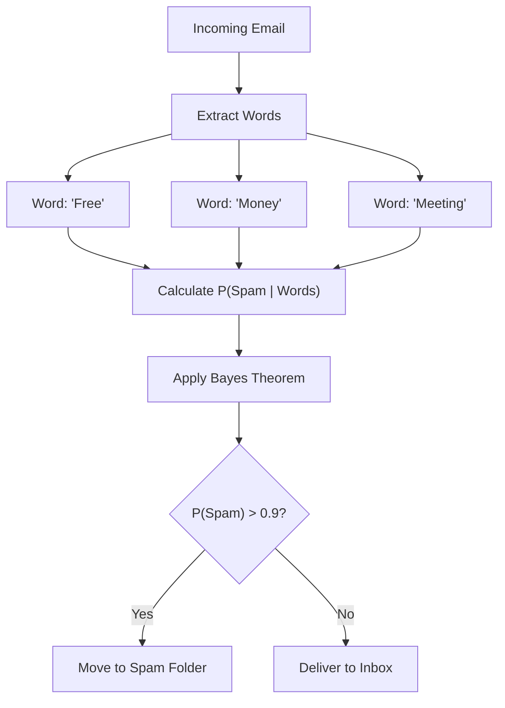
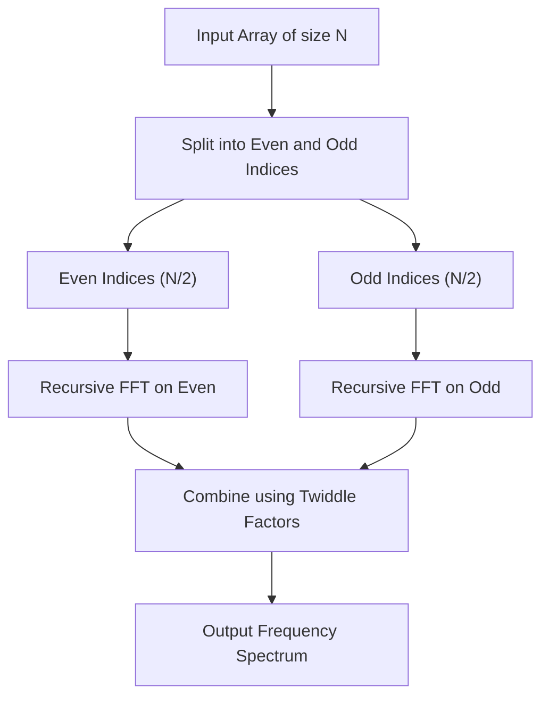
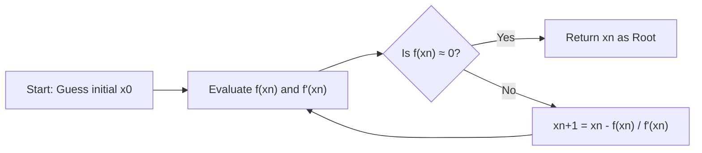
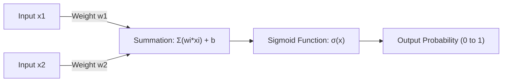

# 数学好き必見！プログラミングに役立つ美しい数式10選

プログラミングと数学は、一見すると全く異なる分野のように思えるかもしれません。プログラミングは論理的で具体的なコードを記述する作業であり、数学は抽象的で普遍的な真理を追求する学問です。しかし、コンピュータサイエンスの根底には常に数学が存在しています。アルゴリズムの最適化、データサイエンス、機械学習、コンピュータグラフィックス、さらには日常的なアプリケーションの裏側でも、美しい数式が静かに、そして強力に働いています。

本記事では、数学的に美しいだけでなく、プログラミングやアルゴリズムの文脈で非常に実用的で重要な役割を果たす10の数式を厳選しました。それぞれの数式が持つ数学的な背景を深く掘り下げ、それがプログラミングの現場でどのように応用されているのかを、具体的なPythonやC++のコードスニペットとともに非常に詳細に解説していきます。

数学の美しさと、プログラミングの実用性が交差する世界へようこそ。

---

## 1. オイラーの等式 (Euler's Identity)

### 数式の美しさと概要
「人類の至宝」「世界で最も美しい数式」と称されるオイラーの等式です。数学における5つの最も重要な定数（ネイピア数 $e$、虚数単位 $i$、円周率 $\pi$、乗法の単位元 $1$、加法の単位元 $0$）が、たった一つのシンプルな式に統合されています。

$$ e^{i\pi} + 1 = 0 $$

この等式は、より一般的なオイラーの公式 $e^{i\theta} = \cos\theta + i\sin\theta$ において $\theta = \pi$ を代入することで導かれます。

### プログラミングにおける応用
プログラミング、特にコンピュータグラフィックスやゲーム開発において、オイラーの公式は「回転」を扱うための非常に強力なツールとなります。2次元空間における点の回転は、行列計算で行うこともできますが、複素数を用いることで計算が極めてシンプルかつ直感的になります。複素平面上での回転は、単に $e^{i\theta}$ を掛けるだけで実現できるため、コードも簡潔になります。

### 実装例 (C++)
以下は、C++の標準ライブラリ `<complex>` を使用して、2次元座標上の点を指定した角度（ラジアン）だけ回転させるプログラムです。

```cpp
#include <iostream>
#include <complex>
#include <cmath>

// 2次元座標を複素数として扱うための型エイリアス
using Point2D = std::complex<double>;

// 点を原点を中心に theta (ラジアン) 回転させる関数
Point2D rotatePoint(const Point2D& point, double theta) {
    // オイラーの公式に基づき、回転用の複素数 e^{i*theta} を作成
    // 内部的には cos(theta) + i*sin(theta) となる
    Point2D rotation(std::cos(theta), std::sin(theta));
    
    // 複素数の掛け算により回転を適用
    return point * rotation;
}

int main() {
    // 初期座標 (x=1.0, y=0.0)
    Point2D p(1.0, 0.0);
    
    // 90度（π/2 ラジアン）回転
    double theta = M_PI / 2.0;
    Point2D rotated_p = rotatePoint(p, theta);
    
    std::cout << "Original Point: (" << p.real() << ", " << p.imag() << ")\n";
    // 期待される出力はおよそ (0, 1)
    std::cout << "Rotated Point: (" << rotated_p.real() << ", " << rotated_p.imag() << ")\n";
    
    return 0;
}
```

**詳細解説**:
このアプローチの利点は、回転行列の計算（4回の乗算と2回の加算）を複素数の演算としてカプセル化できる点にあります。さらに、3次元空間においては、これの拡張概念である「四元数（クォータニオン）」が用いられます。クォータニオンを使用することで、オイラー角で発生する「ジンバルロック（Gimbal Lock）」という致命的な問題を回避し、滑らかな球面線形補間（Slerp）を実現することができます。

---

## 2. テイラー展開 (Taylor Series)

### 数式の美しさと概要
テイラー展開は、複雑な関数（三角関数や指数関数など）を、無限に続く多項式の和として表現する数学的手法です。ある点 $a$ の周りでの関数 $f(x)$ のテイラー展開は次のように定義されます。

$$ f(x) = \sum_{n=0}^\infty \frac{f^{(n)}(a)}{n!}(x-a)^n $$

特に $a=0$ の場合を「マクローリン展開」と呼びます。

### プログラミングにおける応用
コンピュータ（CPUやFPU）は、本質的には足し算、引き算、掛け算、割り算などの四則演算しか実行できません。では、`sin(x)` や `exp(x)` はどのように計算されているのでしょうか？ 現代のプロセッサでは CORDIC アルゴリズムやチェビシェフ近似などが使われることが多いですが、ソフトウェアレベルで数学関数を実装する際や、パフォーマンスのために精度を落とした高速な近似関数を自作する場合には、テイラー展開（またはその変種）が直接的に役立ちます。

### 実装例 (Python)
以下は、正弦関数（Sine）をマクローリン展開を用いて近似計算するPythonコードです。

$$ \sin(x) \approx x - \frac{x^3}{3!} + \frac{x^5}{5!} - \frac{x^7}{7!} + \dots $$

```python
import math

def taylor_sin(x, terms=10):
    """
    テイラー展開（マクローリン展開）を用いてsin(x)を近似計算する。
    
    :param x: 角度（ラジアン）
    :param terms: 計算する項の数（多いほど高精度）
    :return: 近似されたsin(x)の値
    """
    # 周期性を利用して x を -π から π の範囲に正規化（精度向上のため）
    x = (x + math.pi) % (2 * math.pi) - math.pi
    
    result = 0.0
    for n in range(terms):
        # 奇数番目の項のみを使用: 2n + 1
        power = 2 * n + 1
        
        # 符号は項ごとに反転: (-1)^n
        sign = (-1) ** n
        
        # 階乗の計算
        fact = math.factorial(power)
        
        # 式の評価と加算
        term = sign * (x ** power) / fact
        result += term
        
    return result

# テスト
angle = math.radians(45) # 45度 = π/4
print(f"Math library sin: {math.sin(angle)}")
print(f"Taylor series sin: {taylor_sin(angle, terms=5)}")
```

**詳細解説**:
上記のコードでは、入力値 `x` を $[-\pi, \pi]$ の範囲に正規化しています。これはテイラー展開が展開の中心（ここでは0）から離れるほど誤差が急速に大きくなる性質（打ち切り誤差）を持つためです。プログラミングにおいて無限の計算は不可能であるため、有限の `terms` で計算を打ち切りますが、これによって生じる「丸め誤差」と「打ち切り誤差」のトレードオフを管理することが数値計算プログラミングの要諦です。

---

## 3. ベイズの定理 (Bayes' Theorem)

### 数式の美しさと概要
ベイズの定理は、ある事象に関連する事前知識（事前確率）に基づいて、その事象の確率（事後確率）を更新していくための定理です。確率論と統計学において最も重要な公式の一つです。

$$ P(A|B) = \frac{P(B|A)P(A)}{P(B)} $$

ここで、$P(A|B)$ は事象Bが起きたという条件下で事象Aが起きる確率（事後確率）を表します。

### プログラミングにおける応用
機械学習やデータサイエンスの分野で「ナイーブベイズ分類器（Naive Bayes Classifier）」として広く活用されています。代表的な応用例はスパムメールのフィルタリングです。「このメールに『無料』という単語が含まれている場合、それがスパムである確率はいくつか？」という計算を、過去のデータに基づいて動的に計算します。



### 実装例 (Python)
スパムフィルタの基本的なロジックを示すコードです。

```python
def calculate_spam_probability(
    prob_spam, 
    prob_word_given_spam, 
    prob_word_given_ham
):
    """
    ある単語が含まれているメールがスパムである確率をベイズの定理で計算する。
    
    :param prob_spam: P(Spam) - メールがスパムである事前確率
    :param prob_word_given_spam: P(Word|Spam) - スパムメールにその単語が含まれる確率
    :param prob_word_given_ham: P(Word|Ham) - 正常メールにその単語が含まれる確率
    :return: P(Spam|Word) - その単語が含まれる場合にスパムである確率
    """
    # 正常メールの事前確率 P(Ham) = 1 - P(Spam)
    prob_ham = 1.0 - prob_spam
    
    # 全メールにおけるその単語の出現確率 P(Word) = P(Word|Spam)P(Spam) + P(Word|Ham)P(Ham)
    # これは全確率の定理による
    prob_word = (prob_word_given_spam * prob_spam) + (prob_word_given_ham * prob_ham)
    
    # ベイズの定理 P(Spam|Word) = P(Word|Spam) * P(Spam) / P(Word)
    if prob_word == 0:
        return 0.0 # ゼロ除算の回避
        
    prob_spam_given_word = (prob_word_given_spam * prob_spam) / prob_word
    return prob_spam_given_word

# 例: 「当選」という単語の確率
# 過去のデータ: 全メールの20%がスパム
p_spam = 0.2
# スパムの80%に「当選」が含まれる
p_win_given_spam = 0.8
# 正常メールの1%に「当選」が含まれる
p_win_given_ham = 0.01

result = calculate_spam_probability(p_spam, p_win_given_spam, p_win_given_ham)
print(f"「当選」が含まれるメールがスパムである確率: {result:.2%}")
```

**詳細解説**:
実際の実装（ナイーブベイズ分類器）では、複数の単語の確率を掛け合わせて計算します。しかし、確率（0〜1の値）を何千回も掛け合わせると、コンピュータの浮動小数点表現の限界（アンダーフロー）により値がゼロになってしまいます。そのため、実際のプログラミングでは、確率の積を「対数の和」に変換する手法（`log(a * b) = log(a) + log(b)`）が必須テクニックとして用いられます。

---

## 4. シャノンエントロピー (Shannon Entropy)

### 数式の美しさと概要
情報理論の父であるクロード・シャノンが定義した「エントロピー」は、情報源が持つ「不確実性」や「乱雑さ」、あるいは「平均情報量」を定量化する数式です。

$$ H(X) = - \sum_{i=1}^n P(x_i) \log_2 P(x_i) $$

### プログラミングにおける応用
エントロピーは、ファイルのデータ圧縮（ハフマン符号化やZIP圧縮アルゴリズムの理論的限界）、暗号理論における乱数の強度評価、そして機械学習における「決定木（Decision Trees）」のアルゴリズム（ID3やC4.5など）で不可欠な存在です。決定木の構築では、データを分割した際のエントロピーの減少量（情報利得：Information Gain）が最大になるような特徴量を見つけ出します。

### 実装例 (Python)
文字列（データセット）のエントロピーを計算し、情報量を評価する関数です。

```python
import math
from collections import Counter

def calculate_entropy(data):
    """
    与えられたデータセット（文字列やリスト）のシャノンエントロピーを計算する。
    """
    if not data:
        return 0.0
        
    # 各要素の出現回数をカウント
    counts = Counter(data)
    total_len = len(data)
    
    entropy = 0.0
    for element, count in counts.items():
        # 出現確率 P(x_i)
        probability = count / total_len
        
        # - P(x_i) * log2(P(x_i))
        entropy -= probability * math.log2(probability)
        
    return entropy

# テスト
# 全て同じ文字の場合、不確実性は0
data_deterministic = "AAAAAAAAAA" 
# ランダムな文字の場合、不確実性は高い
data_random = "ABACBCBACB"

print(f"Entropy of '{data_deterministic}': {calculate_entropy(data_deterministic)}")
print(f"Entropy of '{data_random}': {calculate_entropy(data_random)}")
```

**詳細解説**:
エントロピーの単位は「ビット（bits）」です。エントロピーが `1.5` であれば、そのデータを表現するために平均して1要素あたり最低1.5ビットが必要であることを意味します。プログラミングの現場では、圧縮アルゴリズムの効率性を測るベンチマークや、機械学習モデルの特徴量選択における重要な指標として、日常的に計算されています。

---

## 5. 高速フーリエ変換 (Fast Fourier Transform - FFT)

### 数式の美しさと概要
時間領域の信号を周波数領域の信号に変換する離散フーリエ変換（DFT）。その数式は以下のようになります。

$$ X_k = \sum_{n=0}^{N-1} x_n e^{-i 2\pi k n / N} $$

このDFTを愚直に計算すると計算量（タイムコンプレキシティ）は $O(N^2)$ となり、データ量が増えると計算が爆発的に遅くなります。これを分割統治法によって $O(N \log N)$ まで劇的に高速化するアルゴリズムが「高速フーリエ変換（FFT）」です。20世紀における最も重要なアルゴリズムのトップ10に数えられます。



### プログラミングにおける応用
FFTは現代社会を支える不可欠な技術です。音声認識（SiriやAlexa）、MP3やJPEG/MPEGのデータ圧縮、LTEやWi-Fiなどのデジタル通信、さらには非常に巨大な整数の掛け算（ショーンハーゲ・ストラッセン法）に至るまで、あらゆる場所で動いています。

### 実装例 (Python)
再帰的なCooley-Tukey型アルゴリズムのシンプルな実装例です。（※実務ではCやアセンブラで極限まで最適化された `FFTW` ライブラリや `numpy.fft` を使用します）

```python
import cmath

def fft(x):
    """
    1次元の高速フーリエ変換 (FFT) を計算する（Cooley-Tukey法）。
    入力リストの長さ N は2のべき乗である必要がある。
    """
    N = len(x)
    
    # ベースケース
    if N <= 1:
        return x
        
    # 偶数番目と奇数番目の要素に分割 (Divide)
    even = fft(x[0::2])
    odd = fft(x[1::2])
    
    # 結果を結合 (Conquer)
    T = [cmath.exp(-2j * cmath.pi * k / N) * odd[k] for k in range(N // 2)]
    
    # 対称性を利用して計算量を削減
    return [even[k] + T[k] for k in range(N // 2)] + \
           [even[k] - T[k] for k in range(N // 2)]

# テスト: 単純な信号
signal = [1.0, 1.0, 1.0, 1.0, 0.0, 0.0, 0.0, 0.0]
spectrum = fft(signal)

print("Frequency Spectrum (Magnitude):")
for k, val in enumerate(spectrum):
    # 絶対値（振幅）を計算
    print(f"Freq {k}: {abs(val):.3f}")
```

**詳細解説**:
このアルゴリズムの肝は、「回転因子（Twiddle factor）」と呼ばれる複素数の対称性と周期性を活用している点です。これにより、計算を重複して行う無駄を省き、$N=1024$ の場合、$1,048,576$ 回必要だった演算をわずか約 $10,240$ 回にまで削減します。まさに数学とアルゴリズムの融合が生み出した奇跡と言えます。

---

## 6. ハーベサインの公式 (Haversine Formula)

### 数式の美しさと概要
地球表面上などの球面において、2点間の最短距離（大円距離）を計算するための公式です。

$$ a = \sin^2\left(\frac{\Delta\phi}{2}\right) + \cos\phi_1 \cos\phi_2 \sin^2\left(\frac{\Delta\lambda}{2}\right) $$
$$ c = 2\cdot \text{atan2}\left(\sqrt{a}, \sqrt{1-a}\right) $$
$$ d = R \cdot c $$

（ここで、$\phi$ は緯度、$\lambda$ は経度、$R$ は地球の半径です）

### プログラミングにおける応用
GPSトラッキングアプリ、UberやPokemon GOのような位置情報ベースのサービスにおいて、2つの緯度・経度の座標間の距離を計算する際に必須となる数式です。ピタゴラスの定理を用いた直線距離計算では、地球の丸みを考慮できないため長距離になると大きな誤差が生じます。

### 実装例 (Python)
2つの座標（緯度・経度）を受け取り、その距離（キロメートル）を返す関数です。

```python
import math

def haversine_distance(lat1, lon1, lat2, lon2):
    """
    ハーベサインの公式を用いて2点間の大円距離を計算する。
    """
    # 地球の平均半径 (キロメートル)
    R = 6371.0 
    
    # 緯度・経度を度数法からラジアンに変換
    phi1, phi2 = math.radians(lat1), math.radians(lat2)
    delta_phi = math.radians(lat2 - lat1)
    delta_lambda = math.radians(lon2 - lon1)
    
    # ハーベサインの計算
    a = math.sin(delta_phi / 2.0)**2 + \
        math.cos(phi1) * math.cos(phi2) * \
        math.sin(delta_lambda / 2.0)**2
        
    c = 2 * math.atan2(math.sqrt(a), math.sqrt(1 - a))
    
    # 距離の算出
    distance = R * c
    return distance

# 東京タワー (35.6586, 139.7454) から 自由の女神像 (40.6892, -74.0445) までの距離
tokyo = (35.6586, 139.7454)
ny = (40.6892, -74.0445)

dist = haversine_distance(tokyo[0], tokyo[1], ny[0], ny[1])
print(f"東京タワーから自由の女神までの距離: 約{dist:.2f} km")
```

**詳細解説**:
球面三角法の余弦定理を使う方法もありますが、2点間の距離が非常に近い場合（例えば数メートル単位）、浮動小数点の計算精度における「桁落ち（Catastrophic cancellation）」が発生しやすくなります。ハーベサインの公式は `sin^2` を用いているため、微小な距離に対しても数値的に安定した計算ができるというプログラミング上の大きなメリットがあります。さらに高精度が必要な場合は、地球を楕円体として扱うヴィンセンティの公式（Vincenty's formulae）が用いられます。

---

## 7. ニュートン・ラフソン法 (Newton-Raphson Method)

### 数式の美しさと概要
方程式 $f(x) = 0$ の解（根）を、接線を用いて反復的に求める非常に強力な求根アルゴリズムです。

$$ x_{n+1} = x_n - \frac{f(x_n)}{f'(x_n)} $$

現在位置 $x_n$ における関数の値 $f(x_n)$ とその傾き（微分）$f'(x_n)$ を使って、次に探索すべきより正確な位置 $x_{n+1}$ を推測します。



### プログラミングにおける応用
グラフィックスエンジンのレンダリング、物理シミュレーションにおける衝突判定、最適化問題などに使われます。特筆すべきは、伝説的なFPSゲーム『Quake III Arena』のソースコードに埋め込まれていた「Fast Inverse Square Root (高速逆平方根計算)」です。これは、ニュートン法を1回だけ適用して $1/\sqrt{x}$ を爆速で計算するハックであり、ベクトル正規化のために不可欠でした。

### 実装例 (C++)
ここでは、分かりやすく標準的な平方根 $\sqrt{N}$ （つまり $x^2 - N = 0$ の解）をニュートン法で計算する例を示します。$f(x) = x^2 - N$, $f'(x) = 2x$ となります。

```cpp
#include <iostream>
#include <cmath>

double newton_sqrt(double N, double tolerance = 1e-7) {
    if (N < 0) return NAN; // 負の数の平方根はNaN
    if (N == 0) return 0;
    
    // 初期推測値（N自身からスタート）
    double x = N; 
    
    while (true) {
        // 次の推測値を計算: x_new = x - (x^2 - N) / (2x) = (x + N/x) / 2
        double x_new = 0.5 * (x + N / x);
        
        // 変化量が許容誤差 (tolerance) を下回ったら収束とみなす
        if (std::abs(x - x_new) < tolerance) {
            break;
        }
        x = x_new;
    }
    
    return x;
}

int main() {
    double number = 612.0;
    std::cout << "Square root of " << number << " is: " << newton_sqrt(number) << "\n";
    return 0;
}
```

**詳細解説**:
ニュートン法の最大の魅力は、条件が整えば「二次収束（Quadratic convergence）」することです。これは、反復のたびに正解の桁数が約2倍になるという驚異的な収束速度を意味します。バイナリサーチ（二分探索）が線形収束であることを考えると、微分（微小な傾き）の情報を利用することの強力さが分かります。『Quake III』のハックでは、このニュートン法の最初の初期値を、ビット演算のマジックナンバー `0x5f3759df` を用いてIEEE 754浮動小数点の構造をハックすることで驚異的な精度で導き出していました。

---

## 8. ベジェ曲線 (Bézier Curves)

### 数式の美しさと概要
複数の制御点（Control Points）を用いて滑らかな曲線を定義するパラメトリック方程式です。最もよく使われる3次ベジェ曲線（Cubic Bézier Curve）は、4つの点 $P_0, P_1, P_2, P_3$ を持ち、媒介変数 $t \ (0 \le t \le 1)$ によって曲線上の座標 $B(t)$ を決定します。

$$ B(t) = (1-t)^3 P_0 + 3(1-t)^2 t P_1 + 3(1-t) t^2 P_2 + t^3 P_3 $$

### プログラミングにおける応用
ベジェ曲線はコンピュータグラフィックスの根幹です。Adobe Illustratorなどのベクタードローイングツール、フォント（TrueTypeやOpenType）のレンダリング、CSSの `cubic-bezier()` トランジションやアニメーションのイージング関数、ゲーム内のカメラパスの制御など、あらゆる「滑らかな動きや形」をプログラムで描画する際に使用されます。

### 実装例 (Python)
4つの制御点から3次ベジェ曲線上の点群を生成するコードです。

```python
def cubic_bezier(p0, p1, p2, p3, steps=10):
    """
    3次ベジェ曲線上の座標リストを生成する。
    p0, p1, p2, p3 は (x, y) のタプル。
    steps は曲線をいくつの線分に分割するか。
    """
    curve_points = []
    
    for i in range(steps + 1):
        # パラメータ t は 0.0 から 1.0 の間を変化
        t = i / steps
        
        # 式を構成する係数の計算
        u = 1 - t
        tt = t * t
        uu = u * u
        uuu = uu * u
        ttt = tt * t
        
        # x座標とy座標をそれぞれの点に対して計算
        x = (uuu * p0[0]) + \
            (3 * uu * t * p1[0]) + \
            (3 * u * tt * p2[0]) + \
            (ttt * p3[0])
            
        y = (uuu * p0[1]) + \
            (3 * uu * t * p1[1]) + \
            (3 * u * tt * p2[1]) + \
            (ttt * p3[1])
            
        curve_points.append((x, y))
        
    return curve_points

# 始点、制御点1、制御点2、終点
p0 = (0, 0)
p1 = (5, 10)
p2 = (15, 10)
p3 = (20, 0)

points = cubic_bezier(p0, p1, p2, p3, steps=5)
for i, pt in enumerate(points):
    print(f"t={i/5:.1f} -> Point({pt[0]:.2f}, {pt[1]:.2f})")
```

**詳細解説**:
この数式は、線形補間（Lerp: Linear Interpolation）を再帰的に適用した「ド・カステリョのアルゴリズム（De Casteljau's algorithm）」を展開したものです。多項式計算（ベルンシュタイン多項式）を用いて直接解を求めています。プログラミングにおいて、曲線は無数の「微小な直線」の集合として近似描画されます。そのため、$t$ の分解能（steps）を調整することで、パフォーマンスと描画品質のバランスを制御します。

---

## 9. シグモイド関数 (Sigmoid Function)

### 数式の美しさと概要
どんな実数の入力 $x \ ( -\infty < x < \infty )$ も、必ず $0$ から $1$ の間の値に圧縮（スクイーズ）する滑らかなS字型の関数です。

$$ \sigma(x) = \frac{1}{1 + e^{-x}} $$

### プログラミングにおける応用
ロジスティック回帰や、ニューラルネットワーク（ディープラーニング）における「活性化関数（Activation Function）」として歴史的に非常に重要な役割を果たしました。出力が0から1の範囲に収まるため、その結果を「確率」として解釈できる点が最大の利点です。



### 実装例 (Python)
入力された配列（テンソル）に対してシグモイド関数を適用するコードです。

```python
import math

def sigmoid(x):
    """単一の値に対するシグモイド計算"""
    # math.exp(-x) がオーバーフローするのを防ぐため入力値を制限することも多い
    # 簡略化のための標準的な実装
    if x >= 0:
        return 1.0 / (1.0 + math.exp(-x))
    else:
        # xが負の大きな値の時のオーバーフロー対策
        return math.exp(x) / (1.0 + math.exp(x))

def apply_sigmoid(array):
    """配列内の全ての要素にシグモイド関数を適用する"""
    return [sigmoid(x) for x in array]

# ニューラルネットワークの出力層の生データ（ロジット）
logits = [-5.0, -1.0, 0.0, 1.0, 5.0]
probabilities = apply_sigmoid(logits)

for val, prob in zip(logits, probabilities):
    print(f"Input: {val:4.1f} -> Probability: {prob:.4f}")
```

**詳細解説**:
上記のコードで `x >= 0` とそれ以外で分岐させているのは、プログラミング特有の問題である「オーバーフロー」を防ぐためです。$x = -1000$ などの場合 $e^{1000}$ を計算しようとしてプログラムがクラッシュ（あるいはInfを返す）するのを防ぐ数値計算上のテクニックです。現在、ディープラーニングの中間層では計算速度と勾配消失問題の観点からReLU（$f(x) = \max(0, x)$）が主流ですが、二値分類の出力層においては今でもシグモイド関数が不動の地位を築いています。

---

## 10. ユークリッド距離とピタゴラスの定理 (Euclidean Distance & Pythagorean Theorem)

### 数式の美しさと概要
古代ギリシャから伝わる幾何学の基礎であり、$n$次元空間における2点間の直線距離を定義する数式です。2次元空間ではピタゴラスの定理（$a^2 + b^2 = c^2$）そのものです。

3次元空間における点 $P(x_1, y_1, z_1)$ と $Q(x_2, y_2, z_2)$ のユークリッド距離 $d$ は次のように表されます。

$$ d = \sqrt{(x_2-x_1)^2 + (y_2-y_1)^2 + (z_2-z_1)^2} $$

### プログラミングにおける応用
あらゆるゲーム開発、物理エンジン、そして機械学習における「K近傍法（K-Nearest Neighbors）」やクラスタリング（K-Means）アルゴリズムのコアとなる計算です。ゲームにおいては、キャラクター間の衝突判定（Bounding Circle / Sphere Collision）などに毎フレーム何百万回と計算されます。

### 実装例 (C++)
2つの円（球）が衝突しているかどうかを判定する最適化されたコードです。

```cpp
#include <iostream>
#include <cmath>

struct Circle {
    double x, y; // 中心座標
    double radius; // 半径
};

// 2つの円が衝突しているかを判定する関数
bool isColliding(const Circle& a, const Circle& b) {
    // x座標とy座標の差（デルタ）
    double dx = b.x - a.x;
    double dy = b.y - a.y;
    
    // 距離の「2乗」を計算する
    double distanceSquared = (dx * dx) + (dy * dy);
    
    // 半径の合計の「2乗」を計算する
    double radiiSum = a.radius + b.radius;
    double radiiSumSquared = radiiSum * radiiSum;
    
    // 距離の2乗と半径の合計の2乗を比較する
    return distanceSquared <= radiiSumSquared;
}

int main() {
    Circle player = {0.0, 0.0, 5.0};
    Circle enemy1 = {8.0, 0.0, 4.0}; // 距離8, 半径合計9 -> 衝突
    Circle enemy2 = {10.0, 10.0, 2.0}; // 距離約14.1, 半径合計7 -> 衝突していない
    
    std::cout << "Collision with enemy1: " << (isColliding(player, enemy1) ? "Yes" : "No") << "\n";
    std::cout << "Collision with enemy2: " << (isColliding(player, enemy2) ? "Yes" : "No") << "\n";
    
    return 0;
}
```

**詳細解説**:
数学の公式通りに計算する場合、最後に平方根 $\sqrt{\cdot}$ を取る必要がありますが、プログラミングにおいて `sqrt()` 関数の呼び出しはCPUにとって非常に重い処理（クロックサイクルを多く消費する）です。そのため、距離を比較するだけであれば、**両辺を2乗した状態のまま比較する**（`distanceSquared <= radiiSumSquared`）のがゲームプログラミングにおける常套手段です。このように、数学の等式や不等式の性質を利用して計算負荷を下げる最適化は、アルゴリズム設計の醍醐味です。

---

## まとめ

いかがでしたでしょうか。オイラーの等式からピタゴラスの定理まで、これら10の数式は単に教科書に載っている理論上の概念ではありません。私たちが普段書いているコードの裏側で、データを圧縮し、機械学習モデルに予測させ、滑らかなアニメーションを描画し、高速な検索を可能にするための「心臓部」として脈打っています。

数学的な背景を理解することは、単に既存のライブラリ（`math.sin` や `numpy.fft`）を呼び出すだけのコーダーから、その内部構造を理解して限界を引き出せるエンジニアへのステップアップに不可欠です。次にコードを書く際には、その背後でどんな美しい数式が動いているのか、少し想像を膨らませてみてください。

**Happy Coding and Math!**
