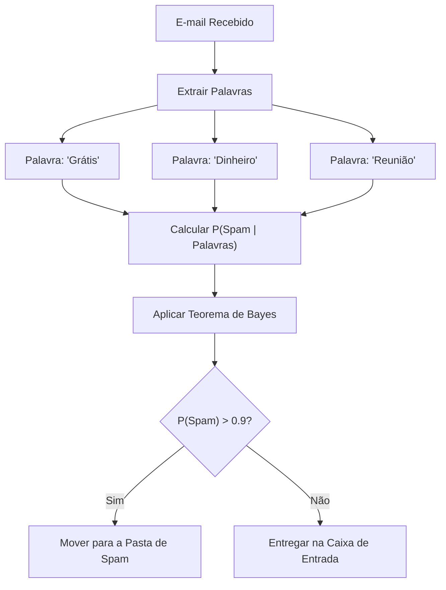
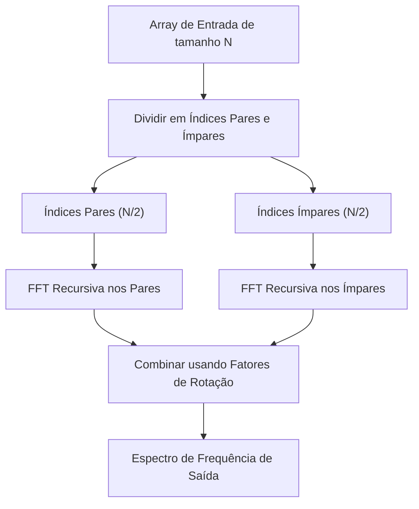
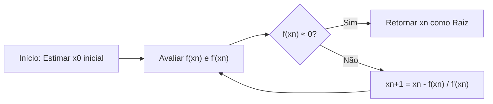
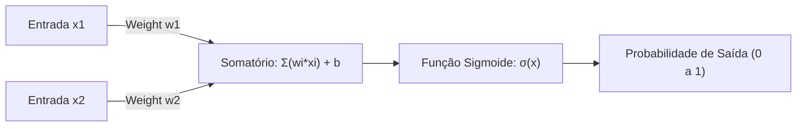

# Imperdível para amantes da matemática! 10 belas fórmulas úteis para programação

A programação e a matemática podem, à primeira vista, parecer campos completamente diferentes. A programação é o trabalho lógico e concreto de escrever códigos, enquanto a matemática é a disciplina acadêmica que busca verdades abstratas e universais. No entanto, a matemática está sempre presente na base da ciência da computação. Na otimização de algoritmos, ciência de dados, aprendizado de máquina, computação gráfica, e até mesmo nos bastidores de aplicativos cotidianos, belas fórmulas matemáticas trabalham de forma silenciosa e poderosa.

Neste artigo, selecionamos 10 fórmulas que não são apenas matematicamente belas, mas que também desempenham papéis muito práticos e importantes no contexto da programação e dos algoritmos. Exploraremos a fundo o contexto matemático de cada fórmula e explicaremos detalhadamente, juntamente com trechos de código concretos em Python e C++, como elas são aplicadas no dia a dia da programação.

Bem-vindo ao mundo onde a beleza da matemática e a praticidade da programação se encontram.

---

## 1. Identidade de Euler (Euler's Identity)

### A beleza e visão geral da fórmula
Esta é a identidade de Euler, aclamada como "o tesouro da humanidade" e "a fórmula mais bela do mundo". As cinco constantes mais importantes da matemática (o número de Euler $e$, a unidade imaginária $i$, a constante pi $\pi$, o elemento neutro da multiplicação $1$ e o elemento neutro da adição $0$) estão integradas em uma única e simples equação.

$$ e^{i\pi} + 1 = 0 $$

Esta igualdade é derivada substituindo $\theta = \pi$ na fórmula mais geral de Euler $e^{i\theta} = \cos\theta + i\sin\theta$.

### Aplicações na programação
Na programação, especialmente na computação gráfica e no desenvolvimento de jogos, a fórmula de Euler é uma ferramenta extremamente poderosa para lidar com "rotações". A rotação de pontos em um espaço 2D pode ser feita com cálculos de matrizes, mas o uso de números complexos torna os cálculos extremamente simples e intuitivos. As rotações no plano complexo podem ser realizadas apenas multiplicando por $e^{i\theta}$, o que torna o código conciso.

### Exemplo de implementação (C++)
Abaixo está um programa que rotaciona um ponto em coordenadas bidimensionais por um ângulo especificado (radianos) usando a biblioteca padrão do C++ `<complex>`.

```cpp
#include <iostream>
#include <complex>
#include <cmath>

// Alias de tipo para tratar coordenadas bidimensionais como números complexos
using Point2D = std::complex<double>;

// Função para rotacionar um ponto em torno da origem por theta (radianos)
Point2D rotatePoint(const Point2D& point, double theta) {
    // Cria um número complexo para rotação e^{i*theta} com base na fórmula de Euler
    // Internamente, isso se torna cos(theta) + i*sin(theta)
    Point2D rotation(std::cos(theta), std::sin(theta));
    
    // Aplica a rotação multiplicando os números complexos
    return point * rotation;
}

int main() {
    // Coordenada inicial (x=1.0, y=0.0)
    Point2D p(1.0, 0.0);
    
    // Rotaciona 90 graus (π/2 radianos)
    double theta = M_PI / 2.0;
    Point2D rotated_p = rotatePoint(p, theta);
    
    std::cout << "Original Point: (" << p.real() << ", " << p.imag() << ")\n";
    // A saída esperada é aproximadamente (0, 1)
    std::cout << "Rotated Point: (" << rotated_p.real() << ", " << rotated_p.imag() << ")\n";
    
    return 0;
}
```

**Explicação detalhada**:
A vantagem dessa abordagem está no fato de que o cálculo da matriz de rotação (4 multiplicações e 2 adições) pode ser encapsulado como uma operação de números complexos. Além disso, no espaço 3D, utiliza-se uma expansão desse conceito, os "quatérnions (quaternions)". Ao usar quatérnions, é possível evitar o problema fatal conhecido como "Gimbal Lock", que ocorre nos ângulos de Euler, e alcançar uma interpolação linear esférica suave (Slerp).

---

## 2. Série de Taylor (Taylor Series)

### A beleza e visão geral da fórmula
A série de Taylor é uma técnica matemática que expressa funções complexas (como funções trigonométricas e exponenciais) como a soma infinita de polinômios. A série de Taylor de uma função $f(x)$ em torno de um ponto $a$ é definida da seguinte forma:

$$ f(x) = \sum_{n=0}^\infty \frac{f^{(n)}(a)}{n!}(x-a)^n $$

Especialmente quando $a=0$, ela é chamada de "Série de Maclaurin".

### Aplicações na programação
Computadores (CPUs e FPUs) só podem, essencialmente, executar operações aritméticas básicas como adição, subtração, multiplicação e divisão. Então, como `sin(x)` e `exp(x)` são calculados? Nos processadores modernos, o algoritmo CORDIC ou a aproximação de Chebyshev são frequentemente usados, mas a série de Taylor (ou suas variantes) é diretamente útil ao implementar funções matemáticas em nível de software, ou ao criar funções de aproximação de alta velocidade onde a precisão é ligeiramente sacrificada em prol do desempenho.

### Exemplo de implementação (Python)
Abaixo está um código Python que calcula a aproximação da função seno usando a série de Maclaurin.

$$ \sin(x) \approx x - \frac{x^3}{3!} + \frac{x^5}{5!} - \frac{x^7}{7!} + \dots $$

```python
import math

def taylor_sin(x, terms=10):
    """
    Calcula o valor aproximado de sin(x) usando a série de Taylor (série de Maclaurin).
    
    :param x: Ângulo (radianos)
    :param terms: O número de termos a calcular (quantos mais, maior a precisão)
    :return: O valor aproximado de sin(x)
    """
    # Usa a periodicidade para normalizar x no intervalo de -π a π (para melhorar a precisão)
    x = (x + math.pi) % (2 * math.pi) - math.pi
    
    result = 0.0
    for n in range(terms):
        # Utiliza apenas termos ímpares: 2n + 1
        power = 2 * n + 1
        
        # O sinal se alterna a cada termo: (-1)^n
        sign = (-1) ** n
        
        # Cálculo do fatorial
        fact = math.factorial(power)
        
        # Avaliação e adição da equação
        term = sign * (x ** power) / fact
        result += term
        
    return result

# Teste
angle = math.radians(45) # 45 graus = π/4
print(f"Math library sin: {math.sin(angle)}")
print(f"Taylor series sin: {taylor_sin(angle, terms=5)}")
```

**Explicação detalhada**:
No código acima, o valor de entrada `x` é normalizado no intervalo $[-\pi, \pi]$. Isso ocorre porque a série de Taylor tem a propriedade de que o erro cresce rapidamente à medida que nos afastamos do centro da expansão (neste caso, 0), o que é chamado de erro de truncamento. Uma vez que cálculos infinitos são impossíveis em programação, o cálculo é interrompido com um número finito de `terms`. Gerenciar o compromisso (trade-off) entre o "erro de arredondamento" e o "erro de truncamento" causados por isso é a chave da programação numérica.

---

## 3. Teorema de Bayes (Bayes' Theorem)

### A beleza e visão geral da fórmula
O teorema de Bayes é um teorema para atualizar a probabilidade de um evento (probabilidade a posteriori) com base no conhecimento prévio (probabilidade a priori) relacionado a esse evento. É uma das fórmulas mais importantes na teoria das probabilidades e na estatística.

$$ P(A|B) = \frac{P(B|A)P(A)}{P(B)} $$

Aqui, $P(A|B)$ representa a probabilidade de que o evento A ocorra dada a condição de que o evento B ocorreu (probabilidade a posteriori).

### Aplicações na programação
É amplamente utilizado nas áreas de machine learning e ciência de dados como o "Classificador Naive Bayes (Naive Bayes Classifier)". Um exemplo representativo de sua aplicação é a filtragem de e-mails de spam. "Qual é a probabilidade deste e-mail ser um spam se contiver a palavra 'grátis'?" Esse tipo de cálculo é feito dinamicamente com base em dados passados.



### Exemplo de implementação (Python)
Código que mostra a lógica básica de um filtro de spam.

```python
def calculate_spam_probability(
    prob_spam, 
    prob_word_given_spam, 
    prob_word_given_ham
):
    """
    Calcula a probabilidade de um e-mail contendo uma certa palavra ser spam usando o teorema de Bayes.
    
    :param prob_spam: P(Spam) - Probabilidade a priori do e-mail ser spam
    :param prob_word_given_spam: P(Word|Spam) - Probabilidade de a palavra estar em um e-mail de spam
    :param prob_word_given_ham: P(Word|Ham) - Probabilidade de a palavra estar em um e-mail normal
    :return: P(Spam|Word) - Probabilidade do e-mail ser spam dado que contém a palavra
    """
    # Probabilidade a priori de e-mail normal P(Ham) = 1 - P(Spam)
    prob_ham = 1.0 - prob_spam
    
    # Probabilidade de a palavra aparecer em todos os e-mails P(Word) = P(Word|Spam)P(Spam) + P(Word|Ham)P(Ham)
    # Isso é derivado da lei da probabilidade total
    prob_word = (prob_word_given_spam * prob_spam) + (prob_word_given_ham * prob_ham)
    
    # Teorema de Bayes P(Spam|Word) = P(Word|Spam) * P(Spam) / P(Word)
    if prob_word == 0:
        return 0.0 # Evita divisão por zero
        
    prob_spam_given_word = (prob_word_given_spam * prob_spam) / prob_word
    return prob_spam_given_word

# Exemplo: A probabilidade da palavra "ganhador"
# Dados passados: 20% de todos os e-mails são spam
p_spam = 0.2
# 80% dos e-mails de spam contêm "ganhador"
p_win_given_spam = 0.8
# 1% dos e-mails normais contêm "ganhador"
p_win_given_ham = 0.01

result = calculate_spam_probability(p_spam, p_win_given_spam, p_win_given_ham)
print(f"Probabilidade de um e-mail com a palavra 'ganhador' ser spam: {result:.2%}")
```

**Explicação detalhada**:
Na implementação real (Classificador Naive Bayes), as probabilidades de várias palavras são multiplicadas em conjunto. No entanto, se você multiplicar milhares de probabilidades (valores de 0 a 1), o valor se tornará zero devido aos limites da representação de ponto flutuante do computador (underflow). Portanto, na programação no mundo real, a técnica de converter os produtos de probabilidade em "somas de logaritmos" (`log(a * b) = log(a) + log(b)`) é usada como uma técnica essencial.

---

## 4. Entropia de Shannon (Shannon Entropy)

### A beleza e visão geral da fórmula
A "entropia", definida por Claude Shannon, o pai da teoria da informação, é uma fórmula que quantifica a "incerteza", "desordem" ou a "quantidade média de informação" contida em uma fonte de informação.

$$ H(X) = - \sum_{i=1}^n P(x_i) \log_2 P(x_i) $$

### Aplicações na programação
A entropia é indispensável para algoritmos de compressão de dados (como os limites teóricos da codificação Huffman ou algoritmos de compressão ZIP), na avaliação da força de números aleatórios na teoria da criptografia e no algoritmo das "Árvores de Decisão" (Decision Trees, como ID3 e C4.5) no machine learning. Na construção de árvores de decisão, procura-se a característica (feature) que maximize a redução de entropia (Ganho de Informação - Information Gain) quando os dados são divididos.

### Exemplo de implementação (Python)
Uma função que calcula a entropia de uma string (conjunto de dados) e avalia a quantidade de informação.

```python
import math
from collections import Counter

def calculate_entropy(data):
    """
    Calcula a entropia de Shannon de um determinado conjunto de dados (string ou lista).
    """
    if not data:
        return 0.0
        
    # Conta a ocorrência de cada elemento
    counts = Counter(data)
    total_len = len(data)
    
    entropy = 0.0
    for element, count in counts.items():
        # Probabilidade de ocorrência P(x_i)
        probability = count / total_len
        
        # - P(x_i) * log2(P(x_i))
        entropy -= probability * math.log2(probability)
        
    return entropy

# Teste
# Quando todas as letras são iguais, a incerteza é zero
data_deterministic = "AAAAAAAAAA" 
# No caso de letras aleatórias, a incerteza é alta
data_random = "ABACBCBACB"

print(f"Entropy of '{data_deterministic}': {calculate_entropy(data_deterministic)}")
print(f"Entropy of '{data_random}': {calculate_entropy(data_random)}")
```

**Explicação detalhada**:
A unidade da entropia é o "bit" (bits). Se a entropia for `1.5`, significa que, em média, você precisará de pelo menos 1,5 bits por elemento para representar esses dados. Na área da programação, ela é rotineiramente calculada como um referencial para testar a eficiência de algoritmos de compressão e como um indicador fundamental na seleção de características (feature selection) de modelos de aprendizado de máquina.

---

## 5. Transformada Rápida de Fourier (Fast Fourier Transform - FFT)

### A beleza e visão geral da fórmula
A Transformada Discreta de Fourier (DFT) transforma sinais no domínio do tempo para o domínio da frequência. Sua equação matemática é a seguinte:

$$ X_k = \sum_{n=0}^{N-1} x_n e^{-i 2\pi k n / N} $$

Se calcularmos a DFT de forma ingênua, a complexidade de tempo será $O(N^2)$, tornando o cálculo explosivamente lento à medida que a quantidade de dados aumenta. O algoritmo que acelera isso drasticamente para $O(N \log N)$ através da técnica "dividir para conquistar" (divide and conquer) é a "Transformada Rápida de Fourier (FFT)". É considerado um dos 10 algoritmos mais importantes do século 20.



### Aplicações na programação
A FFT é uma tecnologia essencial que sustenta a sociedade moderna. Desde o reconhecimento de voz (Siri e Alexa), compressão de dados MP3 ou JPEG/MPEG, comunicações digitais como LTE e Wi-Fi, até mesmo a multiplicação de números inteiros gigantescos (algoritmo de Schönhage-Strassen), a FFT está trabalhando ativamente em todo lugar.

### Exemplo de implementação (Python)
Este é um exemplo de implementação simples do algoritmo recursivo de Cooley-Tukey. (※ Na prática, são usadas bibliotecas extremamente otimizadas em C ou Assembly como `FFTW` ou `numpy.fft`)

```python
import cmath

def fft(x):
    """
    Calcula a Transformada Rápida de Fourier (FFT) em 1 dimensão (método Cooley-Tukey).
    O comprimento N do array de entrada deve ser uma potência de 2.
    """
    N = len(x)
    
    # Caso base
    if N <= 1:
        return x
        
    # Divide os elementos em índices pares e ímpares (Divide)
    even = fft(x[0::2])
    odd = fft(x[1::2])
    
    # Combina os resultados (Conquer)
    T = [cmath.exp(-2j * cmath.pi * k / N) * odd[k] for k in range(N // 2)]
    
    # Usa simetria para reduzir a quantidade de cálculos
    return [even[k] + T[k] for k in range(N // 2)] + \
           [even[k] - T[k] for k in range(N // 2)]

# Teste: Um sinal simples
signal = [1.0, 1.0, 1.0, 1.0, 0.0, 0.0, 0.0, 0.0]
spectrum = fft(signal)

print("Frequency Spectrum (Magnitude):")
for k, val in enumerate(spectrum):
    # Calcula o valor absoluto (amplitude)
    print(f"Freq {k}: {abs(val):.3f}")
```

**Explicação detalhada**:
O núcleo deste algoritmo reside na utilização da simetria e da periodicidade dos números complexos, conhecidos como "Fatores de Rotação (Twiddle factors)". Ao fazer isso, o desperdício de realizar cálculos duplicados é eliminado, reduzindo as operações necessárias para $N=1024$ de $1.048.576$ para apenas cerca de $10.240$. Isso pode realmente ser chamado de um milagre criado pela fusão da matemática com algoritmos.

---

## 6. Fórmula de Haversine (Haversine Formula)

### A beleza e visão geral da fórmula
É a fórmula usada para calcular a distância mais curta (distância do círculo máximo) entre dois pontos na superfície de uma esfera, como a Terra.

$$ a = \sin^2\left(\frac{\Delta\phi}{2}\right) + \cos\phi_1 \cos\phi_2 \sin^2\left(\frac{\Delta\lambda}{2}\right) $$
$$ c = 2\cdot \text{atan2}\left(\sqrt{a}, \sqrt{1-a}\right) $$
$$ d = R \cdot c $$

(Aqui, $\phi$ é a latitude, $\lambda$ é a longitude e $R$ é o raio da Terra)

### Aplicações na programação
É uma fórmula essencial ao calcular a distância entre duas coordenadas de latitude e longitude em aplicativos de rastreamento por GPS ou serviços baseados em localização, como Uber ou Pokémon GO. No cálculo da distância em linha reta usando o teorema de Pitágoras, a curvatura da Terra não é levada em consideração, causando grandes erros em longas distâncias.

### Exemplo de implementação (Python)
Uma função que recebe duas coordenadas (latitude, longitude) e retorna a distância (em quilômetros) entre elas.

```python
import math

def haversine_distance(lat1, lon1, lat2, lon2):
    """
    Calcula a distância do círculo máximo entre dois pontos usando a fórmula de Haversine.
    """
    # Raio médio da Terra (em quilômetros)
    R = 6371.0 
    
    # Converte latitude e longitude de graus para radianos
    phi1, phi2 = math.radians(lat1), math.radians(lat2)
    delta_phi = math.radians(lat2 - lat1)
    delta_lambda = math.radians(lon2 - lon1)
    
    # Cálculo de Haversine
    a = math.sin(delta_phi / 2.0)**2 + \
        math.cos(phi1) * math.cos(phi2) * \
        math.sin(delta_lambda / 2.0)**2
        
    c = 2 * math.atan2(math.sqrt(a), math.sqrt(1 - a))
    
    # Cálculo da distância final
    distance = R * c
    return distance

# Distância da Torre de Tóquio (35.6586, 139.7454) até a Estátua da Liberdade (40.6892, -74.0445)
tokyo = (35.6586, 139.7454)
ny = (40.6892, -74.0445)

dist = haversine_distance(tokyo[0], tokyo[1], ny[0], ny[1])
print(f"Distância da Torre de Tóquio à Estátua da Liberdade: aproximadamente {dist:.2f} km")
```

**Explicação detalhada**:
Também é possível usar a lei dos cossenos da trigonometria esférica, mas quando a distância entre dois pontos é muito curta (por exemplo, alguns metros), há uma tendência a ocorrer "cancelamento catastrófico (catastrophic cancellation)" na precisão do cálculo de ponto flutuante. A fórmula de Haversine utiliza `sin^2`, proporcionando a enorme vantagem computacional de permitir cálculos numericamente estáveis até mesmo para distâncias diminutas. Se uma precisão ainda maior for necessária, as fórmulas de Vincenty (Vincenty's formulae), que tratam a Terra como um elipsoide, são utilizadas.

---

## 7. Método de Newton-Raphson (Newton-Raphson Method)

### A beleza e visão geral da fórmula
É um algoritmo de busca de raízes incrivelmente poderoso para encontrar recursivamente as soluções (raízes) de equações da forma $f(x) = 0$ usando a reta tangente.

$$ x_{n+1} = x_n - \frac{f(x_n)}{f'(x_n)} $$

Utilizando o valor da função na posição atual $f(x_n)$ e a sua inclinação (derivada) $f'(x_n)$, tenta-se deduzir e encontrar a posição mais precisa seguinte $x_{n+1}$ a ser explorada.



### Aplicações na programação
É usado em renderização de engines gráficas, detecção de colisões em simulações de física e problemas de otimização. Em particular, um marco notável foi o hack "Fast Inverse Square Root" embutido no código fonte do lendário jogo de FPS "Quake III Arena". Era um hack genial onde se aplicava o método de Newton apenas uma vez para calcular a velocidade alucinante de $1/\sqrt{x}$, sendo essencial para normalizações vetoriais.

### Exemplo de implementação (C++)
Como exemplo claro, mostramos a forma de calcular a raiz quadrada padrão $\sqrt{N}$ (ou seja, a solução para $x^2 - N = 0$) utilizando o método de Newton. Neste cenário, as funções utilizadas são $f(x) = x^2 - N$ e $f'(x) = 2x$.

```cpp
#include <iostream>
#include <cmath>

double newton_sqrt(double N, double tolerance = 1e-7) {
    if (N < 0) return NAN; // A raiz quadrada de um número negativo é NaN
    if (N == 0) return 0;
    
    // Valor inicial estimado (começando do próprio N)
    double x = N; 
    
    while (true) {
        // Calcula a próxima estimativa: x_new = x - (x^2 - N) / (2x) = (x + N/x) / 2
        double x_new = 0.5 * (x + N / x);
        
        // Quando a quantidade da alteração fica inferior ao erro tolerado, consideramos como convergido
        if (std::abs(x - x_new) < tolerance) {
            break;
        }
        x = x_new;
    }
    
    return x;
}

int main() {
    double number = 612.0;
    std::cout << "Square root of " << number << " is: " << newton_sqrt(number) << "\n";
    return 0;
}
```

**Explicação detalhada**:
O maior atrativo do método de Newton é que, se as condições forem atendidas, ele atinge "convergência quadrática (Quadratic convergence)". Isso significa uma velocidade assombrosa em que o número de dígitos corretos dobra a cada iteração executada. Considerando que a busca binária (binary search) possui apenas convergência linear, é possível entender quão formidável é a utilização da informação sobre a inclinação (a derivada). O hack usado em "Quake III" providenciava esse valor inicial da estimativa para o método de Newton com incrível precisão por meio da exploração da estrutura de ponto flutuante IEEE 754 e de um número mágico (magic number), o `0x5f3759df`.

---

## 8. Curvas de Bézier (Bézier Curves)

### A beleza e visão geral da fórmula
Trata-se de uma equação paramétrica que define uma curva suave usando múltiplos Pontos de Controle (Control Points). A curva de Bézier cúbica (Cubic Bézier Curve) mais comumente utilizada possui 4 pontos: $P_0, P_1, P_2, P_3$, com as coordenadas da curva $B(t)$ determinadas por um parâmetro iterativo $t \ (0 \le t \le 1)$.

$$ B(t) = (1-t)^3 P_0 + 3(1-t)^2 t P_1 + 3(1-t) t^2 P_2 + t^3 P_3 $$

### Aplicações na programação
A curva de Bézier está no cerne da computação gráfica. Ela é utilizada em ferramentas de desenho vetorial como o Adobe Illustrator, na renderização de fontes (TrueType e OpenType), nas funções de easing (abrandamento) de animações e transições no CSS (`cubic-bezier()`), no controle da trajetória de câmeras dentro de jogos e em praticamente qualquer ocasião onde "formas ou movimentos suaves" precisam ser desenhados via código.

### Exemplo de implementação (Python)
Aqui está um código que gera um conjunto de coordenadas ao longo de uma curva de Bézier cúbica a partir de 4 pontos de controle.

```python
def cubic_bezier(p0, p1, p2, p3, steps=10):
    """
    Gera uma lista de coordenadas na curva de Bézier cúbica.
    p0, p1, p2, p3 são tuplas na forma (x, y).
    steps determina em quantos segmentos a curva será dividida.
    """
    curve_points = []
    
    for i in range(steps + 1):
        # O parâmetro t varia entre 0.0 e 1.0
        t = i / steps
        
        # O cálculo dos coeficientes que compõem a equação
        u = 1 - t
        tt = t * t
        uu = u * u
        uuu = uu * u
        ttt = tt * t
        
        # As coordenadas x e y sendo calculadas para seus respectivos pontos
        x = (uuu * p0[0]) + \
            (3 * uu * t * p1[0]) + \
            (3 * u * tt * p2[0]) + \
            (ttt * p3[0])
            
        y = (uuu * p0[1]) + \
            (3 * uu * t * p1[1]) + \
            (3 * u * tt * p2[1]) + \
            (ttt * p3[1])
            
        curve_points.append((x, y))
        
    return curve_points

# Ponto inicial, ponto de controle 1, ponto de controle 2, ponto final
p0 = (0, 0)
p1 = (5, 10)
p2 = (15, 10)
p3 = (20, 0)

points = cubic_bezier(p0, p1, p2, p3, steps=5)
for i, pt in enumerate(points):
    print(f"t={i/5:.1f} -> Point({pt[0]:.2f}, {pt[1]:.2f})")
```

**Explicação detalhada**:
Esta equação matemática é a aplicação direta e expansão matemática do "Algoritmo de De Casteljau", que utiliza a interpolação linear (Lerp: Linear Interpolation) recursivamente, providenciando a resposta diretamente usando equações polinomiais (polinômios de Bernstein). Na programação, as curvas são exibidas visualmente desenhadas na tela através da aproximação agrupada de incontáveis "minúsculas linhas retas". Devido a este fato, ao gerenciar a resolução $t$ (ajustando o valor de 'steps'), controlamos o equilíbrio prático entre a qualidade visual da renderização e a performance computacional.

---

## 9. Função Sigmoide (Sigmoid Function)

### A beleza e visão geral da fórmula
É uma função de curva em "S" incrivelmente suave, que recebe qualquer entrada numérica real $x \ ( -\infty < x < \infty )$ e a comprime (squeeze) perfeitamente para resultar em um valor entre $0$ e $1$.

$$ \sigma(x) = \frac{1}{1 + e^{-x}} $$

### Aplicações na programação
Historicamente, ela desempenhou um papel vital como "Função de Ativação" (Activation Function) na regressão logística e em redes neurais (deep learning). A sua maior vantagem é converter valores para a faixa restrita entre 0 e 1, permitindo que os resultados finais sejam naturalmente interpretados como "probabilidades".



### Exemplo de implementação (Python)
Aqui está um código que demonstra a aplicação da função sigmoide a um array (tensor) de entrada.

```python
import math

def sigmoid(x):
    """Cálculo da sigmoide para um valor único numérico"""
    # É comum restringir as entradas para prevenir o erro gravíssimo (overflow) caso 'math.exp(-x)' seja enorme.
    # Esta é uma implementação padronizada simplificada.
    if x >= 0:
        return 1.0 / (1.0 + math.exp(-x))
    else:
        # Prevenção contra overflow quando x for um valor negativo gigantesco
        return math.exp(x) / (1.0 + math.exp(x))

def apply_sigmoid(array):
    """Aplica a função sigmoide para todos os elementos de um array"""
    return [sigmoid(x) for x in array]

# Os dados brutos não processados provindos da saída da rede neural (logits)
logits = [-5.0, -1.0, 0.0, 1.0, 5.0]
probabilities = apply_sigmoid(logits)

for val, prob in zip(logits, probabilities):
    print(f"Input: {val:4.1f} -> Probability: {prob:.4f}")
```

**Explicação detalhada**:
O motivo de criarmos uma ramificação condicional separando o caso `x >= 0` dos demais no código é para prevenir ativamente restrições programacionais temidas como os erros numéricos de limite ("overflows"). Por exemplo, para um $x = -1000$, o programa precisaria processar $e^{1000}$, ocorrendo o risco da execução travar (crash) ou retornar `Inf`. Atualmente no deep learning, com o objetivo de acelerar cálculos nas camadas ocultas e escapar de desaparecimentos do gradiente, a função ativadora dominante é a ReLU ($f(x) = \max(0, x)$). Entretanto, a função sigmoide continua garantindo sua liderança imortal providenciando as regras finais nas camadas de saída para cenários de classificação binária.

---

## 10. Distância Euclidiana e Teorema de Pitágoras (Euclidean Distance & Pythagorean Theorem)

### A beleza e visão geral da fórmula
Tendo as suas origens baseadas na Grécia antiga, é a fórmula geométrica clássica que define a medição da distância da linha reta exata calculada entre dois pontos em qualquer espaço de dimensão $n$. Quando no espaço 2D, ela trata-se rigorosamente do mundialmente prestigiado "Teorema de Pitágoras" ($a^2 + b^2 = c^2$).

Em um espaço 3D, a "Distância Euclidiana $d$" estabelecida entre o ponto $P(x_1, y_1, z_1)$ e $Q(x_2, y_2, z_2)$ é maravilhosamente descrita matematicamente na seguinte equação:

$$ d = \sqrt{(x_2-x_1)^2 + (y_2-y_1)^2 + (z_2-z_1)^2} $$

### Aplicações na programação
É o coração que alimenta praticamente todo motor básico nas modelagens matemáticas, física de jogos e processos essenciais fundamentais dentro de machine learning, fornecendo base ao algoritmo de agrupamento (K-Means) ou aos modelos classificadores "K-Vizinhos Mais Próximos" (K-Nearest Neighbors / KNN). Na área gráfica focada ao desenvolvimento de jogos, ela lidera as diretrizes computando o detetamento ativo de contato (colisões) entre estruturas, como esferas ou círculos delimitadores de limite ("Bounding Circle / Sphere Collision"), que muitas vezes ocorrem repetitivamente processados de modo insano aos milhões a cada quadro de exibição atualizado (frame).

### Exemplo de implementação (C++)
Abaixo está uma estrutura algorítmica incrivelmente otimizada em C++ destinada a determinar se ocorre alguma colisão exata baseada na intersecção entre as áreas delimitadoras circulares (ou esferas).

```cpp
#include <iostream>
#include <cmath>

struct Circle {
    double x, y; // Coordenadas centrais
    double radius; // Referencial métrico do raio
};

// Uma função validando se está acontecendo uma intersecção de impacto (colisão) entre os dois círculos
bool isColliding(const Circle& a, const Circle& b) {
    // Computando a diferença ("delta") referencial mapeada aos espaços para coordenadas x e equivalentemente em paralelo à linha matriz de y
    double dx = b.x - a.x;
    double dy = b.y - a.y;
    
    // Providenciando o cálculo resultando na distância matemática elevada "Ao Quadrado"
    double distanceSquared = (dx * dx) + (dy * dy);
    
    // Dimensionando e processando as métricas com as somas operantes conjuntas de limites dos seus raios elevados "Ao Quadrado"
    double radiiSum = a.radius + b.radius;
    double radiiSumSquared = radiiSum * radiiSum;
    
    // Procedendo à verificação matemática avaliativa comparando as grandezas: verificando logicamente a distância computada (Ao quadrado) em relação estrita ao total somatório numérico formatado dos raios delimitadores envolvidos (Também processado estritamente Ao quadrado)
    return distanceSquared <= radiiSumSquared;
}

int main() {
    Circle player = {0.0, 0.0, 5.0};
    Circle enemy1 = {8.0, 0.0, 4.0}; // Distância calculada modelada sendo 8. O alcance (raio limite formatado na soma) mede '9' -> Ocorreu Colisão (Sim)
    Circle enemy2 = {10.0, 10.0, 2.0}; // Avaliação no referencial distante computável modelado em aproximadamente 14.1. Soma avaliativa na delimitação (raio base): '7' -> Livre (Nenhum impacto, Sem colisão)
    
    std::cout << "Collision with enemy1: " << (isColliding(player, enemy1) ? "Yes" : "No") << "\n";
    std::cout << "Collision with enemy2: " << (isColliding(player, enemy2) ? "Yes" : "No") << "\n";
    
    return 0;
}
```

**Explicação detalhada**:
Se o processamento fosse construído literalmente ao pé da letra acadêmico equacionando a avaliação da fórmula clássica, resultaria no encargo de extrair imperiosamente a "raiz quadrada ($\sqrt{\cdot}$ / `sqrt()`)" no término dos cálculos numéricos envolvidos. Entretanto, na programação da engenharia, chamadas frequentes solicitando essa rotina "Extratora de raízes `sqrt()`" infligem e geram exigências brutais pesadas na performance dos processamentos de CPUs. Considerando isso, quando o alvo analítico prático do processamento estipulado destina-se puramente à checagem e verificação comparativa (para resolver se é simplesmente menor ou não), existe um padrão brilhante consagrado entre desenvolvedores de motores lógicos computacionais de jogos focando em manter propositalmente e operando comparativamente a formatação inalterada aos valores na matriz "em sua base de forma elevada ao Quadrado", resultando maravilhosamente na regra equacionada de `distanceSquared <= radiiSumSquared`. Empregar e desfrutar do vasto arsenal de maravilhosas manipulações provenientes e fundamentadas magicamente com diretrizes matemáticas exatas operacionais para aniquilar as cargas de desempenho pesadas nas equações providencia a evidência do encanto genial no processo por trás das criações no glorioso ofício construtor ao desenvolvimento nas arquiteturas aos arranjos algorítmicos.

---

## Resumo

O que você achou de todas estas esplêndidas fórmulas? Como pôde visualizar brilhantemente e maravilhosamente, desde a identidade de Euler até o admirável Teorema de Pitágoras, todo esse seleto elenco matemático formidável jamais foi constituído limitadamente para decorar abstratamente manuais teóricos estáticos e inativos nos cantos e prateleiras das velhas bibliotecas acadêmicas. Eles funcionam dinamicamente por trás de toda e qualquer tela nas linguagens codificadas invisíveis para computar compressões, instigar predições dinâmicas ativas interativamente em models de machine learning providenciando inteligência maravilhosa formidável, renderizando sedosas imagens polidas animadas interativamente, transformando-os no grande coração poderoso imortal girando engrenagens pulsando infinitamente nos bastidores de maravilhosos cálculos computacionais rotineiramente processados.

Adentrar nas ricas teorias de base referencial equacionada fundamentadas nelas se mostra extremamente indispensável e formidável a capacitar codificadores simplórios limitados (Aqueles condicionados tristemente e cegamente ao importar pacotes de matriz com a submissão cega de módulos de terceiros sem raciocínio, ex.: `math.sin` ou bibliotecas `numpy.fft`) para ascendê-los ao seleto nível de supremos e geniais engenheiros experientes providenciando o poder total operando magistralmente limites super potentes em hardware. Na próxima oportunidade, divirta-se criando rotinas no código providenciando à tela maravilhosas formas, expanda suas perspectivas, maravilhe-se visualizando qual brilhante matriz equacionada e fórmula puramente sublime bate poderosa por trás desse texto invisivelmente dando poder à estrutura.

**Happy Coding and Math!**
