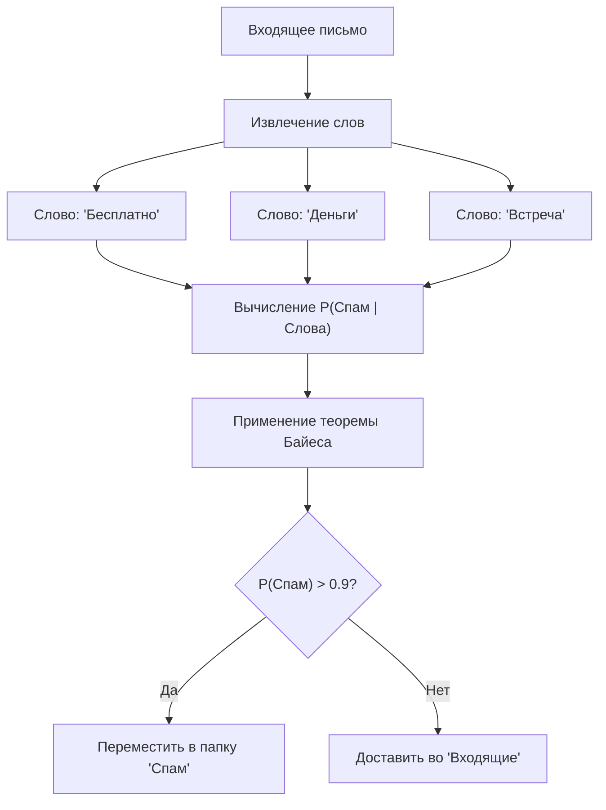
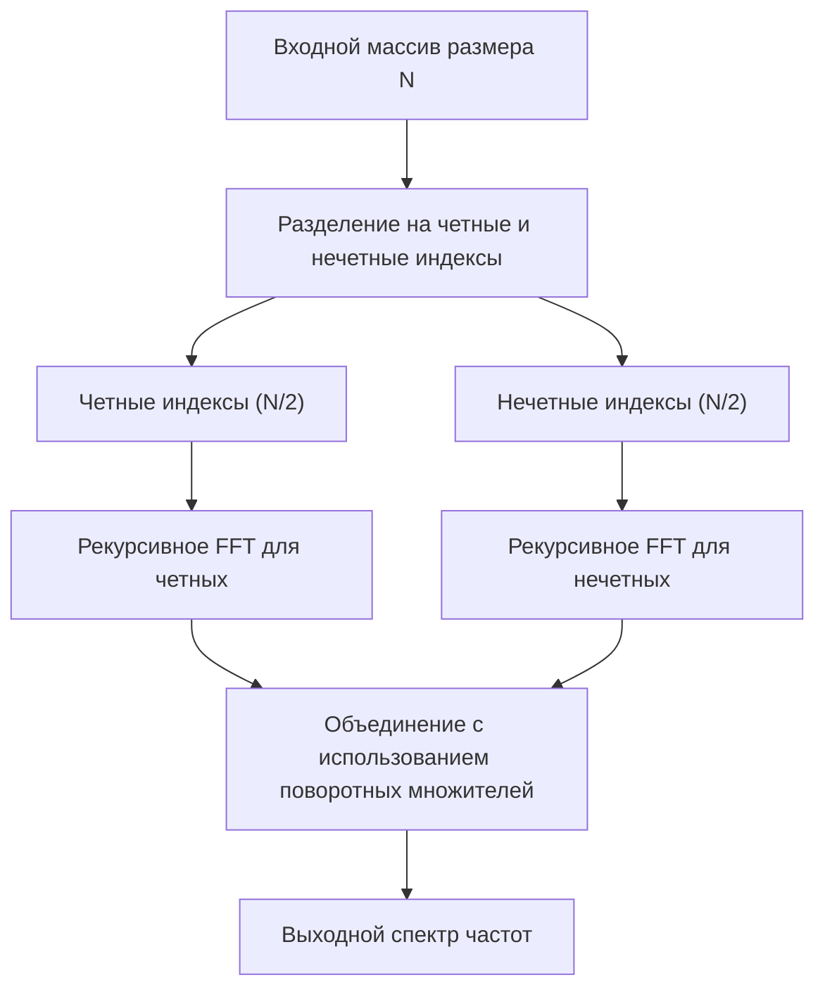
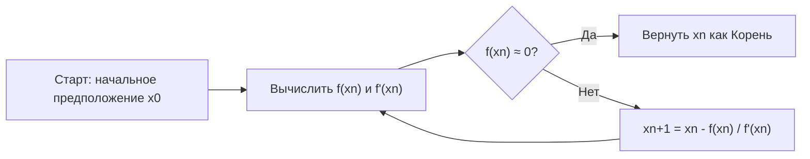
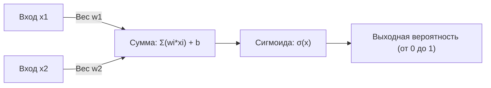

# Внимание любителям математики! 10 красивых математических формул, полезных в программировании

Программирование и математика на первый взгляд могут показаться совершенно разными областями. Программирование — это работа по написанию логичного и конкретного кода, а математика — это наука, стремящаяся к абстрактным и универсальным истинам. Однако в основе информатики всегда лежит математика. В оптимизации алгоритмов, науке о данных, машинном обучении, компьютерной графике и даже за кулисами повседневных приложений красивые математические формулы работают тихо и мощно.

В этой статье мы тщательно отобрали 10 математических формул, которые не только математически красивы, но и играют очень практическую и важную роль в контексте программирования и алгоритмов. Мы глубоко погрузимся в математический фон каждой формулы и очень подробно, с конкретными примерами кода на Python и C++, объясним, как она применяется в реальной практике программирования.

Добро пожаловать в мир, где пересекаются красота математики и практичность программирования.

---

## 1. Тождество Эйлера (Euler's Identity)

### Красота формулы и обзор
Тождество Эйлера называют «сокровищем человечества» и «самой красивой математической формулой в мире». Пять самых важных констант в математике (число Непера $e$, мнимая единица $i$, число пи $\pi$, нейтральный элемент по умножению $1$ и нейтральный элемент по сложению $0$) объединены в одной простой формуле.

$$ e^{i\pi} + 1 = 0 $$

Это тождество выводится путем подстановки $\theta = \pi$ в более общую формулу Эйлера $e^{i\theta} = \cos\theta + i\sin\theta$.

### Применение в программировании
В программировании, особенно в компьютерной графике и разработке игр, формула Эйлера становится чрезвычайно мощным инструментом для работы с «вращением». Вращение точек в двумерном пространстве можно выполнить и с помощью матричных вычислений, но использование комплексных чисел делает расчеты предельно простыми и интуитивно понятными. Вращение на комплексной плоскости можно реализовать просто путем умножения на $e^{i\theta}$, что делает код лаконичным.

### Пример реализации (C++)
Ниже представлена программа на C++, которая использует стандартную библиотеку `<complex>` для вращения точки в 2D-координатах на заданный угол (в радианах).

```cpp
#include <iostream>
#include <complex>
#include <cmath>

// Псевдоним типа для обработки двумерных координат как комплексных чисел
using Point2D = std::complex<double>;

// Функция для вращения точки вокруг начала координат на theta (радиан)
Point2D rotatePoint(const Point2D& point, double theta) {
    // На основе формулы Эйлера создаем комплексное число e^{i*theta} для вращения
    // Внутренне оно становится cos(theta) + i*sin(theta)
    Point2D rotation(std::cos(theta), std::sin(theta));
    
    // Применяем вращение путем умножения комплексных чисел
    return point * rotation;
}

int main() {
    // Начальные координаты (x=1.0, y=0.0)
    Point2D p(1.0, 0.0);
    
    // Вращение на 90 градусов (π/2 радиан)
    double theta = M_PI / 2.0;
    Point2D rotated_p = rotatePoint(p, theta);
    
    std::cout << "Original Point: (" << p.real() << ", " << p.imag() << ")\n";
    // Ожидаемый вывод - примерно (0, 1)
    std::cout << "Rotated Point: (" << rotated_p.real() << ", " << rotated_p.imag() << ")\n";
    
    return 0;
}
```

**Подробное объяснение**:
Преимущество этого подхода заключается в том, что вычисления матрицы вращения (4 умножения и 2 сложения) инкапсулируются как операции с комплексными числами. Кроме того, в трехмерном пространстве используется расширенная концепция этого — «кватернионы» (quaternions). Использование кватернионов позволяет избежать фатальной проблемы «шарнирного замка» (Gimbal Lock), возникающей при использовании углов Эйлера, и реализовать плавную сферическую линейную интерполяцию (Slerp).

---

## 2. Ряд Тейлора (Taylor Series)

### Красота формулы и обзор
Ряд Тейлора — это математический метод представления сложной функции (например, тригонометрической или показательной) в виде бесконечной суммы полиномов (многочленов). Разложение функции $f(x)$ в ряд Тейлора в окрестности точки $a$ определяется следующим образом:

$$ f(x) = \sum_{n=0}^\infty \frac{f^{(n)}(a)}{n!}(x-a)^n $$

В частности, случай, когда $a=0$, называется «рядом Маклорена».

### Применение в программировании
Компьютеры (CPU и FPU) по своей сути могут выполнять только четыре основных арифметических действия: сложение, вычитание, умножение и деление. Итак, как же вычисляются `sin(x)` или `exp(x)`? Хотя в современных процессорах часто используются алгоритм CORDIC или аппроксимация Чебышёва, ряд Тейлора (или его варианты) напрямую полезен при реализации математических функций на программном уровне или при создании собственных быстрых аппроксимирующих функций с пониженной точностью для повышения производительности.

### Пример реализации (Python)
Ниже представлен код на Python, который приближенно вычисляет функцию синуса с помощью ряда Маклорена.

$$ \sin(x) \approx x - \frac{x^3}{3!} + \frac{x^5}{5!} - \frac{x^7}{7!} + \dots $$

```python
import math

def taylor_sin(x, terms=10):
    """
    Приближенное вычисление sin(x) с использованием ряда Тейлора (ряда Маклорена).
    
    :param x: угол (в радианах)
    :param terms: количество вычисляемых членов (чем больше, тем выше точность)
    :return: приближенное значение sin(x)
    """
    # Использование периодичности для нормализации x в диапазон от -π до π (для повышения точности)
    x = (x + math.pi) % (2 * math.pi) - math.pi
    
    result = 0.0
    for n in range(terms):
        # Используются только нечетные члены: 2n + 1
        power = 2 * n + 1
        
        # Знак чередуется для каждого члена: (-1)^n
        sign = (-1) ** n
        
        # Вычисление факториала
        fact = math.factorial(power)
        
        # Вычисление выражения и сложение
        term = sign * (x ** power) / fact
        result += term
        
    return result

# Тест
angle = math.radians(45) # 45 градусов = π/4
print(f"Math library sin: {math.sin(angle)}")
print(f"Taylor series sin: {taylor_sin(angle, terms=5)}")
```

**Подробное объяснение**:
В приведенном выше коде входное значение `x` нормализуется в диапазоне $[-\pi, \pi]$. Это связано с тем, что ряд Тейлора обладает свойством, при котором погрешность быстро возрастает по мере удаления от центра разложения (здесь это 0) — так называемая ошибка усечения. Поскольку бесконечные вычисления в программировании невозможны, вычисления прерываются на конечном числе `terms`, и управление компромиссом между возникающими из-за этого «ошибкой округления» и «ошибкой усечения» является сутью программирования численных методов.

---

## 3. Теорема Байеса (Bayes' Theorem)

### Красота формулы и обзор
Теорема Байеса — это теорема для обновления вероятности события (апостериорной вероятности) на основе предварительных знаний (априорной вероятности), связанных с этим событием. Это одна из самых важных формул в теории вероятностей и статистике.

$$ P(A|B) = \frac{P(B|A)P(A)}{P(B)} $$

Здесь $P(A|B)$ представляет собой вероятность того, что событие A произойдет при условии, что произошло событие B (апостериорная вероятность).

### Применение в программировании
В области машинного обучения и науки о данных она широко используется в качестве «наивного байесовского классификатора» (Naive Bayes Classifier). Типичным примером применения является фильтрация спама. Расчет типа «Какова вероятность того, что это спам, если в письме есть слово "бесплатно"?» динамически вычисляется на основе прошлых данных.



### Пример реализации (Python)
Код, демонстрирующий базовую логику спам-фильтра.

```python
def calculate_spam_probability(
    prob_spam, 
    prob_word_given_spam, 
    prob_word_given_ham
):
    """
    Вычисление вероятности того, что письмо с определенным словом является спамом, по теореме Байеса.
    
    :param prob_spam: P(Spam) - априорная вероятность того, что письмо - спам
    :param prob_word_given_spam: P(Word|Spam) - вероятность наличия слова в спам-письме
    :param prob_word_given_ham: P(Word|Ham) - вероятность наличия слова в нормальном письме
    :return: P(Spam|Word) - вероятность того, что это спам при наличии данного слова
    """
    # Априорная вероятность нормального письма P(Ham) = 1 - P(Spam)
    prob_ham = 1.0 - prob_spam
    
    # Вероятность появления слова во всех письмах P(Word) = P(Word|Spam)P(Spam) + P(Word|Ham)P(Ham)
    # Это согласно формуле полной вероятности
    prob_word = (prob_word_given_spam * prob_spam) + (prob_word_given_ham * prob_ham)
    
    # Теорема Байеса P(Spam|Word) = P(Word|Spam) * P(Spam) / P(Word)
    if prob_word == 0:
        return 0.0 # Избежание деления на ноль
        
    prob_spam_given_word = (prob_word_given_spam * prob_spam) / prob_word
    return prob_spam_given_word

# Пример: вероятность для слова "выигрыш"
# Прошлые данные: 20% всех писем - это спам
p_spam = 0.2
# 80% спама содержит слово "выигрыш"
p_win_given_spam = 0.8
# 1% нормальных писем содержит слово "выигрыш"
p_win_given_ham = 0.01

result = calculate_spam_probability(p_spam, p_win_given_spam, p_win_given_ham)
print(f"Вероятность того, что письмо со словом 'выигрыш' является спамом: {result:.2%}")
```

**Подробное объяснение**:
В реальной реализации (наивный байесовский классификатор) вероятности нескольких слов перемножаются. Однако, если перемножить вероятности (значения от 0 до 1) тысячи раз, из-за ограничений представления чисел с плавающей запятой в компьютере (потеря значимости - underflow) значение станет равным нулю. Поэтому в реальном программировании обязательным приемом является преобразование произведения вероятностей в «сумму логарифмов» (`log(a * b) = log(a) + log(b)`).

---

## 4. Информационная энтропия Шеннона (Shannon Entropy)

### Красота формулы и обзор
Определенная отцом теории информации Клодом Шенноном, «энтропия» — это математическая формула для количественной оценки «неопределенности», «случайности» или «среднего количества информации» источника информации.

$$ H(X) = - \sum_{i=1}^n P(x_i) \log_2 P(x_i) $$

### Применение в программировании
Энтропия незаменима в алгоритмах сжатия данных (кодирование Хаффмана, теоретический предел алгоритма сжатия ZIP), оценке криптографической стойкости случайных чисел в теории криптографии и алгоритмах «деревьев принятия решений» (Decision Trees) в машинном обучении (например, ID3 и C4.5). При построении дерева решений алгоритм находит признак (feature), при разделении по которому уменьшение энтропии (прирост информации — Information Gain) будет максимальным.

### Пример реализации (Python)
Функция для расчета энтропии строки (набора данных) и оценки количества информации.

```python
import math
from collections import Counter

def calculate_entropy(data):
    """
    Вычисление энтропии Шеннона для заданного набора данных (строки или списка).
    """
    if not data:
        return 0.0
        
    # Подсчет количества появлений каждого элемента
    counts = Counter(data)
    total_len = len(data)
    
    entropy = 0.0
    for element, count in counts.items():
        # Вероятность появления P(x_i)
        probability = count / total_len
        
        # - P(x_i) * log2(P(x_i))
        entropy -= probability * math.log2(probability)
        
    return entropy

# Тест
# Если все символы одинаковы, неопределенность равна 0
data_deterministic = "AAAAAAAAAA" 
# Если символы случайны, неопределенность высока
data_random = "ABACBCBACB"

print(f"Entropy of '{data_deterministic}': {calculate_entropy(data_deterministic)}")
print(f"Entropy of '{data_random}': {calculate_entropy(data_random)}")
```

**Подробное объяснение**:
Единицей измерения энтропии является «бит» (bits). Если энтропия равна `1.5`, это означает, что для представления этих данных требуется в среднем минимум 1,5 бита на элемент. В повседневной практике программирования она постоянно рассчитывается как ориентир (бенчмарк) для оценки эффективности алгоритмов сжатия и как важный показатель при выборе признаков в моделях машинного обучения.

---

## 5. Быстрое преобразование Фурье (Fast Fourier Transform - FFT)

### Красота формулы и обзор
Дискретное преобразование Фурье (DFT), которое преобразует сигнал во временной области в сигнал в частотной области. Его формула выглядит следующим образом:

$$ X_k = \sum_{n=0}^{N-1} x_n e^{-i 2\pi k n / N} $$

Если вычислять DFT напрямую, временная сложность (time complexity) составит $O(N^2)$, и по мере увеличения объема данных вычисления станут катастрофически медленными. Алгоритм, который радикально ускоряет это до $O(N \log N)$ с помощью метода «разделяй и властвуй», — это «Быстрое преобразование Фурье (FFT)». Он входит в десятку самых важных алгоритмов 20-го века.



### Применение в программировании
FFT — это незаменимая технология, поддерживающая современное общество. Она работает повсюду: от распознавания голоса (Siri и Alexa), сжатия данных MP3 и JPEG/MPEG, цифровой связи, такой как LTE и Wi-Fi, до умножения огромных целых чисел (алгоритм Шёнхаге — Штрассена).

### Пример реализации (Python)
Пример простой реализации рекурсивного алгоритма Кули-Тьюки. (※ На практике используются библиотеки, такие как `FFTW` или `numpy.fft`, которые максимально оптимизированы на C или ассемблере)

```python
import cmath

def fft(x):
    """
    Вычисление одномерного быстрого преобразования Фурье (FFT) (метод Кули-Тьюки).
    Длина входного списка N должна быть степенью двойки.
    """
    N = len(x)
    
    # Базовый случай
    if N <= 1:
        return x
        
    # Разделение на элементы с четными и нечетными индексами (Divide)
    even = fft(x[0::2])
    odd = fft(x[1::2])
    
    # Объединение результатов (Conquer)
    T = [cmath.exp(-2j * cmath.pi * k / N) * odd[k] for k in range(N // 2)]
    
    # Использование симметрии для сокращения объема вычислений
    return [even[k] + T[k] for k in range(N // 2)] + \
           [even[k] - T[k] for k in range(N // 2)]

# Тест: простой сигнал
signal = [1.0, 1.0, 1.0, 1.0, 0.0, 0.0, 0.0, 0.0]
spectrum = fft(signal)

print("Frequency Spectrum (Magnitude):")
for k, val in enumerate(spectrum):
    # Вычисление абсолютного значения (амплитуды)
    print(f"Freq {k}: {abs(val):.3f}")
```

**Подробное объяснение**:
Суть этого алгоритма заключается в использовании симметрии и периодичности комплексных чисел, называемых «поворотными множителями» (Twiddle factor). Это позволяет избежать дублирования вычислений и, в случае $N=1024$, сократить необходимое количество операций с $1\,048\,576$ до примерно $10\,240$. Можно сказать, что это настоящее чудо, порожденное слиянием математики и алгоритмов.

---

## 6. Формула гаверсинуса (Haversine Formula)

### Красота формулы и обзор
Это формула для расчета кратчайшего расстояния (расстояния по большому кругу) между двумя точками на поверхности сферы, такой как поверхность Земли.

$$ a = \sin^2\left(\frac{\Delta\phi}{2}\right) + \cos\phi_1 \cos\phi_2 \sin^2\left(\frac{\Delta\lambda}{2}\right) $$
$$ c = 2\cdot \text{atan2}\left(\sqrt{a}, \sqrt{1-a}\right) $$
$$ d = R \cdot c $$

(Здесь $\phi$ — широта, $\lambda$ — долгота, а $R$ — радиус Земли)

### Применение в программировании
Эта формула необходима при расчете расстояния между двумя координатами широты и долготы в приложениях для GPS-трекинга и сервисах на основе геолокации, таких как Uber или Pokemon GO. При расчете расстояния по прямой линии с использованием теоремы Пифагора не учитывается кривизна Земли, что приводит к значительным погрешностям на больших расстояниях.

### Пример реализации (Python)
Функция, принимающая две координаты (широту и долготу) и возвращающая расстояние между ними в километрах.

```python
import math

def haversine_distance(lat1, lon1, lat2, lon2):
    """
    Расчет расстояния по большому кругу между двумя точками с использованием формулы гаверсинуса.
    """
    # Средний радиус Земли (в километрах)
    R = 6371.0 
    
    # Преобразование широты и долготы из градусов в радианы
    phi1, phi2 = math.radians(lat1), math.radians(lat2)
    delta_phi = math.radians(lat2 - lat1)
    delta_lambda = math.radians(lon2 - lon1)
    
    # Расчет по формуле гаверсинуса
    a = math.sin(delta_phi / 2.0)**2 + \
        math.cos(phi1) * math.cos(phi2) * \
        math.sin(delta_lambda / 2.0)**2
        
    c = 2 * math.atan2(math.sqrt(a), math.sqrt(1 - a))
    
    # Вычисление расстояния
    distance = R * c
    return distance

# Расстояние от Токийской башни (35.6586, 139.7454) до Статуи Свободы (40.6892, -74.0445)
tokyo = (35.6586, 139.7454)
ny = (40.6892, -74.0445)

dist = haversine_distance(tokyo[0], tokyo[1], ny[0], ny[1])
print(f"Расстояние от Токийской башни до Статуи Свободы: около {dist:.2f} км")
```

**Подробное объяснение**:
Существует также метод с использованием теоремы косинусов для сферической тригонометрии, но когда расстояние между двумя точками очень мало (например, несколько метров), может возникнуть так называемая «катастрофическая потеря значимости» (Catastrophic cancellation) в точности вычислений с плавающей запятой. Поскольку в формуле гаверсинуса используется `sin^2`, она имеет большое преимущество в программировании: она численно стабильна даже для микроскопических расстояний. Если требуется еще большая точность, используются формулы Винсенти (Vincenty's formulae), в которых Земля рассматривается как эллипсоид.

---

## 7. Метод Ньютона-Рафсона (Newton-Raphson Method)

### Красота формулы и обзор
Это чрезвычайно мощный алгоритм нахождения корней, который итеративно находит решение (корень) уравнения $f(x) = 0$ с помощью касательных.

$$ x_{n+1} = x_n - \frac{f(x_n)}{f'(x_n)} $$

Используя значение функции $f(x_n)$ и ее наклон (производную) $f'(x_n)$ в текущей позиции $x_n$, метод оценивает следующую, более точную позицию для поиска — $x_{n+1}$.



### Применение в программировании
Он используется в рендеринге графических движков, определении коллизий в физических симуляциях, задачах оптимизации и т.д. Особенно стоит отметить знаменитый «Быстрый обратный квадратный корень» (Fast Inverse Square Root), скрытый в исходном коде легендарной игры-шутера 『Quake III Arena』. Это был хак, в котором метод Ньютона применялся только один раз для молниеносного вычисления $1/\sqrt{x}$, что было критически важно для нормализации векторов.

### Пример реализации (C++)
Здесь показан простой пример вычисления стандартного квадратного корня $\sqrt{N}$ (то есть решения уравнения $x^2 - N = 0$) с помощью метода Ньютона. $f(x) = x^2 - N$, $f'(x) = 2x$.

```cpp
#include <iostream>
#include <cmath>

double newton_sqrt(double N, double tolerance = 1e-7) {
    if (N < 0) return NAN; // Квадратный корень из отрицательного числа - NaN
    if (N == 0) return 0;
    
    // Начальное предположение (начинаем с самого N)
    double x = N; 
    
    while (true) {
        // Вычисление следующего предположения: x_new = x - (x^2 - N) / (2x) = (x + N/x) / 2
        double x_new = 0.5 * (x + N / x);
        
        // Если изменение меньше допустимой погрешности (tolerance), считаем, что метод сошелся
        if (std::abs(x - x_new) < tolerance) {
            break;
        }
        x = x_new;
    }
    
    return x;
}

int main() {
    double number = 612.0;
    std::cout << "Square root of " << number << " is: " << newton_sqrt(number) << "\n";
    return 0;
}
```

**Подробное объяснение**:
Главное очарование метода Ньютона заключается в том, что при правильных условиях он обладает «квадратичной сходимостью» (Quadratic convergence). Это означает феноменальную скорость сходимости, когда количество правильных цифр примерно удваивается с каждой итерацией. Учитывая, что бинарный поиск имеет линейную сходимость, можно понять, насколько мощным является использование информации о производной (небольшом наклоне). В хаке 『Quake III』 начальное значение для метода Ньютона вычислялось с поразительной точностью с использованием "магического числа" для побитовых операций `0x5f3759df`, взламывая структуру числа с плавающей запятой стандарта IEEE 754.

---

## 8. Кривые Безье (Bézier Curves)

### Красота формулы и обзор
Параметрическое уравнение, которое определяет плавную кривую с использованием нескольких контрольных точек (Control Points). Наиболее часто используемая кубическая кривая Безье (Cubic Bézier Curve) имеет 4 точки $P_0, P_1, P_2, P_3$ и определяет координаты на кривой $B(t)$ с помощью параметра $t \ (0 \le t \le 1)$.

$$ B(t) = (1-t)^3 P_0 + 3(1-t)^2 t P_1 + 3(1-t) t^2 P_2 + t^3 P_3 $$

### Применение в программировании
Кривые Безье — это основа компьютерной графики. Они используются в инструментах векторной графики, таких как Adobe Illustrator, при рендеринге шрифтов (TrueType и OpenType), в функциях плавности (easing) для переходов и анимаций `cubic-bezier()` в CSS, для управления траекторией камеры в играх — везде, где требуется программная отрисовка «плавных движений и форм».

### Пример реализации (Python)
Код, генерирующий набор точек на кубической кривой Безье из 4-х контрольных точек.

```python
def cubic_bezier(p0, p1, p2, p3, steps=10):
    """
    Генерация списка координат на кубической кривой Безье.
    p0, p1, p2, p3 - это кортежи (x, y).
    steps - на сколько сегментов разделить кривую.
    """
    curve_points = []
    
    for i in range(steps + 1):
        # Параметр t меняется от 0.0 до 1.0
        t = i / steps
        
        # Вычисление коэффициентов, составляющих уравнение
        u = 1 - t
        tt = t * t
        uu = u * u
        uuu = uu * u
        ttt = tt * t
        
        # Расчет координат x и y для каждой точки
        x = (uuu * p0[0]) + \
            (3 * uu * t * p1[0]) + \
            (3 * u * tt * p2[0]) + \
            (ttt * p3[0])
            
        y = (uuu * p0[1]) + \
            (3 * uu * t * p1[1]) + \
            (3 * u * tt * p2[1]) + \
            (ttt * p3[1])
            
        curve_points.append((x, y))
        
    return curve_points

# Начальная точка, контрольная точка 1, контрольная точка 2, конечная точка
p0 = (0, 0)
p1 = (5, 10)
p2 = (15, 10)
p3 = (20, 0)

points = cubic_bezier(p0, p1, p2, p3, steps=5)
for i, pt in enumerate(points):
    print(f"t={i/5:.1f} -> Point({pt[0]:.2f}, {pt[1]:.2f})")
```

**Подробное объяснение**:
Эта формула является развернутым видом «Алгоритма де Кастельжо» (De Casteljau's algorithm), в котором рекурсивно применяется линейная интерполяция (Lerp: Linear Interpolation). Решение находится напрямую с использованием полиномиальных вычислений (полиномы Бернштейна). В программировании кривая аппроксимируется и отрисовывается как набор бесчисленного множества «крошечных отрезков». Поэтому, настраивая разрешение параметра $t$ (количество `steps`), можно управлять балансом между производительностью и качеством отрисовки.

---

## 9. Сигмоида (Sigmoid Function)

### Красота формулы и обзор
Плавная S-образная функция, которая сжимает (сквизит) любой вещественный вход $x \ ( -\infty < x < \infty )$ строго в значение между $0$ и $1$.

$$ \sigma(x) = \frac{1}{1 + e^{-x}} $$

### Применение в программировании
Исторически она сыграла очень важную роль в логистической регрессии и как «функция активации» (Activation Function) в нейронных сетях (глубоком обучении). Главным ее преимуществом является то, что выходные данные ограничены диапазоном от 0 до 1, и поэтому результат можно интерпретировать как «вероятность».



### Пример реализации (Python)
Код, который применяет функцию сигмоиды к заданному массиву (тензору).

```python
import math

def sigmoid(x):
    """Вычисление сигмоиды для единичного значения"""
    # Часто входное значение ограничивают, чтобы предотвратить переполнение при math.exp(-x)
    # Стандартная реализация для простоты
    if x >= 0:
        return 1.0 / (1.0 + math.exp(-x))
    else:
        # Защита от переполнения, когда x — большое отрицательное число
        return math.exp(x) / (1.0 + math.exp(x))

def apply_sigmoid(array):
    """Применить функцию сигмоиды ко всем элементам массива"""
    return [sigmoid(x) for x in array]

# Сырые данные (логиты) выходного слоя нейронной сети
logits = [-5.0, -1.0, 0.0, 1.0, 5.0]
probabilities = apply_sigmoid(logits)

for val, prob in zip(logits, probabilities):
    print(f"Input: {val:4.1f} -> Probability: {prob:.4f}")
```

**Подробное объяснение**:
Ветвление кода `x >= 0` и других вариантов выше сделано для предотвращения «переполнения» (overflow), специфичной проблемы программирования. Это численный математический прием, предотвращающий сбой программы (или возврат Inf) при попытке вычислить $e^{1000}$ в случаях, когда, например, $x = -1000$. В настоящее время в скрытых слоях глубокого обучения преобладает ReLU ($f(x) = \max(0, x)$) с точки зрения скорости вычислений и проблемы исчезающего градиента, но в выходном слое бинарной классификации сигмоида по-прежнему занимает незыблемые позиции.

---

## 10. Евклидово расстояние и теорема Пифагора (Euclidean Distance & Pythagorean Theorem)

### Красота формулы и обзор
Это основа геометрии со времен Древней Греции и формула, определяющая прямолинейное расстояние между двумя точками в $n$-мерном пространстве. В двумерном пространстве это сама теорема Пифагора ($a^2 + b^2 = c^2$).

Евклидово расстояние $d$ между точкой $P(x_1, y_1, z_1)$ и $Q(x_2, y_2, z_2)$ в трехмерном пространстве выражается следующим образом:

$$ d = \sqrt{(x_2-x_1)^2 + (y_2-y_1)^2 + (z_2-z_1)^2} $$

### Применение в программировании
Это основное вычисление для любой разработки игр, физических движков и алгоритмов машинного обучения, таких как «Метод k-ближайших соседей» (K-Nearest Neighbors) и кластеризация (K-Means). В играх оно вычисляется миллионы раз каждый кадр, например, при определении столкновений персонажей (Bounding Circle / Sphere Collision).

### Пример реализации (C++)
Оптимизированный код, который определяет, сталкиваются ли два круга (или сферы).

```cpp
#include <iostream>
#include <cmath>

struct Circle {
    double x, y; // Координаты центра
    double radius; // Радиус
};

// Функция для определения столкновения двух кругов
bool isColliding(const Circle& a, const Circle& b) {
    // Разница координат x и y (дельта)
    double dx = b.x - a.x;
    double dy = b.y - a.y;
    
    // Вычисляем «квадрат» расстояния
    double distanceSquared = (dx * dx) + (dy * dy);
    
    // Вычисляем «квадрат» суммы радиусов
    double radiiSum = a.radius + b.radius;
    double radiiSumSquared = radiiSum * radiiSum;
    
    // Сравниваем квадрат расстояния с квадратом суммы радиусов
    return distanceSquared <= radiiSumSquared;
}

int main() {
    Circle player = {0.0, 0.0, 5.0};
    Circle enemy1 = {8.0, 0.0, 4.0}; // Расстояние 8, сумма радиусов 9 -> Столкновение
    Circle enemy2 = {10.0, 10.0, 2.0}; // Расстояние ок. 14.1, сумма радиусов 7 -> Нет столкновения
    
    std::cout << "Collision with enemy1: " << (isColliding(player, enemy1) ? "Yes" : "No") << "\n";
    std::cout << "Collision with enemy2: " << (isColliding(player, enemy2) ? "Yes" : "No") << "\n";
    
    return 0;
}
```

**Подробное объяснение**:
При расчетах точно по математической формуле в конце необходимо извлечь квадратный корень $\sqrt{\cdot}$, но в программировании вызов функции `sqrt()` является очень тяжелой операцией для процессора (потребляет много тактовых циклов). Поэтому, если нужно только сравнить расстояния, стандартным приемом в программировании игр является **сравнение обеих частей в квадрате** (`distanceSquared <= radiiSumSquared`). Подобная оптимизация для снижения вычислительной нагрузки за счет свойств математических уравнений и неравенств — это истинное удовольствие от проектирования алгоритмов.

---

## Заключение

Что вы об этом думаете? От тождества Эйлера до теоремы Пифагора — эти 10 формул не просто теоретические концепции из учебников. За кулисами кода, который мы пишем каждый день, они пульсируют как «сердце», сжимая данные, позволяя моделям машинного обучения делать прогнозы, плавно отрисовывая анимацию и обеспечивая быстрый поиск.

Понимание математической подоплеки необходимо для перехода от кодера, просто вызывающего существующие библиотеки (например, `math.sin` или `numpy.fft`), к инженеру, который понимает их внутреннюю структуру и может выжать из них максимум. В следующий раз, когда вы будете писать код, попробуйте немного пофантазировать о том, какие красивые математические формулы работают за ним.

**Happy Coding and Math!**
