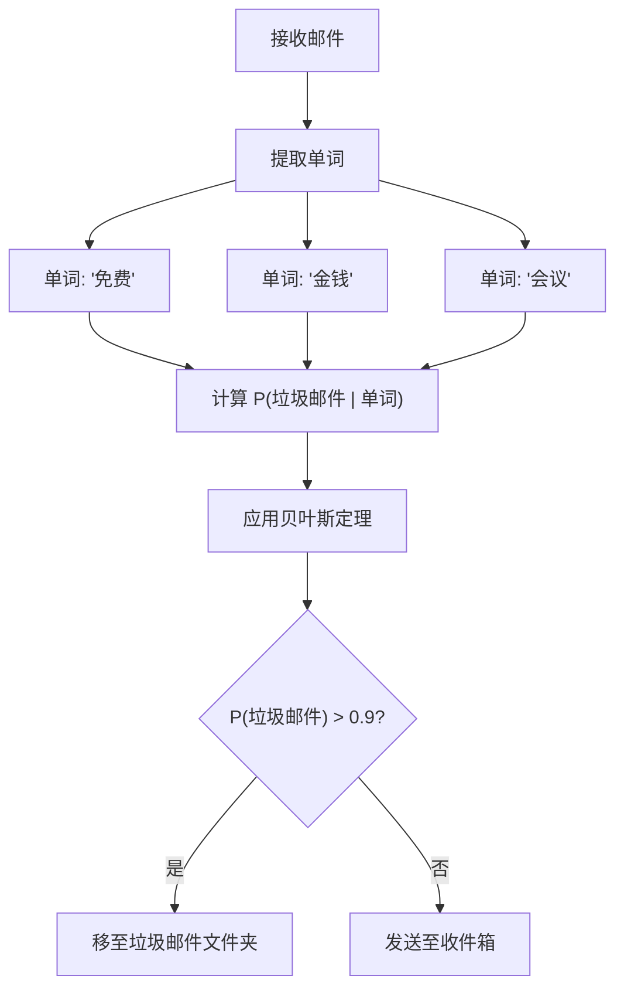
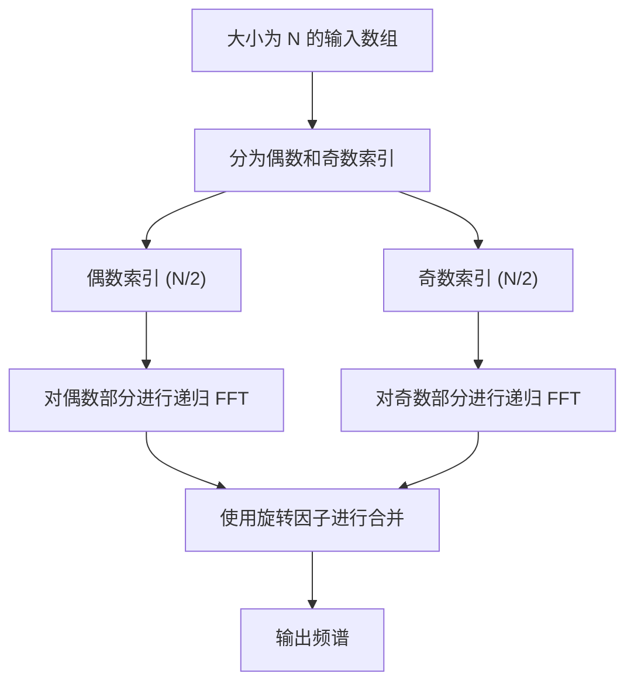
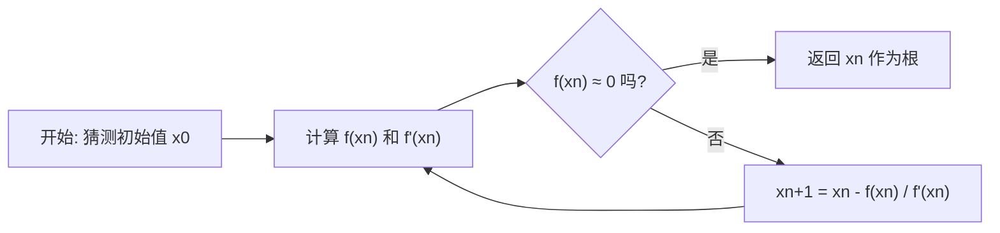
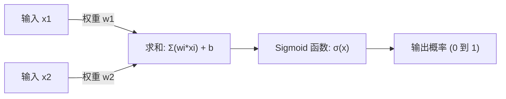

# 数学爱好者必看！对编程有用的10个优美数学公式

乍看之下，编程和数学似乎是截然不同的两个领域。编程是编写具有逻辑性且具体的代码的过程，而数学则是追求抽象且普遍真理的学问。然而，在计算机科学的底层，始终存在着数学的身影。算法的优化、数据科学、机器学习、计算机图形学，甚至日常应用程序的背后，都有优美的数学公式在默默且强大地发挥着作用。

在本文中，我们精选了10个不仅在数学上十分优美，而且在编程和算法语境下也非常实用且发挥重要作用的数学公式。我们将深入探讨每个公式背后的数学背景，并结合具体的Python和C++代码片段，极其详细地解说它们在编程一线是如何被应用的。

欢迎来到数学之美与编程实用性交织的世界。

---

## 1. 欧拉恒等式 (Euler's Identity)

### 公式的优美性与概述
被誉为“人类的瑰宝”、“世界上最美的数学公式”的欧拉恒等式。它将数学中最重要的5个常数（自然对数的底 $e$、虚数单位 $i$、圆周率 $\pi$、乘法单位元 $1$、加法单位元 $0$）整合到了一个极其简单的公式中。

$$ e^{i\pi} + 1 = 0 $$

这个恒等式是通过在更一般的欧拉公式 $e^{i\theta} = \cos\theta + i\sin\theta$ 中代入 $\theta = \pi$ 推导出来的。

### 在编程中的应用
在编程，尤其是计算机图形学和游戏开发中，欧拉公式是处理“旋转”的极其强大的工具。二维空间中点的旋转虽然也可以通过矩阵计算来实现，但使用复数会使计算变得极其简单和直观。在复平面上的旋转，只需乘以 $e^{i\theta}$ 即可实现，因此代码也非常简洁。

### 实现示例 (C++)
以下是一个使用C++标准库 `<complex>`，将二维坐标上的点旋转指定角度（弧度）的程序。

```cpp
#include <iostream>
#include <complex>
#include <cmath>

// 用于将二维坐标作为复数处理的类型别名
using Point2D = std::complex<double>;

// 将点绕原点旋转 theta (弧度) 的函数
Point2D rotatePoint(const Point2D& point, double theta) {
    // 基于欧拉公式，创建用于旋转的复数 e^{i*theta}
    // 内部其实是 cos(theta) + i*sin(theta)
    Point2D rotation(std::cos(theta), std::sin(theta));
    
    // 通过复数乘法应用旋转
    return point * rotation;
}

int main() {
    // 初始坐标 (x=1.0, y=0.0)
    Point2D p(1.0, 0.0);
    
    // 旋转 90度（π/2 弧度）
    double theta = M_PI / 2.0;
    Point2D rotated_p = rotatePoint(p, theta);
    
    std::cout << "Original Point: (" << p.real() << ", " << p.imag() << ")\n";
    // 预期输出大约为 (0, 1)
    std::cout << "Rotated Point: (" << rotated_p.real() << ", " << rotated_p.imag() << ")\n";
    
    return 0;
}
```

**详细解说**:
这种方法的优点在于，能够将旋转矩阵的计算（4次乘法和2次加法）封装为复数的运算。此外，在三维空间中，使用的是其扩展概念“四元数（Quaternion）”。通过使用四元数，可以避免使用欧拉角时发生的致命问题“万向节死锁（Gimbal Lock）”，并实现平滑的球面线性插值（Slerp）。

---

## 2. 泰勒展开 (Taylor Series)

### 公式的优美性与概述
泰勒展开是一种将复杂函数（如三角函数、指数函数等）表示为无限多项式之和的数学方法。函数 $f(x)$ 在某一点 $a$ 附近的泰勒展开定义如下：

$$ f(x) = \sum_{n=0}^\infty \frac{f^{(n)}(a)}{n!}(x-a)^n $$

特别是当 $a=0$ 时，被称为“麦克劳林展开”。

### 在编程中的应用
计算机（CPU和FPU）本质上只能执行加法、减法、乘法、除法等四则运算。那么，`sin(x)` 或 `exp(x)` 是如何计算的呢？在现代处理器中，通常使用 CORDIC 算法或切比雪夫近似等方法；而在软件层面上实现数学函数，或者为了追求性能而牺牲精度自己编写快速近似函数时，泰勒展开（或其变体）就会派上用场。

### 实现示例 (Python)
以下是使用麦克劳林展开来近似计算正弦函数（Sine）的Python代码。

$$ \sin(x) \approx x - \frac{x^3}{3!} + \frac{x^5}{5!} - \frac{x^7}{7!} + \dots $$

```python
import math

def taylor_sin(x, terms=10):
    """
    使用泰勒展开（麦克劳林展开）近似计算 sin(x)。
    
    :param x: 角度（弧度）
    :param terms: 计算的项数（越多精度越高）
    :return: 近似的 sin(x) 值
    """
    # 利用周期性将 x 归一化到 -π 到 π 的范围内（为了提高精度）
    x = (x + math.pi) % (2 * math.pi) - math.pi
    
    result = 0.0
    for n in range(terms):
        # 仅使用奇数项: 2n + 1
        power = 2 * n + 1
        
        # 符号逐项反转: (-1)^n
        sign = (-1) ** n
        
        # 计算阶乘
        fact = math.factorial(power)
        
        # 表达式求值并相加
        term = sign * (x ** power) / fact
        result += term
        
    return result

# 测试
angle = math.radians(45) # 45度 = π/4
print(f"Math library sin: {math.sin(angle)}")
print(f"Taylor series sin: {taylor_sin(angle, terms=5)}")
```

**详细解说**:
在上述代码中，输入值 `x` 被归一化到了 $[-\pi, \pi]$ 的范围内。这是因为泰勒展开具有一个特性：离展开中心（这里是0）越远，误差就会急剧增大（截断误差）。在编程中不可能进行无限的计算，因此要在有限的 `terms` 处截断计算，而管理由此产生的“舍入误差”与“截断误差”之间的权衡，正是数值计算编程的关键所在。

---

## 3. 贝叶斯定理 (Bayes' Theorem)

### 公式的优美性与概述
贝叶斯定理是一个基于与某事件相关的先验知识（先验概率），来更新该事件发生概率（后验概率）的定理。它是概率论和统计学中最重要的公式之一。

$$ P(A|B) = \frac{P(B|A)P(A)}{P(B)} $$

这里，$P(A|B)$ 表示在事件B发生的条件下，事件A发生的概率（后验概率）。

### 在编程中的应用
在机器学习和数据科学领域，它作为“朴素贝叶斯分类器（Naive Bayes Classifier）”被广泛应用。最典型的应用例子是垃圾邮件过滤。它能够基于过去的数据动态地计算：“如果这封邮件包含‘免费’这个词，那么它是垃圾邮件的概率是多少？”



### 实现示例 (Python)
以下是展示垃圾邮件过滤器基本逻辑的代码。

```python
def calculate_spam_probability(
    prob_spam, 
    prob_word_given_spam, 
    prob_word_given_ham
):
    """
    使用贝叶斯定理计算包含某个单词的邮件是垃圾邮件的概率。
    
    :param prob_spam: P(Spam) - 邮件是垃圾邮件的先验概率
    :param prob_word_given_spam: P(Word|Spam) - 垃圾邮件中包含该单词的概率
    :param prob_word_given_ham: P(Word|Ham) - 正常邮件中包含该单词的概率
    :return: P(Spam|Word) - 在包含该单词的情况下是垃圾邮件的概率
    """
    # 正常邮件的先验概率 P(Ham) = 1 - P(Spam)
    prob_ham = 1.0 - prob_spam
    
    # 该单词在所有邮件中出现的概率 P(Word) = P(Word|Spam)P(Spam) + P(Word|Ham)P(Ham)
    # 这是根据全概率公式得出的
    prob_word = (prob_word_given_spam * prob_spam) + (prob_word_given_ham * prob_ham)
    
    # 贝叶斯定理 P(Spam|Word) = P(Word|Spam) * P(Spam) / P(Word)
    if prob_word == 0:
        return 0.0 # 避免除以零
        
    prob_spam_given_word = (prob_word_given_spam * prob_spam) / prob_word
    return prob_spam_given_word

# 示例: 包含“中奖”一词的概率
# 历史数据: 所有邮件中有 20% 是垃圾邮件
p_spam = 0.2
# 垃圾邮件中有 80% 包含“中奖”
p_win_given_spam = 0.8
# 正常邮件中有 1% 包含“中奖”
p_win_given_ham = 0.01

result = calculate_spam_probability(p_spam, p_win_given_spam, p_win_given_ham)
print(f"包含“中奖”一词的邮件是垃圾邮件的概率: {result:.2%}")
```

**详细解说**:
在实际应用中（如朴素贝叶斯分类器），会将多个单词的概率相乘进行计算。但是，如果将数千个概率（0到1之间的值）相乘，由于计算机浮点数表示的限制（下溢），结果会变成零。因此，在实际编程中，将概率的乘积转换为“对数之和”（`log(a * b) = log(a) + log(b)`）是一项必备技巧。

---

## 4. 香农熵 (Shannon Entropy)

### 公式的优美性与概述
由信息论之父克劳德·香农定义的“熵”，是一个量化信息源所具有的“不确定性”、“混乱度”或者“平均信息量”的数学公式。

$$ H(X) = - \sum_{i=1}^n P(x_i) \log_2 P(x_i) $$

### 在编程中的应用
熵在文件数据压缩（霍夫曼编码或ZIP压缩算法的理论极限）、密码学中的随机数强度评估，以及机器学习中的“决策树（Decision Trees）”算法（如ID3和C4.5）中是不可或缺的存在。在构建决策树时，算法会寻找在划分数据后能使熵减少量（信息增益：Information Gain）达到最大的特征。

### 实现示例 (Python)
计算字符串（数据集）的熵以评估其信息量的函数。

```python
import math
from collections import Counter

def calculate_entropy(data):
    """
    计算给定数据集（字符串或列表）的香农熵。
    """
    if not data:
        return 0.0
        
    # 统计每个元素的出现次数
    counts = Counter(data)
    total_len = len(data)
    
    entropy = 0.0
    for element, count in counts.items():
        # 出现概率 P(x_i)
        probability = count / total_len
        
        # - P(x_i) * log2(P(x_i))
        entropy -= probability * math.log2(probability)
        
    return entropy

# 测试
# 如果全部是相同的字符，不确定性为 0
data_deterministic = "AAAAAAAAAA" 
# 如果是随机字符，不确定性较高
data_random = "ABACBCBACB"

print(f"Entropy of '{data_deterministic}': {calculate_entropy(data_deterministic)}")
print(f"Entropy of '{data_random}': {calculate_entropy(data_random)}")
```

**详细解说**:
熵的单位是“比特（bits）”。如果熵为 `1.5`，这意味着平均下来至少需要 1.5 比特来表示该数据中的一个元素。在编程一线，它作为衡量压缩算法效率的基准，或是机器学习模型特征选择中的重要指标，被日常计算着。

---

## 5. 快速傅里叶变换 (Fast Fourier Transform - FFT)

### 公式的优美性与概述
将时域信号转换为频域信号的离散傅里叶变换（DFT）。其数学公式如下：

$$ X_k = \sum_{n=0}^{N-1} x_n e^{-i 2\pi k n / N} $$

如果用简单粗暴的方式计算这个DFT，其时间复杂度为 $O(N^2)$，当数据量增加时，计算速度会呈爆炸性下降。利用分治法将其时间复杂度极大地优化到 $O(N \log N)$ 的算法就是“快速傅里叶变换（FFT）”。它被列为20世纪最重要的十大算法之一。



### 在编程中的应用
FFT是支撑现代社会不可或缺的技术。从语音识别（Siri或Alexa）、MP3或JPEG/MPEG的数据压缩、LTE和Wi-Fi等数字通信，乃至非常巨大的整数乘法（Schönhage–Strassen算法），都能看到它的身影。

### 实现示例 (Python)
这是一个递归的 Cooley-Tukey 算法的简单实现示例。（※在实际业务中，会使用用C语言或汇编语言优化到极致的 `FFTW` 库或 `numpy.fft`）

```python
import cmath

def fft(x):
    """
    计算一维快速傅里叶变换 (FFT)（Cooley-Tukey法）。
    输入列表的长度 N 必须是 2 的幂。
    """
    N = len(x)
    
    # 基本情况
    if N <= 1:
        return x
        
    # 分成偶数索引和奇数索引 (Divide)
    even = fft(x[0::2])
    odd = fft(x[1::2])
    
    # 合并结果 (Conquer)
    T = [cmath.exp(-2j * cmath.pi * k / N) * odd[k] for k in range(N // 2)]
    
    # 利用对称性减少计算量
    return [even[k] + T[k] for k in range(N // 2)] + \
           [even[k] - T[k] for k in range(N // 2)]

# 测试: 简单信号
signal = [1.0, 1.0, 1.0, 1.0, 0.0, 0.0, 0.0, 0.0]
spectrum = fft(signal)

print("Frequency Spectrum (Magnitude):")
for k, val in enumerate(spectrum):
    # 计算绝对值（振幅）
    print(f"Freq {k}: {abs(val):.3f}")
```

**详细解说**:
这个算法的核心在于利用了被称为“旋转因子（Twiddle factor）”的复数的对称性和周期性。通过消除重复计算的浪费，当 $N=1024$ 时，它将原本需要 $1,048,576$ 次的运算骤降至仅约 $10,240$ 次。这可以说是数学与算法融合产生的奇迹。

---

## 6. 半正矢公式 (Haversine Formula)

### 公式的优美性与概述
用于计算地球表面等球面上两点之间最短距离（大圆距离）的公式。

$$ a = \sin^2\left(\frac{\Delta\phi}{2}\right) + \cos\phi_1 \cos\phi_2 \sin^2\left(\frac{\Delta\lambda}{2}\right) $$
$$ c = 2\cdot \text{atan2}\left(\sqrt{a}, \sqrt{1-a}\right) $$
$$ d = R \cdot c $$

（其中，$\phi$ 为纬度，$\lambda$ 为经度，$R$ 为地球半径）

### 在编程中的应用
在 GPS 追踪应用程序，以及诸如 Uber 或 Pokemon GO 等基于位置信息的服务中，当需要计算两个经纬度坐标之间的距离时，这是一个必不可少的公式。因为使用勾股定理的直线距离计算无法考虑地球的曲率，在长距离时会产生很大的误差。

### 实现示例 (Python)
一个接收两个坐标（纬度、经度）并返回它们之间距离（公里）的函数。

```python
import math

def haversine_distance(lat1, lon1, lat2, lon2):
    """
    使用半正矢公式计算两点之间的大圆距离。
    """
    # 地球平均半径 (公里)
    R = 6371.0 
    
    # 将纬度和经度从度数转换为弧度
    phi1, phi2 = math.radians(lat1), math.radians(lat2)
    delta_phi = math.radians(lat2 - lat1)
    delta_lambda = math.radians(lon2 - lon1)
    
    # 计算半正矢
    a = math.sin(delta_phi / 2.0)**2 + \
        math.cos(phi1) * math.cos(phi2) * \
        math.sin(delta_lambda / 2.0)**2
        
    c = 2 * math.atan2(math.sqrt(a), math.sqrt(1 - a))
    
    # 计算距离
    distance = R * c
    return distance

# 从东京塔 (35.6586, 139.7454) 到自由女神像 (40.6892, -74.0445) 的距离
tokyo = (35.6586, 139.7454)
ny = (40.6892, -74.0445)

dist = haversine_distance(tokyo[0], tokyo[1], ny[0], ny[1])
print(f"东京塔到自由女神像的距离: 约 {dist:.2f} km")
```

**详细解说**:
虽然也可以使用球面三角学的余弦定理，但当两点之间的距离非常近（例如几米）时，由于浮点数计算精度的限制，很容易发生“灾难性相消（Catastrophic cancellation）”。由于半正矢公式使用了 `sin^2`，因此即使对于微小的距离，也能在数值上保持稳定的计算，这是其在编程上的一大优势。如果需要更高的精度，可以使用将地球视为椭球体的 Vincenty 公式（Vincenty's formulae）。

---

## 7. 牛顿-拉弗森方法 (Newton-Raphson Method)

### 公式的优美性与概述
一种通过使用切线来迭代求解方程式 $f(x) = 0$ 的根的极其强大的求根算法。

$$ x_{n+1} = x_n - \frac{f(x_n)}{f'(x_n)} $$

它利用当前位置 $x_n$ 处的函数值 $f(x_n)$ 及其斜率（导数）$f'(x_n)$，来推测下一个需要探索的更准确的位置 $x_{n+1}$。



### 在编程中的应用
常用于图形引擎的渲染、物理模拟中的碰撞检测、优化问题等。值得一提的是，在传奇 FPS 游戏《雷神之锤III竞技场 (Quake III Arena)》的源代码中潜藏的“快速平方根倒数（Fast Inverse Square Root）”算法。这是一个仅应用一次牛顿法就以惊人的速度计算出 $1/\sqrt{x}$ 的骇客技巧，对于向量归一化来说是不可或缺的。

### 实现示例 (C++)
这里展示一个易于理解的例子：使用牛顿法计算标准的平方根 $\sqrt{N}$（即求解 $x^2 - N = 0$）。此时 $f(x) = x^2 - N$，$f'(x) = 2x$。

```cpp
#include <iostream>
#include <cmath>

double newton_sqrt(double N, double tolerance = 1e-7) {
    if (N < 0) return NAN; // 负数的平方根为 NaN
    if (N == 0) return 0;
    
    // 初始推测值（从 N 本身开始）
    double x = N; 
    
    while (true) {
        // 计算下一个推测值: x_new = x - (x^2 - N) / (2x) = (x + N/x) / 2
        double x_new = 0.5 * (x + N / x);
        
        // 如果变化量小于容差 (tolerance)，则认为已收敛
        if (std::abs(x - x_new) < tolerance) {
            break;
        }
        x = x_new;
    }
    
    return x;
}

int main() {
    double number = 612.0;
    std::cout << "Square root of " << number << " is: " << newton_sqrt(number) << "\n";
    return 0;
}
```

**详细解说**:
牛顿法的最大魅力在于，在条件满足的情况下它能够实现“二次收敛（Quadratic convergence）”。这意味着每次迭代，正确答案的有效数字位数将大约增加一倍，收敛速度惊人。考虑到二分查找只是线性收敛，就可以明白利用导数（微小斜率）信息的强大之处。在《雷神之锤III》的技巧中，它使用了位运算的魔术数字 `0x5f3759df` 巧妙破解了 IEEE 754 浮点数的结构，从而以惊人的精度导出了牛顿法的初始值。

---

## 8. 贝塞尔曲线 (Bézier Curves)

### 公式的优美性与概述
一种使用多个控制点（Control Points）来定义平滑曲线的参数方程。最常用的三次贝塞尔曲线（Cubic Bézier Curve）具有 4 个点 $P_0, P_1, P_2, P_3$，并通过参数 $t \ (0 \le t \le 1)$ 决定曲线上的坐标 $B(t)$。

$$ B(t) = (1-t)^3 P_0 + 3(1-t)^2 t P_1 + 3(1-t) t^2 P_2 + t^3 P_3 $$

### 在编程中的应用
贝塞尔曲线是计算机图形学的根基。从 Adobe Illustrator 等矢量绘图工具、字体（TrueType 或 OpenType）的渲染、CSS 的 `cubic-bezier()` 过渡动画和缓动函数，到游戏中相机路径的控制等，只要需要在程序中绘制“平滑的移动和形状”，就会使用到它。

### 实现示例 (Python)
这是一个根据 4 个控制点生成三次贝塞尔曲线上点集的代码。

```python
def cubic_bezier(p0, p1, p2, p3, steps=10):
    """
    生成三次贝塞尔曲线上的坐标列表。
    p0, p1, p2, p3 是 (x, y) 的元组。
    steps 表示将曲线分成多少个线段。
    """
    curve_points = []
    
    for i in range(steps + 1):
        # 参数 t 在 0.0 到 1.0 之间变化
        t = i / steps
        
        # 计算构成公式的系数
        u = 1 - t
        tt = t * t
        uu = u * u
        uuu = uu * u
        ttt = tt * t
        
        # 对每个点计算 x 坐标和 y 坐标
        x = (uuu * p0[0]) + \
            (3 * uu * t * p1[0]) + \
            (3 * u * tt * p2[0]) + \
            (ttt * p3[0])
            
        y = (uuu * p0[1]) + \
            (3 * uu * t * p1[1]) + \
            (3 * u * tt * p2[1]) + \
            (ttt * p3[1])
            
        curve_points.append((x, y))
        
    return curve_points

# 起点、控制点1、控制点2、终点
p0 = (0, 0)
p1 = (5, 10)
p2 = (15, 10)
p3 = (20, 0)

points = cubic_bezier(p0, p1, p2, p3, steps=5)
for i, pt in enumerate(points):
    print(f"t={i/5:.1f} -> Point({pt[0]:.2f}, {pt[1]:.2f})")
```

**详细解说**:
这个公式是展开了递归应用线性插值（Lerp: Linear Interpolation）的“德·卡斯特里奥算法（De Casteljau's algorithm）”。它使用多项式计算（伯恩斯坦多项式）直接求解。在编程中，曲线被近似绘制为无数“微小直线”的集合。因此，可以通过调整 $t$ 的分辨率（steps）来控制性能与绘制质量之间的平衡。

---

## 9. 激活函数/Sigmoid 函数 (Sigmoid Function)

### 公式的优美性与概述
无论输入任何实数 $x \ ( -\infty < x < \infty )$，都会将其平滑地压缩（映射）到 $0$ 到 $1$ 之间的S型函数。

$$ \sigma(x) = \frac{1}{1 + e^{-x}} $$

### 在编程中的应用
它在逻辑回归，以及神经网络（深度学习）的“激活函数（Activation Function）”中，历史上发挥了极其重要的作用。因为其输出落在0到1的范围内，所以最大的优势是可以将其结果解释为“概率”。



### 实现示例 (Python)
这是一个将 Sigmoid 函数应用于输入数组（张量）的代码。

```python
import math

def sigmoid(x):
    """针对单个值计算 Sigmoid"""
    # 为了防止 math.exp(-x) 溢出，通常会限制输入值
    # 这是一个用于简化的标准实现
    if x >= 0:
        return 1.0 / (1.0 + math.exp(-x))
    else:
        # 针对 x 为极小的负数时的防溢出措施
        return math.exp(x) / (1.0 + math.exp(x))

def apply_sigmoid(array):
    """将 Sigmoid 函数应用于数组中的所有元素"""
    return [sigmoid(x) for x in array]

# 神经网络输出层的原始数据（logits）
logits = [-5.0, -1.0, 0.0, 1.0, 5.0]
probabilities = apply_sigmoid(logits)

for val, prob in zip(logits, probabilities):
    print(f"Input: {val:4.1f} -> Probability: {prob:.4f}")
```

**详细解说**:
在上面的代码中，针对 `x >= 0` 和其他情况进行分支处理，是为了防止编程特有的问题——“溢出（Overflow）”。例如当 $x = -1000$ 时，程序可能会尝试计算 $e^{1000}$ 而崩溃（或者返回 Inf），这是一种在数值计算中防止这种现象的技巧。目前，在深度学习的隐藏层中，从计算速度和解决梯度消失问题的角度来看，ReLU（$f(x) = \max(0, x)$）已成为主流，但在二分类的输出层中，Sigmoid 函数依然保持着不可撼动的地位。

---

## 10. 欧几里得距离与勾股定理 (Euclidean Distance & Pythagorean Theorem)

### 公式的优美性与概述
这是流传自古希腊的几何学基础，也是定义 $n$ 维空间中两点间直线距离的公式。在二维空间中，它就是勾股定理（$a^2 + b^2 = c^2$）本身。

三维空间中点 $P(x_1, y_1, z_1)$ 和 $Q(x_2, y_2, z_2)$ 之间的欧几里得距离 $d$ 表示如下：

$$ d = \sqrt{(x_2-x_1)^2 + (y_2-y_1)^2 + (z_2-z_1)^2} $$

### 在编程中的应用
这是各种游戏开发、物理引擎、以及机器学习中“K近邻法（K-Nearest Neighbors）”和聚类（K-Means）等算法的核心计算。在游戏中，例如角色之间的碰撞检测（包围圆/包围球碰撞），每一帧都会被计算数百万次。

### 实现示例 (C++)
这是一个用于判断两个圆（球）是否发生碰撞的优化代码。

```cpp
#include <iostream>
#include <cmath>

struct Circle {
    double x, y; // 中心坐标
    double radius; // 半径
};

// 判断两个圆是否发生碰撞的函数
bool isColliding(const Circle& a, const Circle& b) {
    // x坐标与y坐标的差（Delta）
    double dx = b.x - a.x;
    double dy = b.y - a.y;
    
    // 计算距离的“平方”
    double distanceSquared = (dx * dx) + (dy * dy);
    
    // 计算半径之和的“平方”
    double radiiSum = a.radius + b.radius;
    double radiiSumSquared = radiiSum * radiiSum;
    
    // 比较距离的平方和半径之和的平方
    return distanceSquared <= radiiSumSquared;
}

int main() {
    Circle player = {0.0, 0.0, 5.0};
    Circle enemy1 = {8.0, 0.0, 4.0}; // 距离8, 半径和9 -> 碰撞
    Circle enemy2 = {10.0, 10.0, 2.0}; // 距离约14.1, 半径和7 -> 未碰撞
    
    std::cout << "Collision with enemy1: " << (isColliding(player, enemy1) ? "Yes" : "No") << "\n";
    std::cout << "Collision with enemy2: " << (isColliding(player, enemy2) ? "Yes" : "No") << "\n";
    
    return 0;
}
```

**详细解说**:
如果完全按照数学公式计算，最后需要进行开平方 $\sqrt{\cdot}$。但在编程中，调用 `sqrt()` 函数对 CPU 来说是一项非常繁重的处理（消耗大量时钟周期）。因此，如果仅仅是为了比较距离，**在等式两边都保持平方状态下进行比较**（`distanceSquared <= radiiSumSquared`）是游戏编程中的常用手段。像这样利用数学等式或不等式的性质来降低计算负荷的优化，正是算法设计的妙趣所在。

---

## 总结

大家觉得如何呢？从欧拉恒等式到勾股定理，这10个公式并不仅仅是写在教科书上的理论概念。在日常编写的代码背后，它们作为核心跳动着，负责压缩数据、让机器学习模型进行预测、渲染平滑的动画以及实现快速搜索。

理解这些数学背景不仅是必须的，更是从一个仅仅调用现有库（如 `math.sin` 或 `numpy.fft`）的编码者，进阶成为能深入理解内部结构并发挥其极限的工程师的必经之路。下次编写代码时，不妨稍微展开想象，思考一下在这行代码背后，有哪些优美的数学公式正在运作。

**Happy Coding and Math!**
