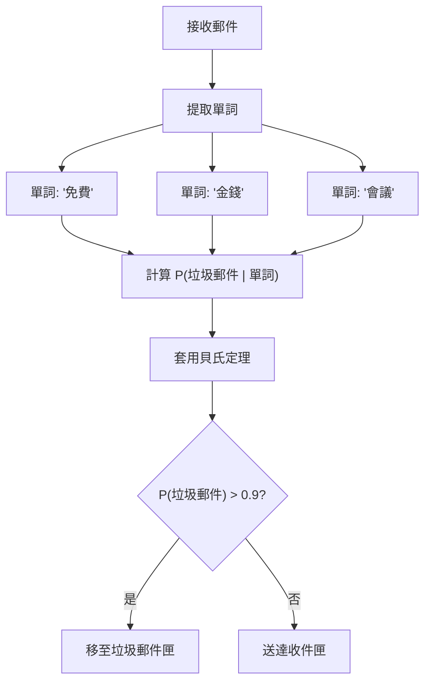
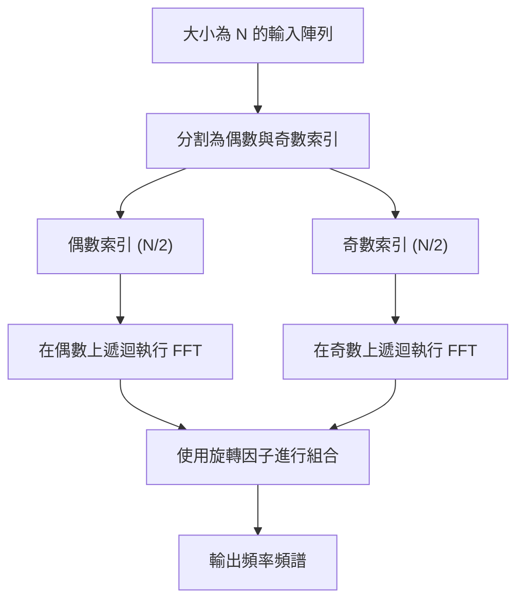
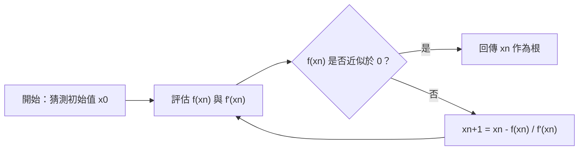
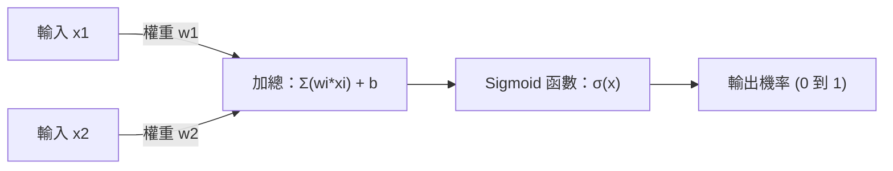

# 數學愛好者必看！對程式設計有用的10個優美數學公式

程式設計和數學，乍看之下可能像是完全不同的領域。程式設計是撰寫具體且具邏輯性程式碼的工作，而數學則是追求抽象且普遍真理的學問。然而，電腦科學的基礎中始終存在著數學。在演算法最佳化、資料科學、機器學習、電腦圖學，甚至是日常應用程式的背後，優美的數學公式都在安靜且強大地發揮作用。

本文中，我們精選了 10 個不僅在數學上優美，而且在程式設計和演算法的背景下也扮演著非常實用且重要角色的公式。我們將深入探討每個公式背後的數學背景，並透過具體的 Python 和 C++ 程式碼片段，詳細解說它們在程式設計現場的實際應用。

歡迎來到數學之美與程式設計實用性交會的世界。

---

## 1. 歐拉恆等式 (Euler's Identity)

### 公式的優美與概要
被譽為「人類的至寶」、「世界上最優美的數學公式」的歐拉恆等式。數學中 5 個最重要常數（自然對數的底數 $e$、虛數單位 $i$、圓周率 $\pi$、乘法單位元素 $1$、加法單位元素 $0$）被整合在一個簡單的等式中。

$$ e^{i\pi} + 1 = 0 $$

這個等式是將 $\theta = \pi$ 代入更一般的歐拉公式 $e^{i\theta} = \cos\theta + i\sin\theta$ 中推導出來的。

### 在程式設計中的應用
在程式設計，特別是在電腦圖學或遊戲開發中，歐拉公式是處理「旋轉」的非常強大的工具。二維空間中點的旋轉雖然也可以透過矩陣計算來完成，但使用複數會使計算變得極為簡單且直觀。由於複數平面上的旋轉只需乘以 $e^{i\theta}$ 即可實現，因此程式碼也變得簡潔。

### 實作範例 (C++)
以下是一個使用 C++ 標準函式庫 `<complex>`，將二維座標上的點旋轉指定角度（弧度）的程式。

```cpp
#include <iostream>
#include <complex>
#include <cmath>

// 為了將二維座標視為複數的型別別名
using Point2D = std::complex<double>;

// 將點以原點為中心旋轉 theta（弧度）的函式
Point2D rotatePoint(const Point2D& point, double theta) {
    // 根據歐拉公式，建立用於旋轉的複數 e^{i*theta}
    // 內部會變成 cos(theta) + i*sin(theta)
    Point2D rotation(std::cos(theta), std::sin(theta));
    
    // 透過複數乘法套用旋轉
    return point * rotation;
}

int main() {
    // 初始座標 (x=1.0, y=0.0)
    Point2D p(1.0, 0.0);
    
    // 旋轉 90 度（π/2 弧度）
    double theta = M_PI / 2.0;
    Point2D rotated_p = rotatePoint(p, theta);
    
    std::cout << "Original Point: (" << p.real() << ", " << p.imag() << ")\n";
    // 預期的輸出大約是 (0, 1)
    std::cout << "Rotated Point: (" << rotated_p.real() << ", " << rotated_p.imag() << ")\n";
    
    return 0;
}
```

**詳細解說**:
這種方法的優點在於可以將旋轉矩陣的計算（4 次乘法與 2 次加法）封裝為複數運算。此外，在三維空間中，會使用其擴展概念「四元數（Quaternion）」。透過使用四元數，可以避免歐拉角中發生的「萬向鎖（Gimbal Lock）」致命問題，並實現平滑的球面線性插值（Slerp）。

---

## 2. 泰勒展開式 (Taylor Series)

### 公式的優美與概要
泰勒展開式是一種將複雜函數（如三角函數或指數函數等）表示為無限延伸多項式之和的數學方法。函數 $f(x)$ 在某一點 $a$ 附近的泰勒展開式定義如下。

$$ f(x) = \sum_{n=0}^\infty \frac{f^{(n)}(a)}{n!}(x-a)^n $$

特別是當 $a=0$ 的情況，被稱為「麥克勞林展開式」。

### 在程式設計中的應用
電腦（CPU 或 FPU）本質上只能執行加法、減法、乘法、除法等四則運算。那麼，`sin(x)` 或 `exp(x)` 是如何計算出來的呢？現代處理器通常使用 CORDIC 演算法或切比雪夫近似等，但如果在軟體層級實作數學函數，或是為了效能而自行建立降低精度的快速近似函數時，泰勒展開式（或其變體）就會直接派上用場。

### 實作範例 (Python)
以下是使用麥克勞林展開式來近似計算正弦函數（Sine）的 Python 程式碼。

$$ \sin(x) \approx x - \frac{x^3}{3!} + \frac{x^5}{5!} - \frac{x^7}{7!} + \dots $$

```python
import math

def taylor_sin(x, terms=10):
    """
    使用泰勒展開式（麥克勞林展開式）來近似計算 sin(x)。
    
    :param x: 角度（弧度）
    :param terms: 計算的項數（越多精度越高）
    :return: 近似的 sin(x) 值
    """
    # 利用週期性將 x 正規化到 -π 到 π 的範圍（為了提高精度）
    x = (x + math.pi) % (2 * math.pi) - math.pi
    
    result = 0.0
    for n in range(terms):
        # 僅使用奇數項: 2n + 1
        power = 2 * n + 1
        
        # 符號逐項反轉: (-1)^n
        sign = (-1) ** n
        
        # 計算階乘
        fact = math.factorial(power)
        
        # 評估表達式並相加
        term = sign * (x ** power) / fact
        result += term
        
    return result

# 測試
angle = math.radians(45) # 45度 = π/4
print(f"Math library sin: {math.sin(angle)}")
print(f"Taylor series sin: {taylor_sin(angle, terms=5)}")
```

**詳細解說**:
在上述程式碼中，我們將輸入值 `x` 正規化至 $[-\pi, \pi]$ 的範圍內。這是因為泰勒展開式具有越遠離展開中心（這裡為 0），誤差增加得越快的特性（截斷誤差）。由於在程式設計中不可能進行無限的計算，因此必須在有限的 `terms` 處截斷計算，而管理由此產生的「捨入誤差」和「截斷誤差」之間的權衡，是數值計算程式設計的核心。

---

## 3. 貝氏定理 (Bayes' Theorem)

### 公式的優美與概要
貝氏定理是一個根據與某個事件相關的先驗知識（先驗機率），來更新該事件發生機率（後驗機率）的定理。它是機率論與統計學中最重要的公式之一。

$$ P(A|B) = \frac{P(B|A)P(A)}{P(B)} $$

這裡，$P(A|B)$ 表示在事件 B 已經發生的條件下，事件 A 發生的機率（後驗機率）。

### 在程式設計中的應用
在機器學習和資料科學領域中，被廣泛應用於「單純貝氏分類器（Naive Bayes Classifier）」。典型的應用例子是垃圾郵件過濾。它會根據過去的資料動態計算：「如果這封郵件包含『免費』這個詞，那它是垃圾郵件的機率是多少？」。



### 實作範例 (Python)
以下是展示垃圾郵件過濾器基本邏輯的程式碼。

```python
def calculate_spam_probability(
    prob_spam, 
    prob_word_given_spam, 
    prob_word_given_ham
):
    """
    使用貝氏定理計算包含某個單詞的郵件是垃圾郵件的機率。
    
    :param prob_spam: P(Spam) - 郵件是垃圾郵件的先驗機率
    :param prob_word_given_spam: P(Word|Spam) - 垃圾郵件中包含該單詞的機率
    :param prob_word_given_ham: P(Word|Ham) - 正常郵件中包含該單詞的機率
    :return: P(Spam|Word) - 包含該單詞的情況下為垃圾郵件的機率
    """
    # 正常郵件的先驗機率 P(Ham) = 1 - P(Spam)
    prob_ham = 1.0 - prob_spam
    
    # 所有郵件中該單詞出現的機率 P(Word) = P(Word|Spam)P(Spam) + P(Word|Ham)P(Ham)
    # 這是根據全機率定理而來
    prob_word = (prob_word_given_spam * prob_spam) + (prob_word_given_ham * prob_ham)
    
    # 貝氏定理 P(Spam|Word) = P(Word|Spam) * P(Spam) / P(Word)
    if prob_word == 0:
        return 0.0 # 避免除以零
        
    prob_spam_given_word = (prob_word_given_spam * prob_spam) / prob_word
    return prob_spam_given_word

# 範例：「中獎」這個單詞的機率
# 過去資料：所有郵件的 20% 是垃圾郵件
p_spam = 0.2
# 垃圾郵件的 80% 包含「中獎」
p_win_given_spam = 0.8
# 正常郵件的 1% 包含「中獎」
p_win_given_ham = 0.01

result = calculate_spam_probability(p_spam, p_win_given_spam, p_win_given_ham)
print(f"包含「中獎」的郵件為垃圾郵件的機率: {result:.2%}")
```

**詳細解說**:
在實際實作（單純貝氏分類器）中，會將多個單詞的機率相乘來計算。然而，如果將機率（0 到 1 之間的值）相乘數千次，由於電腦浮點數表示的極限（下溢，Underflow），值會變成零。因此在實際的程式設計中，將機率乘積轉換為「對數和」的方法（`log(a * b) = log(a) + log(b)`）是被廣泛使用的必備技巧。

---

## 4. 夏農熵 (Shannon Entropy)

### 公式的優美與概要
由資訊理論之父克勞德·夏農 (Claude Shannon) 定義的「熵」，是將資訊源所具備的「不確定性」、「混亂度」或「平均資訊量」加以量化的數學公式。

$$ H(X) = - \sum_{i=1}^n P(x_i) \log_2 P(x_i) $$

### 在程式設計中的應用
熵在檔案的資料壓縮（霍夫曼編碼或 ZIP 壓縮演算法的理論極限）、密碼學中的亂數強度評估，以及機器學習中的「決策樹（Decision Trees）」演算法（如 ID3 或 C4.5）中是不可或缺的存在。在建構決策樹時，我們會找出能讓資料分割時熵減少量（資訊增益：Information Gain）最大的特徵值。

### 實作範例 (Python)
計算字串（資料集）的熵並評估其資訊量的函式。

```python
import math
from collections import Counter

def calculate_entropy(data):
    """
    計算給定資料集（字串或串列）的夏農熵。
    """
    if not data:
        return 0.0
        
    # 計算各元素的出現次數
    counts = Counter(data)
    total_len = len(data)
    
    entropy = 0.0
    for element, count in counts.items():
        # 出現機率 P(x_i)
        probability = count / total_len
        
        # - P(x_i) * log2(P(x_i))
        entropy -= probability * math.log2(probability)
        
    return entropy

# 測試
# 所有的字元都相同時，不確定性為 0
data_deterministic = "AAAAAAAAAA" 
# 隨機字元的情況下，不確定性很高
data_random = "ABACBCBACB"

print(f"Entropy of '{data_deterministic}': {calculate_entropy(data_deterministic)}")
print(f"Entropy of '{data_random}': {calculate_entropy(data_random)}")
```

**詳細解說**:
熵的單位是「位元（bits）」。如果熵為 `1.5`，意味著為了表達該資料，平均每個元素至少需要 1.5 位元。在程式設計實務中，它經常被計算用來作為評估壓縮演算法效率的基準，或是機器學習模型特徵選擇的重要指標。

---

## 5. 快速傅立葉變換 (Fast Fourier Transform - FFT)

### 公式的優美與概要
將時域訊號轉換為頻域訊號的離散傅立葉變換（DFT）。其數學公式如下。

$$ X_k = \sum_{n=0}^{N-1} x_n e^{-i 2\pi k n / N} $$

如果用直觀的方式計算這個 DFT，時間複雜度為 $O(N^2)$，隨著資料量增加，計算會變得極度緩慢。透過分治法將其戲劇性地加速到 $O(N \log N)$ 的演算法，就是「快速傅立葉變換（FFT）」。它被列為 20 世紀最重要的十大演算法之一。



### 在程式設計中的應用
FFT 是支撐現代社會不可或缺的技術。從語音辨識（Siri 或 Alexa）、MP3 或 JPEG/MPEG 的資料壓縮、LTE 與 Wi-Fi 等數位通訊，乃至於極巨大整數的乘法（Schönhage-Strassen 演算法），它都在各個地方發揮作用。

### 實作範例 (Python)
這是一個遞迴式 Cooley-Tukey 型演算法的簡單實作範例。（※實務上會使用由 C 或組合語言極限最佳化過的 `FFTW` 函式庫或 `numpy.fft`）

```python
import cmath

def fft(x):
    """
    計算一維快速傅立葉變換 (FFT)（Cooley-Tukey 法）。
    輸入列表的長度 N 必須是 2 的次方。
    """
    N = len(x)
    
    # 基本情況
    if N <= 1:
        return x
        
    # 分割為偶數與奇數位置的元素 (Divide)
    even = fft(x[0::2])
    odd = fft(x[1::2])
    
    # 組合結果 (Conquer)
    T = [cmath.exp(-2j * cmath.pi * k / N) * odd[k] for k in range(N // 2)]
    
    # 利用對稱性減少計算量
    return [even[k] + T[k] for k in range(N // 2)] + \
           [even[k] - T[k] for k in range(N // 2)]

# 測試：簡單訊號
signal = [1.0, 1.0, 1.0, 1.0, 0.0, 0.0, 0.0, 0.0]
spectrum = fft(signal)

print("Frequency Spectrum (Magnitude):")
for k, val in enumerate(spectrum):
    # 計算絕對值（振幅）
    print(f"Freq {k}: {abs(val):.3f}")
```

**詳細解說**:
這個演算法的關鍵在於活用了被稱為「旋轉因子（Twiddle factor）」的複數對稱性與週期性。這省去了重複計算的浪費，在 $N=1024$ 的情況下，將原本需要 $1,048,576$ 次的運算，大幅減少到約 $10,240$ 次。可以說是數學與演算法結合所創造出的奇蹟。

---

## 6. 半正矢公式 (Haversine Formula)

### 公式的優美與概要
這是在地球表面等球面上，計算兩點間最短距離（大圓距離）的公式。

$$ a = \sin^2\left(\frac{\Delta\phi}{2}\right) + \cos\phi_1 \cos\phi_2 \sin^2\left(\frac{\Delta\lambda}{2}\right) $$
$$ c = 2\cdot \text{atan2}\left(\sqrt{a}, \sqrt{1-a}\right) $$
$$ d = R \cdot c $$

（這裡 $\phi$ 為緯度，$\lambda$ 為經度，$R$ 為地球半徑）

### 在程式設計中的應用
在 GPS 追蹤應用程式，或是如 Uber、Pokemon GO 等基於位置資訊的服務中，這是計算兩個經緯度座標之間距離的必備數學公式。因為使用畢氏定理計算直線距離無法考慮到地球的弧度，所以在長距離時會產生很大的誤差。

### 實作範例 (Python)
這是一個接收兩個座標（緯度、經度），並回傳其距離（公里）的函式。

```python
import math

def haversine_distance(lat1, lon1, lat2, lon2):
    """
    使用半正矢公式計算兩點間的大圓距離。
    """
    # 地球的平均半徑 (公里)
    R = 6371.0 
    
    # 將緯度、經度從度數轉換為弧度
    phi1, phi2 = math.radians(lat1), math.radians(lat2)
    delta_phi = math.radians(lat2 - lat1)
    delta_lambda = math.radians(lon2 - lon1)
    
    # 半正矢計算
    a = math.sin(delta_phi / 2.0)**2 + \
        math.cos(phi1) * math.cos(phi2) * \
        math.sin(delta_lambda / 2.0)**2
        
    c = 2 * math.atan2(math.sqrt(a), math.sqrt(1 - a))
    
    # 計算距離
    distance = R * c
    return distance

# 從東京鐵塔 (35.6586, 139.7454) 到自由女神像 (40.6892, -74.0445) 的距離
tokyo = (35.6586, 139.7454)
ny = (40.6892, -74.0445)

dist = haversine_distance(tokyo[0], tokyo[1], ny[0], ny[1])
print(f"東京鐵塔到自由女神像的距離: 約 {dist:.2f} km")
```

**詳細解說**:
雖然也有使用球面三角學餘弦定理的方法，但當兩點間的距離非常近（例如數公尺等級）時，容易發生浮點數計算精度上的「災難性抵消（Catastrophic cancellation）」。半正矢公式因為使用了 `sin^2`，所以即便是微小距離也能進行數值穩定的計算，這是程式設計上的一大優勢。如果需要更高精度，則會使用將地球視為橢球體的文森特公式（Vincenty's formulae）。

---

## 7. 牛頓-拉弗森方法 (Newton-Raphson Method)

### 公式的優美與概要
這是一種極強大的求根演算法，它使用切線來反覆尋找方程式 $f(x) = 0$ 的解（根）。

$$ x_{n+1} = x_n - \frac{f(x_n)}{f'(x_n)} $$

它利用目前位置 $x_n$ 的函數值 $f(x_n)$ 及其斜率（導數）$f'(x_n)$，來推測下一個應該探索的更精確位置 $x_{n+1}$。



### 在程式設計中的應用
它被用於圖形引擎的彩現、物理模擬中的碰撞檢測以及最佳化問題等。值得一提的是，傳奇 FPS 遊戲《雷神之鎚 III 競技場 (Quake III Arena)》原始碼中內嵌的「快速反平方根 (Fast Inverse Square Root)」。這是一種僅套用一次牛頓法，就能極速計算 $1/\sqrt{x}$ 的駭客技巧，對於向量正規化來說不可或缺。

### 實作範例 (C++)
這裡示範一個容易理解、使用牛頓法計算標準平方根 $\sqrt{N}$（即 $x^2 - N = 0$ 的解）的例子。此時 $f(x) = x^2 - N$, $f'(x) = 2x$。

```cpp
#include <iostream>
#include <cmath>

double newton_sqrt(double N, double tolerance = 1e-7) {
    if (N < 0) return NAN; // 負數的平方根為 NaN
    if (N == 0) return 0;
    
    // 初始猜測值（從 N 自身開始）
    double x = N; 
    
    while (true) {
        // 計算下個猜測值: x_new = x - (x^2 - N) / (2x) = (x + N/x) / 2
        double x_new = 0.5 * (x + N / x);
        
        // 如果變化量小於容許誤差 (tolerance)，則視為收斂
        if (std::abs(x - x_new) < tolerance) {
            break;
        }
        x = x_new;
    }
    
    return x;
}

int main() {
    double number = 612.0;
    std::cout << "Square root of " << number << " is: " << newton_sqrt(number) << "\n";
    return 0;
}
```

**詳細解說**:
牛頓法最大的魅力在於，如果條件具備，它會呈現「二次收斂（Quadratic convergence）」。這意味著每次反覆運算，正確的位數大約會變成兩倍，收斂速度驚人。考慮到二分搜尋法（Binary Search）是線性收斂，就能了解利用導數（微小斜率）資訊是多麼強大。《雷神之鎚 III》的駭客技巧，是透過利用位元運算的魔法數字 `0x5f3759df` 去破解 IEEE 754 浮點數的結構，以驚人的精確度導出牛頓法的初始值。

---

## 8. 貝茲曲線 (Bézier Curves)

### 公式的優美與概要
這是一種使用多個控制點（Control Points）來定義平滑曲線的參數方程式。最常用的三次貝茲曲線（Cubic Bézier Curve）擁有 4 個點 $P_0, P_1, P_2, P_3$，並透過參數 $t \ (0 \le t \le 1)$ 來決定曲線上的座標 $B(t)$。

$$ B(t) = (1-t)^3 P_0 + 3(1-t)^2 t P_1 + 3(1-t) t^2 P_2 + t^3 P_3 $$

### 在程式設計中的應用
貝茲曲線是電腦圖學的基礎。Adobe Illustrator 等向量繪圖工具、字型（TrueType 或 OpenType）的彩現、CSS 的 `cubic-bezier()` 轉場和動畫的緩動函數、遊戲內攝影機路徑的控制等，在程式中繪製任何「平滑的動作或形狀」時都會被使用。

### 實作範例 (Python)
由 4 個控制點生成三次貝茲曲線上點群的程式碼。

```python
def cubic_bezier(p0, p1, p2, p3, steps=10):
    """
    生成三次貝茲曲線上的座標串列。
    p0, p1, p2, p3 為 (x, y) 格式的元組 (tuple)。
    steps 是將曲線分割為多少線段。
    """
    curve_points = []
    
    for i in range(steps + 1):
        # 參數 t 從 0.0 變化至 1.0
        t = i / steps
        
        # 計算構成方程式的係數
        u = 1 - t
        tt = t * t
        uu = u * u
        uuu = uu * u
        ttt = tt * t
        
        # 對各個點計算 x 座標與 y 座標
        x = (uuu * p0[0]) + \
            (3 * uu * t * p1[0]) + \
            (3 * u * tt * p2[0]) + \
            (ttt * p3[0])
            
        y = (uuu * p0[1]) + \
            (3 * uu * t * p1[1]) + \
            (3 * u * tt * p2[1]) + \
            (ttt * p3[1])
            
        curve_points.append((x, y))
        
    return curve_points

# 起點、控制點1、控制點2、終點
p0 = (0, 0)
p1 = (5, 10)
p2 = (15, 10)
p3 = (20, 0)

points = cubic_bezier(p0, p1, p2, p3, steps=5)
for i, pt in enumerate(points):
    print(f"t={i/5:.1f} -> Point({pt[0]:.2f}, {pt[1]:.2f})")
```

**詳細解說**:
這個公式是遞迴套用線性插值（Lerp: Linear Interpolation）的「德卡斯特里奧演算法（De Casteljau's algorithm）」展開後的結果。使用多項式計算（伯恩斯坦多項式）直接求解。在程式設計中，曲線是被近似為無數「微小直線」的集合來描繪的。因此，透過調整 $t$ 的解析度（steps），可以控制效能與繪圖品質的平衡。

---

## 9. Sigmoid 函數 (Sigmoid Function)

### 公式的優美與概要
這是一種平滑的 S 型函數，無論輸入任何實數 $x \ ( -\infty < x < \infty )$，都必定會將其壓縮（擠壓）至 $0$ 到 $1$ 之間的值。

$$ \sigma(x) = \frac{1}{1 + e^{-x}} $$

### 在程式設計中的應用
在邏輯斯迴歸（Logistic Regression）以及神經網路（深度學習）中，它作為「激勵函數（Activation Function）」在歷史上扮演了極為重要的角色。由於輸出落在 0 到 1 的範圍內，因此最大的優點是可以將其結果解釋為「機率」。



### 實作範例 (Python)
對輸入的陣列（張量，Tensor）套用 Sigmoid 函數的程式碼。

```python
import math

def sigmoid(x):
    """針對單一值的 Sigmoid 計算"""
    # 為防止 math.exp(-x) 發生溢位，常常會限制輸入值
    # 這是為了簡化的標準實作
    if x >= 0:
        return 1.0 / (1.0 + math.exp(-x))
    else:
        # 應對 x 為巨大負數時溢位的對策
        return math.exp(x) / (1.0 + math.exp(x))

def apply_sigmoid(array):
    """對陣列中的所有元素套用 Sigmoid 函數"""
    return [sigmoid(x) for x in array]

# 神經網路輸出層的原始資料（Logits）
logits = [-5.0, -1.0, 0.0, 1.0, 5.0]
probabilities = apply_sigmoid(logits)

for val, prob in zip(logits, probabilities):
    print(f"Input: {val:4.1f} -> Probability: {prob:.4f}")
```

**詳細解說**:
上述程式碼中分出 `x >= 0` 和其他狀況的條件分支，是為了防止程式設計中特有的「溢位（Overflow）」問題。這是數值計算上的一種技巧，為了避免在 $x = -1000$ 等情況下，程式試圖計算 $e^{1000}$ 而導致崩潰（或者回傳 Inf）。目前，在深度學習的隱藏層中，考量到計算速度與梯度消失的問題，ReLU（$f(x) = \max(0, x)$）已經成為主流；但在二元分類的輸出層中，Sigmoid 函數依然保有不可動搖的地位。

---

## 10. 歐幾里得距離與畢氏定理 (Euclidean Distance & Pythagorean Theorem)

### 公式的優美與概要
這是自古希臘傳承下來的幾何學基礎，也是定義 $n$ 維空間中兩點間直線距離的公式。在二維空間中，它本身就是畢氏定理（$a^2 + b^2 = c^2$）。

三維空間中點 $P(x_1, y_1, z_1)$ 和 $Q(x_2, y_2, z_2)$ 之間的歐幾里得距離 $d$ 表示如下。

$$ d = \sqrt{(x_2-x_1)^2 + (y_2-y_1)^2 + (z_2-z_1)^2} $$

### 在程式設計中的應用
這是一切遊戲開發、物理引擎，以及機器學習中「K 近鄰演算法（K-Nearest Neighbors）」和分群演算法（K-Means）的核心計算。在遊戲中，為了進行角色間的碰撞檢測（Bounding Circle / Sphere Collision）等，每幀（Frame）都會被計算數百萬次。

### 實作範例 (C++)
這是一個判定兩個圓（球）是否發生碰撞的最佳化程式碼。

```cpp
#include <iostream>
#include <cmath>

struct Circle {
    double x, y; // 中心座標
    double radius; // 半徑
};

// 判定兩個圓是否發生碰撞的函式
bool isColliding(const Circle& a, const Circle& b) {
    // x 座標與 y 座標的差（Delta）
    double dx = b.x - a.x;
    double dy = b.y - a.y;
    
    // 計算距離的「平方」
    double distanceSquared = (dx * dx) + (dy * dy);
    
    // 計算半徑總和的「平方」
    double radiiSum = a.radius + b.radius;
    double radiiSumSquared = radiiSum * radiiSum;
    
    // 比較距離的平方與半徑總和的平方
    return distanceSquared <= radiiSumSquared;
}

int main() {
    Circle player = {0.0, 0.0, 5.0};
    Circle enemy1 = {8.0, 0.0, 4.0}; // 距離 8，半徑和 9 -> 碰撞
    Circle enemy2 = {10.0, 10.0, 2.0}; // 距離約 14.1，半徑和 7 -> 未碰撞
    
    std::cout << "Collision with enemy1: " << (isColliding(player, enemy1) ? "Yes" : "No") << "\n";
    std::cout << "Collision with enemy2: " << (isColliding(player, enemy2) ? "Yes" : "No") << "\n";
    
    return 0;
}
```

**詳細解說**:
如果完全依照數學公式計算，最後需要開平方根 $\sqrt{\cdot}$，但在程式設計中，呼叫 `sqrt()` 函式對 CPU 來說是極其繁重的處理（消耗較多的時脈週期）。因此，如果只是比較距離，**保持兩邊平方的狀態直接比較**（`distanceSquared <= radiiSumSquared`）是遊戲程式設計中的慣用手法。像這樣利用數學等式或不等式的性質來降低計算負載的最佳化，正是演算法設計的醍醐味。

---

## 總結

您覺得如何呢？從歐拉恆等式到畢氏定理，這 10 個公式不僅僅是教科書上的理論概念。在我們平時撰寫的程式碼背後，它們作為「心臟部分」不斷跳動，藉以壓縮資料、讓機器學習模型進行預測、繪製流暢的動畫，並實現高速的搜尋。

理解數學背景，是從單純呼叫現成函式庫（如 `math.sin` 或 `numpy.fft`）的編碼員，升級為能理解其內部結構並發揮出極限的工程師所不可或缺的一步。下次寫程式的時候，不妨發揮一點想像力，想想其背後有哪些優美的數學公式在運作吧。

**Happy Coding and Math!**
