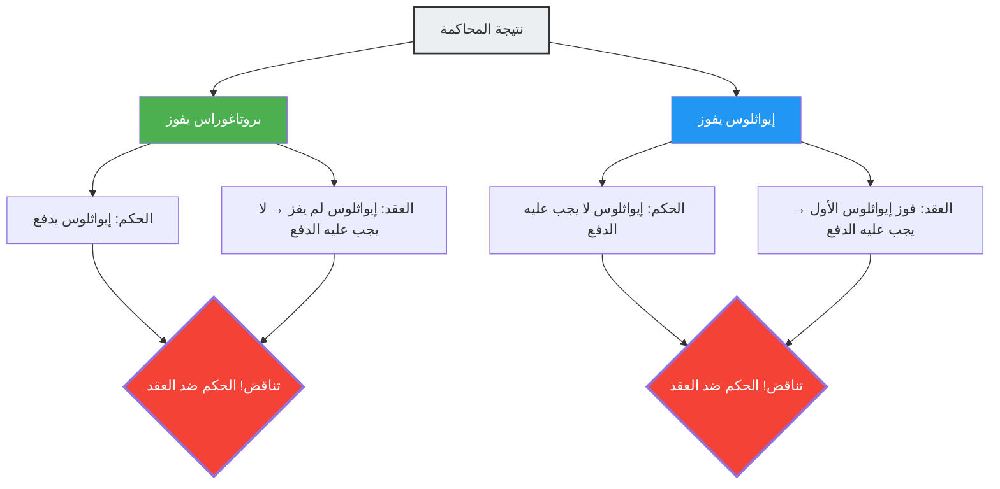

في اليونان القديمة، أصبح شاب يدعى إيواثلوس تلميذًا لبروتاغوراس، أعظم السوفسطائيين (معلمي فن الخطابة). تم إبرام عقد بينهما بشأن دفع الرسوم الدراسية على النحو التالي:

> **تفاصيل العقد:**
> بعد أن يكمل إيواثلوس دورة الخطابة بالكامل، يجب عليه دفع المبلغ المتبقي من الرسوم الدراسية لبروتاغوراس **في اللحظة التي يفوز فيها بأول محاكمة له**.

كان إيواثلوس طالبًا متميزًا، وأكمل دورة الخطابة بنجاح باهر.
لكن بعد التخرج، ولسبب ما، رفض تولي أي قضية في المحكمة. إذا لم يذهب إلى المحكمة، فلن يتحقق شرط "الفوز بأول محاكمة" أبدًا، وبالتالي لن يضطر إلى دفع الرسوم الدراسية.

نفد صبر بروتاغوراس، فرفع دعوى قضائية ضد إيواثلوس في المحكمة.
مطالبًا إياه: "ادفع الرسوم الدراسية".

ومن هنا تبدأ متاهة المنطق.

## منطق المعلم بروتاغوراس

جادل بروتاغوراس في المحكمة على النحو التالي:

"أيها القاضي، سأفوز بغض النظر عما سيحدث.
- إذا **فزت أنا** بهذه المحاكمة، فبموجب قرار المحكمة يجب على إيواثلوس أن يدفع لي الرسوم الدراسية.
- وإذا **خسرت أنا** هذه المحاكمة، فهذا يعني أن إيواثلوس قد "فاز بأول محاكمة له". وهذا يعني تحقق شرط العقد، وبموجب العقد يجب عليه دفع الرسوم الدراسية.

في كلتا الحالتين، هو ملزم بدفع الرسوم الدراسية."

## منطق التلميذ إيواثلوس

في المقابل، لم يستسلم إيواثلوس وكان له رده الخاص.

"أيها القاضي، سأفوز أنا بغض النظر عما سيحدث.
- إذا **فزت أنا** بهذه المحاكمة، فبموجب قرار المحكمة لست مضطرًا لدفع الرسوم الدراسية.
- وإذا **خسرت أنا** هذه المحاكمة، فهذا يعني أنني لم "أفز بأول محاكمة" بعد. أي أن شرط العقد لم يتحقق، وبموجب العقد، لست ملزمًا بدفع الرسوم الدراسية.

في كلتا الحالتين، لست مضطرًا لدفع الرسوم الدراسية."

## لماذا يحدث هذا التناقض؟

السبب الجذري لهذه المفارقة هو أن **نظامين مختلفين للقواعد (القانون والعقد) يصدران أحكامًا تتناقض مع بعضها البعض**.

- **قاعدة القانون**: اتبع حكم المحكمة.
- **قاعدة العقد**: اتبع شرط "ادفع إذا فزت بأول محاكمة".

عادةً، يعمل كل من القانون والعقد كمجالين مستقلين، ولكن نظرًا لأن بروتاغوراس جعل "دفع الرسوم الدراسية" هو نقطة النزاع في المحاكمة، فقد أثرت نتيجة هذه المحاكمة نفسها على شرط العقد، مما أوقع النظامين في حلقة من المرجعية الذاتية (Self-reference).

## إجابات علماء القانون

قدم الحقوقي الروماني القديم أولوس جيليوس الحل التالي لهذه المشكلة.

"يجب على المحكمة أن تصدر حكمًا لصالح إيواثلوس (لا يُلزم بالدفع). وذلك لأن شرط العقد لم يتحقق بعد، وهذا واقع. ومع ذلك، بعد هذا الحكم، يمكن لبروتاغوراس مقاضاة إيواثلوس **مرة أخرى**. لأنه بفوز إيواثلوس في المحاكمة الأولى، يكون شرط العقد قد تحقق. وفي المحاكمة الثانية، سيفوز بروتاغوراس."

بعبارة أخرى، هذه الإجابة تشير إلى أن محاولة حل المفارقة "في محاكمة واحدة في وقت واحد" تؤدي إلى تناقض، ولكن معالجتها "على مرحلتين" يمكن أن تزيل هذا التناقض.

## الارتباط بمفارقة المرجعية الذاتية

تحتوي مفارقة بروتاغوراس على **بنية مرجعية ذاتية** مشابهة لـ "مفارقة الكذاب" ("هذه الجملة كاذبة") و "مفارقة راسل". حيث تؤثر قضية معينة (نتيجة المحاكمة) على الشروط (تحقق العقد) التي تحدد حقيقة أو زيف القضية نفسها.

هذا النوع من المفارقات مرتبط ارتباطًا وثيقًا بمشاكل تبرز الحدود الأساسية للمنطق والحوسبة في علوم الكمبيوتر الحديثة، مثل "مشكلة التوقف" (لا يمكن إنشاء برنامج يحدد ما إذا كان برنامج آخر سيتوقف أم لا) ومبرهنات عدم الاكتمال لغودل.

إن مفارقة بروتاغوراس هي تحذير يعود تاريخه إلى 2400 عام يعلمنا أن أنظمة القواعد التي صنعها الإنسان (كالقوانين والعقود) يمكن أن تنهار من الداخل بسبب مرجعية ذاتية ماكرة.
