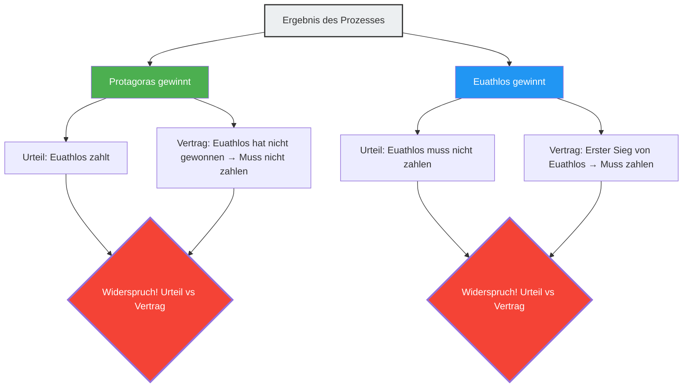

---
title: "Meister und Schüler, ein Prozess, der sich in jedem Fall widerspricht: Das Paradoxon des Protagoras"
description: "Ein juristischer Streit zwischen Meister und Schüler über die Zahlungsbedingungen von Studiengebühren. Ein juristisches Paradoxon aus dem antiken Griechenland, bei dem die Logik widersprüchlich wird, egal wer gewinnt oder verliert."
date: 2026-09-10T21:00:00+09:00
draft: false
slug: "paradox-of-the-court"
image: "img/paradox_of_court.jpg"
math: true
mermaid: true
categories: ["Mathematische Paradoxien", "Philosophie", "Logik"]
tags: ["Paradoxon", "Selbstreferenz", "Recht", "Protagoras", "Logik"]
---

Im antiken Griechenland wurde ein junger Mann namens Euathlos Schüler von Protagoras, dem größten der Sophisten (Lehrer der Rhetorik). Zwischen den beiden wurde folgende Vereinbarung über die Zahlung der Studiengebühren getroffen:

> **Vertragsinhalt:**
> Nachdem Euathlos den gesamten Kurs in Rhetorik abgeschlossen hat, wird er den Restbetrag der Studiengebühren an Protagoras zahlen, **sobald er seinen ersten Prozess gewonnen hat**.

Euathlos war ein hervorragender Schüler und schloss den gesamten Rhetorikkurs erfolgreich ab.
Nach seinem Abschluss übernahm er jedoch aus irgendeinem Grund keinen einzigen Fall. Da er nicht vor Gericht erschien, konnte die Bedingung "seinen ersten Prozess gewinnen" niemals erfüllt werden, sodass er die Studiengebühren nicht zahlen musste.

Der verärgerte Protagoras verklagte Euathlos vor Gericht.
"Zahle die Studiengebühren", forderte er.

Und hier beginnt das Labyrinth der Logik.

## Die Logik des Meisters Protagoras

Protagoras argumentierte vor Gericht wie folgt:

"Richter, wie auch immer es ausgeht, ich gewinne.
- Wenn **ich** in diesem Prozess **gewinne**, muss Euathlos mir laut Gerichtsurteil die Studiengebühren zahlen.
- Wenn **ich** in diesem Prozess **verliere**, bedeutet das für Euathlos, dass er 'seinen ersten Prozess gewonnen hat'. Das heißt, die Bedingung des Vertrags ist erfüllt, und er muss die Studiengebühren vertragsgemäß zahlen.

In beiden Fällen ist er verpflichtet, die Studiengebühren zu zahlen."

## Die Logik des Schülers Euathlos

Dagegen gab sich Euathlos nicht geschlagen.

"Richter, wie auch immer es ausgeht, ich gewinne.
- Wenn **ich** in diesem Prozess **gewinne**, muss ich laut Gerichtsurteil keine Studiengebühren zahlen.
- Wenn **ich** in diesem Prozess **verliere**, habe ich 'meinen ersten Prozess' noch nicht 'gewonnen'. Das heißt, da die Vertragsbedingung nicht erfüllt ist, bin ich vertraglich nicht verpflichtet, die Studiengebühren zu zahlen.

In beiden Fällen muss ich die Studiengebühren nicht zahlen."

## Warum entsteht ein Widerspruch?

Die Grundursache dieses Paradoxons liegt darin, dass **zwei unterschiedliche Regelsysteme (Recht und Vertrag) einander widersprechende Urteile fällen**.

- **Regel des Rechts**: Folge dem Gerichtsurteil.
- **Regel des Vertrags**: Folge der Bedingung "Zahle, wenn du den ersten Prozess gewinnst".

Normalerweise funktionieren Recht und Vertrag als jeweils unabhängige Domänen, aber indem Protagoras die "Zahlung der Studiengebühren" zum Streitpunkt des Prozesses machte, beeinflusste das Ergebnis dieses Prozesses selbst die Bedingungen des Vertrags, wodurch die beiden Systeme in eine selbstreferenzielle Schleife gerieten.

## Die Antwort der Rechtsgelehrten

Der antike römische Rechtsgelehrte Aulus Gellius bot folgende Lösung für dieses Problem an:

"Das Gericht sollte ein Urteil zugunsten von Euathlos fällen (keine Zahlung erforderlich), weil es eine Tatsache ist, dass die Vertragsbedingung noch nicht erfüllt wurde. Nach diesem Urteil kann Protagoras Euathlos jedoch **erneut** verklagen, da der Sieg von Euathlos im ersten Prozess die Bedingung des Vertrags erfüllt hat. Im zweiten Prozess wird Protagoras gewinnen."

Mit anderen Worten: Wenn man versucht, das Paradoxon "in einem einzigen Prozess gleichzeitig zu lösen", entsteht ein Widerspruch, aber wenn man es "in zwei Schritten" abhandelt, kann der Widerspruch aufgelöst werden, so diese Antwort.

## Verbindung zum Paradoxon der Selbstreferenz

Das Paradoxon des Protagoras hat dieselbe **selbstreferenzielle Struktur** wie das "Lügner-Paradoxon ('Dieser Satz ist falsch')" oder das "Russellsche Paradoxon". Eine bestimmte Aussage (der Ausgang des Prozesses) beeinflusst die Bedingungen (Erfüllung des Vertrags), die ihren eigenen Wahrheitswert bestimmen.

Diese Art von Paradoxon steht in engem Zusammenhang mit Problemen, die grundlegende Grenzen von Logik und Berechnung aufzeigen, wie dem "Halteproblem" in der modernen Informatik (es kann kein Programm geschrieben werden, das entscheidet, ob ein bestimmtes Programm anhält oder nicht) oder dem Unvollständigkeitssatz von Gödel.

Das Paradoxon des Protagoras ist eine 2400 Jahre alte Warnung, die uns lehrt, dass von Menschen geschaffene Regelsysteme (Gesetze und Verträge) durch geschickte Selbstreferenz von innen heraus zusammenbrechen können.
