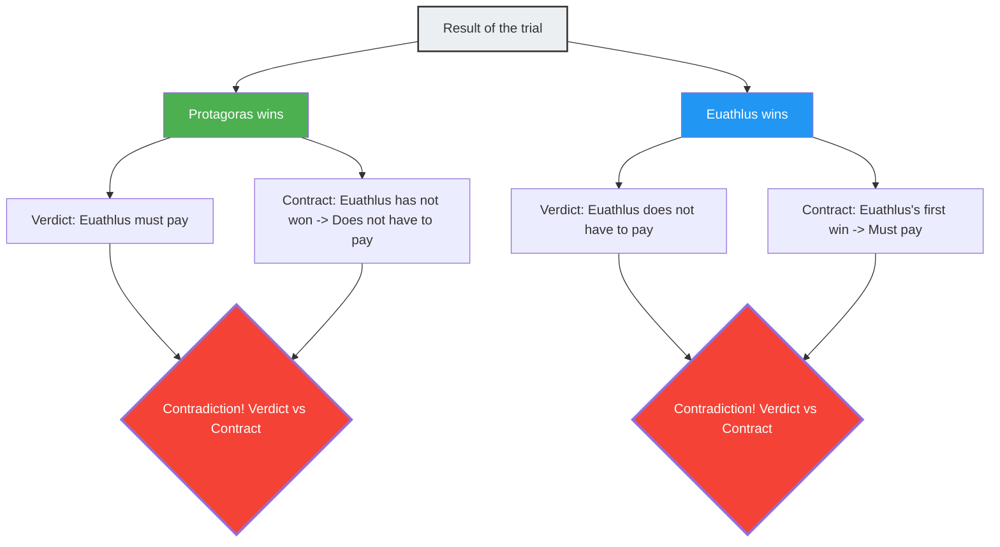

---
title: "The Master and the Student, A Contradictory Trial No Matter Who Wins: Paradox of the Court"
description: "A legal dispute between master and student over tuition payment conditions. An ancient Greek legal paradox where logic contradicts itself regardless of who wins or loses."
date: 2026-09-10T21:00:00+09:00
draft: false
slug: "paradox-of-the-court"
image: "img/paradox_of_court.jpg"
math: true
mermaid: true
categories: ["Math Paradoxes", "Philosophy", "Logic"]
tags: ["Paradox", "Self-reference", "Law", "Protagoras", "Logic"]
---

In ancient Greece, a young man named Euathlus became a student of Protagoras, the greatest of the Sophists (teachers of rhetoric). The two entered into the following contract regarding the payment of tuition fees.

> **Contract Terms:**
> After completing the entire course in rhetoric, Euathlus will pay the remaining balance of the tuition to Protagoras **at the moment he wins his first court case**.

Euathlus was an excellent student and successfully completed the entire rhetoric course.
However, after completing it, he refused to take on any court cases for some reason. If he never went to court, the condition of "winning his first court case" would never be met, meaning he would not have to pay the tuition.

Exasperated, Protagoras sued Euathlus in court.
"Pay the tuition," he demanded.

And from here, a labyrinth of logic begins.

## The Logic of the Master, Protagoras

Protagoras argued in court as follows:

"Oh judge, no matter what happens, I win.
- If **I win** this case, by the court's verdict, Euathlus must pay me the tuition.
- If **I lose** this case, it means Euathlus has 'won his first court case.' In other words, the terms of the contract have been fulfilled, and he must pay the tuition according to the contract.

In either case, he has an obligation to pay the tuition."

## The Logic of the Student, Euathlus

In response, Euathlus also held his ground:

"Oh judge, no matter what happens, I win.
- If **I win** this case, by the court's verdict, I do not have to pay the tuition.
- If **I lose** this case, I still have not 'won my first court case.' In other words, because the terms of the contract have not been fulfilled, contractually, I have no obligation to pay the tuition.

In either case, I do not need to pay the tuition."

## Why Does It Contradict?

The root cause of this paradox is that **two different rule systems (law and contract) make contradictory judgments against each other**.

- **Rule of Law**: Obey the court's verdict.
- **Rule of Contract**: Obey the condition of "pay if you win your first court case."

Normally, law and contract function as independent domains, but because Protagoras made the "payment of tuition" the issue of the trial, the result of this trial itself affected the condition of the contract, causing the two systems to fall into a self-referential loop.

## Answers From Legal Scholars

The ancient Roman jurist Aulus Gellius proposed the following solution to this problem:

"The court should rule in favor of Euathlus (no payment required) because it is a fact that the condition of the contract has not yet been met. However, after this verdict, Protagoras can sue Euathlus **again**. Because Euathlus won the first trial, the condition of the contract has been fulfilled. In the second trial, Protagoras will win."

In other words, attempting to "solve the paradox simultaneously in a single trial" creates a contradiction, but handling it "in two stages" resolves it.

## Connection to Self-Referential Paradoxes

The Paradox of the Court has the same **self-referential structure** as the "Liar Paradox ('This sentence is false')" and "Russell's Paradox." A proposition (the conclusion of the trial) affects the condition (the fulfillment of the contract) that determines its own truth or falsity.

This kind of paradox is deeply related to problems that demonstrate the fundamental limits of logic and computation, such as the "Halting Problem (it is impossible to create a program that determines whether a given program will halt or not)" in modern computer science, and Gödel's Incompleteness Theorems.

The Paradox of the Court is a 2,400-year-old warning teaching us that systems of human-made rules (laws and contracts) can internally collapse through clever self-reference.
