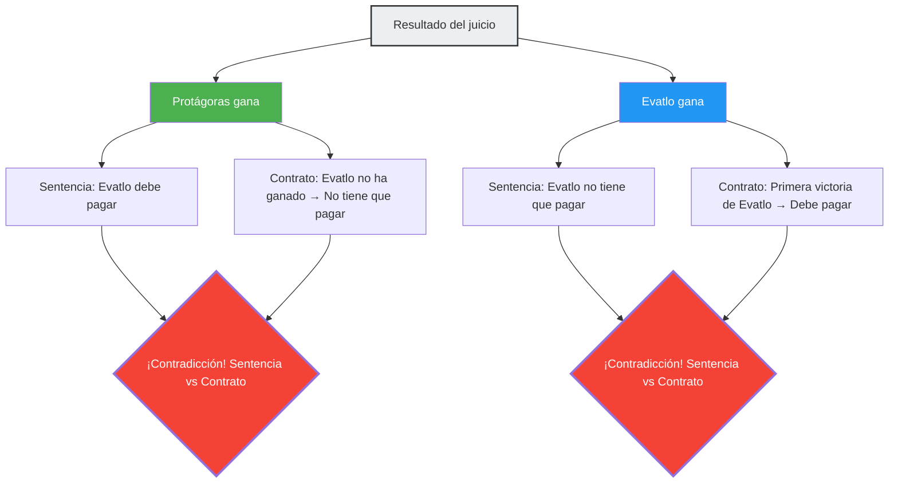

En la antigua Grecia, un joven llamado Evatlo se convirtió en discípulo de Protágoras, el más grande de los sofistas (maestros de retórica). Entre ambos se acordó el siguiente contrato para el pago de las clases:

> **Términos del contrato:**
> Una vez que Evatlo haya completado todo el curso de retórica, pagará el resto de sus clases a Protágoras **en el momento en que gane su primer juicio**.

Evatlo fue un estudiante excelente y completó espléndidamente todo el curso de retórica.
Sin embargo, después de graduarse, por alguna razón se negó a aceptar ningún caso judicial. Dado que al no ir a juicio la condición de "ganar su primer juicio" nunca se cumpliría, no tendría necesidad de pagar las clases.

Protágoras, perdiendo la paciencia, demandó a Evatlo ante los tribunales.
"Paga tus clases", le exigió.

Y a partir de aquí, comienza el laberinto lógico.

## La lógica del maestro Protágoras

Protágoras argumentó ante el tribunal:

"Jueces, pase lo que pase, yo gano.
- Si **yo gano** este juicio, la sentencia del tribunal obligará a Evatlo a pagarme las clases.
- Si **yo pierdo** este juicio, para Evatlo significará que 'ha ganado su primer juicio'. Es decir, se cumple la condición del contrato, y en virtud de este, deberá pagar las clases.

En cualquier caso, él tiene la obligación de pagar."

## La lógica del discípulo Evatlo

Ante esto, Evatlo no se quedó atrás.

"Jueces, pase lo que pase, yo gano.
- Si **yo gano** este juicio, la sentencia del tribunal dirá que no tengo que pagar las clases.
- Si **yo pierdo** este juicio, todavía no habré 'ganado mi primer juicio'. Es decir, la condición del contrato no se ha cumplido, por lo que legalmente no tengo obligación de pagar las clases.

En cualquier caso, no tengo que pagar."

## ¿Por qué se contradice?

La causa fundamental de esta paradoja es que **dos sistemas de reglas diferentes (la ley y el contrato) emiten juicios contradictorios entre sí**.

- **Regla legal**: Obedecer la sentencia del tribunal.
- **Regla del contrato**: Obedecer la condición "Pagar al ganar el primer juicio".

Normalmente, la ley y el contrato funcionan como dominios independientes, pero debido a que Protágoras hizo del "pago de las clases" el objeto de disputa en el juicio, el resultado mismo de este juicio afectó la condición del contrato, haciendo que ambos sistemas cayeran en un bucle autorreferencial.

## La respuesta de los juristas

El jurista de la antigua Roma, Aulo Gelio, ofreció la siguiente solución a este problema:

"El tribunal debería dictar un fallo favorable a Evatlo (no pago). Porque es un hecho que la condición del contrato aún no se ha cumplido. Sin embargo, después de este fallo, Protágoras puede demandar a Evatlo **de nuevo**. Porque con la victoria de Evatlo en el primer juicio, la condición del contrato se cumplió. En el segundo juicio, Protágoras ganará."

Es decir, la respuesta es que si intentas resolver la paradoja "simultáneamente en un solo juicio", surge la contradicción, pero si la procesas "dividida en dos veces", la contradicción se resuelve.

## La conexión con las paradojas de autorreferencia

La paradoja de Protágoras tiene la misma **estructura autorreferencial** que la "Paradoja del mentiroso ('Esta oración es falsa')" o la "Paradoja de Russell". Una proposición (la conclusión del juicio) afecta la condición (el cumplimiento del contrato) que determina su propia veracidad.

Este tipo de paradoja está profundamente relacionada con problemas que muestran los límites fundamentales de la lógica y la computación, como el "Problema de la parada (es imposible crear un programa que determine si cierto programa se detendrá o no)" en la informática moderna y los teoremas de incompletitud de Gödel.

La paradoja de Protágoras es una advertencia de hace 2400 años que nos enseña que los sistemas de reglas creados por los humanos (como las leyes y los contratos) pueden colapsar internamente debido a una ingeniosa autorreferencia.
