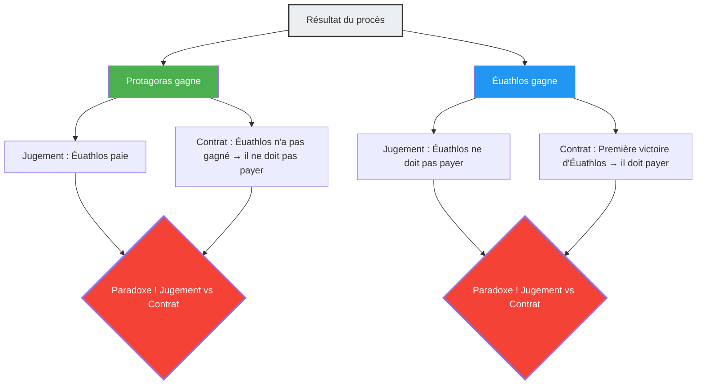

---
title: "Le maître et l'élève, un procès paradoxal quel que soit le gagnant : le paradoxe de Protagoras"
description: "Un litige juridique entre maître et élève concernant les conditions de paiement des frais de scolarité. Un paradoxe juridique de la Grèce antique où la logique se contredit, quel que soit le vainqueur ou le vaincu."
date: 2026-09-10T21:00:00+09:00
draft: false
slug: "paradox-of-the-court"
image: "img/paradox_of_court.jpg"
math: true
mermaid: true
categories: ["Paradoxes mathématiques", "Philosophie", "Logique"]
tags: ["Paradoxe", "Auto-référence", "Droit", "Protagoras", "Logique"]
---

Dans la Grèce antique, un jeune homme nommé Éuathlos est devenu le disciple de Protagoras, le plus grand des sophistes (professeur de rhétorique). Un contrat concernant le paiement des frais de scolarité a été conclu entre les deux :

> **Conditions du contrat :**
> Après avoir terminé l'intégralité du cursus de rhétorique, Éuathlos paiera le solde de ses frais de scolarité à Protagoras **dès qu'il aura gagné son premier procès**.

Éuathlos était un excellent élève et a brillamment achevé l'ensemble du cursus de rhétorique.
Cependant, après avoir terminé, il a refusé d'accepter le moindre procès pour une raison ou une autre. S'il ne va pas au tribunal, la condition de "gagner son premier procès" ne sera jamais remplie, et il n'aura donc pas à payer ses frais de scolarité.

Exaspéré, Protagoras a poursuivi Éuathlos en justice.
En exigeant : "Paie tes frais de scolarité".

Et c'est ici que commence le labyrinthe de la logique.

## La logique du maître Protagoras

Au tribunal, Protagoras a argumenté ainsi :

"Juges, quoi qu'il arrive, je gagne.
- Si **je gagne** ce procès, selon la décision du tribunal, Éuathlos devra me payer les frais de scolarité.
- Si **je perds** ce procès, cela signifiera pour Éuathlos qu'il aura 'gagné son premier procès'. Ainsi, la condition du contrat est remplie et, selon le contrat, il devra payer les frais de scolarité.

Dans les deux cas, il a l'obligation de payer les frais de scolarité."

## La logique de l'élève Éuathlos

Face à cela, Éuathlos ne se laissa pas faire.

"Juges, quoi qu'il arrive, je gagne.
- Si **je gagne** ce procès, selon la décision du tribunal, je n'ai pas à payer de frais de scolarité.
- Si **je perds** ce procès, je n'aurai pas encore 'gagné mon premier procès'. Ainsi, la condition du contrat n'est pas remplie, et selon le contrat, je n'ai aucune obligation de payer les frais de scolarité.

Dans les deux cas, je n'ai pas à payer de frais de scolarité."

## Pourquoi y a-t-il une contradiction ?

La cause fondamentale de ce paradoxe est que **deux systèmes de règles différents (la loi et le contrat) aboutissent à des décisions contradictoires**.

- **Règle de la loi** : Obéir au jugement du tribunal.
- **Règle du contrat** : Obéir à la condition "payer en cas de victoire au premier procès".

Normalement, la loi et le contrat fonctionnent comme des domaines indépendants, mais du fait que Protagoras a fait du "paiement des frais de scolarité" l'objet du litige, le résultat du procès lui-même a influencé les conditions du contrat, enfermant les deux systèmes dans une boucle auto-référentielle.

## La réponse des juristes

Le juriste romain antique Aulu-Gelle a proposé la solution suivante à ce problème :

"Le tribunal devrait rendre un jugement favorable à Éuathlos (aucun paiement requis). En effet, il est vrai que les conditions du contrat ne sont pas encore remplies. Cependant, après ce jugement, Protagoras peut poursuivre Éuathlos **une seconde fois**. Car, la victoire d'Éuathlos lors du premier procès a rempli la condition du contrat. Lors du second procès, Protagoras gagnera."

En d'autres termes, la réponse est que tenter de résoudre le paradoxe "en un seul procès simultanément" crée une contradiction, mais que la contradiction peut être résolue si l'affaire est traitée "en deux temps".

## Lien avec les paradoxes de l'auto-référence

Le paradoxe de Protagoras possède la même **structure d'auto-référence** que le "paradoxe du menteur ('Cette phrase est fausse')" ou le "paradoxe de Russell". Une proposition (la conclusion du procès) influence les conditions mêmes (la réalisation du contrat) qui déterminent sa propre vérité ou fausseté.

Ce type de paradoxe est profondément lié aux problèmes montrant les limites fondamentales de la logique et du calcul, tels que le "problème de l'arrêt (il est impossible de créer un programme capable de déterminer si un autre programme s'arrêtera)" en informatique moderne, ou le théorème d'incomplétude de Gödel.

Le paradoxe de Protagoras est un avertissement vieux de 2400 ans qui nous enseigne que les systèmes de règles créés par l'homme (comme les lois ou les contrats) peuvent s'effondrer de l'intérieur à cause d'une auto-référence astucieuse.
