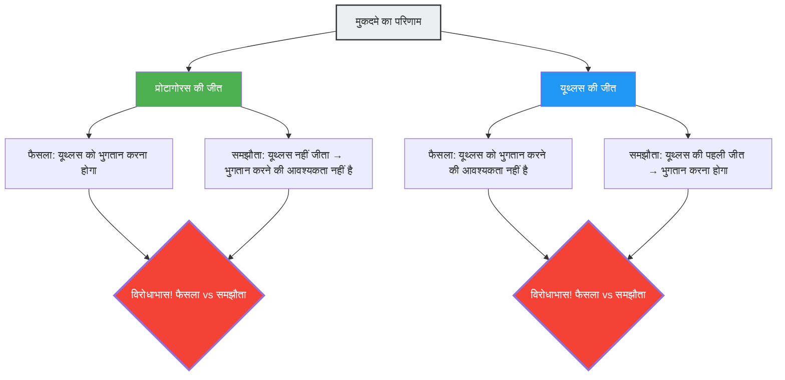

---
title: "गुरु और शिष्य, जो भी जीते अदालत में विरोधाभास: प्रोटागोरस का विरोधाभास"
description: "ट्यूशन फीस के भुगतान की शर्तों को लेकर गुरु और शिष्य के बीच अदालती विवाद। प्राचीन यूनान का एक कानूनी विरोधाभास जहाँ किसी की भी जीत या हार होने पर तर्क विरोधाभासी हो जाता है।"
date: 2026-09-10T21:00:00+09:00
draft: false
slug: "paradox-of-the-court"
image: "img/paradox_of_court.jpg"
math: true
mermaid: true
categories: ["गणितीय विरोधाभास", "दर्शन", "तर्कशास्त्र"]
tags: ["विरोधाभास", "स्व-संदर्भ", "कानून", "प्रोटागोरस", "तर्क"]
---

प्राचीन यूनान में, सबसे महान सोफिस्ट (वक्तृत्व कला के शिक्षक) प्रोटागोरस के पास यूथ्लस (Euathlus) नाम का एक युवक शिष्य बना। दोनों के बीच ट्यूशन फीस के भुगतान के लिए निम्नलिखित समझौता हुआ:

> **समझौते की शर्तें:**
> यूथ्लस वक्तृत्व कला का पूरा पाठ्यक्रम समाप्त करने के बाद, **अपना पहला मुकदमा जीतने पर**, ट्यूशन फीस की शेष राशि प्रोटागोरस को चुकाएगा।

यूथ्लस एक मेधावी छात्र था और उसने वक्तृत्व कला का पूरा पाठ्यक्रम सफलतापूर्वक पूरा किया।
लेकिन पाठ्यक्रम पूरा करने के बाद, उसने किसी कारणवश कोई भी मुकदमा लेने से इंकार कर दिया। चूँकि वह अदालत में नहीं गया, इसलिए "पहला मुकदमा जीतने" की शर्त कभी पूरी नहीं होगी, और इसलिए उसे ट्यूशन फीस चुकाने की आवश्यकता नहीं है।

निराश होकर प्रोटागोरस ने यूथ्लस पर अदालत में मुकदमा दायर कर दिया।
यह मांग करते हुए कि "ट्यूशन फीस चुकाओ"।

और यहीं से तर्क की भूलभुलैया शुरू होती है।

## गुरु प्रोटागोरस का तर्क

प्रोटागोरस ने अदालत में यह तर्क दिया:

"हे न्यायाधीश, चाहे कुछ भी हो, मेरी ही जीत होगी।
- यदि मैं इस मुकदमे में **जीतता हूँ**, तो अदालत के फैसले के अनुसार यूथ्लस को मुझे ट्यूशन फीस चुकानी होगी।
- यदि मैं इस मुकदमे में **हारता हूँ**, तो यूथ्लस के लिए यह उसका 'पहला जीता हुआ मुकदमा' होगा। इसका मतलब है कि समझौते की शर्त पूरी हो गई है, और समझौते के अनुसार उसे ट्यूशन फीस चुकानी होगी।

दोनों ही मामलों में, ट्यूशन फीस चुकाना उसका दायित्व है।"

## शिष्य यूथ्लस का तर्क

इसके जवाब में, यूथ्लस ने भी हार नहीं मानी।

"हे न्यायाधीश, चाहे कुछ भी हो, मेरी ही जीत होगी।
- यदि मैं इस मुकदमे में **जीतता हूँ**, तो अदालत के फैसले के अनुसार मुझे ट्यूशन फीस चुकाने की आवश्यकता नहीं है।
- यदि मैं इस मुकदमे में **हारता हूँ**, तो मैंने अभी तक अपना 'पहला मुकदमा नहीं जीता' है। इसका मतलब है कि समझौते की शर्त पूरी नहीं हुई है, इसलिए समझौते के अनुसार मुझे ट्यूशन फीस चुकाने की आवश्यकता नहीं है।

दोनों ही मामलों में, मुझे ट्यूशन फीस चुकाने की आवश्यकता नहीं है।"

## विरोधाभास क्यों होता है

इस विरोधाभास का मूल कारण यह है कि **दो अलग-अलग नियम प्रणालियां (कानून और समझौता) एक-दूसरे के विपरीत निर्णय देती हैं**।

- **कानून का नियम**: अदालत के फैसले का पालन करें।
- **समझौते का नियम**: "पहला मुकदमा जीतने पर भुगतान करें" की शर्त का पालन करें।

आमतौर पर, कानून और अनुबंध स्वतंत्र डोमेन के रूप में कार्य करते हैं, लेकिन जब प्रोटागोरस ने "ट्यूशन फीस के भुगतान" को मुकदमे का विवादित बिंदु बना दिया, तो मुकदमे का परिणाम ही समझौते की शर्त को प्रभावित करने लगा, जिससे दोनों प्रणालियां एक स्व-संदर्भित (self-referential) पाश (loop) में फंस गईं।

## न्यायविदों का जवाब

प्राचीन रोम के न्यायविद ऑलस गेलियस ने इस समस्या का निम्नलिखित समाधान प्रस्तुत किया:

"अदालत को यूथ्लस के पक्ष में फैसला सुनाना चाहिए (भुगतान की आवश्यकता नहीं)। क्योंकि यह एक तथ्य है कि समझौते की शर्तें अभी तक पूरी नहीं हुई हैं। हालाँकि, इस फैसले के बाद, प्रोटागोरस यूथ्लस पर **दोबारा** मुकदमा कर सकता है। क्योंकि पहले मुकदमे में यूथ्लस की जीत होने से समझौते की शर्त पूरी हो गई है। दूसरे मुकदमे में, प्रोटागोरस जीत जाएगा।"

दूसरे शब्दों में, यदि आप "एक ही मुकदमे में विरोधाभास को सुलझाने" का प्रयास करते हैं, तो एक विरोधाभास उत्पन्न होता है, लेकिन यदि आप इसे "दो चरणों में" संभालते हैं, तो विरोधाभास का समाधान किया जा सकता है। यह उनका उत्तर है।

## स्व-संदर्भित विरोधाभासों से संबंध

प्रोटागोरस के विरोधाभास में उसी तरह की **स्व-संदर्भित संरचना (self-referential structure)** है जैसे कि "लायर्स पैराडॉक्स ('यह वाक्य झूठा है')" और "रसेल का पैराडॉक्स"। एक प्रस्ताव (मुकदमे का निष्कर्ष) उन शर्तों (समझौते की पूर्ति) को प्रभावित करता है जो उसके स्वयं के सत्य या असत्य को निर्धारित करते हैं।

इस प्रकार के विरोधाभास आधुनिक कंप्यूटर विज्ञान में "हाल्टिंग प्रॉब्लम (यह निर्धारित करने वाला प्रोग्राम बनाना असंभव है कि कोई अन्य प्रोग्राम रुकेगा या नहीं)" और गोडेल के अपूर्णता प्रमेय जैसी समस्याओं से गहराई से जुड़े हैं, जो तर्क और गणना की मूलभूत सीमाओं को दर्शाते हैं।

प्रोटागोरस का विरोधाभास 2400 साल पुरानी एक चेतावनी है जो हमें सिखाती है कि मानव निर्मित नियम प्रणालियां (कानून और समझौते) चतुर स्व-संदर्भ (self-reference) के माध्यम से आंतरिक रूप से कैसे ढह सकती हैं।
